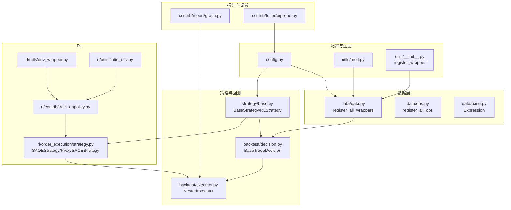
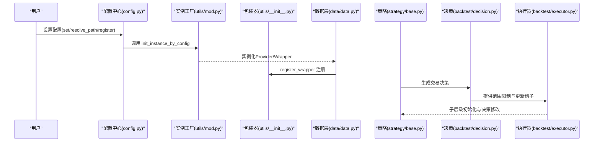
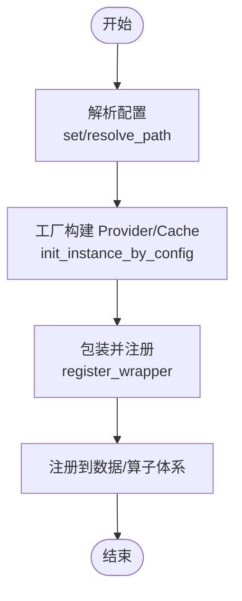
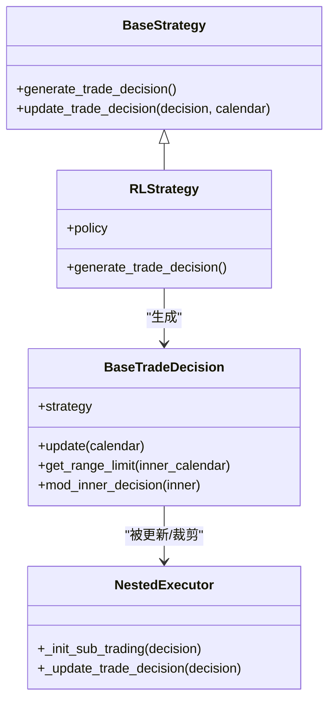
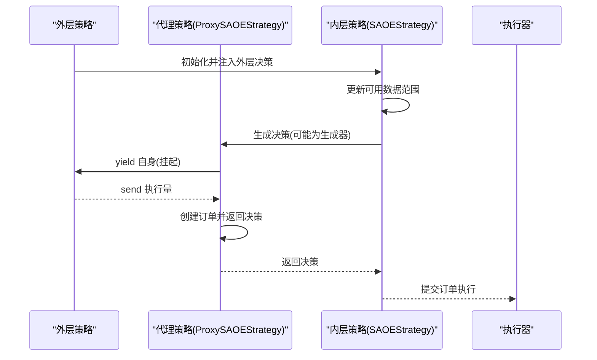
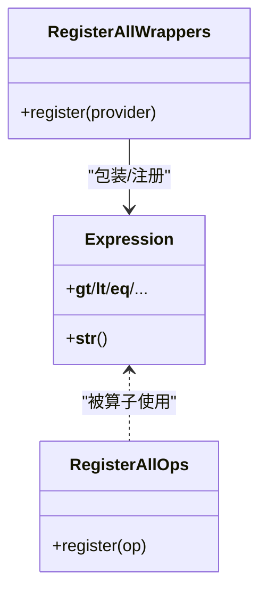
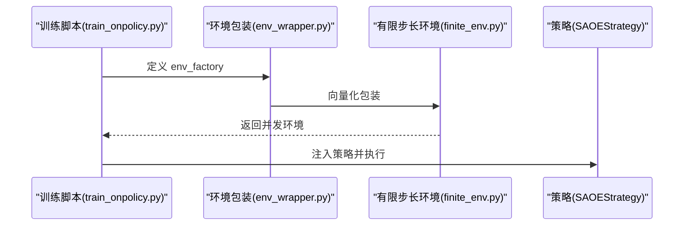
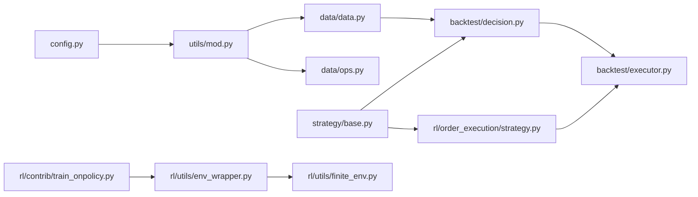

# 设计模式应用

<cite>
**本文引用的文件**
- [config.py](file://qlib/config.py)
- [data.py](file://qlib/data/data.py)
- [ops.py](file://qlib/data/ops.py)
- [__init__.py（工具模块）](file://qlib/utils/__init__.py)
- [mod.py](file://qlib/utils/mod.py)
- [base.py（策略基类）](file://qlib/strategy/base.py)
- [decision.py](file://qlib/backtest/decision.py)
- [executor.py](file://qlib/backtest/executor.py)
- [strategy.py（RL订单执行策略）](file://qlib/rl/order_execution/strategy.py)
- [graph.py](file://qlib/contrib/report/graph.py)
- [pipeline.py（调参流水线）](file://qlib/contrib/tuner/pipeline.py)
- [train_onpolicy.py（RL训练辅助）](file://qlib/rl/contrib/train_onpolicy.py)
- [env_wrapper.py（RL环境包装）](file://qlib/rl/utils/env_wrapper.py)
- [finite_env.py（有限步长环境）](file://qlib/rl/utils/finite_env.py)
- [base.py（数据表达式基类）](file://qlib/data/base.py)
</cite>

## 目录
1. [引言](#引言)
2. [项目结构](#项目结构)
3. [核心组件](#核心组件)
4. [架构总览](#架构总览)
5. [详细组件分析](#详细组件分析)
6. [依赖关系分析](#依赖关系分析)
7. [性能考量](#性能考量)
8. [故障排查指南](#故障排查指南)
9. [结论](#结论)
10. [附录](#附录)

## 引言
本文件聚焦于Qlib在量化研究与交易回测中的设计模式应用，系统梳理插件化架构、配置驱动、工厂模式、观察者/钩子模式、策略模式等在代码中的落地方式与工程价值。通过对关键模块的类图、时序图与流程图进行可视化呈现，阐明这些模式如何提升系统的灵活性、可扩展性与可维护性，并总结模式组合使用与设计权衡。

## 项目结构
Qlib采用分层与功能域结合的组织方式：配置与注册中心、数据层（表达式/算子/加载器）、策略与回测、RL训练与仿真、报告与调参等。核心设计模式主要分布在以下区域：
- 配置与注册：config.py、utils/mod.py、utils/__init__.py
- 数据与表达式：data/data.py、data/ops.py、data/base.py
- 策略与决策：strategy/base.py、backtest/decision.py、backtest/executor.py
- RL策略与执行：rl/order_execution/strategy.py、rl/contrib/train_onpolicy.py、rl/utils/env_wrapper.py、rl/utils/finite_env.py
- 报告与调参：contrib/report/graph.py、contrib/tuner/pipeline.py

图表来源
- [config.py:482-488](file://qlib/config.py#L482-L488)
- [data.py:1291-1332](file://qlib/data/data.py#L1291-L1332)
- [ops.py:1669](file://qlib/data/ops.py#L1669)
- [base.py（策略基类）:22-260](file://qlib/strategy/base.py#L22-L260)
- [decision.py:302-536](file://qlib/backtest/decision.py#L302-L536)
- [executor.py:389-404](file://qlib/backtest/executor.py#L389-L404)
- [strategy.py（RL订单执行策略）:301-433](file://qlib/rl/order_execution/strategy.py#L301-L433)
- [train_onpolicy.py:115-191](file://qlib/rl/contrib/train_onpolicy.py#L115-L191)
- [env_wrapper.py:65-66](file://qlib/rl/utils/env_wrapper.py#L65-L66)
- [finite_env.py:313-368](file://qlib/rl/utils/finite_env.py#L313-L368)
- [base.py（数据表达式基类）:13-58](file://qlib/data/base.py#L13-L58)

章节来源
- [config.py:424-488](file://qlib/config.py#L424-L488)
- [data.py:1291-1332](file://qlib/data/data.py#L1291-L1332)

## 核心组件
本节从设计模式视角对关键组件进行剖析，重点说明其职责、交互与扩展点。

- 插件化与配置驱动
  - 通过配置字典描述类路径与参数，运行时动态实例化，实现“配置即插件”的解耦。
  - 关键点：config.py 的 set/register 流程；utils/mod.py 的 init_instance_by_config；utils/__init__.py 的 register_wrapper。
- 工厂模式
  - 在数据层与策略层广泛使用：根据配置构造具体 Provider、Wrapper、策略实例。
  - 关键点：data/data.py 的 register_all_wrappers；data/ops.py 的 register_all_ops；rl 训练辅助中的 env_factory。
- 观察者/钩子模式
  - 决策更新与范围限制、外层策略对内层决策的修改、RL策略对执行结果的后处理钩子。
  - 关键点：backtest/decision.py 的 update/get_range_limit/mod_inner_decision；rl/order_execution/strategy.py 的 post_exe_step。
- 策略模式
  - 将不同交易策略封装为独立类，统一接口生成交易决策，便于替换与组合。
  - 关键点：strategy/base.py 的 BaseStrategy/RLStrategy；rl/order_execution/strategy.py 的 SAOEStrategy 及其子类。

章节来源
- [config.py:424-488](file://qlib/config.py#L424-L488)
- [mod.py:122-184](file://qlib/utils/mod.py#L122-L184)
- [__init__.py（工具模块）:876-886](file://qlib/utils/__init__.py#L876-L886)
- [data.py:1291-1332](file://qlib/data/data.py#L1291-L1332)
- [ops.py:1627](file://qlib/data/ops.py#L1627)
- [decision.py:361-450](file://qlib/backtest/decision.py#L361-L450)
- [strategy.py（RL订单执行策略）:367-380](file://qlib/rl/order_execution/strategy.py#L367-L380)
- [base.py（策略基类）:22-260](file://qlib/strategy/base.py#L22-L260)

## 架构总览
下图展示配置驱动的插件化装配链路，以及策略与回测的协作关系。该链路由“配置解析—实例工厂—包装器注册—策略决策—执行器”构成，体现了高内聚、低耦合与可替换性。

图表来源
- [config.py:424-488](file://qlib/config.py#L424-L488)
- [mod.py:122-184](file://qlib/utils/mod.py#L122-L184)
- [__init__.py（工具模块）:876-886](file://qlib/utils/__init__.py#L876-L886)
- [data.py:1291-1332](file://qlib/data/data.py#L1291-L1332)
- [base.py（策略基类）:22-260](file://qlib/strategy/base.py#L22-L260)
- [decision.py:361-450](file://qlib/backtest/decision.py#L361-L450)
- [executor.py:389-404](file://qlib/backtest/executor.py#L389-L404)

## 详细组件分析

### 组件A：配置驱动与插件化装配（工厂+注册）
- 模式要点
  - 配置驱动：set/resolve_path/register 统一入口，支持路径解析、缓存依赖检查与注册。
  - 工厂模式：init_instance_by_config 支持字符串/路径/字典三种形式，自动解析模块与参数。
  - 注册模式：register_wrapper 将实例注册到目标包装器，形成可插拔的数据与算子体系。
- 关键流程
  - 解析 provider/dataset/expression 的 Provider 与 Cache 组合，按需包装并注册。
  - 对表达式与数据集分别建立 Wrapper，确保上层透明调用。
- 复杂度与性能
  - 动态导入与实例化带来少量开销，但换取了极高的可扩展性；可通过缓存与懒加载优化。
- 错误处理
  - Redis 连接失败时自动降级禁用相关缓存并给出警告。
- 最佳实践
  - 将 Provider/Wrapper/策略均以配置描述，避免硬编码耦合；在 register 中集中管理依赖。

图表来源
- [config.py:424-488](file://qlib/config.py#L424-L488)
- [mod.py:122-184](file://qlib/utils/mod.py#L122-L184)
- [__init__.py（工具模块）:876-886](file://qlib/utils/__init__.py#L876-L886)
- [data.py:1291-1332](file://qlib/data/data.py#L1291-L1332)

章节来源
- [config.py:424-488](file://qlib/config.py#L424-L488)
- [mod.py:122-184](file://qlib/utils/mod.py#L122-L184)
- [__init__.py（工具模块）:876-886](file://qlib/utils/__init__.py#L876-L886)
- [data.py:1291-1332](file://qlib/data/data.py#L1291-L1332)

### 组件B：策略与决策（策略模式+观察者/钩子）
- 模式要点
  - 策略模式：BaseStrategy 定义统一接口，RLStrategy/RLIntStrategy 等具体策略实现差异化行为。
  - 观察者/钩子：决策对象提供 update 钩子，允许外层策略在时间步更新时调整内层决策；同时支持范围裁剪与数据日历映射。
- 关键流程
  - 外层策略生成决策并设置 trade_range；内层策略在每步 update 中获取最新信息并可能返回新决策。
  - NestedExecutor 在初始化子交易与更新决策时，调用策略钩子完成跨层影响。
- 复杂度与性能
  - 决策更新与范围计算涉及日历定位，注意避免重复计算；可通过缓存 trade_range 的索引区间。
- 错误处理
  - 当未提供 trade_range 且无默认值时抛出异常，调用方需显式提供或捕获错误。
- 最佳实践
  - 明确内外层策略边界，仅通过决策对象暴露必要接口；在 update 中做最小必要的状态同步。

图表来源
- [base.py（策略基类）:22-260](file://qlib/strategy/base.py#L22-L260)
- [decision.py:302-536](file://qlib/backtest/decision.py#L302-L536)
- [executor.py:389-404](file://qlib/backtest/executor.py#L389-L404)

章节来源
- [base.py（策略基类）:22-260](file://qlib/strategy/base.py#L22-L260)
- [decision.py:361-450](file://qlib/backtest/decision.py#L361-L450)
- [executor.py:389-404](file://qlib/backtest/executor.py#L389-L404)

### 组件C：RL策略与代理（策略模式+生成器/协程）
- 模式要点
  - 策略模式：SAOEStrategy 封装基于 SAOEState 的策略逻辑；ProxySAOEStrategy 作为代理，将决策生成过程委托给外部策略。
  - 生成器/协程：通过生成器挂起与恢复，实现“让出控制权”式的跨层通信。
- 关键流程
  - SAOEStrategy 在每次生成决策前更新可用数据范围；代理策略通过 yield 将自身暴露给外层，由外层策略决定执行量。
- 复杂度与性能
  - 生成器挂起/恢复引入额外调度成本，但显著提升策略间协作的灵活性。
- 错误处理
  - 未提供执行结果时应跳过更新步骤，避免空操作。
- 最佳实践
  - 将策略内部状态与外部决策解耦，通过生成器传递上下文；在子类中仅实现 _generate_trade_decision。

图表来源
- [strategy.py（RL订单执行策略）:301-433](file://qlib/rl/order_execution/strategy.py#L301-L433)
- [executor.py:389-404](file://qlib/backtest/executor.py#L389-L404)

章节来源
- [strategy.py（RL订单执行策略）:301-433](file://qlib/rl/order_execution/strategy.py#L301-L433)
- [executor.py:389-404](file://qlib/backtest/executor.py#L389-L404)

### 组件D：数据表达式与算子（抽象基类+工厂）
- 模式要点
  - 抽象基类：Expression 定义统一的表达式语义与比较运算符重载，屏蔽底层实现差异。
  - 工厂/注册：register_all_ops 与 register_all_wrappers 将具体算子与包装器注册到全局表，支持按需启用。
- 关键流程
  - 表达式对象通过运算符生成复合表达式；算子注册后可被表达式树解析与求值。
- 复杂度与性能
  - 表达式树构建与求值存在递归成本，建议在高层缓存中间结果。
- 错误处理
  - 运算符重载返回具体算子类型，避免运行时类型判断。
- 最佳实践
  - 将复杂表达式拆分为原子算子，通过工厂注册与表达式组合实现可读性与复用性的平衡。

图表来源
- [base.py（数据表达式基类）:13-58](file://qlib/data/base.py#L13-L58)
- [ops.py:1627](file://qlib/data/ops.py#L1627)
- [data.py:1291-1332](file://qlib/data/data.py#L1291-L1332)

章节来源
- [base.py（数据表达式基类）:13-58](file://qlib/data/base.py#L13-L58)
- [ops.py:1627](file://qlib/data/ops.py#L1627)
- [data.py:1291-1332](file://qlib/data/data.py#L1291-L1332)

### 组件E：RL训练与环境工厂（工厂+策略）
- 模式要点
  - 工厂模式：env_factory 与 finite_env_cls 提供环境实例化与向量化包装，支持并发与种子迭代。
  - 策略模式：SAOEStrategy/RLStrategy 作为策略主体，配合训练脚本完成策略评估与学习。
- 关键流程
  - 训练脚本定义 simulator_fn/env_factory，传入 RL 训练框架；有限步长环境确保 episode 边界可控。
- 复杂度与性能
  - 并发环境实例化与数据加载是性能瓶颈，需合理设置并发度与批大小。
- 错误处理
  - 避免在工厂中使用 lambda 导致共享实例问题，需提供可调用对象。
- 最佳实践
  - 将环境构造与策略解耦，通过工厂函数注入；在策略中仅关注决策生成与指标采集。

图表来源
- [train_onpolicy.py:115-191](file://qlib/rl/contrib/train_onpolicy.py#L115-L191)
- [env_wrapper.py:65-66](file://qlib/rl/utils/env_wrapper.py#L65-L66)
- [finite_env.py:313-368](file://qlib/rl/utils/finite_env.py#L313-L368)
- [strategy.py（RL订单执行策略）:301-433](file://qlib/rl/order_execution/strategy.py#L301-L433)

章节来源
- [train_onpolicy.py:115-191](file://qlib/rl/contrib/train_onpolicy.py#L115-L191)
- [env_wrapper.py:65-66](file://qlib/rl/utils/env_wrapper.py#L65-L66)
- [finite_env.py:313-368](file://qlib/rl/utils/finite_env.py#L313-L368)
- [strategy.py（RL订单执行策略）:301-433](file://qlib/rl/order_execution/strategy.py#L301-L433)

### 组件F：报告与调参（策略模式+工厂）
- 模式要点
  - 策略模式：报告与调参模块以策略化的方式组织可视化与超参搜索流程。
  - 工厂模式：调参流水线通过配置构造 observer 等组件，支持文件存储等观察器类型。
- 关键流程
  - 调参流水线读取配置，实例化 observer 与评估器，驱动实验执行。
- 复杂度与性能
  - 文件存储 observer 增加 IO 成本，建议批量写入与异步落盘。
- 错误处理
  - 配置缺失或类型不匹配时，工厂会抛出异常，需在上层捕获并提示修复。
- 最佳实践
  - 将实验流程标准化为流水线，通过配置切换 observer 与评估指标，提升可重复性。

章节来源
- [pipeline.py（调参流水线）:59](file://qlib/contrib/tuner/pipeline.py#L59)
- [graph.py](file://qlib/contrib/report/graph.py)

## 依赖关系分析
- 组件耦合与内聚
  - 配置中心与工厂是系统“中枢”，向上承接用户配置，向下驱动各模块实例化，耦合度高但职责清晰。
  - 策略与回测通过决策对象解耦，仅在必要接口处耦合，内聚性良好。
- 外部依赖
  - Redis 缓存用于表达式与数据集缓存，连接失败时自动降级。
  - RL 训练依赖 Gym 环境与向量化包装，需注意工厂函数的正确性与并发安全。
- 循环依赖
  - 未发现直接循环导入；策略与执行器通过接口契约间接交互，避免循环引用。

图表来源
- [config.py:424-488](file://qlib/config.py#L424-L488)
- [mod.py:122-184](file://qlib/utils/mod.py#L122-L184)
- [data.py:1291-1332](file://qlib/data/data.py#L1291-L1332)
- [ops.py:1669](file://qlib/data/ops.py#L1669)
- [base.py（策略基类）:22-260](file://qlib/strategy/base.py#L22-L260)
- [decision.py:302-536](file://qlib/backtest/decision.py#L302-L536)
- [executor.py:389-404](file://qlib/backtest/executor.py#L389-L404)
- [strategy.py（RL订单执行策略）:301-433](file://qlib/rl/order_execution/strategy.py#L301-L433)
- [train_onpolicy.py:115-191](file://qlib/rl/contrib/train_onpolicy.py#L115-L191)
- [env_wrapper.py:65-66](file://qlib/rl/utils/env_wrapper.py#L65-L66)
- [finite_env.py:313-368](file://qlib/rl/utils/finite_env.py#L313-L368)

章节来源
- [config.py:424-488](file://qlib/config.py#L424-L488)
- [mod.py:122-184](file://qlib/utils/mod.py#L122-L184)
- [data.py:1291-1332](file://qlib/data/data.py#L1291-L1332)
- [ops.py:1669](file://qlib/data/ops.py#L1669)
- [base.py（策略基类）:22-260](file://qlib/strategy/base.py#L22-L260)
- [decision.py:302-536](file://qlib/backtest/decision.py#L302-L536)
- [executor.py:389-404](file://qlib/backtest/executor.py#L389-L404)
- [strategy.py（RL订单执行策略）:301-433](file://qlib/rl/order_execution/strategy.py#L301-L433)
- [train_onpolicy.py:115-191](file://qlib/rl/contrib/train_onpolicy.py#L115-L191)
- [env_wrapper.py:65-66](file://qlib/rl/utils/env_wrapper.py#L65-L66)
- [finite_env.py:313-368](file://qlib/rl/utils/finite_env.py#L313-L368)

## 性能考量
- 工厂与注册
  - 动态导入与实例化带来启动时延，建议在冷启动阶段预热常用 Provider/Wrapper。
- 决策与范围裁剪
  - 日历定位与范围裁剪涉及多次索引查找，可在策略层缓存 trade_range 的索引区间。
- RL训练
  - 并发环境实例化与数据加载是热点，建议使用有限步长环境与批量化数据准备。
- 缓存与降级
  - Redis 不可用时自动禁用相关缓存，避免阻塞主流程；可考虑本地缓存兜底。

## 故障排查指南
- 配置与路径
  - 若 provider_uri 与 mount_path 频率不匹配，将触发断言错误；请核对频率键集合一致性。
  - Redis 连接失败时会记录警告并禁用依赖 Redis 的缓存，请检查主机与端口配置。
- 工厂与实例化
  - init_instance_by_config 在参数冲突时会回退到不含 try_kwargs 的构造，若仍失败请检查配置字段类型。
- 决策范围
  - 未提供 trade_range 且未提供默认值时，get_range_limit 将抛出异常；请在上层提供范围或默认值。
- RL 策略
  - 使用生成器挂起/恢复时，确保外层策略正确 send 执行量；避免空执行结果导致更新异常。

章节来源
- [config.py:404-482](file://qlib/config.py#L404-L482)
- [mod.py:176-184](file://qlib/utils/mod.py#L176-L184)
- [decision.py:430-450](file://qlib/backtest/decision.py#L430-L450)
- [strategy.py（RL订单执行策略）:423-433](file://qlib/rl/order_execution/strategy.py#L423-L433)

## 结论
Qlib通过“配置驱动 + 工厂 + 注册 + 策略 + 观察者/钩子”的组合设计，实现了从数据表达式、策略决策到 RL 训练与报告调参的全链路可插拔架构。该设计在保证系统灵活性与可扩展性的同时，也要求在接口契约、工厂函数与缓存策略上严格遵循约定，以获得稳定与高性能的工程效果。

## 附录
- 模式选择的技术考量
  - 插件化与配置驱动：降低编译期耦合，提升运行期可替换性。
  - 工厂模式：统一实例化入口，简化扩展与测试。
  - 观察者/钩子：在不破坏封装的前提下实现跨层影响与增量增强。
  - 策略模式：将算法族封装为独立类，便于替换与组合。
- 设计权衡
  - 灵活与性能：动态导入与生成器带来额外开销，需在关键路径做优化。
  - 可靠性与可用性：Redis 降级与异常回退保障系统韧性。
- 最佳实践
  - 将所有可变点以配置描述；将工厂与注册集中在一处；通过接口契约约束策略实现；在高频路径缓存中间结果；在 RL 训练中谨慎使用并发与共享实例。