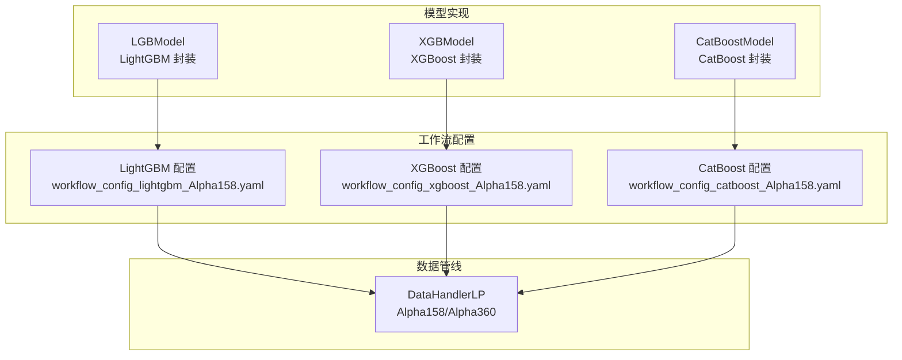
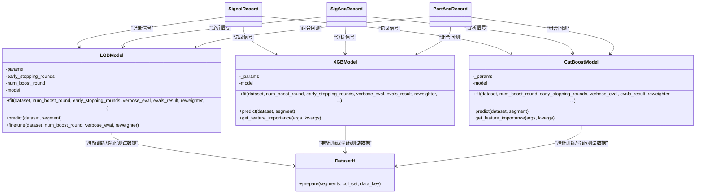
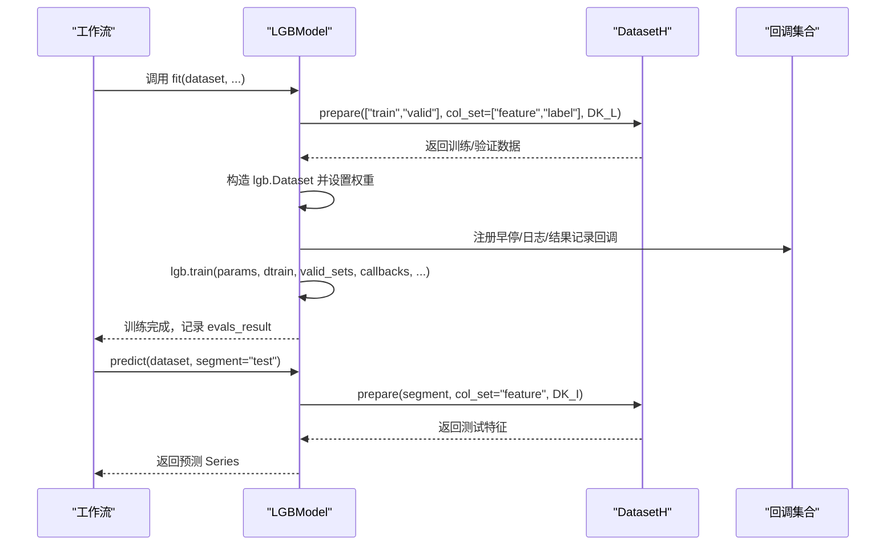
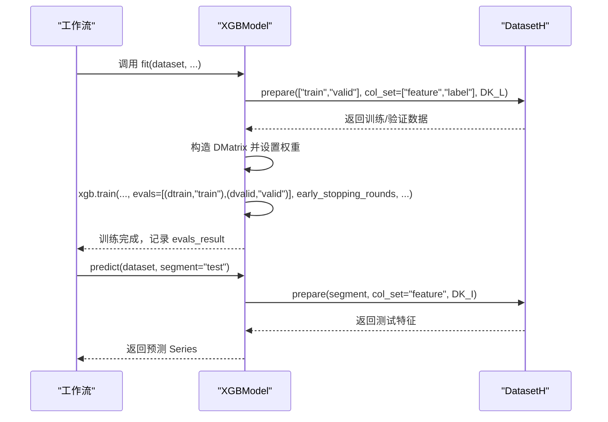
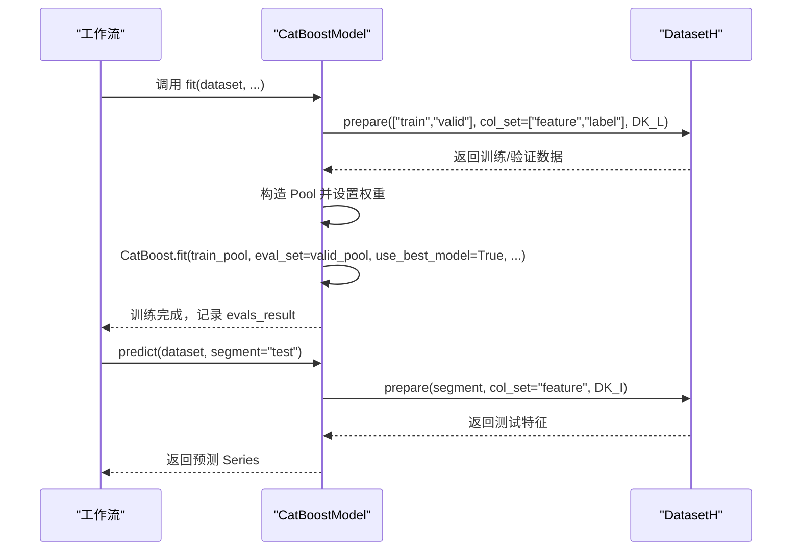
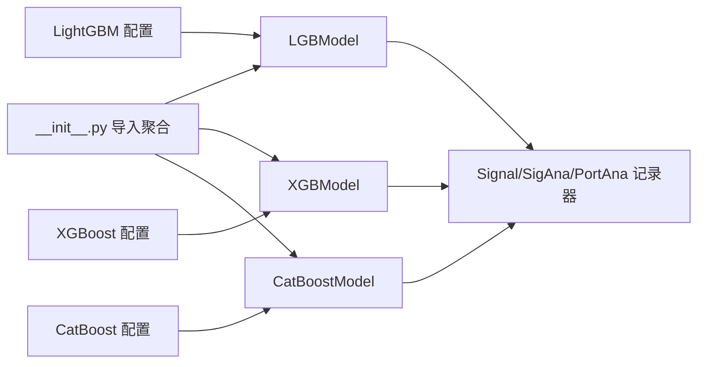

# 传统机器学习模型

<cite>
**本文引用的文件**
- [gbdt.py](file://qlib/contrib/model/gbdt.py)
- [xgboost.py](file://qlib/contrib/model/xgboost.py)
- [catboost_model.py](file://qlib/contrib/model/catboost_model.py)
- [workflow_config_lightgbm_Alpha158.yaml](file://examples/benchmarks/LightGBM/workflow_config_lightgbm_Alpha158.yaml)
- [workflow_config_xgboost_Alpha158.yaml](file://examples/benchmarks/XGBoost/workflow_config_xgboost_Alpha158.yaml)
- [workflow_config_catboost_Alpha158.yaml](file://examples/benchmarks/CatBoost/workflow_config_catboost_Alpha158.yaml)
- [__init__.py](file://qlib/contrib/model/__init__.py)
- [README.md](file://examples/benchmarks/README.md)
- [alpha158_factor_guide.md](file://alpha158_factor_guide.md)
</cite>

## 目录
1. [简介](#简介)
2. [项目结构](#项目结构)
3. [核心组件](#核心组件)
4. [架构总览](#架构总览)
5. [详细组件分析](#详细组件分析)
6. [依赖分析](#依赖分析)
7. [性能考虑](#性能考虑)
8. [故障排查指南](#故障排查指南)
9. [结论](#结论)
10. [附录](#附录)

## 简介
本文件面向在 Qlib 中使用传统梯度提升模型（LightGBM、XGBoost、CatBoost）进行因子挖掘与预测的用户，系统性介绍模型的类设计、训练流程、预测接口、参数配置要点、评估与回测记录方式，并结合 Alpha158 与 Alpha360 的数据管线给出完整的工作流配置参考。同时提供参数调优策略、交叉验证思路、过拟合处理建议以及基准测试运行与对比方法。

## 项目结构
围绕传统机器学习模型的关键文件组织如下：
- 模型实现：LightGBM、XGBoost、CatBoost 的封装类位于 qlib/contrib/model 下
- 工作流配置：examples/benchmarks 下针对各模型提供 Alpha158/Alpha360 的 YAML 配置示例
- 数据管线：Alpha158/Alpha360 的特征与标签定义位于 qlib/contrib/data/handler.py（用于理解因子集）
- 模型导出：qlib/contrib/model/__init__.py 聚合并按需导入各模型类

图表来源
- [gbdt.py:16-127](file://qlib/contrib/model/gbdt.py#L16-L127)
- [xgboost.py:15-86](file://qlib/contrib/model/xgboost.py#L15-L86)
- [catboost_model.py:17-101](file://qlib/contrib/model/catboost_model.py#L17-L101)
- [workflow_config_lightgbm_Alpha158.yaml:1-72](file://examples/benchmarks/LightGBM/workflow_config_lightgbm_Alpha158.yaml#L1-L72)
- [workflow_config_xgboost_Alpha158.yaml:1-70](file://examples/benchmarks/XGBoost/workflow_config_xgboost_Alpha158.yaml#L1-L70)
- [workflow_config_catboost_Alpha158.yaml:1-71](file://examples/benchmarks/CatBoost/workflow_config_catboost_Alpha158.yaml#L1-L71)

章节来源
- [gbdt.py:16-127](file://qlib/contrib/model/gbdt.py#L16-L127)
- [xgboost.py:15-86](file://qlib/contrib/model/xgboost.py#L15-L86)
- [catboost_model.py:17-101](file://qlib/contrib/model/catboost_model.py#L17-L101)
- [workflow_config_lightgbm_Alpha158.yaml:1-72](file://examples/benchmarks/LightGBM/workflow_config_lightgbm_Alpha158.yaml#L1-L72)
- [workflow_config_xgboost_Alpha158.yaml:1-70](file://examples/benchmarks/XGBoost/workflow_config_xgboost_Alpha158.yaml#L1-L70)
- [workflow_config_catboost_Alpha158.yaml:1-71](file://examples/benchmarks/CatBoost/workflow_config_catboost_Alpha158.yaml#L1-L71)

## 核心组件
- LGBModel（LightGBM）
  - 训练接口：fit(dataset, num_boost_round, early_stopping_rounds, verbose_eval, evals_result, reweighter, ...)
  - 预测接口：predict(dataset, segment="test")
  - 微调接口：finetune(dataset, num_boost_round, verbose_eval, reweighter)
  - 关键特性：支持样本权重重加权；自动记录验证曲线；支持“微调”增量训练
- XGBModel（XGBoost）
  - 训练接口：fit(...)，使用 DMatrix 包装输入
  - 预测接口：predict(...)
  - 特征重要性：get_feature_importance(...)
- CatBoostModel（CatBoost）
  - 训练接口：fit(...)，使用 Pool 包装输入
  - 预测接口：predict(...)
  - 特征重要性：get_feature_importance(...)
  - 设备选择：自动检测 GPU 并切换任务类型

章节来源
- [gbdt.py:16-127](file://qlib/contrib/model/gbdt.py#L16-L127)
- [xgboost.py:15-86](file://qlib/contrib/model/xgboost.py#L15-L86)
- [catboost_model.py:17-101](file://qlib/contrib/model/catboost_model.py#L17-L101)

## 架构总览
以下类图展示三个模型类与数据集、记录器之间的交互关系：

图表来源
- [gbdt.py:16-127](file://qlib/contrib/model/gbdt.py#L16-L127)
- [xgboost.py:15-86](file://qlib/contrib/model/xgboost.py#L15-L86)
- [catboost_model.py:17-101](file://qlib/contrib/model/catboost_model.py#L17-L101)
- [workflow_config_lightgbm_Alpha158.yaml:57-71](file://examples/benchmarks/LightGBM/workflow_config_lightgbm_Alpha158.yaml#L57-L71)
- [workflow_config_xgboost_Alpha158.yaml:55-69](file://examples/benchmarks/XGBoost/workflow_config_xgboost_Alpha158.yaml#L55-L69)
- [workflow_config_catboost_Alpha158.yaml:56-70](file://examples/benchmarks/CatBoost/workflow_config_catboost_Alpha158.yaml#L56-L70)

## 详细组件分析

### LightGBM 模型（LGBModel）
- 类职责
  - 封装 LightGBM 训练、预测与微调流程
  - 支持样本权重重加权（Reweighter）
  - 自动记录验证曲线到记录器
- 训练流程
  - 准备训练/验证数据，确保标签为一维数组
  - 构造 lgb.Dataset，设置权重
  - 使用回调函数启用早停、日志与结果记录
- 预测流程
  - 从数据集中提取特征矩阵，调用模型预测并返回 Series
- 微调流程
  - 在已有模型基础上继续训练若干轮，适用于在线增量学习

图表来源
- [gbdt.py:57-96](file://qlib/contrib/model/gbdt.py#L57-L96)

章节来源
- [gbdt.py:16-127](file://qlib/contrib/model/gbdt.py#L16-L127)

### XGBoost 模型（XGBModel）
- 类职责
  - 封装 XGBoost 训练、预测与特征重要性获取
  - 支持样本权重重加权
- 训练流程
  - 准备训练/验证数据，标签降维为一维
  - 使用 xgb.DMatrix 包装数据
  - 调用 xgb.train 进行训练，支持早停与评估结果记录
- 预测流程
  - 对测试集构造 DMatrix 并预测
- 特征重要性
  - 通过底层 Booster 的 get_score 获取并排序

图表来源
- [xgboost.py:23-75](file://qlib/contrib/model/xgboost.py#L23-L75)

章节来源
- [xgboost.py:15-86](file://qlib/contrib/model/xgboost.py#L15-L86)

### CatBoost 模型（CatBoostModel）
- 类职责
  - 封装 CatBoost 训练、预测与特征重要性获取
  - 自动检测 GPU 并选择任务类型
- 训练流程
  - 准备训练/验证数据，标签降维为一维
  - 使用 Pool 包装数据
  - 初始化 CatBoost 并 fit，使用最佳迭代结果
- 预测流程
  - 对测试集直接预测
- 特征重要性
  - 通过底层模型的 get_feature_importance 获取并排序

图表来源
- [catboost_model.py:28-84](file://qlib/contrib/model/catboost_model.py#L28-L84)

章节来源
- [catboost_model.py:17-101](file://qlib/contrib/model/catboost_model.py#L17-L101)

### Alpha158 与 Alpha360 数据管线
- Alpha158
  - 默认标签为未来两日相对收益的变换，特征维度约 158 维
  - 数据预处理包含去极值、标准化、填充等步骤
- Alpha360
  - 特征维度更高，覆盖更多时间序列与字段组合
- 数据处理器在工作流中作为 handler 注入，决定特征与标签的生成方式

章节来源
- [alpha158_factor_guide.md:802-862](file://alpha158_factor_guide.md#L802-L862)

## 依赖分析
- 模型导入聚合
  - qlib/contrib/model/__init__.py 动态导入各模型类，若缺失可选依赖会打印提示信息
- 模型类与外部库
  - LGBModel 依赖 lightgbm
  - XGBModel 依赖 xgboost
  - CatBoostModel 依赖 catboost
- 工作流配置
  - 各模型配置文件通过 task.model 指定类与模块路径，并传入具体参数
  - dataset.handler 指向 Alpha158 或 Alpha360 数据处理器
  - record 段落定义信号记录、信号分析与组合回测记录器

图表来源
- [__init__.py:1-43](file://qlib/contrib/model/__init__.py#L1-L43)
- [workflow_config_lightgbm_Alpha158.yaml:32-56](file://examples/benchmarks/LightGBM/workflow_config_lightgbm_Alpha158.yaml#L32-L56)
- [workflow_config_xgboost_Alpha158.yaml:32-54](file://examples/benchmarks/XGBoost/workflow_config_xgboost_Alpha158.yaml#L32-L54)
- [workflow_config_catboost_Alpha158.yaml:32-55](file://examples/benchmarks/CatBoost/workflow_config_catboost_Alpha158.yaml#L32-L55)

章节来源
- [__init__.py:1-43](file://qlib/contrib/model/__init__.py#L1-L43)
- [workflow_config_lightgbm_Alpha158.yaml:32-56](file://examples/benchmarks/LightGBM/workflow_config_lightgbm_Alpha158.yaml#L32-L56)
- [workflow_config_xgboost_Alpha158.yaml:32-54](file://examples/benchmarks/XGBoost/workflow_config_xgboost_Alpha158.yaml#L32-L54)
- [workflow_config_catboost_Alpha158.yaml:32-55](file://examples/benchmarks/CatBoost/workflow_config_catboost_Alpha158.yaml#L32-L55)

## 性能考虑
- 学习率（eta/learning_rate）
  - 建议从较小值开始（如 0.01~0.1），配合较大的树数量，以获得更稳健的收敛
- 树深度与叶子数（max_depth/num_leaves）
  - 深度过大易过拟合；可通过早停与正则化控制
- 子采样（subsample、colsample_bytree）
  - 降低过拟合风险，提高泛化能力
- 正则化（lambda_l1/l2、reg_alpha、reg_lambda）
  - 控制复杂度，提升鲁棒性
- 早停（early_stopping_rounds）
  - 在验证集上监控指标，防止过度训练
- 样本权重（Reweighter）
  - 可对样本进行再加权，平衡类别或提升特定样本的重要性
- 多线程与设备
  - LightGBM/XGBoost 可设置线程数；CatBoost 自动检测 GPU 并切换任务类型

## 故障排查指南
- “多标签不支持”
  - LightGBM 与 CatBoost 的标签必须为一维数组；若标签为二维且仅一列，需降维
- “空数据”
  - 若数据集为空，请检查数据源、时间范围与分段配置
- “可选依赖未安装”
  - 若缺少 lightgbm/xgboost/catboost，__init__.py 会打印提示；请按需安装对应包
- “特征重要性为空”
  - 确认模型已完成训练后再调用特征重要性接口

章节来源
- [gbdt.py:42-46](file://qlib/contrib/model/gbdt.py#L42-L46)
- [catboost_model.py:48-52](file://qlib/contrib/model/catboost_model.py#L48-L52)
- [__init__.py:3-25](file://qlib/contrib/model/__init__.py#L3-L25)

## 结论
Qlib 提供了对 LightGBM、XGBoost、CatBoost 的统一封装，便于在标准数据管线与工作流中快速训练与评估。通过合理的参数调优（学习率、树深、子采样、正则化）、早停与样本权重策略，可在 Alpha158/Alpha360 上取得稳定性能。结合 SignalRecord、SigAnaRecord、PortAnaRecord，可完成从信号到组合回测的全流程评估。

## 附录

### 配置文件示例与使用说明
- LightGBM（Alpha158）
  - 模型类与模块路径：task.model.class/module_path
  - 参数示例：loss、colsample_bytree、learning_rate、subsample、lambda_l1、lambda_l2、max_depth、num_leaves、num_threads
  - 数据集：handler 指向 Alpha158，segments 定义 train/valid/test 时间区间
  - 记录器：SignalRecord、SigAnaRecord、PortAnaRecord
  - 参考路径：[workflow_config_lightgbm_Alpha158.yaml:1-72](file://examples/benchmarks/LightGBM/workflow_config_lightgbm_Alpha158.yaml#L1-L72)
- XGBoost（Alpha158）
  - 模型类与模块路径：task.model.class/module_path
  - 参数示例：eval_metric、colsample_bytree、eta、max_depth、n_estimators、subsample、nthread
  - 数据集：handler 指向 Alpha158，segments 定义 train/valid/test 时间区间
  - 记录器：SignalRecord、SigAnaRecord、PortAnaRecord
  - 参考路径：[workflow_config_xgboost_Alpha158.yaml:1-70](file://examples/benchmarks/XGBoost/workflow_config_xgboost_Alpha158.yaml#L1-L70)
- CatBoost（Alpha158）
  - 模型类与模块路径：task.model.class/module_path
  - 参数示例：loss、learning_rate、subsample、max_depth、num_leaves、thread_count、grow_policy、bootstrap_type
  - 数据集：handler 指向 Alpha158，segments 定义 train/valid/test 时间区间
  - 记录器：SignalRecord、SigAnaRecord、PortAnaRecord
  - 参考路径：[workflow_config_catboost_Alpha158.yaml:1-71](file://examples/benchmarks/CatBoost/workflow_config_catboost_Alpha158.yaml#L1-L71)

### Alpha158 与 Alpha360 的使用方法
- Alpha158
  - 特征维度约 158 维，标签为未来两日相对收益变换
  - 数据预处理包含 RobustZScore、ZScore、Clip、Fillna 等
  - 参考路径：[alpha158_factor_guide.md:802-862](file://alpha158_factor_guide.md#L802-L862)
- Alpha360
  - 特征维度更高，覆盖更多字段与滚动窗口
  - 可在工作流中替换 handler 为 Alpha360，其余配置保持一致

### 评估指标与回测记录
- 评估方式
  - 信号层面：IC（信息系数）、ICIR（信息比率）
  - 组合层面：年化收益、回撤、夏普比率、换手率等
- 记录器
  - SignalRecord：记录预测信号
  - SigAnaRecord：信号分析（含 IC/ICIR）
  - PortAnaRecord：组合回测分析
- 参考路径：[README.md:1-15](file://examples/benchmarks/README.md#L1-L15)