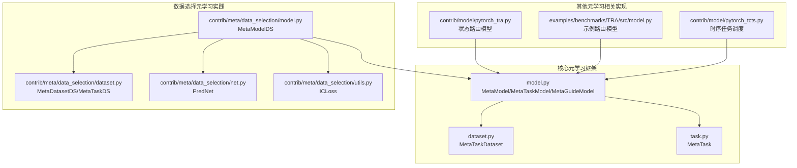
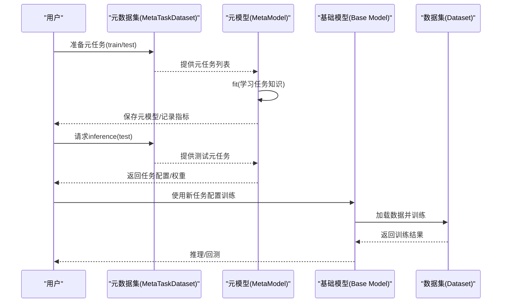
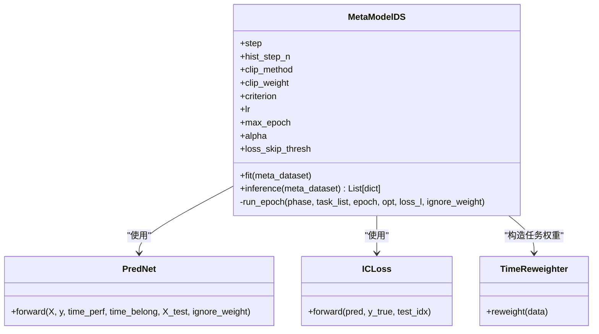
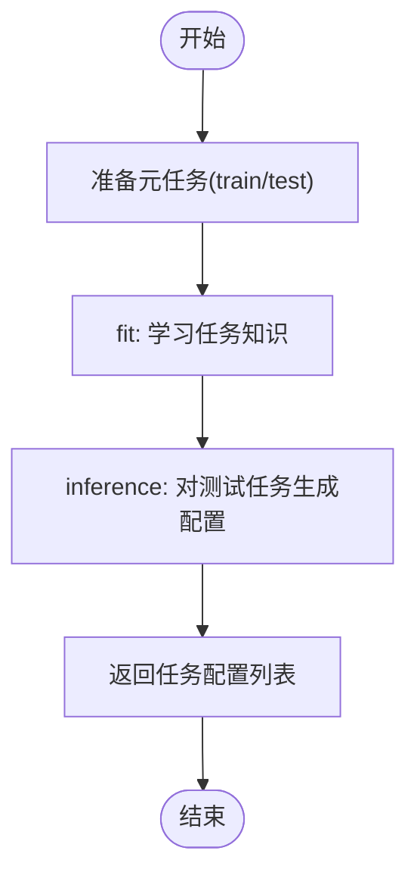
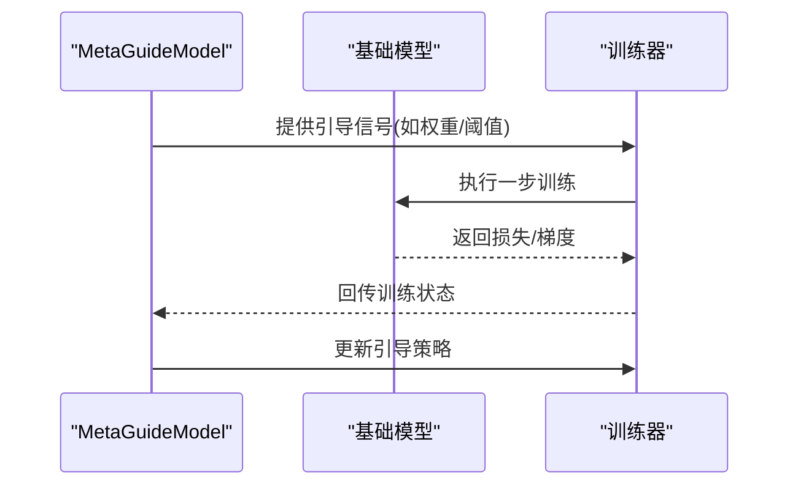
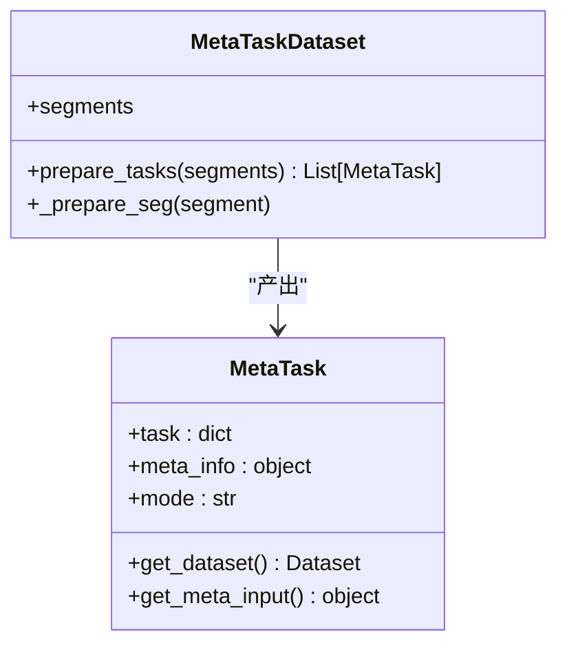
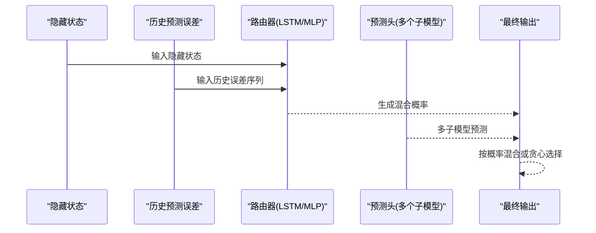
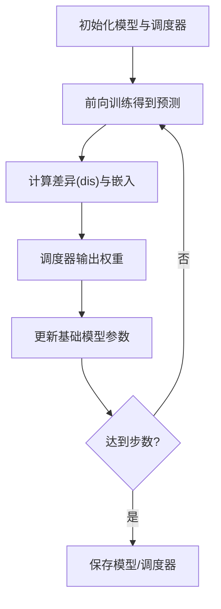
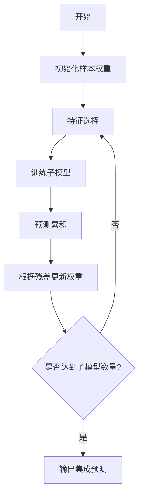
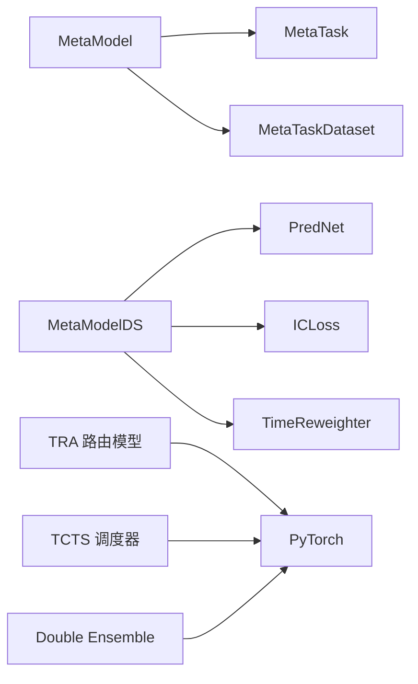

# 元学习模型

<cite>
**本文引用的文件**
- [model.py](file://qlib/model/meta/model.py)
- [dataset.py](file://qlib/model/meta/dataset.py)
- [task.py](file://qlib/model/meta/task.py)
- [model.py（数据选择）](file://qlib/contrib/meta/data_selection/model.py)
- [dataset.py（数据选择）](file://qlib/contrib/meta/data_selection/dataset.py)
- [net.py（数据选择）](file://qlib/contrib/meta/data_selection/net.py)
- [utils.py（数据选择）](file://qlib/contrib/meta/data_selection/utils.py)
- [pytorch_tra.py](file://qlib/contrib/model/pytorch_tra.py)
- [model.py（TRA 示例）](file://examples/benchmarks/TRA/src/model.py)
- [pytorch_tcts.py](file://qlib/contrib/model/pytorch_tcts.py)
- [README.md（TCTS）](file://examples/benchmarks/TCTS/README.md)
- [double_ensemble.py](file://qlib/contrib/model/double_ensemble.py)
</cite>

## 目录
1. [引言](#引言)
2. [项目结构](#项目结构)
3. [核心组件](#核心组件)
4. [架构总览](#架构总览)
5. [详细组件分析](#详细组件分析)
6. [依赖关系分析](#依赖关系分析)
7. [性能考量](#性能考量)
8. [故障排查指南](#故障排查指南)
9. [结论](#结论)
10. [附录](#附录)

## 引言
本文件系统性阐述 Qlib 中的元学习模型设计与实现，聚焦于量化投资场景下的动态模型选择、自适应学习与多任务学习。元学习通过“学会学习”的方式，在不同市场状态与任务分布下提升模型的泛化能力与适应性。Qlib 的元学习框架以任务为中心，提供两类元模型：任务定义型（MetaTaskModel）与过程引导型（MetaGuideModel），并配套元任务与元数据集抽象，形成可复用的元学习流水线。

## 项目结构
Qlib 的元学习能力主要由两部分组成：
- 核心元学习框架：位于 qlib/model/meta，提供元任务、元数据集与元模型的抽象接口。
- 元学习实践案例：位于 qlib/contrib/meta/data_selection，实现基于数据选择的元学习；examples/benchmarks 下包含基于预测错误的路由与任务调度等实践。



**图示来源**
- [model.py:10-75](file://qlib/model/meta/model.py#L10-L75)
- [dataset.py:10-78](file://qlib/model/meta/dataset.py#L10-L78)
- [task.py:8-57](file://qlib/model/meta/task.py#L8-L57)
- [model.py（数据选择）:40-197](file://qlib/contrib/meta/data_selection/model.py#L40-L197)
- [dataset.py（数据选择）](file://qlib/contrib/meta/data_selection/dataset.py)
- [net.py（数据选择）](file://qlib/contrib/meta/data_selection/net.py)
- [utils.py（数据选择）](file://qlib/contrib/meta/data_selection/utils.py)
- [pytorch_tra.py:677-719](file://qlib/contrib/model/pytorch_tra.py#L677-L719)
- [model.py（TRA 示例）:492-532](file://examples/benchmarks/TRA/src/model.py#L492-L532)
- [pytorch_tcts.py:138-171](file://qlib/contrib/model/pytorch_tcts.py#L138-L171)

**章节来源**
- [model.py:10-75](file://qlib/model/meta/model.py#L10-L75)
- [dataset.py:10-78](file://qlib/model/meta/dataset.py#L10-L78)
- [task.py:8-57](file://qlib/model/meta/task.py#L8-L57)
- [model.py（数据选择）:40-197](file://qlib/contrib/meta/data_selection/model.py#L40-L197)

## 核心组件
- 元模型基类与类型
  - MetaModel：抽象元模型接口，定义 fit 与 inference。
  - MetaTaskModel：面向任务定义的元模型，负责生成或修改任务配置以指导后续训练。
  - MetaGuideModel：面向训练过程引导的元模型，与基础模型在训练过程中交互。
- 元任务与元数据集
  - MetaTask：封装单个元任务，包含原始任务配置与元信息，支持多种处理模式（全量、测试、迁移）。
  - MetaTaskDataset：负责准备元任务集合，按分段（如 train/test）产出任务列表，支持序列化与跨数据集迁移。

上述组件共同构成元学习的“输入-决策-输出”闭环：元模型从元数据集中学习任务层面的知识，inference 输出可用于动态调整任务或训练过程的指导信号。

**章节来源**
- [model.py:10-75](file://qlib/model/meta/model.py#L10-L75)
- [task.py:8-57](file://qlib/model/meta/task.py#L8-L57)
- [dataset.py:10-78](file://qlib/model/meta/dataset.py#L10-L78)

## 架构总览
下图展示了元学习在 Qlib 中的整体架构：元模型接收元数据集，产出任务配置或训练过程指导；基础模型依据元模型的输出进行训练与推理。



**图示来源**
- [model.py:19-34](file://qlib/model/meta/model.py#L19-L34)
- [dataset.py:39-77](file://qlib/model/meta/dataset.py#L39-L77)
- [model.py（数据选择）:137-197](file://qlib/contrib/meta/data_selection/model.py#L137-L197)

## 详细组件分析

### 数据选择型元模型（MetaModelDS）
该实现以“元学习进行数据选择”为核心目标，通过代理损失（如 IC 损失）在元层学习时间维度上的样本权重，从而在基础模型训练中实现自适应加权。



**图示来源**
- [model.py（数据选择）:40-197](file://qlib/contrib/meta/data_selection/model.py#L40-L197)
- [net.py（数据选择）](file://qlib/contrib/meta/data_selection/net.py)
- [utils.py（数据选择）](file://qlib/contrib/meta/data_selection/utils.py)

关键流程（fit/inference）如下：

```mermaid
sequenceDiagram
participant MD as "MetaDatasetDS"
participant MDS as "MetaModelDS"
participant TN as "PredNet"
participant OPT as "优化器"
MD-->>MDS : prepare_tasks(["train","test"])
MDS->>TN : 初始化网络
loop 多轮训练
MDS->>OPT : zero_grad()
MDS->>TN : 前向计算(pred, weights)
MDS->>MDS : 计算IC损失或MSE
MDS->>OPT : 反向传播+更新
end
MDS-->>MD : inference(test) -> 返回带权重的任务配置
```

**图示来源**
- [model.py（数据选择）:74-181](file://qlib/contrib/meta/data_selection/model.py#L74-L181)

实现要点
- 代理损失：支持 IC 损失与 MSE，IC 损失通过 ICLoss 计算，避免极端标签导致的不稳定。
- 时间加权：根据时间维度上的表现估计权重，TimeReweighter 将权重注入到任务配置中，供基础模型重采样/重加权模块使用。
- 指标记录：通过 R.log_metrics 记录 loss/ic 等指标，便于监控与调参。

**章节来源**
- [model.py（数据选择）:40-197](file://qlib/contrib/meta/data_selection/model.py#L40-L197)
- [utils.py（数据选择）](file://qlib/contrib/meta/data_selection/utils.py)
- [net.py（数据选择）](file://qlib/contrib/meta/data_selection/net.py)

### 任务定义型元模型（MetaTaskModel）
MetaTaskModel 负责在元层对任务进行定义或改写，以便基础训练器执行。其核心在于：
- fit：从元数据集中获取元任务，学习任务层面的知识（例如任务难度、特征相关性等）。
- inference：对测试元任务进行推理，返回可被基础训练器执行的任务配置列表。



**图示来源**
- [model.py:37-61](file://qlib/model/meta/model.py#L37-L61)

**章节来源**
- [model.py:37-61](file://qlib/model/meta/model.py#L37-L61)

### 过程引导型元模型（MetaGuideModel）
MetaGuideModel 在基础模型训练过程中与其交互，用于动态控制训练策略（如学习率、正则、早停等）。其 fit 与 inference 由具体实现定义，通常需要与训练循环紧密耦合。



**图示来源**
- [model.py:64-75](file://qlib/model/meta/model.py#L64-L75)

**章节来源**
- [model.py:64-75](file://qlib/model/meta/model.py#L64-L75)

### 元任务与元数据集
- 元任务（MetaTask）：封装原始任务与元信息，支持三种处理模式，确保在不同阶段仅加载必要数据。
- 元数据集（MetaTaskDataset）：按分段准备任务，支持序列化与跨数据集迁移，便于元模型在不同时间段/市场环境下复用。



**图示来源**
- [task.py:8-57](file://qlib/model/meta/task.py#L8-L57)
- [dataset.py:10-78](file://qlib/model/meta/dataset.py#L10-L78)

**章节来源**
- [task.py:8-57](file://qlib/model/meta/task.py#L8-L57)
- [dataset.py:10-78](file://qlib/model/meta/dataset.py#L10-L78)

### 路由与多状态预测（TRA）
TRA 实现了基于预测误差的状态路由机制，结合 LSTM/MLP 对历史预测误差进行建模，动态选择最优子模型输出，体现元学习在多任务/多状态选择中的应用。



**图示来源**
- [pytorch_tra.py:677-719](file://qlib/contrib/model/pytorch_tra.py#L677-L719)
- [model.py（TRA 示例）:492-532](file://examples/benchmarks/TRA/src/model.py#L492-L532)

**章节来源**
- [pytorch_tra.py:677-719](file://qlib/contrib/model/pytorch_tra.py#L677-L719)
- [model.py（TRA 示例）:492-532](file://examples/benchmarks/TRA/src/model.py#L492-L532)

### 时序任务调度（TCTS）
TCTS 通过可学习的任务调度器在训练过程中自适应地选择辅助任务，实现多任务协同与训练加速。其核心思想是：调度器最大化验证性能，基础模型最小化训练损失，二者进行双层优化。



**图示来源**
- [pytorch_tcts.py:138-171](file://qlib/contrib/model/pytorch_tcts.py#L138-L171)
- [README.md（TCTS）:1-11](file://examples/benchmarks/TCTS/README.md#L1-L11)

**章节来源**
- [pytorch_tcts.py:138-171](file://qlib/contrib/model/pytorch_tcts.py#L138-L171)
- [README.md（TCTS）:1-11](file://examples/benchmarks/TCTS/README.md#L1-L11)

### 集成与自适应（Double Ensemble）
双集成（Double Ensemble）体现了元学习在模型组合中的应用：通过迭代地重新加权样本与特征选择，逐步提升整体性能，具备一定的元学习式自适应特性。



**图示来源**
- [double_ensemble.py:65-86](file://qlib/contrib/model/double_ensemble.py#L65-L86)

**章节来源**
- [double_ensemble.py:65-86](file://qlib/contrib/model/double_ensemble.py#L65-L86)

## 依赖关系分析
- 元模型与基础组件的耦合
  - MetaModel 与 MetaTask/MetaTaskDataset 解耦，便于替换不同的元学习策略。
  - MetaModelDS 依赖 PredNet、ICLoss、TimeReweighter，形成“元学习-数据加权”的闭环。
- 训练器与元模型的协作
  - 元模型通过 inference 返回任务配置，训练器据此加载数据与执行训练。
- 外部依赖
  - PyTorch 作为深度学习后端，用于实现 PredNet、路由网络与调度器。
  - Qlib 的 R 日志系统用于指标记录与实验追踪。



**图示来源**
- [model.py:10-75](file://qlib/model/meta/model.py#L10-L75)
- [model.py（数据选择）:40-197](file://qlib/contrib/meta/data_selection/model.py#L40-L197)
- [pytorch_tra.py:677-719](file://qlib/contrib/model/pytorch_tra.py#L677-L719)
- [pytorch_tcts.py:138-171](file://qlib/contrib/model/pytorch_tcts.py#L138-L171)
- [double_ensemble.py:65-86](file://qlib/contrib/model/double_ensemble.py#L65-L86)

**章节来源**
- [model.py:10-75](file://qlib/model/meta/model.py#L10-L75)
- [model.py（数据选择）:40-197](file://qlib/contrib/meta/data_selection/model.py#L40-L197)

## 性能考量
- 计算复杂度
  - 元模型训练通常在任务级别进行，单次训练成本与任务数量、序列长度相关；inference 成本取决于任务数量与元模型前向开销。
- 内存与缓存
  - MetaTask 支持迁移模式，仅保留必要元信息，减少内存占用；MetaTaskDataset 支持序列化，便于跨会话复用。
- 稳定性
  - ICLoss 通过阈值跳过与裁剪策略降低异常样本影响；TimeReweighter 提供时间加权，缓解非平稳性。
- 可扩展性
  - 将元模型替换为更复杂的神经网络或强化学习调度器，可在不改变训练器接口的前提下提升性能。

[本节为通用建议，无需特定文件来源]

## 故障排查指南
- NaN 损失
  - 现象：运行中出现 NaN 损失。
  - 排查：检查 ICLoss 的输入索引与标签是否存在空值；确认裁剪参数设置合理。
  - 参考路径：[model.py（数据选择）:96-106](file://qlib/contrib/meta/data_selection/model.py#L96-L106)
- 训练不收敛或波动大
  - 现象：loss 波动或停滞。
  - 排查：调整学习率、最大轮数、损失阈值；检查时间加权是否过于激进。
  - 参考路径：[model.py（数据选择）:168-181](file://qlib/contrib/meta/data_selection/model.py#L168-L181)
- 路由概率退化
  - 现象：Gumbel Softmax 或贪心选择导致退化。
  - 排查：检查温度参数 tau 是否合适；确认历史预测误差输入维度正确。
  - 参考路径：[model.py（TRA 示例）:525-531](file://examples/benchmarks/TRA/src/model.py#L525-L531)
- 调度器未生效
  - 现象：辅助任务未被有效选择。
  - 排查：确认差异项 dis 与嵌入拼接维度；检查外层/内层优化步数配比。
  - 参考路径：[pytorch_tcts.py:168-171](file://qlib/contrib/model/pytorch_tcts.py#L168-L171)

**章节来源**
- [model.py（数据选择）:96-106](file://qlib/contrib/meta/data_selection/model.py#L96-L106)
- [model.py（数据选择）:168-181](file://qlib/contrib/meta/data_selection/model.py#L168-L181)
- [model.py（TRA 示例）:525-531](file://examples/benchmarks/TRA/src/model.py#L525-L531)
- [pytorch_tcts.py:168-171](file://qlib/contrib/model/pytorch_tcts.py#L168-L171)

## 结论
Qlib 的元学习框架以任务为中心，提供了可插拔的元模型抽象与实践案例。通过数据选择型元模型、路由型元模型与任务调度型元模型，Qlib 在量化投资中实现了动态模型选择、自适应学习与多任务协同，显著提升了模型在不同市场条件下的泛化与适应能力。未来可进一步探索基于强化学习的调度器、更丰富的元特征工程以及跨市场的元知识迁移。

[本节为总结，无需特定文件来源]

## 附录
- 使用建议
  - 优先从 MetaModelDS 开始，利用时间维度上的代理损失进行数据加权。
  - 在多模型场景下引入 TRA 路由模型，结合历史预测误差进行状态选择。
  - 对长序列任务，考虑使用 TCTS 进行辅助任务调度，提升训练稳定性。
- 评估指标
  - 元层：IC、损失曲线、权重分布。
  - 基础层：IC、Rank IC、年化收益、最大回撤、胜率等。
- 参考配置与示例
  - 数据选择元模型：参考 [model.py（数据选择）:40-197](file://qlib/contrib/meta/data_selection/model.py#L40-L197)
  - 路由模型：参考 [pytorch_tra.py:677-719](file://qlib/contrib/model/pytorch_tra.py#L677-L719) 与 [model.py（TRA 示例）:492-532](file://examples/benchmarks/TRA/src/model.py#L492-L532)
  - 任务调度：参考 [pytorch_tcts.py:138-171](file://qlib/contrib/model/pytorch_tcts.py#L138-L171) 与 [README.md（TCTS）:1-11](file://examples/benchmarks/TCTS/README.md#L1-L11)

[本节为补充材料，无需特定文件来源]