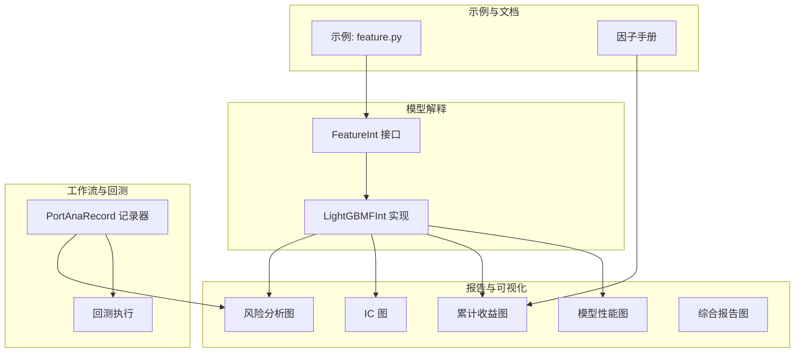
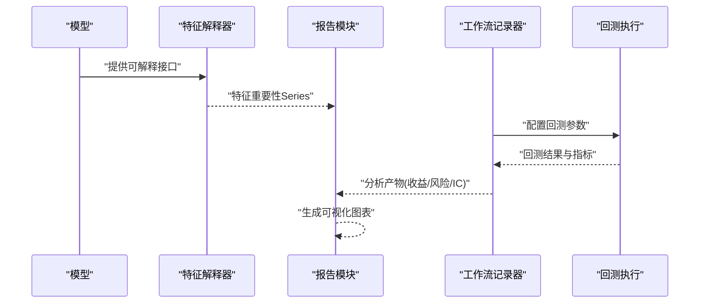
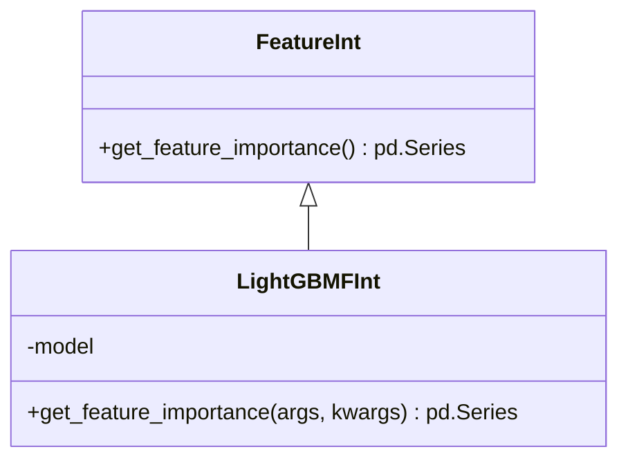
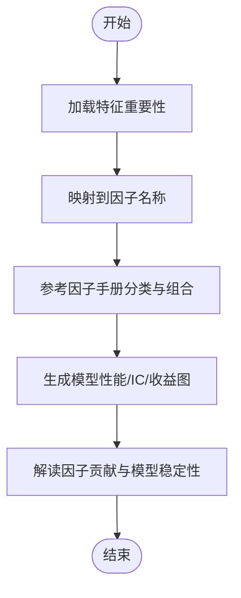
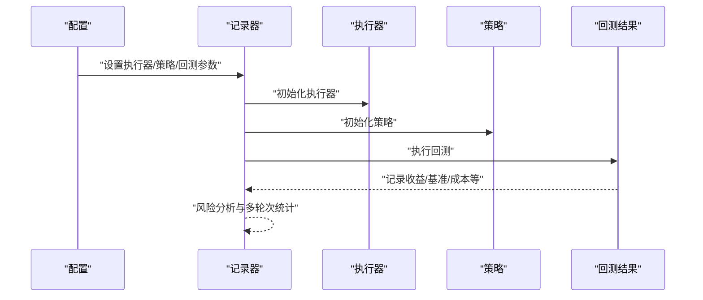
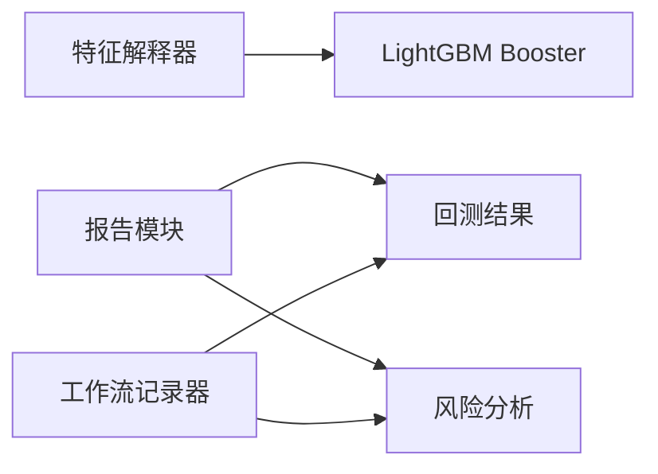

# 模型解释性

<cite>
**本文引用的文件**
- [qlib/model/interpret/base.py](file://qlib/model/interpret/base.py)
- [examples/model_interpreter/feature.py](file://examples/model_interpreter/feature.py)
- [qlib/contrib/report/analysis_model/analysis_model_performance.py](file://qlib/contrib/report/analysis_model/analysis_model_performance.py)
- [qlib/contrib/report/analysis_position/cumulative_return.py](file://qlib/contrib/report/analysis_position/cumulative_return.py)
- [qlib/contrib/report/analysis_position/score_ic.py](file://qlib/contrib/report/analysis_position/score_ic.py)
- [qlib/contrib/report/analysis_position/risk_analysis.py](file://qlib/contrib/report/analysis_position/risk_analysis.py)
- [qlib/contrib/report/analysis_position/report.py](file://qlib/contrib/report/analysis_position/report.py)
- [qlib/workflow/record_temp.py](file://qlib/workflow/record_temp.py)
- [tests/test_all_pipeline.py](file://tests/test_all_pipeline.py)
- [alpha158_factor_guide.md](file://alpha158_factor_guide.md)
</cite>

## 目录
1. [引言](#引言)
2. [项目结构](#项目结构)
3. [核心组件](#核心组件)
4. [架构总览](#架构总览)
5. [详细组件分析](#详细组件分析)
6. [依赖分析](#依赖分析)
7. [性能考虑](#性能考虑)
8. [故障排查指南](#故障排查指南)
9. [结论](#结论)
10. [附录](#附录)

## 引言
本文件面向使用 Qlib 的量化研究与工程实践者，系统化阐述模型解释性分析在 Qlib 中的实现与应用。内容覆盖特征重要性分析、因子重要性评估、模型性能与IC可视化、回测与风险分析等，帮助读者完成从“训练好的模型”到“可解释、可验证、可落地”的全流程分析。

## 项目结构
Qlib 的模型解释性能力主要分布在如下区域：
- 模型解释接口与实现：位于模型解释模块，提供统一的特征重要性接口与 LightGBM 实现。
- 报告与可视化：位于贡献报告模块，提供模型性能、累计收益、IC、风险分析等图形化输出。
- 流水线记录与回测：通过工作流记录器生成分析产物，并支持多频度、多轮次的回测与风险分析。
- 示例与文档：examples 提供可运行的解释性示例；文档与因子手册提供背景知识与实践指导。

**图表来源**
- [qlib/model/interpret/base.py:12-45](file://qlib/model/interpret/base.py#L12-L45)
- [qlib/contrib/report/analysis_model/analysis_model_performance.py](file://qlib/contrib/report/analysis_model/analysis_model_performance.py)
- [qlib/contrib/report/analysis_position/cumulative_return.py](file://qlib/contrib/report/analysis_position/cumulative_return.py)
- [qlib/contrib/report/analysis_position/score_ic.py](file://qlib/contrib/report/analysis_position/score_ic.py)
- [qlib/contrib/report/analysis_position/risk_analysis.py](file://qlib/contrib/report/analysis_position/risk_analysis.py)
- [qlib/contrib/report/analysis_position/report.py](file://qlib/contrib/report/analysis_position/report.py)
- [qlib/workflow/record_temp.py:370-673](file://qlib/workflow/record_temp.py#L370-L673)
- [examples/model_interpreter/feature.py](file://examples/model_interpreter/feature.py)

**章节来源**
- [qlib/model/interpret/base.py:12-45](file://qlib/model/interpret/base.py#L12-L45)
- [qlib/contrib/report/analysis_model/analysis_model_performance.py](file://qlib/contrib/report/analysis_model/analysis_model_performance.py)
- [qlib/contrib/report/analysis_position/cumulative_return.py](file://qlib/contrib/report/analysis_position/cumulative_return.py)
- [qlib/contrib/report/analysis_position/score_ic.py](file://qlib/contrib/report/analysis_position/score_ic.py)
- [qlib/contrib/report/analysis_position/risk_analysis.py](file://qlib/contrib/report/analysis_position/risk_analysis.py)
- [qlib/contrib/report/analysis_position/report.py](file://qlib/contrib/report/analysis_position/report.py)
- [qlib/workflow/record_temp.py:370-673](file://qlib/workflow/record_temp.py#L370-L673)
- [examples/model_interpreter/feature.py](file://examples/model_interpreter/feature.py)

## 核心组件
- 特征重要性接口与实现
  - 统一接口定义了特征重要性的抽象方法，便于扩展不同模型的解释实现。
  - LightGBM 实现直接复用 Booster 的内置特征重要性函数，返回按重要性排序的特征 Series。
- 报告与可视化
  - 模型性能图、累计收益图、IC 图、风险分析图、综合报告图等，均以标准化接口生成。
- 工作流记录与回测
  - 通过记录器生成回测与风险分析产物，支持多频度与多轮次统计汇总。

**章节来源**
- [qlib/model/interpret/base.py:12-45](file://qlib/model/interpret/base.py#L12-L45)
- [qlib/contrib/report/analysis_model/analysis_model_performance.py](file://qlib/contrib/report/analysis_model/analysis_model_performance.py)
- [qlib/contrib/report/analysis_position/cumulative_return.py](file://qlib/contrib/report/analysis_position/cumulative_return.py)
- [qlib/contrib/report/analysis_position/score_ic.py](file://qlib/contrib/report/analysis_position/score_ic.py)
- [qlib/contrib/report/analysis_position/risk_analysis.py](file://qlib/contrib/report/analysis_position/risk_analysis.py)
- [qlib/contrib/report/analysis_position/report.py](file://qlib/contrib/report/analysis_position/report.py)
- [qlib/workflow/record_temp.py:370-673](file://qlib/workflow/record_temp.py#L370-L673)

## 架构总览
下图展示了从模型到解释性分析与可视化的整体流程：模型提供特征重要性，报告模块生成可视化图表，工作流记录器驱动回测与风险分析，最终形成可解释的分析报告。

**图表来源**
- [qlib/model/interpret/base.py:12-45](file://qlib/model/interpret/base.py#L12-L45)
- [qlib/contrib/report/analysis_model/analysis_model_performance.py](file://qlib/contrib/report/analysis_model/analysis_model_performance.py)
- [qlib/contrib/report/analysis_position/cumulative_return.py](file://qlib/contrib/report/analysis_position/cumulative_return.py)
- [qlib/contrib/report/analysis_position/score_ic.py](file://qlib/contrib/report/analysis_position/score_ic.py)
- [qlib/contrib/report/analysis_position/risk_analysis.py](file://qlib/contrib/report/analysis_position/risk_analysis.py)
- [qlib/workflow/record_temp.py:370-673](file://qlib/workflow/record_temp.py#L370-L673)

## 详细组件分析

### 特征重要性接口与 LightGBM 实现
- 接口设计
  - FeatureInt 定义统一的 get_feature_importance 方法，返回以特征名为索引、数值为重要性的排序 Series。
- LightGBM 实现
  - LightGBMFInt 直接调用 Booster 的 feature_importance 与 feature_name，封装为排序后的 Series。
- 使用建议
  - 在训练完成后，将已训练的 LightGBM 模型注入解释器，即可获得特征重要性排序，用于因子有效性初筛与模型鲁棒性检查。

**图表来源**
- [qlib/model/interpret/base.py:12-45](file://qlib/model/interpret/base.py#L12-L45)

**章节来源**
- [qlib/model/interpret/base.py:12-45](file://qlib/model/interpret/base.py#L12-L45)

### 因子重要性评估与可视化
- 因子重要性评估
  - 将特征重要性映射到具体因子名称，结合因子手册与业务逻辑，评估因子对预测的贡献程度。
  - 参考因子手册中的分类与组合解读，辅助判断因子是否冗余或互补。
- 可视化与解读
  - 使用报告模块中的模型性能图、累计收益图、IC 图等，观察模型在不同分组下的表现与稳定性。
  - 结合因子手册中的因子分类与组合，解释模型偏好与潜在过拟合风险。

**图表来源**
- [alpha158_factor_guide.md:898-1071](file://alpha158_factor_guide.md#L898-L1071)
- [qlib/contrib/report/analysis_model/analysis_model_performance.py](file://qlib/contrib/report/analysis_model/analysis_model_performance.py)
- [qlib/contrib/report/analysis_position/cumulative_return.py](file://qlib/contrib/report/analysis_position/cumulative_return.py)
- [qlib/contrib/report/analysis_position/score_ic.py](file://qlib/contrib/report/analysis_position/score_ic.py)

**章节来源**
- [alpha158_factor_guide.md:898-1071](file://alpha158_factor_guide.md#L898-L1071)
- [qlib/contrib/report/analysis_model/analysis_model_performance.py](file://qlib/contrib/report/analysis_model/analysis_model_performance.py)
- [qlib/contrib/report/analysis_position/cumulative_return.py](file://qlib/contrib/report/analysis_position/cumulative_return.py)
- [qlib/contrib/report/analysis_position/score_ic.py](file://qlib/contrib/report/analysis_position/score_ic.py)

### 回测与风险分析
- 回测执行
  - 通过记录器配置执行器、策略与回测参数，生成基准超额收益、含成本超额收益等指标。
- 风险分析
  - 对不同频度的回测结果进行风险指标分析，支持多轮次统计汇总，辅助模型鲁棒性评估。
- 可视化
  - 综合报告图与风险分析图直观呈现模型在不同维度的表现。

**图表来源**
- [qlib/workflow/record_temp.py:370-673](file://qlib/workflow/record_temp.py#L370-L673)
- [qlib/contrib/report/analysis_position/risk_analysis.py:215-240](file://qlib/contrib/report/analysis_position/risk_analysis.py#L215-L240)
- [qlib/contrib/report/analysis_position/report.py](file://qlib/contrib/report/analysis_position/report.py)

**章节来源**
- [qlib/workflow/record_temp.py:370-673](file://qlib/workflow/record_temp.py#L370-L673)
- [qlib/contrib/report/analysis_position/risk_analysis.py:215-240](file://qlib/contrib/report/analysis_position/risk_analysis.py#L215-L240)
- [qlib/contrib/report/analysis_position/report.py](file://qlib/contrib/report/analysis_position/report.py)

### 示例：特征解释性分析
- 示例入口
  - examples/model_interpreter/feature.py 展示了如何加载训练好的模型并进行特征重要性分析。
- 分析流程
  - 加载模型对象与数据集，调用解释器接口获取特征重要性，结合报告模块生成可视化图表，最后输出分析结果。

**章节来源**
- [examples/model_interpreter/feature.py](file://examples/model_interpreter/feature.py)

## 依赖分析
- 组件耦合
  - 特征解释器与模型实现解耦，通过统一接口适配不同模型后端。
  - 报告模块依赖回测与风险分析产物，形成闭环的数据驱动可视化。
- 外部依赖
  - LightGBM Booster 的 feature_importance 与 feature_name 为特征重要性提供底层支持。
  - 回测框架与策略模块为风险分析提供基础数据。

**图表来源**
- [qlib/model/interpret/base.py:27-45](file://qlib/model/interpret/base.py#L27-L45)
- [qlib/contrib/report/analysis_position/risk_analysis.py:215-240](file://qlib/contrib/report/analysis_position/risk_analysis.py#L215-L240)
- [qlib/workflow/record_temp.py:370-673](file://qlib/workflow/record_temp.py#L370-L673)

**章节来源**
- [qlib/model/interpret/base.py:27-45](file://qlib/model/interpret/base.py#L27-L45)
- [qlib/contrib/report/analysis_position/risk_analysis.py:215-240](file://qlib/contrib/report/analysis_position/risk_analysis.py#L215-L240)
- [qlib/workflow/record_temp.py:370-673](file://qlib/workflow/record_temp.py#L370-L673)

## 性能考虑
- 特征重要性计算
  - LightGBM 的特征重要性基于内置算法，计算效率高；在大规模特征场景下，建议先做特征筛选，再进行解释性分析。
- 可视化渲染
  - 报告模块的图表生成涉及大量数据拼接与绘图操作，建议在内存充足的环境中运行，或分批生成。
- 回测与风险分析
  - 多频度与多轮次分析会显著增加计算时间，建议合理设置分析频率与轮次数，优先关注关键指标。

## 故障排查指南
- 特征重要性为空或异常
  - 检查模型是否正确加载与训练；确认特征名与特征重要性索引一致。
- 回测结果缺失
  - 确认记录器配置中启用了相应频度的指标生成；检查回测参数与数据范围。
- 风险分析指标异常
  - 检查成本参数、交易限制与基准设置；核对收益序列与基准序列的时间对齐。

**章节来源**
- [qlib/workflow/record_temp.py:370-673](file://qlib/workflow/record_temp.py#L370-L673)
- [tests/test_all_pipeline.py:103-144](file://tests/test_all_pipeline.py#L103-L144)

## 结论
Qlib 的模型解释性体系以统一的特征解释接口为基础，结合报告模块的可视化与工作流记录器的回测/风险分析，形成了从“特征重要性”到“模型性能与稳定性”的完整分析链路。配合因子手册与示例脚本，用户可以高效开展因子有效性检验、模型鲁棒性分析与异常检测，支撑量化投资决策的可解释性与可信度提升。

## 附录
- 快速上手步骤
  - 准备训练好的模型与数据集。
  - 使用特征解释器获取特征重要性，并映射到因子名称。
  - 生成模型性能、IC、累计收益与风险分析图表。
  - 通过回测与多轮次分析评估模型鲁棒性。
- 参考路径
  - 特征解释接口与实现：[qlib/model/interpret/base.py:12-45](file://qlib/model/interpret/base.py#L12-L45)
  - 报告与可视化：[qlib/contrib/report/analysis_model/analysis_model_performance.py](file://qlib/contrib/report/analysis_model/analysis_model_performance.py)、[qlib/contrib/report/analysis_position/cumulative_return.py](file://qlib/contrib/report/analysis_position/cumulative_return.py)、[qlib/contrib/report/analysis_position/score_ic.py](file://qlib/contrib/report/analysis_position/score_ic.py)、[qlib/contrib/report/analysis_position/risk_analysis.py](file://qlib/contrib/report/analysis_position/risk_analysis.py)、[qlib/contrib/report/analysis_position/report.py](file://qlib/contrib/report/analysis_position/report.py)
  - 工作流与回测：[qlib/workflow/record_temp.py:370-673](file://qlib/workflow/record_temp.py#L370-L673)
  - 示例：[examples/model_interpreter/feature.py](file://examples/model_interpreter/feature.py)
  - 因子手册：[alpha158_factor_guide.md:898-1071](file://alpha158_factor_guide.md#L898-L1071)