# 模型训练系统

<cite>
**本文引用的文件**
- [gbdt.py](file://qlib/contrib/model/gbdt.py)
- [linear.py](file://qlib/contrib/model/linear.py)
- [xgboost.py](file://qlib/contrib/model/xgboost.py)
- [catboost_model.py](file://qlib/contrib/model/catboost_model.py)
- [double_ensemble.py](file://qlib/contrib/model/double_ensemble.py)
- [__init__.py](file://qlib/contrib/model/__init__.py)
- [pytorch_nn.py](file://qlib/contrib/model/pytorch_nn.py)
- [pytorch_add.py](file://qlib/contrib/model/pytorch_add.py)
- [pytorch_alstm.py](file://qlib/contrib/model/pytorch_alstm.py)
- [pytorch_gats.py](file://qlib/contrib/model/pytorch_gats.py)
- [pytorch_gru.py](file://qlib/contrib/model/pytorch_gru.py)
- [pytorch_lstm.py](file://qlib/contrib/model/pytorch_lstm.py)
- [pytorch_tabnet.py](file://qlib/contrib/model/pytorch_tabnet.py)
- [pytorch_sfm.py](file://qlib/contrib/model/pytorch_sfm.py)
- [pytorch_tcn.py](file://qlib/contrib/model/pytorch_tcn.py)
- [pytorch_tra.py](file://qlib/contrib/model/pytorch_tra.py)
- [pytorch_transformer.py](file://qlib/contrib/model/pytorch_transformer.py)
- [pytorch_utils.py](file://qlib/contrib/model/pytorch_utils.py)
- [base.py](file://qlib/model/base.py)
- [trainer.py](file://qlib/model/trainer.py)
- [workflow.py](file://qlib/workflow.py)
- [tuner.py](file://qlib/contrib/tuner/tuner.py)
- [hyperparam_opt.py](file://examples/benchmarks/TFT/libs/hyperparam_opt.py)
- [workflow_config_lightgbm_Alpha158.yaml](file://examples/benchmarks/LightGBM/workflow_config_lightgbm_Alpha158.yaml)
- [workflow_config_xgboost_Alpha158.yaml](file://examples/benchmarks/XGBoost/workflow_config_xgboost_Alpha158.yaml)
- [workflow_config_catboost_Alpha158.yaml](file://examples/benchmarks/CatBoost/workflow_config_catboost_Alpha158.yaml)
- [workflow_config_mlp_Alpha158.yaml](file://examples/benchmarks/MLP/workflow_config_mlp_Alpha158.yaml)
- [workflow_config_lstm_Alpha158.yaml](file://examples/benchmarks/LSTM/workflow_config_lstm_Alpha158.yaml)
- [workflow_config_gru_Alpha158.yaml](file://examples/benchmarks/GRU/workflow_config_gru_Alpha158.yaml)
- [workflow_config_tcn_Alpha158.yaml](file://examples/benchmarks/TCN/workflow_config_tcn_Alpha158.yaml)
- [workflow_config_transformer_Alpha158.yaml](file://examples/benchmarks/Transformer/workflow_config_transformer_Alpha158.yaml)
- [workflow_config_TabNet_Alpha158.yaml](file://examples/benchmarks/TabNet/workflow_config_TabNet_Alpha158.yaml)
- [workflow_config_sfm_Alpha158.yaml](file://examples/benchmarks/SFM/workflow_config_sfm_Alpha158.yaml)
- [workflow_config_gats_Alpha158.yaml](file://examples/benchmarks/GATs/workflow_config_gats_Alpha158.yaml)
- [workflow_config_localformer_Alpha158.yaml](file://examples/benchmarks/Localformer/workflow_config_localformer_Alpha158.yaml)
- [workflow_config_tft_Alpha158.yaml](file://examples/benchmarks/TFT/workflow_config_tft_Alpha158.yaml)
- [workflow_config_igmtf_Alpha158.yaml](file://examples/benchmarks/IGMTF/workflow_config_igmtf_Alpha158.yaml)
- [workflow_config_krnn_Alpha158.yaml](file://examples/benchmarks/KRNN/workflow_config_krnn_Alpha158.yaml)
- [workflow_config_hist_Alpha158.yaml](file://examples/benchmarks/HIST/workflow_config_hist_Alpha158.yaml)
- [workflow_config_adarnn_Alpha158.yaml](file://examples/benchmarks/ADARNN/workflow_config_adarnn_Alpha158.yaml)
- [workflow_config_add_Alpha158.yaml](file://examples/benchmarks/ADD/workflow_config_add_Alpha158.yaml)
- [workflow_config_doubleensemble_Alpha158.yaml](file://examples/benchmarks/DoubleEnsemble/workflow_config_doubleensemble_Alpha158.yaml)
- [workflow_config_sandwich_Alpha158.yaml](file://examples/benchmarks/Sandwich/workflow_config_sandwich_Alpha158.yaml)
- [workflow_config_tcts_Alpha158.yaml](file://examples/benchmarks/TCTS/workflow_config_tcts_Alpha158.yaml)
- [workflow_config_tra_Alpha158.yaml](file://examples/benchmarks/TRA/workflow_config_tra_Alpha158.yaml)
- [requirements.txt](file://examples/benchmarks/LightGBM/requirements.txt)
- [requirements.txt](file://examples/benchmarks/XGBoost/requirements.txt)
- [requirements.txt](file://examples/benchmarks/CatBoost/requirements.txt)
- [requirements.txt](file://examples/benchmarks/MLP/requirements.txt)
- [requirements.txt](file://examples/benchmarks/LSTM/requirements.txt)
- [requirements.txt](file://examples/benchmarks/GRU/requirements.txt)
- [requirements.txt](file://examples/benchmarks/TCN/requirements.txt)
- [requirements.txt](file://examples/benchmarks/Transformer/requirements.txt)
- [requirements.txt](file://examples/benchmarks/TabNet/requirements.txt)
- [requirements.txt](file://examples/benchmarks/SFM/requirements.txt)
- [requirements.txt](file://examples/benchmarks/GATs/requirements.txt)
- [requirements.txt](file://examples/benchmarks/Localformer/requirements.txt)
- [requirements.txt](file://examples/benchmarks/TFT/requirements.txt)
- [requirements.txt](file://examples/benchmarks/IGMTF/requirements.txt)
- [requirements.txt](file://examples/benchmarks/KRNN/requirements.txt)
- [requirements.txt](file://examples/benchmarks/HIST/requirements.txt)
- [requirements.txt](file://examples/benchmarks/ADARNN/requirements.txt)
- [requirements.txt](file://examples/benchmarks/ADD/requirements.txt)
- [requirements.txt](file://examples/benchmarks/DoubleEnsemble/requirements.txt)
- [requirements.txt](file://examples/benchmarks/Sandwich/requirements.txt)
- [requirements.txt](file://examples/benchmarks/TCTS/requirements.txt)
- [requirements.txt](file://examples/benchmarks/TRA/requirements.txt)
</cite>

## 目录
1. [简介](#简介)
2. [项目结构](#项目结构)
3. [核心组件](#核心组件)
4. [架构总览](#架构总览)
5. [详细组件分析](#详细组件分析)
6. [依赖关系分析](#依赖关系分析)
7. [性能考量](#性能考量)
8. [故障排除指南](#故障排除指南)
9. [结论](#结论)
10. [附录](#附录)

## 简介
本文件面向Qlib模型训练系统，系统性梳理传统机器学习模型（LightGBM、XGBoost、CatBoost、线性回归）与深度学习模型（PyTorch系列）的实现方式、配置与使用流程，并结合集成学习、超参数调优、模型评估与基准测试，给出最佳实践、性能优化建议与排障指引。读者可据此快速上手并高效迭代模型。

## 项目结构
Qlib将“模型”“数据集”“训练器”“工作流”解耦，形成清晰的训练流水线：模型实现位于contrib/model；训练器负责任务编排与记录；工作流提供实验记录与指标上报；示例基准模型位于examples/benchmarks。

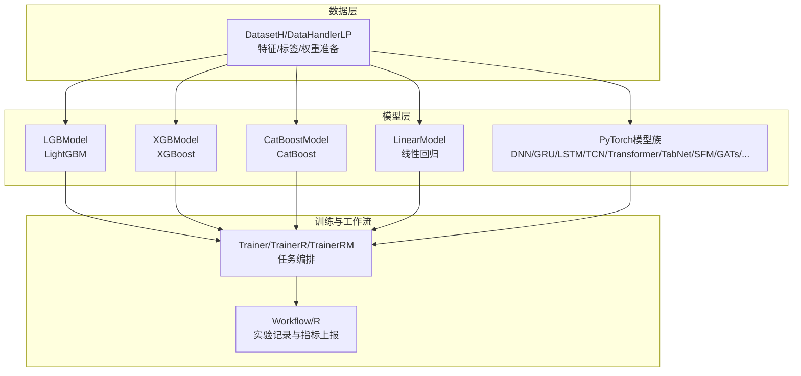

图示来源
- [gbdt.py:16-127](file://qlib/contrib/model/gbdt.py#L16-L127)
- [xgboost.py:15-45](file://qlib/contrib/model/xgboost.py#L15-L45)
- [catboost_model.py:17-46](file://qlib/contrib/model/catboost_model.py#L17-L46)
- [linear.py:17-114](file://qlib/contrib/model/linear.py#L17-L114)
- [pytorch_nn.py:426-463](file://qlib/contrib/model/pytorch_nn.py#L426-L463)
- [trainer.py:131-620](file://qlib/model/trainer.py#L131-L620)
- [workflow.py](file://qlib/workflow.py)

章节来源
- [gbdt.py:16-127](file://qlib/contrib/model/gbdt.py#L16-L127)
- [linear.py:17-114](file://qlib/contrib/model/linear.py#L17-L114)
- [xgboost.py:15-45](file://qlib/contrib/model/xgboost.py#L15-L45)
- [catboost_model.py:17-46](file://qlib/contrib/model/catboost_model.py#L17-L46)
- [pytorch_nn.py:426-463](file://qlib/contrib/model/pytorch_nn.py#L426-L463)
- [trainer.py:131-620](file://qlib/model/trainer.py#L131-L620)

## 核心组件
- 模型基类与接口
  - BaseModel/Model/ModelFT定义了统一的fit/predict/finetune契约，确保不同模型具备一致的训练与推理接口。
- 训练器
  - Trainer/TrainerR/TrainerRM封装任务执行、并行化与记录保存，支持延迟训练与分布式执行。
- 工作流
  - 通过R记录器保存任务配置、模型对象、指标与产物，便于复现实验与可视化。

章节来源
- [base.py:10-111](file://qlib/model/base.py#L10-L111)
- [trainer.py:131-620](file://qlib/model/trainer.py#L131-L620)

## 架构总览
下图展示了从任务配置到模型训练、记录与产出的关键交互：

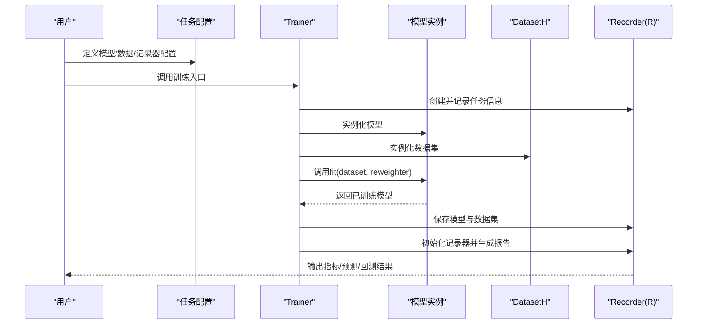

图示来源
- [trainer.py:42-72](file://qlib/model/trainer.py#L42-L72)
- [base.py:22-78](file://qlib/model/base.py#L22-L78)

## 详细组件分析

### 传统机器学习模型

#### LightGBM（LGBModel）
- 功能要点
  - 支持多分类目标与二分类目标，自动处理验证集与早停回调。
  - 支持样本权重与重加权器，支持微调（基于已有模型继续训练）。
- 关键流程
  - 数据准备：从DatasetH中提取特征与标签，保证标签为一维数组。
  - 训练：构造lgb.Dataset，设置早停与日志回调，执行训练。
  - 预测：对指定片段进行预测，返回Series。
- 使用建议
  - 合理设置num_boost_round与early_stopping_rounds，避免过拟合。
  - 使用reweighter平衡样本分布。

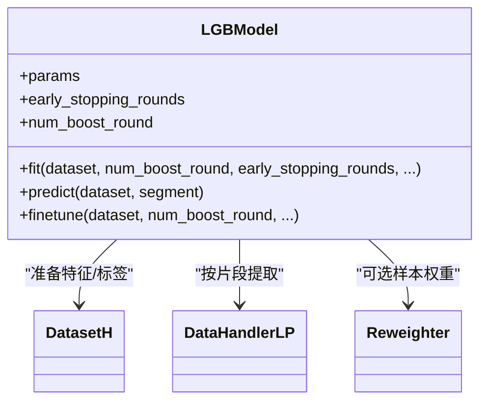

图示来源
- [gbdt.py:16-127](file://qlib/contrib/model/gbdt.py#L16-L127)

章节来源
- [gbdt.py:16-127](file://qlib/contrib/model/gbdt.py#L16-L127)

#### XGBoost（XGBModel）
- 功能要点
  - 以XGBoost为底层，支持训练、验证、早停与指标记录。
  - 对标签维度有严格要求（不支持多标签）。
- 关键流程
  - 从DatasetH中准备训练/验证数据，压缩标签至一维。
  - 调用XGBoost训练接口，支持回调与重加权。

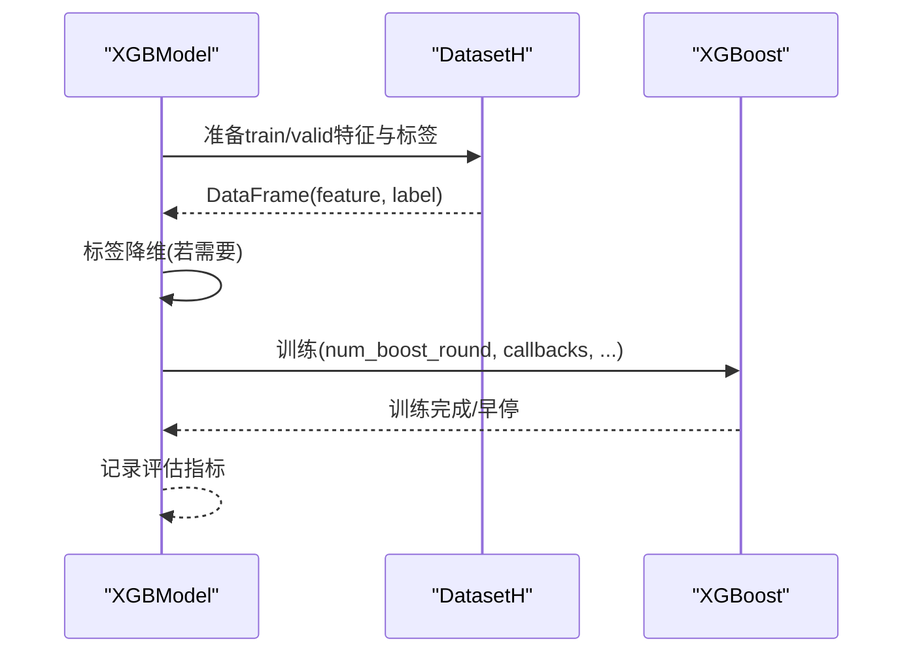

图示来源
- [xgboost.py:15-45](file://qlib/contrib/model/xgboost.py#L15-L45)

章节来源
- [xgboost.py:15-45](file://qlib/contrib/model/xgboost.py#L15-L45)

#### CatBoost（CatBoostModel）
- 功能要点
  - 支持RMSE与Logloss损失函数，自动处理Pool与GPU设备计数。
  - 支持训练、验证、早停与指标记录。
- 关键流程
  - 从DatasetH准备数据，构建CatBoost Pool。
  - 调用CatBoost训练接口，支持回调与重加权。

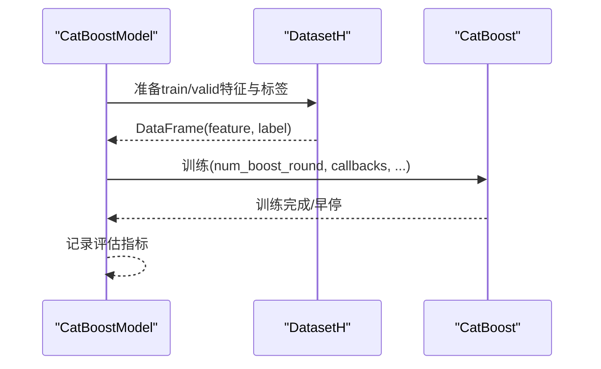

图示来源
- [catboost_model.py:17-46](file://qlib/contrib/model/catboost_model.py#L17-L46)

章节来源
- [catboost_model.py:17-46](file://qlib/contrib/model/catboost_model.py#L17-L46)

#### 线性回归（LinearModel）
- 功能要点
  - 支持OLS、非负最小二乘（NNLS）、Ridge、Lasso四种估计器。
  - 可选择是否合并验证集参与训练，支持样本权重。
- 关键流程
  - 从DatasetH准备训练数据，必要时拼接验证集。
  - 根据估计器类型调用对应求解器，得到系数与截距。

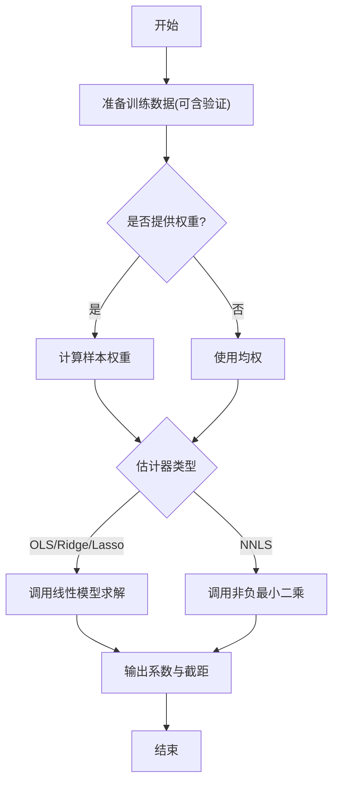

图示来源
- [linear.py:17-114](file://qlib/contrib/model/linear.py#L17-L114)

章节来源
- [linear.py:17-114](file://qlib/contrib/model/linear.py#L17-L114)

#### 集成学习（DoubleEnsemble）
- 功能要点
  - 基于LightGBM的双集成策略，交替进行样本重加权与特征子集选择。
  - 支持多子模型训练与损失曲线检索。
- 关键流程
  - 初始化样本权重与特征集合。
  - 迭代训练子模型，更新权重与特征集合。
  - 支持早停与验证集评估。

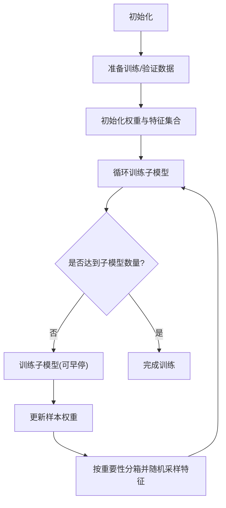

图示来源
- [double_ensemble.py:54-86](file://qlib/contrib/model/double_ensemble.py#L54-L86)
- [double_ensemble.py:114-124](file://qlib/contrib/model/double_ensemble.py#L114-L124)

章节来源
- [double_ensemble.py:54-86](file://qlib/contrib/model/double_ensemble.py#L54-L86)
- [double_ensemble.py:114-124](file://qlib/contrib/model/double_ensemble.py#L114-L124)
- [double_ensemble.py:126-135](file://qlib/contrib/model/double_ensemble.py#L126-L135)
- [double_ensemble.py:227-235](file://qlib/contrib/model/double_ensemble.py#L227-L235)

### 深度学习模型（PyTorch）

#### 通用神经网络（DNNModelPytorch）
- 结构要点
  - 多层感知机，支持LeakyReLU与SiLU激活，批量归一化与Dropout。
  - 权重初始化采用Kaiming准则。
- 使用建议
  - 合理设置层数与隐藏单元数，避免过拟合。
  - 使用BatchNorm与Dropout提升泛化能力。

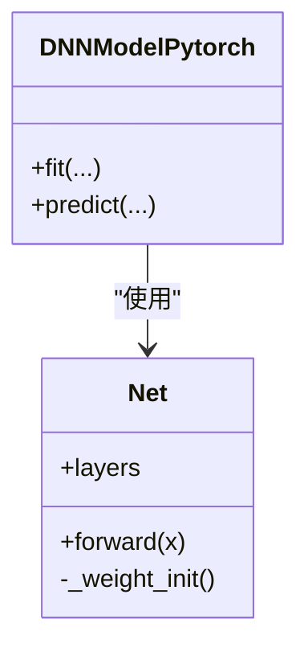

图示来源
- [pytorch_nn.py:426-463](file://qlib/contrib/model/pytorch_nn.py#L426-L463)

章节来源
- [pytorch_nn.py:426-463](file://qlib/contrib/model/pytorch_nn.py#L426-L463)

#### 其他PyTorch模型族
- 时间序列与图模型：ALSTM、GRU、LSTM、TCN、Transformer、GATs、TabNet、SFM、LocalFormer、IGMTF、KRNN、HIST、ADARNN、ADD、Sandwich、TCTS、TRA等。
- 特点
  - 均遵循统一的模型接口，可直接由Trainer驱动训练与记录。
  - 示例基准提供了对应的配置文件与依赖清单，便于快速运行。

章节来源
- [pytorch_alstm.py](file://qlib/contrib/model/pytorch_alstm.py)
- [pytorch_gru.py](file://qlib/contrib/model/pytorch_gru.py)
- [pytorch_lstm.py](file://qlib/contrib/model/pytorch_lstm.py)
- [pytorch_tcn.py](file://qlib/contrib/model/pytorch_tcn.py)
- [pytorch_transformer.py](file://qlib/contrib/model/pytorch_transformer.py)
- [pytorch_gats.py](file://qlib/contrib/model/pytorch_gats.py)
- [pytorch_tabnet.py](file://qlib/contrib/model/pytorch_tabnet.py)
- [pytorch_sfm.py](file://qlib/contrib/model/pytorch_sfm.py)
- [pytorch_add.py](file://qlib/contrib/model/pytorch_add.py)
- [pytorch_tra.py](file://qlib/contrib/model/pytorch_tra.py)
- [pytorch_utils.py](file://qlib/contrib/model/pytorch_utils.py)

### 训练器与工作流

#### 训练器（Trainer/TrainerR/TrainerRM/DelayTrainer）
- 职责
  - 解析任务配置，实例化模型与数据集，执行fit并保存模型与数据集。
  - 自动注入模型与数据集到记录器，生成预测、回测与分析记录。
  - 支持单进程、子进程隔离内存、多进程与分布式执行。
- 关键流程
  - 记录任务配置与占位符替换。
  - 执行模型训练与记录生成。
  - 设置训练状态标签，便于追踪。

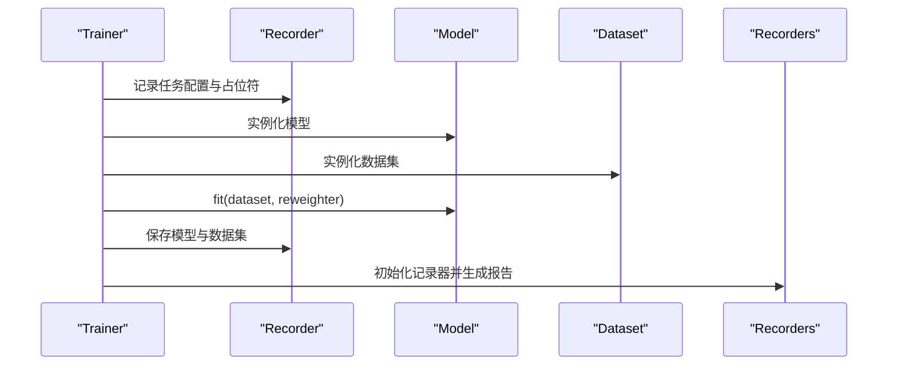

图示来源
- [trainer.py:42-72](file://qlib/model/trainer.py#L42-L72)

章节来源
- [trainer.py:131-620](file://qlib/model/trainer.py#L131-L620)

#### 工作流（R记录器）
- 职责
  - 统一记录实验参数、模型对象、指标与产物，支持查询与复现。
- 与Trainer协作
  - Trainer在训练前后写入状态标签，R负责持久化与查询。

章节来源
- [trainer.py:36-40](file://qlib/model/trainer.py#L36-L40)

### 超参数调优

#### 本地贝叶斯优化（Tuner）
- 功能
  - 基于hyperopt的tpe搜索，支持最大评估次数与实验目录管理。
  - 记录最佳参数与耗时。
- 使用建议
  - 合理设置搜索空间与评估次数，避免过度搜索。
  - 将搜索过程纳入实验记录以便复现。

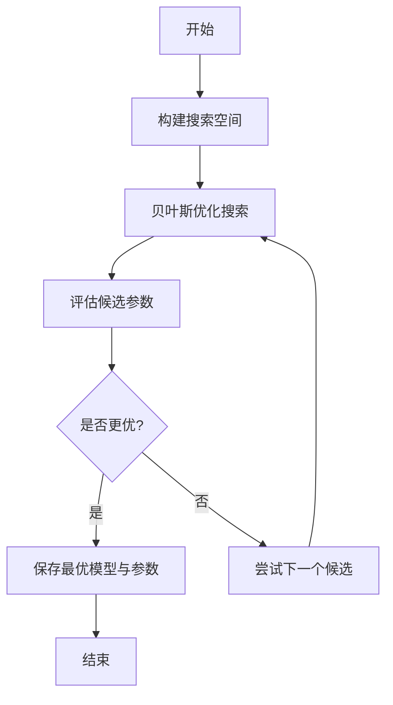

图示来源
- [tuner.py:25-55](file://qlib/contrib/tuner/tuner.py#L25-L55)

章节来源
- [tuner.py:25-55](file://qlib/contrib/tuner/tuner.py#L25-L55)

#### 分布式/批量超参搜索（TFT示例）
- 功能
  - 支持预生成参数组合、并行Worker、结果与参数CSV持久化。
  - 提供加载历史结果与更新最优配置的能力。
- 使用建议
  - 在多GPU环境下拆分参数组合，避免重复搜索。
  - 定期保存results与params，便于中断恢复。

章节来源
- [hyperparam_opt.py:51-103](file://examples/benchmarks/TFT/libs/hyperparam_opt.py#L51-L103)
- [hyperparam_opt.py:188-226](file://examples/benchmarks/TFT/libs/hyperparam_opt.py#L188-L226)

### 基准测试模型与配置

#### 传统模型基准
- LightGBM
  - 配置示例：Alpha158、Alpha360、CSI500等多版本。
  - 依赖：requirements.txt。
- XGBoost
  - 配置示例：Alpha158、Alpha360。
  - 依赖：requirements.txt。
- CatBoost
  - 配置示例：Alpha158、Alpha360、CSI500等。
  - 依赖：requirements.txt。
- 线性回归
  - 配置示例：Alpha158、CSI500、多遍回测等。
  - 依赖：requirements.txt。

章节来源
- [workflow_config_lightgbm_Alpha158.yaml](file://examples/benchmarks/LightGBM/workflow_config_lightgbm_Alpha158.yaml)
- [workflow_config_xgboost_Alpha158.yaml](file://examples/benchmarks/XGBoost/workflow_config_xgboost_Alpha158.yaml)
- [workflow_config_catboost_Alpha158.yaml](file://examples/benchmarks/CatBoost/workflow_config_catboost_Alpha158.yaml)
- [workflow_config_linear_Alpha158.yaml](file://examples/benchmarks/Linear/workflow_config_linear_Alpha158.yaml)
- [requirements.txt](file://examples/benchmarks/LightGBM/requirements.txt)
- [requirements.txt](file://examples/benchmarks/XGBoost/requirements.txt)
- [requirements.txt](file://examples/benchmarks/CatBoost/requirements.txt)
- [requirements.txt](file://examples/benchmarks/Linear/requirements.txt)

#### 深度学习模型基准
- MLP、LSTM、GRU、TCN、Transformer、TabNet、SFM、GATs、LocalFormer、IGMTF、KRNN、HIST、ADARNN、ADD、Sandwich、TCTS、TRA等。
- 配置示例：各模型均有对应workflow配置与依赖清单。
- 使用建议
  - 根据数据规模与特征维度选择合适模型。
  - 注意批大小、学习率与序列长度的匹配。

章节来源
- [workflow_config_mlp_Alpha158.yaml](file://examples/benchmarks/MLP/workflow_config_mlp_Alpha158.yaml)
- [workflow_config_lstm_Alpha158.yaml](file://examples/benchmarks/LSTM/workflow_config_lstm_Alpha158.yaml)
- [workflow_config_gru_Alpha158.yaml](file://examples/benchmarks/GRU/workflow_config_gru_Alpha158.yaml)
- [workflow_config_tcn_Alpha158.yaml](file://examples/benchmarks/TCN/workflow_config_tcn_Alpha158.yaml)
- [workflow_config_transformer_Alpha158.yaml](file://examples/benchmarks/Transformer/workflow_config_transformer_Alpha158.yaml)
- [workflow_config_TabNet_Alpha158.yaml](file://examples/benchmarks/TabNet/workflow_config_TabNet_Alpha158.yaml)
- [workflow_config_sfm_Alpha158.yaml](file://examples/benchmarks/SFM/workflow_config_sfm_Alpha158.yaml)
- [workflow_config_gats_Alpha158.yaml](file://examples/benchmarks/GATs/workflow_config_gats_Alpha158.yaml)
- [workflow_config_localformer_Alpha158.yaml](file://examples/benchmarks/Localformer/workflow_config_localformer_Alpha158.yaml)
- [workflow_config_tft_Alpha158.yaml](file://examples/benchmarks/TFT/workflow_config_tft_Alpha158.yaml)
- [workflow_config_igmtf_Alpha158.yaml](file://examples/benchmarks/IGMTF/workflow_config_igmtf_Alpha158.yaml)
- [workflow_config_krnn_Alpha158.yaml](file://examples/benchmarks/KRNN/workflow_config_krnn_Alpha158.yaml)
- [workflow_config_hist_Alpha158.yaml](file://examples/benchmarks/HIST/workflow_config_hist_Alpha158.yaml)
- [workflow_config_adarnn_Alpha158.yaml](file://examples/benchmarks/ADARNN/workflow_config_adarnn_Alpha158.yaml)
- [workflow_config_add_Alpha158.yaml](file://examples/benchmarks/ADD/workflow_config_add_Alpha158.yaml)
- [workflow_config_doubleensemble_Alpha158.yaml](file://examples/benchmarks/DoubleEnsemble/workflow_config_doubleensemble_Alpha158.yaml)
- [workflow_config_sandwich_Alpha158.yaml](file://examples/benchmarks/Sandwich/workflow_config_sandwich_Alpha158.yaml)
- [workflow_config_tcts_Alpha158.yaml](file://examples/benchmarks/TCTS/workflow_config_tcts_Alpha158.yaml)
- [workflow_config_tra_Alpha158.yaml](file://examples/benchmarks/TRA/workflow_config_tra_Alpha158.yaml)
- [requirements.txt](file://examples/benchmarks/MLP/requirements.txt)
- [requirements.txt](file://examples/benchmarks/LSTM/requirements.txt)
- [requirements.txt](file://examples/benchmarks/GRU/requirements.txt)
- [requirements.txt](file://examples/benchmarks/TCN/requirements.txt)
- [requirements.txt](file://examples/benchmarks/Transformer/requirements.txt)
- [requirements.txt](file://examples/benchmarks/TabNet/requirements.txt)
- [requirements.txt](file://examples/benchmarks/SFM/requirements.txt)
- [requirements.txt](file://examples/benchmarks/GATs/requirements.txt)
- [requirements.txt](file://examples/benchmarks/Localformer/requirements.txt)
- [requirements.txt](file://examples/benchmarks/TFT/requirements.txt)
- [requirements.txt](file://examples/benchmarks/IGMTF/requirements.txt)
- [requirements.txt](file://examples/benchmarks/KRNN/requirements.txt)
- [requirements.txt](file://examples/benchmarks/HIST/requirements.txt)
- [requirements.txt](file://examples/benchmarks/ADARNN/requirements.txt)
- [requirements.txt](file://examples/benchmarks/ADD/requirements.txt)
- [requirements.txt](file://examples/benchmarks/DoubleEnsemble/requirements.txt)
- [requirements.txt](file://examples/benchmarks/Sandwich/requirements.txt)
- [requirements.txt](file://examples/benchmarks/TCTS/requirements.txt)
- [requirements.txt](file://examples/benchmarks/TRA/requirements.txt)

## 依赖关系分析

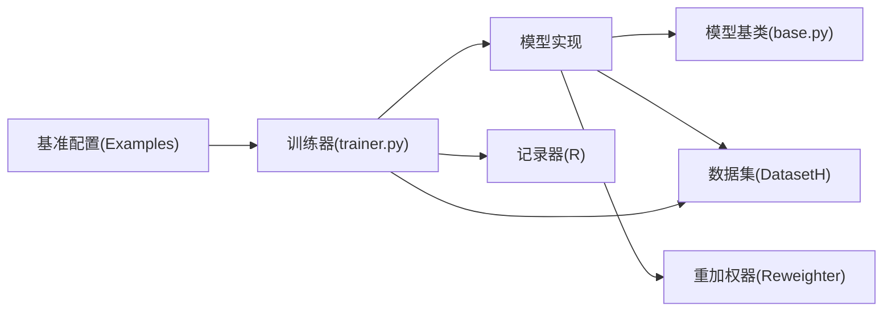

图示来源
- [base.py:22-78](file://qlib/model/base.py#L22-L78)
- [trainer.py:42-72](file://qlib/model/trainer.py#L42-L72)
- [__init__.py:1-43](file://qlib/contrib/model/__init__.py#L1-L43)

章节来源
- [__init__.py:1-43](file://qlib/contrib/model/__init__.py#L1-L43)

## 性能考量
- 传统模型
  - LightGBM/XGBoost/CatBoost：合理设置num_boost_round与early_stopping_rounds；利用样本权重与重加权器平衡类别；启用日志回调便于监控。
  - 线性模型：在高维稀疏场景优先考虑正则化（Ridge/Lasso），必要时使用NNLS约束非负。
- 深度学习
  - 控制网络深度与宽度，使用BatchNorm与Dropout防止过拟合。
  - 序列模型注意批大小与序列长度的平衡，避免显存溢出。
  - 多GPU/分布式训练时，确保参数组合不重复，定期保存中间结果。
- 训练器
  - 单进程适合调试；子进程隔离有助于内存回收；多进程/分布式适合大规模并行。
- 超参搜索
  - 限制搜索空间与评估次数；使用历史结果续跑；将搜索过程纳入实验记录。

## 故障排除指南
- 数据为空或配置错误
  - 现象：训练前数据为空，抛出异常。
  - 排查：检查DatasetH配置与数据源，确认segments存在且非空。
- 标签维度不兼容
  - 现象：XGBoost/Linear等报错提示不支持多标签。
  - 排查：确保标签为一维数组；必要时对多标签问题进行转换或改用支持多标签的模型。
- 早停无效或过拟合
  - 现象：训练未按预期停止或验证指标恶化。
  - 排查：调整early_stopping_rounds；检查验证集划分与指标定义。
- 内存不足
  - 现象：训练过程中OOM。
  - 排查：减小batch size/序列长度；使用子进程训练；清理缓存。
- 超参搜索无进展
  - 现象：多次评估loss为NaN或Inf。
  - 排查：检查学习率与损失函数设置；修正搜索空间；加载历史结果继续搜索。

章节来源
- [gbdt.py:28-55](file://qlib/contrib/model/gbdt.py#L28-L55)
- [xgboost.py:33-45](file://qlib/contrib/model/xgboost.py#L33-L45)
- [linear.py:58-82](file://qlib/contrib/model/linear.py#L58-L82)
- [trainer.py:268-274](file://qlib/model/trainer.py#L268-L274)
- [hyperparam_opt.py:188-203](file://examples/benchmarks/TFT/libs/hyperparam_opt.py#L188-L203)

## 结论
Qlib通过统一的模型接口、灵活的训练器与完备的工作流，实现了从传统机器学习到深度学习的全栈建模支持。结合丰富的基准配置与超参搜索工具，用户可以快速搭建、评估与优化模型，并在生产环境中稳定复现与扩展。

## 附录
- 快速上手步骤
  - 选择模型与配置：参考examples/benchmarks中的workflow配置与requirements。
  - 准备数据：确保DatasetH配置正确，特征与标签齐备。
  - 执行训练：通过Trainer启动任务，查看R记录器中的指标与产物。
  - 调优与扩展：使用Tuner或TFT示例进行超参搜索，或基于PyTorch模型扩展自定义网络。
- 最佳实践清单
  - 明确目标函数与评估指标，保持训练/验证/测试划分一致。
  - 合理设置早停与学习率调度，避免过拟合。
  - 将实验配置与结果纳入记录器，便于复盘与对比。
  - 在多GPU/分布式环境下，做好参数组合去重与结果持久化。