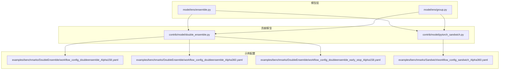
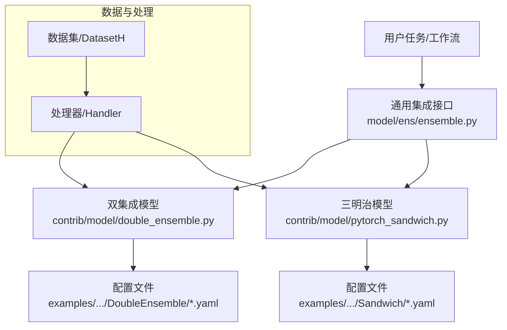
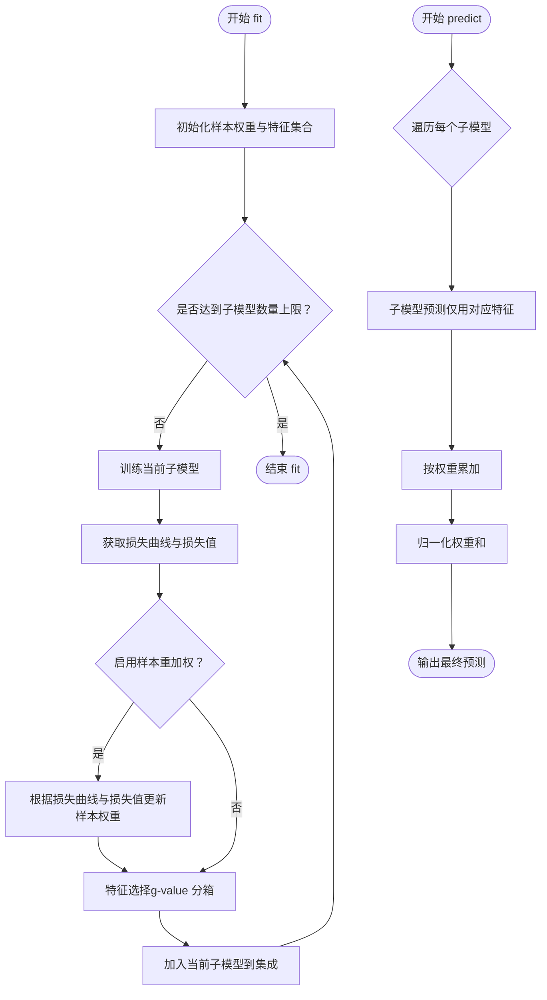
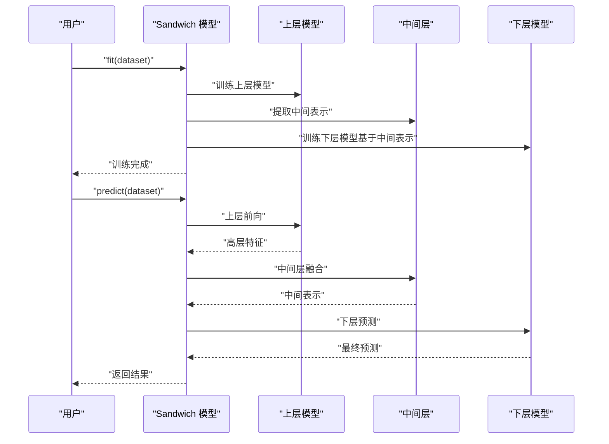
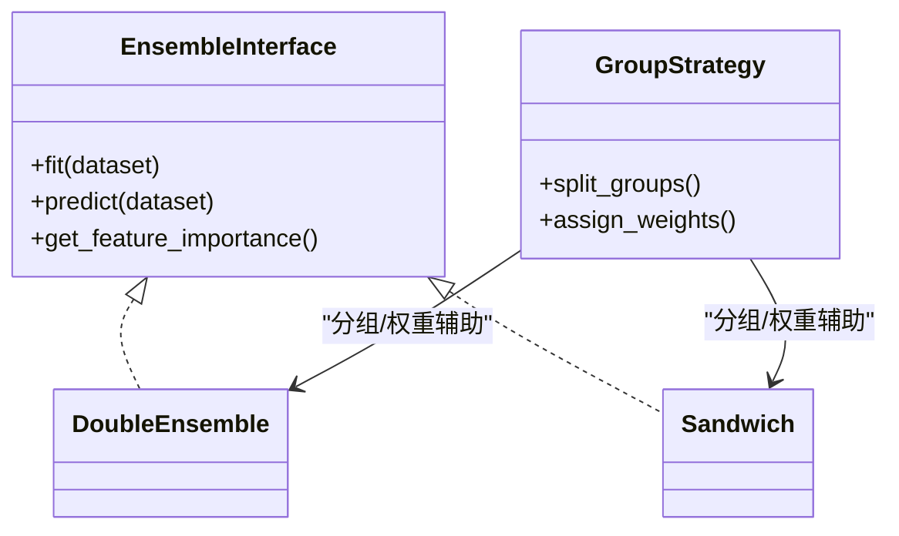
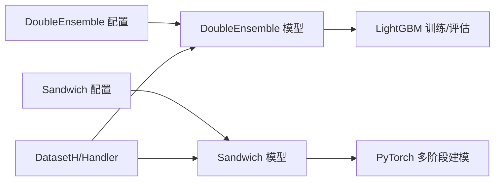

# 模型集成

<cite>
**本文引用的文件**
- [double_ensemble.py](file://qlib/contrib/model/double_ensemble.py)
- [pytorch_sandwich.py](file://qlib/contrib/model/pytorch_sandwich.py)
- [ensemble.py](file://qlib/model/ens/ensemble.py)
- [group.py](file://qlib/model/ens/group.py)
- [workflow_config_doubleensemble_Alpha158.yaml](file://examples/benchmarks/DoubleEnsemble/workflow_config_doubleensemble_Alpha158.yaml)
- [workflow_config_doubleensemble_Alpha360.yaml](file://examples/benchmarks/DoubleEnsemble/workflow_config_doubleensemble_Alpha360.yaml)
- [workflow_config_doubleensemble_early_stop_Alpha158.yaml](file://examples/benchmarks/DoubleEnsemble/workflow_config_doubleensemble_early_stop_Alpha158.yaml)
- [workflow_config_sandwich_Alpha360.yaml](file://examples/benchmarks/Sandwich/workflow_config_sandwich_Alpha360.yaml)
</cite>

## 目录
1. [引言](#引言)
2. [项目结构](#项目结构)
3. [核心组件](#核心组件)
4. [架构总览](#架构总览)
5. [详细组件分析](#详细组件分析)
6. [依赖关系分析](#依赖关系分析)
7. [性能考虑](#性能考虑)
8. [故障排查指南](#故障排查指南)
9. [结论](#结论)
10. [附录](#附录)

## 引言
本文件面向Qlib中的模型集成系统，系统性梳理并解释以下内容：
- 集成学习策略：Bagging、Boosting、Stacking在Qlib中的实现与使用思路
- 模型组合策略、权重分配方法与投票机制
- 双集成模型（DoubleEnsemble）与三明治模型（Sandwich）的具体实现与配置示例
- 集成模型的训练流程、预测融合方法与性能提升效果
- 理论基础、适用场景与注意事项
- 调试技巧与性能优化建议

## 项目结构
Qlib中与“模型集成”直接相关的核心位置如下：
- 核心集成逻辑与通用接口位于 model/ens
- 具体集成算法实现位于 contrib/model
- 示例工作流配置位于 examples/benchmarks 下的 DoubleEnsemble 与 Sandwich

图表来源
- [ensemble.py](file://qlib/model/ens/ensemble.py)
- [group.py](file://qlib/model/ens/group.py)
- [double_ensemble.py](file://qlib/contrib/model/double_ensemble.py)
- [pytorch_sandwich.py](file://qlib/contrib/model/pytorch_sandwich.py)
- [workflow_config_doubleensemble_Alpha158.yaml](file://examples/benchmarks/DoubleEnsemble/workflow_config_doubleensemble_Alpha158.yaml)
- [workflow_config_doubleensemble_Alpha360.yaml](file://examples/benchmarks/DoubleEnsemble/workflow_config_doubleensemble_Alpha360.yaml)
- [workflow_config_doubleensemble_early_stop_Alpha158.yaml](file://examples/benchmarks/DoubleEnsemble/workflow_config_doubleensemble_early_stop_Alpha158.yaml)
- [workflow_config_sandwich_Alpha360.yaml](file://examples/benchmarks/Sandwich/workflow_config_sandwich_Alpha360.yaml)

章节来源
- [ensemble.py](file://qlib/model/ens/ensemble.py)
- [group.py](file://qlib/model/ens/group.py)
- [double_ensemble.py](file://qlib/contrib/model/double_ensemble.py)
- [pytorch_sandwich.py](file://qlib/contrib/model/pytorch_sandwich.py)
- [workflow_config_doubleensemble_Alpha158.yaml](file://examples/benchmarks/DoubleEnsemble/workflow_config_doubleensemble_Alpha158.yaml)
- [workflow_config_doubleensemble_Alpha360.yaml](file://examples/benchmarks/DoubleEnsemble/workflow_config_doubleensemble_Alpha360.yaml)
- [workflow_config_doubleensemble_early_stop_Alpha158.yaml](file://examples/benchmarks/DoubleEnsemble/workflow_config_doubleensemble_early_stop_Alpha158.yaml)
- [workflow_config_sandwich_Alpha360.yaml](file://examples/benchmarks/Sandwich/workflow_config_sandwich_Alpha360.yaml)

## 核心组件
- model/ens/ensemble.py 与 model/ens/group.py 提供通用的集成框架与分组策略接口，是构建 Bagging/Stacking 的基础。
- contrib/model/double_ensemble.py 实现了双集成（DoubleEnsemble）策略，包含样本重加权、特征选择、子模型集成与预测加权。
- contrib/model/pytorch_sandwich.py 实现了三明治（Sandwich）集成策略，通过多阶段模型组合与中间表示融合提升性能。

章节来源
- [ensemble.py](file://qlib/model/ens/ensemble.py)
- [group.py](file://qlib/model/ens/group.py)
- [double_ensemble.py](file://qlib/contrib/model/double_ensemble.py)
- [pytorch_sandwich.py](file://qlib/contrib/model/pytorch_sandwich.py)

## 架构总览
下图展示了 Qlib 集成学习的整体架构：通用集成接口负责组织与调度；具体算法（如 DoubleEnsemble、Sandwich）在 fit/predict 中实现各自的训练与融合策略；示例配置文件定义了任务参数与数据集设置。

图表来源
- [ensemble.py](file://qlib/model/ens/ensemble.py)
- [double_ensemble.py](file://qlib/contrib/model/double_ensemble.py)
- [pytorch_sandwich.py](file://qlib/contrib/model/pytorch_sandwich.py)
- [workflow_config_doubleensemble_Alpha158.yaml](file://examples/benchmarks/DoubleEnsemble/workflow_config_doubleensemble_Alpha158.yaml)
- [workflow_config_sandwich_Alpha360.yaml](file://examples/benchmarks/Sandwich/workflow_config_sandwich_Alpha360.yaml)

## 详细组件分析

### 双集成模型（DoubleEnsemble）
双集成是一种迭代式集成策略，其核心思想是在每一轮迭代中：
- 训练一个子模型
- 基于损失曲线与整体预测计算样本权重与特征重要性
- 进行样本重加权与特征选择
- 将当前子模型纳入集成，并对后续子模型共享历史预测信息

关键点与流程
- 子模型训练：支持以 LightGBM 为基础的梯度提升树，可配置早停、回调与评估记录。
- 样本重加权：基于损失曲线与损失值动态调整样本权重，强调困难样本。
- 特征选择：基于排列重要性（g-value）与分箱策略筛选特征。
- 预测融合：对各子模型输出按权重求和归一化。

图表来源
- [double_ensemble.py](file://qlib/contrib/model/double_ensemble.py)

章节来源
- [double_ensemble.py](file://qlib/contrib/model/double_ensemble.py)

### 三明治模型（Sandwich）
三明治模型通过“上层+中间层+下层”的多阶段结构实现集成：
- 上层模型：对输入进行高层抽象或分类
- 中间层：提取与融合中间表示
- 下层模型：基于中间表示进行回归/分类预测

该策略在 contrib/model/pytorch_sandwich.py 中实现，适合需要层次化特征表达与融合的任务场景。

图表来源
- [pytorch_sandwich.py](file://qlib/contrib/model/pytorch_sandwich.py)

章节来源
- [pytorch_sandwich.py](file://qlib/contrib/model/pytorch_sandwich.py)

### 通用集成接口与分组策略
model/ens/ensemble.py 与 model/ens/group.py 提供通用的集成框架：
- 统一的 fit/predict 接口约定
- 分组与权重管理能力
- 便于扩展 Bagging/Boosting/Stacking 等策略

图表来源
- [ensemble.py](file://qlib/model/ens/ensemble.py)
- [group.py](file://qlib/model/ens/group.py)
- [double_ensemble.py](file://qlib/contrib/model/double_ensemble.py)
- [pytorch_sandwich.py](file://qlib/contrib/model/pytorch_sandwich.py)

章节来源
- [ensemble.py](file://qlib/model/ens/ensemble.py)
- [group.py](file://qlib/model/ens/group.py)

## 依赖关系分析
- DoubleEnsemble 依赖 LightGBM（梯度提升树）进行子模型训练，并使用评估回调与早停机制。
- Sandwich 依赖 PyTorch 框架进行多阶段建模与中间表示融合。
- 两者均通过统一的 DatasetH/Handler 流程接入数据，遵循 Qlib 的数据准备与分割规范。
- 示例配置文件定义了任务名称、数据集路径、特征列、标签列、训练轮次、评估指标等关键参数。

图表来源
- [double_ensemble.py](file://qlib/contrib/model/double_ensemble.py)
- [pytorch_sandwich.py](file://qlib/contrib/model/pytorch_sandwich.py)
- [workflow_config_doubleensemble_Alpha158.yaml](file://examples/benchmarks/DoubleEnsemble/workflow_config_doubleensemble_Alpha158.yaml)
- [workflow_config_sandwich_Alpha360.yaml](file://examples/benchmarks/Sandwich/workflow_config_sandwich_Alpha360.yaml)

章节来源
- [double_ensemble.py](file://qlib/contrib/model/double_ensemble.py)
- [pytorch_sandwich.py](file://qlib/contrib/model/pytorch_sandwich.py)
- [workflow_config_doubleensemble_Alpha158.yaml](file://examples/benchmarks/DoubleEnsemble/workflow_config_doubleensemble_Alpha158.yaml)
- [workflow_config_sandwich_Alpha360.yaml](file://examples/benchmarks/Sandwich/workflow_config_sandwich_Alpha360.yaml)

## 性能考虑
- 子模型数量与权重：增加子模型数量通常提升稳定性但会增加训练成本；合理设置 sub_weights 可平衡各子模型贡献。
- 早停与评估：启用早停可避免过拟合并节省时间；建议结合验证集监控指标。
- 特征选择与样本重加权：有助于聚焦有用特征与提升困难样本的学习效果。
- 并行与缓存：在大规模数据上，建议利用 Qlib 的并行与缓存机制减少重复计算。
- 模型复杂度：上层/中间层/下层模型的容量需匹配任务复杂度，避免冗余或欠拟合。

## 故障排查指南
- 训练数据为空：若数据准备后为空，将抛出异常。请检查数据集配置与特征列设置。
- 参数长度不一致：sample_ratios 与 bins_fs、sub_weights 与 num_models 需满足长度约束，否则会触发错误。
- 模型未训练即预测：若未调用 fit 即执行 predict，将提示模型尚未训练。
- 损失曲线不可用：当底层模型不支持时，可能无法生成损失曲线，需检查模型类型与实现。
- 配置项缺失：确保配置文件中包含必要的数据集、特征、标签、训练轮次与评估指标等字段。

章节来源
- [double_ensemble.py](file://qlib/contrib/model/double_ensemble.py)

## 结论
Qlib 的模型集成体系以通用接口为核心，结合 DoubleEnsemble 与 Sandwich 等具体策略，提供了从样本重加权、特征选择到多阶段融合的完整集成范式。通过合理的参数配置与训练流程设计，可在 Alpha 策略等任务中显著提升稳定性与收益。

## 附录

### 双集成模型（DoubleEnsemble）配置示例
- Alpha158 基线配置：[workflow_config_doubleensemble_Alpha158.yaml](file://examples/benchmarks/DoubleEnsemble/workflow_config_doubleensemble_Alpha158.yaml)
- Alpha360 基线配置：[workflow_config_doubleensemble_Alpha360.yaml](file://examples/benchmarks/DoubleEnsemble/workflow_config_doubleensemble_Alpha360.yaml)
- 早停配置示例：[workflow_config_doubleensemble_early_stop_Alpha158.yaml](file://examples/benchmarks/DoubleEnsemble/workflow_config_doubleensemble_early_stop_Alpha158.yaml)

章节来源
- [workflow_config_doubleensemble_Alpha158.yaml](file://examples/benchmarks/DoubleEnsemble/workflow_config_doubleensemble_Alpha158.yaml)
- [workflow_config_doubleensemble_Alpha360.yaml](file://examples/benchmarks/DoubleEnsemble/workflow_config_doubleensemble_Alpha360.yaml)
- [workflow_config_doubleensemble_early_stop_Alpha158.yaml](file://examples/benchmarks/DoubleEnsemble/workflow_config_doubleensemble_early_stop_Alpha158.yaml)

### 三明治模型（Sandwich）配置示例
- Alpha360 基线配置：[workflow_config_sandwich_Alpha360.yaml](file://examples/benchmarks/Sandwich/workflow_config_sandwich_Alpha360.yaml)

章节来源
- [workflow_config_sandwich_Alpha360.yaml](file://examples/benchmarks/Sandwich/workflow_config_sandwich_Alpha360.yaml)