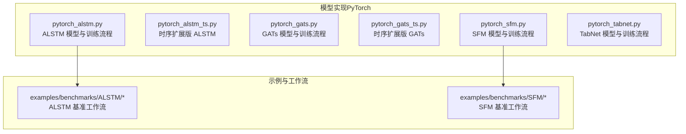
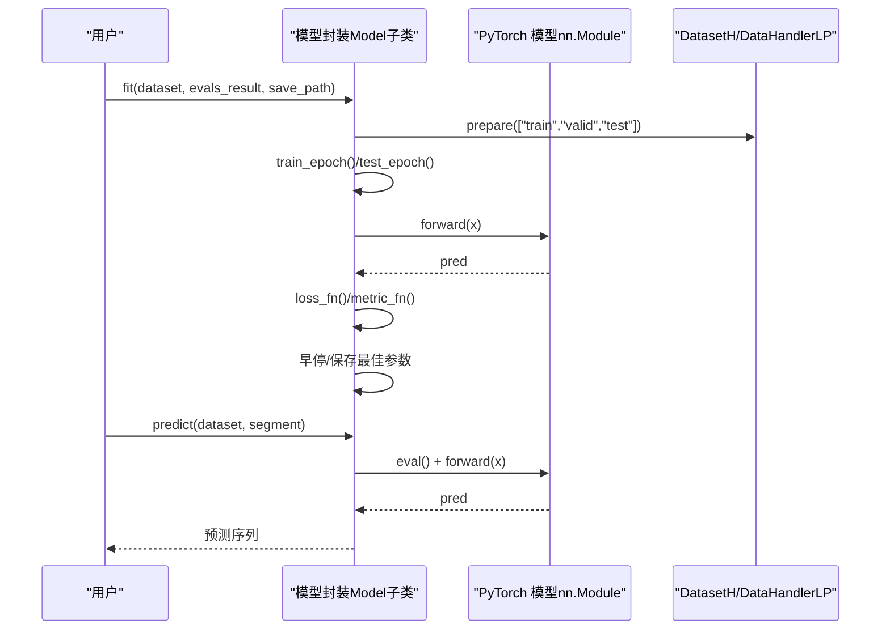
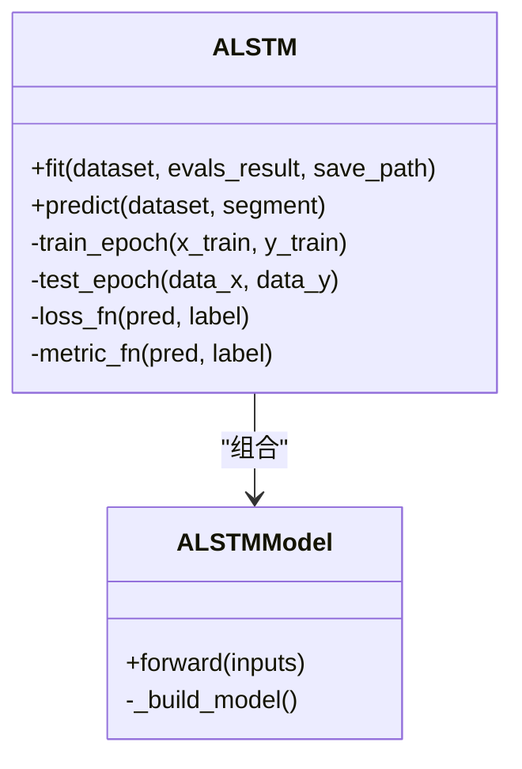
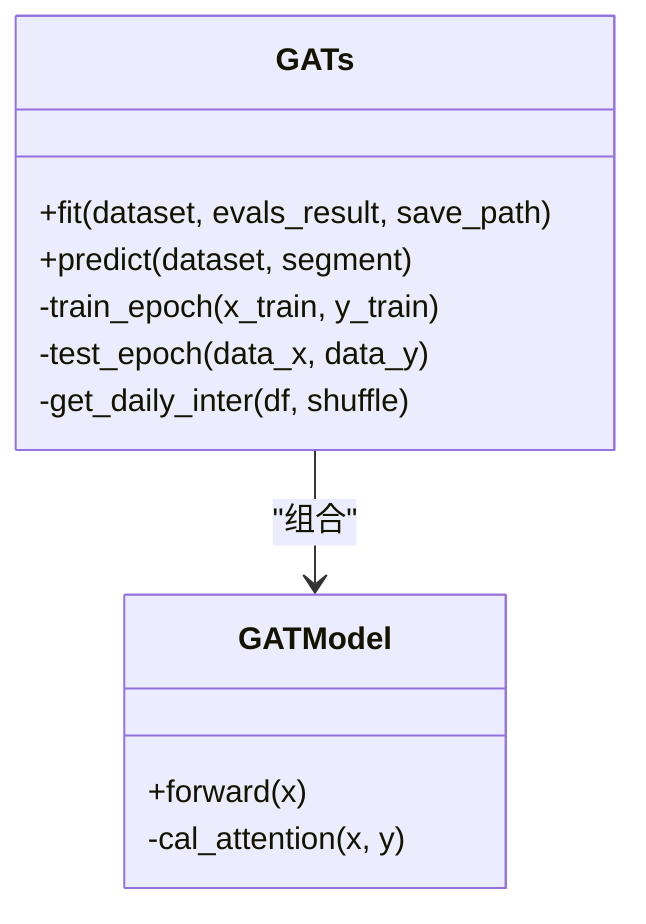
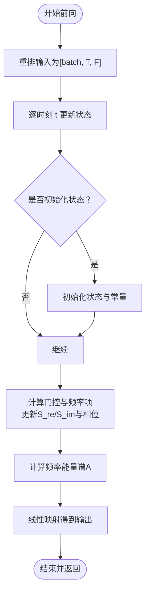
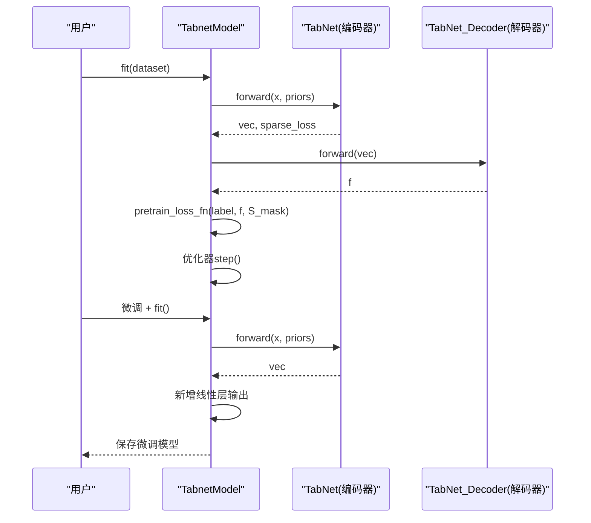
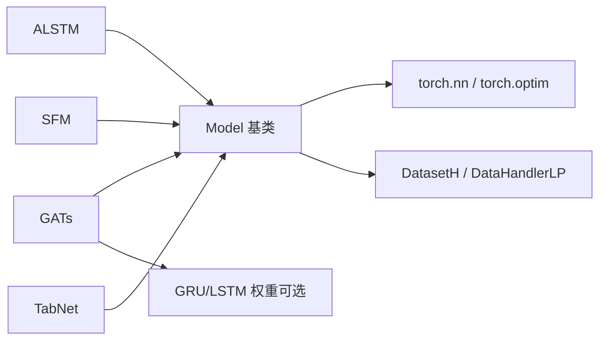

# 专业化模型

<cite>
**本文引用的文件**
- [pytorch_alstm.py](file://qlib/contrib/model/pytorch_alstm.py)
- [pytorch_alstm_ts.py](file://qlib/contrib/model/pytorch_alstm_ts.py)
- [pytorch_gats.py](file://qlib/contrib/model/pytorch_gats.py)
- [pytorch_gats_ts.py](file://qlib/contrib/model/pytorch_gats_ts.py)
- [pytorch_sfm.py](file://qlib/contrib/model/pytorch_sfm.py)
- [pytorch_tabnet.py](file://qlib/contrib/model/pytorch_tabnet.py)
- [README.md（ALSTM 示例）](file://examples/benchmarks/ALSTM/README.md)
- [README.md（SFM 示例）](file://examples/benchmarks/SFM/README.md)
</cite>

## 目录
1. [引言](#引言)
2. [项目结构](#项目结构)
3. [核心组件](#核心组件)
4. [架构总览](#架构总览)
5. [详细组件分析](#详细组件分析)
6. [依赖分析](#依赖分析)
7. [性能考虑](#性能考虑)
8. [故障排查指南](#故障排查指南)
9. [结论](#结论)
10. [附录](#附录)

## 引言
本文件面向在量化金融与时间序列预测场景中使用Qlib的专业用户，系统梳理并深入解析以下四类专业化深度学习模型：ALSTM（基于注意力机制的LSTM）、GATs（图注意力时序融合）、SFM（状态-频率记忆模型）、TabNet（可解释的表征学习）。我们将从架构设计、解决的问题、适用场景、创新点与技术优势、配置要点、训练策略与性能优化建议等方面进行说明，并给出与其他模型的对比思路与实践参考。

## 项目结构
本专题涉及的代码主要位于Qlib的贡献模块中，分别对应四个模型的PyTorch实现与配套工作流示例。下图展示与本文相关的文件组织关系与职责划分。

图表来源
- [pytorch_alstm.py:1-345](file://qlib/contrib/model/pytorch_alstm.py#L1-L345)
- [pytorch_alstm_ts.py:65-345](file://qlib/contrib/model/pytorch_alstm_ts.py#L65-L345)
- [pytorch_gats.py:1-385](file://qlib/contrib/model/pytorch_gats.py#L1-L385)
- [pytorch_gats_ts.py:338-373](file://qlib/contrib/model/pytorch_gats_ts.py#L338-L373)
- [pytorch_sfm.py:1-480](file://qlib/contrib/model/pytorch_sfm.py#L1-L480)
- [pytorch_tabnet.py:1-644](file://qlib/contrib/model/pytorch_tabnet.py#L1-L644)
- [README.md（ALSTM 示例）:1-10](file://examples/benchmarks/ALSTM/README.md#L1-L10)
- [README.md（SFM 示例）:1-3](file://examples/benchmarks/SFM/README.md#L1-L3)

章节来源
- [pytorch_alstm.py:1-345](file://qlib/contrib/model/pytorch_alstm.py#L1-L345)
- [pytorch_gats.py:1-385](file://qlib/contrib/model/pytorch_gats.py#L1-L385)
- [pytorch_sfm.py:1-480](file://qlib/contrib/model/pytorch_sfm.py#L1-L480)
- [pytorch_tabnet.py:1-644](file://qlib/contrib/model/pytorch_tabnet.py#L1-L644)
- [README.md（ALSTM 示例）:1-10](file://examples/benchmarks/ALSTM/README.md#L1-L10)
- [README.md（SFM 示例）:1-3](file://examples/benchmarks/SFM/README.md#L1-L3)

## 核心组件
- ALSTM（Attention-based LSTM）
  - 架构要点：输入经线性层映射后进入RNN（默认GRU），随后通过注意力权重对时间步进行加权聚合，拼接最后一个时间步与注意力池化结果作为预测头输入。
  - 解决问题：在序列建模基础上引入注意力聚合，提升对关键时间步的敏感度；适合多因子时间序列的单变量回归预测。
  - 适用场景：Alpha因子构建、横截面收益预测、高频/低频收益建模。
  - 创新点：将注意力机制与RNN结合，形成“时序+注意力”的轻量融合。
- GATs（Graph Attention Temporal Fusion）
  - 架构要点：以GRU/LSTM为骨干，提取时序特征后计算节点间注意力权重，对隐藏态做图注意力聚合，再经全连接输出。
  - 解决问题：在跨样本（股票/资产）维度上建模依赖关系，融合图注意力与时序建模。
  - 适用场景：跨市场/行业/板块联动预测、多资产联合建模。
  - 创新点：图注意力与RNN的组合，支持按交易日打包的批处理。
- SFM（State Factor Model）
  - 架构要点：基于离散傅里叶变换分解隐藏态的实部/虚部，利用频率域能量谱与相位信息，模拟多周期模式的记忆单元。
  - 解决问题：直接在隐空间中捕获多频率交易模式，避免显式周期检测。
  - 适用场景：周期性较强的市场信号建模、多周期模式识别。
  - 创新点：将DFT融入RNN记忆单元，形成“状态-频率”联合记忆。
- TabNet
  - 架构要点：编码器-解码器预训练框架，采用稀疏注意力（Sparsemax）与可解释的特征选择，逐步筛选重要特征并重建输入。
  - 解决问题：在表格数据上实现自监督预训练与可解释特征选择，缓解过拟合并提升泛化。
  - 适用场景：高维静态特征的回归/分类任务，强调可解释性与特征重要性排序。
  - 创新点：稀疏注意力、虚拟批归一化、逐层特征选择与重构损失。

章节来源
- [pytorch_alstm.py:294-345](file://qlib/contrib/model/pytorch_alstm.py#L294-L345)
- [pytorch_gats.py:326-385](file://qlib/contrib/model/pytorch_gats.py#L326-L385)
- [pytorch_sfm.py:25-178](file://qlib/contrib/model/pytorch_sfm.py#L25-L178)
- [pytorch_tabnet.py:436-596](file://qlib/contrib/model/pytorch_tabnet.py#L436-L596)

## 架构总览
下图展示了四类模型在Qlib中的整体调用关系与数据流：模型封装（继承Model基类）、训练循环、评估与早停、预测接口。

图表来源
- [pytorch_alstm.py:209-291](file://qlib/contrib/model/pytorch_alstm.py#L209-L291)
- [pytorch_gats.py:224-323](file://qlib/contrib/model/pytorch_gats.py#L224-L323)
- [pytorch_sfm.py:360-460](file://qlib/contrib/model/pytorch_sfm.py#L360-L460)
- [pytorch_tabnet.py:151-243](file://qlib/contrib/model/pytorch_tabnet.py#L151-L243)

## 详细组件分析

### ALSTM 组件分析
- 类与方法概览
  - 封装类：ALSTM（继承Model），负责超参设置、训练/验证/预测主循环、早停与保存。
  - 网络类：ALSTMModel（nn.Module），包含线性映射、RNN、注意力网络与输出层。
- 关键流程
  - 输入形状：[batch, features×time_steps]，内部重排为[batch, time_steps, features]。
  - RNN输出后，注意力网络对每个时间步打分并加权求和，与最后一个时间步拼接后送入全连接。
- 训练策略
  - 支持Adam/GD优化器，MSE损失，梯度裁剪，批量训练与早停。
- 性能与稳定性
  - 注意力权重Softmax与RNN拼接可能带来维度膨胀，注意控制hidden_size与dropout。

图表来源
- [pytorch_alstm.py:25-134](file://qlib/contrib/model/pytorch_alstm.py#L25-L134)
- [pytorch_alstm.py:294-345](file://qlib/contrib/model/pytorch_alstm.py#L294-L345)

章节来源
- [pytorch_alstm.py:25-134](file://qlib/contrib/model/pytorch_alstm.py#L25-L134)
- [pytorch_alstm.py:156-207](file://qlib/contrib/model/pytorch_alstm.py#L156-L207)
- [pytorch_alstm.py:209-291](file://qlib/contrib/model/pytorch_alstm.py#L209-L291)
- [pytorch_alstm.py:294-345](file://qlib/contrib/model/pytorch_alstm.py#L294-L345)
- [README.md（ALSTM 示例）:1-10](file://examples/benchmarks/ALSTM/README.md#L1-L10)

### GATs 组件分析
- 类与方法概览
  - 封装类：GATs（继承Model），负责超参、训练/验证/预测、按交易日打包的批次处理。
  - 网络类：GATModel（nn.Module），以GRU/LSTM为骨干，计算节点间注意力并聚合。
- 关键流程
  - 输入重排为[batch, time_steps, features]，RNN提取时序表示后，计算隐藏态间的注意力权重，再与隐藏态加权求和，经FC输出。
  - 支持加载预训练的GRU/LSTM权重作为初始化。
- 训练策略
  - 按交易日切片组织每日批次，支持早停与保存最佳参数。
- 性能与稳定性
  - 图注意力复杂度与节点数相关，适合中小规模跨样本建模。

图表来源
- [pytorch_gats.py:26-142](file://qlib/contrib/model/pytorch_gats.py#L26-L142)
- [pytorch_gats.py:326-385](file://qlib/contrib/model/pytorch_gats.py#L326-L385)

章节来源
- [pytorch_gats.py:26-142](file://qlib/contrib/model/pytorch_gats.py#L26-L142)
- [pytorch_gats.py:164-222](file://qlib/contrib/model/pytorch_gats.py#L164-L222)
- [pytorch_gats.py:224-323](file://qlib/contrib/model/pytorch_gats.py#L224-L323)
- [pytorch_gats.py:326-385](file://qlib/contrib/model/pytorch_gats.py#L326-L385)

### SFM 组件分析
- 类与方法概览
  - 封装类：SFM（继承Model），负责超参、训练/验证/预测、早停与保存。
  - 网络类：SFM_Model（nn.Module），在前向中实现DFT分解的状态更新与频率能量谱融合。
- 关键流程
  - 输入重排为[batch, time_steps, features]，逐时刻更新状态，利用频率域的复数表示（实部/虚部）与相位累积，最终通过线性层输出。
  - 内置状态初始化与常量缓存，保证时序一致性。
- 训练策略
  - 支持SGD/Adam，MSE损失，梯度裁剪，早停。
- 性能与稳定性
  - DFT计算在每一步执行，计算开销随时间步增加而累积，需合理设置hidden_size与freq_dim。

图表来源
- [pytorch_sfm.py:77-139](file://qlib/contrib/model/pytorch_sfm.py#L77-L139)

章节来源
- [pytorch_sfm.py:25-178](file://qlib/contrib/model/pytorch_sfm.py#L25-L178)
- [pytorch_sfm.py:180-306](file://qlib/contrib/model/pytorch_sfm.py#L180-L306)
- [pytorch_sfm.py:308-358](file://qlib/contrib/model/pytorch_sfm.py#L308-L358)
- [pytorch_sfm.py:360-460](file://qlib/contrib/model/pytorch_sfm.py#L360-L460)
- [README.md（SFM 示例）:1-3](file://examples/benchmarks/SFM/README.md#L1-L3)

### TabNet 组件分析
- 类与方法概览
  - 封装类：TabnetModel（继承Model），负责预训练与微调、训练/验证/预测、早停与保存。
  - 编码器：TabNet，包含共享与独立的GLU特征变换层、决策步与稀疏注意力。
  - 解码器：TabNet_Decoder，用于预训练阶段的自监督重构。
- 关键流程
  - 预训练：随机掩蔽部分特征，编码器输出潜在向量，解码器重建被掩蔽特征，最小化重构误差。
  - 微调：冻结预训练权重，新增线性层，仅训练该层或整个网络。
  - 前向：BatchNorm → 第一个特征变换 → 多决策步（注意力mask + 特征变换） → 全连接输出。
- 训练策略
  - 预训练与微调双阶段，稀疏注意力损失辅助特征选择，支持早停。
- 性能与稳定性
  - 虚拟批归一化（Ghost Batch Norm）降低小批量方差影响；Sparsemax替代ReLU实现稀疏选择。

图表来源
- [pytorch_tabnet.py:112-150](file://qlib/contrib/model/pytorch_tabnet.py#L112-L150)
- [pytorch_tabnet.py:151-215](file://qlib/contrib/model/pytorch_tabnet.py#L151-L215)
- [pytorch_tabnet.py:274-297](file://qlib/contrib/model/pytorch_tabnet.py#L274-L297)
- [pytorch_tabnet.py:299-357](file://qlib/contrib/model/pytorch_tabnet.py#L299-L357)
- [pytorch_tabnet.py:436-596](file://qlib/contrib/model/pytorch_tabnet.py#L436-L596)

章节来源
- [pytorch_tabnet.py:25-111](file://qlib/contrib/model/pytorch_tabnet.py#L25-L111)
- [pytorch_tabnet.py:112-215](file://qlib/contrib/model/pytorch_tabnet.py#L112-L215)
- [pytorch_tabnet.py:274-357](file://qlib/contrib/model/pytorch_tabnet.py#L274-L357)
- [pytorch_tabnet.py:436-644](file://qlib/contrib/model/pytorch_tabnet.py#L436-L644)

## 依赖分析
- 模块内依赖
  - 所有模型均继承自Qlib的Model基类，统一了训练/验证/预测接口与早停逻辑。
  - 使用torch.nn、torch.optim、torch.utils.data等标准组件。
  - 部分模型依赖其他贡献模块（如GATs可加载预训练GRU/LSTM权重）。
- 数据依赖
  - 通过DatasetH与DataHandlerLP准备训练/验证/测试数据，支持按“train/valid/test”与“feature/label”列集读取。
- 外部库
  - NumPy、Pandas用于数据处理与索引管理。
  - 可选CUDA设备加速。

图表来源
- [pytorch_alstm.py:19-22](file://qlib/contrib/model/pytorch_alstm.py#L19-L22)
- [pytorch_gats.py:18-23](file://qlib/contrib/model/pytorch_gats.py#L18-L23)
- [pytorch_sfm.py:19-22](file://qlib/contrib/model/pytorch_sfm.py#L19-L22)
- [pytorch_tabnet.py:19-22](file://qlib/contrib/model/pytorch_tabnet.py#L19-L22)

章节来源
- [pytorch_alstm.py:19-22](file://qlib/contrib/model/pytorch_alstm.py#L19-L22)
- [pytorch_gats.py:18-23](file://qlib/contrib/model/pytorch_gats.py#L18-L23)
- [pytorch_sfm.py:19-22](file://qlib/contrib/model/pytorch_sfm.py#L19-L22)
- [pytorch_tabnet.py:19-22](file://qlib/contrib/model/pytorch_tabnet.py#L19-L22)

## 性能考虑
- 计算复杂度
  - ALSTM：RNN复杂度O(T×H×D)，注意力为O(T^2)，整体约O(T^2)（T为时间步，H为隐藏维，D为输入维）。
  - GATs：图注意力O(N^2×H)（N为样本数），适合中小规模跨样本建模。
  - SFM：每步含DFT，复杂度约O(T×F×log F)，其中F为频率维。
  - TabNet：注意力mask与GLU堆叠，稀疏注意力成本可控，整体优于全连接但高于传统MLP。
- 内存与显存
  - 注意力权重矩阵与RNN隐藏态占用显著，建议合理设置batch_size与hidden_size。
  - 使用虚拟批归一化（GBN）降低小批量波动，提高稳定性。
- 训练稳定性
  - 梯度裁剪（阈值3.0）防止爆炸；早停避免过拟合；可选学习率调度（未在上述文件中实现，可在外部集成）。
- 可解释性
  - TabNet的稀疏注意力mask可视为特征选择权重，有助于特征重要性分析。

## 故障排查指南
- 数据为空或格式异常
  - 现象：训练/验证数据为空，抛出“Empty data from dataset”错误。
  - 排查：检查数据集配置、列集合与数据键是否正确。
  - 参考路径：[pytorch_gats.py:230-236](file://qlib/contrib/model/pytorch_gats.py#L230-L236)
- 设备不匹配或CUDA不可用
  - 现象：模型无法加载到指定GPU或报设备错误。
  - 排查：确认GPU ID有效、CUDA可用；必要时回退CPU。
  - 参考路径：[pytorch_alstm.py:73-73](file://qlib/contrib/model/pytorch_alstm.py#L73-L73)
- 优化器/损失/指标不支持
  - 现象：抛出“not supported!”或“unknown loss/metric”。
  - 排查：确保optimizer/lr/loss/metric在实现范围内。
  - 参考路径：[pytorch_alstm.py:122-127](file://qlib/contrib/model/pytorch_alstm.py#L122-L127), [pytorch_alstm.py:140-146](file://qlib/contrib/model/pytorch_alstm.py#L140-L146)
- 预训练模型加载失败
  - 现象：GATs加载预训练权重失败。
  - 排查：确认base_model与路径一致，检查state_dict键名匹配。
  - 参考路径：[pytorch_gats.py:256-266](file://qlib/contrib/model/pytorch_gats.py#L256-L266)
- NaN/Inf导致的数值不稳定
  - 现象：损失NaN或梯度异常。
  - 排查：填充缺失值、限制梯度范数、检查标签范围。
  - 参考路径：[pytorch_tabnet.py:277-278](file://qlib/contrib/model/pytorch_tabnet.py#L277-L278), [pytorch_tabnet.py:368-372](file://qlib/contrib/model/pytorch_tabnet.py#L368-L372)

章节来源
- [pytorch_gats.py:230-236](file://qlib/contrib/model/pytorch_gats.py#L230-L236)
- [pytorch_alstm.py:122-127](file://qlib/contrib/model/pytorch_alstm.py#L122-L127)
- [pytorch_alstm.py:140-146](file://qlib/contrib/model/pytorch_alstm.py#L140-L146)
- [pytorch_gats.py:256-266](file://qlib/contrib/model/pytorch_gats.py#L256-L266)
- [pytorch_tabnet.py:277-278](file://qlib/contrib/model/pytorch_tabnet.py#L277-L278)
- [pytorch_tabnet.py:368-372](file://qlib/contrib/model/pytorch_tabnet.py#L368-L372)

## 结论
- ALSTM通过“注意力+RNN”实现对时间序列关键时刻的聚焦，适合多因子时序建模。
- GATs在跨样本维度引入图注意力，适合多资产联动预测。
- SFM将DFT嵌入记忆单元，天然捕获多周期模式，适合周期性信号。
- TabNet以自监督预训练与稀疏注意力实现可解释特征选择，适合高维静态特征。
- 四者均遵循Qlib统一接口，便于在工作流中快速替换与对比评估。

## 附录
- 模型配置与训练策略建议（通用）
  - 学习率：优先尝试较小初始值（如1e-3~1e-4），结合早停与验证集监控。
  - 批大小：根据显存与收敛稳定性调整，TabNet可利用虚拟批归一化提升小批量稳定性。
  - 正则化：dropout、梯度裁剪、L2正则（如需）。
  - 早停：基于验证集指标，防止过拟合。
  - 预训练：TabNet可先进行无监督预训练，再微调下游任务。
- 实际应用案例（参考示例）
  - ALSTM/SFM：可参考基准工作流中的配置文件与脚本，按Alpha任务目标进行调优。
  - GATs：可结合跨市场/行业数据，使用预训练权重初始化提升收敛速度。
  - TabNet：在高维静态特征场景中，优先关注特征重要性与稀疏注意力mask。