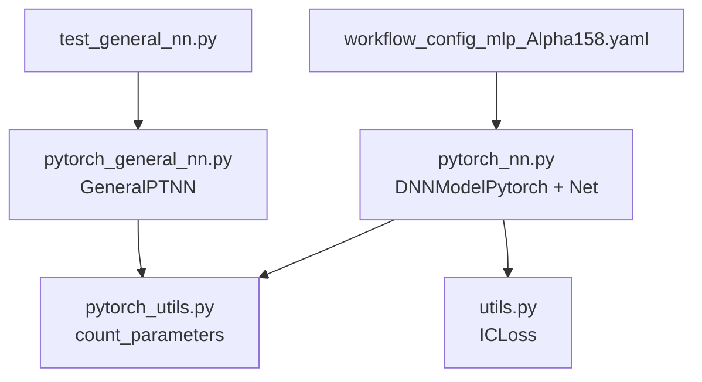
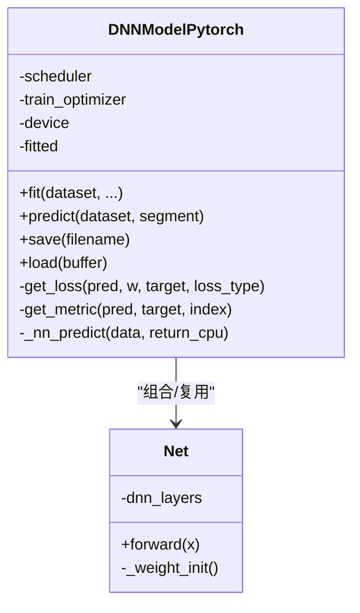
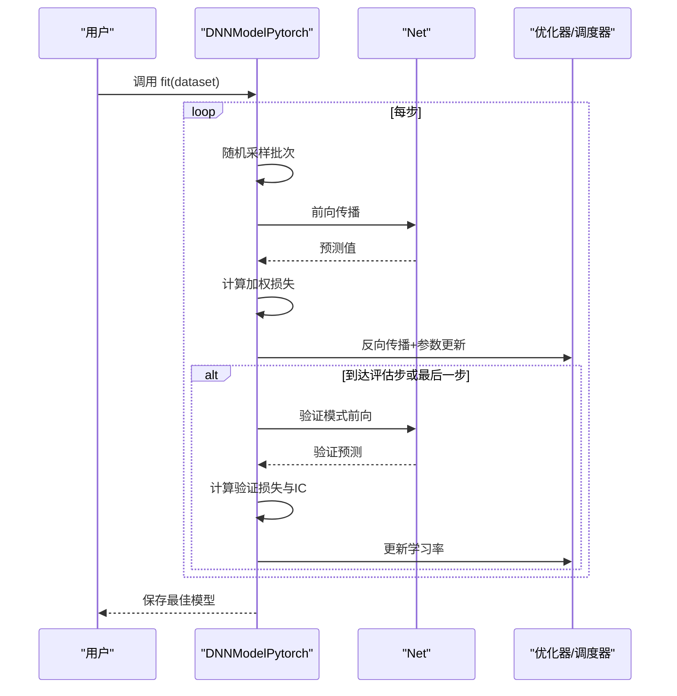
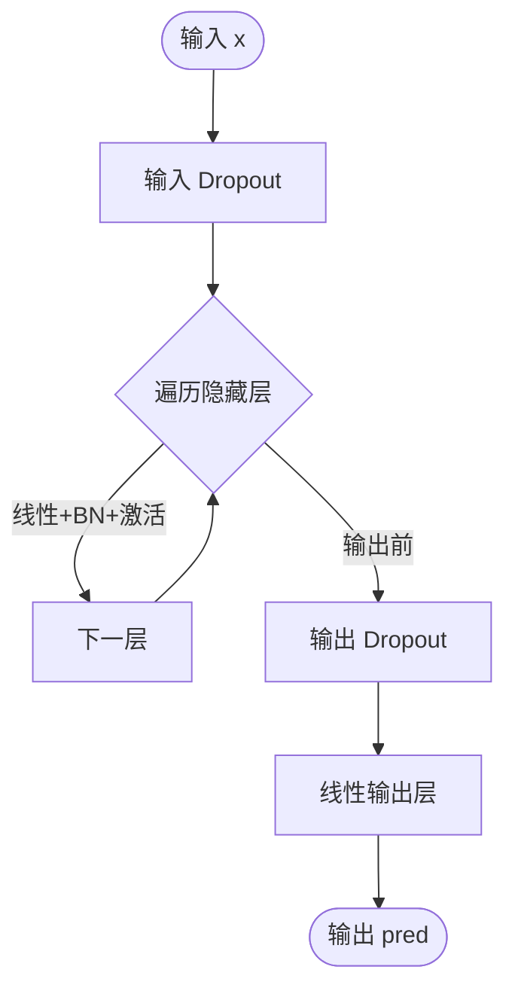
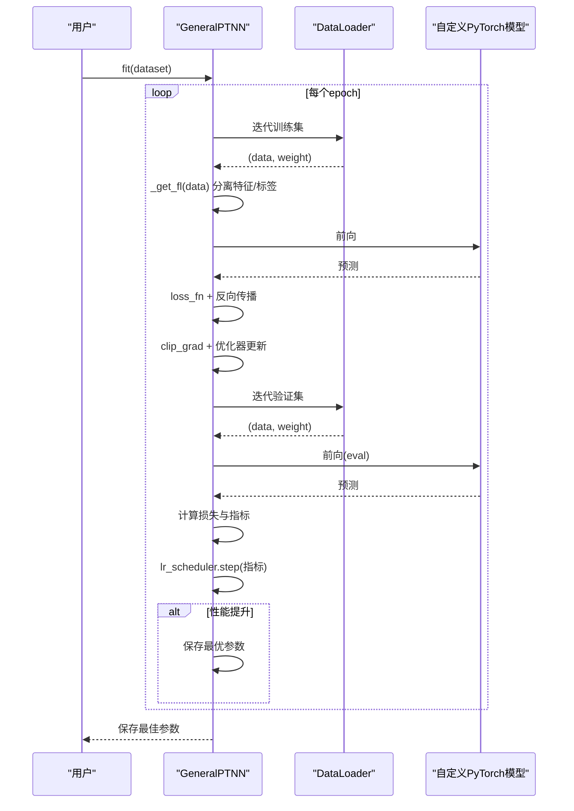
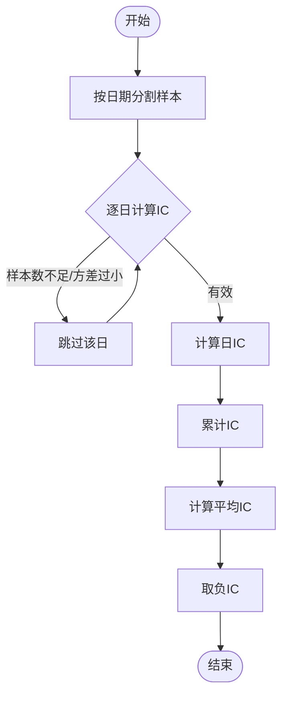
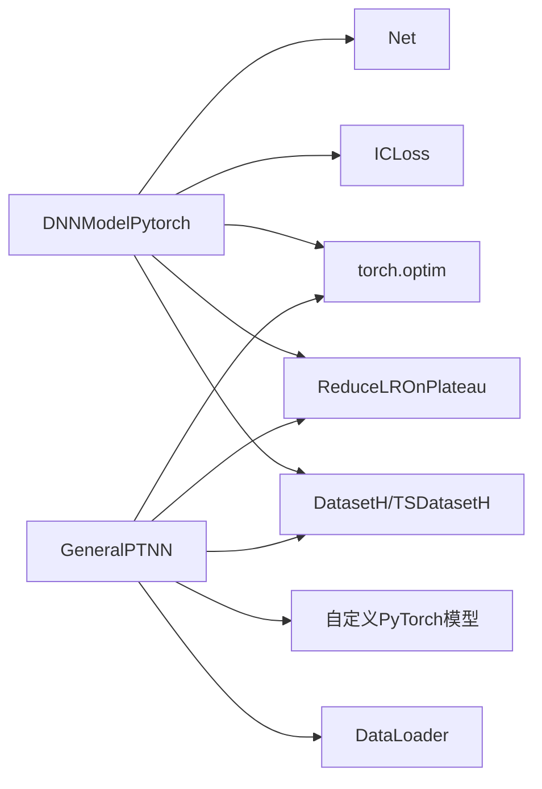

# 基础PyTorch模型

<cite>
**本文引用的文件**
- [pytorch_nn.py](file://qlib/contrib/model/pytorch_nn.py)
- [pytorch_general_nn.py](file://qlib/contrib/model/pytorch_general_nn.py)
- [pytorch_utils.py](file://qlib/contrib/model/pytorch_utils.py)
- [utils.py](file://qlib/contrib/meta/data_selection/utils.py)
- [test_general_nn.py](file://tests/model/test_general_nn.py)
- [workflow_config_mlp_Alpha158.yaml](file://examples/benchmarks/MLP/workflow_config_mlp_Alpha158.yaml)
</cite>

## 目录
1. [简介](#简介)
2. [项目结构](#项目结构)
3. [核心组件](#核心组件)
4. [架构总览](#架构总览)
5. [详细组件分析](#详细组件分析)
6. [依赖分析](#依赖分析)
7. [性能考虑](#性能考虑)
8. [故障排查指南](#故障排查指南)
9. [结论](#结论)
10. [附录：使用示例与最佳实践](#附录使用示例与最佳实践)

## 简介
本文件系统性介绍 Qlib 中的基础 PyTorch 模型实现，重点覆盖以下内容：
- 通用神经网络实现（DNNModelPytorch 与 Net）
- 通用 PyTorch 模型适配器（GeneralPTNN）
- 网络层构建、前向传播、损失函数与优化器配置
- 在量化投资场景中的应用与优势
- 配置选项、超参数调优建议与性能优化技巧

## 项目结构
本次文档聚焦于以下三个模块：
- 基础 PyTorch 模型与适配器：pytorch_nn.py、pytorch_general_nn.py
- 工具函数：pytorch_utils.py（统计参数量）
- 数据选择与 IC 损失：contrib/meta/data_selection/utils.py（ICLoss）
- 测试与示例：tests/model/test_general_nn.py、examples/benchmarks/MLP/workflow_config_mlp_Alpha158.yaml

**图示来源**
- [pytorch_nn.py:1-464](file://qlib/contrib/model/pytorch_nn.py#L1-L464)
- [pytorch_general_nn.py:1-372](file://qlib/contrib/model/pytorch_general_nn.py#L1-L372)
- [pytorch_utils.py:1-38](file://qlib/contrib/model/pytorch_utils.py#L1-L38)
- [utils.py:12-64](file://qlib/contrib/meta/data_selection/utils.py#L12-L64)
- [test_general_nn.py:1-81](file://tests/model/test_general_nn.py#L1-L81)
- [workflow_config_mlp_Alpha158.yaml:1-99](file://examples/benchmarks/MLP/workflow_config_mlp_Alpha158.yaml#L1-L99)

**章节来源**
- [pytorch_nn.py:1-464](file://qlib/contrib/model/pytorch_nn.py#L1-L464)
- [pytorch_general_nn.py:1-372](file://qlib/contrib/model/pytorch_general_nn.py#L1-L372)
- [pytorch_utils.py:1-38](file://qlib/contrib/model/pytorch_utils.py#L1-L38)
- [utils.py:12-64](file://qlib/contrib/meta/data_selection/utils.py#L12-L64)
- [test_general_nn.py:1-81](file://tests/model/test_general_nn.py#L1-L81)
- [workflow_config_mlp_Alpha158.yaml:1-99](file://examples/benchmarks/MLP/workflow_config_mlp_Alpha158.yaml#L1-L99)

## 核心组件
- DNNModelPytorch：基于 Net 的端到端训练与预测封装，支持回归与二分类损失、早停、学习率调度、权重重采样等。
- Net：基础多层感知机（MLP）网络，包含 Dropout、BatchNorm、可选激活函数与 Kaiming 初始化。
- GeneralPTNN：通用 PyTorch 模型适配器，统一训练/验证/预测流程，支持时间序列与表征数据。
- ICLoss：按交易日分组计算 IC（信息系数）损失，用于量化投资中的排序稳定性评估。
- count_parameters：统计模型参数量，辅助模型规模评估。

**章节来源**
- [pytorch_nn.py:39-464](file://qlib/contrib/model/pytorch_nn.py#L39-L464)
- [pytorch_general_nn.py:33-372](file://qlib/contrib/model/pytorch_general_nn.py#L33-L372)
- [utils.py:12-64](file://qlib/contrib/meta/data_selection/utils.py#L12-L64)
- [pytorch_utils.py:7-38](file://qlib/contrib/model/pytorch_utils.py#L7-L38)

## 架构总览
下图展示 DNNModelPytorch 与 Net 的类关系及训练流程：

**图示来源**
- [pytorch_nn.py:39-464](file://qlib/contrib/model/pytorch_nn.py#L39-L464)

## 详细组件分析

### DNNModelPytorch 组件分析
- 职责与定位
  - 封装训练循环、验证与早停、学习率调度、权重重采样、模型保存/加载。
  - 支持回归（MSE）与二分类（BCEWithLogitsLoss）两类损失。
  - 使用 ICLoss 计算 IC 指标作为验证指标（负 IC）。
- 关键配置项
  - 学习率、最大步数、批次大小、早停轮数、评估步长、优化器类型、损失类型、GPU 设备、随机种子、权重衰减、数据并行、学习率调度器、初始化模型、是否评估训练集指标、内部 Net 的构造参数、验证键。
- 训练流程要点
  - 准备训练/验证张量，按批次随机采样，前向传播，反向传播，梯度更新，周期性验证，早停与最优模型保存，学习率调度。
- 预测流程
  - 将输入数据分批送入模型，拼接输出，返回带索引的序列结果。

**图示来源**
- [pytorch_nn.py:190-337](file://qlib/contrib/model/pytorch_nn.py#L190-L337)

**章节来源**
- [pytorch_nn.py:39-184](file://qlib/contrib/model/pytorch_nn.py#L39-L184)
- [pytorch_nn.py:190-337](file://qlib/contrib/model/pytorch_nn.py#L190-L337)
- [pytorch_nn.py:342-356](file://qlib/contrib/model/pytorch_nn.py#L342-L356)
- [pytorch_nn.py:358-387](file://qlib/contrib/model/pytorch_nn.py#L358-L387)
- [pytorch_nn.py:389-404](file://qlib/contrib/model/pytorch_nn.py#L389-L404)

### Net 组件分析
- 结构组成
  - 输入 Dropout → 多层线性层 + BatchNorm + 激活 → 输出 Dropout → 线性输出层。
  - 支持 LeakyReLU 与 SiLU 两种激活；默认使用 LeakyReLU。
  - 权重初始化采用 Kaiming 正态分布（适合 LeakyReLU）。
- 前向传播
  - 顺序通过各层，最终输出标量或向量预测。

**图示来源**
- [pytorch_nn.py:426-464](file://qlib/contrib/model/pytorch_nn.py#L426-L464)

**章节来源**
- [pytorch_nn.py:426-464](file://qlib/contrib/model/pytorch_nn.py#L426-L464)

### GeneralPTNN 组件分析
- 动机与能力
  - 通用 PyTorch 模型适配器，通过配置注入任意 PyTorch 模型类与参数，统一训练/验证/预测流程。
  - 支持时间序列与表征数据两类输入，自动区分特征与标签切片。
- 关键配置项
  - 训练轮次、学习率、评估指标、批次大小、早停轮数、损失类型、权重衰减、优化器、工作进程数、GPU、随机种子、模型类 URI 与参数。
- 训练/验证流程
  - 使用 DataLoader 包装数据，训练时裁剪梯度，验证时记录损失与指标，早停并保存最优参数。
- 预测流程
  - 对测试集分批推理，拼接并返回带索引的预测序列。

**图示来源**
- [pytorch_general_nn.py:235-333](file://qlib/contrib/model/pytorch_general_nn.py#L235-L333)

**章节来源**
- [pytorch_general_nn.py:33-149](file://qlib/contrib/model/pytorch_general_nn.py#L33-L149)
- [pytorch_general_nn.py:151-200](file://qlib/contrib/model/pytorch_general_nn.py#L151-L200)
- [pytorch_general_nn.py:202-234](file://qlib/contrib/model/pytorch_general_nn.py#L202-L234)
- [pytorch_general_nn.py:235-333](file://qlib/contrib/model/pytorch_general_nn.py#L235-L333)
- [pytorch_general_nn.py:334-372](file://qlib/contrib/model/pytorch_general_nn.py#L334-L372)

### ICLoss 组件分析
- 作用
  - 在量化投资场景中衡量模型预测与未来收益的排序一致性，按交易日分组计算 IC 并取负值作为损失。
- 实现要点
  - 遍历索引，按日期分割样本，跳过样本过少或方差过小的日期，计算日 IC 并求平均。

**图示来源**
- [utils.py:12-64](file://qlib/contrib/meta/data_selection/utils.py#L12-L64)

**章节来源**
- [utils.py:12-64](file://qlib/contrib/meta/data_selection/utils.py#L12-L64)

## 依赖分析
- DNNModelPytorch 依赖
  - Net（网络主体）、ICLoss（验证指标）、优化器与调度器、数据集接口、权重重采样器 Reweighter。
- GeneralPTNN 依赖
  - 自定义 PyTorch 模型（通过 URI 注入）、DataLoader、损失与指标函数、早停调度器。
- 共同依赖
  - torch、torch.nn、torch.optim、DataHandlerLP、DatasetH/TSDatasetH、Reweighter、计数工具 count_parameters。

**图示来源**
- [pytorch_nn.py:39-184](file://qlib/contrib/model/pytorch_nn.py#L39-L184)
- [pytorch_general_nn.py:33-149](file://qlib/contrib/model/pytorch_general_nn.py#L33-L149)
- [utils.py:12-64](file://qlib/contrib/meta/data_selection/utils.py#L12-L64)

**章节来源**
- [pytorch_nn.py:17-36](file://qlib/contrib/model/pytorch_nn.py#L17-L36)
- [pytorch_general_nn.py:6-31](file://qlib/contrib/model/pytorch_general_nn.py#L6-L31)

## 性能考虑
- 内存与显存
  - 训练阶段将张量移动至设备，注意大批量可能导致显存压力；可适当降低 batch_size 或启用数据并行（DNNModelPytorch 支持 DataParallel）。
  - 预测阶段分批处理（固定 batch size），避免一次性载入全部测试集。
- 梯度控制
  - GeneralPTNN 在训练中对梯度进行裁剪，有助于缓解梯度爆炸问题。
- 学习率调度
  - DNNModelPytorch 支持 ReduceLROnPlateau；GeneralPTNN 使用 ReduceLROnPlateau，二者均可根据验证指标动态调整学习率。
- 参数量与初始化
  - 使用 count_parameters 快速估算模型规模；Net 默认 Kaiming 初始化，适合 LeakyReLU/SiLU。
- 数据加载
  - 使用 DataLoader 并合理设置 num_workers 与 drop_last，提升吞吐。

**章节来源**
- [pytorch_general_nn.py:213-214](file://qlib/contrib/model/pytorch_general_nn.py#L213-L214)
- [pytorch_general_nn.py:141-143](file://qlib/contrib/model/pytorch_general_nn.py#L141-L143)
- [pytorch_nn.py:149-181](file://qlib/contrib/model/pytorch_nn.py#L149-L181)
- [pytorch_utils.py:7-38](file://qlib/contrib/model/pytorch_utils.py#L7-L38)

## 故障排查指南
- 导入错误
  - 测试用例中若导入失败会打印提示，检查依赖安装与路径配置。
- 数据为空
  - GeneralPTNN 在准备数据后若发现空集会抛出异常，需检查数据集配置与分段设置。
- 不支持的数据形状
  - GeneralPTNN 的特征/标签切片逻辑仅支持二维（表征）与三维（时间序列）输入，其他形状会报错。
- 损失/优化器不支持
  - DNNModelPytorch 的损失类型限制为回归与二分类；优化器支持 Adam 与 SGD；不支持类型会抛出异常。
- GPU 与 CUDA
  - 若未检测到可用 GPU，模型将退化为 CPU 训练；请确认设备号与驱动环境。

**章节来源**
- [test_general_nn.py:11-13](file://tests/model/test_general_nn.py#L11-L13)
- [pytorch_general_nn.py:248-249](file://qlib/contrib/model/pytorch_general_nn.py#L248-L249)
- [pytorch_general_nn.py:198-199](file://qlib/contrib/model/pytorch_general_nn.py#L198-L199)
- [pytorch_nn.py:127-129](file://qlib/contrib/model/pytorch_nn.py#L127-L129)
- [pytorch_nn.py:142-147](file://qlib/contrib/model/pytorch_nn.py#L142-L147)

## 结论
- DNNModelPytorch 提供了面向量化投资任务的完整训练/预测闭环，适合快速搭建与部署 MLP 类模型。
- GeneralPTNN 通过配置注入的方式，将任意 PyTorch 模型纳入 Qlib 工作流，具备良好的扩展性。
- ICLoss 与早停策略结合，使模型在 IC 指标上更稳定收敛。
- 建议优先从较小网络与合理 batch size 开始，逐步调参并监控验证指标与学习率变化。

## 附录：使用示例与最佳实践

### 使用示例：DNNModelPytorch（MLP）
- 定义网络结构
  - 通过 pt_model_kwargs 传入 input_dim 等参数给 Net。
- 设置训练参数
  - loss、lr、optimizer、max_steps、batch_size、GPU、weight_decay、pt_model_kwargs 等。
- 训练与预测
  - 使用 DatasetH 作为数据源，调用 fit 与 predict 即可完成训练与推理。
- 示例参考
  - workflow_config_mlp_Alpha158.yaml 展示了完整的任务配置与记录流程。

**章节来源**
- [workflow_config_mlp_Alpha158.yaml:60-99](file://examples/benchmarks/MLP/workflow_config_mlp_Alpha158.yaml#L60-L99)
- [pytorch_nn.py:57-121](file://qlib/contrib/model/pytorch_nn.py#L57-L121)
- [pytorch_nn.py:190-337](file://qlib/contrib/model/pytorch_nn.py#L190-L337)
- [pytorch_nn.py:382-387](file://qlib/contrib/model/pytorch_nn.py#L382-L387)

### 使用示例：GeneralPTNN（适配任意 PyTorch 模型）
- 注入模型
  - 通过 pt_model_uri 指定模型类，pt_model_kwargs 传入模型所需参数。
- 训练与预测
  - 支持时间序列与表征数据；训练时自动处理 NaN 填充，验证时早停并保存最优参数。
- 测试参考
  - test_general_nn.py 展示了同时在时间序列与表征数据上的训练与预测流程。

**章节来源**
- [test_general_nn.py:50-77](file://tests/model/test_general_nn.py#L50-L77)
- [pytorch_general_nn.py:65-72](file://qlib/contrib/model/pytorch_general_nn.py#L65-L72)
- [pytorch_general_nn.py:235-333](file://qlib/contrib/model/pytorch_general_nn.py#L235-L333)
- [pytorch_general_nn.py:334-372](file://qlib/contrib/model/pytorch_general_nn.py#L334-L372)

### 模型配置选项与超参数调优建议
- 学习率与优化器
  - 初始学习率建议在 1e-3~1e-4 之间；Adam 在大多数情况下优于 SGD。
- 批大小与早停
  - 从较小 batch_size 开始，逐步增大；早停 patience 建议 10~20，阈值 1e-4~1e-3。
- 网络结构
  - 隐藏层宽度与层数应与输入维度匹配；使用 Dropout 与 BN 提升泛化。
- 损失与指标
  - 回归任务使用 MSE；二分类使用 BCEWithLogitsLoss；验证阶段关注 IC 指标。
- 性能优化
  - 合理设置 num_workers；必要时启用数据并行；对梯度进行裁剪；及时释放缓存。

**章节来源**
- [pytorch_general_nn.py:133-138](file://qlib/contrib/model/pytorch_general_nn.py#L133-L138)
- [pytorch_general_nn.py:141-143](file://qlib/contrib/model/pytorch_general_nn.py#L141-L143)
- [pytorch_general_nn.py:213-214](file://qlib/contrib/model/pytorch_general_nn.py#L213-L214)
- [pytorch_nn.py:142-147](file://qlib/contrib/model/pytorch_nn.py#L142-L147)
- [pytorch_nn.py:149-181](file://qlib/contrib/model/pytorch_nn.py#L149-L181)