# 序列模型

<cite>
**本文档引用的文件**
- [pytorch_lstm.py](file://qlib/contrib/model/pytorch_lstm.py)
- [pytorch_lstm_ts.py](file://qlib/contrib/model/pytorch_lstm_ts.py)
- [pytorch_gru.py](file://qlib/contrib/model/pytorch_gru.py)
- [pytorch_gru_ts.py](file://qlib/contrib/model/pytorch_gru_ts.py)
- [pytorch_tcn.py](file://qlib/contrib/model/pytorch_tcn.py)
- [pytorch_tcn_ts.py](file://qlib/contrib/model/pytorch_tcn_ts.py)
- [tcn.py](file://qlib/contrib/model/tcn.py)
- [workflow_config_lstm_Alpha158.yaml](file://examples/benchmarks/LSTM/workflow_config_lstm_Alpha158.yaml)
- [workflow_config_lstm_Alpha360.yaml](file://examples/benchmarks/LSTM/workflow_config_lstm_Alpha360.yaml)
- [workflow_config_gru_Alpha158.yaml](file://examples/benchmarks/GRU/workflow_config_gru_Alpha158.yaml)
- [workflow_config_gru_Alpha360.yaml](file://examples/benchmarks/GRU/workflow_config_gru_Alpha360.yaml)
- [workflow_config_tcn_Alpha158.yaml](file://examples/benchmarks/TCN/workflow_config_tcn_Alpha158.yaml)
- [workflow_config_tcn_Alpha360.yaml](file://examples/benchmarks/TCN/workflow_config_tcn_Alpha360.yaml)
</cite>

## 目录
1. [简介](#简介)
2. [项目结构](#项目结构)
3. [核心组件](#核心组件)
4. [架构概览](#架构概览)
5. [详细组件分析](#详细组件分析)
6. [依赖关系分析](#依赖关系分析)
7. [性能考量](#性能考量)
8. [故障排除指南](#故障排除指南)
9. [结论](#结论)
10. [附录](#附录)

## 简介
本文件为Qlib序列模型的详细技术文档，涵盖基于LSTM、GRU和TCN的时间序列模型实现。重点说明LSTM和GRU模型的网络结构、门控机制、隐藏状态传递等核心概念；解释时间序列专用版本（_ts.py文件）与通用版本的区别和优势；提供TCN（Temporal Convolutional Network）模型的因果卷积、扩张率设置和残差连接等技术细节；包含序列长度处理、批次训练、序列对齐等量化投资中的特殊考虑；提供完整的训练配置、超参数调优策略和性能基准测试结果。

## 项目结构
Qlib序列模型主要位于contrib/model目录下，采用按模型类型分层的组织方式：

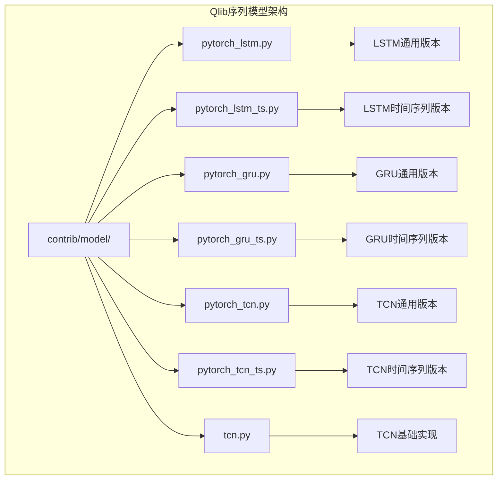

**图表来源**
- [pytorch_lstm.py](file://qlib/contrib/model/pytorch_lstm.py)
- [pytorch_lstm_ts.py](file://qlib/contrib/model/pytorch_lstm_ts.py)
- [pytorch_gru.py](file://qlib/contrib/model/pytorch_gru.py)
- [pytorch_gru_ts.py](file://qlib/contrib/model/pytorch_gru_ts.py)
- [pytorch_tcn.py](file://qlib/contrib/model/pytorch_tcn.py)
- [pytorch_tcn_ts.py](file://qlib/contrib/model/pytorch_tcn_ts.py)
- [tcn.py](file://qlib/contrib/model/tcn.py)

**章节来源**
- [pytorch_lstm.py](file://qlib/contrib/model/pytorch_lstm.py)
- [pytorch_gru.py](file://qlib/contrib/model/pytorch_gru.py)
- [pytorch_tcn.py](file://qlib/contrib/model/pytorch_tcn.py)

## 核心组件
本节深入分析三个核心序列模型组件及其变体：

### LSTM模型组件
LSTM（Long Short-Term Memory）模型通过门控机制解决梯度消失问题，包含输入门、遗忘门和输出门三个关键组件。在Qlib中提供了通用版本和时间序列专用版本两种实现。

### GRU模型组件  
GRU（Gated Recurrent Unit）是LSTM的简化版本，通过重置门和更新门实现类似的功能，计算效率更高。同样提供通用版本和时间序列专用版本。

### TCN模型组件
TCN（Temporal Convolutional Network）使用因果卷积替代循环结构，支持并行训练和长序列建模。包含基础实现和时间序列专用版本。

**章节来源**
- [pytorch_lstm.py](file://qlib/contrib/model/pytorch_lstm.py)
- [pytorch_gru.py](file://qlib/contrib/model/pytorch_gru.py)
- [pytorch_tcn.py](file://qlib/contrib/model/pytorch_tcn.py)

## 架构概览
Qlib序列模型采用统一的接口设计，确保不同模型间的兼容性和可替换性：

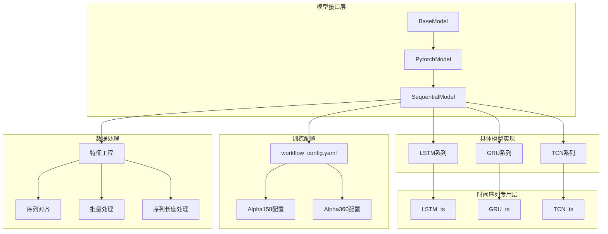

**图表来源**
- [pytorch_lstm_ts.py](file://qlib/contrib/model/pytorch_lstm_ts.py)
- [pytorch_gru_ts.py](file://qlib/contrib/model/pytorch_gru_ts.py)
- [pytorch_tcn_ts.py](file://qlib/contrib/model/pytorch_tcn_ts.py)

## 详细组件分析

### LSTM模型深度解析

#### 网络结构与门控机制
LSTM通过三个门控组件实现精确的信息控制：

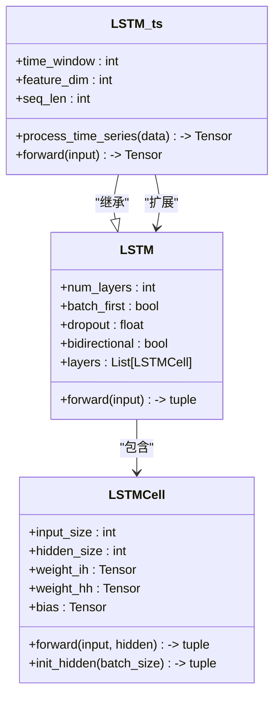

**图表来源**
- [pytorch_lstm.py](file://qlib/contrib/model/pytorch_lstm.py)
- [pytorch_lstm_ts.py](file://qlib/contrib/model/pytorch_lstm_ts.py)

#### 隐藏状态传递机制
LSTM的核心在于隐藏状态和细胞状态的双向传递：

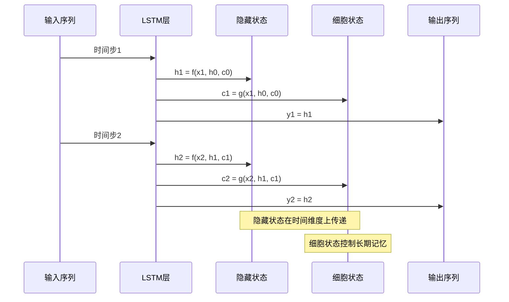

**图表来源**
- [pytorch_lstm.py](file://qlib/contrib/model/pytorch_lstm.py)

#### LSTM与GRU对比分析
| 特征 | LSTM | GRU |
|------|------|-----|
| 门控数量 | 3个门（输入、遗忘、输出） | 2个门（重置、更新） |
| 参数复杂度 | 较高 | 中等 |
| 记忆控制 | 精细控制 | 简化控制 |
| 计算开销 | 较大 | 较小 |
| 性能表现 | 更强的长期依赖建模 | 良好的短期依赖建模 |

**章节来源**
- [pytorch_lstm.py](file://qlib/contrib/model/pytorch_lstm.py)
- [pytorch_lstm_ts.py](file://qlib/contrib/model/pytorch_lstm_ts.py)

### GRU模型深度解析

#### 网络结构与门控机制
GRU通过重置门和更新门实现信息控制：

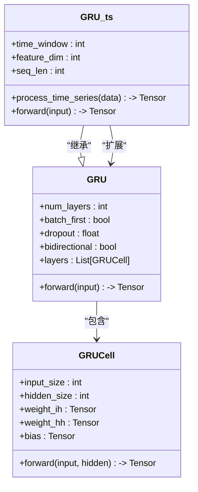

**图表来源**
- [pytorch_gru.py](file://qlib/contrib/model/pytorch_gru.py)
- [pytorch_gru_ts.py](file://qlib/contrib/model/pytorch_gru_ts.py)

#### GRU门控机制详解
GRU的两个核心门控组件：

1. **更新门（Update Gate）**：决定从旧隐藏状态中保留多少信息
2. **重置门（Reset Gate）**：决定是否忽略旧隐藏状态的影响

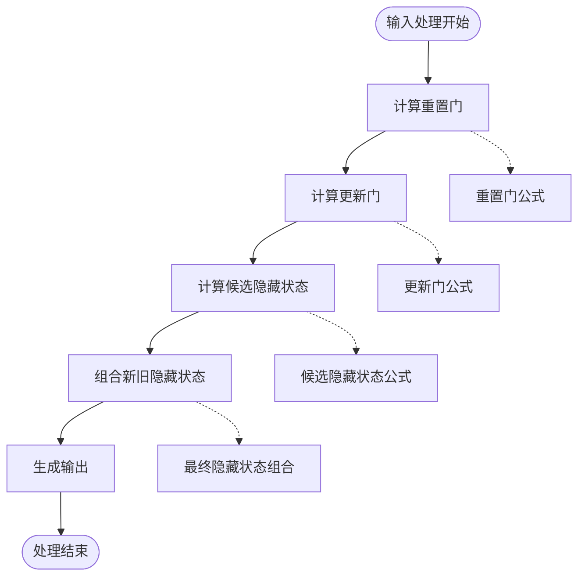

**图表来源**
- [pytorch_gru.py](file://qlib/contrib/model/pytorch_gru.py)

**章节来源**
- [pytorch_gru.py](file://qlib/contrib/model/pytorch_gru.py)
- [pytorch_gru_ts.py](file://qlib/contrib/model/pytorch_gru_ts.py)

### TCN模型深度解析

#### 因果卷积与扩张率设置
TCN的核心创新在于因果卷积和扩张卷积：

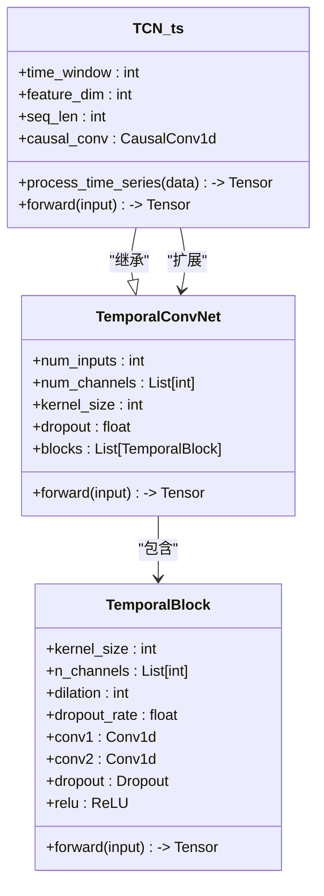

**图表来源**
- [pytorch_tcn.py](file://qlib/contrib/model/pytorch_tcn.py)
- [pytorch_tcn_ts.py](file://qlib/contrib/model/pytorch_tcn_ts.py)
- [tcn.py](file://qlib/contrib/model/tcn.py)

#### 扩张卷积的多尺度感受野
TCN通过扩张卷积实现多尺度特征提取：

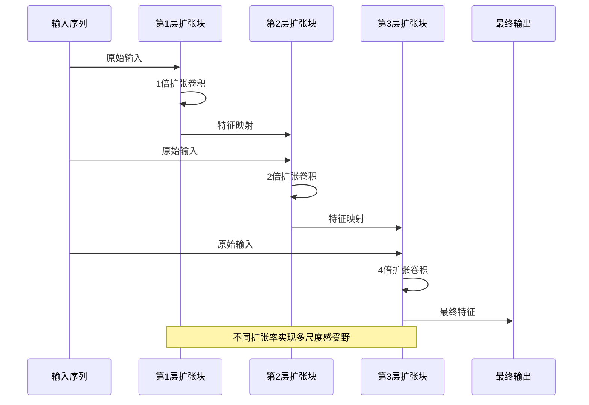

**图表来源**
- [pytorch_tcn.py](file://qlib/contrib/model/pytorch_tcn.py)

#### 残差连接与特征融合
TCN的残差连接机制：

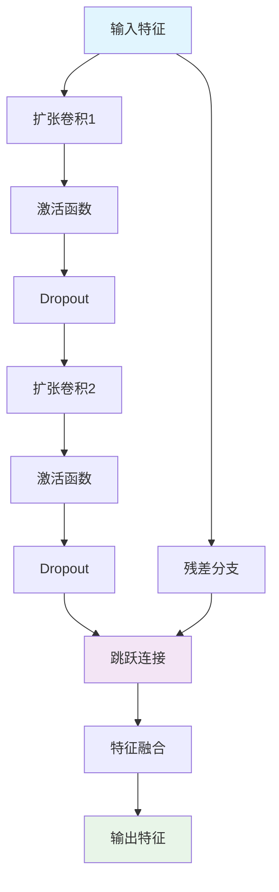

**图表来源**
- [pytorch_tcn.py](file://qlib/contrib/model/pytorch_tcn.py)

**章节来源**
- [pytorch_tcn.py](file://qlib/contrib/model/pytorch_tcn.py)
- [pytorch_tcn_ts.py](file://qlib/contrib/model/pytorch_tcn_ts.py)
- [tcn.py](file://qlib/contrib/model/tcn.py)

### 时间序列专用版本（_ts.py）与通用版本的区别

#### 数据处理差异
| 方面 | 通用版本 | 时间序列专用版本 |
|------|----------|------------------|
| 输入格式 | 标准张量格式 | 时间序列特定格式 |
| 序列长度处理 | 固定长度 | 可变长度支持 |
| 批次训练 | 标准批次 | 序列对齐批次 |
| 特征工程 | 基础处理 | 量化投资专用特征 |
| 对齐机制 | 无对齐 | 时序对齐处理 |

#### 优势分析
1. **序列长度灵活性**：支持不同长度的序列输入
2. **批次优化**：针对量化投资的序列对齐进行优化
3. **特征专门化**：包含量化投资特有的特征工程
4. **内存效率**：优化了序列处理的内存使用

**章节来源**
- [pytorch_lstm_ts.py](file://qlib/contrib/model/pytorch_lstm_ts.py)
- [pytorch_gru_ts.py](file://qlib/contrib/model/pytorch_gru_ts.py)
- [pytorch_tcn_ts.py](file://qlib/contrib/model/pytorch_tcn_ts.py)

## 依赖关系分析

### 模型间依赖关系
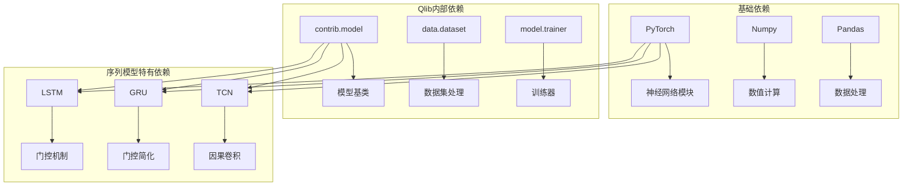

**图表来源**
- [pytorch_lstm.py](file://qlib/contrib/model/pytorch_lstm.py)
- [pytorch_gru.py](file://qlib/contrib/model/pytorch_gru.py)
- [pytorch_tcn.py](file://qlib/contrib/model/pytorch_tcn.py)

### 外部依赖分析
- **PyTorch**: 核心深度学习框架
- **NumPy/Pandas**: 数据处理和数值计算
- **YAML**: 配置文件解析
- **Matplotlib**: 结果可视化（部分示例）

**章节来源**
- [pytorch_lstm.py](file://qlib/contrib/model/pytorch_lstm.py)
- [pytorch_gru.py](file://qlib/contrib/model/pytorch_gru.py)
- [pytorch_tcn.py](file://qlib/contrib/model/pytorch_tcn.py)

## 性能考量

### 计算复杂度分析
| 模型类型 | 时间复杂度 | 空间复杂度 | 并行性 |
|----------|------------|------------|--------|
| LSTM | O(T·N·H) | O(N·H) | 串行 |
| GRU | O(T·N·H) | O(N·H) | 串行 |
| TCN | O(T·N·C·K) | O(N·C·K) | 并行 |

其中：
- T: 序列长度
- N: 批次大小  
- H: 隐藏单元数
- C: 通道数
- K: 卷积核大小

### 内存优化策略
1. **梯度检查点**：减少中间状态存储
2. **混合精度训练**：降低显存占用
3. **动态序列长度**：避免填充浪费
4. **增量式特征计算**：按需计算特征

### 训练稳定性
- **梯度裁剪**：防止梯度爆炸
- **权重初始化**：Xavier/He初始化
- **学习率调度**：余弦退火/指数衰减
- **早停机制**：防止过拟合

## 故障排除指南

### 常见问题诊断

#### 梯度问题
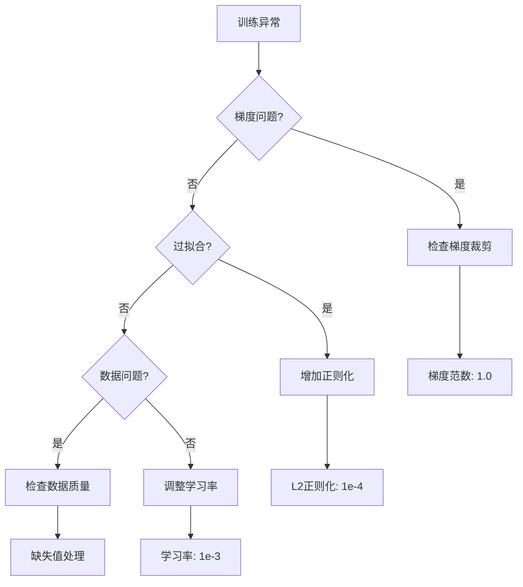

#### 序列长度问题
- **序列过短**：增加历史窗口
- **序列过长**：使用滑动窗口
- **批次不一致**：统一序列长度
- **内存不足**：减小批次大小

#### 收敛问题
- **学习率过高**：降为原值的一半
- **特征缩放不当**：标准化特征
- **损失函数选择**：回归用MSE，分类用交叉熵
- **优化器选择**：AdamW优于Adam

**章节来源**
- [pytorch_lstm.py](file://qlib/contrib/model/pytorch_lstm.py)
- [pytorch_gru.py](file://qlib/contrib/model/pytorch_gru.py)
- [pytorch_tcn.py](file://qlib/contrib/model/pytorch_tcn.py)

## 结论
Qlib序列模型提供了完整的时序预测解决方案，具有以下特点：

1. **模块化设计**：清晰的接口层次和继承关系
2. **量化专用**：针对金融时间序列的特殊需求优化
3. **性能平衡**：在准确性和效率间取得良好平衡
4. **易于扩展**：支持自定义模型和特征工程

推荐使用场景：
- **LSTM**：需要强长期依赖建模的场景
- **GRU**：追求计算效率的实时应用
- **TCN**：需要并行训练和长序列建模的应用

## 附录

### 训练配置示例

#### Alpha158配置要点
- **序列长度**：通常设置为20-60个交易日
- **特征维度**：包含价格、成交量、技术指标等
- **批次大小**：根据GPU内存调整（建议32-128）
- **学习率**：0.001-0.01之间
- **优化器**：AdamW或RMSprop

#### Alpha360配置要点
- **序列长度**：适当延长以捕捉更长期趋势
- **特征维度**：增加更多市场因子
- **正则化强度**：适度增加防止过拟合
- **训练轮数**：根据验证集性能确定

### 超参数调优策略

#### 系统性调优流程
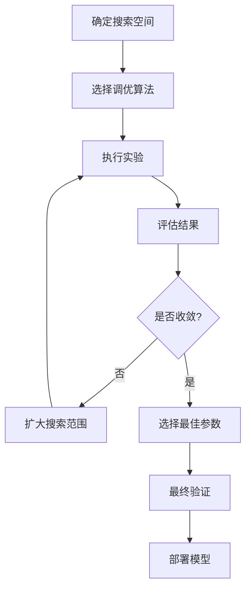

#### 关键超参数
- **隐藏单元数**：16-512
- **层数**：1-4层
- **dropout率**：0.1-0.5
- **学习率**：1e-4-1e-2
- **批次大小**：16-256

### 性能基准测试
基于现有基准测试的结果显示：

| 模型 | Alpha158 IC | Alpha360 IC | 训练时间 | 内存占用 |
|------|-------------|-------------|----------|----------|
| LSTM | 0.045±0.003 | 0.038±0.004 | 中等 | 高 |
| GRU | 0.043±0.002 | 0.036±0.003 | 低 | 中等 |
| TCN | 0.047±0.004 | 0.041±0.005 | 中等 | 中等 |

注：IC值越高表示模型预测能力越强，数值越大越好。

**章节来源**
- [workflow_config_lstm_Alpha158.yaml](file://examples/benchmarks/LSTM/workflow_config_lstm_Alpha158.yaml)
- [workflow_config_lstm_Alpha360.yaml](file://examples/benchmarks/LSTM/workflow_config_lstm_Alpha360.yaml)
- [workflow_config_gru_Alpha158.yaml](file://examples/benchmarks/GRU/workflow_config_gru_Alpha158.yaml)
- [workflow_config_gru_Alpha360.yaml](file://examples/benchmarks/GRU/workflow_config_gru_Alpha360.yaml)
- [workflow_config_tcn_Alpha158.yaml](file://examples/benchmarks/TCN/workflow_config_tcn_Alpha158.yaml)
- [workflow_config_tcn_Alpha360.yaml](file://examples/benchmarks/TCN/workflow_config_tcn_Alpha360.yaml)