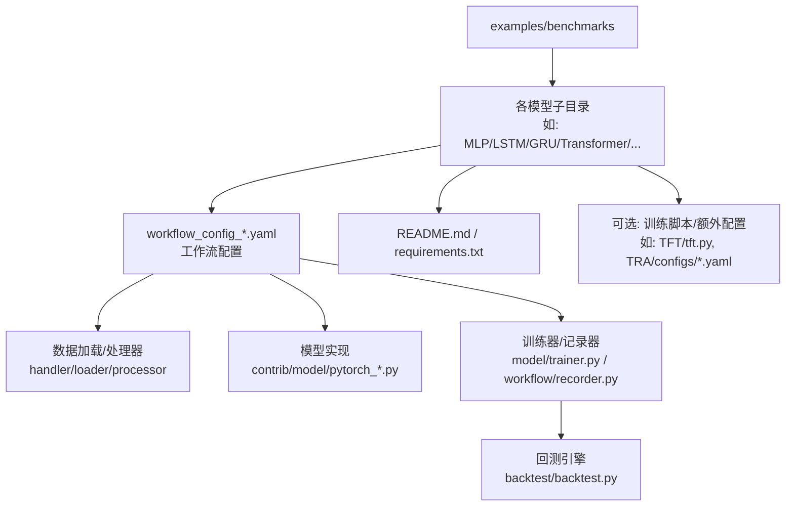
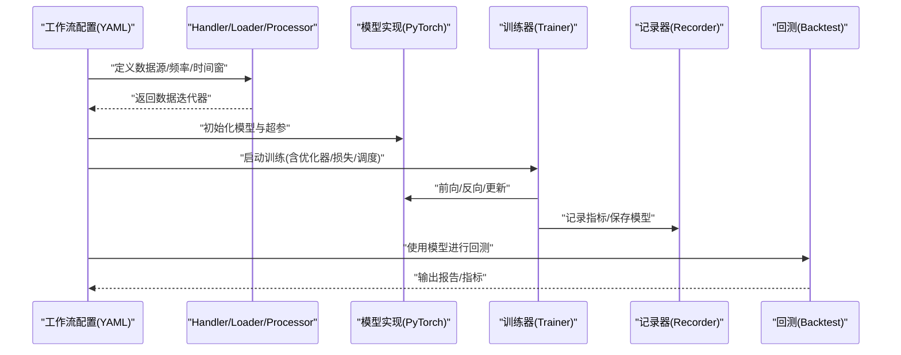
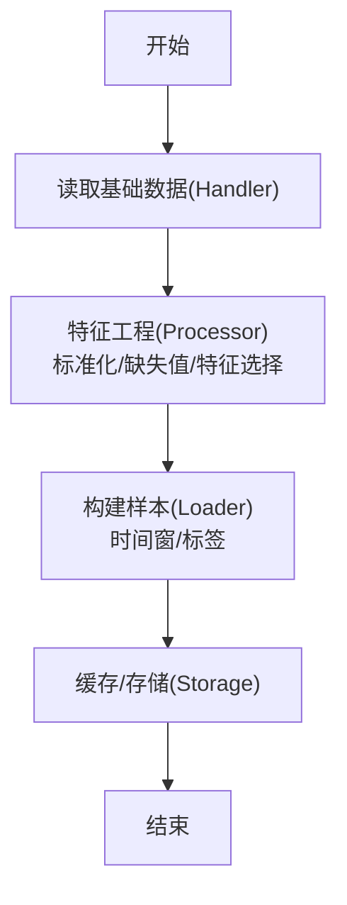
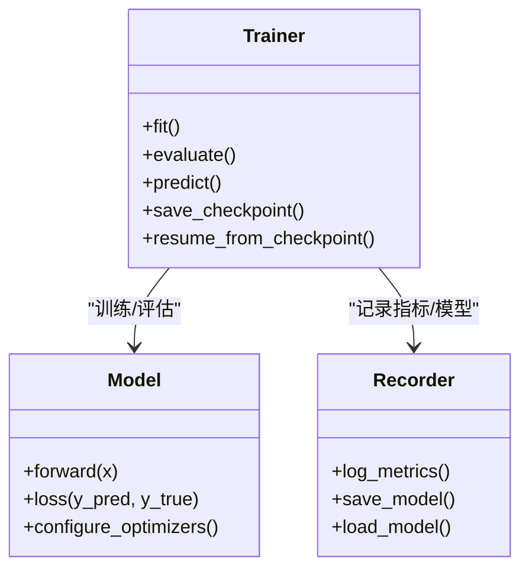
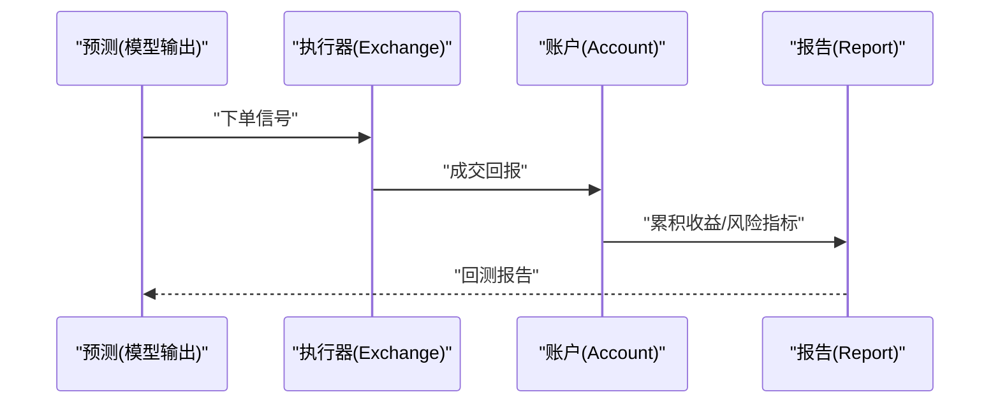
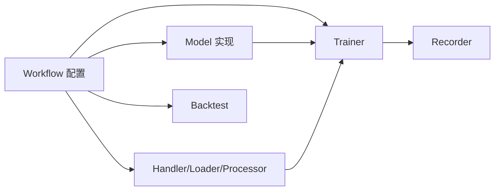

# 模型训练配置

<cite>
**本文引用的文件**
- [examples/benchmarks/README.md](file://examples/benchmarks/README.md)
- [examples/benchmarks/GeneralPtNN/workflow_config_gru.yaml](file://examples/benchmarks/GeneralPtNN/workflow_config_gru.yaml)
- [examples/benchmarks/GeneralPtNN/workflow_config_gru2mlp.yaml](file://examples/benchmarks/GeneralPtNN/workflow_config_gru2mlp.yaml)
- [examples/benchmarks/GeneralPtNN/workflow_config_mlp.yaml](file://examples/benchmarks/GeneralPtNN/workflow_config_mlp.yaml)
- [examples/benchmarks/MLP/workflow_config_mlp_Alpha158.yaml](file://examples/benchmarks/MLP/workflow_config_mlp_Alpha158.yaml)
- [examples/benchmarks/MLP/workflow_config_mlp_Alpha360.yaml](file://examples/benchmarks/MLP/workflow_config_mlp_Alpha360.yaml)
- [examples/benchmarks/LSTM/workflow_config_lstm_Alpha158.yaml](file://examples/benchmarks/LSTM/workflow_config_lstm_Alpha158.yaml)
- [examples/benchmarks/LSTM/workflow_config_lstm_Alpha360.yaml](file://examples/benchmarks/LSTM/workflow_config_lstm_Alpha360.yaml)
- [examples/benchmarks/GRU/workflow_config_gru_Alpha158.yaml](file://examples/benchmarks/GRU/workflow_config_gru_Alpha158.yaml)
- [examples/benchmarks/GRU/workflow_config_gru_Alpha360.yaml](file://examples/benchmarks/GRU/workflow_config_gru_Alpha360.yaml)
- [examples/benchmarks/Transformer/workflow_config_transformer_Alpha158.yaml](file://examples/benchmarks/Transformer/workflow_config_transformer_Alpha158.yaml)
- [examples/benchmarks/Transformer/workflow_config_transformer_Alpha360.yaml](file://examples/benchmarks/Transformer/workflow_config_transformer_Alpha360.yaml)
- [examples/benchmarks/Localformer/workflow_config_localformer_Alpha158.yaml](file://examples/benchmarks/Localformer/workflow_config_localformer_Alpha158.yaml)
- [examples/benchmarks/Localformer/workflow_config_localformer_Alpha360.yaml](file://examples/benchmarks/Localformer/workflow_config_localformer_Alpha360.yaml)
- [examples/benchmarks/TabNet/workflow_config_TabNet_Alpha158.yaml](file://examples/benchmarks/TabNet/workflow_config_TabNet_Alpha158.yaml)
- [examples/benchmarks/TabNet/workflow_config_TabNet_Alpha360.yaml](file://examples/benchmarks/TabNet/workflow_config_TabNet_Alpha360.yaml)
- [examples/benchmarks/TFT/workflow_config_tft_Alpha158.yaml](file://examples/benchmarks/TFT/workflow_config_tft_Alpha158.yaml)
- [examples/benchmarks/TCTS/workflow_config_tcts_Alpha360.yaml](file://examples/benchmarks/TCTS/workflow_config_tcts_Alpha360.yaml)
- [examples/benchmarks/TCN/workflow_config_tcn_Alpha158.yaml](file://examples/benchmarks/TCN/workflow_config_tcn_Alpha158.yaml)
- [examples/benchmarks/TCN/workflow_config_tcn_Alpha360.yaml](file://examples/benchmarks/TCN/workflow_config_tcn_Alpha360.yaml)
- [examples/benchmarks/SFM/workflow_config_sfm_Alpha360.yaml](file://examples/benchmarks/SFM/workflow_config_sfm_Alpha360.yaml)
- [examples/benchmarks/HIST/workflow_config_hist_Alpha360.yaml](file://examples/benchmarks/HIST/workflow_config_hist_Alpha360.yaml)
- [examples/benchmarks/KRNN/workflow_config_krnn_Alpha360.yaml](file://examples/benchmarks/KRNN/workflow_config_krnn_Alpha360.yaml)
- [examples/benchmarks/IGMTF/workflow_config_igmtf_Alpha360.yaml](file://examples/benchmarks/IGMTF/workflow_config_igmtf_Alpha360.yaml)
- [examples/benchmarks/ADARNN/workflow_config_adarnn_Alpha360.yaml](file://examples/benchmarks/ADARNN/workflow_config_adarnn_Alpha360.yaml)
- [examples/benchmarks/ADD/workflow_config_add_Alpha360.yaml](file://examples/benchmarks/ADD/workflow_config_add_Alpha360.yaml)
- [examples/benchmarks/GATs/workflow_config_gats_Alpha158.yaml](file://examples/benchmarks/GATs/workflow_config_gats_Alpha158.yaml)
- [examples/benchmarks/GATs/workflow_config_gats_Alpha360.yaml](file://examples/benchmarks/GATs/workflow_config_gats_Alpha360.yaml)
- [examples/benchmarks/DoubleEnsemble/workflow_config_doubleensemble_Alpha158.yaml](file://examples/benchmarks/DoubleEnsemble/workflow_config_doubleensemble_Alpha158.yaml)
- [examples/benchmarks/DoubleEnsemble/workflow_config_doubleensemble_Alpha360.yaml](file://examples/benchmarks/DoubleEnsemble/workflow_config_doubleensemble_Alpha360.yaml)
- [examples/benchmarks/XGBoost/workflow_config_xgboost_Alpha158.yaml](file://examples/benchmarks/XGBoost/workflow_config_xgboost_Alpha158.yaml)
- [examples/benchmarks/XGBoost/workflow_config_xgboost_Alpha360.yaml](file://examples/benchmarks/XGBoost/workflow_config_xgboost_Alpha360.yaml)
- [examples/benchmarks/LightGBM/workflow_config_lightgbm_Alpha158.yaml](file://examples/benchmarks/LightGBM/workflow_config_lightgbm_Alpha158.yaml)
- [examples/benchmarks/LightGBM/workflow_config_lightgbm_Alpha360.yaml](file://examples/benchmarks/LightGBM/workflow_config_lightgbm_Alpha360.yaml)
- [examples/benchmarks/Linear/workflow_config_linear_Alpha158.yaml](file://examples/benchmarks/Linear/workflow_config_linear_Alpha158.yaml)
- [examples/benchmarks/Linear/workflow_config_linear_Alpha158_multi_pass_bt.yaml](file://examples/benchmarks/Linear/workflow_config_linear_Alpha158_multi_pass_bt.yaml)
- [examples/benchmarks/TRA/workflow_config_tra_Alpha158.yaml](file://examples/benchmarks/TRA/workflow_config_tra_Alpha158.yaml)
- [examples/benchmarks/TRA/workflow_config_tra_Alpha360.yaml](file://examples/benchmarks/TRA/workflow_config_tra_Alpha360.yaml)
- [examples/benchmarks/TRA/configs/config_alstm.yaml](file://examples/benchmarks/TRA/configs/config_alstm.yaml)
- [examples/benchmarks/TRA/configs/config_transformer.yaml](file://examples/benchmarks/TRA/configs/config_transformer.yaml)
- [examples/benchmarks/TRA/configs/config_alstm_tra.yaml](file://examples/benchmarks/TRA/configs/config_alstm_tra.yaml)
- [examples/benchmarks/TRA/configs/config_transformer_tra.yaml](file://examples/benchmarks/TRA/configs/config_transformer_tra.yaml)
- [examples/benchmarks/TRA/configs/config_alstm_tra_init.yaml](file://examples/benchmarks/TRA/configs/config_alstm_tra_init.yaml)
- [examples/benchmarks/TRA/configs/config_transformer_tra_init.yaml](file://examples/benchmarks/TRA/configs/config_transformer_tra_init.yaml)
- [examples/benchmarks/TFT/tft.py](file://examples/benchmarks/TFT/tft.py)
- [examples/benchmarks/TFT/data_formatters/base.py](file://examples/benchmarks/TFT/data_formatters/base.py)
- [examples/benchmarks/TFT/expt_settings/configs.py](file://examples/benchmarks/TFT/expt_settings/configs.py)
- [examples/benchmarks/TFT/libs/tft_model.py](file://examples/benchmarks/TFT/libs/tft_model.py)
- [examples/benchmarks/TFT/libs/utils.py](file://examples/benchmarks/TFT/libs/utils.py)
- [examples/benchmarks/TFT/libs/hyperparam_opt.py](file://examples/benchmarks/TFT/libs/hyperparam_opt.py)
- [examples/benchmarks/TFT/data_formatters/qlib_Alpha158.py](file://examples/benchmarks/TFT/data_formatters/qlib_Alpha158.py)
- [qlib/contrib/model/pytorch_general_nn.py](file://qlib/contrib/model/pytorch_general_nn.py)
- [qlib/contrib/model/pytorch_lstm.py](file://qlib/contrib/model/pytorch_lstm.py)
- [qlib/contrib/model/pytorch_gru.py](file://qlib/contrib/model/pytorch_gru.py)
- [qlib/contrib/model/pytorch_transformer.py](file://qlib/contrib/model/pytorch_transformer.py)
- [qlib/contrib/model/pytorch_localformer.py](file://qlib/contrib/model/pytorch_localformer.py)
- [qlib/contrib/model/pytorch_tabnet.py](file://qlib/contrib/model/pytorch_tabnet.py)
- [qlib/contrib/model/pytorch_tft.py](file://qlib/contrib/model/pytorch_tft.py)
- [qlib/contrib/model/pytorch_tcts.py](file://qlib/contrib/model/pytorch_tcts.py)
- [qlib/contrib/model/pytorch_tcn.py](file://qlib/contrib/model/pytorch_tcn.py)
- [qlib/contrib/model/pytorch_sfm.py](file://qlib/contrib/model/pytorch_sfm.py)
- [qlib/contrib/model/pytorch_hist.py](file://qlib/contrib/model/pytorch_hist.py)
- [qlib/contrib/model/pytorch_krnn.py](file://qlib/contrib/model/pytorch_krnn.py)
- [qlib/contrib/model/pytorch_igmtf.py](file://qlib/contrib/model/pytorch_igmtf.py)
- [qlib/contrib/model/pytorch_adarnn.py](file://qlib/contrib/model/pytorch_adarnn.py)
- [qlib/contrib/model/pytorch_add.py](file://qlib/contrib/model/pytorch_add.py)
- [qlib/contrib/model/pytorch_gats.py](file://qlib/contrib/model/pytorch_gats.py)
- [qlib/contrib/model/pytorch_doubleensemble.py](file://qlib/contrib/model/pytorch_doubleensemble.py)
- [qlib/contrib/model/pytorch_utils.py](file://qlib/contrib/model/pytorch_utils.py)
- [qlib/model/trainer.py](file://qlib/model/trainer.py)
- [qlib/workflow/exp.py](file://qlib/workflow/exp.py)
- [qlib/workflow/recorder.py](file://qlib/workflow/recorder.py)
- [qlib/backtest/backtest.py](file://qlib/backtest/backtest.py)
- [qlib/data/dataset/handler.py](file://qlib/data/dataset/handler.py)
- [qlib/data/dataset/loader.py](file://qlib/data/dataset/loader.py)
- [qlib/data/dataset/processor.py](file://qlib/data/dataset/processor.py)
- [qlib/data/dataset/storage.py](file://qlib/data/dataset/storage.py)
- [qlib/data/dataset/utils.py](file://qlib/data/dataset/utils.py)
- [qlib/config.py](file://qlib/config.py)
- [qlib/__init__.py](file://qlib/__init__.py)
</cite>

## 目录
1. [简介](#简介)
2. [项目结构](#项目结构)
3. [核心组件](#核心组件)
4. [架构总览](#架构总览)
5. [详细组件分析](#详细组件分析)
6. [依赖关系分析](#依赖关系分析)
7. [性能考虑](#性能考虑)
8. [故障排查指南](#故障排查指南)
9. [结论](#结论)
10. [附录](#附录)

## 简介
本文件面向希望在Qlib中完成深度学习模型训练与部署的用户，系统梳理了基准测试示例中的训练配置与工作流（workflow）组织方式，覆盖数据加载、特征工程、模型训练、回测验证等环节，并给出参数调优策略、监控与断点续训建议以及性能基准参考与最佳实践。

## 项目结构
Qlib的深度学习训练以“工作流配置文件”为核心，结合各模型实现模块与数据集处理模块协同工作。基准测试示例位于 examples/benchmarks 下，每个子目录对应一个模型或算法族，包含：
- workflow_config_*.yaml：训练工作流配置文件
- README.md / requirements.txt：模型说明与依赖
- 部分模型还包含独立的训练脚本或配置文件（如TFT、TRA）

图示来源
- [examples/benchmarks/README.md](file://examples/benchmarks/README.md)
- [examples/benchmarks/GeneralPtNN/workflow_config_mlp.yaml](file://examples/benchmarks/GeneralPtNN/workflow_config_mlp.yaml)
- [qlib/contrib/model/pytorch_general_nn.py](file://qlib/contrib/model/pytorch_general_nn.py)
- [qlib/model/trainer.py](file://qlib/model/trainer.py)
- [qlib/workflow/recorder.py](file://qlib/workflow/recorder.py)
- [qlib/backtest/backtest.py](file://qlib/backtest/backtest.py)

章节来源
- [examples/benchmarks/README.md](file://examples/benchmarks/README.md)
- [examples/benchmarks/GeneralPtNN/workflow_config_mlp.yaml](file://examples/benchmarks/GeneralPtNN/workflow_config_mlp.yaml)

## 核心组件
- 工作流配置（YAML）
  - 定义数据源、特征工程、模型超参、训练计划、回测参数等
  - 示例：MLP、LSTM、GRU、Transformer、Localformer、TabNet、TFT、TCTS、TCN、SFM、HIST、KRNN、IGMTF、ADARNN、ADD、GATs、DoubleEnsemble 等
- 数据层
  - handler：定义市场数据读取与时间序列切片
  - loader：按日期/样本加载数据
  - processor：标准化、缺失值处理、特征筛选等
  - storage：缓存与持久化
- 模型层
  - 各模型的PyTorch实现封装于 qlib/contrib/model/pytorch_*.py
- 训练器与记录器
  - model/trainer.py：统一训练循环、回调、早停、断点续训
  - workflow/recorder.py：实验记录、指标存储、模型保存
- 回测引擎
  - backtest/backtest.py：基于信号生成与订单执行的回测框架

章节来源
- [qlib/data/dataset/handler.py](file://qlib/data/dataset/handler.py)
- [qlib/data/dataset/loader.py](file://qlib/data/dataset/loader.py)
- [qlib/data/dataset/processor.py](file://qlib/data/dataset/processor.py)
- [qlib/data/dataset/storage.py](file://qlib/data/dataset/storage.py)
- [qlib/contrib/model/pytorch_general_nn.py](file://qlib/contrib/model/pytorch_general_nn.py)
- [qlib/model/trainer.py](file://qlib/model/trainer.py)
- [qlib/workflow/recorder.py](file://qlib/workflow/recorder.py)
- [qlib/backtest/backtest.py](file://qlib/backtest/backtest.py)

## 架构总览
下图展示了从工作流配置到训练与回测的整体流程：

图示来源
- [examples/benchmarks/MLP/workflow_config_mlp_Alpha158.yaml](file://examples/benchmarks/MLP/workflow_config_mlp_Alpha158.yaml)
- [qlib/contrib/model/pytorch_general_nn.py](file://qlib/contrib/model/pytorch_general_nn.py)
- [qlib/model/trainer.py](file://qlib/model/trainer.py)
- [qlib/workflow/recorder.py](file://qlib/workflow/recorder.py)
- [qlib/backtest/backtest.py](file://qlib/backtest/backtest.py)

## 详细组件分析

### 数据加载与特征工程
- Handler
  - 负责按时间序列切片与周期性重采样；支持多频数据与因子窗口
- Loader
  - 提供样本级数据加载接口，支持缓存与并行
- Processor
  - 包含标准化、缺失值填充、特征选择、标签构造等
- Storage
  - 缓存中间结果，加速重复实验

图示来源
- [qlib/data/dataset/handler.py](file://qlib/data/dataset/handler.py)
- [qlib/data/dataset/processor.py](file://qlib/data/dataset/processor.py)
- [qlib/data/dataset/loader.py](file://qlib/data/dataset/loader.py)
- [qlib/data/dataset/storage.py](file://qlib/data/dataset/storage.py)

章节来源
- [qlib/data/dataset/handler.py](file://qlib/data/dataset/handler.py)
- [qlib/data/dataset/processor.py](file://qlib/data/dataset/processor.py)
- [qlib/data/dataset/loader.py](file://qlib/data/dataset/loader.py)
- [qlib/data/dataset/storage.py](file://qlib/data/dataset/storage.py)

### 模型训练与优化器配置
- 通用训练器
  - 支持优化器、损失函数、学习率调度、早停、断点续训、日志与指标记录
- 模型实现
  - 各模型封装于 qlib/contrib/model/pytorch_*.py，统一继承或遵循一致的接口约定
- 典型配置要点
  - 学习率与调度：warmup、余弦退火、阶梯下降
  - 批量大小：根据显存与收敛稳定性权衡
  - 正则化：L2、Dropout、BatchNorm、梯度裁剪
  - 损失函数：回归任务常用MSE/L1/Huber；分类任务常用交叉熵；多任务可加权组合

图示来源
- [qlib/model/trainer.py](file://qlib/model/trainer.py)
- [qlib/workflow/recorder.py](file://qlib/workflow/recorder.py)
- [qlib/contrib/model/pytorch_general_nn.py](file://qlib/contrib/model/pytorch_general_nn.py)

章节来源
- [qlib/model/trainer.py](file://qlib/model/trainer.py)
- [qlib/contrib/model/pytorch_general_nn.py](file://qlib/contrib/model/pytorch_general_nn.py)
- [qlib/workflow/recorder.py](file://qlib/workflow/recorder.py)

### 回测验证与报告
- 回测引擎
  - 基于信号与订单执行，支持滑点、手续费、成交量限制等
- 报告
  - 收益曲线、IC、年化收益/回撤、分位数收益等

图示来源
- [qlib/backtest/backtest.py](file://qlib/backtest/backtest.py)

章节来源
- [qlib/backtest/backtest.py](file://qlib/backtest/backtest.py)

### 典型模型与配置要点

#### MLP
- 关键配置项
  - 输入维度、隐藏层宽度与层数、激活函数、Dropout
  - 优化器：Adam/AdamW；学习率与权重衰减
  - 损失：MSE/L1；标签平滑可选
- 参考配置
  - Alpha158/Alpha360：见对应 workflow_config_*.yaml

章节来源
- [examples/benchmarks/MLP/workflow_config_mlp_Alpha158.yaml](file://examples/benchmarks/MLP/workflow_config_mlp_Alpha158.yaml)
- [examples/benchmarks/MLP/workflow_config_mlp_Alpha360.yaml](file://examples/benchmarks/MLP/workflow_config_mlp_Alpha360.yaml)
- [qlib/contrib/model/pytorch_general_nn.py](file://qlib/contrib/model/pytorch_general_nn.py)

#### LSTM/GRU
- 关键配置项
  - 序列长度、隐藏维度、层数、双向/残差
  - 注意力/门控机制（部分变体）
- 参考配置
  - Alpha158/Alpha360：见对应 workflow_config_*.yaml

章节来源
- [examples/benchmarks/LSTM/workflow_config_lstm_Alpha158.yaml](file://examples/benchmarks/LSTM/workflow_config_lstm_Alpha158.yaml)
- [examples/benchmarks/LSTM/workflow_config_lstm_Alpha360.yaml](file://examples/benchmarks/LSTM/workflow_config_lstm_Alpha360.yaml)
- [examples/benchmarks/GRU/workflow_config_gru_Alpha158.yaml](file://examples/benchmarks/GRU/workflow_config_gru_Alpha158.yaml)
- [examples/benchmarks/GRU/workflow_config_gru_Alpha360.yaml](file://examples/benchmarks/GRU/workflow_config_gru_Alpha360.yaml)
- [qlib/contrib/model/pytorch_lstm.py](file://qlib/contrib/model/pytorch_lstm.py)
- [qlib/contrib/model/pytorch_gru.py](file://qlib/contrib/model/pytorch_gru.py)

#### Transformer/Localformer
- 关键配置项
  - 多头注意力、前馈网络、位置编码、掩码
  - 层归一化、残差连接、dropout
- 参考配置
  - Alpha158/Alpha360：见对应 workflow_config_*.yaml

章节来源
- [examples/benchmarks/Transformer/workflow_config_transformer_Alpha158.yaml](file://examples/benchmarks/Transformer/workflow_config_transformer_Alpha158.yaml)
- [examples/benchmarks/Transformer/workflow_config_transformer_Alpha360.yaml](file://examples/benchmarks/Transformer/workflow_config_transformer_Alpha360.yaml)
- [examples/benchmarks/Localformer/workflow_config_localformer_Alpha158.yaml](file://examples/benchmarks/Localformer/workflow_config_localformer_Alpha158.yaml)
- [examples/benchmarks/Localformer/workflow_config_localformer_Alpha360.yaml](file://examples/benchmarks/Localformer/workflow_config_localformer_Alpha360.yaml)
- [qlib/contrib/model/pytorch_transformer.py](file://qlib/contrib/model/pytorch_transformer.py)
- [qlib/contrib/model/pytorch_localformer.py](file://qlib/contrib/model/pytorch_localformer.py)

#### TabNet
- 关键配置项
  - 预映射维度、编码器/解码器结构、注意力门控
  - 梯度裁剪、稀疏性正则
- 参考配置
  - Alpha158/Alpha360：见对应 workflow_config_*.yaml

章节来源
- [examples/benchmarks/TabNet/workflow_config_TabNet_Alpha158.yaml](file://examples/benchmarks/TabNet/workflow_config_TabNet_Alpha158.yaml)
- [examples/benchmarks/TabNet/workflow_config_TabNet_Alpha360.yaml](file://examples/benchmarks/TabNet/workflow_config_TabNet_Alpha360.yaml)
- [qlib/contrib/model/pytorch_tabnet.py](file://qlib/contrib/model/pytorch_tabnet.py)

#### TFT
- 关键配置项
  - Temporal/Multi-horizon建模、静态/动态特征分离
  - 多变量时间序列分解、可加/可乘结构
- 参考配置
  - Alpha158：见 workflow_config_tft_Alpha158.yaml
  - 训练脚本与工具：tft.py、data_formatters、expt_settings、libs

章节来源
- [examples/benchmarks/TFT/workflow_config_tft_Alpha158.yaml](file://examples/benchmarks/TFT/workflow_config_tft_Alpha158.yaml)
- [examples/benchmarks/TFT/tft.py](file://examples/benchmarks/TFT/tft.py)
- [examples/benchmarks/TFT/data_formatters/base.py](file://examples/benchmarks/TFT/data_formatters/base.py)
- [examples/benchmarks/TFT/expt_settings/configs.py](file://examples/benchmarks/TFT/expt_settings/configs.py)
- [examples/benchmarks/TFT/libs/tft_model.py](file://examples/benchmarks/TFT/libs/tft_model.py)
- [examples/benchmarks/TFT/libs/utils.py](file://examples/benchmarks/TFT/libs/utils.py)
- [examples/benchmarks/TFT/libs/hyperparam_opt.py](file://examples/benchmarks/TFT/libs/hyperparam_opt.py)
- [examples/benchmarks/TFT/data_formatters/qlib_Alpha158.py](file://examples/benchmarks/TFT/data_formatters/qlib_Alpha158.py)

#### 其他模型（TCTS、TCN、SFM、HIST、KRNN、IGMTF、ADARNN、ADD、GATs、DoubleEnsemble）
- 关键配置项
  - 时间卷积/门控、图神经网络邻接、集成学习策略、自监督/对比学习
- 参考配置
  - 见对应 workflow_config_*.yaml 或 README

章节来源
- [examples/benchmarks/TCTS/workflow_config_tcts_Alpha360.yaml](file://examples/benchmarks/TCTS/workflow_config_tcts_Alpha360.yaml)
- [examples/benchmarks/TCN/workflow_config_tcn_Alpha158.yaml](file://examples/benchmarks/TCN/workflow_config_tcn_Alpha158.yaml)
- [examples/benchmarks/TCN/workflow_config_tcn_Alpha360.yaml](file://examples/benchmarks/TCN/workflow_config_tcn_Alpha360.yaml)
- [examples/benchmarks/SFM/workflow_config_sfm_Alpha360.yaml](file://examples/benchmarks/SFM/workflow_config_sfm_Alpha360.yaml)
- [examples/benchmarks/HIST/workflow_config_hist_Alpha360.yaml](file://examples/benchmarks/HIST/workflow_config_hist_Alpha360.yaml)
- [examples/benchmarks/KRNN/workflow_config_krnn_Alpha360.yaml](file://examples/benchmarks/KRNN/workflow_config_krnn_Alpha360.yaml)
- [examples/benchmarks/IGMTF/workflow_config_igmtf_Alpha360.yaml](file://examples/benchmarks/IGMTF/workflow_config_igmtf_Alpha360.yaml)
- [examples/benchmarks/ADARNN/workflow_config_adarnn_Alpha360.yaml](file://examples/benchmarks/ADARNN/workflow_config_adarnn_Alpha360.yaml)
- [examples/benchmarks/ADD/workflow_config_add_Alpha360.yaml](file://examples/benchmarks/ADD/workflow_config_add_Alpha360.yaml)
- [examples/benchmarks/GATs/workflow_config_gats_Alpha158.yaml](file://examples/benchmarks/GATs/workflow_config_gats_Alpha158.yaml)
- [examples/benchmarks/GATs/workflow_config_gats_Alpha360.yaml](file://examples/benchmarks/GATs/workflow_config_gats_Alpha360.yaml)
- [examples/benchmarks/DoubleEnsemble/workflow_config_doubleensemble_Alpha158.yaml](file://examples/benchmarks/DoubleEnsemble/workflow_config_doubleensemble_Alpha158.yaml)
- [examples/benchmarks/DoubleEnsemble/workflow_config_doubleensemble_Alpha360.yaml](file://examples/benchmarks/DoubleEnsemble/workflow_config_doubleensemble_Alpha360.yaml)

### 通用工作流配置示例（结构化说明）
以下为典型workflow配置的关键段落说明（请对照具体 YAML 文件）：
- experiment_name：实验名称
- handler：数据源、时间范围、采样频率、标签构造
- loader：样本切片、时间窗、批大小
- model：模型类型、输入维度、隐藏结构、激活/正则
- loss：损失函数类型与权重
- optimizer：优化器类型、学习率、权重衰减、梯度裁剪
- lr_scheduler：学习率调度策略（如余弦退火、阶梯下降）
- data_loader：训练/验证/测试划分
- training：训练轮数、早停、断点续训开关
- recorder：指标记录、模型保存路径、日志级别
- backtest：交易成本、滑点、止盈止损、组合约束

章节来源
- [examples/benchmarks/GeneralPtNN/workflow_config_mlp.yaml](file://examples/benchmarks/GeneralPtNN/workflow_config_mlp.yaml)
- [examples/benchmarks/GeneralPtNN/workflow_config_gru.yaml](file://examples/benchmarks/GeneralPtNN/workflow_config_gru.yaml)
- [examples/benchmarks/GeneralPtNN/workflow_config_gru2mlp.yaml](file://examples/benchmarks/GeneralPtNN/workflow_config_gru2mlp.yaml)

## 依赖关系分析
- 组件耦合
  - workflow 配置文件驱动 handler/loader/processor 与模型实现
  - 训练器与记录器解耦，便于扩展与复用
  - 回测引擎独立于训练细节，仅消费模型输出
- 外部依赖
  - PyTorch、LightGBM/XGBoost（树模型）、NumPy/Pandas（数据处理）

图示来源
- [examples/benchmarks/MLP/workflow_config_mlp_Alpha158.yaml](file://examples/benchmarks/MLP/workflow_config_mlp_Alpha158.yaml)
- [qlib/contrib/model/pytorch_general_nn.py](file://qlib/contrib/model/pytorch_general_nn.py)
- [qlib/model/trainer.py](file://qlib/model/trainer.py)
- [qlib/workflow/recorder.py](file://qlib/workflow/recorder.py)
- [qlib/backtest/backtest.py](file://qlib/backtest/backtest.py)

章节来源
- [examples/benchmarks/MLP/workflow_config_mlp_Alpha158.yaml](file://examples/benchmarks/MLP/workflow_config_mlp_Alpha158.yaml)
- [qlib/contrib/model/pytorch_general_nn.py](file://qlib/contrib/model/pytorch_general_nn.py)
- [qlib/model/trainer.py](file://qlib/model/trainer.py)
- [qlib/workflow/recorder.py](file://qlib/workflow/recorder.py)
- [qlib/backtest/backtest.py](file://qlib/backtest/backtest.py)

## 性能考虑
- 批大小与显存
  - 通过梯度累积模拟更大批次；根据GPU显存调整批大小
- 学习率与收敛
  - 使用Warmup+余弦退火；对发散敏感的模型先小lr微调
- 正则化
  - L2权重衰减、Dropout、LayerNorm；注意过正则导致欠拟合
- 数据并行与混合精度
  - 在支持的模型上启用AMP与DDP可显著提速
- 早停与验证
  - 以验证集指标为准，避免过拟合
- 断点续训
  - 训练器支持保存/恢复状态，配合Recorder确保可恢复

## 故障排查指南
- 训练不收敛/发散
  - 检查学习率是否过大；尝试更小初始lr或warmup
  - 检查数据标准化与缺失值处理是否一致
- 显存不足
  - 减小批大小；开启梯度累积；关闭不必要的中间缓存
- 指标异常
  - 对比训练/验证/测试划分是否正确；检查标签构造逻辑
- 回测与训练不一致
  - 确认回测使用的模型版本与保存路径一致；检查交易成本与滑点设置

章节来源
- [qlib/model/trainer.py](file://qlib/model/trainer.py)
- [qlib/workflow/recorder.py](file://qlib/workflow/recorder.py)
- [qlib/backtest/backtest.py](file://qlib/backtest/backtest.py)

## 结论
Qlib通过“工作流配置 + 数据处理 + 模型实现 + 训练器/记录器 + 回测”的分层设计，提供了可复用、可扩展的深度学习训练流水线。建议从简单模型（如MLP/LSTM/GRU）入手，逐步过渡到复杂模型（Transformer/TabNet/TFT），并结合早停、学习率调度、正则化与断点续训等策略获得稳定性能。

## 附录
- 基准测试与参考结果
  - 各模型在 Alpha158/Alpha360 上的性能差异较大，需结合任务特性与算力资源选择合适模型
  - 建议优先对比相同数据设置下的同族模型（如LSTM vs GRU vs Transformer），再横向扩展至其他模型
- 最佳实践清单
  - 明确训练/验证/测试划分与时间窗
  - 从默认配置起步，逐项微调学习率、批大小、正则
  - 开启断点续训与指标记录，定期备份模型
  - 回测前先做样本内/样本外一致性检查