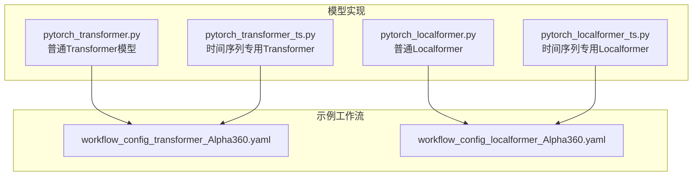
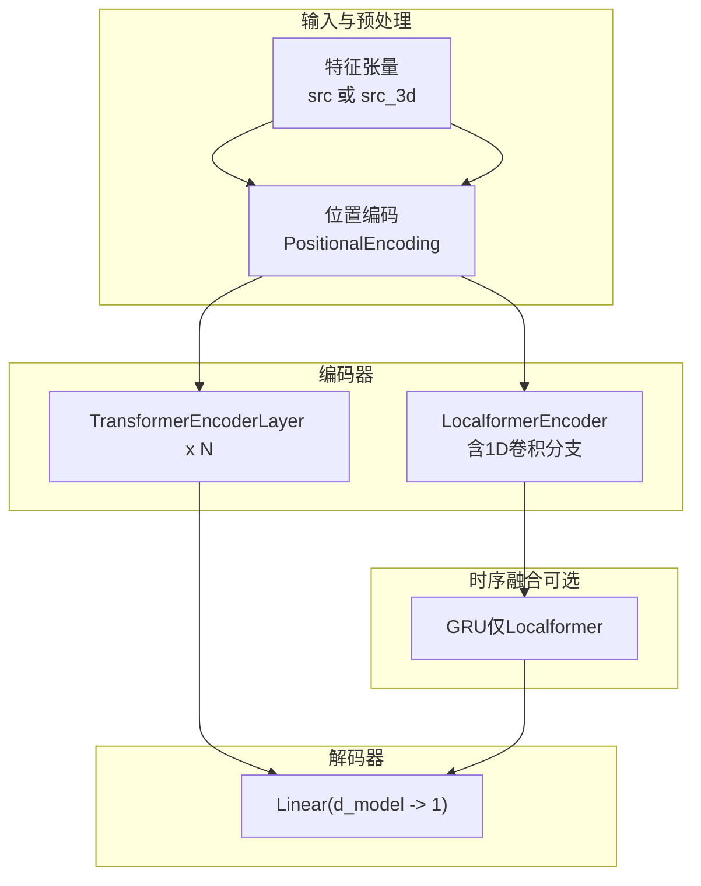
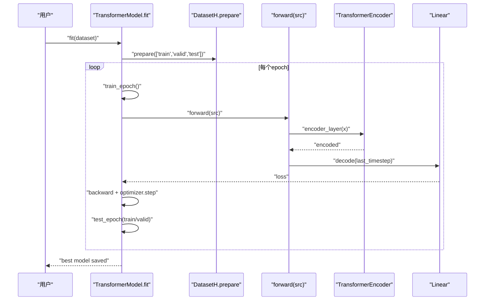
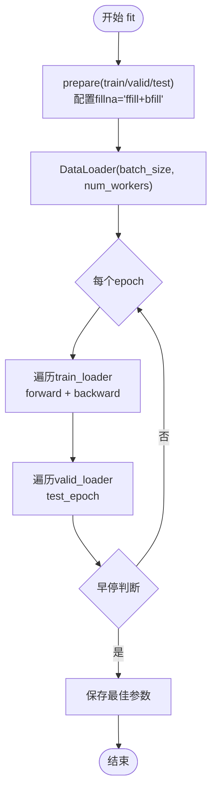
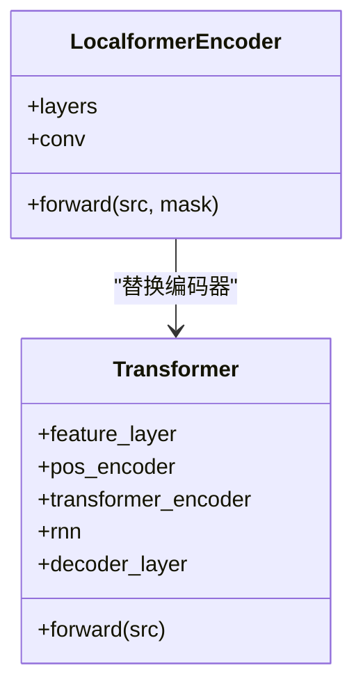
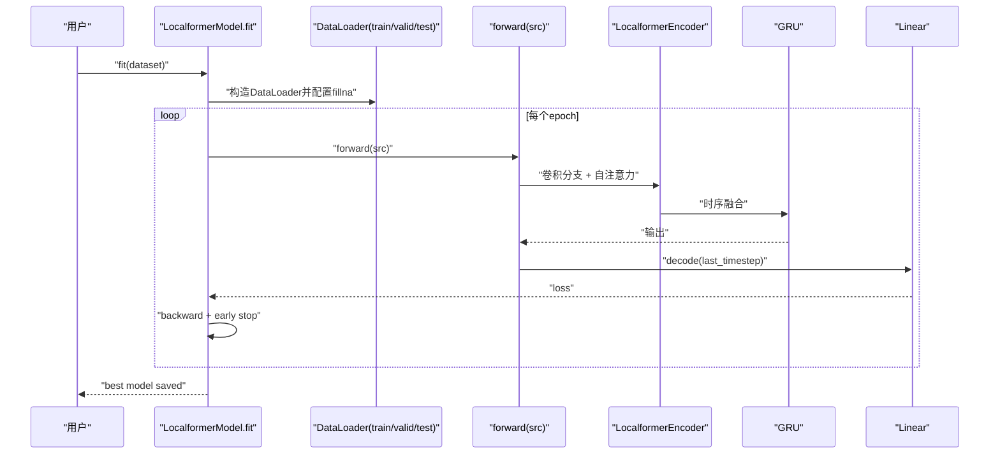
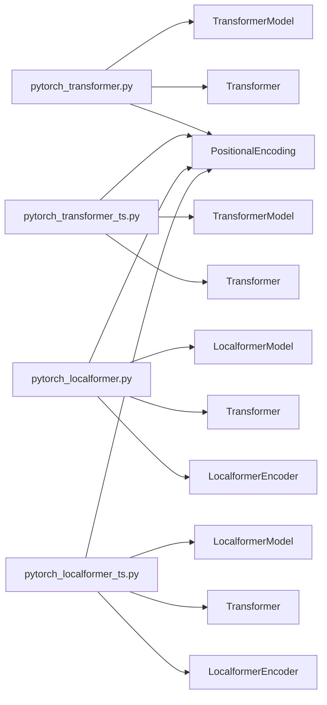

# 注意力与Transformer模型

<cite>
**本文引用的文件**
- [pytorch_transformer.py](file://qlib/contrib/model/pytorch_transformer.py)
- [pytorch_transformer_ts.py](file://qlib/contrib/model/pytorch_transformer_ts.py)
- [pytorch_localformer.py](file://qlib/contrib/model/pytorch_localformer.py)
- [pytorch_localformer_ts.py](file://qlib/contrib/model/pytorch_localformer_ts.py)
- [workflow_config_transformer_Alpha360.yaml](file://examples/benchmarks/Transformer/workflow_config_transformer_Alpha360.yaml)
- [workflow_config_localformer_Alpha360.yaml](file://examples/benchmarks/Localformer/workflow_config_localformer_Alpha360.yaml)
</cite>

## 目录
1. [引言](#引言)
2. [项目结构](#项目结构)
3. [核心组件](#核心组件)
4. [架构总览](#架构总览)
5. [详细组件分析](#详细组件分析)
6. [依赖分析](#依赖分析)
7. [性能考量](#性能考量)
8. [故障排查指南](#故障排查指南)
9. [结论](#结论)
10. [附录：超参数与调优建议](#附录超参数与调优建议)

## 引言
本文件面向量化投资中的注意力与Transformer模型，系统梳理Qlib中基于PyTorch的Transformer与Localformer实现，重点覆盖：
- 多头注意力机制、位置编码、前馈网络等核心组件
- 普通版与时间序列专用版（_ts）的实现差异与改进点
- Localformer的局部注意力与卷积增强路径带来的计算效率优化
- 可视化与可解释性（注意力权重提取思路）
- 超参数配置与调优策略
- 与其他序列模型的适用场景与性能对比思路

## 项目结构
与注意力/Transformer相关的核心文件位于Qlib贡献模块中，分别提供“普通”与“时间序列专用”两个版本，并配套示例工作流配置。

图表来源
- [pytorch_transformer.py:1-286](file://qlib/contrib/model/pytorch_transformer.py#L1-L286)
- [pytorch_transformer_ts.py:1-265](file://qlib/contrib/model/pytorch_transformer_ts.py#L1-L265)
- [pytorch_localformer.py:1-323](file://qlib/contrib/model/pytorch_localformer.py#L1-L323)
- [pytorch_localformer_ts.py:1-303](file://qlib/contrib/model/pytorch_localformer_ts.py#L1-L303)
- [workflow_config_transformer_Alpha360.yaml:1-79](file://examples/benchmarks/Transformer/workflow_config_transformer_Alpha360.yaml#L1-L79)
- [workflow_config_localformer_Alpha360.yaml:1-79](file://examples/benchmarks/Localformer/workflow_config_localformer_Alpha360.yaml#L1-L79)

章节来源
- [pytorch_transformer.py:1-286](file://qlib/contrib/model/pytorch_transformer.py#L1-L286)
- [pytorch_transformer_ts.py:1-265](file://qlib/contrib/model/pytorch_transformer_ts.py#L1-L265)
- [pytorch_localformer.py:1-323](file://qlib/contrib/model/pytorch_localformer.py#L1-L323)
- [pytorch_localformer_ts.py:1-303](file://qlib/contrib/model/pytorch_localformer_ts.py#L1-L303)
- [workflow_config_transformer_Alpha360.yaml:1-79](file://examples/benchmarks/Transformer/workflow_config_transformer_Alpha360.yaml#L1-L79)
- [workflow_config_localformer_Alpha360.yaml:1-79](file://examples/benchmarks/Localformer/workflow_config_localformer_Alpha360.yaml#L1-L79)

## 核心组件
- 模型封装类：TransformerModel/LocalformerModel，负责超参初始化、训练循环、验证早停、预测与保存
- 编码器：PositionalEncoding（正弦/余弦位置编码）
- 编码器堆叠：TransformerEncoderLayer + TransformerEncoder（普通版）或 LocalformerEncoder（Localformer）
- 基座RNN：部分模型在Transformer输出后叠加GRU以融合时序动态
- 解码器：线性层将最后一时刻的隐藏态映射到标量预测

章节来源
- [pytorch_transformer.py:27-286](file://qlib/contrib/model/pytorch_transformer.py#L27-L286)
- [pytorch_transformer_ts.py:25-265](file://qlib/contrib/model/pytorch_transformer_ts.py#L25-L265)
- [pytorch_localformer.py:28-323](file://qlib/contrib/model/pytorch_localformer.py#L28-L323)
- [pytorch_localformer_ts.py:26-303](file://qlib/contrib/model/pytorch_localformer_ts.py#L26-L303)

## 架构总览
下图展示两类模型的共同结构与关键差异：是否采用时间序列专用的数据加载与预处理、是否在编码器后叠加RNN。

图表来源
- [pytorch_transformer.py:258-286](file://qlib/contrib/model/pytorch_transformer.py#L258-L286)
- [pytorch_transformer_ts.py:238-265](file://qlib/contrib/model/pytorch_transformer_ts.py#L238-L265)
- [pytorch_localformer.py:286-323](file://qlib/contrib/model/pytorch_localformer.py#L286-L323)
- [pytorch_localformer_ts.py:267-303](file://qlib/contrib/model/pytorch_localformer_ts.py#L267-L303)

## 详细组件分析

### 普通Transformer（pytorch_transformer.py）
- 数据形态：src形状为[N, F*T]，先reshape为[N, T, F]再转置为[T, N, F]
- 编码器：nn.TransformerEncoderLayer + nn.TransformerEncoder堆叠
- 解码：取最后一个时间步隐藏态，经Linear映射得到标量
- 训练：按样本索引随机打乱，分批前向+反向传播；支持早停与最佳参数保存

图表来源
- [pytorch_transformer.py:157-214](file://qlib/contrib/model/pytorch_transformer.py#L157-L214)
- [pytorch_transformer.py:269-285](file://qlib/contrib/model/pytorch_transformer.py#L269-L285)

章节来源
- [pytorch_transformer.py:27-286](file://qlib/contrib/model/pytorch_transformer.py#L27-L286)

### 时间序列专用Transformer（pytorch_transformer_ts.py）
- 数据形态：src直接为[N, T, F]，无需reshape
- 数据加载：使用DataLoader，从DatasetH中读取“feature/label”列，标签通常取最后时刻
- 预处理：训练/验证集在DataLoader上启用“前向+后向填充”以减少NaN影响
- 训练：遍历DataLoader批次进行训练与评估

图表来源
- [pytorch_transformer_ts.py:137-199](file://qlib/contrib/model/pytorch_transformer_ts.py#L137-L199)
- [pytorch_transformer_ts.py:249-264](file://qlib/contrib/model/pytorch_transformer_ts.py#L249-L264)

章节来源
- [pytorch_transformer_ts.py:25-265](file://qlib/contrib/model/pytorch_transformer_ts.py#L25-L265)

### Localformer（pytorch_localformer.py）
- 结构：在普通Transformer基础上，将标准TransformerEncoder替换为LocalformerEncoder
- 局部注意力：每层在执行自注意力前，额外通过沿时间维的1D卷积生成残差分支，再与原序列相加，形成“卷积增强的局部建模”
- 时序融合：在编码器之后叠加GRU，进一步融合时序动态

图表来源
- [pytorch_localformer.py:263-323](file://qlib/contrib/model/pytorch_localformer.py#L263-L323)

章节来源
- [pytorch_localformer.py:28-323](file://qlib/contrib/model/pytorch_localformer.py#L28-L323)

### 时间序列专用Localformer（pytorch_localformer_ts.py）
- 与普通Localformer一致，但数据加载与预处理遵循_ts风格：使用DataLoader、配置fillna策略、标签取最后时刻
- 适合大规模时间序列数据的高效训练与评估

图表来源
- [pytorch_localformer_ts.py:140-202](file://qlib/contrib/model/pytorch_localformer_ts.py#L140-L202)
- [pytorch_localformer_ts.py:267-303](file://qlib/contrib/model/pytorch_localformer_ts.py#L267-L303)

章节来源
- [pytorch_localformer_ts.py:26-303](file://qlib/contrib/model/pytorch_localformer_ts.py#L26-L303)

## 依赖分析
- 模块内聚：各模型均以内置PositionalEncoding、TransformerEncoder/LocalformerEncoder、Linear解码器为核心，耦合度低
- 外部依赖：torch.nn、torch.optim、DataLoader（_ts版本）、DatasetH/DataHandlerLP（数据接口）
- 训练流程：统一由Model基类派生的fit/test_epoch/train_epoch构成，便于扩展与复用

图表来源
- [pytorch_transformer.py:27-286](file://qlib/contrib/model/pytorch_transformer.py#L27-L286)
- [pytorch_transformer_ts.py:25-265](file://qlib/contrib/model/pytorch_transformer_ts.py#L25-L265)
- [pytorch_localformer.py:28-323](file://qlib/contrib/model/pytorch_localformer.py#L28-L323)
- [pytorch_localformer_ts.py:26-303](file://qlib/contrib/model/pytorch_localformer_ts.py#L26-L303)

章节来源
- [pytorch_transformer.py:27-286](file://qlib/contrib/model/pytorch_transformer.py#L27-L286)
- [pytorch_transformer_ts.py:25-265](file://qlib/contrib/model/pytorch_transformer_ts.py#L25-L265)
- [pytorch_localformer.py:28-323](file://qlib/contrib/model/pytorch_localformer.py#L28-L323)
- [pytorch_localformer_ts.py:26-303](file://qlib/contrib/model/pytorch_localformer_ts.py#L26-L303)

## 性能考量
- 计算复杂度
  - 标准Transformer自注意力：单头对每个位置的注意力计算复杂度约为O(T^2·d_k)，多头堆叠带来线性放大
  - Localformer的卷积分支为O(T·d_model·3)，在长序列上具有更低的二次项开销
- 内存占用
  - _ts版本通过DataLoader分批加载，显著降低峰值显存需求
  - 普通版本在fit中按样本索引分批，适合内存受限场景
- 收敛与稳定性
  - 位置编码与残差连接有助于梯度稳定
  - 早停与梯度裁剪（clip_grad_value）提升鲁棒性

[本节为通用性能讨论，不直接分析具体文件]

## 故障排查指南
- 空数据报错
  - 现象：训练/验证集合为空
  - 排查：确认数据集配置与时间窗口设置
  - 参考路径：[pytorch_transformer.py:168-169](file://qlib/contrib/model/pytorch_transformer.py#L168-L169)、[pytorch_transformer_ts.py:146-147](file://qlib/contrib/model/pytorch_transformer_ts.py#L146-L147)
- NaN/Inf损失
  - 现象：损失为NaN或异常大
  - 排查：检查标签与特征的缺失值处理（_ts版本已启用fillna），确认归一化/填充策略
  - 参考路径：[pytorch_transformer_ts.py:149-150](file://qlib/contrib/model/pytorch_transformer_ts.py#L149-L150)
- GPU不可用
  - 现象：设备未切换至CUDA
  - 排查：确认GPU编号与驱动环境
  - 参考路径：[pytorch_transformer.py:60](file://qlib/contrib/model/pytorch_transformer.py#L60)、[pytorch_transformer_ts.py:58](file://qlib/contrib/model/pytorch_transformer_ts.py#L58)
- 模型未拟合即预测
  - 现象：抛出“model is not fitted yet!”
  - 排查：确保先调用fit
  - 参考路径：[pytorch_transformer.py:216-218](file://qlib/contrib/model/pytorch_transformer.py#L216-L218)、[pytorch_localformer_ts.py:204-205](file://qlib/contrib/model/pytorch_localformer_ts.py#L204-L205)

章节来源
- [pytorch_transformer.py:157-214](file://qlib/contrib/model/pytorch_transformer.py#L157-L214)
- [pytorch_transformer_ts.py:137-199](file://qlib/contrib/model/pytorch_transformer_ts.py#L137-L199)
- [pytorch_localformer_ts.py:140-202](file://qlib/contrib/model/pytorch_localformer_ts.py#L140-L202)

## 结论
- 普通Transformer与Localformer在Qlib中提供了简洁而可扩展的实现，适配量化研究中的多变量时间序列预测任务
- _ts版本通过DataLoader与fillna策略提升了工程可用性与稳定性
- Localformer的卷积增强分支在保持全局注意力的同时，降低了长序列下的二次复杂度，具备更好的计算效率
- 建议结合工作流配置与早停策略进行端到端训练，并根据数据规模调整batch_size与层数

[本节为总结性内容，不直接分析具体文件]

## 附录：超参数与调优建议
- 关键超参数
  - d_feat：特征维度（普通版本需与F*T匹配；_ts版本为T维序列的特征数）
  - d_model：嵌入/隐藏维度，建议与nhead整除，便于多头并行
  - nhead：注意力头数，建议从2/4起步，结合显存与任务复杂度调整
  - num_layers：编码器层数，过深易过拟合，建议从2起步
  - dropout：防止过拟合，建议0.1~0.3
  - batch_size：_ts版本默认更大，普通版本更保守，依据显存与收敛速度调整
  - lr/optimizer：Adam为主，SGD次之；配合weight_decay正则
  - early_stop：监控验证指标，避免过拟合
- 实践建议
  - 先用较小d_model与num_layers快速验证方案可行性
  - 在Alpha360等公开工作流中参考默认配置，逐步微调
  - 使用DataLoader（_ts版本）时，适当提高num_workers与batch_size以提升吞吐
- 参考配置
  - [workflow_config_transformer_Alpha360.yaml:46-63](file://examples/benchmarks/Transformer/workflow_config_transformer_Alpha360.yaml#L46-L63)
  - [workflow_config_localformer_Alpha360.yaml:46-63](file://examples/benchmarks/Localformer/workflow_config_localformer_Alpha360.yaml#L46-L63)

章节来源
- [pytorch_transformer.py:28-62](file://qlib/contrib/model/pytorch_transformer.py#L28-L62)
- [pytorch_transformer_ts.py:26-64](file://qlib/contrib/model/pytorch_transformer_ts.py#L26-L64)
- [pytorch_localformer.py:29-64](file://qlib/contrib/model/pytorch_localformer.py#L29-L64)
- [pytorch_localformer_ts.py:27-64](file://qlib/contrib/model/pytorch_localformer_ts.py#L27-L64)
- [workflow_config_transformer_Alpha360.yaml:46-63](file://examples/benchmarks/Transformer/workflow_config_transformer_Alpha360.yaml#L46-L63)
- [workflow_config_localformer_Alpha360.yaml:46-63](file://examples/benchmarks/Localformer/workflow_config_localformer_Alpha360.yaml#L46-L63)