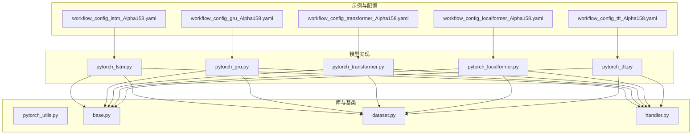
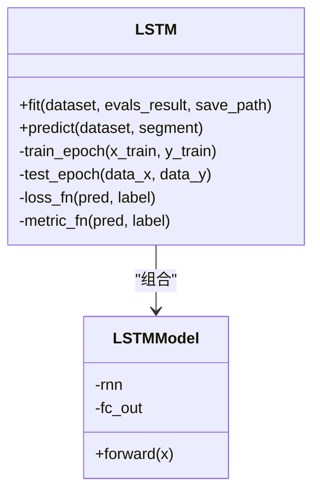
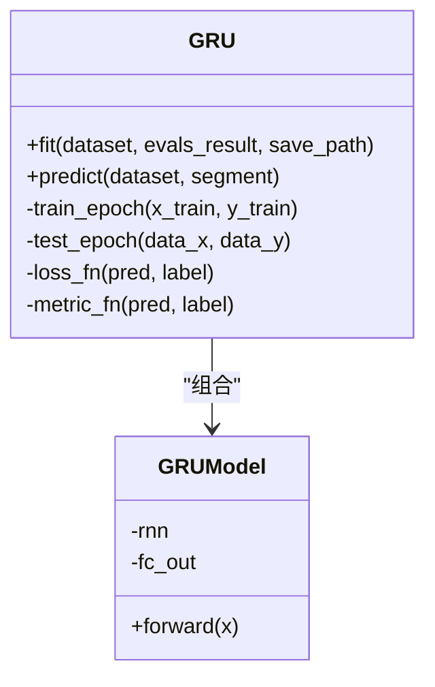
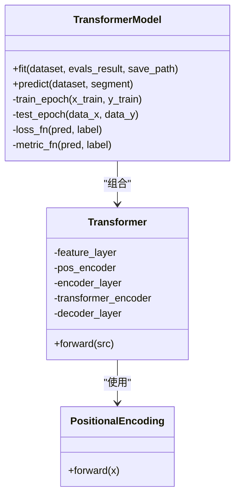
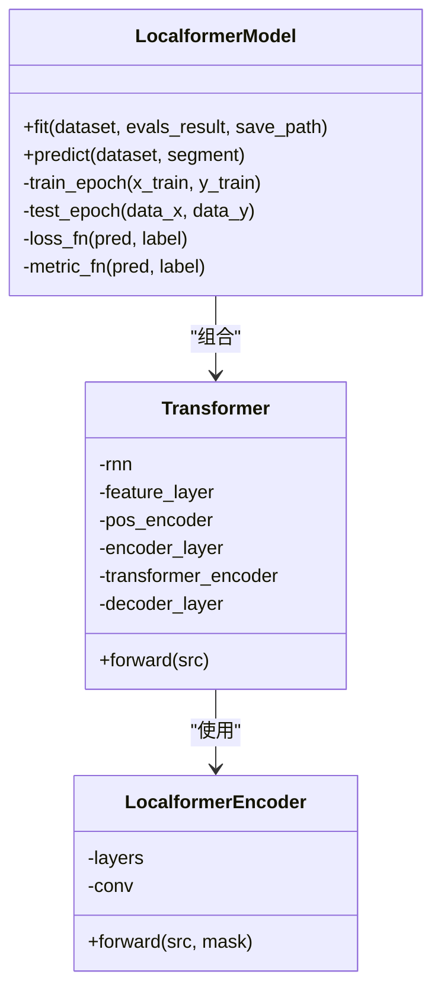
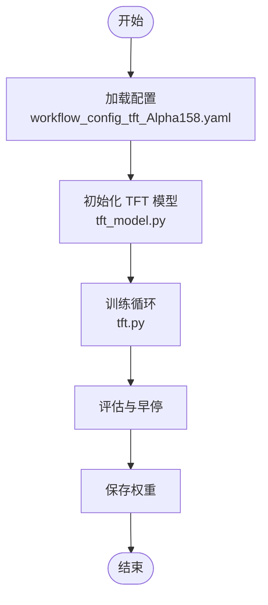
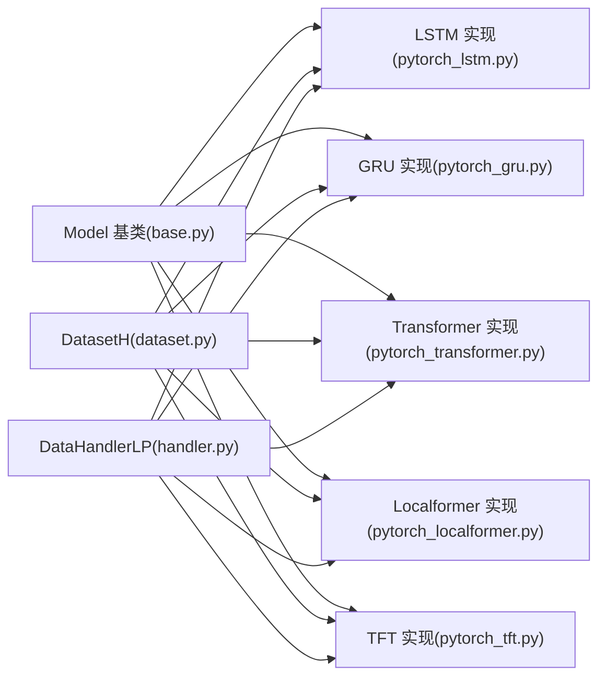

# 深度学习模型

<cite>
**本文引用的文件**
- [pytorch_lstm.py](file://qlib/contrib/model/pytorch_lstm.py)
- [pytorch_gru.py](file://qlib/contrib/model/pytorch_gru.py)
- [pytorch_transformer.py](file://qlib/contrib/model/pytorch_transformer.py)
- [pytorch_localformer.py](file://qlib/contrib/model/pytorch_localformer.py)
- [pytorch_tft.py](file://examples/benchmarks/TFT/tft.py)
- [tft_model.py](file://examples/benchmarks/TFT/libs/tft_model.py)
- [workflow_config_tft_Alpha158.yaml](file://examples/benchmarks/TFT/workflow_config_tft_Alpha158.yaml)
- [workflow_config_lstm_Alpha158.yaml](file://examples/benchmarks/LSTM/workflow_config_lstm_Alpha158.yaml)
- [workflow_config_gru_Alpha158.yaml](file://examples/benchmarks/GRU/workflow_config_gru_Alpha158.yaml)
- [workflow_config_transformer_Alpha158.yaml](file://examples/benchmarks/Transformer/workflow_config_transformer_Alpha158.yaml)
- [workflow_config_localformer_Alpha158.yaml](file://examples/benchmarks/Localformer/workflow_config_localformer_Alpha158.yaml)
- [pytorch_utils.py](file://qlib/contrib/model/pytorch_utils.py)
- [base.py](file://qlib/model/base.py)
- [dataset.py](file://qlib/data/dataset.py)
- [handler.py](file://qlib/data/dataset/handler.py)
</cite>

## 目录
1. [引言](#引言)
2. [项目结构](#项目结构)
3. [核心组件](#核心组件)
4. [架构总览](#架构总览)
5. [详细组件分析](#详细组件分析)
6. [依赖关系分析](#依赖关系分析)
7. [性能考量](#性能考量)
8. [故障排查指南](#故障排查指南)
9. [结论](#结论)
10. [附录](#附录)

## 引言
本文件系统性梳理 Qlib 中基于 PyTorch 的深度学习模型实现，覆盖 MLP（多层感知机）、LSTM、GRU、Transformer、Localformer 以及 TFT 等模型。内容包括：模型网络结构、输入输出格式、训练配置、适用场景、超参数调优策略、损失函数与优化器选择、性能基准与对比分析，并提供完整可运行的配置示例路径与训练脚本入口。

## 项目结构
Qlib 将深度学习模型集中在 contrib/model 下，按算法命名；示例与工作流配置位于 examples/benchmarks 下，便于直接复用与对比实验。



**图示来源**
- [pytorch_lstm.py:1-307](file://qlib/contrib/model/pytorch_lstm.py#L1-L307)
- [pytorch_gru.py:1-340](file://qlib/contrib/model/pytorch_gru.py#L1-L340)
- [pytorch_transformer.py:1-286](file://qlib/contrib/model/pytorch_transformer.py#L1-L286)
- [pytorch_localformer.py:1-323](file://qlib/contrib/model/pytorch_localformer.py#L1-L323)
- [pytorch_tft.py:1-200](file://examples/benchmarks/TFT/tft.py#L1-L200)
- [pytorch_utils.py:1-200](file://qlib/contrib/model/pytorch_utils.py#L1-L200)
- [base.py:1-200](file://qlib/model/base.py#L1-L200)
- [dataset.py:1-200](file://qlib/data/dataset.py#L1-L200)
- [handler.py:1-200](file://qlib/data/dataset/handler.py#L1-L200)

**章节来源**
- [pytorch_lstm.py:1-307](file://qlib/contrib/model/pytorch_lstm.py#L1-L307)
- [pytorch_gru.py:1-340](file://qlib/contrib/model/pytorch_gru.py#L1-L340)
- [pytorch_transformer.py:1-286](file://qlib/contrib/model/pytorch_transformer.py#L1-L286)
- [pytorch_localformer.py:1-323](file://qlib/contrib/model/pytorch_localformer.py#L1-L323)
- [pytorch_tft.py:1-200](file://examples/benchmarks/TFT/tft.py#L1-L200)

## 核心组件
- 模型基类 Model：统一 fit/predict 接口、早停、日志与保存逻辑，各模型继承该基类以获得一致的训练体验。
- 数据集与处理器：DatasetH 提供“train/valid/test”分割与特征/标签列集合；DataHandlerLP 负责数据键位（DK_L/DK_I）与索引管理。
- 训练循环：通用的 train_epoch/test_epoch/fit/predict 流程，支持 GPU 设备切换、梯度裁剪、权重衰减与指标记录。
- 工具模块：参数量统计等辅助能力。

**章节来源**
- [base.py:1-200](file://qlib/model/base.py#L1-L200)
- [dataset.py:1-200](file://qlib/data/dataset.py#L1-L200)
- [handler.py:1-200](file://qlib/data/dataset/handler.py#L1-L200)
- [pytorch_utils.py:1-200](file://qlib/contrib/model/pytorch_utils.py#L1-L200)

## 架构总览
下图展示模型训练主流程与关键对象交互：

```mermaid
sequenceDiagram
participant U as "用户"
participant M as "模型实例(LSTM/GRU/Transformer/Localformer)"
participant DS as "DatasetH"
participant DL as "DataHandlerLP"
participant PT as "PyTorch 模型(nn.Module)"
participant OPT as "优化器"
participant CKPT as "权重保存"
U->>M : "fit(dataset, evals_result, save_path)"
M->>DS : "prepare(['train','valid','test'], col_set=['feature','label'])"
DS-->>M : "df_train/df_valid/df_test"
loop 训练轮次
M->>M : "train_epoch(x_train, y_train)"
M->>PT : "forward()"
PT-->>M : "pred"
M->>OPT : "backward() + step()"
M->>M : "test_epoch(x_valid, y_valid)"
end
M->>CKPT : "保存最佳权重"
U->>M : "predict(dataset, segment='test')"
M->>PT : "eval() + forward()"
PT-->>U : "预测序列"
```

**图示来源**
- [pytorch_lstm.py:204-284](file://qlib/contrib/model/pytorch_lstm.py#L204-L284)
- [pytorch_gru.py:209-317](file://qlib/contrib/model/pytorch_gru.py#L209-L317)
- [pytorch_transformer.py:157-240](file://qlib/contrib/model/pytorch_transformer.py#L157-L240)
- [pytorch_localformer.py:158-241](file://qlib/contrib/model/pytorch_localformer.py#L158-L241)
- [dataset.py:1-200](file://qlib/data/dataset.py#L1-L200)
- [handler.py:1-200](file://qlib/data/dataset/handler.py#L1-L200)

## 详细组件分析

### LSTM 模型
- 网络结构：单层或堆叠 LSTM + 全连接输出，输入按 [N, F, T] 维度重排后经 LSTM，取最后一个时间步线性映射到标量。
- 输入输出：
  - 输入：[N, F*T]（F 为每步特征维，T 为时间步）
  - 输出：[N]
- 关键超参：d_feat、hidden_size、num_layers、dropout、batch_size、n_epochs、lr、early_stop、optimizer、loss
- 训练配置：支持 Adam/GD 优化器、NaN 标签掩码、梯度裁剪、早停、GPU 切换
- 适用场景：时序回归、横截面预测，对长期依赖敏感的任务



**图示来源**
- [pytorch_lstm.py:24-127](file://qlib/contrib/model/pytorch_lstm.py#L24-L127)
- [pytorch_lstm.py:286-307](file://qlib/contrib/model/pytorch_lstm.py#L286-L307)

**章节来源**
- [pytorch_lstm.py:1-307](file://qlib/contrib/model/pytorch_lstm.py#L1-L307)
- [workflow_config_lstm_Alpha158.yaml:1-200](file://examples/benchmarks/LSTM/workflow_config_lstm_Alpha158.yaml#L1-L200)

### GRU 模型
- 网络结构：与 LSTM 类似，采用 GRU 替代 LSTM，通常更快收敛但表达能力略弱
- 输入输出：同 LSTM
- 关键超参：同 LSTM
- 训练配置：同 LSTM
- 适用场景：长序列建模、资源受限环境下的快速训练



**图示来源**
- [pytorch_gru.py:25-131](file://qlib/contrib/model/pytorch_gru.py#L25-L131)
- [pytorch_gru.py:319-340](file://qlib/contrib/model/pytorch_gru.py#L319-L340)

**章节来源**
- [pytorch_gru.py:1-340](file://qlib/contrib/model/pytorch_gru.py#L1-L340)
- [workflow_config_gru_Alpha158.yaml:1-200](file://examples/benchmarks/GRU/workflow_config_gru_Alpha158.yaml#L1-L200)

### Transformer 模型
- 网络结构：特征线性映射至 d_model，位置编码，多头自注意力编码器，最后取序列末态线性解码
- 输入输出：输入 [N, F*T] → [N, T, F] → [T, N, F]（非 batch_first），经编码器与位置编码后取最后一时刻
- 关键超参：d_feat、d_model、nhead、num_layers、dropout、batch_size、n_epochs、lr、reg、early_stop、optimizer、loss
- 训练配置：支持权重衰减、梯度裁剪、早停
- 适用场景：强依赖全局相关性的任务，如多变量时间序列建模



**图示来源**
- [pytorch_transformer.py:27-83](file://qlib/contrib/model/pytorch_transformer.py#L27-L83)
- [pytorch_transformer.py:242-286](file://qlib/contrib/model/pytorch_transformer.py#L242-L286)

**章节来源**
- [pytorch_transformer.py:1-286](file://qlib/contrib/model/pytorch_transformer.py#L1-L286)
- [workflow_config_transformer_Alpha158.yaml:1-200](file://examples/benchmarks/Transformer/workflow_config_transformer_Alpha158.yaml#L1-L200)

### Localformer 模型
- 网络结构：在标准 Transformer 编码器基础上引入局部卷积分支（Conv1d）与残差融合，增强局部模式建模能力；随后接入 GRU 进一步聚合
- 输入输出：与 Transformer 类似，最终取序列末态线性解码
- 关键超参：同 Transformer，新增 num_layers、dropout、reg
- 训练配置：同 Transformer
- 适用场景：需要同时捕捉局部与全局依赖的复杂时序任务



**图示来源**
- [pytorch_localformer.py:28-84](file://qlib/contrib/model/pytorch_localformer.py#L28-L84)
- [pytorch_localformer.py:263-323](file://qlib/contrib/model/pytorch_localformer.py#L263-L323)

**章节来源**
- [pytorch_localformer.py:1-323](file://qlib/contrib/model/pytorch_localformer.py#L1-L323)
- [workflow_config_localformer_Alpha158.yaml:1-200](file://examples/benchmarks/Localformer/workflow_config_localformer_Alpha158.yaml#L1-L200)

### TFT（Temporal Fusion Transformer）模型
- 网络结构：由输入嵌入、可选静态编码器、可选可加性注意的编码器、解码器与多变量输出层组成，适合处理多变量、跨时间步的时序预测
- 输入输出：支持多变量特征与历史/未来变量，输出为标量或向量
- 关键超参：见配置文件中的批次大小、层数、头数、学习率、正则等
- 训练配置：通过独立脚本与配置文件驱动，便于扩展与对比
- 适用场景：金融多因子预测、带条件与协变量的时间序列建模



**图示来源**
- [pytorch_tft.py:1-200](file://examples/benchmarks/TFT/tft.py#L1-L200)
- [tft_model.py:1-200](file://examples/benchmarks/TFT/libs/tft_model.py#L1-L200)
- [workflow_config_tft_Alpha158.yaml:1-200](file://examples/benchmarks/TFT/workflow_config_tft_Alpha158.yaml#L1-L200)

**章节来源**
- [pytorch_tft.py:1-200](file://examples/benchmarks/TFT/tft.py#L1-L200)
- [tft_model.py:1-200](file://examples/benchmarks/TFT/libs/tft_model.py#L1-L200)
- [workflow_config_tft_Alpha158.yaml:1-200](file://examples/benchmarks/TFT/workflow_config_tft_Alpha158.yaml#L1-L200)

## 依赖关系分析
- 模型实现依赖：
  - 基类 Model：统一 fit/predict/早停/日志/保存
  - 数据层 DatasetH 与 DataHandlerLP：提供特征/标签准备与索引管理
  - PyTorch：nn.Module、optim、device 管理
- 配置与示例：
  - 各模型均有对应 workflow 配置文件，便于一键运行与对比



**图示来源**
- [base.py:1-200](file://qlib/model/base.py#L1-L200)
- [dataset.py:1-200](file://qlib/data/dataset.py#L1-L200)
- [handler.py:1-200](file://qlib/data/dataset/handler.py#L1-L200)
- [pytorch_lstm.py:1-307](file://qlib/contrib/model/pytorch_lstm.py#L1-L307)
- [pytorch_gru.py:1-340](file://qlib/contrib/model/pytorch_gru.py#L1-L340)
- [pytorch_transformer.py:1-286](file://qlib/contrib/model/pytorch_transformer.py#L1-L286)
- [pytorch_localformer.py:1-323](file://qlib/contrib/model/pytorch_localformer.py#L1-L323)
- [pytorch_tft.py:1-200](file://examples/benchmarks/TFT/tft.py#L1-L200)

**章节来源**
- [base.py:1-200](file://qlib/model/base.py#L1-L200)
- [dataset.py:1-200](file://qlib/data/dataset.py#L1-L200)
- [handler.py:1-200](file://qlib/data/dataset/handler.py#L1-L200)

## 性能考量
- 设备与显存：自动检测 CUDA 并将模型与张量迁移至 GPU；训练结束会清空缓存
- 梯度控制：固定阈值裁剪防止爆炸梯度
- 批大小与学习率：建议从默认值起步，结合数据规模与显存进行缩放
- 正则化：Transformer/TFT 支持权重衰减，有助于缓解过拟合
- 参数量：可通过工具模块统计参数规模，指导模型容量设计

**章节来源**
- [pytorch_lstm.py:173-174](file://qlib/contrib/model/pytorch_lstm.py#L173-L174)
- [pytorch_gru.py:177-178](file://qlib/contrib/model/pytorch_gru.py#L177-L178)
- [pytorch_transformer.py:125-126](file://qlib/contrib/model/pytorch_transformer.py#L125-L126)
- [pytorch_localformer.py:126-127](file://qlib/contrib/model/pytorch_localformer.py#L126-L127)
- [pytorch_utils.py:1-200](file://qlib/contrib/model/pytorch_utils.py#L1-L200)

## 故障排查指南
- 训练数据为空：当数据集未返回有效样本时抛出异常，检查数据源与列集合配置
- 模型未拟合即预测：predict 前需先 fit，否则抛出异常
- GPU 不可用：自动回退 CPU；若仍报设备错误，请确认 CUDA 可用与 GPU ID 设置正确
- 指标与损失：仅支持指定损失与指标，非法值会触发异常
- 早停无效：若未提供验证集，早停不会生效；请确保数据集包含 valid 分割

**章节来源**
- [pytorch_lstm.py:215-217](file://qlib/contrib/model/pytorch_lstm.py#L215-L217)
- [pytorch_gru.py:228-230](file://qlib/contrib/model/pytorch_gru.py#L228-L230)
- [pytorch_transformer.py:168-170](file://qlib/contrib/model/pytorch_transformer.py#L168-L170)
- [pytorch_localformer.py:169-171](file://qlib/contrib/model/pytorch_localformer.py#L169-L171)
- [pytorch_lstm.py:263-265](file://qlib/contrib/model/pytorch_lstm.py#L263-L265)

## 结论
Qlib 的深度学习模型以统一基类与数据接口为核心，提供了 LSTM、GRU、Transformer、Localformer 与 TFT 等主流架构的稳定实现。通过标准化的训练流程、早停与日志记录，配合丰富的示例配置，用户可在量化投资场景中快速搭建、训练与评估模型。建议优先根据任务特性与资源约束选择合适模型，并结合示例配置进行超参数搜索与对比实验。

## 附录

### 模型输入输出与训练配置要点
- 输入格式：所有模型均接受 [N, F*T] 的展平特征，内部自动重排为 [N, T, F] 或 [T, N, F]（非 batch_first）
- 输出格式：回归任务输出 [N]，分类任务需调整最后一层
- 训练配置：建议从默认超参起步，逐步调整 batch_size、lr、n_epochs、early_stop；必要时启用权重衰减与梯度裁剪

**章节来源**
- [pytorch_lstm.py:301-307](file://qlib/contrib/model/pytorch_lstm.py#L301-L307)
- [pytorch_gru.py:334-340](file://qlib/contrib/model/pytorch_gru.py#L334-L340)
- [pytorch_transformer.py:269-286](file://qlib/contrib/model/pytorch_transformer.py#L269-L286)
- [pytorch_localformer.py:304-323](file://qlib/contrib/model/pytorch_localformer.py#L304-L323)

### 示例与配置文件路径
- LSTM：[workflow_config_lstm_Alpha158.yaml:1-200](file://examples/benchmarks/LSTM/workflow_config_lstm_Alpha158.yaml#L1-L200)
- GRU：[workflow_config_gru_Alpha158.yaml:1-200](file://examples/benchmarks/GRU/workflow_config_gru_Alpha158.yaml#L1-L200)
- Transformer：[workflow_config_transformer_Alpha158.yaml:1-200](file://examples/benchmarks/Transformer/workflow_config_transformer_Alpha158.yaml#L1-L200)
- Localformer：[workflow_config_localformer_Alpha158.yaml:1-200](file://examples/benchmarks/Localformer/workflow_config_localformer_Alpha158.yaml#L1-L200)
- TFT：[workflow_config_tft_Alpha158.yaml:1-200](file://examples/benchmarks/TFT/workflow_config_tft_Alpha158.yaml#L1-L200)，[tft.py:1-200](file://examples/benchmarks/TFT/tft.py#L1-L200)，[tft_model.py:1-200](file://examples/benchmarks/TFT/libs/tft_model.py#L1-L200)