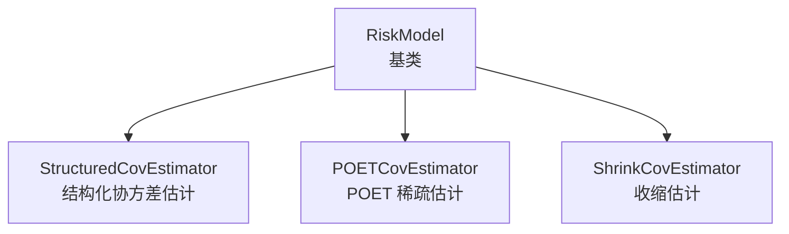
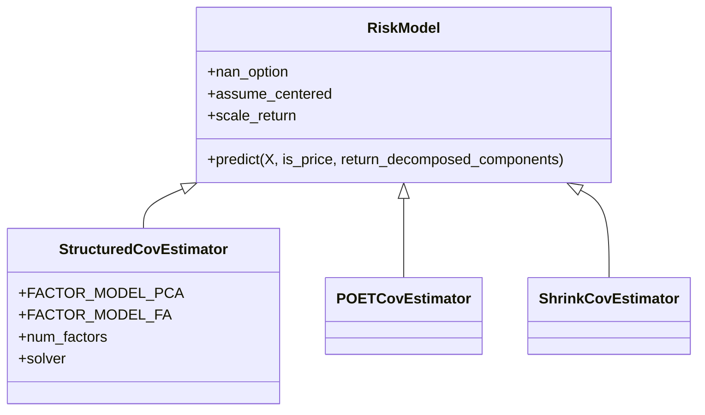
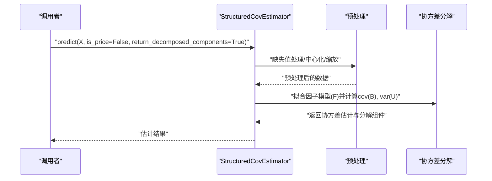
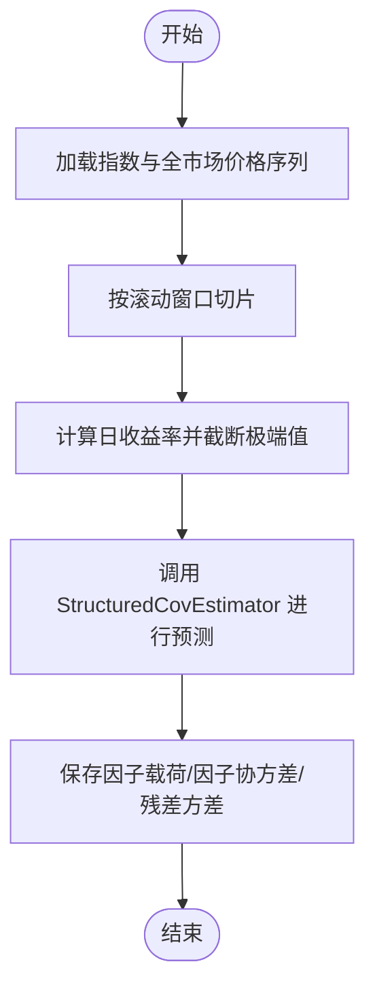
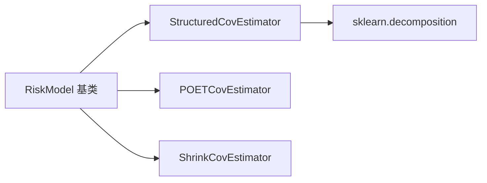

# 风险模型

<cite>
**本文引用的文件**   
- [qlib/model/riskmodel/base.py](file://qlib/model/riskmodel/base.py)
- [qlib/model/riskmodel/poet.py](file://qlib/model/riskmodel/poet.py)
- [qlib/model/riskmodel/shrink.py](file://qlib/model/riskmodel/shrink.py)
- [qlib/model/riskmodel/structured.py](file://qlib/model/riskmodel/structured.py)
- [qlib/model/riskmodel/__init__.py](file://qlib/model/riskmodel/__init__.py)
- [examples/portfolio/prepare_riskdata.py](file://examples/portfolio/prepare_riskdata.py)
- [tests/test_structured_cov_estimator.py](file://tests/test_structured_cov_estimator.py)
</cite>

## 目录
1. [引言](#引言)
2. [项目结构](#项目结构)
3. [核心组件](#核心组件)
4. [架构总览](#架构总览)
5. [详细组件分析](#详细组件分析)
6. [依赖关系分析](#依赖关系分析)
7. [性能考量](#性能考量)
8. [故障排查指南](#故障排查指南)
9. [结论](#结论)
10. [附录](#附录)

## 引言
本文件面向量化投资中的风险建模实践，围绕 Qlib 风险模型子系统进行系统性梳理与说明。重点覆盖以下主题：
- 协方差矩阵估计：包括传统样本估计、收缩估计与稀疏估计（POET）等方法的理论背景与实现要点
- 风险因子模型与结构化风险模型：基于主成分分析（PCA）与因子分析（Factor Analysis）的潜在因子建模
- 风险模型在投资组合优化、风险管理和资产定价中的应用路径
- 构建流程、参数估计方法与模型验证技术
- 性能评估指标与实际应用案例（以仓库中的示例脚本为依据）

本文件严格基于仓库中现有源码与示例进行分析，避免臆造信息。

## 项目结构
Qlib 的风险模型位于模块 qlib/model/riskmodel 下，包含通用基类与三种具体估计器：
- 基类：RiskModel（定义统一接口与通用逻辑）
- 结构化估计器：StructuredCovEstimator（基于潜在因子模型分解协方差）
- 稀疏估计器：POETCovEstimator（基于图稀疏学习的协方差估计）
- 收缩估计器：ShrinkCovEstimator（基于目标矩阵的线性收缩估计）

图表来源
- [qlib/model/riskmodel/base.py](file://qlib/model/riskmodel/base.py)
- [qlib/model/riskmodel/structured.py](file://qlib/model/riskmodel/structured.py)
- [qlib/model/riskmodel/poet.py](file://qlib/model/riskmodel/poet.py)
- [qlib/model/riskmodel/shrink.py](file://qlib/model/riskmodel/shrink.py)

章节来源
- [qlib/model/riskmodel/__init__.py](file://qlib/model/riskmodel/__init__.py)

## 核心组件
- RiskModel（基类）
  - 定义风险模型的统一接口与通用处理流程，如缺失值处理选项（nan_option）、是否中心化假设（assume_centered）、是否缩放收益率（scale_return）等
  - 提供 predict 接口用于输出协方差估计结果
- StructuredCovEstimator（结构化协方差估计）
  - 假设观测可由多个因子线性解释，协方差可分解为因子协方差与残差对角部分之和
  - 支持两种潜在因子模型：PCA 与 Factor Analysis
- POETCovEstimator（POET 稀疏估计）
  - 基于图稀疏学习的协方差估计，适合高维情形下的稀疏协方差估计
- ShrinkCovEstimator（收缩估计）
  - 将样本协方差向某个目标矩阵（如对角或常数相关系数矩阵）收缩，降低估计噪声

章节来源
- [qlib/model/riskmodel/base.py](file://qlib/model/riskmodel/base.py)
- [qlib/model/riskmodel/structured.py](file://qlib/model/riskmodel/structured.py)
- [qlib/model/riskmodel/poet.py](file://qlib/model/riskmodel/poet.py)
- [qlib/model/riskmodel/shrink.py](file://qlib/model/riskmodel/shrink.py)

## 架构总览
下图展示了风险模型子系统的类层次与依赖关系：

图表来源
- [qlib/model/riskmodel/base.py](file://qlib/model/riskmodel/base.py)
- [qlib/model/riskmodel/structured.py](file://qlib/model/riskmodel/structured.py)
- [qlib/model/riskmodel/poet.py](file://qlib/model/riskmodel/poet.py)
- [qlib/model/riskmodel/shrink.py](file://qlib/model/riskmodel/shrink.py)

## 详细组件分析

### 基类：RiskModel
- 职责
  - 统一输入数据格式约定（价格或收益），并根据配置进行预处理（中心化、缩放、缺失值处理）
  - 暴露 predict 接口，返回协方差估计结果；支持返回分解后的因子协方差与残差方差
- 关键参数
  - nan_option：缺失值处理策略（例如填充）
  - assume_centered：是否假设数据已中心化
  - scale_return：是否对收益率做缩放处理
- 典型调用流程
  - 输入 → 数据预处理 → 协方差估计 → 输出估计结果

章节来源
- [qlib/model/riskmodel/base.py](file://qlib/model/riskmodel/base.py)

### 结构化协方差估计器：StructuredCovEstimator
- 理论基础
  - 观测变量可由潜在因子线性解释：X = B·F^T + U，协方差分解为：cov(X^T) = F·cov(B^T)·F^T + diag(var(U))
  - 因子模型支持 PCA 与 Factor Analysis
- 关键参数
  - factor_model：选择“pca”或“fa”
  - num_factors：保留的因子个数
  - nan_option：默认“fill”，仅接受该选项
- 使用场景
  - 在金融领域，可用于统计风险模型（SRM）、基本面风险模型（FRM）或深度风险模型（DRM）框架下的潜在因子提取
- 示例调用（来自测试）
  - 通过 predict 返回协方差估计，并可选择返回分解后的因子协方差与残差方差

图表来源
- [qlib/model/riskmodel/structured.py](file://qlib/model/riskmodel/structured.py)

章节来源
- [qlib/model/riskmodel/structured.py](file://qlib/model/riskmodel/structured.py)
- [tests/test_structured_cov_estimator.py](file://tests/test_structured_cov_estimator.py)

### POET 协方差估计器：POETCovEstimator
- 理论基础
  - 基于图稀疏学习（Graphical Lasso 或类似思路）进行稀疏协方差估计，适用于高维、样本量有限的情形
- 实现要点
  - 通过正则化项鼓励稀疏解，提升估计稳定性与可解释性
- 适用场景
  - 当变量维度远大于样本数量时，传统估计不稳定，POET 更具鲁棒性

章节来源
- [qlib/model/riskmodel/poet.py](file://qlib/model/riskmodel/poet.py)

### 收缩协方差估计器：ShrinkCovEstimator
- 理论基础
  - 将样本协方差 Σ_sample 向目标矩阵 Σ_target 收缩：Σ_hat = α·Σ_target + (1−α)·Σ_sample
  - 常见目标包括对角矩阵、单位矩阵或常数相关系数矩阵
- 实现要点
  - 通过交叉验证或经验规则确定收缩强度 α
- 适用场景
  - 降低估计误差方差，改善投资组合权重稳定性

章节来源
- [qlib/model/riskmodel/shrink.py](file://qlib/model/riskmodel/shrink.py)

### 应用示例：准备结构化风险数据
- 示例脚本概述
  - 从数据源获取沪深 300 成分股与全市场日线收盘价序列
  - 计算滚动窗口内的日收益率并进行极值截断
  - 使用 StructuredCovEstimator 对每个交易日进行风险建模，输出因子载荷、因子协方差与残差方差
  - 将结果保存到指定目录，便于后续回测或优化使用

图表来源
- [examples/portfolio/prepare_riskdata.py](file://examples/portfolio/prepare_riskdata.py)

章节来源
- [examples/portfolio/prepare_riskdata.py](file://examples/portfolio/prepare_riskdata.py)

## 依赖关系分析
- 模块导出
  - riskmodel/__init__.py 导出 RiskModel、POETCovEstimator、ShrinkCovEstimator、StructuredCovEstimator
- 类间关系
  - 三类估计器均继承自 RiskModel，共享统一接口与通用预处理逻辑
- 外部依赖
  - StructuredCovEstimator 使用 sklearn.decomposition 中的 PCA 与 FactorAnalysis 进行潜在因子拟合

图表来源
- [qlib/model/riskmodel/__init__.py](file://qlib/model/riskmodel/__init__.py)
- [qlib/model/riskmodel/structured.py](file://qlib/model/riskmodel/structured.py)

章节来源
- [qlib/model/riskmodel/__init__.py](file://qlib/model/riskmodel/__init__.py)

## 性能考量
- 维度与样本量
  - 当变量维度较大而样本量较小时，建议优先考虑 POET 或收缩估计，以降低估计方差
- 因子数量选择
  - StructuredCovEstimator 的 num_factors 需结合特征值贡献率与回测效果进行选择
- 预处理稳健性
  - 收益率极值截断与缺失值处理对估计稳定性影响显著，应结合业务场景设定合理的阈值与策略
- 计算复杂度
  - PCA 通常比因子分析更快；因子分析在非高斯噪声下可能更稳健，但计算成本更高

## 故障排查指南
- 测试用例参考
  - 随机生成矩阵与 numpy 协方差对比，验证结构化估计器在 assume_centered=True 与 scale_return=False 条件下的正确性
  - 验证 nan_option 传入“fill”时的行为一致性
- 常见问题定位
  - 若协方差估计与期望不符，检查 assume_centered、scale_return 与数据预处理步骤
  - 若结构化估计器报错，确认 factor_model 仅使用“pca”或“fa”，且 nan_option 为“fill”

章节来源
- [tests/test_structured_cov_estimator.py](file://tests/test_structured_cov_estimator.py)

## 结论
Qlib 的风险模型子系统提供了统一的基类与多种估计器实现，能够覆盖从传统样本估计到稀疏与收缩估计的广泛需求。结合结构化因子模型，可在高维场景下获得更稳健的协方差估计，为投资组合优化、风险管理和资产定价提供可靠支撑。建议在实际应用中：
- 明确估计目标与数据特性，选择合适的估计器与参数
- 重视预处理与稳健性控制（缺失值、极值、中心化与缩放）
- 通过滚动窗口与回测验证估计器的稳定性与有效性

## 附录
- 示例脚本路径
  - [examples/portfolio/prepare_riskdata.py](file://examples/portfolio/prepare_riskdata.py)
- 测试脚本路径
  - [tests/test_structured_cov_estimator.py](file://tests/test_structured_cov_estimator.py)