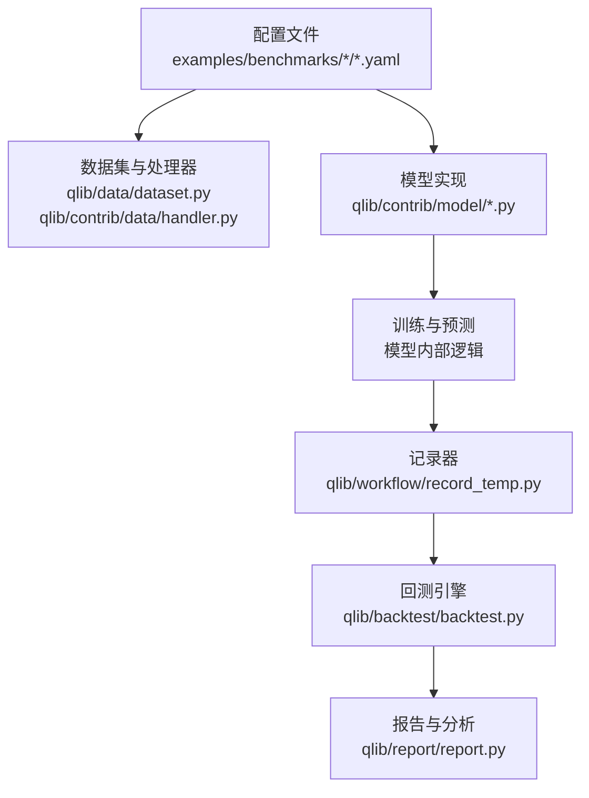
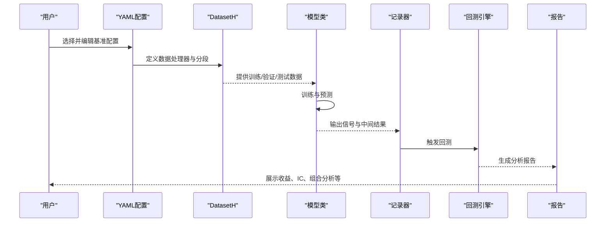
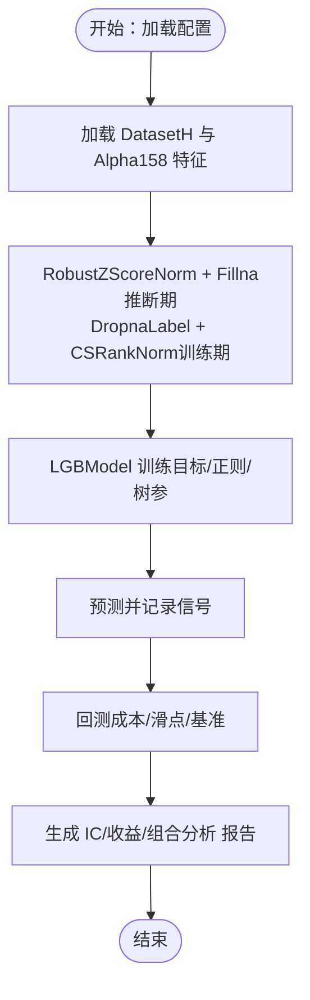
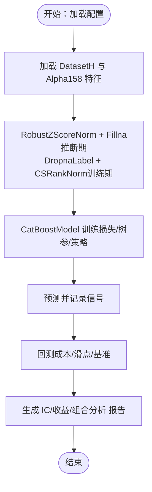
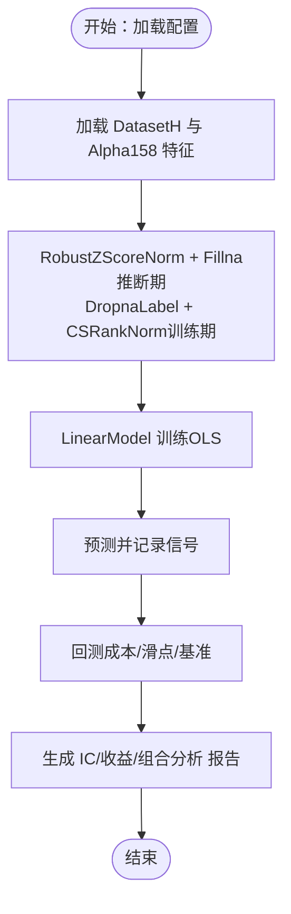
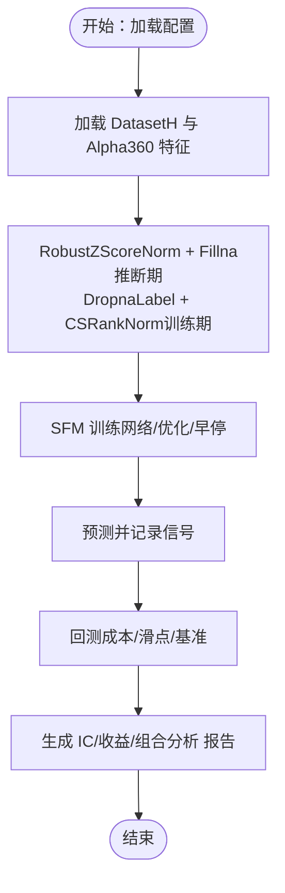
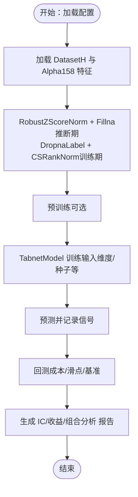
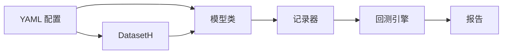

# 传统机器学习模型基准

<cite>
**本文引用的文件**
- [examples/benchmarks/LightGBM/workflow_config_lightgbm_Alpha158.yaml](file://examples/benchmarks/LightGBM/workflow_config_lightgbm_Alpha158.yaml)
- [examples/benchmarks/XGBoost/workflow_config_xgboost_Alpha158.yaml](file://examples/benchmarks/XGBoost/workflow_config_xgboost_Alpha158.yaml)
- [examples/benchmarks/CatBoost/workflow_config_catboost_Alpha158.yaml](file://examples/benchmarks/CatBoost/workflow_config_catboost_Alpha158.yaml)
- [examples/benchmarks/Linear/workflow_config_linear_Alpha158.yaml](file://examples/benchmarks/Linear/workflow_config_linear_Alpha158.yaml)
- [examples/benchmarks/SFM/workflow_config_sfm_Alpha360.yaml](file://examples/benchmarks/SFM/workflow_config_sfm_Alpha360.yaml)
- [examples/benchmarks/TabNet/workflow_config_TabNet_Alpha158.yaml](file://examples/benchmarks/TabNet/workflow_config_TabNet_Alpha158.yaml)
- [qlib/contrib/model/gbdt.py](file://qlib/contrib/model/gbdt.py)
- [qlib/contrib/model/xgboost.py](file://qlib/contrib/model/xgboost.py)
- [qlib/contrib/model/catboost_model.py](file://qlib/contrib/model/catboost_model.py)
- [qlib/contrib/model/linear.py](file://qlib/contrib/model/linear.py)
- [qlib/contrib/model/pytorch_sfm.py](file://qlib/contrib/model/pytorch_sfm.py)
- [qlib/contrib/model/pytorch_tabnet.py](file://qlib/contrib/model/pytorch_tabnet.py)
- [qlib/data/dataset.py](file://qlib/data/dataset.py)
- [qlib/contrib/data/handler.py](file://qlib/contrib/data/handler.py)
- [qlib/workflow/record_temp.py](file://qlib/workflow/record_temp.py)
- [qlib/backtest/backtest.py](file://qlib/backtest/backtest.py)
- [qlib/report/report.py](file://qlib/report/report.py)
</cite>

## 目录
1. [引言](#引言)
2. [项目结构](#项目结构)
3. [核心组件](#核心组件)
4. [架构总览](#架构总览)
5. [详细组件分析](#详细组件分析)
6. [依赖关系分析](#依赖关系分析)
7. [性能考量](#性能考量)
8. [故障排查指南](#故障排查指南)
9. [结论](#结论)
10. [附录](#附录)

## 引言
本文件面向在 Qlib 中开展传统机器学习模型基准实验的用户与研究者，系统梳理 LightGBM、XGBoost、CatBoost、Linear、SFM、TabNet 等模型在基准任务中的配置方式、数据预处理流程、训练策略与评估指标，并给出可直接复用的配置文件路径与运行建议。同时总结各模型的性能差异成因与适用场景，提供超参数调优最佳实践与性能对比分析方法。

## 项目结构
基准实验主要由三部分构成：
- 配置文件：位于 examples/benchmarks 下，定义数据集、处理器、回测与记录器等。
- 模型实现：位于 qlib/contrib/model 下，封装具体算法接口与训练细节。
- 工作流与记录：通过 qlib 的 dataset、handler、workflow record 等模块完成数据加载、信号生成、分析与回测。

图表来源
- [examples/benchmarks/LightGBM/workflow_config_lightgbm_Alpha158.yaml:1-72](file://examples/benchmarks/LightGBM/workflow_config_lightgbm_Alpha158.yaml#L1-L72)
- [qlib/data/dataset.py](file://qlib/data/dataset.py)
- [qlib/contrib/data/handler.py](file://qlib/contrib/data/handler.py)
- [qlib/contrib/model/gbdt.py](file://qlib/contrib/model/gbdt.py)
- [qlib/workflow/record_temp.py](file://qlib/workflow/record_temp.py)
- [qlib/backtest/backtest.py](file://qlib/backtest/backtest.py)
- [qlib/report/report.py](file://qlib/report/report.py)

章节来源
- [examples/benchmarks/LightGBM/workflow_config_lightgbm_Alpha158.yaml:1-72](file://examples/benchmarks/LightGBM/workflow_config_lightgbm_Alpha158.yaml#L1-L72)
- [examples/benchmarks/XGBoost/workflow_config_xgboost_Alpha158.yaml:1-70](file://examples/benchmarks/XGBoost/workflow_config_xgboost_Alpha158.yaml#L1-L70)
- [examples/benchmarks/CatBoost/workflow_config_catboost_Alpha158.yaml:1-71](file://examples/benchmarks/CatBoost/workflow_config_catboost_Alpha158.yaml#L1-L71)
- [examples/benchmarks/Linear/workflow_config_linear_Alpha158.yaml:1-77](file://examples/benchmarks/Linear/workflow_config_linear_Alpha158.yaml#L1-L77)
- [examples/benchmarks/SFM/workflow_config_sfm_Alpha360.yaml:1-91](file://examples/benchmarks/SFM/workflow_config_sfm_Alpha360.yaml#L1-L91)
- [examples/benchmarks/TabNet/workflow_config_TabNet_Alpha158.yaml:1-82](file://examples/benchmarks/TabNet/workflow_config_TabNet_Alpha158.yaml#L1-L82)

## 核心组件
- 数据集与分段
  - 使用 DatasetH 加载 Alpha158/Alpha360 特征，按时间切分为 train/valid/test 或 pretrain/pretrain_validation 等阶段。
  - 参考路径：[examples/benchmarks/LightGBM/workflow_config_lightgbm_Alpha158.yaml:45-56](file://examples/benchmarks/LightGBM/workflow_config_lightgbm_Alpha158.yaml#L45-L56)，[examples/benchmarks/TabNet/workflow_config_TabNet_Alpha158.yaml:53-66](file://examples/benchmarks/TabNet/workflow_config_TabNet_Alpha158.yaml#L53-L66)
- 处理器链
  - 推断期：RobustZScoreNorm（特征标准化并截尾）、Fillna（缺失填充）。
  - 训练期：DropnaLabel（剔除标签缺失样本）、CSRankNorm（按时序对标签进行秩归一化）。
  - 参考路径：[examples/benchmarks/Linear/workflow_config_linear_Alpha158.yaml:12-24](file://examples/benchmarks/Linear/workflow_config_linear_Alpha158.yaml#L12-L24)，[examples/benchmarks/SFM/workflow_config_sfm_Alpha360.yaml:12-25](file://examples/benchmarks/SFM/workflow_config_sfm_Alpha360.yaml#L12-L25)
- 模型与训练
  - LightGBM/XGBoost/CatBoost：基于梯度提升框架，配置目标函数、正则化、树深度、叶子数、采样率等。
  - Linear：普通最小二乘回归（OLS）。
  - SFM/TabNet：基于 PyTorch 的神经网络模型，配置网络维度、优化器、学习率、批次大小、早停等。
  - 参考路径：[examples/benchmarks/LightGBM/workflow_config_lightgbm_Alpha158.yaml:32-44](file://examples/benchmarks/LightGBM/workflow_config_lightgbm_Alpha158.yaml#L32-L44)，[examples/benchmarks/XGBoost/workflow_config_xgboost_Alpha158.yaml:32-42](file://examples/benchmarks/XGBoost/workflow_config_xgboost_Alpha158.yaml#L32-L42)，[examples/benchmarks/CatBoost/workflow_config_catboost_Alpha158.yaml:32-43](file://examples/benchmarks/CatBoost/workflow_config_catboost_Alpha158.yaml#L32-L43)，[examples/benchmarks/Linear/workflow_config_linear_Alpha158.yaml:45-49](file://examples/benchmarks/Linear/workflow_config_linear_Alpha158.yaml#L45-L49)，[examples/benchmarks/SFM/workflow_config_sfm_Alpha360.yaml:46-63](file://examples/benchmarks/SFM/workflow_config_sfm_Alpha360.yaml#L46-L63)，[examples/benchmarks/TabNet/workflow_config_TabNet_Alpha158.yaml:46-52](file://examples/benchmarks/TabNet/workflow_config_TabNet_Alpha158.yaml#L46-L52)
- 记录与回测
  - SignalRecord/SigAnaRecord/PortAnaRecord：分别输出信号、信号分析（IC、偏IC等）与组合分析（收益、回撤、换手等）。
  - 回测参数：账户规模、基准、滑点与手续费、最大涨跌幅限制等。
  - 参考路径：[examples/benchmarks/LightGBM/workflow_config_lightgbm_Alpha158.yaml:57-71](file://examples/benchmarks/LightGBM/workflow_config_lightgbm_Alpha158.yaml#L57-L71)，[examples/benchmarks/Linear/workflow_config_linear_Alpha158.yaml:62-76](file://examples/benchmarks/Linear/workflow_config_linear_Alpha158.yaml#L62-L76)，[examples/benchmarks/SFM/workflow_config_sfm_Alpha360.yaml:76-90](file://examples/benchmarks/SFM/workflow_config_sfm_Alpha360.yaml#L76-L90)

章节来源
- [examples/benchmarks/LightGBM/workflow_config_lightgbm_Alpha158.yaml:32-71](file://examples/benchmarks/LightGBM/workflow_config_lightgbm_Alpha158.yaml#L32-L71)
- [examples/benchmarks/XGBoost/workflow_config_xgboost_Alpha158.yaml:32-69](file://examples/benchmarks/XGBoost/workflow_config_xgboost_Alpha158.yaml#L32-L69)
- [examples/benchmarks/CatBoost/workflow_config_catboost_Alpha158.yaml:32-70](file://examples/benchmarks/CatBoost/workflow_config_catboost_Alpha158.yaml#L32-L70)
- [examples/benchmarks/Linear/workflow_config_linear_Alpha158.yaml:45-76](file://examples/benchmarks/Linear/workflow_config_linear_Alpha158.yaml#L45-L76)
- [examples/benchmarks/SFM/workflow_config_sfm_Alpha360.yaml:46-90](file://examples/benchmarks/SFM/workflow_config_sfm_Alpha360.yaml#L46-L90)
- [examples/benchmarks/TabNet/workflow_config_TabNet_Alpha158.yaml:46-81](file://examples/benchmarks/TabNet/workflow_config_TabNet_Alpha158.yaml#L46-L81)

## 架构总览
下图展示一次典型基准实验从配置到回测的端到端流程：

图表来源
- [examples/benchmarks/LightGBM/workflow_config_lightgbm_Alpha158.yaml:1-72](file://examples/benchmarks/LightGBM/workflow_config_lightgbm_Alpha158.yaml#L1-L72)
- [qlib/data/dataset.py](file://qlib/data/dataset.py)
- [qlib/contrib/model/gbdt.py](file://qlib/contrib/model/gbdt.py)
- [qlib/workflow/record_temp.py](file://qlib/workflow/record_temp.py)
- [qlib/backtest/backtest.py](file://qlib/backtest/backtest.py)
- [qlib/report/report.py](file://qlib/report/report.py)

## 详细组件分析

### LightGBM 基准
- 模型类与模块
  - 类名与模块：LGBModel（来自梯度提升实现）
  - 参考路径：[examples/benchmarks/LightGBM/workflow_config_lightgbm_Alpha158.yaml:33-34](file://examples/benchmarks/LightGBM/workflow_config_lightgbm_Alpha158.yaml#L33-L34)
- 关键参数
  - 目标函数、正则化项、树深、叶子数、子采样、列采样、学习率、线程数等
  - 参考路径：[examples/benchmarks/LightGBM/workflow_config_lightgbm_Alpha158.yaml:36-44](file://examples/benchmarks/LightGBM/workflow_config_lightgbm_Alpha158.yaml#L36-L44)
- 数据与处理器
  - Alpha158 特征；训练/验证/测试分段
  - 参考路径：[examples/benchmarks/LightGBM/workflow_config_lightgbm_Alpha158.yaml:45-56](file://examples/benchmarks/LightGBM/workflow_config_lightgbm_Alpha158.yaml#L45-L56)
- 记录与回测
  - 信号记录、信号分析、组合分析；回测成本与滑点设置
  - 参考路径：[examples/benchmarks/LightGBM/workflow_config_lightgbm_Alpha158.yaml:57-71](file://examples/benchmarks/LightGBM/workflow_config_lightgbm_Alpha158.yaml#L57-L71)

图表来源
- [examples/benchmarks/LightGBM/workflow_config_lightgbm_Alpha158.yaml:12-71](file://examples/benchmarks/LightGBM/workflow_config_lightgbm_Alpha158.yaml#L12-L71)
- [qlib/contrib/model/gbdt.py](file://qlib/contrib/model/gbdt.py)

章节来源
- [examples/benchmarks/LightGBM/workflow_config_lightgbm_Alpha158.yaml:32-71](file://examples/benchmarks/LightGBM/workflow_config_lightgbm_Alpha158.yaml#L32-L71)

### XGBoost 基准
- 模型类与模块
  - 类名与模块：XGBModel（来自梯度提升实现）
  - 参考路径：[examples/benchmarks/XGBoost/workflow_config_xgboost_Alpha158.yaml:33-34](file://examples/benchmarks/XGBoost/workflow_config_xgboost_Alpha158.yaml#L33-L34)
- 关键参数
  - 评估指标、树深、迭代次数、子采样、列采样、学习率、线程数等
  - 参考路径：[examples/benchmarks/XGBoost/workflow_config_xgboost_Alpha158.yaml:36-42](file://examples/benchmarks/XGBoost/workflow_config_xgboost_Alpha158.yaml#L36-L42)
- 数据与处理器
  - Alpha158 特征；训练/验证/测试分段
  - 参考路径：[examples/benchmarks/XGBoost/workflow_config_xgboost_Alpha158.yaml:43-54](file://examples/benchmarks/XGBoost/workflow_config_xgboost_Alpha158.yaml#L43-L54)
- 记录与回测
  - 信号记录、信号分析、组合分析；回测成本与滑点设置
  - 参考路径：[examples/benchmarks/XGBoost/workflow_config_xgboost_Alpha158.yaml:55-69](file://examples/benchmarks/XGBoost/workflow_config_xgboost_Alpha158.yaml#L55-L69)

图表来源
- [examples/benchmarks/XGBoost/workflow_config_xgboost_Alpha158.yaml:12-69](file://examples/benchmarks/XGBoost/workflow_config_xgboost_Alpha158.yaml#L12-L69)
- [qlib/contrib/model/xgboost.py](file://qlib/contrib/model/xgboost.py)

章节来源
- [examples/benchmarks/XGBoost/workflow_config_xgboost_Alpha158.yaml:32-69](file://examples/benchmarks/XGBoost/workflow_config_xgboost_Alpha158.yaml#L32-L69)

### CatBoost 基准
- 模型类与模块
  - 类名与模块：CatBoostModel（来自梯度提升实现）
  - 参考路径：[examples/benchmarks/CatBoost/workflow_config_catboost_Alpha158.yaml:33-34](file://examples/benchmarks/CatBoost/workflow_config_catboost_Alpha158.yaml#L33-L34)
- 关键参数
  - 损失函数、学习率、子采样、树深、叶子数、线程数、生长策略、自助采样类型等
  - 参考路径：[examples/benchmarks/CatBoost/workflow_config_catboost_Alpha158.yaml:36-43](file://examples/benchmarks/CatBoost/workflow_config_catboost_Alpha158.yaml#L36-L43)
- 数据与处理器
  - Alpha158 特征；训练/验证/测试分段
  - 参考路径：[examples/benchmarks/CatBoost/workflow_config_catboost_Alpha158.yaml:44-55](file://examples/benchmarks/CatBoost/workflow_config_catboost_Alpha158.yaml#L44-L55)
- 记录与回测
  - 信号记录、信号分析、组合分析；回测成本与滑点设置
  - 参考路径：[examples/benchmarks/CatBoost/workflow_config_catboost_Alpha158.yaml:56-70](file://examples/benchmarks/CatBoost/workflow_config_catboost_Alpha158.yaml#L56-L70)

图表来源
- [examples/benchmarks/CatBoost/workflow_config_catboost_Alpha158.yaml:12-70](file://examples/benchmarks/CatBoost/workflow_config_catboost_Alpha158.yaml#L12-L70)
- [qlib/contrib/model/catboost_model.py](file://qlib/contrib/model/catboost_model.py)

章节来源
- [examples/benchmarks/CatBoost/workflow_config_catboost_Alpha158.yaml:32-70](file://examples/benchmarks/CatBoost/workflow_config_catboost_Alpha158.yaml#L32-L70)

### Linear 基准
- 模型类与模块
  - 类名与模块：LinearModel（来自线性模型实现）
  - 参考路径：[examples/benchmarks/Linear/workflow_config_linear_Alpha158.yaml:46-47](file://examples/benchmarks/Linear/workflow_config_linear_Alpha158.yaml#L46-L47)
- 关键参数
  - 估计器类型（如 OLS）
  - 参考路径：[examples/benchmarks/Linear/workflow_config_linear_Alpha158.yaml:49](file://examples/benchmarks/Linear/workflow_config_linear_Alpha158.yaml#L49)
- 数据与处理器
  - Alpha158 特征；训练/验证/测试分段
  - 参考路径：[examples/benchmarks/Linear/workflow_config_linear_Alpha158.yaml:50-61](file://examples/benchmarks/Linear/workflow_config_linear_Alpha158.yaml#L50-L61)
- 记录与回测
  - 信号记录、信号分析、组合分析；回测成本与滑点设置
  - 参考路径：[examples/benchmarks/Linear/workflow_config_linear_Alpha158.yaml:62-76](file://examples/benchmarks/Linear/workflow_config_linear_Alpha158.yaml#L62-L76)

图表来源
- [examples/benchmarks/Linear/workflow_config_linear_Alpha158.yaml:12-76](file://examples/benchmarks/Linear/workflow_config_linear_Alpha158.yaml#L12-L76)
- [qlib/contrib/model/linear.py](file://qlib/contrib/model/linear.py)

章节来源
- [examples/benchmarks/Linear/workflow_config_linear_Alpha158.yaml:45-76](file://examples/benchmarks/Linear/workflow_config_linear_Alpha158.yaml#L45-L76)

### SFM 基准
- 模型类与模块
  - 类名与模块：SFM（来自 PyTorch 实现）
  - 参考路径：[examples/benchmarks/SFM/workflow_config_sfm_Alpha360.yaml:47-48](file://examples/benchmarks/SFM/workflow_config_sfm_Alpha360.yaml#L47-L48)
- 关键参数
  - 输入维度、隐藏层、输出维度、频率嵌入维度、Dropout、训练轮数、学习率、批次大小、早停步数、评估步数、损失函数、优化器、GPU 等
  - 参考路径：[examples/benchmarks/SFM/workflow_config_sfm_Alpha360.yaml:50-63](file://examples/benchmarks/SFM/workflow_config_sfm_Alpha360.yaml#L50-L63)
- 数据与处理器
  - Alpha360 特征；自定义标签表达式；训练/验证/测试分段
  - 参考路径：[examples/benchmarks/SFM/workflow_config_sfm_Alpha360.yaml:64-75](file://examples/benchmarks/SFM/workflow_config_sfm_Alpha360.yaml#L64-L75)
- 记录与回测
  - 信号记录、信号分析、组合分析；回测成本与滑点设置
  - 参考路径：[examples/benchmarks/SFM/workflow_config_sfm_Alpha360.yaml:76-90](file://examples/benchmarks/SFM/workflow_config_sfm_Alpha360.yaml#L76-L90)

图表来源
- [examples/benchmarks/SFM/workflow_config_sfm_Alpha360.yaml:12-90](file://examples/benchmarks/SFM/workflow_config_sfm_Alpha360.yaml#L12-L90)
- [qlib/contrib/model/pytorch_sfm.py](file://qlib/contrib/model/pytorch_sfm.py)

章节来源
- [examples/benchmarks/SFM/workflow_config_sfm_Alpha360.yaml:46-90](file://examples/benchmarks/SFM/workflow_config_sfm_Alpha360.yaml#L46-L90)

### TabNet 基准
- 模型类与模块
  - 类名与模块：TabnetModel（来自 PyTorch 实现）
  - 参考路径：[examples/benchmarks/TabNet/workflow_config_TabNet_Alpha158.yaml:47-48](file://examples/benchmarks/TabNet/workflow_config_TabNet_Alpha158.yaml#L47-L48)
- 关键参数
  - 输入特征维度、是否预训练、随机种子等
  - 参考路径：[examples/benchmarks/TabNet/workflow_config_TabNet_Alpha158.yaml:50-52](file://examples/benchmarks/TabNet/workflow_config_TabNet_Alpha158.yaml#L50-L52)
- 数据与处理器
  - Alpha158 特征；自定义标签表达式；预训练/验证/训练/测试分段
  - 参考路径：[examples/benchmarks/TabNet/workflow_config_TabNet_Alpha158.yaml:53-66](file://examples/benchmarks/TabNet/workflow_config_TabNet_Alpha158.yaml#L53-L66)
- 记录与回测
  - 信号记录、信号分析、组合分析；回测成本与滑点设置
  - 参考路径：[examples/benchmarks/TabNet/workflow_config_TabNet_Alpha158.yaml:67-81](file://examples/benchmarks/TabNet/workflow_config_TabNet_Alpha158.yaml#L67-L81)

图表来源
- [examples/benchmarks/TabNet/workflow_config_TabNet_Alpha158.yaml:12-81](file://examples/benchmarks/TabNet/workflow_config_TabNet_Alpha158.yaml#L12-L81)
- [qlib/contrib/model/pytorch_tabnet.py](file://qlib/contrib/model/pytorch_tabnet.py)

章节来源
- [examples/benchmarks/TabNet/workflow_config_TabNet_Alpha158.yaml:46-81](file://examples/benchmarks/TabNet/workflow_config_TabNet_Alpha158.yaml#L46-L81)

## 依赖关系分析
- 组件耦合
  - 配置文件强依赖于数据集与处理器（DatasetH/Alpha*）、模型类（LGBModel/XGBModel/CatBoostModel/LinearModel/SFM/TabnetModel）与记录器（Signal/SigAna/PortAna）。
  - 模型类内部依赖各自算法实现（梯度提升或 PyTorch 网络），并通过训练接口产出预测结果。
- 外部依赖
  - 回测与报告模块依赖交易成本、基准指数与市场约束（涨跌停、滑点、手续费）。
- 潜在循环依赖
  - 当前结构以配置为入口，数据与模型解耦，未见明显循环依赖。

图表来源
- [examples/benchmarks/LightGBM/workflow_config_lightgbm_Alpha158.yaml:32-71](file://examples/benchmarks/LightGBM/workflow_config_lightgbm_Alpha158.yaml#L32-L71)
- [qlib/data/dataset.py](file://qlib/data/dataset.py)
- [qlib/workflow/record_temp.py](file://qlib/workflow/record_temp.py)
- [qlib/backtest/backtest.py](file://qlib/backtest/backtest.py)
- [qlib/report/report.py](file://qlib/report/report.py)

章节来源
- [examples/benchmarks/LightGBM/workflow_config_lightgbm_Alpha158.yaml:32-71](file://examples/benchmarks/LightGBM/workflow_config_lightgbm_Alpha158.yaml#L32-L71)
- [examples/benchmarks/Linear/workflow_config_linear_Alpha158.yaml:45-76](file://examples/benchmarks/Linear/workflow_config_linear_Alpha158.yaml#L45-L76)
- [examples/benchmarks/SFM/workflow_config_sfm_Alpha360.yaml:46-90](file://examples/benchmarks/SFM/workflow_config_sfm_Alpha360.yaml#L46-L90)
- [examples/benchmarks/TabNet/workflow_config_TabNet_Alpha158.yaml:46-81](file://examples/benchmarks/TabNet/workflow_config_TabNet_Alpha158.yaml#L46-L81)

## 性能考量
- 计算资源
  - 线程数与 GPU 设置直接影响收敛速度与内存占用。建议根据硬件能力调整线程数与批次大小。
- 正则化与树参
  - 过深/过多叶子易导致过拟合；应结合验证集监控泛化误差。
- 特征预处理
  - 截尾与缺失填充能显著提升稳定性；标签秩归一化有助于消除行业/市值漂移影响。
- 评估指标
  - 建议关注 IC、偏 IC、年化收益、回撤、换手率与夏普比率等综合指标。
- 超参数调优最佳实践
  - 分阶段搜索：先粗后细；固定关键参数（如树深）再优化学习率与叶子数；交叉验证与时间序列分割相结合。
  - 早停与验证集：防止过拟合并节省计算资源。
  - 平行化：多进程/多机分布式搜索可显著缩短调优时间。

## 故障排查指南
- 数据缺失与异常值
  - 症状：训练失败或预测异常。
  - 处理：确认 RobustZScoreNorm 与 Fillna 是否正确应用；检查 DropnaLabel 是否剔除了过多样本。
  - 参考路径：[examples/benchmarks/Linear/workflow_config_linear_Alpha158.yaml:12-24](file://examples/benchmarks/Linear/workflow_config_linear_Alpha158.yaml#L12-L24)
- 回测参数不匹配
  - 症状：收益曲线异常或换手过高。
  - 处理：核对交易成本、滑点与涨跌停阈值；确保基准一致。
  - 参考路径：[examples/benchmarks/LightGBM/workflow_config_lightgbm_Alpha158.yaml:20-30](file://examples/benchmarks/LightGBM/workflow_config_lightgbm_Alpha158.yaml#L20-L30)
- 模型收敛问题
  - 症状：损失不下降或震荡。
  - 处理：降低学习率、增加正则、减少树深/叶子数；检查早停与验证集划分。
  - 参考路径：[examples/benchmarks/SFM/workflow_config_sfm_Alpha360.yaml:56-63](file://examples/benchmarks/SFM/workflow_config_sfm_Alpha360.yaml#L56-L63)，[examples/benchmarks/TabNet/workflow_config_TabNet_Alpha158.yaml:50-52](file://examples/benchmarks/TabNet/workflow_config_TabNet_Alpha158.yaml#L50-L52)

章节来源
- [examples/benchmarks/Linear/workflow_config_linear_Alpha158.yaml:12-24](file://examples/benchmarks/Linear/workflow_config_linear_Alpha158.yaml#L12-L24)
- [examples/benchmarks/LightGBM/workflow_config_lightgbm_Alpha158.yaml:20-30](file://examples/benchmarks/LightGBM/workflow_config_lightgbm_Alpha158.yaml#L20-L30)
- [examples/benchmarks/SFM/workflow_config_sfm_Alpha360.yaml:56-63](file://examples/benchmarks/SFM/workflow_config_sfm_Alpha360.yaml#L56-L63)
- [examples/benchmarks/TabNet/workflow_config_TabNet_Alpha158.yaml:50-52](file://examples/benchmarks/TabNet/workflow_config_TabNet_Alpha158.yaml#L50-L52)

## 结论
- LightGBM/XGBoost/CatBoost 在结构化因子数据上通常具备良好表现，得益于其强大的正则化与树参控制；Linear 则提供稳定基线与可解释性；SFM/TabNet 作为神经网络方法，在复杂非线性关系建模上有优势但需更谨慎的超参数与早停策略。
- 建议优先以验证集驱动的网格/贝叶斯搜索确定关键超参数，再在测试集上评估稳健性；同时结合 IC、收益与风险指标进行综合比较。

## 附录
- 运行命令示例（以 LightGBM Alpha158 为例）
  - 使用 Qlib CLI 执行基准配置：
    - python -m qlib.run -f examples/benchmarks/LightGBM/workflow_config_lightgbm_Alpha158.yaml
  - 其他模型替换相应 YAML 文件即可复用相同命令格式。
- 配置文件清单（可直接复用）
  - LightGBM Alpha158：[examples/benchmarks/LightGBM/workflow_config_lightgbm_Alpha158.yaml](file://examples/benchmarks/LightGBM/workflow_config_lightgbm_Alpha158.yaml)
  - XGBoost Alpha158：[examples/benchmarks/XGBoost/workflow_config_xgboost_Alpha158.yaml](file://examples/benchmarks/XGBoost/workflow_config_xgboost_Alpha158.yaml)
  - CatBoost Alpha158：[examples/benchmarks/CatBoost/workflow_config_catboost_Alpha158.yaml](file://examples/benchmarks/CatBoost/workflow_config_catboost_Alpha158.yaml)
  - Linear Alpha158：[examples/benchmarks/Linear/workflow_config_linear_Alpha158.yaml](file://examples/benchmarks/Linear/workflow_config_linear_Alpha158.yaml)
  - SFM Alpha360：[examples/benchmarks/SFM/workflow_config_sfm_Alpha360.yaml](file://examples/benchmarks/SFM/workflow_config_sfm_Alpha360.yaml)
  - TabNet Alpha158：[examples/benchmarks/TabNet/workflow_config_TabNet_Alpha158.yaml](file://examples/benchmarks/TabNet/workflow_config_TabNet_Alpha158.yaml)