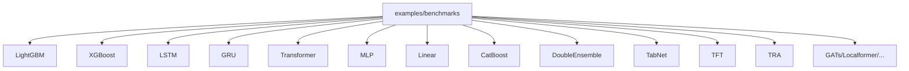
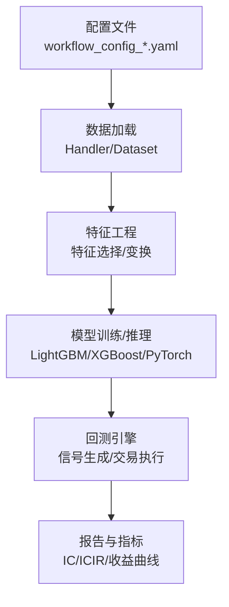
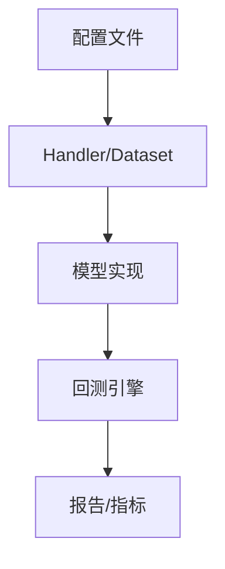

# 基准实验

<cite>
**本文引用的文件**
- [examples/benchmarks/README.md](file://examples/benchmarks/README.md)
- [examples/benchmarks/LightGBM/README.md](file://examples/benchmarks/LightGBM/README.md)
- [examples/benchmarks/XGBoost/README.md](file://examples/benchmarks/XGBoost/README.md)
- [examples/benchmarks/LSTM/README.md](file://examples/benchmarks/LSTM/README.md)
- [examples/benchmarks/GRU/README.md](file://examples/benchmarks/GRU/README.md)
- [examples/benchmarks/Transformer/README.md](file://examples/benchmarks/Transformer/README.md)
- [examples/benchmarks/Linear/requirements.txt](file://examples/benchmarks/Linear/requirements.txt)
- [examples/benchmarks/MLP/README.md](file://examples/benchmarks/MLP/README.md)
- [examples/benchmarks/MLP/workflow_config_mlp_Alpha158.yaml](file://examples/benchmarks/MLP/workflow_config_mlp_Alpha158.yaml)
- [examples/benchmarks/MLP/workflow_config_mlp_Alpha360.yaml](file://examples/benchmarks/MLP/workflow_config_mlp_Alpha360.yaml)
- [examples/benchmarks/MLP/workflow_config_mlp_Alpha158_csi500.yaml](file://examples/benchmarks/MLP/workflow_config_mlp_Alpha158_csi500.yaml)
- [examples/benchmarks/MLP/workflow_config_mlp_Alpha360_csi500.yaml](file://examples/benchmarks/MLP/workflow_config_mlp_Alpha360_csi500.yaml)
- [examples/benchmarks/Linear/workflow_config_linear_Alpha158.yaml](file://examples/benchmarks/Linear/workflow_config_linear_Alpha158.yaml)
- [examples/benchmarks/Linear/workflow_config_linear_Alpha158_csi500.yaml](file://examples/benchmarks/Linear/workflow_config_linear_Alpha158_csi500.yaml)
- [examples/benchmarks/Linear/workflow_config_linear_Alpha158_multi_pass_bt.yaml](file://examples/benchmarks/Linear/workflow_config_linear_Alpha158_multi_pass_bt.yaml)
- [examples/benchmarks/LightGBM/workflow_config_lightgbm_Alpha158.yaml](file://examples/benchmarks/LightGBM/workflow_config_lightgbm_Alpha158.yaml)
- [examples/benchmarks/LightGBM/workflow_config_lightgbm_Alpha360.yaml](file://examples/benchmarks/LightGBM/workflow_config_lightgbm_Alpha360.yaml)
- [examples/benchmarks/LightGBM/workflow_config_lightgbm_Alpha158_csi500.yaml](file://examples/benchmarks/LightGBM/workflow_config_lightgbm_Alpha158_csi500.yaml)
- [examples/benchmarks/LightGBM/workflow_config_lightgbm_Alpha360_csi500.yaml](file://examples/benchmarks/LightGBM/workflow_config_lightgbm_Alpha360_csi500.yaml)
- [examples/benchmarks/LightGBM/workflow_config_lightgbm_multi_freq.yaml](file://examples/benchmarks/LightGBM/workflow_config_lightgbm_multi_freq.yaml)
- [examples/benchmarks/LightGBM/workflow_config_lightgbm_Alpha158_multi_freq.yaml](file://examples/benchmarks/LightGBM/workflow_config_lightgbm_Alpha158_multi_freq.yaml)
- [examples/benchmarks/LightGBM/workflow_config_lightgbm_configurable_dataset.yaml](file://examples/benchmarks/LightGBM/workflow_config_lightgbm_configurable_dataset.yaml)
- [examples/benchmarks/XGBoost/workflow_config_xgboost_Alpha158.yaml](file://examples/benchmarks/XGBoost/workflow_config_xgboost_Alpha158.yaml)
- [examples/benchmarks/XGBoost/workflow_config_xgboost_Alpha360.yaml](file://examples/benchmarks/XGBoost/workflow_config_xgboost_Alpha360.yaml)
- [examples/benchmarks/LSTM/workflow_config_lstm_Alpha158.yaml](file://examples/benchmarks/LSTM/workflow_config_lstm_Alpha158.yaml)
- [examples/benchmarks/LSTM/workflow_config_lstm_Alpha360.yaml](file://examples/benchmarks/LSTM/workflow_config_lstm_Alpha360.yaml)
- [examples/benchmarks/GRU/workflow_config_gru_Alpha158.yaml](file://examples/benchmarks/GRU/workflow_config_gru_Alpha158.yaml)
- [examples/benchmarks/GRU/workflow_config_gru_Alpha360.yaml](file://examples/benchmarks/GRU/workflow_config_gru_Alpha360.yaml)
- [examples/benchmarks/Transformer/workflow_config_transformer_Alpha158.yaml](file://examples/benchmarks/Transformer/workflow_config_transformer_Alpha158.yaml)
- [examples/benchmarks/Transformer/workflow_config_transformer_Alpha360.yaml](file://examples/benchmarks/Transformer/workflow_config_transformer_Alpha360.yaml)
- [examples/benchmarks/ALSTM/workflow_config_alstm_Alpha158.yaml](file://examples/benchmarks/ALSTM/workflow_config_alstm_Alpha158.yaml)
- [examples/benchmarks/ALSTM/workflow_config_alstm_Alpha360.yaml](file://examples/benchmarks/ALSTM/workflow_config_alstm_Alpha360.yaml)
- [examples/benchmarks/GeneralPtNN/workflow_config_gru.yaml](file://examples/benchmarks/GeneralPtNN/workflow_config_gru.yaml)
- [examples/benchmarks/GeneralPtNN/workflow_config_gru2mlp.yaml](file://examples/benchmarks/GeneralPtNN/workflow_config_gru2mlp.yaml)
- [examples/benchmarks/GeneralPtNN/workflow_config_mlp.yaml](file://examples/benchmarks/GeneralPtNN/workflow_config_mlp.yaml)
- [examples/benchmarks/TFT/tft.py](file://examples/benchmarks/TFT/tft.py)
- [examples/benchmarks/TFT/expt_settings/configs.py](file://examples/benchmarks/TFT/expt_settings/configs.py)
- [examples/benchmarks/TFT/data_formatters/base.py](file://examples/benchmarks/TFT/data_formatters/base.py)
- [examples/benchmarks/TFT/libs/hyperparam_opt.py](file://examples/benchmarks/TFT/libs/hyperparam_opt.py)
- [examples/benchmarks/TFT/libs/tft_model.py](file://examples/benchmarks/TFT/libs/tft_model.py)
- [examples/benchmarks/TFT/libs/utils.py](file://examples/benchmarks/TFT/libs/utils.py)
- [examples/benchmarks/TRA/configs/config_transformer.yaml](file://examples/benchmarks/TRA/configs/config_transformer.yaml)
- [examples/benchmarks/TRA/configs/config_transformer_tra.yaml](file://examples/benchmarks/TRA/configs/config_transformer_tra.yaml)
- [examples/benchmarks/TRA/configs/config_transformer_tra_init.yaml](file://examples/benchmarks/TRA/configs/config_transformer_tra_init.yaml)
- [examples/benchmarks/TRA/configs/config_alstm.yaml](file://examples/benchmarks/TRA/configs/config_alstm.yaml)
- [examples/benchmarks/TRA/configs/config_alstm_tra.yaml](file://examples/benchmarks/TRA/configs/config_alstm_tra.yaml)
- [examples/benchmarks/TRA/configs/config_alstm_tra_init.yaml](file://examples/benchmarks/TRA/configs/config_alstm_tra_init.yaml)
- [examples/benchmarks/TRA/src/dataset.py](file://examples/benchmarks/TRA/src/dataset.py)
- [examples/benchmarks/TRA/src/model.py](file://examples/benchmarks/TRA/src/model.py)
- [examples/benchmarks/TRA/example.py](file://examples/benchmarks/TRA/example.py)
- [examples/benchmarks/TRA/workflow_config_tra_Alpha158.yaml](file://examples/benchmarks/TRA/workflow_config_tra_Alpha158.yaml)
- [examples/benchmarks/TRA/workflow_config_tra_Alpha158_full.yaml](file://examples/benchmarks/TRA/workflow_config_tra_Alpha158_full.yaml)
- [examples/benchmarks/TRA/workflow_config_tra_Alpha360.yaml](file://examples/benchmarks/TRA/workflow_config_tra_Alpha360.yaml)
- [examples/benchmarks/TabNet/workflow_config_TabNet_Alpha158.yaml](file://examples/benchmarks/TabNet/workflow_config_TabNet_Alpha158.yaml)
- [examples/benchmarks/TabNet/workflow_config_TabNet_Alpha360.yaml](file://examples/benchmarks/TabNet/workflow_config_TabNet_Alpha360.yaml)
- [examples/benchmarks/CatBoost/workflow_config_catboost_Alpha158.yaml](file://examples/benchmarks/CatBoost/workflow_config_catboost_Alpha158.yaml)
- [examples/benchmarks/CatBoost/workflow_config_catboost_Alpha360.yaml](file://examples/benchmarks/CatBoost/workflow_config_catboost_Alpha360.yaml)
- [examples/benchmarks/CatBoost/workflow_config_catboost_Alpha158_csi500.yaml](file://examples/benchmarks/CatBoost/workflow_config_catboost_Alpha158_csi500.yaml)
- [examples/benchmarks/CatBoost/workflow_config_catboost_Alpha360_csi500.yaml](file://examples/benchmarks/CatBoost/workflow_config_catboost_Alpha360_csi500.yaml)
- [examples/benchmarks/DoubleEnsemble/workflow_config_doubleensemble_Alpha158.yaml](file://examples/benchmarks/DoubleEnsemble/workflow_config_doubleensemble_Alpha158.yaml)
- [examples/benchmarks/DoubleEnsemble/workflow_config_doubleensemble_Alpha360.yaml](file://examples/benchmarks/DoubleEnsemble/workflow_config_doubleensemble_Alpha360.yaml)
- [examples/benchmarks/DoubleEnsemble/workflow_config_doubleensemble_Alpha158_csi500.yaml](file://examples/benchmarks/DoubleEnsemble/workflow_config_doubleensemble_Alpha158_csi500.yaml)
- [examples/benchmarks/DoubleEnsemble/workflow_config_doubleensemble_Alpha360_csi500.yaml](file://examples/benchmarks/DoubleEnsemble/workflow_config_doubleensemble_Alpha360_csi500.yaml)
- [examples/benchmarks/DoubleEnsemble/workflow_config_doubleensemble_early_stop_Alpha158.yaml](file://examples/benchmarks/DoubleEnsemble/workflow_config_doubleensemble_early_stop_Alpha158.yaml)
- [examples/benchmarks/HIST/workflow_config_hist_Alpha360.yaml](file://examples/benchmarks/HIST/workflow_config_hist_Alpha360.yaml)
- [examples/benchmarks/IGMTF/workflow_config_igmtf_Alpha360.yaml](file://examples/benchmarks/IGMTF/workflow_config_igmtf_Alpha360.yaml)
- [examples/benchmarks/KRNN/workflow_config_krnn_Alpha360.yaml](file://examples/benchmarks/KRNN/workflow_config_krnn_Alpha360.yaml)
- [examples/benchmarks/SFM/workflow_config_sfm_Alpha360.yaml](file://examples/benchmarks/SFM/workflow_config_sfm_Alpha360.yaml)
- [examples/benchmarks/Sandwich/workflow_config_sandwich_Alpha360.yaml](file://examples/benchmarks/Sandwich/workflow_config_sandwich_Alpha360.yaml)
- [examples/benchmarks/TCN/workflow_config_tcn_Alpha158.yaml](file://examples/benchmarks/TCN/workflow_config_tcn_Alpha158.yaml)
- [examples/benchmarks/TCN/workflow_config_tcn_Alpha360.yaml](file://examples/benchmarks/TCN/workflow_config_tcn_Alpha360.yaml)
- [examples/benchmarks/TCTS/workflow_config_tcts_Alpha360.yaml](file://examples/benchmarks/TCTS/workflow_config_tcts_Alpha360.yaml)
- [examples/benchmarks/Localformer/workflow_config_localformer_Alpha158.yaml](file://examples/benchmarks/Localformer/workflow_config_localformer_Alpha158.yaml)
- [examples/benchmarks/Localformer/workflow_config_localformer_Alpha360.yaml](file://examples/benchmarks/Localformer/workflow_config_localformer_Alpha360.yaml)
- [examples/benchmarks/GATs/workflow_config_gats_Alpha158.yaml](file://examples/benchmarks/GATs/workflow_config_gats_Alpha158.yaml)
- [examples/benchmarks/GATs/workflow_config_gats_Alpha360.yaml](file://examples/benchmarks/GATs/workflow_config_gats_Alpha360.yaml)
- [examples/benchmarks/ADARNN/workflow_config_adarnn_Alpha360.yaml](file://examples/benchmarks/ADARNN/workflow_config_adarnn_Alpha360.yaml)
- [examples/benchmarks/ADD/workflow_config_add_Alpha360.yaml](file://examples/benchmarks/ADD/workflow_config_add_Alpha360.yaml)
- [examples/benchmarks/TRA/workflow_config_tra_Alpha158.yaml](file://examples/benchmarks/TRA/workflow_config_tra_Alpha158.yaml)
- [examples/benchmarks/TRA/workflow_config_tra_Alpha158_full.yaml](file://examples/benchmarks/TRA/workflow_config_tra_Alpha158_full.yaml)
- [examples/benchmarks/TRA/workflow_config_tra_Alpha360.yaml](file://examples/benchmarks/TRA/workflow_config_tra_Alpha360.yaml)
- [examples/benchmarks/TRA/README.md](file://examples/benchmarks/TRA/README.md)
- [examples/benchmarks/TFT/README.md](file://examples/benchmarks/TFT/README.md)
- [examples/benchmarks/GeneralPtNN/README.md](file://examples/benchmarks/GeneralPtNN/README.md)
- [examples/benchmarks/Localformer/README.md](file://examples/benchmarks/Localformer/README.md)
- [examples/benchmarks/GATs/README.md](file://examples/benchmarks/GATs/README.md)
- [examples/benchmarks/HIST/README.md](file://examples/benchmarks/HIST/README.md)
- [examples/benchmarks/IGMTF/README.md](file://examples/benchmarks/IGMTF/README.md)
- [examples/benchmarks/KRNN/README.md](file://examples/benchmarks/KRNN/README.md)
- [examples/benchmarks/SFM/README.md](file://examples/benchmarks/SFM/README.md)
- [examples/benchmarks/Sandwich/README.md](file://examples/benchmarks/Sandwich/README.md)
- [examples/benchmarks/TCN/README.md](file://examples/benchmarks/TCN/README.md)
- [examples/benchmarks/TCTS/README.md](file://examples/benchmarks/TCTS/README.md)
- [examples/benchmarks/TabNet/README.md](file://examples/benchmarks/TabNet/README.md)
- [examples/benchmarks/CatBoost/README.md](file://examples/benchmarks/CatBoost/README.md)
- [examples/benchmarks/DoubleEnsemble/README.md](file://examples/benchmarks/DoubleEnsemble/README.md)
- [examples/benchmarks/ADARNN/README.md](file://examples/benchmarks/ADARNN/README.md)
- [examples/benchmarks/ADD/README.md](file://examples/benchmarks/ADD/README.md)
- [examples/benchmarks/GeneralPtNN/workflow_config_gru.yaml](file://examples/benchmarks/GeneralPtNN/workflow_config_gru.yaml)
- [examples/benchmarks/GeneralPtNN/workflow_config_gru2mlp.yaml](file://examples/benchmarks/GeneralPtNN/workflow_config_gru2mlp.yaml)
- [examples/benchmarks/GeneralPtNN/workflow_config_mlp.yaml](file://examples/benchmarks/GeneralPtNN/workflow_config_mlp.yaml)
- [examples/benchmarks/GeneralPtNN/README.md](file://examples/benchmarks/GeneralPtNN/README.md)
- [examples/benchmarks/Linear/requirements.txt](file://examples/benchmarks/Linear/requirements.txt)
- [examples/benchmarks/MLP/README.md](file://examples/benchmarks/MLP/README.md)
- [examples/benchmarks/MLP/workflow_config_mlp_Alpha158.yaml](file://examples/benchmarks/MLP/workflow_config_mlp_Alpha158.yaml)
- [examples/benchmarks/MLP/workflow_config_mlp_Alpha360.yaml](file://examples/benchmarks/MLP/workflow_config_mlp_Alpha360.yaml)
- [examples/benchmarks/MLP/workflow_config_mlp_Alpha158_csi500.yaml](file://examples/benchmarks/MLP/workflow_config_mlp_Alpha158_csi500.yaml)
- [examples/benchmarks/MLP/workflow_config_mlp_Alpha360_csi500.yaml](file://examples/benchmarks/MLP/workflow_config_mlp_Alpha360_csi500.yaml)
- [examples/benchmarks/Linear/workflow_config_linear_Alpha158.yaml](file://examples/benchmarks/Linear/workflow_config_linear_Alpha158.yaml)
- [examples/benchmarks/Linear/workflow_config_linear_Alpha158_csi500.yaml](file://examples/benchmarks/Linear/workflow_config_linear_Alpha158_csi500.yaml)
- [examples/benchmarks/Linear/workflow_config_linear_Alpha158_multi_pass_bt.yaml](file://examples/benchmarks/Linear/workflow_config_linear_Alpha158_multi_pass_bt.yaml)
- [examples/benchmarks/LightGBM/workflow_config_lightgbm_Alpha158.yaml](file://examples/benchmarks/LightGBM/workflow_config_lightgbm_Alpha158.yaml)
- [examples/benchmarks/LightGBM/workflow_config_lightgbm_Alpha360.yaml](file://examples/benchmarks/LightGBM/workflow_config_lightgbm_Alpha360.yaml)
- [examples/benchmarks/LightGBM/workflow_config_lightgbm_Alpha158_csi500.yaml](file://examples/benchmarks/LightGBM/workflow_config_lightgbm_Alpha158_csi500.yaml)
- [examples/benchmarks/LightGBM/workflow_config_lightgbm_Alpha360_csi500.yaml](file://examples/benchmarks/LightGBM/workflow_config_lightgbm_Alpha360_csi500.yaml)
- [examples/benchmarks/LightGBM/workflow_config_lightgbm_multi_freq.yaml](file://examples/benchmarks/LightGBM/workflow_config_lightgbm_multi_freq.yaml)
- [examples/benchmarks/LightGBM/workflow_config_lightgbm_Alpha158_multi_freq.yaml](file://examples/benchmarks/LightGBM/workflow_config_lightgbm_Alpha158_multi_freq.yaml)
- [examples/benchmarks/LightGBM/workflow_config_lightgbm_configurable_dataset.yaml](file://examples/benchmarks/LightGBM/workflow_config_lightgbm_configurable_dataset.yaml)
- [examples/benchmarks/XGBoost/workflow_config_xgboost_Alpha158.yaml](file://examples/benchmarks/XGBoost/workflow_config_xgboost_Alpha158.yaml)
- [examples/benchmarks/XGBoost/workflow_config_xgboost_Alpha360.yaml](file://examples/benchmarks/XGBoost/workflow_config_xgboost_Alpha360.yaml)
- [examples/benchmarks/LSTM/workflow_config_lstm_Alpha158.yaml](file://examples/benchmarks/LSTM/workflow_config_lstm_Alpha158.yaml)
- [examples/benchmarks/LSTM/workflow_config_lstm_Alpha360.yaml](file://examples/benchmarks/LSTM/workflow_config_lstm_Alpha360.yaml)
- [examples/benchmarks/GRU/workflow_config_gru_Alpha158.yaml](file://examples/benchmarks/GRU/workflow_config_gru_Alpha158.yaml)
- [examples/benchmarks/GRU/workflow_config_gru_Alpha360.yaml](file://examples/benchmarks/GRU/workflow_config_gru_Alpha360.yaml)
- [examples/benchmarks/Transformer/workflow_config_transformer_Alpha158.yaml](file://examples/benchmarks/Transformer/workflow_config_transformer_Alpha158.yaml)
- [examples/benchmarks/Transformer/workflow_config_transformer_Alpha360.yaml](file://examples/benchmarks/Transformer/workflow_config_transformer_Alpha360.yaml)
- [examples/benchmarks/ALSTM/workflow_config_alstm_Alpha158.yaml](file://examples/benchmarks/ALSTM/workflow_config_alstm_Alpha158.yaml)
- [examples/benchmarks/ALSTM/workflow_config_alstm_Alpha360.yaml](file://examples/benchmarks/ALSTM/workflow_config_alstm_Alpha360.yaml)
- [examples/benchmarks/GeneralPtNN/workflow_config_gru.yaml](file://examples/benchmarks/GeneralPtNN/workflow_config_gru.yaml)
- [examples/benchmarks/GeneralPtNN/workflow_config_gru2mlp.yaml](file://examples/benchmarks/GeneralPtNN/workflow_config_gru2mlp.yaml)
- [examples/benchmarks/GeneralPtNN/workflow_config_mlp.yaml](file://examples/benchmarks/GeneralPtNN/workflow_config_mlp.yaml)
- [examples/benchmarks/TFT/tft.py](file://examples/benchmarks/TFT/tft.py)
- [examples/benchmarks/TFT/expt_settings/configs.py](file://examples/benchmarks/TFT/expt_settings/configs.py)
- [examples/benchmarks/TFT/data_formatters/base.py](file://examples/benchmarks/TFT/data_formatters/base.py)
- [examples/benchmarks/TFT/libs/hyperparam_opt.py](file://examples/benchmarks/TFT/libs/hyperparam_opt.py)
- [examples/benchmarks/TFT/libs/tft_model.py](file://examples/benchmarks/TFT/libs/tft_model.py)
- [examples/benchmarks/TFT/libs/utils.py](file://examples/benchmarks/TFT/libs/utils.py)
- [examples/benchmarks/TRA/configs/config_transformer.yaml](file://examples/benchmarks/TRA/configs/config_transformer.yaml)
- [examples/benchmarks/TRA/configs/config_transformer_tra.yaml](file://examples/benchmarks/TRA/configs/config_transformer_tra.yaml)
- [examples/benchmarks/TRA/configs/config_transformer_tra_init.yaml](file://examples/benchmarks/TRA/configs/config_transformer_tra_init.yaml)
- [examples/benchmarks/TRA/configs/config_alstm.yaml](file://examples/benchmarks/TRA/configs/config_alstm.yaml)
- [examples/benchmarks/TRA/configs/config_alstm_tra.yaml](file://examples/benchmarks/TRA/configs/config_alstm_tra.yaml)
- [examples/benchmarks/TRA/configs/config_alstm_tra_init.yaml](file://examples/benchmarks/TRA/configs/config_alstm_tra_init.yaml)
- [examples/benchmarks/TRA/src/dataset.py](file://examples/benchmarks/TRA/src/dataset.py)
- [examples/benchmarks/TRA/src/model.py](file://examples/benchmarks/TRA/src/model.py)
- [examples/benchmarks/TRA/example.py](file://examples/benchmarks/TRA/example.py)
- [examples/benchmarks/TRA/workflow_config_tra_Alpha158.yaml](file://examples/benchmarks/TRA/workflow_config_tra_Alpha158.yaml)
- [examples/benchmarks/TRA/workflow_config_tra_Alpha158_full.yaml](file://examples/benchmarks/TRA/workflow_config_tra_Alpha158_full.yaml)
- [examples/benchmarks/TRA/workflow_config_tra_Alpha360.yaml](file://examples/benchmarks/TRA/workflow_config_tra_Alpha360.yaml)
- [examples/benchmarks/TabNet/workflow_config_TabNet_Alpha158.yaml](file://examples/benchmarks/TabNet/workflow_config_TabNet_Alpha158.yaml)
- [examples/benchmarks/TabNet/workflow_config_TabNet_Alpha360.yaml](file://examples/benchmarks/TabNet/workflow_config_TabNet_Alpha360.yaml)
- [examples/benchmarks/CatBoost/workflow_config_catboost_Alpha158.yaml](file://examples/benchmarks/CatBoost/workflow_config_catboost_Alpha158.yaml)
- [examples/benchmarks/CatBoost/workflow_config_catboost_Alpha360.yaml](file://examples/benchmarks/CatBoost/workflow_config_catboost_Alpha360.yaml)
- [examples/benchmarks/CatBoost/workflow_config_catboost_Alpha158_csi500.yaml](file://examples/benchmarks/CatBoost/workflow_config_catboost_Alpha158_csi500.yaml)
- [examples/benchmarks/CatBoost/workflow_config_catboost_Alpha360_csi500.yaml](file://examples/benchmarks/CatBoost/workflow_config_catboost_Alpha360_csi500.yaml)
- [examples/benchmarks/DoubleEnsemble/workflow_config_doubleensemble_Alpha158.yaml](file://examples/benchmarks/DoubleEnsemble/workflow_config_doubleensemble_Alpha158.yaml)
- [examples/benchmarks/DoubleEnsemble/workflow_config_doubleensemble_Alpha360.yaml](file://examples/benchmarks/DoubleEnsemble/workflow_config_doubleensemble_Alpha360.yaml)
- [examples/benchmarks/DoubleEnsemble/workflow_config_doubleensemble_Alpha158_csi500.yaml](file://examples/benchmarks/DoubleEnsemble/workflow_config_doubleensemble_Alpha158_csi500.yaml)
- [examples/benchmarks/DoubleEnsemble/workflow_config_doubleensemble_Alpha360_csi500.yaml](file://examples/benchmarks/DoubleEnsemble/workflow_config_doubleensemble_Alpha360_csi500.yaml)
- [examples/benchmarks/DoubleEnsemble/workflow_config_doubleensemble_early_stop_Alpha158.yaml](file://examples/benchmarks/DoubleEnsemble/workflow_config_doubleensemble_early_stop_Alpha158.yaml)
- [examples/benchmarks/HIST/workflow_config_hist_Alpha360.yaml](file://examples/benchmarks/HIST/workflow_config_hist_Alpha360.yaml)
- [examples/benchmarks/IGMTF/workflow_config_igmtf_Alpha360.yaml](file://examples/benchmarks/IGMTF/workflow_config_igmtf_Alpha360.yaml)
- [examples/benchmarks/KRNN/workflow_config_krnn_Alpha360.yaml](file://examples/benchmarks/KRNN/workflow_config_krnn_Alpha360.yaml)
- [examples/benchmarks/SFM/workflow_config_sfm_Alpha360.yaml](file://examples/benchmarks/SFM/workflow_config_sfm_Alpha360.yaml)
- [examples/benchmarks/Sandwich/workflow_config_sandwich_Alpha360.yaml](file://examples/benchmarks/Sandwich/workflow_config_sandwich_Alpha360.yaml)
- [examples/benchmarks/TCN/workflow_config_tcn_Alpha158.yaml](file://examples/benchmarks/TCN/workflow_config_tcn_Alpha158.yaml)
- [examples/benchmarks/TCN/workflow_config_tcn_Alpha360.yaml](file://examples/benchmarks/TCN/workflow_config_tcn_Alpha360.yaml)
- [examples/benchmarks/TCTS/workflow_config_tcts_Alpha360.yaml](file://examples/benchmarks/TCTS/workflow_config_tcts_Alpha360.yaml)
- [examples/benchmarks/Localformer/workflow_config_localformer_Alpha158.yaml](file://examples/benchmarks/Localformer/workflow_config_localformer_Alpha158.yaml)
- [examples/benchmarks/Localformer/workflow_config_localformer_Alpha360.yaml](file://examples/benchmarks/Localformer/workflow_config_localformer_Alpha360.yaml)
- [examples/benchmarks/GATs/workflow_config_gats_Alpha158.yaml](file://examples/benchmarks/GATs/workflow_config_gats_Alpha158.yaml)
- [examples/benchmarks/GATs/workflow_config_gats_Alpha360.yaml](file://examples/benchmarks/GATs/workflow_config_gats_Alpha360.yaml)
- [examples/benchmarks/ADARNN/workflow_config_adarnn_Alpha360.yaml](file://examples/benchmarks/ADARNN/workflow_config_adarnn_Alpha360.yaml)
- [examples/benchmarks/ADD/workflow_config_add_Alpha360.yaml](file://examples/benchmarks/ADD/workflow_config_add_Alpha360.yaml)
- [examples/benchmarks/TRA/workflow_config_tra_Alpha158.yaml](file://examples/benchmarks/TRA/workflow_config_tra_Alpha158.yaml)
- [examples/benchmarks/TRA/workflow_config_tra_Alpha158_full.yaml](file://examples/benchmarks/TRA/workflow_config_tra_Alpha158_full.yaml)
- [examples/benchmarks/TRA/workflow_config_tra_Alpha360.yaml](file://examples/benchmarks/TRA/workflow_config_tra_Alpha360.yaml)
- [examples/benchmarks/TRA/README.md](file://examples/benchmarks/TRA/README.md)
- [examples/benchmarks/TFT/README.md](file://examples/benchmarks/TFT/README.md)
- [examples/benchmarks/GeneralPtNN/README.md](file://examples/benchmarks/GeneralPtNN/README.md)
- [examples/benchmarks/Localformer/README.md](file://examples/benchmarks/Localformer/README.md)
- [examples/benchmarks/GATs/README.md](file://examples/benchmarks/GATs/README.md)
- [examples/benchmarks/HIST/README.md](file://examples/benchmarks/HIST/README.md)
- [examples/benchmarks/IGMTF/README.md](file://examples/benchmarks/IGMTF/README.md)
- [examples/benchmarks/KRNN/README.md](file://examples/benchmarks/KRNN/README.md)
- [examples/benchmarks/SFM/README.md](file://examples/benchmarks/SFM/README.md)
- [examples/benchmarks/Sandwich/README.md](file://examples/benchmarks/Sandwich/README.md)
- [examples/benchmarks/TCN/README.md](file://examples/benchmarks/TCN/README.md)
- [examples/benchmarks/TCTS/README.md](file://examples/benchmarks/TCTS/README.md)
- [examples/benchmarks/TabNet/README.md](file://examples/benchmarks/TabNet/README.md)
- [examples/benchmarks/CatBoost/README.md](file://examples/benchmarks/CatBoost/README.md)
- [examples/benchmarks/DoubleEnsemble/README.md](file://examples/benchmarks/DoubleEnsemble/README.md)
- [examples/benchmarks/ADARNN/README.md](file://examples/benchmarks/ADARNN/README.md)
- [examples/benchmarks/ADD/README.md](file://examples/benchmarks/ADD/README.md)
</cite>

## 目录
1. [引言](#引言)
2. [项目结构](#项目结构)
3. [核心组件](#核心组件)
4. [架构总览](#架构总览)
5. [详细组件分析](#详细组件分析)
6. [依赖分析](#依赖分析)
7. [性能考虑](#性能考虑)
8. [故障排查指南](#故障排查指南)
9. [结论](#结论)
10. [附录](#附录)

## 引言
本文件系统性梳理 Qlib 基准实验，覆盖机器学习与深度学习模型在 Alpha 因子预测任务上的基准测试，包括 LightGBM、XGBoost、LSTM、GRU、Transformer 等。内容涵盖：配置文件结构、数据集选择、评估指标、性能对比、超参数调优流程与最佳实践、统计分析与可视化建议、以及结果解读方法。目标是帮助读者快速理解并复现各模型的基准实验，形成可比的性能报告。

## 项目结构
基准实验主要位于 examples/benchmarks 目录下，按模型分目录组织，每个模型目录包含：
- README.md：模型简介与运行说明
- requirements.txt：依赖安装说明（如需要）
- workflow_config_*.yaml：工作流配置文件，定义数据、特征、模型、训练与回测流程
- 其他脚本或源码：如特征工程、多频率处理、TFT/TRA 等复杂模型的实现

图示来源
- [examples/benchmarks/README.md](file://examples/benchmarks/README.md)

章节来源
- [examples/benchmarks/README.md](file://examples/benchmarks/README.md)

## 核心组件
- 配置文件（workflow_config_*.yaml）：定义数据源、特征工程、模型参数、训练策略、回测设置与评估指标。不同 Alpha（如 Alpha158、Alpha360）与市场（如 CSI500）组合对应不同配置文件。
- 数据与特征：通过 handler/dataset/loader 等模块加载因子与价格序列，进行标准化、缺失值处理、标签构造等。
- 模型实现：基于 Qlib 的模型抽象，支持 LightGBM/XGBoost 等 GBDT 与 PyTorch 实现的 LSTM/GRU/Transformer 等。
- 评估与报告：提供 IC、ICIR、Rank IC 等指标，支持收益曲线、最大回撤、胜率等统计分析。
- 超参数搜索：部分模型提供网格/贝叶斯搜索脚本，支持自动调参。

章节来源
- [examples/benchmarks/LightGBM/workflow_config_lightgbm_Alpha158.yaml](file://examples/benchmarks/LightGBM/workflow_config_lightgbm_Alpha158.yaml)
- [examples/benchmarks/MLP/workflow_config_mlp_Alpha158.yaml](file://examples/benchmarks/MLP/workflow_config_mlp_Alpha158.yaml)
- [examples/benchmarks/Linear/workflow_config_linear_Alpha158.yaml](file://examples/benchmarks/Linear/workflow_config_linear_Alpha158.yaml)

## 架构总览
基准实验采用“配置驱动”的流水线式架构：配置文件描述数据、特征、模型、训练与回测；运行器根据配置执行数据加载、模型训练、预测与回测，最终生成报告与指标。

图示来源
- [examples/benchmarks/LightGBM/workflow_config_lightgbm_Alpha158.yaml](file://examples/benchmarks/LightGBM/workflow_config_lightgbm_Alpha158.yaml)
- [examples/benchmarks/MLP/workflow_config_mlp_Alpha158.yaml](file://examples/benchmarks/MLP/workflow_config_mlp_Alpha158.yaml)
- [examples/benchmarks/Linear/workflow_config_linear_Alpha158.yaml](file://examples/benchmarks/Linear/workflow_config_linear_Alpha158.yaml)

## 详细组件分析

### LightGBM 基准
- 配置文件结构要点
  - 数据集：指定 Alpha 名称（如 Alpha158/Alpha360）、市场范围（如 CSI500）、时间窗口与样本权重
  - 特征：特征集合、是否进行重采样/采样（参考 features_resample_N.py、features_sample.py）
  - 模型：LightGBM 参数（学习率、树数、深度、叶子节点等）
  - 训练：训练/验证集划分、早停、评估指标（如二分类/回归损失）
  - 回测：信号阈值、滑点、手续费、最大仓位等
- 数据集选择
  - 支持 Alpha158/Alpha360 与 CSI500 组合，以及多频率配置（multi_freq）
- 评估指标
  - IC、ICIR、Rank IC、年化收益、最大回撤、胜率等
- 性能对比
  - 不同 Alpha 与市场下的指标横向对比；不同参数设置的纵向对比
- 超参数调优
  - 可结合配置文件中的参数空间，使用网格/贝叶斯搜索；注意固定随机种子以保证可复现
- 可视化建议
  - 收益曲线、IC 时间序列、换手率分布、最大回撤分解

章节来源
- [examples/benchmarks/LightGBM/README.md](file://examples/benchmarks/LightGBM/README.md)
- [examples/benchmarks/LightGBM/workflow_config_lightgbm_Alpha158.yaml](file://examples/benchmarks/LightGBM/workflow_config_lightgbm_Alpha158.yaml)
- [examples/benchmarks/LightGBM/workflow_config_lightgbm_Alpha360.yaml](file://examples/benchmarks/LightGBM/workflow_config_lightgbm_Alpha360.yaml)
- [examples/benchmarks/LightGBM/workflow_config_lightgbm_Alpha158_csi500.yaml](file://examples/benchmarks/LightGBM/workflow_config_lightgbm_Alpha158_csi500.yaml)
- [examples/benchmarks/LightGBM/workflow_config_lightgbm_Alpha360_csi500.yaml](file://examples/benchmarks/LightGBM/workflow_config_lightgbm_Alpha360_csi500.yaml)
- [examples/benchmarks/LightGBM/workflow_config_lightgbm_multi_freq.yaml](file://examples/benchmarks/LightGBM/workflow_config_lightgbm_multi_freq.yaml)
- [examples/benchmarks/LightGBM/workflow_config_lightgbm_Alpha158_multi_freq.yaml](file://examples/benchmarks/LightGBM/workflow_config_lightgbm_Alpha158_multi_freq.yaml)
- [examples/benchmarks/LightGBM/workflow_config_lightgbm_configurable_dataset.yaml](file://examples/benchmarks/LightGBM/workflow_config_lightgbm_configurable_dataset.yaml)

### XGBoost 基准
- 配置文件结构要点
  - 数据集：Alpha 选择、市场范围
  - 特征：特征集合
  - 模型：XGBoost 参数（树深、学习率、正则化系数等）
  - 训练：早停、评估指标
  - 回测：交易成本与风控
- 数据集选择
  - Alpha158/Alpha360 与不同市场范围
- 评估指标与对比
  - 同 LightGBM，横向对比不同 Alpha/市场/参数
- 调优流程
  - 参数空间建议：学习率、树数量、最大深度、子采样、列采样

章节来源
- [examples/benchmarks/XGBoost/README.md](file://examples/benchmarks/XGBoost/README.md)
- [examples/benchmarks/XGBoost/workflow_config_xgboost_Alpha158.yaml](file://examples/benchmarks/XGBoost/workflow_config_xgboost_Alpha158.yaml)
- [examples/benchmarks/XGBoost/workflow_config_xgboost_Alpha360.yaml](file://examples/benchmarks/XGBoost/workflow_config_xgboost_Alpha360.yaml)

### LSTM 基准
- 配置文件结构要点
  - 数据集：时间序列窗口长度、步长、特征维度
  - 模型：LSTM 层数、隐藏单元数、dropout、激活函数
  - 训练：优化器、学习率调度、损失函数、早停
  - 回测：信号后处理（如阈值化）、交易成本
- 数据集选择
  - Alpha158/Alpha360 与不同市场范围
- 评估与对比
  - 与传统模型（如 LightGBM/XGBoost）对比，关注序列建模优势
- 调优流程
  - 窗口长度、层数、隐藏单元、dropout、学习率优先

章节来源
- [examples/benchmarks/LSTM/README.md](file://examples/benchmarks/LSTM/README.md)
- [examples/benchmarks/LSTM/workflow_config_lstm_Alpha158.yaml](file://examples/benchmarks/LSTM/workflow_config_lstm_Alpha158.yaml)
- [examples/benchmarks/LSTM/workflow_config_lstm_Alpha360.yaml](file://examples/benchmarks/LSTM/workflow_config_lstm_Alpha360.yaml)

### GRU 基准
- 结构与 LSTM 类似，侧重更轻量的门控机制
- 关注长序列场景下的收敛速度与稳定性

章节来源
- [examples/benchmarks/GRU/README.md](file://examples/benchmarks/GRU/README.md)
- [examples/benchmarks/GRU/workflow_config_gru_Alpha158.yaml](file://examples/benchmarks/GRU/workflow_config_gru_Alpha158.yaml)
- [examples/benchmarks/GRU/workflow_config_gru_Alpha360.yaml](file://examples/benchmarks/GRU/workflow_config_gru_Alpha360.yaml)

### Transformer 基准
- 配置文件结构要点
  - 数据集：序列长度、特征维度、时间/空间编码
  - 模型：层数、头数、前馈维度、dropout、归一化策略
  - 训练：学习率预热、warmup、梯度裁剪
  - 回测：信号生成与交易执行
- 数据集选择
  - Alpha158/Alpha360 与不同市场范围
- 评估与对比
  - 与 RNN 类模型对比，关注长程依赖建模能力

章节来源
- [examples/benchmarks/Transformer/README.md](file://examples/benchmarks/Transformer/README.md)
- [examples/benchmarks/Transformer/workflow_config_transformer_Alpha158.yaml](file://examples/benchmarks/Transformer/workflow_config_transformer_Alpha158.yaml)
- [examples/benchmarks/Transformer/workflow_config_transformer_Alpha360.yaml](file://examples/benchmarks/Transformer/workflow_config_transformer_Alpha360.yaml)

### MLP 与 Linear 基准
- MLP
  - 多层感知机，适合非时序特征；关注层数、宽度、激活与正则
- Linear
  - 线性模型，强调可解释性与基线价值
- 配置文件示例
  - Alpha158/Alpha360 与 CSI500 组合
  - 多遍回测（multi_pass_bt）用于稳定性评估

章节来源
- [examples/benchmarks/MLP/README.md](file://examples/benchmarks/MLP/README.md)
- [examples/benchmarks/MLP/workflow_config_mlp_Alpha158.yaml](file://examples/benchmarks/MLP/workflow_config_mlp_Alpha158.yaml)
- [examples/benchmarks/MLP/workflow_config_mlp_Alpha360.yaml](file://examples/benchmarks/MLP/workflow_config_mlp_Alpha360.yaml)
- [examples/benchmarks/MLP/workflow_config_mlp_Alpha158_csi500.yaml](file://examples/benchmarks/MLP/workflow_config_mlp_Alpha158_csi500.yaml)
- [examples/benchmarks/MLP/workflow_config_mlp_Alpha360_csi500.yaml](file://examples/benchmarks/MLP/workflow_config_mlp_Alpha360_csi500.yaml)
- [examples/benchmarks/Linear/workflow_config_linear_Alpha158.yaml](file://examples/benchmarks/Linear/workflow_config_linear_Alpha158.yaml)
- [examples/benchmarks/Linear/workflow_config_linear_Alpha158_csi500.yaml](file://examples/benchmarks/Linear/workflow_config_linear_Alpha158_csi500.yaml)
- [examples/benchmarks/Linear/workflow_config_linear_Alpha158_multi_pass_bt.yaml](file://examples/benchmarks/Linear/workflow_config_linear_Alpha158_multi_pass_bt.yaml)

### CatBoost 基准
- 配置文件结构要点
  - 数据集：Alpha 与市场范围
  - 特征：类别特征处理、哈希技巧
  - 模型：迭代次数、学习率、深度、损失函数
  - 回测：交易成本与风控
- 数据集选择
  - Alpha158/Alpha360 与 CSI500 组合

章节来源
- [examples/benchmarks/CatBoost/README.md](file://examples/benchmarks/CatBoost/README.md)
- [examples/benchmarks/CatBoost/workflow_config_catboost_Alpha158.yaml](file://examples/benchmarks/CatBoost/workflow_config_catboost_Alpha158.yaml)
- [examples/benchmarks/CatBoost/workflow_config_catboost_Alpha360.yaml](file://examples/benchmarks/CatBoost/workflow_config_catboost_Alpha360.yaml)
- [examples/benchmarks/CatBoost/workflow_config_catboost_Alpha158_csi500.yaml](file://examples/benchmarks/CatBoost/workflow_config_catboost_Alpha158_csi500.yaml)
- [examples/benchmarks/CatBoost/workflow_config_catboost_Alpha360_csi500.yaml](file://examples/benchmarks/CatBoost/workflow_config_catboost_Alpha360_csi500.yaml)

### DoubleEnsemble 基准
- 配置文件结构要点
  - 数据集：Alpha 与市场范围
  - 模型：集成策略、早期停止
  - 回测：交易成本与风控
- 数据集选择
  - Alpha158/Alpha360 与 CSI500 组合，含早期停止配置

章节来源
- [examples/benchmarks/DoubleEnsemble/README.md](file://examples/benchmarks/DoubleEnsemble/README.md)
- [examples/benchmarks/DoubleEnsemble/workflow_config_doubleensemble_Alpha158.yaml](file://examples/benchmarks/DoubleEnsemble/workflow_config_doubleensemble_Alpha158.yaml)
- [examples/benchmarks/DoubleEnsemble/workflow_config_doubleensemble_Alpha360.yaml](file://examples/benchmarks/DoubleEnsemble/workflow_config_doubleensemble_Alpha360.yaml)
- [examples/benchmarks/DoubleEnsemble/workflow_config_doubleensemble_Alpha158_csi500.yaml](file://examples/benchmarks/DoubleEnsemble/workflow_config_doubleensemble_Alpha158_csi500.yaml)
- [examples/benchmarks/DoubleEnsemble/workflow_config_doubleensemble_Alpha360_csi500.yaml](file://examples/benchmarks/DoubleEnsemble/workflow_config_doubleensemble_Alpha360_csi500.yaml)
- [examples/benchmarks/DoubleEnsemble/workflow_config_doubleensemble_early_stop_Alpha158.yaml](file://examples/benchmarks/DoubleEnsemble/workflow_config_doubleensemble_early_stop_Alpha158.yaml)

### 其他模型（选摘）
- TabNet：注意力引导的可解释神经网络，适合高维稀疏特征
- ALSTM：自适应长短期记忆，结合注意力机制
- GeneralPtNN：通用的 PyTorch 神经网络族（GRU/MLP），便于统一对比
- TFT：Temporally-Factored Tensor Forecasting，复杂时序建模
- TRA：Transformer/ALSTM 的扩展版本，提供多种配置模板
- GATs/Localformer/HIST/IGMTF/KRNN/SFM/Sandwich/TCN/TCTS：图神经、局部注意力、历史记忆、多头时序、知识蒸馏、夹层网络、卷积时序等变体

章节来源
- [examples/benchmarks/TabNet/workflow_config_TabNet_Alpha158.yaml](file://examples/benchmarks/TabNet/workflow_config_TabNet_Alpha158.yaml)
- [examples/benchmarks/TabNet/workflow_config_TabNet_Alpha360.yaml](file://examples/benchmarks/TabNet/workflow_config_TabNet_Alpha360.yaml)
- [examples/benchmarks/ALSTM/workflow_config_alstm_Alpha158.yaml](file://examples/benchmarks/ALSTM/workflow_config_alstm_Alpha158.yaml)
- [examples/benchmarks/ALSTM/workflow_config_alstm_Alpha360.yaml](file://examples/benchmarks/ALSTM/workflow_config_alstm_Alpha360.yaml)
- [examples/benchmarks/GeneralPtNN/workflow_config_gru.yaml](file://examples/benchmarks/GeneralPtNN/workflow_config_gru.yaml)
- [examples/benchmarks/GeneralPtNN/workflow_config_gru2mlp.yaml](file://examples/benchmarks/GeneralPtNN/workflow_config_gru2mlp.yaml)
- [examples/benchmarks/GeneralPtNN/workflow_config_mlp.yaml](file://examples/benchmarks/GeneralPtNN/workflow_config_mlp.yaml)
- [examples/benchmarks/TFT/tft.py](file://examples/benchmarks/TFT/tft.py)
- [examples/benchmarks/TFT/expt_settings/configs.py](file://examples/benchmarks/TFT/expt_settings/configs.py)
- [examples/benchmarks/TFT/data_formatters/base.py](file://examples/benchmarks/TFT/data_formatters/base.py)
- [examples/benchmarks/TFT/libs/hyperparam_opt.py](file://examples/benchmarks/TFT/libs/hyperparam_opt.py)
- [examples/benchmarks/TFT/libs/tft_model.py](file://examples/benchmarks/TFT/libs/tft_model.py)
- [examples/benchmarks/TFT/libs/utils.py](file://examples/benchmarks/TFT/libs/utils.py)
- [examples/benchmarks/TRA/configs/config_transformer.yaml](file://examples/benchmarks/TRA/configs/config_transformer.yaml)
- [examples/benchmarks/TRA/configs/config_transformer_tra.yaml](file://examples/benchmarks/TRA/configs/config_transformer_tra.yaml)
- [examples/benchmarks/TRA/configs/config_transformer_tra_init.yaml](file://examples/benchmarks/TRA/configs/config_transformer_tra_init.yaml)
- [examples/benchmarks/TRA/configs/config_alstm.yaml](file://examples/benchmarks/TRA/configs/config_alstm.yaml)
- [examples/benchmarks/TRA/configs/config_alstm_tra.yaml](file://examples/benchmarks/TRA/configs/config_alstm_tra.yaml)
- [examples/benchmarks/TRA/configs/config_alstm_tra_init.yaml](file://examples/benchmarks/TRA/configs/config_alstm_tra_init.yaml)
- [examples/benchmarks/TRA/src/dataset.py](file://examples/benchmarks/TRA/src/dataset.py)
- [examples/benchmarks/TRA/src/model.py](file://examples/benchmarks/TRA/src/model.py)
- [examples/benchmarks/TRA/example.py](file://examples/benchmarks/TRA/example.py)
- [examples/benchmarks/TRA/workflow_config_tra_Alpha158.yaml](file://examples/benchmarks/TRA/workflow_config_tra_Alpha158.yaml)
- [examples/benchmarks/TRA/workflow_config_tra_Alpha158_full.yaml](file://examples/benchmarks/TRA/workflow_config_tra_Alpha158_full.yaml)
- [examples/benchmarks/TRA/workflow_config_tra_Alpha360.yaml](file://examples/benchmarks/TRA/workflow_config_tra_Alpha360.yaml)
- [examples/benchmarks/GATs/workflow_config_gats_Alpha158.yaml](file://examples/benchmarks/GATs/workflow_config_gats_Alpha158.yaml)
- [examples/benchmarks/GATs/workflow_config_gats_Alpha360.yaml](file://examples/benchmarks/GATs/workflow_config_gats_Alpha360.yaml)
- [examples/benchmarks/Localformer/workflow_config_localformer_Alpha158.yaml](file://examples/benchmarks/Localformer/workflow_config_localformer_Alpha158.yaml)
- [examples/benchmarks/Localformer/workflow_config_localformer_Alpha360.yaml](file://examples/benchmarks/Localformer/workflow_config_localformer_Alpha360.yaml)
- [examples/benchmarks/HIST/workflow_config_hist_Alpha360.yaml](file://examples/benchmarks/HIST/workflow_config_hist_Alpha360.yaml)
- [examples/benchmarks/IGMTF/workflow_config_igmtf_Alpha360.yaml](file://examples/benchmarks/IGMTF/workflow_config_igmtf_Alpha360.yaml)
- [examples/benchmarks/KRNN/workflow_config_krnn_Alpha360.yaml](file://examples/benchmarks/KRNN/workflow_config_krnn_Alpha360.yaml)
- [examples/benchmarks/SFM/workflow_config_sfm_Alpha360.yaml](file://examples/benchmarks/SFM/workflow_config_sfm_Alpha360.yaml)
- [examples/benchmarks/Sandwich/workflow_config_sandwich_Alpha360.yaml](file://examples/benchmarks/Sandwich/workflow_config_sandwich_Alpha360.yaml)
- [examples/benchmarks/TCN/workflow_config_tcn_Alpha158.yaml](file://examples/benchmarks/TCN/workflow_config_tcn_Alpha158.yaml)
- [examples/benchmarks/TCN/workflow_config_tcn_Alpha360.yaml](file://examples/benchmarks/TCN/workflow_config_tcn_Alpha360.yaml)
- [examples/benchmarks/TCTS/workflow_config_tcts_Alpha360.yaml](file://examples/benchmarks/TCTS/workflow_config_tcts_Alpha360.yaml)

## 依赖分析
- 模块耦合
  - 配置文件驱动数据/模型/回测解耦，便于横向对比
  - 深度学习模型共享统一的 Handler/Dataset 接口
- 外部依赖
  - LightGBM/XGBoost/CatBoost 等第三方库
  - PyTorch/TensorFlow（深度学习模型）
  - 可选：TFT/TRA 等复杂模型的专用依赖

图示来源
- [examples/benchmarks/LightGBM/workflow_config_lightgbm_Alpha158.yaml](file://examples/benchmarks/LightGBM/workflow_config_lightgbm_Alpha158.yaml)
- [examples/benchmarks/MLP/workflow_config_mlp_Alpha158.yaml](file://examples/benchmarks/MLP/workflow_config_mlp_Alpha158.yaml)
- [examples/benchmarks/Linear/workflow_config_linear_Alpha158.yaml](file://examples/benchmarks/Linear/workflow_config_linear_Alpha158.yaml)

## 性能考虑
- 数据层面
  - 特征稳定性与冗余度控制，避免过拟合
  - 多频率数据需注意对齐与噪声放大
- 模型层面
  - 深度学习模型需合理设置序列长度与批次大小，注意内存占用
  - 正则化（dropout、权重衰减、梯度裁剪）与早停策略
- 训练层面
  - 固定随机种子，确保可复现
  - 学习率调度与 warmup 对 Transformer/LSTM 等模型尤为关键
- 回测层面
  - 交易成本（滑点、手续费）对小模型影响更大
  - 最大回撤与 ICIR 更适合作为稳健性指标

## 故障排查指南
- 配置文件路径与键名错误
  - 确认 workflow_config_* 文件路径正确，键名大小写与缩进一致
- 数据加载失败
  - 检查因子名称与市场范围是否匹配，确认数据缓存可用
- 模型训练不收敛
  - 调整学习率、增加正则、检查标签分布与特征尺度
- 回测异常
  - 核对信号阈值、滑点与手续费设置，检查交易执行逻辑
- 超参数搜索不稳定
  - 固定随机种子，扩大搜索空间，增加重复次数

## 结论
Qlib 基准实验提供了统一的配置与流程框架，便于在相同数据与回测条件下比较不同模型的性能。建议以 Alpha158/Alpha360 与 CSI500 作为标准组合，固定随机种子与交易成本，重点关注 IC/ICIR、收益曲线与最大回撤等指标，并结合可视化进行深入分析。

## 附录
- 评估指标说明（示例）
  - IC：信息系数，衡量预测与未来收益的线性相关性
  - ICIR：IC 的稳定性指标（IC 均值/IC 标准误）
  - Rank IC：秩相关，对异常值更鲁棒
  - 年化收益、最大回撤、胜率、夏普比率
- 可视化建议（示例）
  - 收益曲线与滚动 IC
  - 换手率与持仓集中度
  - 分市场/分阶段的绩效分解