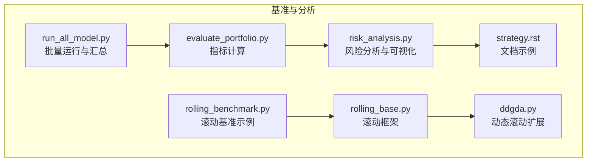
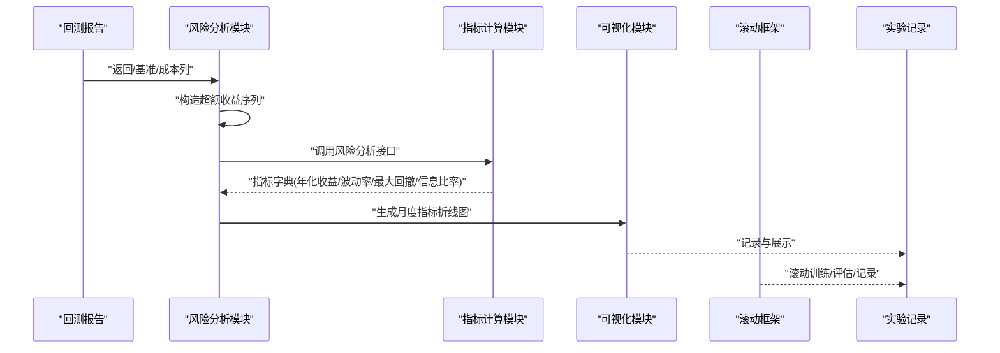
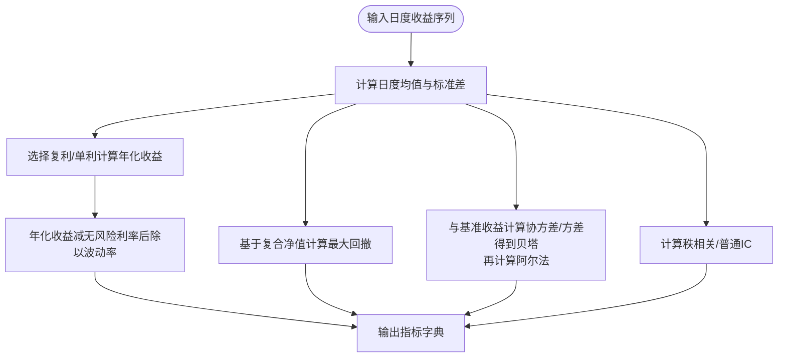
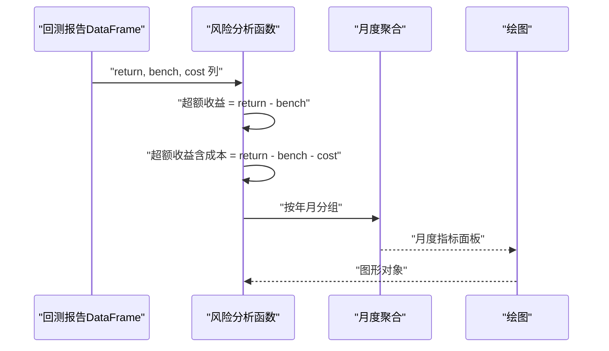
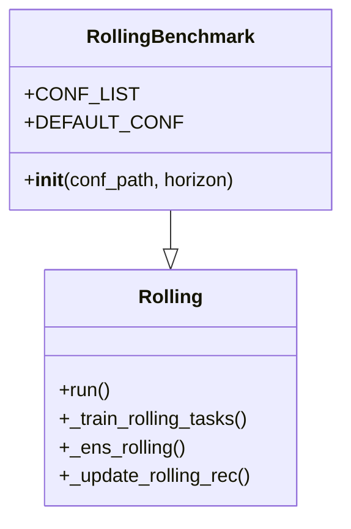
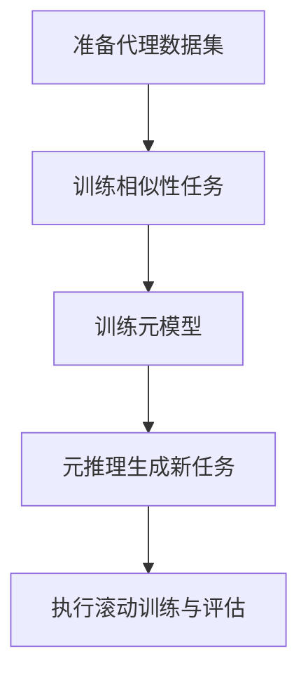
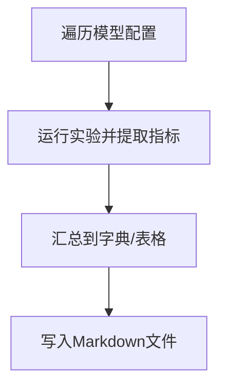
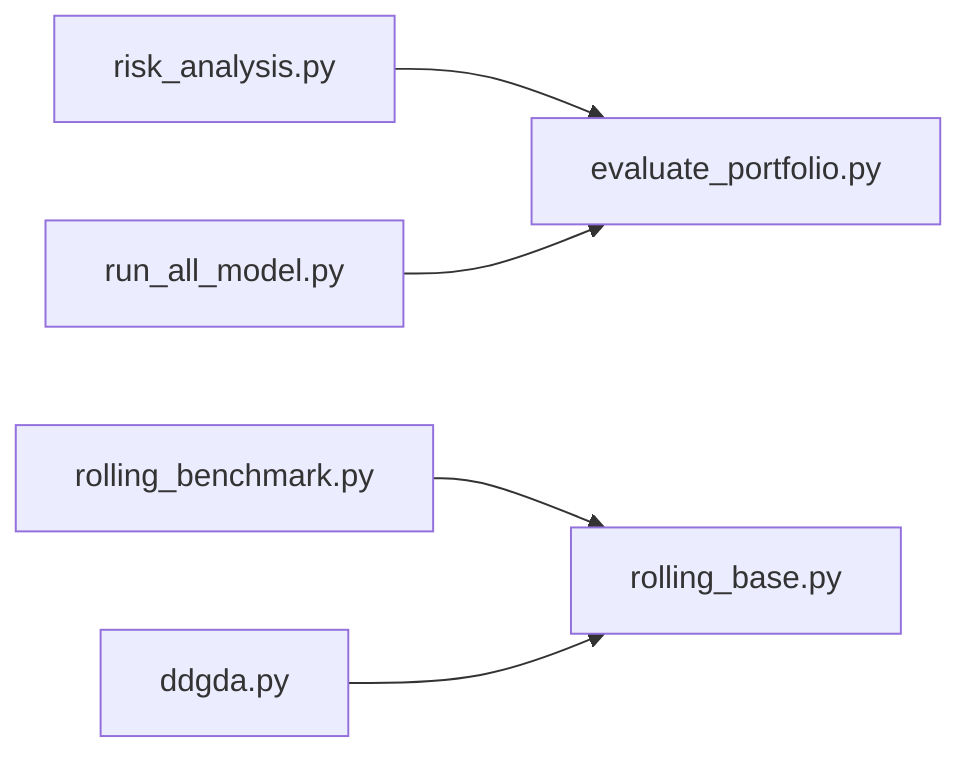

# 基准结果分析

<cite>
**本文引用的文件**
- [evaluate_portfolio.py](file://qlib/contrib/evaluate_portfolio.py)
- [risk_analysis.py](file://qlib/contrib/report/analysis_position/risk_analysis.py)
- [rolling_benchmark.py](file://examples/benchmarks_dynamic/baseline/rolling_benchmark.py)
- [rolling_base.py](file://qlib/contrib/rolling/base.py)
- [ddgda.py](file://qlib/contrib/rolling/ddgda.py)
- [run_all_model.py](file://examples/run_all_model.py)
- [strategy.rst](file://docs/component/strategy.rst)
</cite>

## 目录
1. [引言](#引言)
2. [项目结构](#项目结构)
3. [核心组件](#核心组件)
4. [架构总览](#架构总览)
5. [详细组件分析](#详细组件分析)
6. [依赖关系分析](#依赖关系分析)
7. [性能考量](#性能考量)
8. [故障排查指南](#故障排查指南)
9. [结论](#结论)
10. [附录](#附录)

## 引言
本指南面向使用 QLib 进行量化研究与实验的读者，系统讲解如何对各类基准实验结果开展统计分析与性能对比，涵盖关键指标（年化收益、夏普比率、最大回撤、信息比率、日度收益序列等）的计算与解读；提供同一数据集下不同模型横向对比的方法与可视化技术；给出动态基准实验的设计思路与实现要点；并总结结果分析的最佳实践与报告撰写建议。

## 项目结构
围绕“基准实验结果分析”的主题，本仓库中与之直接相关的模块主要分布在以下位置：
- 财务与风险指标计算：qlib/contrib/evaluate_portfolio.py
- 风险分析与可视化：qlib/contrib/report/analysis_position/risk_analysis.py
- 动态滚动基准示例：examples/benchmarks_dynamic/baseline/rolling_benchmark.py 及其基类实现
- 滚动实验通用框架：qlib/contrib/rolling/base.py
- 典型动态滚动扩展：qlib/contrib/rolling/ddgda.py
- 批量运行与汇总表格生成：examples/run_all_model.py
- 文档示例与指标输出格式参考：docs/component/strategy.rst

图表来源
- [evaluate_portfolio.py:143-227](file://qlib/contrib/evaluate_portfolio.py#L143-L227)
- [risk_analysis.py:15-41](file://qlib/contrib/report/analysis_position/risk_analysis.py#L15-L41)
- [rolling_benchmark.py:16-31](file://examples/benchmarks_dynamic/baseline/rolling_benchmark.py#L16-L31)
- [rolling_base.py:253-260](file://qlib/contrib/rolling/base.py#L253-L260)
- [ddgda.py:70-127](file://qlib/contrib/rolling/ddgda.py#L70-L127)
- [run_all_model.py:160-185](file://examples/run_all_model.py#L160-L185)
- [strategy.rst:253-282](file://docs/component/strategy.rst#L253-L282)

章节来源
- [evaluate_portfolio.py:143-227](file://qlib/contrib/evaluate_portfolio.py#L143-L227)
- [risk_analysis.py:15-41](file://qlib/contrib/report/analysis_position/risk_analysis.py#L15-L41)
- [rolling_benchmark.py:16-31](file://examples/benchmarks_dynamic/baseline/rolling_benchmark.py#L16-L31)
- [rolling_base.py:253-260](file://qlib/contrib/rolling/base.py#L253-L260)
- [ddgda.py:70-127](file://qlib/contrib/rolling/ddgda.py#L70-L127)
- [run_all_model.py:160-185](file://examples/run_all_model.py#L160-L185)
- [strategy.rst:253-282](file://docs/component/strategy.rst#L253-L282)

## 核心组件
- 指标计算模块（evaluate_portfolio.py）
  - 提供从日度收益序列到年化收益、夏普比率、最大回撤、波动率、贝塔、阿尔法、秩相关 IC、普通 IC 等指标的计算函数，支持复利/单利两种年化方式与无风险利率设定。
- 风险分析与可视化（risk_analysis.py）
  - 将回测报告中的收益、基准、成本等列组合为超额收益序列，调用风险分析接口生成标准指标表，并提供按月聚合与折线图展示。
- 动态滚动基准（examples/benchmarks_dynamic/baseline/rolling_benchmark.py）
  - 继承通用滚动框架，封装多个工作流配置，实现“滚动式”多模型对比实验。
- 滚动框架（contrib/rolling/base.py）
  - 定义滚动实验的训练、合并与评估流程，统一记录器与产物保存。
- 动态滚动扩展（contrib/rolling/ddgda.py）
  - 在滚动基础上引入元学习/相似性任务等机制，形成更复杂的动态基准实验。
- 批量运行与汇总（examples/run_all_model.py）
  - 收集各模型指标，生成 Markdown 表格，便于横向对比。

章节来源
- [evaluate_portfolio.py:143-227](file://qlib/contrib/evaluate_portfolio.py#L143-L227)
- [risk_analysis.py:15-41](file://qlib/contrib/report/analysis_position/risk_analysis.py#L15-L41)
- [rolling_benchmark.py:16-31](file://examples/benchmarks_dynamic/baseline/rolling_benchmark.py#L16-L31)
- [rolling_base.py:253-260](file://qlib/contrib/rolling/base.py#L253-L260)
- [ddgda.py:70-127](file://qlib/contrib/rolling/ddgda.py#L70-L127)
- [run_all_model.py:160-185](file://examples/run_all_model.py#L160-L185)

## 架构总览
下图展示了从回测报告到指标计算、可视化与动态滚动的端到端流程。

图表来源
- [risk_analysis.py:28-41](file://qlib/contrib/report/analysis_position/risk_analysis.py#L28-L41)
- [evaluate_portfolio.py:143-227](file://qlib/contrib/evaluate_portfolio.py#L143-L227)
- [rolling_base.py:253-260](file://qlib/contrib/rolling/base.py#L253-L260)

## 详细组件分析

### 指标计算与解读（evaluate_portfolio.py）
- 年化收益
  - 支持复利与单利两种方式，基于日度收益均值推导年化收益，便于跨模型比较。
- 夏普比率
  - 使用年化收益减去无风险利率后除以年化波动率与 sqrt(250)，反映单位风险的超额收益。
- 最大回撤
  - 基于日度收益的累积复合净值计算最大回撤，衡量策略在样本期内的最大相对损失。
- 波动率、贝塔、阿尔法
  - 波动率为日度收益的标准差；贝塔通过与基准收益的协方差/基准方差估计；阿尔法结合无风险利率与贝塔计算。
- IC 系列
  - 提供秩相关 IC 与普通 IC，用于评估特征预测能力与排序稳定性。

图表来源
- [evaluate_portfolio.py:143-227](file://qlib/contrib/evaluate_portfolio.py#L143-L227)

章节来源
- [evaluate_portfolio.py:143-227](file://qlib/contrib/evaluate_portfolio.py#L143-L227)

### 风险分析与可视化（risk_analysis.py）
- 数据准备
  - 从回测报告中提取“收益-基准-成本”构成超额收益序列，分别计算不含成本与含成本的超额收益指标。
- 月度聚合
  - 按年月分组，过滤交易日不足的月份，生成月度指标面板，便于观察趋势。
- 可视化
  - 输出柱状图与折线图，展示年化收益、最大回撤、信息比率、波动率等指标的月度变化。

图表来源
- [risk_analysis.py:28-41](file://qlib/contrib/report/analysis_position/risk_analysis.py#L28-L41)
- [risk_analysis.py:57-92](file://qlib/contrib/report/analysis_position/risk_analysis.py#L57-L92)
- [risk_analysis.py:129-159](file://qlib/contrib/report/analysis_position/risk_analysis.py#L129-L159)

章节来源
- [risk_analysis.py:28-41](file://qlib/contrib/report/analysis_position/risk_analysis.py#L28-L41)
- [risk_analysis.py:57-92](file://qlib/contrib/report/analysis_position/risk_analysis.py#L57-L92)
- [risk_analysis.py:129-159](file://qlib/contrib/report/analysis_position/risk_analysis.py#L129-L159)

### 动态滚动基准实验（examples/benchmarks_dynamic/baseline/rolling_benchmark.py）
- 设计思路
  - 将多个模型的工作流配置纳入滚动实验，自动执行训练、合并与评估流程，实现“滚动式”多模型横向对比。
- 关键点
  - 通过继承通用滚动基类，重用统一的记录与产物管理；支持切换不同配置文件以快速对比不同模型。
- 适用场景
  - 在固定数据集上持续评估多个模型的稳定性与鲁棒性，观察其在时间维度上的表现变化。

图表来源
- [rolling_benchmark.py:16-31](file://examples/benchmarks_dynamic/baseline/rolling_benchmark.py#L16-L31)
- [rolling_base.py:253-260](file://qlib/contrib/rolling/base.py#L253-L260)

章节来源
- [rolling_benchmark.py:16-31](file://examples/benchmarks_dynamic/baseline/rolling_benchmark.py#L16-L31)
- [rolling_base.py:253-260](file://qlib/contrib/rolling/base.py#L253-L260)

### 动态滚动扩展（contrib/rolling/ddgda.py）
- 特色机制
  - 引入元学习与相似性任务，先在代理模型上抽取内部数据，再训练元模型，最后将元知识迁移到最终预测任务，形成“知识迁移”的动态滚动。
- 流程要点
  - 生成代理数据集 → 训练相似性任务 → 训练元模型 → 推理生成新任务列表 → 执行滚动训练与评估。
- 优势
  - 在长序列或非平稳市场中提升滚动实验的适应性与泛化能力。

图表来源
- [ddgda.py:179-229](file://qlib/contrib/rolling/ddgda.py#L179-L229)
- [ddgda.py:248-320](file://qlib/contrib/rolling/ddgda.py#L248-L320)
- [ddgda.py:325-371](file://qlib/contrib/rolling/ddgda.py#L325-L371)

章节来源
- [ddgda.py:179-229](file://qlib/contrib/rolling/ddgda.py#L179-L229)
- [ddgda.py:248-320](file://qlib/contrib/rolling/ddgda.py#L248-L320)
- [ddgda.py:325-371](file://qlib/contrib/rolling/ddgda.py#L325-L371)

### 批量运行与横向对比（examples/run_all_model.py）
- 功能概述
  - 自动收集各模型的关键指标（如 IC、ICIR、Rank IC、Rank ICIR、年化收益、信息比率、最大回撤等），生成 Markdown 表格，便于横向对比与报告撰写。
- 使用建议
  - 在统一的数据集与时间段内运行多个模型，确保可比性；注意控制超参数与特征工程一致性。

图表来源
- [run_all_model.py:160-185](file://examples/run_all_model.py#L160-L185)

章节来源
- [run_all_model.py:160-185](file://examples/run_all_model.py#L160-L185)

### 文档示例与指标输出格式（docs/component/strategy.rst）
- 示例说明
  - 展示了基准收益与超额收益（含/不含成本）的风险分析输出格式，包含均值、标准差、年化收益、信息比率与最大回撤等字段。
- 实践意义
  - 作为指标解读与报告呈现的参考模板，确保不同实验的输出风格一致。

章节来源
- [strategy.rst:253-282](file://docs/component/strategy.rst#L253-L282)

## 依赖关系分析
- 指标计算依赖于回测报告中的收益、基准与成本列；风险分析模块进一步将这些列组合为超额收益序列并调用风险分析接口。
- 滚动基准示例依赖通用滚动框架，后者负责训练、合并与评估流程的统一管理。
- 动态滚动扩展在滚动框架之上增加元学习与相似性任务，形成更复杂的实验管线。
- 批量运行脚本依赖各模型的实验产物，统一提取关键指标并生成对比表格。

图表来源
- [risk_analysis.py:15-41](file://qlib/contrib/report/analysis_position/risk_analysis.py#L15-L41)
- [evaluate_portfolio.py:143-227](file://qlib/contrib/evaluate_portfolio.py#L143-L227)
- [rolling_benchmark.py:16-31](file://examples/benchmarks_dynamic/baseline/rolling_benchmark.py#L16-L31)
- [rolling_base.py:253-260](file://qlib/contrib/rolling/base.py#L253-L260)
- [ddgda.py:70-127](file://qlib/contrib/rolling/ddgda.py#L70-L127)
- [run_all_model.py:160-185](file://examples/run_all_model.py#L160-L185)

章节来源
- [risk_analysis.py:15-41](file://qlib/contrib/report/analysis_position/risk_analysis.py#L15-L41)
- [evaluate_portfolio.py:143-227](file://qlib/contrib/evaluate_portfolio.py#L143-L227)
- [rolling_benchmark.py:16-31](file://examples/benchmarks_dynamic/baseline/rolling_benchmark.py#L16-L31)
- [rolling_base.py:253-260](file://qlib/contrib/rolling/base.py#L253-L260)
- [ddgda.py:70-127](file://qlib/contrib/rolling/ddgda.py#L70-L127)
- [run_all_model.py:160-185](file://examples/run_all_model.py#L160-L185)

## 性能考量
- 计算复杂度
  - 日度指标计算（如波动率、IC）通常为 O(n) 或 O(n log n)（秩相关），在长序列上需关注内存与时间开销。
- 数据质量
  - 回撤与信息比率对极端值敏感，应确保收益序列的连续性与成本项的准确性。
- 可视化效率
  - 月度聚合可显著降低折线图渲染压力；建议按需筛选指标与时间窗口。
- 滚动实验
  - 合理设置滚动步长与历史窗口，避免过拟合与信息泄漏；在动态滚动中注意元模型训练与最终任务测试的时间对齐。

## 故障排查指南
- 指标为空或异常
  - 检查回测报告是否包含“return/bench/cost”列；确认日期索引连续且无缺失。
- 最大回撤为 NaN
  - 检查日度收益序列是否存在全零或全负导致的归一化问题；必要时对收益序列进行平滑处理。
- 夏普比率不稳定
  - 调整无风险利率假设与年化方式（复利/单利）；检查波动率分母自由度设置。
- 滚动实验未生成预期结果
  - 确认记录器路径与实验名正确；检查合并与评估阶段是否成功生成记录；核对配置文件路径与参数。
- 动态滚动报错
  - 检查代理数据集与元模型训练段的时间边界；确保相似性任务与元模型的输入格式一致。

章节来源
- [evaluate_portfolio.py:178-192](file://qlib/contrib/evaluate_portfolio.py#L178-L192)
- [rolling_base.py:253-260](file://qlib/contrib/rolling/base.py#L253-L260)
- [ddgda.py:248-320](file://qlib/contrib/rolling/ddgda.py#L248-L320)

## 结论
通过对日度收益序列的标准化指标计算与可视化，结合滚动与动态滚动实验设计，可在同一数据集上高效完成多模型的横向对比与长期稳定性评估。建议在实验设计中统一数据预处理、特征工程与评估周期，确保指标可比性；在报告中突出关键指标的趋势与差异，并辅以可视化图表增强可读性。

## 附录
- 报告撰写建议
  - 明确实验背景与数据范围；列出关键指标定义与计算方法；对比不同模型在同一时间段内的表现；解释最大回撤与波动率的经济含义；附上可视化图表与结论摘要。
- 常用指标速查
  - 年化收益：衡量长期回报水平
  - 夏普比率：单位风险的超额收益
  - 最大回撤：最大相对损失
  - 信息比率：超额收益的稳定性
  - 波动率：收益离散程度
  - 贝塔/阿尔法：系统性风险与择时能力