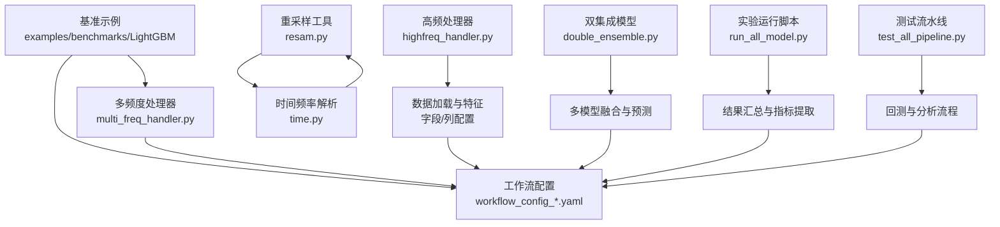
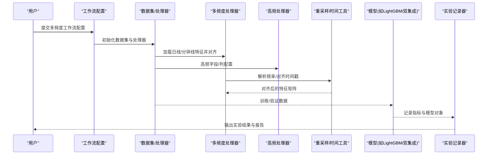
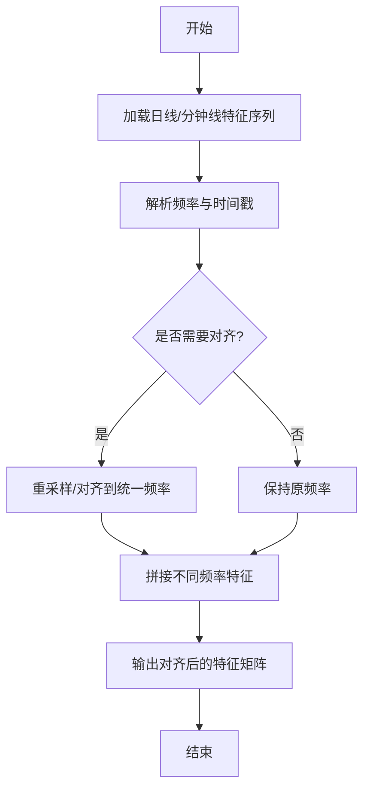
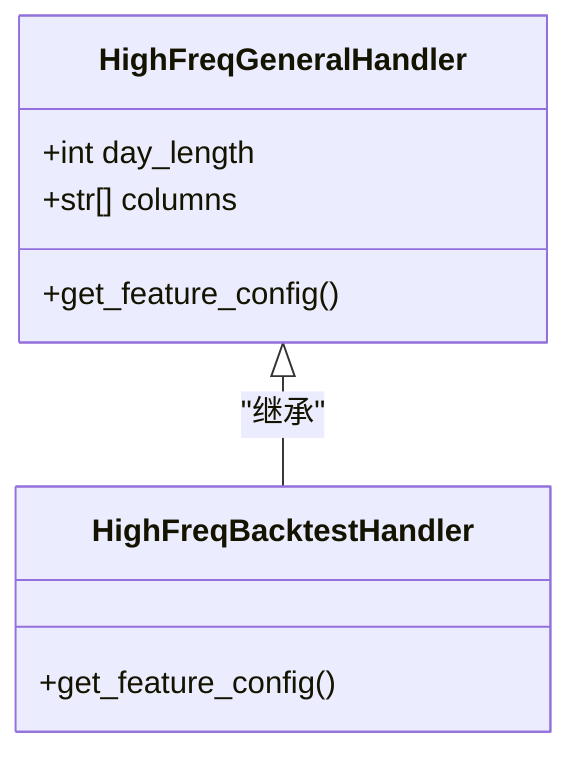
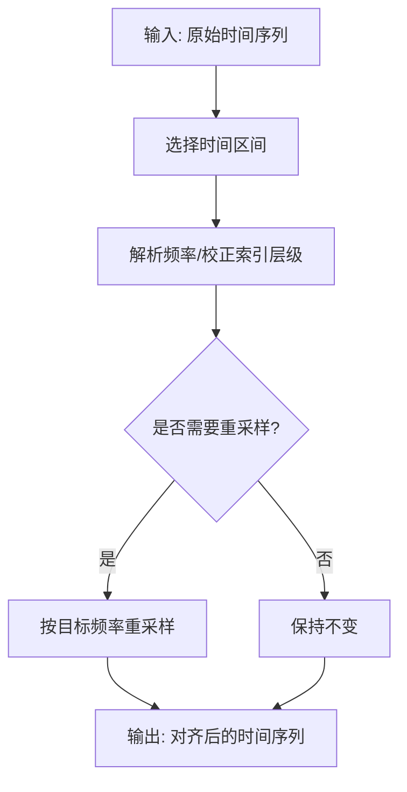
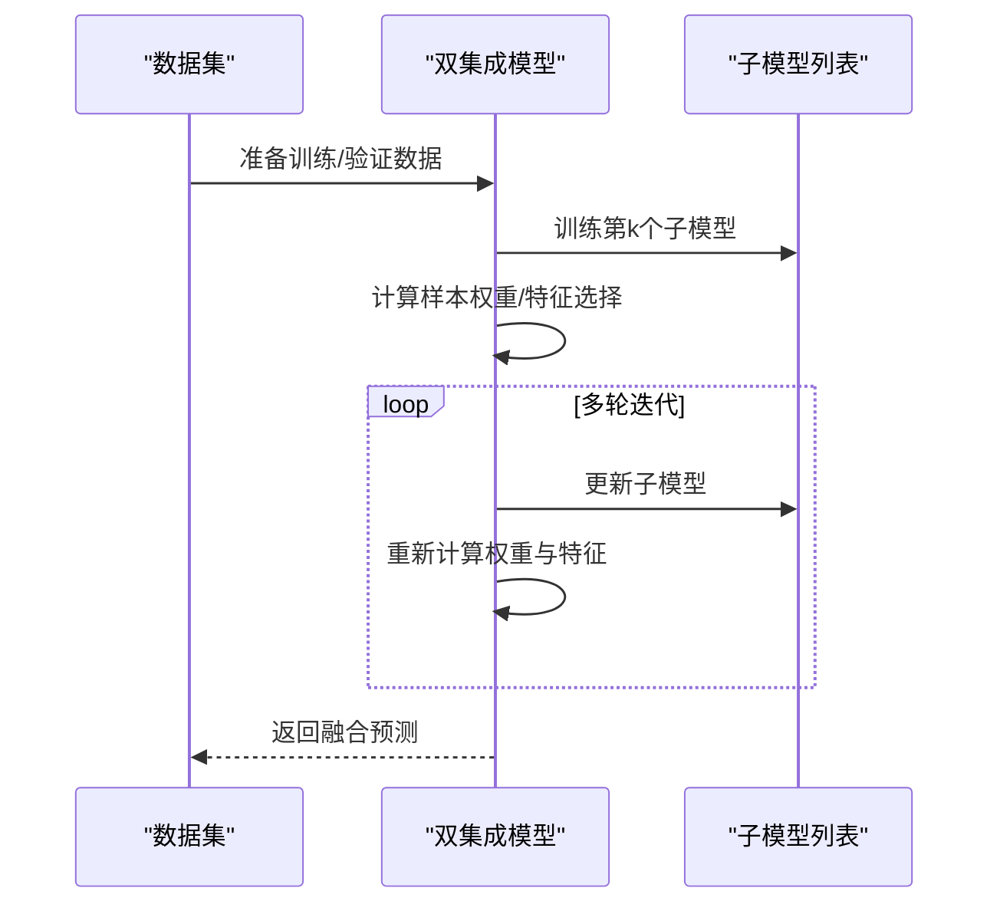
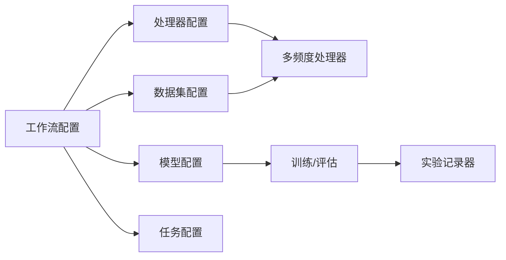
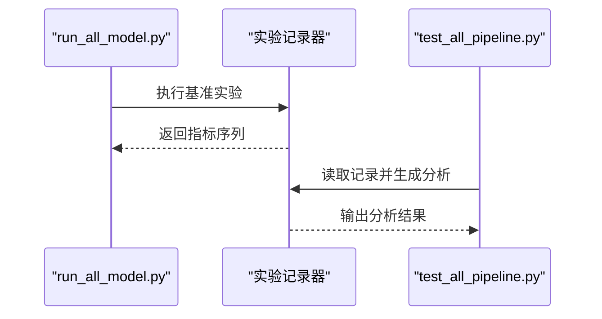
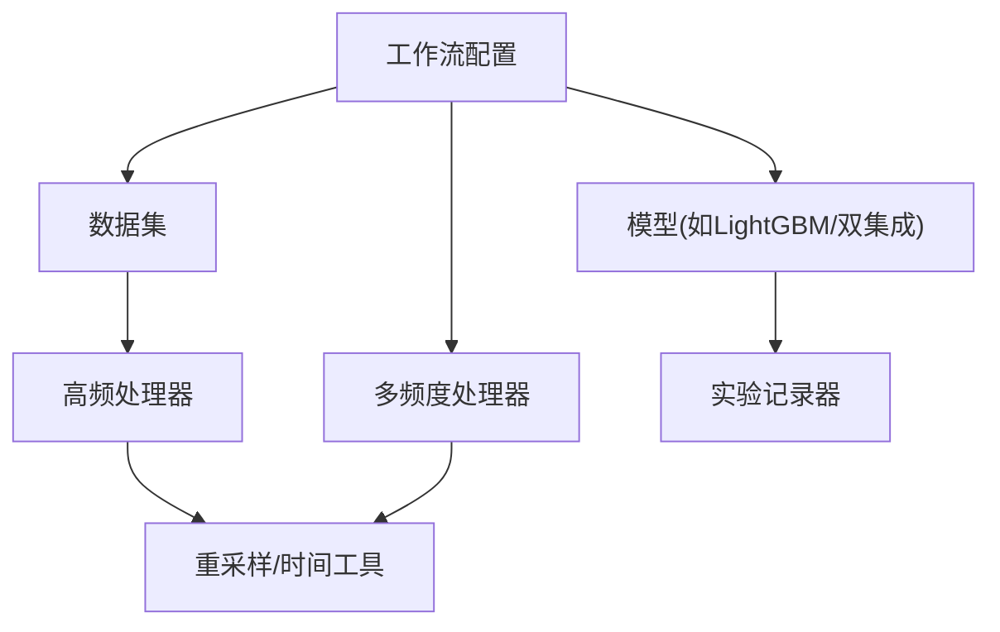

# 多频度基准实验

<cite>
**本文引用的文件**
- [multi_freq_handler.py](file://examples/benchmarks/LightGBM/multi_freq_handler.py)
- [workflow_config_lightgbm_multi_freq.yaml](file://examples/benchmarks/LightGBM/workflow_config_lightgbm_multi_freq.yaml)
- [workflow_config_lightgbm_Alpha158_multi_freq.yaml](file://examples/benchmarks/LightGBM/workflow_config_lightgbm_Alpha158_multi_freq.yaml)
- [highfreq_handler.py](file://qlib/contrib/data/highfreq_handler.py)
- [resam.py](file://qlib/utils/resam.py)
- [time.py](file://qlib/utils/time.py)
- [double_ensemble.py](file://qlib/contrib/model/double_ensemble.py)
- [run_all_model.py](file://examples/run_all_model.py)
- [test_all_pipeline.py](file://tests/test_all_pipeline.py)
</cite>

## 目录
1. [引言](#引言)
2. [项目结构](#项目结构)
3. [核心组件](#核心组件)
4. [架构总览](#架构总览)
5. [详细组件分析](#详细组件分析)
6. [依赖关系分析](#依赖关系分析)
7. [性能考量](#性能考量)
8. [故障排查指南](#故障排查指南)
9. [结论](#结论)
10. [附录](#附录)

## 引言
本文件面向在Qlib中开展“多频度基准实验”的研究者与工程师，系统阐述如何使用日线、分钟线等多时间维度数据进行基准测试，覆盖以下主题：
- 多频度数据的加载与对齐策略
- 特征工程方法（含重采样、缺失填充、周期性特征）
- 模型训练与多模型融合（双集成、路由式融合等）
- 完整的多频度配置文件示例与实验流程
- 多频度模型相较单一频度模型的优势与局限性

## 项目结构
围绕多频度基准实验，本仓库的关键位置如下：
- 基准示例与工作流配置：examples/benchmarks/LightGBM
- 高频数据处理器：qlib/contrib/data/highfreq_handler.py
- 时间与重采样工具：qlib/utils/resam.py、qlib/utils/time.py
- 多模型融合实现：qlib/contrib/model/double_ensemble.py
- 实验运行与结果汇总：examples/run_all_model.py、tests/test_all_pipeline.py

**图表来源**
- [multi_freq_handler.py](file://examples/benchmarks/LightGBM/multi_freq_handler.py)
- [workflow_config_lightgbm_multi_freq.yaml](file://examples/benchmarks/LightGBM/workflow_config_lightgbm_multi_freq.yaml)
- [workflow_config_lightgbm_Alpha158_multi_freq.yaml](file://examples/benchmarks/LightGBM/workflow_config_lightgbm_Alpha158_multi_freq.yaml)
- [highfreq_handler.py](file://qlib/contrib/data/highfreq_handler.py)
- [resam.py](file://qlib/utils/resam.py)
- [time.py](file://qlib/utils/time.py)
- [double_ensemble.py](file://qlib/contrib/model/double_ensemble.py)
- [run_all_model.py](file://examples/run_all_model.py)
- [test_all_pipeline.py](file://tests/test_all_pipeline.py)

**章节来源**
- [multi_freq_handler.py](file://examples/benchmarks/LightGBM/multi_freq_handler.py)
- [workflow_config_lightgbm_multi_freq.yaml](file://examples/benchmarks/LightGBM/workflow_config_lightgbm_multi_freq.yaml)
- [workflow_config_lightgbm_Alpha158_multi_freq.yaml](file://examples/benchmarks/LightGBM/workflow_config_lightgbm_Alpha158_multi_freq.yaml)
- [highfreq_handler.py](file://qlib/contrib/data/highfreq_handler.py)
- [resam.py](file://qlib/utils/resam.py)
- [time.py](file://qlib/utils/time.py)
- [double_ensemble.py](file://qlib/contrib/model/double_ensemble.py)
- [run_all_model.py](file://examples/run_all_model.py)
- [test_all_pipeline.py](file://tests/test_all_pipeline.py)

## 核心组件
- 多频度数据处理器：负责从不同频率（如日线、分钟线）加载特征，并进行对齐与拼接，形成统一输入。
- 工作流配置：定义数据集、处理器、模型、任务等参数，支持多频度联合训练与评估。
- 高频数据处理器：针对高频场景（如1分钟）构造字段与列，适配高频回测与建模。
- 重采样与时间工具：提供时间频率解析、对齐与重采样能力，确保跨频率数据对齐。
- 双集成模型：通过子模型集合与加权融合提升稳定性与泛化性能。

**章节来源**
- [multi_freq_handler.py](file://examples/benchmarks/LightGBM/multi_freq_handler.py)
- [workflow_config_lightgbm_multi_freq.yaml](file://examples/benchmarks/LightGBM/workflow_config_lightgbm_multi_freq.yaml)
- [workflow_config_lightgbm_Alpha158_multi_freq.yaml](file://examples/benchmarks/LightGBM/workflow_config_lightgbm_Alpha158_multi_freq.yaml)
- [highfreq_handler.py](file://qlib/contrib/data/highfreq_handler.py)
- [resam.py](file://qlib/utils/resam.py)
- [time.py](file://qlib/utils/time.py)
- [double_ensemble.py](file://qlib/contrib/model/double_ensemble.py)

## 架构总览
下图展示多频度基准实验的端到端流程：从数据加载与特征工程，到模型训练与融合，再到实验记录与结果汇总。

**图表来源**
- [workflow_config_lightgbm_multi_freq.yaml](file://examples/benchmarks/LightGBM/workflow_config_lightgbm_multi_freq.yaml)
- [multi_freq_handler.py](file://examples/benchmarks/LightGBM/multi_freq_handler.py)
- [highfreq_handler.py](file://qlib/contrib/data/highfreq_handler.py)
- [resam.py](file://qlib/utils/resam.py)
- [time.py](file://qlib/utils/time.py)

## 详细组件分析

### 多频度数据处理器（多频率特征对齐与拼接）
- 职责
  - 从不同频率的数据源加载特征序列
  - 对齐时间戳（按日或按分钟），保证跨频率对齐一致性
  - 将不同频率的特征进行拼接，形成统一输入张量
- 关键点
  - 使用时间频率解析与重采样工具进行对齐
  - 支持缺失值填充与周期性特征构造
  - 与工作流配置中的数据集/处理器协同

**图表来源**
- [multi_freq_handler.py](file://examples/benchmarks/LightGBM/multi_freq_handler.py)
- [resam.py](file://qlib/utils/resam.py)
- [time.py](file://qlib/utils/time.py)

**章节来源**
- [multi_freq_handler.py](file://examples/benchmarks/LightGBM/multi_freq_handler.py)
- [resam.py](file://qlib/utils/resam.py)
- [time.py](file://qlib/utils/time.py)

### 高频数据处理器（1分钟级特征工程）
- 职责
  - 针对高频数据（如1分钟）构造字段与列
  - 支持暂停标记、成交量标准化、滞后/移动均值等高频特征
  - 适配高频回测与训练
- 关键点
  - 字段模板与列名规范化
  - 与数据加载器配合，设置频率为1分钟
  - 可扩展为多列组合（如价格、成交量、VWAP）

**图表来源**
- [highfreq_handler.py](file://qlib/contrib/data/highfreq_handler.py)

**章节来源**
- [highfreq_handler.py](file://qlib/contrib/data/highfreq_handler.py)

### 重采样与时间对齐工具
- 功能
  - 解析时间频率字符串，统一到内部表示
  - 对时间序列进行重采样（按日/分钟等），支持聚合函数
  - 在高频场景中对齐到采样日历
- 关键点
  - 自动降级到可用频率（如从月/周/日降级到1分钟）
  - 支持多索引时间序列切片与分组操作

**图表来源**
- [resam.py](file://qlib/utils/resam.py)
- [time.py](file://qlib/utils/time.py)

**章节来源**
- [resam.py](file://qlib/utils/resam.py)
- [time.py](file://qlib/utils/time.py)

### 双集成模型（多模型融合）
- 职责
  - 训练多个子模型，逐轮更新样本权重与特征子集
  - 在预测阶段对各子模型输出进行加权融合
- 关键点
  - 子模型权重与特征选择基于损失曲线动态调整
  - 支持多模型平均与归一化权重

**图表来源**
- [double_ensemble.py](file://qlib/contrib/model/double_ensemble.py)

**章节来源**
- [double_ensemble.py](file://qlib/contrib/model/double_ensemble.py)

### 工作流配置（多频度基准实验）
- 典型配置项
  - 数据集：包含多频率特征字段、时间范围、频率设置
  - 处理器：多频度处理器模块路径与参数
  - 模型：LightGBM等模型参数与优化策略
  - 任务：训练/验证/测试划分与回测设置
- 示例文件
  - 多频度工作流配置：workflow_config_lightgbm_multi_freq.yaml
  - Alpha158多频度工作流配置：workflow_config_lightgbm_Alpha158_multi_freq.yaml

**图表来源**
- [workflow_config_lightgbm_multi_freq.yaml](file://examples/benchmarks/LightGBM/workflow_config_lightgbm_multi_freq.yaml)
- [workflow_config_lightgbm_Alpha158_multi_freq.yaml](file://examples/benchmarks/LightGBM/workflow_config_lightgbm_Alpha158_multi_freq.yaml)
- [multi_freq_handler.py](file://examples/benchmarks/LightGBM/multi_freq_handler.py)

**章节来源**
- [workflow_config_lightgbm_multi_freq.yaml](file://examples/benchmarks/LightGBM/workflow_config_lightgbm_multi_freq.yaml)
- [workflow_config_lightgbm_Alpha158_multi_freq.yaml](file://examples/benchmarks/LightGBM/workflow_config_lightgbm_Alpha158_multi_freq.yaml)
- [multi_freq_handler.py](file://examples/benchmarks/LightGBM/multi_freq_handler.py)

### 实验运行与结果汇总
- 运行脚本
  - 批量扫描基准模型目录，匹配对应YAML与requirements
  - 统一执行实验并提取关键指标（年化收益、信息比率、最大回撤、IC/ICIR等）
- 测试流水线
  - 初始化数据集与模型，生成信号分析与回测报告

**图表来源**
- [run_all_model.py](file://examples/run_all_model.py)
- [test_all_pipeline.py](file://tests/test_all_pipeline.py)

**章节来源**
- [run_all_model.py](file://examples/run_all_model.py)
- [test_all_pipeline.py](file://tests/test_all_pipeline.py)

## 依赖关系分析
- 组件耦合
  - 工作流配置强依赖多频度处理器与数据集
  - 高频处理器与重采样工具紧密协作，确保1分钟级数据对齐
  - 双集成模型作为融合层，可与任意基学习器配合
- 外部依赖
  - 时间频率解析依赖内部工具类
  - 实验记录与指标提取依赖实验框架

**图表来源**
- [workflow_config_lightgbm_multi_freq.yaml](file://examples/benchmarks/LightGBM/workflow_config_lightgbm_multi_freq.yaml)
- [multi_freq_handler.py](file://examples/benchmarks/LightGBM/multi_freq_handler.py)
- [highfreq_handler.py](file://qlib/contrib/data/highfreq_handler.py)
- [resam.py](file://qlib/utils/resam.py)
- [time.py](file://qlib/utils/time.py)
- [double_ensemble.py](file://qlib/contrib/model/double_ensemble.py)

**章节来源**
- [workflow_config_lightgbm_multi_freq.yaml](file://examples/benchmarks/LightGBM/workflow_config_lightgbm_multi_freq.yaml)
- [multi_freq_handler.py](file://examples/benchmarks/LightGBM/multi_freq_handler.py)
- [highfreq_handler.py](file://qlib/contrib/data/highfreq_handler.py)
- [resam.py](file://qlib/utils/resam.py)
- [time.py](file://qlib/utils/time.py)
- [double_ensemble.py](file://qlib/contrib/model/double_ensemble.py)

## 性能考量
- 数据对齐成本
  - 频率差异越大，重采样与对齐越耗时；建议优先使用日线与1分钟线组合
- 特征冗余
  - 多频度拼接可能引入高维稀疏特征，需结合特征选择或降维
- 训练稳定性
  - 双集成等融合策略可降低过拟合并提升鲁棒性
- 回测效率
  - 高频回测计算量大，建议在验证阶段采用抽样或降采样策略

## 故障排查指南
- 配置不匹配
  - 确认工作流配置中的数据集字段与处理器模块路径一致
- 频率解析错误
  - 检查时间频率字符串格式，必要时降级到1分钟
- 缺失值与空序列
  - 对重采样后的空序列进行判空处理，避免后续计算异常
- 指标缺失
  - 实验完成后检查记录器状态，确保指标键存在后再提取

**章节来源**
- [resam.py](file://qlib/utils/resam.py)
- [run_all_model.py](file://examples/run_all_model.py)
- [test_all_pipeline.py](file://tests/test_all_pipeline.py)

## 结论
多频度基准实验通过“多频率数据对齐+特征工程+模型融合”的组合，能够在日线与分钟线之间互补信息，提升预测稳定性与泛化性能。实践中应重视数据对齐策略、特征冗余控制与回测效率，并以工作流配置为入口统一管理实验流程。

## 附录
- 多频度配置文件示例
  - 多频度工作流配置：workflow_config_lightgbm_multi_freq.yaml
  - Alpha158多频度工作流配置：workflow_config_lightgbm_Alpha158_multi_freq.yaml
- 关键实现参考
  - 多频度处理器：multi_freq_handler.py
  - 高频处理器：highfreq_handler.py
  - 重采样与时间工具：resam.py、time.py
  - 双集成模型：double_ensemble.py
  - 实验运行与分析：run_all_model.py、test_all_pipeline.py