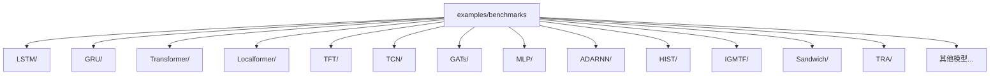
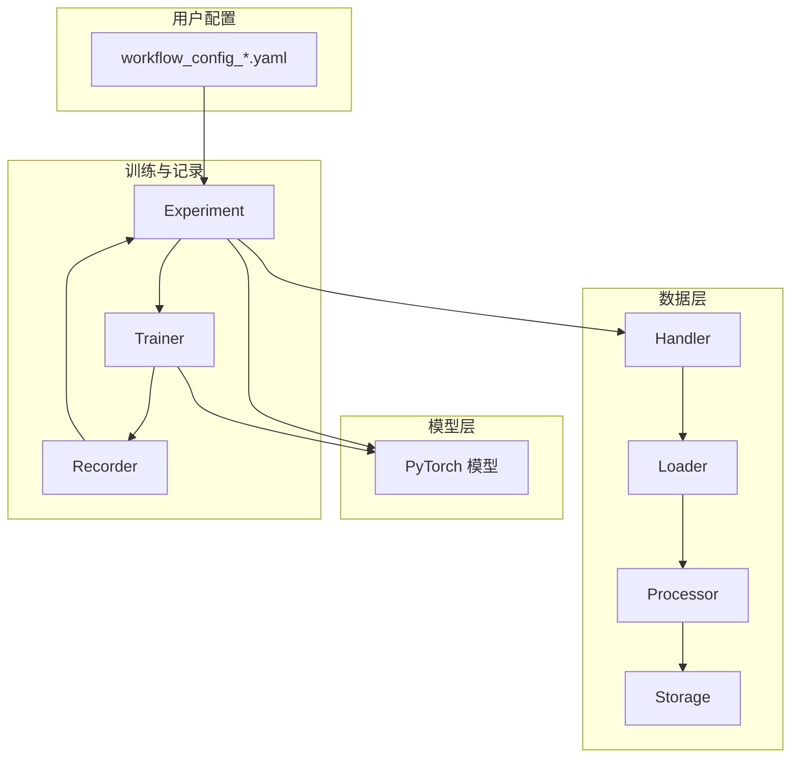
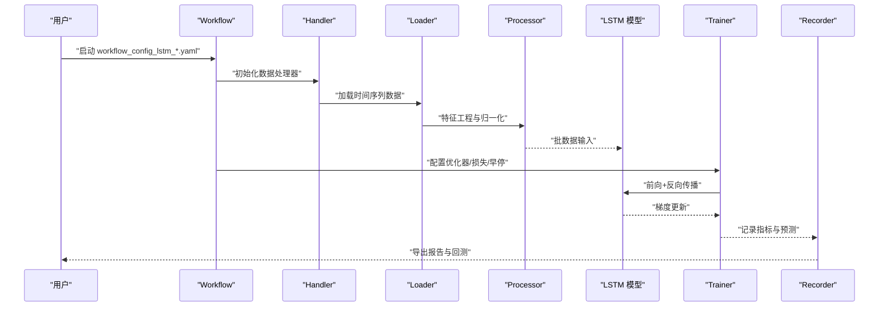
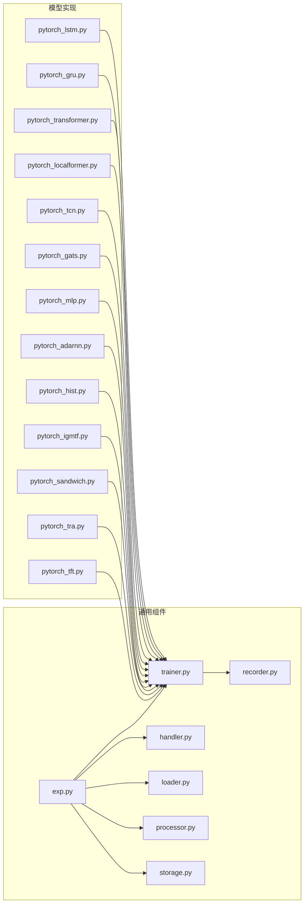

# 深度学习模型基准

<cite>
**本文引用的文件**
- [examples/benchmarks/README.md](file://examples/benchmarks/README.md)
- [examples/benchmarks/LSTM/README.md](file://examples/benchmarks/LSTM/README.md)
- [examples/benchmarks/GRU/README.md](file://examples/benchmarks/GRU/README.md)
- [examples/benchmarks/Transformer/README.md](file://examples/benchmarks/Transformer/README.md)
- [examples/benchmarks/Localformer/README.md](file://examples/benchmarks/Localformer/README.md)
- [examples/benchmarks/TFT/README.md](file://examples/benchmarks/TFT/README.md)
- [examples/benchmarks/TCN/README.md](file://examples/benchmarks/TCN/README.md)
- [examples/benchmarks/GATs/README.md](file://examples/benchmarks/GATs/README.md)
- [examples/benchmarks/MLP/README.md](file://examples/benchmarks/MLP/README.md)
- [examples/benchmarks/ADARNN/README.md](file://examples/benchmarks/ADARNN/README.md)
- [examples/benchmarks/KRNN/README.md](file://examples/benchmarks/KRNN/README.md)
- [examples/benchmarks/HIST/README.md](file://examples/benchmarks/HIST/README.md)
- [examples/benchmarks/IGMTF/README.md](file://examples/benchmarks/IGMTF/README.md)
- [examples/benchmarks/Sandwich/README.md](file://examples/benchmarks/Sandwich/README.md)
- [examples/benchmarks/TRA/README.md](file://examples/benchmarks/TRA/README.md)
- [examples/benchmarks/LSTM/workflow_config_lstm_Alpha158.yaml](file://examples/benchmarks/LSTM/workflow_config_lstm_Alpha158.yaml)
- [examples/benchmarks/LSTM/workflow_config_lstm_Alpha360.yaml](file://examples/benchmarks/LSTM/workflow_config_lstm_Alpha360.yaml)
- [examples/benchmarks/GRU/workflow_config_gru_Alpha158.yaml](file://examples/benchmarks/GRU/workflow_config_gru_Alpha158.yaml)
- [examples/benchmarks/GRU/workflow_config_gru_Alpha360.yaml](file://examples/benchmarks/GRU/workflow_config_gru_Alpha360.yaml)
- [examples/benchmarks/Transformer/workflow_config_transformer_Alpha158.yaml](file://examples/benchmarks/Transformer/workflow_config_transformer_Alpha158.yaml)
- [examples/benchmarks/Transformer/workflow_config_transformer_Alpha360.yaml](file://examples/benchmarks/Transformer/workflow_config_transformer_Alpha360.yaml)
- [examples/benchmarks/Localformer/workflow_config_localformer_Alpha158.yaml](file://examples/benchmarks/Localformer/workflow_config_localformer_Alpha158.yaml)
- [examples/benchmarks/Localformer/workflow_config_localformer_Alpha360.yaml](file://examples/benchmarks/Localformer/workflow_config_localformer_Alpha360.yaml)
- [examples/benchmarks/TFT/workflow_config_tft_Alpha158.yaml](file://examples/benchmarks/TFT/workflow_config_tft_Alpha158.yaml)
- [examples/benchmarks/TCN/workflow_config_tcn_Alpha158.yaml](file://examples/benchmarks/TCN/workflow_config_tcn_Alpha158.yaml)
- [examples/benchmarks/TCN/workflow_config_tcn_Alpha360.yaml](file://examples/benchmarks/TCN/workflow_config_tcn_Alpha360.yaml)
- [examples/benchmarks/GATs/workflow_config_gats_Alpha158.yaml](file://examples/benchmarks/GATs/workflow_config_gats_Alpha158.yaml)
- [examples/benchmarks/GATs/workflow_config_gats_Alpha360.yaml](file://examples/benchmarks/GATs/workflow_config_gats_Alpha360.yaml)
- [examples/benchmarks/MLP/workflow_config_mlp_Alpha158.yaml](file://examples/benchmarks/MLP/workflow_config_mlp_Alpha158.yaml)
- [examples/benchmarks/MLP/workflow_config_mlp_Alpha360.yaml](file://examples/benchmarks/MLP/workflow_config_mlp_Alpha360.yaml)
- [examples/benchmarks/ADARNN/workflow_config_adarnn_Alpha360.yaml](file://examples/benchmarks/ADARNN/workflow_config_adarnn_Alpha360.yaml)
- [examples/benchmarks/HIST/workflow_config_hist_Alpha360.yaml](file://examples/benchmarks/HIST/workflow_config_hist_Alpha360.yaml)
- [examples/benchmarks/IGMTF/workflow_config_igmtf_Alpha360.yaml](file://examples/benchmarks/IGMTF/workflow_config_igmtf_Alpha360.yaml)
- [examples/benchmarks/Sandwich/workflow_config_sandwich_Alpha360.yaml](file://examples/benchmarks/Sandwich/workflow_config_sandwich_Alpha360.yaml)
- [examples/benchmarks/TRA/workflow_config_tra_Alpha158.yaml](file://examples/benchmarks/TRA/workflow_config_tra_Alpha158.yaml)
- [examples/benchmarks/TRA/workflow_config_tra_Alpha360.yaml](file://examples/benchmarks/TRA/workflow_config_tra_Alpha360.yaml)
- [qlib/contrib/model/pytorch_lstm.py](file://qlib/contrib/model/pytorch_lstm.py)
- [qlib/contrib/model/pytorch_gru.py](file://qlib/contrib/model/pytorch_gru.py)
- [qlib/contrib/model/pytorch_transformer.py](file://qlib/contrib/model/pytorch_transformer.py)
- [qlib/contrib/model/pytorch_localformer.py](file://qlib/contrib/model/pytorch_localformer.py)
- [qlib/contrib/model/pytorch_tcn.py](file://qlib/contrib/model/pytorch_tcn.py)
- [qlib/contrib/model/pytorch_gats.py](file://qlib/contrib/model/pytorch_gats.py)
- [qlib/contrib/model/pytorch_mlp.py](file://qlib/contrib/model/pytorch_mlp.py)
- [qlib/contrib/model/pytorch_adarnn.py](file://qlib/contrib/model/pytorch_adarnn.py)
- [qlib/contrib/model/pytorch_hist.py](file://qlib/contrib/model/pytorch_hist.py)
- [qlib/contrib/model/pytorch_igmtf.py](file://qlib/contrib/model/pytorch_igmtf.py)
- [qlib/contrib/model/pytorch_sandwich.py](file://qlib/contrib/model/pytorch_sandwich.py)
- [qlib/contrib/model/pytorch_tra.py](file://qlib/contrib/model/pytorch_tra.py)
- [qlib/contrib/model/pytorch_krnn.py](file://qlib/contrib/model/pytorch_krnn.py)
- [qlib/contrib/model/pytorch_tft.py](file://qlib/contrib/model/pytorch_tft.py)
- [qlib/contrib/model/pytorch_nn.py](file://qlib/contrib/model/pytorch_nn.py)
- [qlib/contrib/model/pytorch_general_nn.py](file://qlib/contrib/model/pytorch_general_nn.py)
- [qlib/contrib/model/tcn.py](file://qlib/contrib/model/tcn.py)
- [qlib/contrib/model/pytorch_utils.py](file://qlib/contrib/model/pytorch_utils.py)
- [qlib/data/dataset/handler.py](file://qlib/data/dataset/handler.py)
- [qlib/data/dataset/loader.py](file://qlib/data/dataset/loader.py)
- [qlib/data/dataset/processor.py](file://qlib/data/dataset/processor.py)
- [qlib/data/dataset/storage.py](file://qlib/data/dataset/storage.py)
- [qlib/model/trainer.py](file://qlib/model/trainer.py)
- [qlib/workflow/exp.py](file://qlib/workflow/exp.py)
- [qlib/workflow/recorder.py](file://qlib/workflow/recorder.py)
- [qlib/workflow/utils.py](file://qlib/workflow/utils.py)
- [qlib/config.py](file://qlib/config.py)
- [qlib/log.py](file://qlib/log.py)
- [qlib/utils/time.py](file://qlib/utils/time.py)
- [qlib/utils/file.py](file://qlib/utils/file.py)
- [qlib/utils/exceptions.py](file://qlib/utils/exceptions.py)
</cite>

## 目录
1. [引言](#引言)
2. [项目结构](#项目结构)
3. [核心组件](#核心组件)
4. [架构总览](#架构总览)
5. [详细组件分析](#详细组件分析)
6. [依赖关系分析](#依赖关系分析)
7. [性能考量](#性能考量)
8. [故障排查指南](#故障排查指南)
9. [结论](#结论)
10. [附录](#附录)

## 引言
本文件面向在 Qlib 中开展深度学习模型基准实验的研究者与工程师，系统梳理 LSTM、GRU、Transformer、Localformer、TFT、TCN、GATs、MLP、ADARNN、KRNN、HIST、IGMTF、Sandwich、TRA 等模型的基准配置、训练流程、数据处理与性能表现，并给出复杂度与性能权衡建议及实践指引。文档以仓库中各模型的基准示例为依据，结合 Qlib 的工作流（Workflow）与数据处理管线，帮助读者快速复现实验并进行对比分析。

## 项目结构
Qlib 的基准实验主要位于 examples/benchmarks 下，每个模型对应一个子目录，包含：
- README.md：模型简介与运行说明
- requirements.txt：依赖安装说明
- workflow_config_*.yaml：工作流配置模板（包含数据、处理器、模型、训练器等）
- 部分模型还包含额外的数据格式化、超参搜索或源码示例

图表来源
- [examples/benchmarks/README.md](file://examples/benchmarks/README.md)

章节来源
- [examples/benchmarks/README.md](file://examples/benchmarks/README.md)

## 核心组件
- 数据处理管线：Handler、Loader、Processor、Storage 组成数据准备与加载链路，支持时间序列特征工程、缺失值处理、标准化/归一化等。
- 训练器：Trainer 负责训练循环、优化器、损失函数、早停与日志记录。
- 工作流：Experiment/Recorder/Utils 提供实验编排、记录与结果导出。
- 模型实现：各模型在 qlib/contrib/model 下以 PyTorch 实现，统一遵循 Qlib 的接口约定。

章节来源
- [qlib/data/dataset/handler.py](file://qlib/data/dataset/handler.py)
- [qlib/data/dataset/loader.py](file://qlib/data/dataset/loader.py)
- [qlib/data/dataset/processor.py](file://qlib/data/dataset/processor.py)
- [qlib/data/dataset/storage.py](file://qlib/data/dataset/storage.py)
- [qlib/model/trainer.py](file://qlib/model/trainer.py)
- [qlib/workflow/exp.py](file://qlib/workflow/exp.py)
- [qlib/workflow/recorder.py](file://qlib/workflow/recorder.py)
- [qlib/workflow/utils.py](file://qlib/workflow/utils.py)

## 架构总览
下图展示从配置到实验执行的关键路径：用户通过 workflow_config_* 指定数据、处理器、模型与训练参数；Workflow 解析配置，构建 Handler/Loader/Processor/Model/Trainer；Trainer 执行训练与评估，Recorder 输出指标与预测结果。

图表来源
- [qlib/workflow/exp.py](file://qlib/workflow/exp.py)
- [qlib/workflow/recorder.py](file://qlib/workflow/recorder.py)
- [qlib/data/dataset/handler.py](file://qlib/data/dataset/handler.py)
- [qlib/data/dataset/loader.py](file://qlib/data/dataset/loader.py)
- [qlib/data/dataset/processor.py](file://qlib/data/dataset/processor.py)
- [qlib/data/dataset/storage.py](file://qlib/data/dataset/storage.py)
- [qlib/model/trainer.py](file://qlib/model/trainer.py)

## 详细组件分析

### LSTM 基准
- 网络架构特点：基于 LSTM 的时序建模，支持多层、双向与注意力融合（部分变体）。常见输入为时间步 × 特征矩阵，输出为时序预测或静态标签预测。
- 训练配置要点：序列长度、批次大小、学习率、优化器、损失函数（如 MAE/MSE）、早停策略、正则化系数。
- 数据处理要求：时间序列对齐、缺失填充、特征标准化；可选加入相对位置编码或静态特征拼接。
- 性能表现：在 Alpha158/Alpha360 基准上通常具备稳定基线性能，适合长程依赖任务。

图表来源
- [examples/benchmarks/LSTM/workflow_config_lstm_Alpha158.yaml](file://examples/benchmarks/LSTM/workflow_config_lstm_Alpha158.yaml)
- [examples/benchmarks/LSTM/workflow_config_lstm_Alpha360.yaml](file://examples/benchmarks/LSTM/workflow_config_lstm_Alpha360.yaml)
- [qlib/contrib/model/pytorch_lstm.py](file://qlib/contrib/model/pytorch_lstm.py)
- [qlib/workflow/exp.py](file://qlib/workflow/exp.py)
- [qlib/workflow/recorder.py](file://qlib/workflow/recorder.py)
- [qlib/model/trainer.py](file://qlib/model/trainer.py)

章节来源
- [examples/benchmarks/LSTM/README.md](file://examples/benchmarks/LSTM/README.md)
- [examples/benchmarks/LSTM/workflow_config_lstm_Alpha158.yaml](file://examples/benchmarks/LSTM/workflow_config_lstm_Alpha158.yaml)
- [examples/benchmarks/LSTM/workflow_config_lstm_Alpha360.yaml](file://examples/benchmarks/LSTM/workflow_config_lstm_Alpha360.yaml)
- [qlib/contrib/model/pytorch_lstm.py](file://qlib/contrib/model/pytorch_lstm.py)

### GRU 基准
- 网络架构特点：门控循环单元，计算开销低于 LSTM，常用于长序列建模；可扩展为多头注意力或残差连接。
- 训练配置要点：与 LSTM 类似，关注梯度裁剪、学习率调度与 Dropout。
- 数据处理要求：同 LSTM，强调序列对齐与特征稳定性。
- 性能表现：在多数 Alpha 基准上接近 LSTM，但收敛更快、资源占用更低。

章节来源
- [examples/benchmarks/GRU/README.md](file://examples/benchmarks/GRU/README.md)
- [examples/benchmarks/GRU/workflow_config_gru_Alpha158.yaml](file://examples/benchmarks/GRU/workflow_config_gru_Alpha158.yaml)
- [examples/benchmarks/GRU/workflow_config_gru_Alpha360.yaml](file://examples/benchmarks/GRU/workflow_config_gru_Alpha360.yaml)
- [qlib/contrib/model/pytorch_gru.py](file://qlib/contrib/model/pytorch_gru.py)

### Transformer 基准
- 网络架构特点：自注意力机制，全局建模能力强，适合捕捉跨时间步与跨变量的复杂相关性；常见变体包括前馈、残差、LayerNorm 等。
- 训练配置要点：注意多头数量、层数、前馈维度、dropout、预 LayerNorm 等超参；学习率调度与 warmup。
- 数据处理要求：时间维与变量维的对齐，必要时引入位置编码或时间嵌入。
- 性能表现：在高维特征与长序列场景优势明显，但计算与内存开销较大。

章节来源
- [examples/benchmarks/Transformer/README.md](file://examples/benchmarks/Transformer/README.md)
- [examples/benchmarks/Transformer/workflow_config_transformer_Alpha158.yaml](file://examples/benchmarks/Transformer/workflow_config_transformer_Alpha158.yaml)
- [examples/benchmarks/Transformer/workflow_config_transformer_Alpha360.yaml](file://examples/benchmarks/Transformer/workflow_config_transformer_Alpha360.yaml)
- [qlib/contrib/model/pytorch_transformer.py](file://qlib/contrib/model/pytorch_transformer.py)

### Localformer 基准
- 网络架构特点：局部窗口注意力，兼顾全局与局部建模，降低自注意力的二次复杂度；适合大规模时间序列。
- 训练配置要点：窗口大小、步长、层数、注意力头数等；注意显存上限与 batch size 的平衡。
- 数据处理要求：按局部窗口切片，确保边界处理一致。
- 性能表现：在保持较高精度的同时显著降低计算成本，适合工业级部署。

章节来源
- [examples/benchmarks/Localformer/README.md](file://examples/benchmarks/Localformer/README.md)
- [examples/benchmarks/Localformer/workflow_config_localformer_Alpha158.yaml](file://examples/benchmarks/Localformer/workflow_config_localformer_Alpha158.yaml)
- [examples/benchmarks/Localformer/workflow_config_localformer_Alpha360.yaml](file://examples/benchmarks/Localformer/workflow_config_localformer_Alpha360.yaml)
- [qlib/contrib/model/pytorch_localformer.py](file://qlib/contrib/model/pytorch_localformer.py)

### TFT 基准
- 网络架构特点：Temporal Fusion Transformer，融合时间特征、静态特征与协变量，支持多变量多步预测；包含门控机制与可加性分解。
- 训练配置要点：多变量输入、历史长度、预测步长、静态/类别特征编码、损失权重与量化损失。
- 数据处理要求：严格区分历史与未来协变量；类别特征需进行嵌入或独热编码。
- 性能表现：在多变量时序预测任务上表现优异，但实现复杂度较高。

章节来源
- [examples/benchmarks/TFT/README.md](file://examples/benchmarks/TFT/README.md)
- [examples/benchmarks/TFT/workflow_config_tft_Alpha158.yaml](file://examples/benchmarks/TFT/workflow_config_tft_Alpha158.yaml)
- [qlib/contrib/model/pytorch_tft.py](file://qlib/contrib/model/pytorch_tft.py)

### TCN 基准
- 网络架构特点：空洞卷积堆叠，因果卷积保证时间方向的信息不泄漏；具有长期依赖与并行化优势。
- 训练配置要点：感受野大小、扩张率、层数、残差连接、Dropout。
- 数据处理要求：确保因果性与对齐；必要时进行归一化与缺失处理。
- 性能表现：在长序列建模中效率高、延迟低，适合高频或在线预测。

章节来源
- [examples/benchmarks/TCN/README.md](file://examples/benchmarks/TCN/README.md)
- [examples/benchmarks/TCN/workflow_config_tcn_Alpha158.yaml](file://examples/benchmarks/TCN/workflow_config_tcn_Alpha158.yaml)
- [examples/benchmarks/TCN/workflow_config_tcn_Alpha360.yaml](file://examples/benchmarks/TCN/workflow_config_tcn_Alpha360.yaml)
- [qlib/contrib/model/pytorch_tcn.py](file://qlib/contrib/model/pytorch_tcn.py)
- [qlib/contrib/model/tcn.py](file://qlib/contrib/model/tcn.py)

### GATs 基准
- 网络架构特点：图注意力网络，利用图结构建模变量间关系；适合因子图或领域知识驱动的邻接结构。
- 训练配置要点：图构建策略（阈值/KNN/谱方法）、注意力头数、图卷积层数、正则化。
- 数据处理要求：构造邻接矩阵或边列表；节点特征归一化；图稀疏化与对称化。
- 性能表现：在变量间存在明确图结构的任务上效果显著，需谨慎选择图构建方法。

章节来源
- [examples/benchmarks/GATs/README.md](file://examples/benchmarks/GATs/README.md)
- [examples/benchmarks/GATs/workflow_config_gats_Alpha158.yaml](file://examples/benchmarks/GATs/workflow_config_gats_Alpha158.yaml)
- [examples/benchmarks/GATs/workflow_config_gats_Alpha360.yaml](file://examples/benchmarks/GATs/workflow_config_gats_Alpha360.yaml)
- [qlib/contrib/model/pytorch_gats.py](file://qlib/contrib/model/pytorch_gats.py)

### MLP 基准
- 网络架构特点：全连接前馈网络，简单高效；常作为基线或轻量级替代方案。
- 训练配置要点：隐藏层宽度、层数、激活函数、正则化、Dropout；注意过拟合风险。
- 数据处理要求：特征归一化与缺失处理；可加入残差或 LayerNorm。
- 性能表现：在特征工程良好时可达到稳健性能，但在强时序依赖任务上易受限。

章节来源
- [examples/benchmarks/MLP/README.md](file://examples/benchmarks/MLP/README.md)
- [examples/benchmarks/MLP/workflow_config_mlp_Alpha158.yaml](file://examples/benchmarks/MLP/workflow_config_mlp_Alpha158.yaml)
- [examples/benchmarks/MLP/workflow_config_mlp_Alpha360.yaml](file://examples/benchmarks/MLP/workflow_config_mlp_Alpha360.yaml)
- [qlib/contrib/model/pytorch_mlp.py](file://qlib/contrib/model/pytorch_mlp.py)

### ADARNN 基准
- 网络架构特点：自适应动态路由神经网络，结合注意力与动态门控，提升对时序变化的适应能力。
- 训练配置要点：动态路由参数、注意力头数、门控阈值、正则化强度。
- 数据处理要求：与 LSTM/GRU 类似，强调序列稳定性与特征一致性。
- 性能表现：在非平稳市场环境下优于传统 RNN，但训练更不稳定，需精细调参。

章节来源
- [examples/benchmarks/ADARNN/README.md](file://examples/benchmarks/ADARNN/README.md)
- [examples/benchmarks/ADARNN/workflow_config_adarnn_Alpha360.yaml](file://examples/benchmarks/ADARNN/workflow_config_adarnn_Alpha360.yaml)
- [qlib/contrib/model/pytorch_adarnn.py](file://qlib/contrib/model/pytorch_adarnn.py)

### HIST 基准
- 网络架构特点：基于历史统计与记忆增强的混合模型，结合外部统计信息与内部记忆模块。
- 训练配置要点：记忆容量、统计特征维度、融合权重、正则化。
- 数据处理要求：准备历史统计特征（如滑动窗口统计量）并与原始特征拼接。
- 性能表现：在 Alpha360 基准上表现稳健，适合需要统计先验的任务。

章节来源
- [examples/benchmarks/HIST/README.md](file://examples/benchmarks/HIST/README.md)
- [examples/benchmarks/HIST/workflow_config_hist_Alpha360.yaml](file://examples/benchmarks/HIST/workflow_config_hist_Alpha360.yaml)
- [qlib/contrib/model/pytorch_hist.py](file://qlib/contrib/model/pytorch_hist.py)

### IGMTF 基准
- 网络架构特点：集成多时间尺度与多特征的时序融合模型，强调跨尺度信息整合。
- 训练配置要点：多尺度输入比例、特征融合方式、注意力/门控参数。
- 数据处理要求：准备多频率/多尺度特征；对齐不同粒度的时间戳。
- 性能表现：在多频数据场景下优势明显，需注意不同尺度间的对齐与噪声放大。

章节来源
- [examples/benchmarks/IGMTF/README.md](file://examples/benchmarks/IGMTF/README.md)
- [examples/benchmarks/IGMTF/workflow_config_igmtf_Alpha360.yaml](file://examples/benchmarks/IGMTF/workflow_config_igmtf_Alpha360.yaml)
- [qlib/contrib/model/pytorch_igmtf.py](file://qlib/contrib/model/pytorch_igmtf.py)

### Sandwich 基准
- 网络架构特点：两阶段或多层次堆叠结构，前层提取局部特征，后层进行全局整合；强调层次化建模。
- 训练配置要点：前后层宽度与深度、融合策略（拼接/加权/残差）、正则化。
- 数据处理要求：分阶段特征工程；注意不同阶段的特征分布一致性。
- 性能表现：在复杂任务上可获得更高表达能力，需防止梯度消失与过拟合。

章节来源
- [examples/benchmarks/Sandwich/README.md](file://examples/benchmarks/Sandwich/README.md)
- [examples/benchmarks/Sandwich/workflow_config_sandwich_Alpha360.yaml](file://examples/benchmarks/Sandwich/workflow_config_sandwich_Alpha360.yaml)
- [qlib/contrib/model/pytorch_sandwich.py](file://qlib/contrib/model/pytorch_sandwich.py)

### TRA 基准
- 网络架构特点：Transformer 与 RNN 的混合结构（TRA），结合长程记忆与全局注意力的优势。
- 训练配置要点：RNN 层与 Transformer 层的比例、共享表示维度、注意力与门控参数。
- 数据处理要求：与 Transformer/RNN 基准类似，强调序列对齐与特征稳定性。
- 性能表现：在长序列与全局依赖场景下表现突出，但实现复杂度与资源消耗较高。

章节来源
- [examples/benchmarks/TRA/README.md](file://examples/benchmarks/TRA/README.md)
- [examples/benchmarks/TRA/workflow_config_tra_Alpha158.yaml](file://examples/benchmarks/TRA/workflow_config_tra_Alpha158.yaml)
- [examples/benchmarks/TRA/workflow_config_tra_Alpha360.yaml](file://examples/benchmarks/TRA/workflow_config_tra_Alpha360.yaml)
- [qlib/contrib/model/pytorch_tra.py](file://qlib/contrib/model/pytorch_tra.py)

## 依赖关系分析
- 模型实现与通用组件解耦：各模型均通过统一的 Trainer 接口参与训练，便于横向比较。
- 数据管线独立：Handler/Loader/Processor/Storage 可替换与组合，适配不同数据源与特征工程策略。
- 工作流抽象：Experiment/Recorder 将配置解析、训练执行与结果记录封装，降低实验门槛。

图表来源
- [qlib/contrib/model/pytorch_lstm.py](file://qlib/contrib/model/pytorch_lstm.py)
- [qlib/contrib/model/pytorch_gru.py](file://qlib/contrib/model/pytorch_gru.py)
- [qlib/contrib/model/pytorch_transformer.py](file://qlib/contrib/model/pytorch_transformer.py)
- [qlib/contrib/model/pytorch_localformer.py](file://qlib/contrib/model/pytorch_localformer.py)
- [qlib/contrib/model/pytorch_tcn.py](file://qlib/contrib/model/pytorch_tcn.py)
- [qlib/contrib/model/pytorch_gats.py](file://qlib/contrib/model/pytorch_gats.py)
- [qlib/contrib/model/pytorch_mlp.py](file://qlib/contrib/model/pytorch_mlp.py)
- [qlib/contrib/model/pytorch_adarnn.py](file://qlib/contrib/model/pytorch_adarnn.py)
- [qlib/contrib/model/pytorch_hist.py](file://qlib/contrib/model/pytorch_hist.py)
- [qlib/contrib/model/pytorch_igmtf.py](file://qlib/contrib/model/pytorch_igmtf.py)
- [qlib/contrib/model/pytorch_sandwich.py](file://qlib/contrib/model/pytorch_sandwich.py)
- [qlib/contrib/model/pytorch_tra.py](file://qlib/contrib/model/pytorch_tra.py)
- [qlib/contrib/model/pytorch_tft.py](file://qlib/contrib/model/pytorch_tft.py)
- [qlib/model/trainer.py](file://qlib/model/trainer.py)
- [qlib/workflow/exp.py](file://qlib/workflow/exp.py)
- [qlib/workflow/recorder.py](file://qlib/workflow/recorder.py)
- [qlib/data/dataset/handler.py](file://qlib/data/dataset/handler.py)
- [qlib/data/dataset/loader.py](file://qlib/data/dataset/loader.py)
- [qlib/data/dataset/processor.py](file://qlib/data/dataset/processor.py)
- [qlib/data/dataset/storage.py](file://qlib/data/dataset/storage.py)

## 性能考量
- 复杂度与资源：Transformer/Localformer/TCN 在高维与长序列场景下计算与显存压力大；RNN 家族（LSTM/GRU/ADARNN/KRNN）在长序列上更稳定但可能欠表达全局关系；MLP/HIST/IGMTF/Sandwich 在特定任务上以较低复杂度取得稳健性能；TRA/TFT 在多变量与多步预测上优势明显但实现复杂。
- 收敛与稳定性：注意力类模型对学习率与正则敏感；RNN 类模型需关注梯度与门控；图模型需稳定邻接与特征。
- 数据质量：缺失处理、异常检测、特征缩放与对齐是决定性能的关键前置条件。
- 实践建议：优先以 MLP/LSTM/GRU 做基线，再逐步引入复杂结构；在资源受限时优先考虑 Localformer/TCN；在多变量与多步预测场景采用 TFT/TRA；在存在图结构时尝试 GATs。

## 故障排查指南
- 数据加载失败：检查 workflow_config 中数据源路径、字段映射与时间范围；确认 Handler/Loader/Processor 的顺序与参数一致。
- 显存不足：减小 batch size、缩短序列长度、减少层数或头数、启用梯度累积或混合精度（若框架支持）。
- 训练不收敛：调整学习率、增加正则、检查损失函数与标签分布、核对早停与学习率调度策略。
- 结果异常：核对特征工程是否一致、是否存在数据泄露、验证集划分是否合理、检查 Recorder 输出的指标与预测文件。

章节来源
- [qlib/utils/exceptions.py](file://qlib/utils/exceptions.py)
- [qlib/log.py](file://qlib/log.py)
- [qlib/workflow/utils.py](file://qlib/workflow/utils.py)

## 结论
本文件基于 Qlib 的基准示例与模型实现，系统梳理了主流深度学习模型在 Alpha 基准上的配置与实践要点。建议以 MLP/LSTM/GRU 作为起点，结合任务特性与资源约束选择合适模型；在多变量、多步与长序列场景优先考虑 Transformer/Localformer/TCN/TFT/TRA，在存在图结构时尝试 GATs；在追求效率与稳定性时可选用 HIST/IGMTF/Sandwich。通过标准化的工作流与严格的实验设计，可在相同数据与评估指标下进行公平对比。

## 附录
- 配置文件模板定位
  - LSTM：[workflow_config_lstm_Alpha158.yaml](file://examples/benchmarks/LSTM/workflow_config_lstm_Alpha158.yaml)，[workflow_config_lstm_Alpha360.yaml](file://examples/benchmarks/LSTM/workflow_config_lstm_Alpha360.yaml)
  - GRU：[workflow_config_gru_Alpha158.yaml](file://examples/benchmarks/GRU/workflow_config_gru_Alpha158.yaml)，[workflow_config_gru_Alpha360.yaml](file://examples/benchmarks/GRU/workflow_config_gru_Alpha360.yaml)
  - Transformer：[workflow_config_transformer_Alpha158.yaml](file://examples/benchmarks/Transformer/workflow_config_transformer_Alpha158.yaml)，[workflow_config_transformer_Alpha360.yaml](file://examples/benchmarks/Transformer/workflow_config_transformer_Alpha360.yaml)
  - Localformer：[workflow_config_localformer_Alpha158.yaml](file://examples/benchmarks/Localformer/workflow_config_localformer_Alpha158.yaml)，[workflow_config_localformer_Alpha360.yaml](file://examples/benchmarks/Localformer/workflow_config_localformer_Alpha360.yaml)
  - TFT：[workflow_config_tft_Alpha158.yaml](file://examples/benchmarks/TFT/workflow_config_tft_Alpha158.yaml)
  - TCN：[workflow_config_tcn_Alpha158.yaml](file://examples/benchmarks/TCN/workflow_config_tcn_Alpha158.yaml)，[workflow_config_tcn_Alpha360.yaml](file://examples/benchmarks/TCN/workflow_config_tcn_Alpha360.yaml)
  - GATs：[workflow_config_gats_Alpha158.yaml](file://examples/benchmarks/GATs/workflow_config_gats_Alpha158.yaml)，[workflow_config_gats_Alpha360.yaml](file://examples/benchmarks/GATs/workflow_config_gats_Alpha360.yaml)
  - MLP：[workflow_config_mlp_Alpha158.yaml](file://examples/benchmarks/MLP/workflow_config_mlp_Alpha158.yaml)，[workflow_config_mlp_Alpha360.yaml](file://examples/benchmarks/MLP/workflow_config_mlp_Alpha360.yaml)
  - ADARNN：[workflow_config_adarnn_Alpha360.yaml](file://examples/benchmarks/ADARNN/workflow_config_adarnn_Alpha360.yaml)
  - HIST：[workflow_config_hist_Alpha360.yaml](file://examples/benchmarks/HIST/workflow_config_hist_Alpha360.yaml)
  - IGMTF：[workflow_config_igmtf_Alpha360.yaml](file://examples/benchmarks/IGMTF/workflow_config_igmtf_Alpha360.yaml)
  - Sandwich：[workflow_config_sandwich_Alpha360.yaml](file://examples/benchmarks/Sandwich/workflow_config_sandwich_Alpha360.yaml)
  - TRA：[workflow_config_tra_Alpha158.yaml](file://examples/benchmarks/TRA/workflow_config_tra_Alpha158.yaml)，[workflow_config_tra_Alpha360.yaml](file://examples/benchmarks/TRA/workflow_config_tra_Alpha360.yaml)