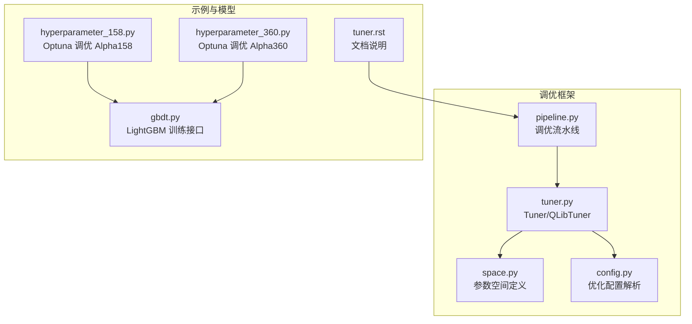
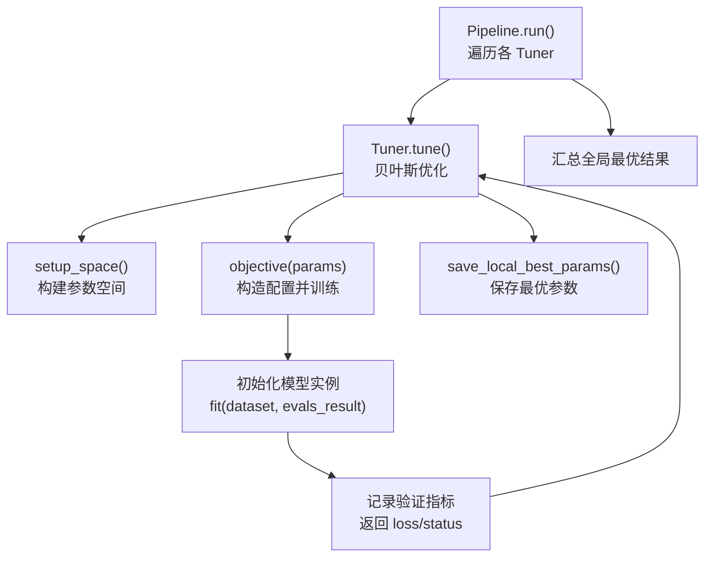
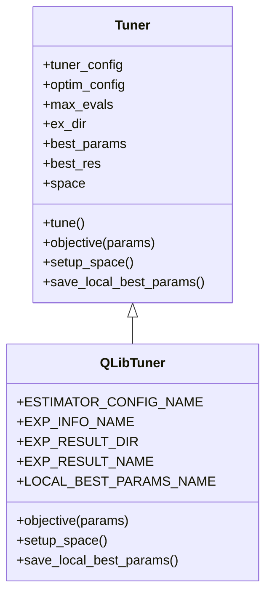
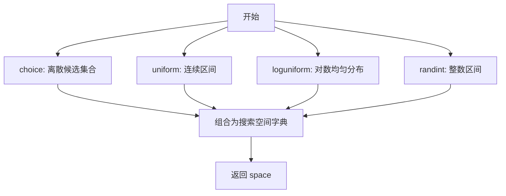
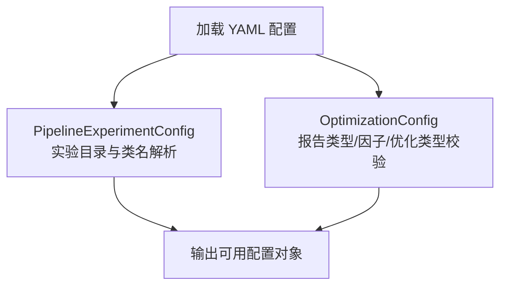
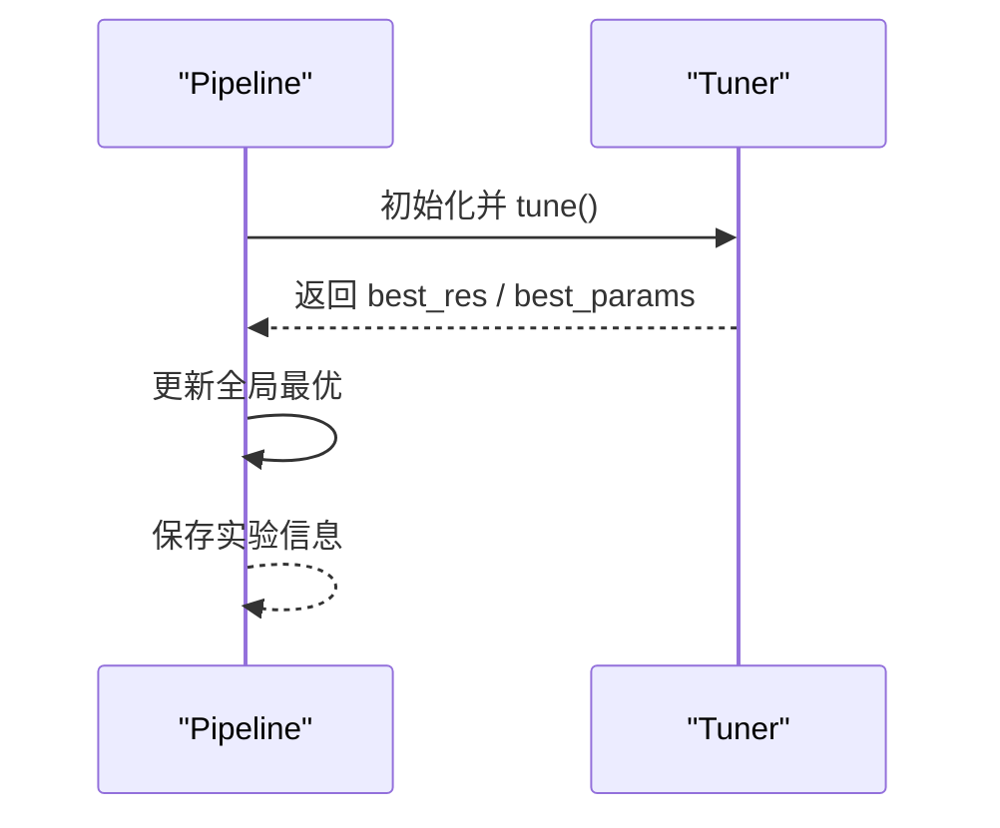
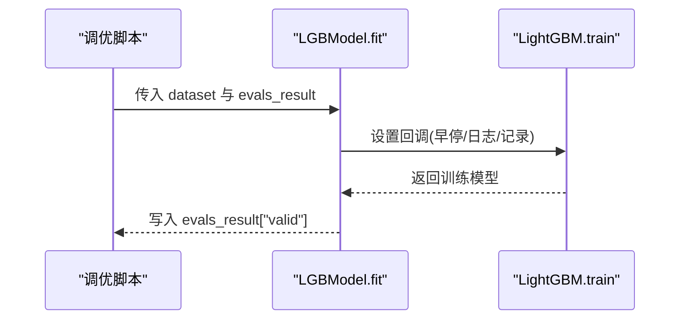
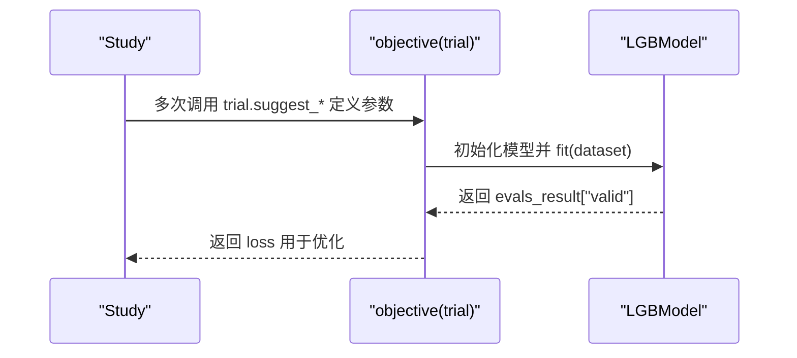
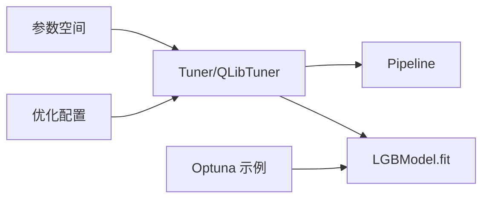

# 超参数调优

<cite>
**本文引用的文件**
- [qlib/contrib/tuner/tuner.py](file://qlib/contrib/tuner/tuner.py)
- [qlib/contrib/tuner/pipeline.py](file://qlib/contrib/tuner/pipeline.py)
- [qlib/contrib/tuner/space.py](file://qlib/contrib/tuner/space.py)
- [qlib/contrib/tuner/config.py](file://qlib/contrib/tuner/config.py)
- [examples/hyperparameter/LightGBM/hyperparameter_158.py](file://examples/hyperparameter/LightGBM/hyperparameter_158.py)
- [examples/hyperparameter/LightGBM/hyperparameter_360.py](file://examples/hyperparameter/LightGBM/hyperparameter_360.py)
- [examples/hyperparameter/LightGBM/Readme.md](file://examples/hyperparameter/LightGBM/Readme.md)
- [contrib/model/gbdt.py](file://qlib/contrib/model/gbdt.py)
- [docs/hidden/tuner.rst](file://docs/hidden/tuner.rst)
</cite>

## 目录
1. [简介](#简介)
2. [项目结构](#项目结构)
3. [核心组件](#核心组件)
4. [架构总览](#架构总览)
5. [详细组件分析](#详细组件分析)
6. [依赖关系分析](#依赖关系分析)
7. [性能考虑](#性能考虑)
8. [故障排查指南](#故障排查指南)
9. [结论](#结论)
10. [附录](#附录)

## 简介
本指南面向在 Qlib 中进行超参数调优的用户，系统讲解基于贝叶斯优化（Hyperopt）与基于 Optuna 的两种主流调优方式，覆盖参数空间定义、优化策略选择、调优过程监控、LightGBM 等模型的最佳实践、完整脚本与配置示例、评估方法与结果分析技巧，以及常见问题与解决方案。读者可据此在 Qlib 工作流中高效完成从数据到模型再到评估的端到端调优。

## 项目结构
围绕超参数调优的相关模块主要分布在以下位置：
- 贝叶斯优化框架：qlib/contrib/tuner/*（Tuner 抽象类、QLibTuner 实现、参数空间定义、管道配置）
- Optuna 示例：examples/hyperparameter/LightGBM/*（Alpha158/Alpha360 的 Optuna 调优脚本）
- 模型适配层：contrib/model/gbdt.py（LightGBM 训练接口与回调）
- 文档参考：docs/hidden/tuner.rst（调优管线与优化目标说明）

图表来源
- [qlib/contrib/tuner/tuner.py:25-82](file://qlib/contrib/tuner/tuner.py#L25-L82)
- [qlib/contrib/tuner/space.py:9-19](file://qlib/contrib/tuner/space.py#L9-L19)
- [qlib/contrib/tuner/config.py:12-31](file://qlib/contrib/tuner/config.py#L12-L31)
- [qlib/contrib/tuner/pipeline.py:33-47](file://qlib/contrib/tuner/pipeline.py#L33-L47)
- [examples/hyperparameter/LightGBM/hyperparameter_158.py:9-34](file://examples/hyperparameter/LightGBM/hyperparameter_158.py#L9-L34)
- [examples/hyperparameter/LightGBM/hyperparameter_360.py:11-37](file://examples/hyperparameter/LightGBM/hyperparameter_360.py#L11-L37)
- [qlib/contrib/model/gbdt.py:57-90](file://qlib/contrib/model/gbdt.py#L57-L90)
- [docs/hidden/tuner.rst:191-216](file://docs/hidden/tuner.rst#L191-L216)

章节来源
- [qlib/contrib/tuner/tuner.py:25-82](file://qlib/contrib/tuner/tuner.py#L25-L82)
- [qlib/contrib/tuner/pipeline.py:33-47](file://qlib/contrib/tuner/pipeline.py#L33-L47)
- [qlib/contrib/tuner/space.py:9-19](file://qlib/contrib/tuner/space.py#L9-L19)
- [qlib/contrib/tuner/config.py:12-31](file://qlib/contrib/tuner/config.py#L12-L31)
- [examples/hyperparameter/LightGBM/hyperparameter_158.py:9-34](file://examples/hyperparameter/LightGBM/hyperparameter_158.py#L9-L34)
- [examples/hyperparameter/LightGBM/hyperparameter_360.py:11-37](file://examples/hyperparameter/LightGBM/hyperparameter_360.py#L11-L37)
- [qlib/contrib/model/gbdt.py:57-90](file://qlib/contrib/model/gbdt.py#L57-L90)
- [docs/hidden/tuner.rst:191-216](file://docs/hidden/tuner.rst#L191-L216)

## 核心组件
- Tuner 抽象类：定义统一的调优接口，包含目标函数、参数空间构建与保存最优参数等抽象方法。
- QLibTuner：基于 Hyperopt 的具体实现，负责将参数空间映射为具体模型配置并执行训练，记录最优结果。
- 参数空间定义：通过 hyperopt 的 hp 构建离散或连续搜索域，支持 choice、uniform、loguniform、randint 等。
- 优化配置：解析 YAML 配置，确定报告类型、优化目标（最小化/最大化/相关性）、时间窗口、回测与客户端配置。
- 调优流水线：按顺序运行多个 Tuner，汇总全局最优结果，便于多模块组合的联合调优。
- LightGBM 训练适配：提供带早停、日志与评估记录的训练接口，便于在调优中获取验证集指标。

章节来源
- [qlib/contrib/tuner/tuner.py:25-82](file://qlib/contrib/tuner/tuner.py#L25-L82)
- [qlib/contrib/tuner/space.py:9-19](file://qlib/contrib/tuner/space.py#L9-L19)
- [qlib/contrib/tuner/config.py:59-91](file://qlib/contrib/tuner/config.py#L59-L91)
- [qlib/contrib/tuner/pipeline.py:33-47](file://qlib/contrib/tuner/pipeline.py#L33-L47)
- [qlib/contrib/model/gbdt.py:57-90](file://qlib/contrib/model/gbdt.py#L57-L90)

## 架构总览
下图展示了 QLib 超参数调优的整体架构：调优流水线驱动多个 Tuner，每个 Tuner 使用参数空间生成候选配置，构造模型并训练，最终记录最优参数与结果。

图表来源
- [qlib/contrib/tuner/pipeline.py:33-47](file://qlib/contrib/tuner/pipeline.py#L33-L47)
- [qlib/contrib/tuner/tuner.py:43-81](file://qlib/contrib/tuner/tuner.py#L43-L81)
- [qlib/contrib/model/gbdt.py:57-90](file://qlib/contrib/model/gbdt.py#L57-L90)

## 详细组件分析

### 组件一：Tuner 抽象类与 QLibTuner 实现
- 抽象方法
  - objective(params)：根据参数生成模型配置并训练，返回损失与状态。
  - setup_space()：定义搜索空间字典。
  - save_local_best_params()：保存当前 Tuner 的最优参数。
- QLibTuner 关键流程
  - 将参数映射到模型与策略空间，写入临时配置文件。
  - 启动估计器进程，收集训练日志与验证指标。
  - 更新 best_params 与 best_res，并持久化本地最优参数。

图表来源
- [qlib/contrib/tuner/tuner.py:25-82](file://qlib/contrib/tuner/tuner.py#L25-L82)

章节来源
- [qlib/contrib/tuner/tuner.py:25-82](file://qlib/contrib/tuner/tuner.py#L25-L82)

### 组件二：参数空间定义（Hyperopt）
- 支持多种采样分布：choice、uniform、loguniform、randint。
- 常见场景：策略参数（如 topk、buffer_margin）、数据标签集合、模型超参（学习率、子采样、正则等）。

图表来源
- [qlib/contrib/tuner/space.py:9-19](file://qlib/contrib/tuner/space.py#L9-L19)

章节来源
- [qlib/contrib/tuner/space.py:9-19](file://qlib/contrib/tuner/space.py#L9-L19)

### 组件三：优化配置解析（YAML）
- 解析实验目录、结果目录、调优器类路径与类名。
- 解析优化目标：报告类型（如预测方向、超额收益）、报告因子（如信息比率、最大回撤）、优化类型（最小化/最大化/相关性）。

图表来源
- [qlib/contrib/tuner/config.py:12-31](file://qlib/contrib/tuner/config.py#L12-L31)
- [qlib/contrib/tuner/config.py:59-91](file://qlib/contrib/tuner/config.py#L59-L91)

章节来源
- [qlib/contrib/tuner/config.py:12-31](file://qlib/contrib/tuner/config.py#L12-L31)
- [qlib/contrib/tuner/config.py:59-91](file://qlib/contrib/tuner/config.py#L59-L91)

### 组件四：调优流水线（Pipeline）
- 顺序运行多个 Tuner，比较各 Tuner 的 best_res，记录全局最优参数与对应索引。
- 最终保存整体实验信息，便于复盘与对比。

图表来源
- [qlib/contrib/tuner/pipeline.py:33-47](file://qlib/contrib/tuner/pipeline.py#L33-L47)

章节来源
- [qlib/contrib/tuner/pipeline.py:33-47](file://qlib/contrib/tuner/pipeline.py#L33-L47)

### 组件五：LightGBM 训练接口与调优最佳实践
- 训练接口要点
  - 支持早停、日志打印与评估记录回调。
  - 将验证集指标写入 evals_result，供外部调优器读取。
- 调优建议
  - 先固定树深度、叶子数等结构性参数，再调学习率与正则。
  - 子采样、列采样、特征分数等可并行搜索，注意与早停结合。
  - 使用对数尺度搜索正则项，提升搜索效率。

图表来源
- [qlib/contrib/model/gbdt.py:57-90](file://qlib/contrib/model/gbdt.py#L57-L90)

章节来源
- [qlib/contrib/model/gbdt.py:57-90](file://qlib/contrib/model/gbdt.py#L57-L90)

### 组件六：基于 Optuna 的 LightGBM 调优（示例）
- Alpha158 与 Alpha360 两套脚本，分别通过 Optuna 的 suggest 接口定义参数空间，训练后返回验证集上的最小损失。
- 通过 study.optimize 并行搜索，支持 SQLite 存储与 dashboard 可视化。

图表来源
- [examples/hyperparameter/LightGBM/hyperparameter_158.py:9-34](file://examples/hyperparameter/LightGBM/hyperparameter_158.py#L9-L34)
- [examples/hyperparameter/LightGBM/hyperparameter_360.py:11-37](file://examples/hyperparameter/LightGBM/hyperparameter_360.py#L11-L37)

章节来源
- [examples/hyperparameter/LightGBM/hyperparameter_158.py:9-34](file://examples/hyperparameter/LightGBM/hyperparameter_158.py#L9-L34)
- [examples/hyperparameter/LightGBM/hyperparameter_360.py:11-37](file://examples/hyperparameter/LightGBM/hyperparameter_360.py#L11-L37)
- [examples/hyperparameter/LightGBM/Readme.md:1-24](file://examples/hyperparameter/LightGBM/Readme.md#L1-L24)

## 依赖关系分析
- 组件耦合
  - Tuner 依赖于参数空间与优化配置；QLibTuner 通过 setup_estimator_config 将参数映射为模型配置。
  - Pipeline 串联多个 Tuner，共享全局最优结果。
  - LightGBM 训练接口被调优脚本与 Tuner 共同使用。
- 外部依赖
  - Hyperopt（贝叶斯优化）、Optuna（随机/贝叶斯搜索）、LightGBM（训练与回调）。

图表来源
- [qlib/contrib/tuner/tuner.py:25-82](file://qlib/contrib/tuner/tuner.py#L25-L82)
- [qlib/contrib/tuner/config.py:12-31](file://qlib/contrib/tuner/config.py#L12-L31)
- [qlib/contrib/tuner/pipeline.py:33-47](file://qlib/contrib/tuner/pipeline.py#L33-L47)
- [qlib/contrib/model/gbdt.py:57-90](file://qlib/contrib/model/gbdt.py#L57-L90)
- [examples/hyperparameter/LightGBM/hyperparameter_158.py:9-34](file://examples/hyperparameter/LightGBM/hyperparameter_158.py#L9-L34)

章节来源
- [qlib/contrib/tuner/tuner.py:25-82](file://qlib/contrib/tuner/tuner.py#L25-L82)
- [qlib/contrib/tuner/config.py:12-31](file://qlib/contrib/tuner/config.py#L12-L31)
- [qlib/contrib/tuner/pipeline.py:33-47](file://qlib/contrib/tuner/pipeline.py#L33-L47)
- [qlib/contrib/model/gbdt.py:57-90](file://qlib/contrib/model/gbdt.py#L57-L90)
- [examples/hyperparameter/LightGBM/hyperparameter_158.py:9-34](file://examples/hyperparameter/LightGBM/hyperparameter_158.py#L9-L34)

## 性能考虑
- 搜索效率
  - 对于连续参数优先采用对数尺度（如正则）以提升探索效率。
  - 先粗后细：先大范围搜索，再在局部精细搜索。
- 计算资源
  - 利用 n_jobs 或分布式执行（Optuna）或并行进程（QLibTuner）加速搜索。
  - 结合早停减少无效迭代，避免过拟合。
- 指标稳定性
  - 使用滚动/分层划分，避免时间泄漏。
  - 多折交叉或多时间段验证，降低波动影响。

## 故障排查指南
- 调优未收敛或震荡
  - 检查参数范围是否过大或过小；适当缩小搜索区间。
  - 调整早停轮数与验证集指标，确保稳定可比。
- 指标异常或 NaN
  - 在 objective 中对 evals_result 进行空值处理，避免 NaN 导致优化失败。
- 配置错误
  - 确认 YAML 中 report_type、report_factor、optim_type 的取值合法。
  - 确保实验目录存在且可写，避免保存最优参数时报错。
- Optuna 存储与可视化
  - 确保 SQLite 存储路径正确，dashboard 端口未被占用。
  - 如需重置研究，清理数据库或更换 study 名称。

章节来源
- [qlib/contrib/tuner/config.py:59-91](file://qlib/contrib/tuner/config.py#L59-L91)
- [qlib/contrib/tuner/tuner.py:91-120](file://qlib/contrib/tuner/tuner.py#L91-L120)
- [examples/hyperparameter/LightGBM/Readme.md:1-24](file://examples/hyperparameter/LightGBM/Readme.md#L1-L24)

## 结论
Qlib 提供了两条清晰的超参数调优路径：基于 Hyperopt 的 Tuner 流水线与基于 Optuna 的示例脚本。前者适合复杂模块组合与多策略联合优化，后者适合快速验证与可视化。结合 LightGBM 的训练接口与早停机制，可在保证稳定性的同时高效探索参数空间。建议在实际工程中结合业务数据与计算资源，制定合理的参数范围、评估指标与并行策略，并建立完善的日志与可视化体系以支撑持续迭代。

## 附录
- 调优流程清单
  - 明确优化目标与评估指标（文档中给出的优化类型与因子）。
  - 设计参数空间（离散/连续/对数尺度），并设置合理边界。
  - 选择优化策略（贝叶斯/随机/网格），并配置并行度。
  - 指定早停与验证集，确保指标稳定可比。
  - 记录与可视化搜索过程，保存最优参数与结果。
- 参考文档
  - 调优流水线与优化目标说明：[docs/hidden/tuner.rst:191-216](file://docs/hidden/tuner.rst#L191-L216)