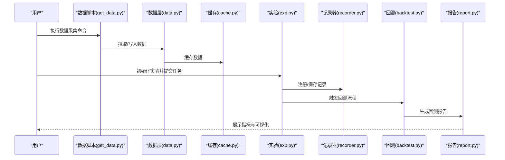
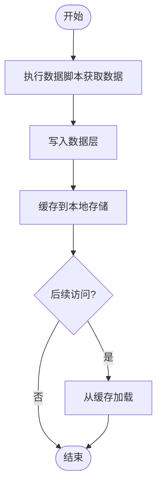
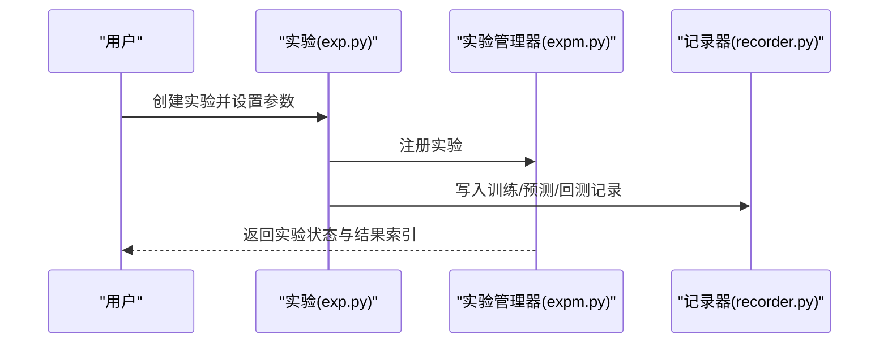
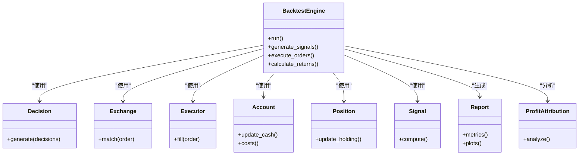
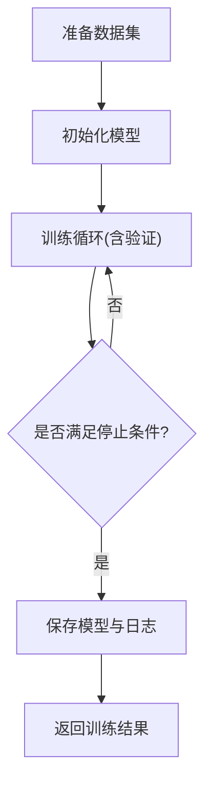
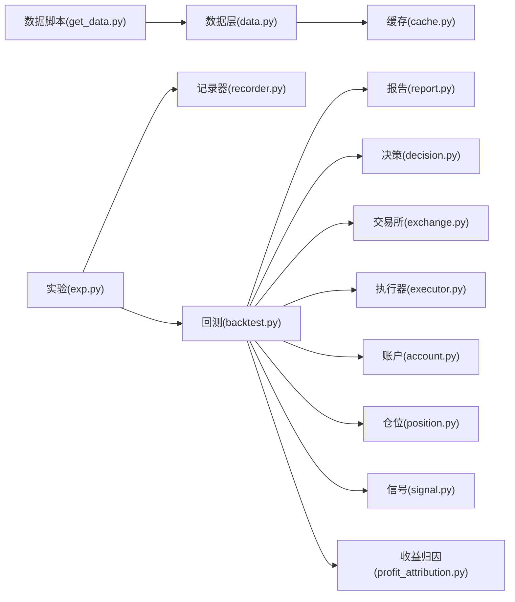

# 基础示例

<cite>
**本文引用的文件**
- [examples/data_demo/data_cache_demo.py](file://examples/data_demo/data_cache_demo.py)
- [examples/data_demo/data_mem_resuse_demo.py](file://examples/data_demo/data_mem_resuse_demo.py)
- [examples/workflow_by_code.py](file://examples/workflow_by_code.py)
- [qlib/data/__init__.py](file://qlib/data/__init__.py)
- [qlib/data/cache.py](file://qlib/data/cache.py)
- [qlib/data/data.py](file://qlib/data/data.py)
- [qlib/workflow/exp.py](file://qlib/workflow/exp.py)
- [qlib/workflow/expm.py](file://qlib/workflow/expm.py)
- [qlib/workflow/recorder.py](file://qlib/workflow/recorder.py)
- [qlib/backtest/backtest.py](file://qlib/backtest/backtest.py)
- [qlib/backtest/report.py](file://qlib/backtest/report.py)
- [qlib/backtest/decision.py](file://qlib/backtest/decision.py)
- [qlib/backtest/exchange.py](file://qlib/backtest/exchange.py)
- [qlib/backtest/executor.py](file://qlib/backtest/executor.py)
- [qlib/backtest/account.py](file://qlib/backtest/account.py)
- [qlib/backtest/position.py](file://qlib/backtest/position.py)
- [qlib/backtest/signal.py](file://qlib/backtest/signal.py)
- [qlib/backtest/utils.py](file://qlib/backtest/utils.py)
- [qlib/backtest/profit_attribution.py](file://qlib/backtest/profit_attribution.py)
- [qlib/model/trainer.py](file://qlib/model/trainer.py)
- [qlib/model/base.py](file://qlib/model/base.py)
- [qlib/config.py](file://qlib/config.py)
- [qlib/constant.py](file://qlib/constant.py)
- [scripts/get_data.py](file://scripts/get_data.py)
</cite>

## 目录
1. [简介](#简介)
2. [项目结构](#项目结构)
3. [核心组件](#核心组件)
4. [架构总览](#架构总览)
5. [详细组件分析](#详细组件分析)
6. [依赖关系分析](#依赖关系分析)
7. [性能考虑](#性能考虑)
8. [故障排查指南](#故障排查指南)
9. [结论](#结论)
10. [附录](#附录)

## 简介
本文件面向初学者，系统讲解如何使用 Qlib 完成“数据获取—数据缓存—模型训练—回测执行”的完整入门流程。内容覆盖以下要点：
- 数据提供与获取：通过内置脚本或数据提供器拉取市场数据
- 数据缓存机制：利用 Qlib 的缓存层提升重复访问效率
- 模型训练：以代码方式组织训练流程，复现实验
- 回测执行：从下单决策到资金账户、收益归因的全流程回测
- 关键概念：数据提供器、工作流配置、实验管理、记录器
- 可重复性：提供可直接运行的示例路径与预期输出说明
- 调试与排错：常见问题定位与解决建议

## 项目结构
为便于理解，下面给出与“基础示例”相关的目录与文件概览（仅展示与本文目标强相关的部分）：

```mermaid
graph TB
subgraph "示例"
D1["examples/data_demo/data_cache_demo.py"]
D2["examples/data_demo/data_mem_resuse_demo.py"]
W1["examples/workflow_by_code.py"]
end
subgraph "数据层"
DL1["qlib/data/__init__.py"]
DL2["qlib/data/cache.py"]
DL3["qlib/data/data.py"]
end
subgraph "工作流"
WF1["qlib/workflow/exp.py"]
WF2["qlib/workflow/expm.py"]
WF3["qlib/workflow/recorder.py"]
end
subgraph "回测"
BT1["qlib/backtest/backtest.py"]
BT2["qlib/backtest/report.py"]
BT3["qlib/backtest/decision.py"]
BT4["qlib/backtest/exchange.py"]
BT5["qlib/backtest/executor.py"]
BT6["qlib/backtest/account.py"]
BT7["qlib/backtest/position.py"]
BT8["qlib/backtest/signal.py"]
BT9["qlib/backtest/utils.py"]
BT10["qlib/backtest/profit_attribution.py"]
end
subgraph "模型"
M1["qlib/model/trainer.py"]
M2["qlib/model/base.py"]
end
subgraph "配置与常量"
C1["qlib/config.py"]
C2["qlib/constant.py"]
end
subgraph "数据采集脚本"
S1["scripts/get_data.py"]
end
D1 --> DL3
D2 --> DL2
W1 --> WF1
WF1 --> WF2
WF1 --> WF3
WF1 --> BT1
BT1 --> BT2
BT1 --> BT3
BT1 --> BT4
BT1 --> BT5
BT1 --> BT6
BT1 --> BT7
BT1 --> BT8
BT1 --> BT9
BT1 --> BT10
M1 --> WF1
M2 --> WF1
C1 --> DL3
C2 --> DL3
S1 --> DL3
```

图示来源
- [examples/data_demo/data_cache_demo.py](file://examples/data_demo/data_cache_demo.py)
- [examples/data_demo/data_mem_resuse_demo.py](file://examples/data_demo/data_mem_resuse_demo.py)
- [examples/workflow_by_code.py](file://examples/workflow_by_code.py)
- [qlib/data/__init__.py](file://qlib/data/__init__.py)
- [qlib/data/cache.py](file://qlib/data/cache.py)
- [qlib/data/data.py](file://qlib/data/data.py)
- [qlib/workflow/exp.py](file://qlib/workflow/exp.py)
- [qlib/workflow/expm.py](file://qlib/workflow/expm.py)
- [qlib/workflow/recorder.py](file://qlib/workflow/recorder.py)
- [qlib/backtest/backtest.py](file://qlib/backtest/backtest.py)
- [qlib/backtest/report.py](file://qlib/backtest/report.py)
- [qlib/backtest/decision.py](file://qlib/backtest/decision.py)
- [qlib/backtest/exchange.py](file://qlib/backtest/exchange.py)
- [qlib/backtest/executor.py](file://qlib/backtest/executor.py)
- [qlib/backtest/account.py](file://qlib/backtest/account.py)
- [qlib/backtest/position.py](file://qlib/backtest/position.py)
- [qlib/backtest/signal.py](file://qlib/backtest/signal.py)
- [qlib/backtest/utils.py](file://qlib/backtest/utils.py)
- [qlib/backtest/profit_attribution.py](file://qlib/backtest/profit_attribution.py)
- [qlib/model/trainer.py](file://qlib/model/trainer.py)
- [qlib/model/base.py](file://qlib/model/base.py)
- [qlib/config.py](file://qlib/config.py)
- [qlib/constant.py](file://qlib/constant.py)
- [scripts/get_data.py](file://scripts/get_data.py)

章节来源
- [examples/data_demo/data_cache_demo.py](file://examples/data_demo/data_cache_demo.py)
- [examples/data_demo/data_mem_resuse_demo.py](file://examples/data_demo/data_mem_resuse_demo.py)
- [examples/workflow_by_code.py](file://examples/workflow_by_code.py)
- [qlib/data/data.py](file://qlib/data/data.py)
- [qlib/workflow/exp.py](file://qlib/workflow/exp.py)
- [qlib/workflow/expm.py](file://qlib/workflow/expm.py)
- [qlib/workflow/recorder.py](file://qlib/workflow/recorder.py)
- [qlib/backtest/backtest.py](file://qlib/backtest/backtest.py)
- [qlib/backtest/report.py](file://qlib/backtest/report.py)
- [qlib/backtest/decision.py](file://qlib/backtest/decision.py)
- [qlib/backtest/exchange.py](file://qlib/backtest/exchange.py)
- [qlib/backtest/executor.py](file://qlib/backtest/executor.py)
- [qlib/backtest/account.py](file://qlib/backtest/account.py)
- [qlib/backtest/position.py](file://qlib/backtest/position.py)
- [qlib/backtest/signal.py](file://qlib/backtest/signal.py)
- [qlib/backtest/utils.py](file://qlib/backtest/utils.py)
- [qlib/backtest/profit_attribution.py](file://qlib/backtest/profit_attribution.py)
- [qlib/model/trainer.py](file://qlib/model/trainer.py)
- [qlib/model/base.py](file://qlib/model/base.py)
- [qlib/config.py](file://qlib/config.py)
- [qlib/constant.py](file://qlib/constant.py)
- [scripts/get_data.py](file://scripts/get_data.py)

## 核心组件
- 数据提供与获取
  - 使用数据脚本从指定数据源拉取数据，支持增量更新与格式转换
  - 数据层提供统一的数据接口与缓存能力，加速重复访问
- 工作流与实验管理
  - 通过实验对象组织训练、预测、回测等任务，并由记录器持久化结果
- 回测引擎
  - 决策、交易所、执行器、账户、仓位、信号、报告、收益归因等模块协同完成回测
- 模型训练
  - 训练器封装训练循环，模型基类定义接口契约

章节来源
- [qlib/data/data.py](file://qlib/data/data.py)
- [qlib/data/cache.py](file://qlib/data/cache.py)
- [qlib/workflow/exp.py](file://qlib/workflow/exp.py)
- [qlib/workflow/expm.py](file://qlib/workflow/expm.py)
- [qlib/workflow/recorder.py](file://qlib/workflow/recorder.py)
- [qlib/backtest/backtest.py](file://qlib/backtest/backtest.py)
- [qlib/backtest/report.py](file://qlib/backtest/report.py)
- [qlib/backtest/decision.py](file://qlib/backtest/decision.py)
- [qlib/backtest/exchange.py](file://qlib/backtest/exchange.py)
- [qlib/backtest/executor.py](file://qlib/backtest/executor.py)
- [qlib/backtest/account.py](file://qlib/backtest/account.py)
- [qlib/backtest/position.py](file://qlib/backtest/position.py)
- [qlib/backtest/signal.py](file://qlib/backtest/signal.py)
- [qlib/backtest/utils.py](file://qlib/backtest/utils.py)
- [qlib/backtest/profit_attribution.py](file://qlib/backtest/profit_attribution.py)
- [qlib/model/trainer.py](file://qlib/model/trainer.py)
- [qlib/model/base.py](file://qlib/model/base.py)

## 架构总览
下图展示了从“数据获取—缓存—工作流—回测—报告”的端到端流程。

图示来源
- [scripts/get_data.py](file://scripts/get_data.py)
- [qlib/data/data.py](file://qlib/data/data.py)
- [qlib/data/cache.py](file://qlib/data/cache.py)
- [qlib/workflow/exp.py](file://qlib/workflow/exp.py)
- [qlib/workflow/recorder.py](file://qlib/workflow/recorder.py)
- [qlib/backtest/backtest.py](file://qlib/backtest/backtest.py)
- [qlib/backtest/report.py](file://qlib/backtest/report.py)

## 详细组件分析

### 数据获取与缓存
- 数据获取
  - 使用数据脚本从指定数据源抓取市场数据，支持增量更新与格式转换
  - 示例路径参考：[scripts/get_data.py](file://scripts/get_data.py)
- 数据缓存
  - 数据层提供缓存能力，避免重复下载与解析，显著提升二次运行速度
  - 示例路径参考：[qlib/data/cache.py](file://qlib/data/cache.py)
- 内存复用演示
  - 展示如何在内存中高效复用数据对象，减少资源占用
  - 示例路径参考：[examples/data_demo/data_mem_resuse_demo.py](file://examples/data_demo/data_mem_resuse_demo.py)

图示来源
- [scripts/get_data.py](file://scripts/get_data.py)
- [qlib/data/cache.py](file://qlib/data/cache.py)
- [qlib/data/data.py](file://qlib/data/data.py)

章节来源
- [scripts/get_data.py](file://scripts/get_data.py)
- [qlib/data/cache.py](file://qlib/data/cache.py)
- [qlib/data/data.py](file://qlib/data/data.py)
- [examples/data_demo/data_mem_resuse_demo.py](file://examples/data_demo/data_mem_resuse_demo.py)

### 工作流与实验管理
- 实验对象
  - 实验负责组织训练、预测、回测等任务，支持参数化与可复现实验
  - 示例路径参考：[qlib/workflow/exp.py](file://qlib/workflow/exp.py)
- 实验管理器
  - 管理多个实验生命周期，提供注册、查询、清理等功能
  - 示例路径参考：[qlib/workflow/expm.py](file://qlib/workflow/expm.py)
- 记录器
  - 将实验过程中的中间结果、模型、报告等持久化，便于复盘
  - 示例路径参考：[qlib/workflow/recorder.py](file://qlib/workflow/recorder.py)

图示来源
- [qlib/workflow/exp.py](file://qlib/workflow/exp.py)
- [qlib/workflow/expm.py](file://qlib/workflow/expm.py)
- [qlib/workflow/recorder.py](file://qlib/workflow/recorder.py)

章节来源
- [qlib/workflow/exp.py](file://qlib/workflow/exp.py)
- [qlib/workflow/expm.py](file://qlib/workflow/expm.py)
- [qlib/workflow/recorder.py](file://qlib/workflow/recorder.py)

### 回测执行
- 回测主流程
  - 组织决策、交易所、执行器、账户、仓位、信号、报告、收益归因等模块
  - 示例路径参考：[qlib/backtest/backtest.py](file://qlib/backtest/backtest.py)
- 报告与分析
  - 生成策略收益、风险指标、分位表现等报告
  - 示例路径参考：[qlib/backtest/report.py](file://qlib/backtest/report.py)
- 决策与信号
  - 决策模块根据信号生成买卖指令；信号模块负责特征与打分
  - 示例路径参考：[qlib/backtest/decision.py](file://qlib/backtest/decision.py)、[qlib/backtest/signal.py](file://qlib/backtest/signal.py)
- 交易执行
  - 交易所模拟市场撮合，执行器处理订单成交与滑点
  - 示例路径参考：[qlib/backtest/exchange.py](file://qlib/backtest/exchange.py)、[qlib/backtest/executor.py](file://qlib/backtest/executor.py)
- 账户与仓位
  - 账户管理资金与费用；仓位管理头寸变化
  - 示例路径参考：[qlib/backtest/account.py](file://qlib/backtest/account.py)、[qlib/backtest/position.py](file://qlib/backtest/position.py)
- 收益归因
  - 分析收益来源，拆解风格与个股贡献
  - 示例路径参考：[qlib/backtest/profit_attribution.py](file://qlib/backtest/profit_attribution.py)
- 工具与辅助
  - 提供回测常用工具函数与辅助方法
  - 示例路径参考：[qlib/backtest/utils.py](file://qlib/backtest/utils.py)

图示来源
- [qlib/backtest/backtest.py](file://qlib/backtest/backtest.py)
- [qlib/backtest/decision.py](file://qlib/backtest/decision.py)
- [qlib/backtest/exchange.py](file://qlib/backtest/exchange.py)
- [qlib/backtest/executor.py](file://qlib/backtest/executor.py)
- [qlib/backtest/account.py](file://qlib/backtest/account.py)
- [qlib/backtest/position.py](file://qlib/backtest/position.py)
- [qlib/backtest/signal.py](file://qlib/backtest/signal.py)
- [qlib/backtest/report.py](file://qlib/backtest/report.py)
- [qlib/backtest/profit_attribution.py](file://qlib/backtest/profit_attribution.py)

章节来源
- [qlib/backtest/backtest.py](file://qlib/backtest/backtest.py)
- [qlib/backtest/report.py](file://qlib/backtest/report.py)
- [qlib/backtest/decision.py](file://qlib/backtest/decision.py)
- [qlib/backtest/exchange.py](file://qlib/backtest/exchange.py)
- [qlib/backtest/executor.py](file://qlib/backtest/executor.py)
- [qlib/backtest/account.py](file://qlib/backtest/account.py)
- [qlib/backtest/position.py](file://qlib/backtest/position.py)
- [qlib/backtest/signal.py](file://qlib/backtest/signal.py)
- [qlib/backtest/utils.py](file://qlib/backtest/utils.py)
- [qlib/backtest/profit_attribution.py](file://qlib/backtest/profit_attribution.py)

### 模型训练
- 训练器
  - 封装训练循环、验证、早停、日志等通用逻辑
  - 示例路径参考：[qlib/model/trainer.py](file://qlib/model/trainer.py)
- 模型基类
  - 定义模型接口契约，统一 fit/predict 接口
  - 示例路径参考：[qlib/model/base.py](file://qlib/model/base.py)

图示来源
- [qlib/model/trainer.py](file://qlib/model/trainer.py)
- [qlib/model/base.py](file://qlib/model/base.py)

章节来源
- [qlib/model/trainer.py](file://qlib/model/trainer.py)
- [qlib/model/base.py](file://qlib/model/base.py)

### 代码示例与运行步骤

- 数据获取示例
  - 步骤
    1) 准备数据脚本与数据源配置
    2) 执行数据采集命令，将数据写入数据层
    3) 验证缓存是否生效（二次运行应更快）
  - 参考路径
    - [scripts/get_data.py](file://scripts/get_data.py)
    - [qlib/data/data.py](file://qlib/data/data.py)
    - [qlib/data/cache.py](file://qlib/data/cache.py)
  - 预期结果
    - 数据文件成功落盘，缓存命中后二次运行时间明显缩短

- 数据缓存示例
  - 步骤
    1) 运行缓存演示脚本
    2) 观察缓存命中率与内存占用变化
  - 参考路径
    - [examples/data_demo/data_cache_demo.py](file://examples/data_demo/data_cache_demo.py)
    - [qlib/data/cache.py](file://qlib/data/cache.py)
  - 预期结果
    - 缓存命中率提升，重复访问延迟降低

- 工作流与实验管理示例
  - 步骤
    1) 初始化实验对象
    2) 设置训练/回测参数
    3) 提交任务并等待完成
    4) 查看记录器中的产物
  - 参考路径
    - [examples/workflow_by_code.py](file://examples/workflow_by_code.py)
    - [qlib/workflow/exp.py](file://qlib/workflow/exp.py)
    - [qlib/workflow/expm.py](file://qlib/workflow/expm.py)
    - [qlib/workflow/recorder.py](file://qlib/workflow/recorder.py)
  - 预期结果
    - 实验成功注册，记录器中出现训练、预测、回测记录

- 回测执行示例
  - 步骤
    1) 准备信号与策略
    2) 初始化回测引擎
    3) 执行回测并生成报告
  - 参考路径
    - [qlib/backtest/backtest.py](file://qlib/backtest/backtest.py)
    - [qlib/backtest/report.py](file://qlib/backtest/report.py)
    - [qlib/backtest/decision.py](file://qlib/backtest/decision.py)
    - [qlib/backtest/exchange.py](file://qlib/backtest/exchange.py)
    - [qlib/backtest/executor.py](file://qlib/backtest/executor.py)
    - [qlib/backtest/account.py](file://qlib/backtest/account.py)
    - [qlib/backtest/position.py](file://qlib/backtest/position.py)
    - [qlib/backtest/signal.py](file://qlib/backtest/signal.py)
    - [qlib/backtest/profit_attribution.py](file://qlib/backtest/profit_attribution.py)
  - 预期结果
    - 生成收益曲线、最大回撤、夏普比率等指标与可视化图表

- 模型训练示例
  - 步骤
    1) 准备训练数据与模型
    2) 启动训练器进行训练
    3) 保存模型并进行预测
  - 参考路径
    - [qlib/model/trainer.py](file://qlib/model/trainer.py)
    - [qlib/model/base.py](file://qlib/model/base.py)
  - 预期结果
    - 训练收敛，模型可对测试集进行预测

## 依赖关系分析
- 组件耦合
  - 数据层与缓存层低耦合，通过统一接口交互
  - 工作流与回测模块通过实验对象解耦，便于扩展
  - 回测内部各子模块职责清晰，接口稳定
- 外部依赖
  - 数据脚本依赖外部数据源；回测依赖市场数据与因子
  - 记录器依赖持久化存储；训练器依赖优化器与损失函数

图示来源
- [scripts/get_data.py](file://scripts/get_data.py)
- [qlib/data/data.py](file://qlib/data/data.py)
- [qlib/data/cache.py](file://qlib/data/cache.py)
- [qlib/workflow/exp.py](file://qlib/workflow/exp.py)
- [qlib/workflow/recorder.py](file://qlib/workflow/recorder.py)
- [qlib/backtest/backtest.py](file://qlib/backtest/backtest.py)
- [qlib/backtest/report.py](file://qlib/backtest/report.py)
- [qlib/backtest/decision.py](file://qlib/backtest/decision.py)
- [qlib/backtest/exchange.py](file://qlib/backtest/exchange.py)
- [qlib/backtest/executor.py](file://qlib/backtest/executor.py)
- [qlib/backtest/account.py](file://qlib/backtest/account.py)
- [qlib/backtest/position.py](file://qlib/backtest/position.py)
- [qlib/backtest/signal.py](file://qlib/backtest/signal.py)
- [qlib/backtest/profit_attribution.py](file://qlib/backtest/profit_attribution.py)

章节来源
- [scripts/get_data.py](file://scripts/get_data.py)
- [qlib/data/data.py](file://qlib/data/data.py)
- [qlib/data/cache.py](file://qlib/data/cache.py)
- [qlib/workflow/exp.py](file://qlib/workflow/exp.py)
- [qlib/workflow/recorder.py](file://qlib/workflow/recorder.py)
- [qlib/backtest/backtest.py](file://qlib/backtest/backtest.py)
- [qlib/backtest/report.py](file://qlib/backtest/report.py)
- [qlib/backtest/decision.py](file://qlib/backtest/decision.py)
- [qlib/backtest/exchange.py](file://qlib/backtest/exchange.py)
- [qlib/backtest/executor.py](file://qlib/backtest/executor.py)
- [qlib/backtest/account.py](file://qlib/backtest/account.py)
- [qlib/backtest/position.py](file://qlib/backtest/position.py)
- [qlib/backtest/signal.py](file://qlib/backtest/signal.py)
- [qlib/backtest/profit_attribution.py](file://qlib/backtest/profit_attribution.py)

## 性能考虑
- 数据缓存
  - 利用缓存减少重复下载与解析，二次运行显著提速
- 内存复用
  - 在数据对象层面进行复用，降低内存峰值与GC压力
- 回测优化
  - 合理设置交易成本、滑点与交易频率，平衡精度与性能
- 训练优化
  - 使用合适的批大小、学习率与早停策略，避免过拟合并缩短训练时间

## 故障排查指南
- 数据无法获取
  - 检查数据脚本配置与网络连通性
  - 参考：[scripts/get_data.py](file://scripts/get_data.py)
- 缓存未生效
  - 确认缓存路径与权限；检查缓存键是否正确
  - 参考：[qlib/data/cache.py](file://qlib/data/cache.py)
- 回测异常
  - 检查信号生成与决策逻辑；核对交易成本与滑点设置
  - 参考：[qlib/backtest/backtest.py](file://qlib/backtest/backtest.py)、[qlib/backtest/decision.py](file://qlib/backtest/decision.py)、[qlib/backtest/exchange.py](file://qlib/backtest/exchange.py)
- 记录器写入失败
  - 检查存储路径与权限；确认记录器注册流程
  - 参考：[qlib/workflow/recorder.py](file://qlib/workflow/recorder.py)
- 实验无法注册
  - 检查实验参数与管理器状态
  - 参考：[qlib/workflow/exp.py](file://qlib/workflow/exp.py)、[qlib/workflow/expm.py](file://qlib/workflow/expm.py)

章节来源
- [scripts/get_data.py](file://scripts/get_data.py)
- [qlib/data/cache.py](file://qlib/data/cache.py)
- [qlib/backtest/backtest.py](file://qlib/backtest/backtest.py)
- [qlib/backtest/decision.py](file://qlib/backtest/decision.py)
- [qlib/backtest/exchange.py](file://qlib/backtest/exchange.py)
- [qlib/workflow/recorder.py](file://qlib/workflow/recorder.py)
- [qlib/workflow/exp.py](file://qlib/workflow/exp.py)
- [qlib/workflow/expm.py](file://qlib/workflow/expm.py)

## 结论
通过本指南，您可以在 Qlib 中完成从数据获取、缓存、工作流管理到回测与报告的完整入门流程。建议先从数据缓存与工作流示例入手，再逐步扩展到回测与模型训练，最终形成可复现、可维护的实验流水线。

## 附录
- 关键概念速览
  - 数据提供器：统一数据接入与格式化
  - 工作流配置：参数化实验与任务编排
  - 实验管理：实验生命周期与产物管理
- 可直接运行的示例路径
  - 数据获取：[scripts/get_data.py](file://scripts/get_data.py)
  - 数据缓存：[examples/data_demo/data_cache_demo.py](file://examples/data_demo/data_cache_demo.py)
  - 工作流与实验：[examples/workflow_by_code.py](file://examples/workflow_by_code.py)
  - 回测执行：[qlib/backtest/backtest.py](file://qlib/backtest/backtest.py)
  - 模型训练：[qlib/model/trainer.py](file://qlib/model/trainer.py)