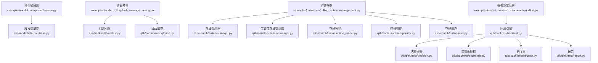
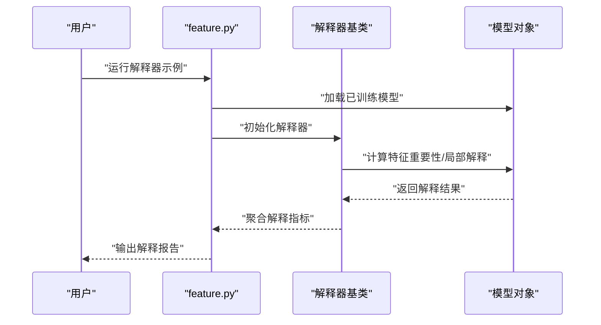
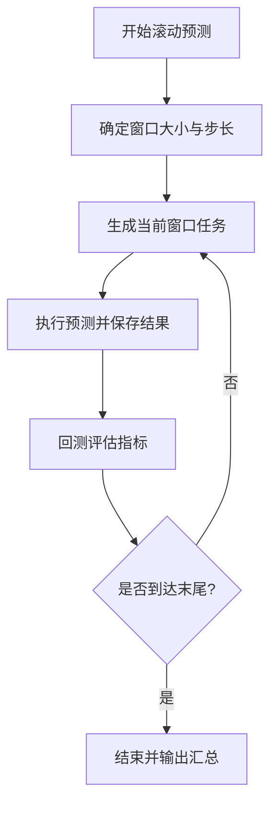
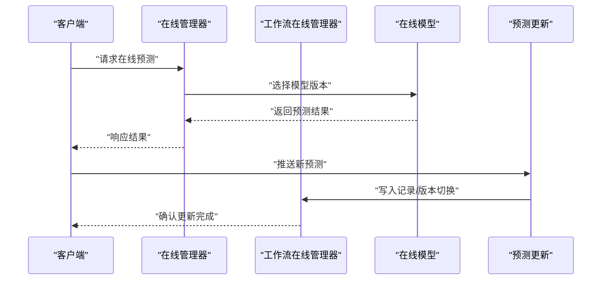
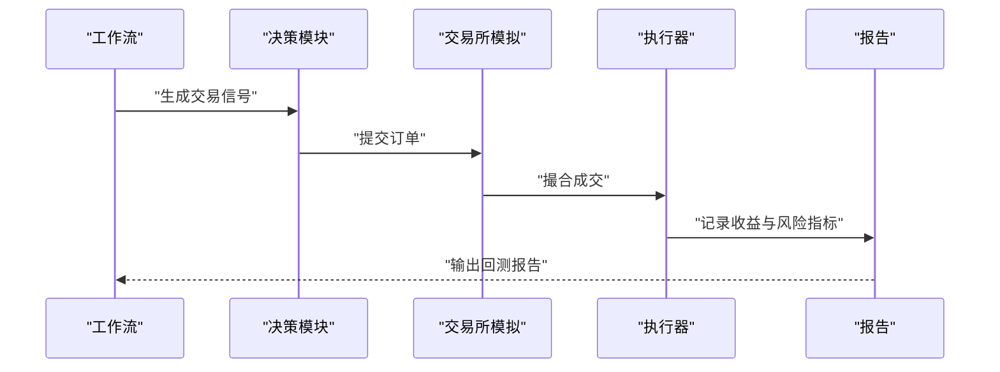
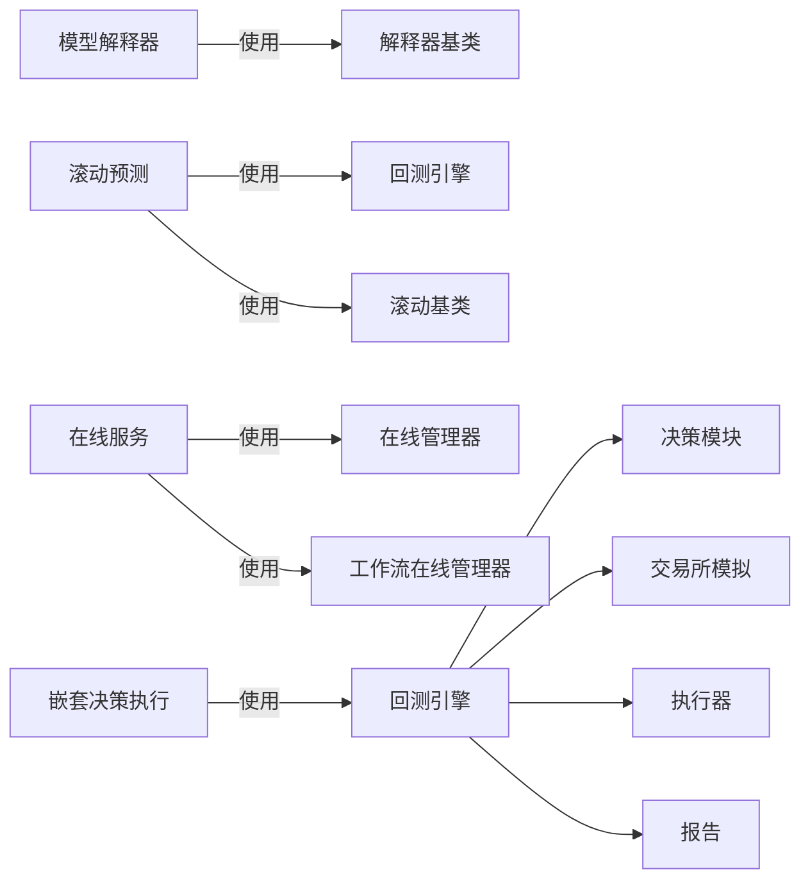

# 实践指南

<cite>
**本文引用的文件**
- [examples/model_interpreter/feature.py](file://examples/model_interpreter/feature.py)
- [examples/model_rolling/task_manager_rolling.py](file://examples/model_rolling/task_manager_rolling.py)
- [examples/online_srv/rolling_online_management.py](file://examples/online_srv/rolling_online_management.py)
- [examples/nested_decision_execution/workflow.py](file://examples/nested_decision_execution/workflow.py)
- [qlib/model/interpret/base.py](file://qlib/model/interpret/base.py)
- [qlib/contrib/online/manager.py](file://qlib/contrib/online/manager.py)
- [qlib/contrib/online/online_model.py](file://qlib/contrib/online/online_model.py)
- [qlib/contrib/online/operator.py](file://qlib/contrib/online/operator.py)
- [qlib/contrib/online/user.py](file://qlib/contrib/online/user.py)
- [qlib/contrib/online/utils.py](file://qlib/contrib/online/utils.py)
- [qlib/workflow/online/manager.py](file://qlib/workflow/online/manager.py)
- [qlib/workflow/online/update.py](file://qlib/workflow/online/update.py)
- [qlib/workflow/online/utils.py](file://qlib/workflow/online/utils.py)
- [qlib/contrib/rolling/base.py](file://qlib/contrib/rolling/base.py)
- [qlib/contrib/rolling/ddgda.py](file://qlib/contrib/rolling/ddgda.py)
- [qlib/backtest/backtest.py](file://qlib/backtest/backtest.py)
- [qlib/backtest/decision.py](file://qlib/backtest/decision.py)
- [qlib/backtest/exchange.py](file://qlib/backtest/exchange.py)
- [qlib/backtest/executor.py](file://qlib/backtest/executor.py)
- [qlib/backtest/report.py](file://qlib/backtest/report.py)
- [qlib/data/dataset/handler.py](file://qlib/data/dataset/handler.py)
- [qlib/data/dataset/loader.py](file://qlib/data/dataset/loader.py)
- [qlib/data/dataset/processor.py](file://qlib/data/dataset/processor.py)
- [qlib/data/storage/file_storage.py](file://qlib/data/storage/file_storage.py)
- [qlib/data/storage/storage.py](file://qlib/data/storage/storage.py)
- [qlib/utils/time.py](file://qlib/utils/time.py)
- [qlib/utils/exceptions.py](file://qlib/utils/exceptions.py)
- [qlib/log.py](file://qlib/log.py)
- [qlib/config.py](file://qlib/config.py)
- [qlib/__init__.py](file://qlib/__init__.py)
</cite>

## 目录
1. [引言](#引言)
2. [项目结构](#项目结构)
3. [核心组件](#核心组件)
4. [架构总览](#架构总览)
5. [详细组件分析](#详细组件分析)
6. [依赖关系分析](#依赖关系分析)
7. [性能考虑](#性能考虑)
8. [故障排查指南](#故障排查指南)
9. [结论](#结论)
10. [附录](#附录)

## 引言
本实践指南面向希望在生产环境中落地Qlib的工程团队与数据科学家，围绕以下典型场景提供从概念到实现的完整路径：模型解释器使用、滚动预测、在线服务、嵌套决策执行。文档同时覆盖配置要点、部署注意事项、性能优化、错误处理与监控告警等运维经验，帮助读者快速解决实际问题。

## 项目结构
本仓库包含丰富的示例与核心模块。与本次实践主题直接相关的示例位于examples目录，核心实现分布在qlib包下的model、contrib、backtest、data、workflow等子模块中。下图给出与本文相关的关键文件与模块之间的关系概览。

```mermaid
graph TB
subgraph "示例"
EMI["examples/model_interpreter/feature.py"]
EMR["examples/model_rolling/task_manager_rolling.py"]
EOS["examples/online_srv/rolling_online_management.py"]
NDE["examples/nested_decision_execution/workflow.py"]
end
subgraph "模型解释"
MIB["qlib/model/interpret/base.py"]
end
subgraph "在线服务"
COM["qlib/contrib/online/manager.py"]
COMO["qlib/contrib/online/online_model.py"]
COO["qlib/contrib/online/operator.py"]
COU["qlib/contrib/online/user.py"]
COU2["qlib/contrib/online/utils.py"]
WOM["qlib/workflow/online/manager.py"]
WOU["qlib/workflow/online/update.py"]
WOU2["qlib/workflow/online/utils.py"]
end
subgraph "回测与执行"
BB["qlib/backtest/backtest.py"]
BD["qlib/backtest/decision.py"]
BE["qlib/backtest/exchange.py"]
BEX["qlib/backtest/executor.py"]
BR["qlib/backtest/report.py"]
end
subgraph "数据与存储"
DH["qlib/data/dataset/handler.py"]
DL["qlib/data/dataset/loader.py"]
DP["qlib/data/dataset/processor.py"]
DS["qlib/data/storage/storage.py"]
DFS["qlib/data/storage/file_storage.py"]
end
EMI --> MIB
EMR --> BB
EOS --> COM
EOS --> WOM
NDE --> BB
BB --> BD
BB --> BE
BB --> BEX
BB --> BR
BB --> DH
BB --> DL
BB --> DP
BB --> DS
BB --> DFS
```

**图表来源**
- [examples/model_interpreter/feature.py](file://examples/model_interpreter/feature.py)
- [examples/model_rolling/task_manager_rolling.py](file://examples/model_rolling/task_manager_rolling.py)
- [examples/online_srv/rolling_online_management.py](file://examples/online_srv/rolling_online_management.py)
- [examples/nested_decision_execution/workflow.py](file://examples/nested_decision_execution/workflow.py)
- [qlib/model/interpret/base.py](file://qlib/model/interpret/base.py)
- [qlib/contrib/online/manager.py](file://qlib/contrib/online/manager.py)
- [qlib/contrib/online/online_model.py](file://qlib/contrib/online/online_model.py)
- [qlib/contrib/online/operator.py](file://qlib/contrib/online/operator.py)
- [qlib/contrib/online/user.py](file://qlib/contrib/online/user.py)
- [qlib/contrib/online/utils.py](file://qlib/contrib/online/utils.py)
- [qlib/workflow/online/manager.py](file://qlib/workflow/online/manager.py)
- [qlib/workflow/online/update.py](file://qlib/workflow/online/update.py)
- [qlib/workflow/online/utils.py](file://qlib/workflow/online/utils.py)
- [qlib/backtest/backtest.py](file://qlib/backtest/backtest.py)
- [qlib/backtest/decision.py](file://qlib/backtest/decision.py)
- [qlib/backtest/exchange.py](file://qlib/backtest/exchange.py)
- [qlib/backtest/executor.py](file://qlib/backtest/executor.py)
- [qlib/backtest/report.py](file://qlib/backtest/report.py)
- [qlib/data/dataset/handler.py](file://qlib/data/dataset/handler.py)
- [qlib/data/dataset/loader.py](file://qlib/data/dataset/loader.py)
- [qlib/data/dataset/processor.py](file://qlib/data/dataset/processor.py)
- [qlib/data/storage/storage.py](file://qlib/data/storage/storage.py)
- [qlib/data/storage/file_storage.py](file://qlib/data/storage/file_storage.py)

**章节来源**
- [examples/model_interpreter/feature.py](file://examples/model_interpreter/feature.py)
- [examples/model_rolling/task_manager_rolling.py](file://examples/model_rolling/task_manager_rolling.py)
- [examples/online_srv/rolling_online_management.py](file://examples/online_srv/rolling_online_management.py)
- [examples/nested_decision_execution/workflow.py](file://examples/nested_decision_execution/workflow.py)
- [qlib/model/interpret/base.py](file://qlib/model/interpret/base.py)
- [qlib/contrib/online/manager.py](file://qlib/contrib/online/manager.py)
- [qlib/contrib/online/online_model.py](file://qlib/contrib/online/online_model.py)
- [qlib/contrib/online/operator.py](file://qlib/contrib/online/operator.py)
- [qlib/contrib/online/user.py](file://qlib/contrib/online/user.py)
- [qlib/contrib/online/utils.py](file://qlib/contrib/online/utils.py)
- [qlib/workflow/online/manager.py](file://qlib/workflow/online/manager.py)
- [qlib/workflow/online/update.py](file://qlib/workflow/online/update.py)
- [qlib/workflow/online/utils.py](file://qlib/workflow/online/utils.py)
- [qlib/backtest/backtest.py](file://qlib/backtest/backtest.py)
- [qlib/backtest/decision.py](file://qlib/backtest/decision.py)
- [qlib/backtest/exchange.py](file://qlib/backtest/exchange.py)
- [qlib/backtest/executor.py](file://qlib/backtest/executor.py)
- [qlib/backtest/report.py](file://qlib/backtest/report.py)
- [qlib/data/dataset/handler.py](file://qlib/data/dataset/handler.py)
- [qlib/data/dataset/loader.py](file://qlib/data/dataset/loader.py)
- [qlib/data/dataset/processor.py](file://qlib/data/dataset/processor.py)
- [qlib/data/storage/storage.py](file://qlib/data/storage/storage.py)
- [qlib/data/storage/file_storage.py](file://qlib/data/storage/file_storage.py)

## 核心组件
- 模型解释器：提供特征重要性、局部可解释性等能力，支撑模型诊断与特征工程迭代。
- 滚动预测：基于时间序列滚动窗口进行持续预测与评估，适合动态市场环境。
- 在线服务：支持在线模型管理、预测更新与策略执行，满足低延迟与高可用需求。
- 嵌套决策执行：在回测框架内模拟复杂交易与风控逻辑，验证策略可行性。

**章节来源**
- [qlib/model/interpret/base.py](file://qlib/model/interpret/base.py)
- [qlib/contrib/rolling/base.py](file://qlib/contrib/rolling/base.py)
- [qlib/contrib/online/manager.py](file://qlib/contrib/online/manager.py)
- [qlib/backtest/backtest.py](file://qlib/backtest/backtest.py)

## 架构总览
下图展示四个实践场景在系统中的位置与交互关系，以及与核心模块（数据、回测、在线）的耦合点。

**图表来源**
- [examples/model_interpreter/feature.py](file://examples/model_interpreter/feature.py)
- [qlib/model/interpret/base.py](file://qlib/model/interpret/base.py)
- [examples/model_rolling/task_manager_rolling.py](file://examples/model_rolling/task_manager_rolling.py)
- [qlib/contrib/rolling/base.py](file://qlib/contrib/rolling/base.py)
- [qlib/backtest/backtest.py](file://qlib/backtest/backtest.py)
- [examples/online_srv/rolling_online_management.py](file://examples/online_srv/rolling_online_management.py)
- [qlib/contrib/online/manager.py](file://qlib/contrib/online/manager.py)
- [qlib/workflow/online/manager.py](file://qlib/workflow/online/manager.py)
- [qlib/contrib/online/online_model.py](file://qlib/contrib/online/online_model.py)
- [qlib/contrib/online/operator.py](file://qlib/contrib/online/operator.py)
- [qlib/contrib/online/user.py](file://qlib/contrib/online/user.py)
- [examples/nested_decision_execution/workflow.py](file://examples/nested_decision_execution/workflow.py)
- [qlib/backtest/decision.py](file://qlib/backtest/decision.py)
- [qlib/backtest/exchange.py](file://qlib/backtest/exchange.py)
- [qlib/backtest/executor.py](file://qlib/backtest/executor.py)
- [qlib/backtest/report.py](file://qlib/backtest/report.py)

## 详细组件分析

### 模型解释器使用
- 目标：通过解释器定位关键特征、评估模型稳定性，辅助特征筛选与模型优化。
- 关键实现：
  - 解释器基类提供统一接口与通用方法，示例通过具体任务加载模型并调用解释器。
  - 示例入口文件展示了如何组织数据、训练/加载模型，并输出解释结果。
- 配置与运行：
  - 使用示例脚本作为入口，按需调整数据集、特征集合与解释参数。
  - 结果可用于特征重要性排序、异常特征识别与模型诊断。
- 最佳实践：
  - 对比不同解释方法（如基于权重、置换重要性）以交叉验证稳定性。
  - 将解释结果纳入特征工程迭代闭环，定期重跑以跟踪特征漂移。

**图表来源**
- [examples/model_interpreter/feature.py](file://examples/model_interpreter/feature.py)
- [qlib/model/interpret/base.py](file://qlib/model/interpret/base.py)

**章节来源**
- [examples/model_interpreter/feature.py](file://examples/model_interpreter/feature.py)
- [qlib/model/interpret/base.py](file://qlib/model/interpret/base.py)

### 滚动预测
- 目标：在时间维度上滑动窗口进行持续预测，适配市场状态变化与数据分布漂移。
- 关键实现：
  - 任务管理器负责调度滚动周期、生成预测任务与收集结果。
  - 回测引擎用于对滚动预测进行回测评估，确保策略鲁棒性。
  - 滚动基类提供通用的时间推进与数据切片逻辑。
- 配置与运行：
  - 通过任务管理器配置滚动窗口大小、步长与评估指标。
  - 将滚动预测结果接入策略或风控系统，形成闭环。
- 最佳实践：
  - 定期校准滚动窗口长度，平衡响应速度与稳定性。
  - 对滚动过程中的预测质量进行监控，异常时触发再训练或降级策略。

**图表来源**
- [examples/model_rolling/task_manager_rolling.py](file://examples/model_rolling/task_manager_rolling.py)
- [qlib/contrib/rolling/base.py](file://qlib/contrib/rolling/base.py)
- [qlib/backtest/backtest.py](file://qlib/backtest/backtest.py)

**章节来源**
- [examples/model_rolling/task_manager_rolling.py](file://examples/model_rolling/task_manager_rolling.py)
- [qlib/contrib/rolling/base.py](file://qlib/contrib/rolling/base.py)
- [qlib/backtest/backtest.py](file://qlib/backtest/backtest.py)

### 在线服务
- 目标：提供低延迟在线预测与策略执行，支持灰度发布与A/B测试。
- 关键实现：
  - 在线管理器负责模型版本管理、热更新与预测路由。
  - 工作流在线管理器对接Qlib工作流，统一记录与回放。
  - 在线模型、操作员与用户模块分别承担模型封装、操作编排与权限控制。
  - 示例演示了滚动在线管理与预测更新流程。
- 配置与运行：
  - 明确模型版本、路由规则与灰度比例。
  - 通过更新接口推送新预测，确保一致性与可追溯性。
- 最佳实践：
  - 采用蓝绿发布或金丝雀策略，结合SLA与错误率阈值自动回滚。
  - 记录在线请求日志与预测特征快照，便于事后审计与复盘。

**图表来源**
- [examples/online_srv/rolling_online_management.py](file://examples/online_srv/rolling_online_management.py)
- [qlib/contrib/online/manager.py](file://qlib/contrib/online/manager.py)
- [qlib/workflow/online/manager.py](file://qlib/workflow/online/manager.py)
- [qlib/contrib/online/online_model.py](file://qlib/contrib/online/online_model.py)
- [qlib/workflow/online/update.py](file://qlib/workflow/online/update.py)

**章节来源**
- [examples/online_srv/rolling_online_management.py](file://examples/online_srv/rolling_online_management.py)
- [qlib/contrib/online/manager.py](file://qlib/contrib/online/manager.py)
- [qlib/workflow/online/manager.py](file://qlib/workflow/online/manager.py)
- [qlib/contrib/online/online_model.py](file://qlib/contrib/online/online_model.py)
- [qlib/workflow/online/update.py](file://qlib/workflow/online/update.py)

### 嵌套决策执行
- 目标：在回测框架内模拟复杂交易与风控逻辑，验证策略可行性与鲁棒性。
- 关键实现：
  - 回测引擎整合决策、交易所模拟、执行器与报告模块，形成端到端流水线。
  - 决策模块根据信号生成买卖指令；执行器模拟成交与滑点；报告模块汇总绩效。
  - 示例工作流展示如何组织多阶段决策与风控检查。
- 配置与运行：
  - 设置交易成本、滑点模型与风控阈值，确保仿真贴近真实市场。
  - 分层验证：先单元测试各模块，再集成回测，最后进行压力测试。
- 最佳实践：
  - 将风控规则与交易规则解耦，便于独立演进与A/B对比。
  - 对极端行情进行场景化测试，避免过拟合历史样本。

**图表来源**
- [examples/nested_decision_execution/workflow.py](file://examples/nested_decision_execution/workflow.py)
- [qlib/backtest/backtest.py](file://qlib/backtest/backtest.py)
- [qlib/backtest/decision.py](file://qlib/backtest/decision.py)
- [qlib/backtest/exchange.py](file://qlib/backtest/exchange.py)
- [qlib/backtest/executor.py](file://qlib/backtest/executor.py)
- [qlib/backtest/report.py](file://qlib/backtest/report.py)

**章节来源**
- [examples/nested_decision_execution/workflow.py](file://examples/nested_decision_execution/workflow.py)
- [qlib/backtest/backtest.py](file://qlib/backtest/backtest.py)
- [qlib/backtest/decision.py](file://qlib/backtest/decision.py)
- [qlib/backtest/exchange.py](file://qlib/backtest/exchange.py)
- [qlib/backtest/executor.py](file://qlib/backtest/executor.py)
- [qlib/backtest/report.py](file://qlib/backtest/report.py)

## 依赖关系分析
- 组件内聚与耦合：
  - 模型解释器与回测引擎相对独立，通过统一的数据接口与模型接口耦合。
  - 在线服务与工作流在线管理器存在清晰边界，前者负责运行时，后者负责记录与版本管理。
  - 嵌套决策执行依赖回测核心模块，形成稳定的上层应用扩展。
- 外部依赖与集成点：
  - 数据层提供处理器、加载器与存储抽象，支撑滚动与在线场景的数据一致性。
  - 时间工具与异常处理为各模块提供基础能力保障。

**图表来源**
- [qlib/model/interpret/base.py](file://qlib/model/interpret/base.py)
- [qlib/contrib/rolling/base.py](file://qlib/contrib/rolling/base.py)
- [qlib/backtest/backtest.py](file://qlib/backtest/backtest.py)
- [qlib/contrib/online/manager.py](file://qlib/contrib/online/manager.py)
- [qlib/workflow/online/manager.py](file://qlib/workflow/online/manager.py)
- [qlib/backtest/decision.py](file://qlib/backtest/decision.py)
- [qlib/backtest/exchange.py](file://qlib/backtest/exchange.py)
- [qlib/backtest/executor.py](file://qlib/backtest/executor.py)
- [qlib/backtest/report.py](file://qlib/backtest/report.py)

**章节来源**
- [qlib/model/interpret/base.py](file://qlib/model/interpret/base.py)
- [qlib/contrib/rolling/base.py](file://qlib/contrib/rolling/base.py)
- [qlib/backtest/backtest.py](file://qlib/backtest/backtest.py)
- [qlib/contrib/online/manager.py](file://qlib/contrib/online/manager.py)
- [qlib/workflow/online/manager.py](file://qlib/workflow/online/manager.py)
- [qlib/backtest/decision.py](file://qlib/backtest/decision.py)
- [qlib/backtest/exchange.py](file://qlib/backtest/exchange.py)
- [qlib/backtest/executor.py](file://qlib/backtest/executor.py)
- [qlib/backtest/report.py](file://qlib/backtest/report.py)

## 性能考虑
- 数据访问与缓存
  - 利用数据处理器与存储抽象减少重复IO，必要时启用内存缓存与预取策略。
  - 在滚动与在线场景中，优先使用增量更新与时间索引加速查询。
- 并发与批处理
  - 在线服务建议采用异步批处理与队列化请求，避免热点时段阻塞。
  - 回测阶段可利用并行回测与分片加载提升吞吐。
- 模型推理优化
  - 在线模型尽量采用轻量化部署（如ONNX/TensorRT），并开启模型压缩与量化。
  - 对高频场景设置合理的批大小与超时阈值，保证P99延迟稳定。
- 资源监控
  - 监控CPU/内存/GPU利用率、磁盘IO与网络带宽，结合业务峰值设定扩容阈值。

## 故障排查指南
- 常见问题与定位
  - 数据不一致：核对时间范围、频率与填充策略，检查数据加载器与处理器配置。
  - 在线预测异常：检查模型版本路由、更新流程与缓存一致性，查看在线管理器日志。
  - 回测偏差：确认滑点、手续费与成交量限制设置是否合理，复核决策模块逻辑。
- 错误处理与恢复
  - 使用统一异常捕获与重试机制，对瞬时失败进行幂等重试。
  - 对不可恢复错误记录上下文信息（输入特征快照、模型版本、时间戳），便于回溯。
- 日志与告警
  - 在线服务与回测模块均应输出结构化日志，包含请求ID、耗时、错误码与关键参数。
  - 基于延迟、错误率与资源使用率设置分级告警，联动自动扩缩容与回滚。

**章节来源**
- [qlib/utils/exceptions.py](file://qlib/utils/exceptions.py)
- [qlib/log.py](file://qlib/log.py)
- [qlib/utils/time.py](file://qlib/utils/time.py)

## 结论
通过模型解释器、滚动预测、在线服务与嵌套决策执行四大实践场景，Qlib能够覆盖从模型诊断到实时在线的全链路需求。建议在项目初期明确数据与模型治理规范，建立自动化测试与监控体系，并以渐进式方式引入复杂策略，持续优化性能与稳定性。

## 附录
- 快速启动建议
  - 从示例脚本入手，逐步替换为真实数据与模型，验证解释器与回测结果一致性。
  - 在线服务上线前完成压测与灰度演练，确保SLA达标。
- 参考文件
  - 模型解释器：[解释器基类](file://qlib/model/interpret/base.py)
  - 滚动预测：[任务管理器](file://examples/model_rolling/task_manager_rolling.py)、[滚动基类](file://qlib/contrib/rolling/base.py)
  - 在线服务：[在线管理器](file://qlib/contrib/online/manager.py)、[工作流在线管理器](file://qlib/workflow/online/manager.py)、[预测更新](file://qlib/workflow/online/update.py)
  - 嵌套决策执行：[工作流](file://examples/nested_decision_execution/workflow.py)、[回测引擎](file://qlib/backtest/backtest.py)