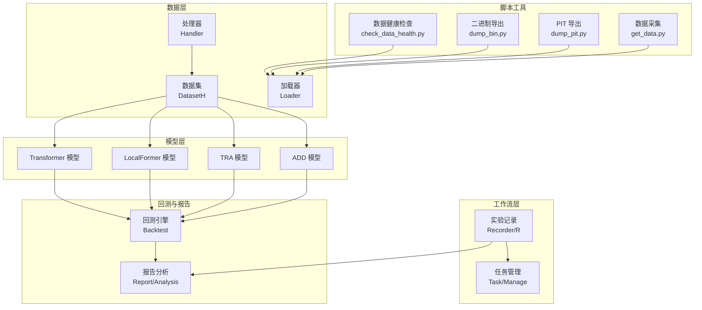
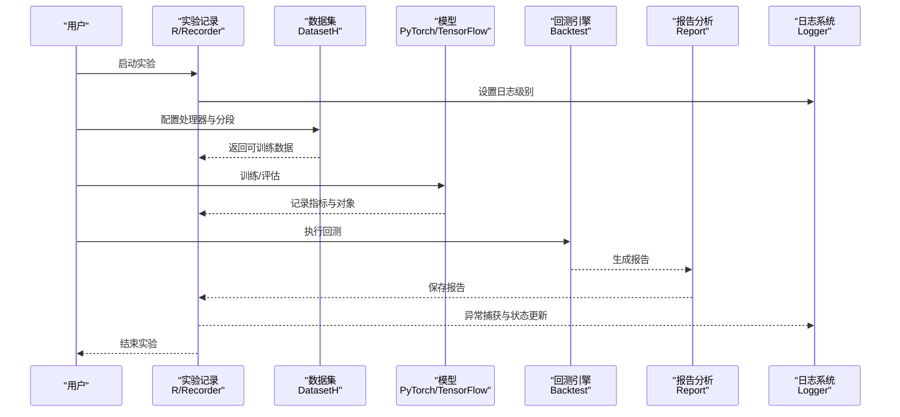
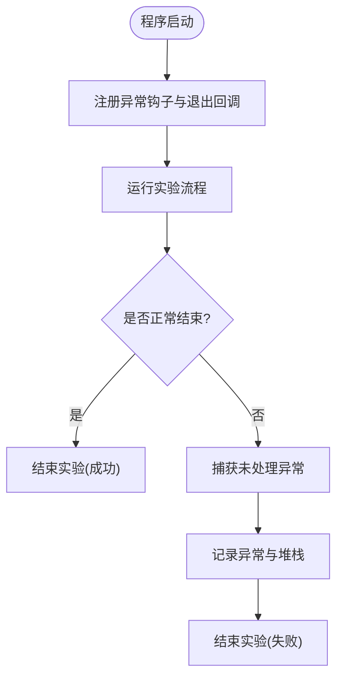
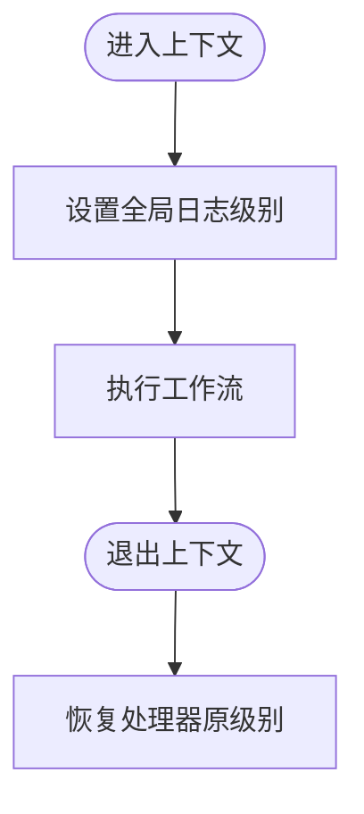
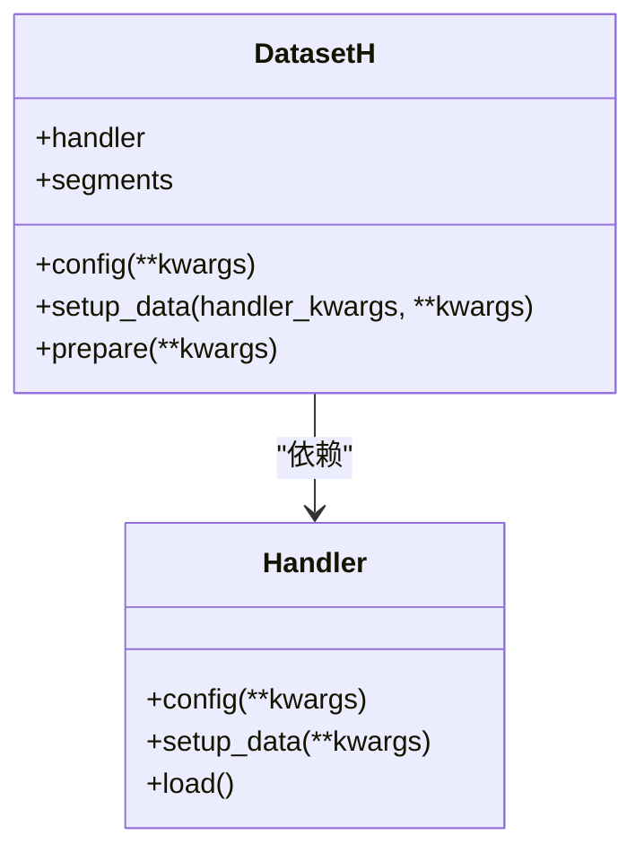
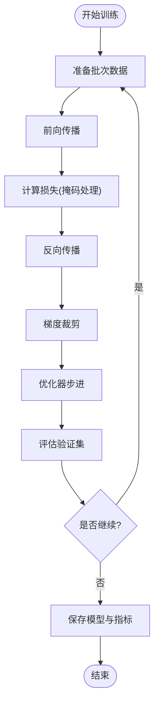
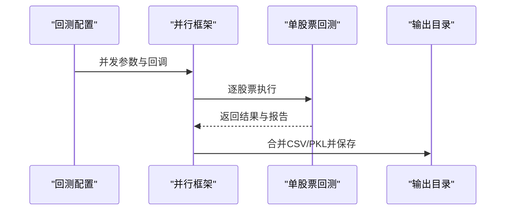
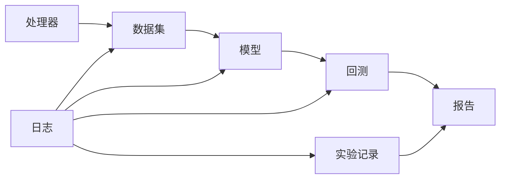

# 故障排除与常见问题

<cite>
**本文引用的文件**   
- [qlib/workflow/utils.py](file://qlib/workflow/utils.py)
- [qlib/log.py](file://qlib/log.py)
- [.github/brew_install.sh](file://.github/brew_install.sh)
- [qlib/data/dataset/__init__.py](file://qlib/data/dataset/__init__.py)
- [qlib/contrib/model/pytorch_localformer.py](file://qlib/contrib/model/pytorch_localformer.py)
- [qlib/contrib/model/pytorch_transformer.py](file://qlib/contrib/model/pytorch_transformer.py)
- [qlib/contrib/model/pytorch_tra.py](file://qlib/contrib/model/pytorch_tra.py)
- [qlib/contrib/model/pytorch_add.py](file://qlib/contrib/model/pytorch_add.py)
- [qlib/rl/contrib/backtest.py](file://qlib/rl/contrib/backtest.py)
- [qlib/rl/contrib/train_onpolicy.py](file://qlib/rl/contrib/train_onpolicy.py)
- [examples/workflow_by_code.py](file://examples/workflow_by_code.py)
- [scripts/check_data_health.py](file://scripts/check_data_health.py)
- [scripts/check_dump_bin.py](file://scripts/check_dump_bin.py)
- [scripts/collect_info.py](file://scripts/collect_info.py)
- [scripts/dump_bin.py](file://scripts/dump_bin.py)
- [scripts/dump_pit.py](file://scripts/dump_pit.py)
- [scripts/get_data.py](file://scripts/get_data.py)
- [tests/data_mid_layer_tests/README.md](file://tests/data_mid_layer_tests/README.md)
- [tests/pytest.ini](file://tests/pytest.ini)
- [tests/test_workflow.py](file://tests/test_workflow.py)
- [tests/test_dump_data.py](file://tests/test_dump_data.py)
- [tests/test_get_data.py](file://tests/test_get_data.py)
- [tests/test_pit.py](file://tests/test_pit.py)
- [tests/backtest/test_file_strategy.py](file://tests/backtest/test_file_strategy.py)
- [tests/backtest/test_high_freq_trading.py](file://tests/backtest/test_high_freq_trading.py)
- [tests/backtest/test_soft_topk_strategy.py](file://tests/backtest/test_soft_topk_strategy.py)
- [tests/backtest/test_soft_topk_strategy_cold_start.py](file://tests/backtest/test_soft_topk_strategy_cold_start.py)
- [tests/rl/test_qlib_simulator.py](file://tests/rl/test_qlib_simulator.py)
- [tests/rl/test_saoe_simple.py](file://tests/rl/test_saoe_simple.py)
- [tests/rl/test_trainer.py](file://tests/rl/test_trainer.py)
- [tests/misc/test_get_multi_proc.py](file://tests/misc/test_get_multi_proc.py)
- [tests/misc/test_index_data.py](file://tests/misc/test_index_data.py)
- [tests/misc/test_sepdf.py](file://tests/misc/test_sepdf.py)
- [tests/misc/test_utils.py](file://tests/misc/test_utils.py)
- [tests/storage_tests/test_storage.py](file://tests/storage_tests/test_storage.py)
- [tests/dataset_tests/test_datalayer.py](file://tests/dataset_tests/test_datalayer.py)
- [tests/model/test_general_nn.py](file://tests/model/test_general_nn.py)
- [tests/ops/test_elem_operator.py](file://tests/ops/test_elem_operator.py)
- [tests/ops/test_special_ops.py](file://tests/ops/test_special_ops.py)
- [tests/rolling_tests/test_update_pred.py](file://tests/rolling_tests/test_update_pred.py)
- [tests/dependency_tests/test_mlflow.py](file://tests/dependency_tests/test_mlflow.py)
</cite>

## 目录
1. [简介](#简介)
2. [项目结构](#项目结构)
3. [核心组件](#核心组件)
4. [架构总览](#架构总览)
5. [详细组件分析](#详细组件分析)
6. [依赖关系分析](#依赖关系分析)
7. [性能考虑](#性能考虑)
8. [故障排除指南](#故障排除指南)
9. [结论](#结论)
10. [附录](#附录)

## 简介
本指南面向使用 Qlib 的研究者与工程师，系统梳理安装配置、数据处理、模型训练、回测执行、性能优化等方面的常见问题与解决方案，并提供调试技巧、日志分析、性能诊断、版本兼容性与迁移注意事项，以及社区支持与问题反馈流程。内容基于仓库中的实现细节与测试用例进行归纳总结，帮助快速定位与解决问题。

## 项目结构
Qlib 采用模块化分层设计：数据层（数据采集、处理器、加载器）、工作流层（实验记录、任务管理）、模型层（传统与深度学习模型）、回测与报告层（交易执行、收益归因、分析报表）、脚本工具（数据健康检查、二进制导出等）。下图给出与故障排查相关的关键模块关系：

**图表来源**
- [qlib/data/dataset/__init__.py:72-173](file://qlib/data/dataset/__init__.py#L72-L173)
- [qlib/contrib/model/pytorch_transformer.py:82-162](file://qlib/contrib/model/pytorch_transformer.py#L82-L162)
- [qlib/contrib/model/pytorch_localformer.py:79-163](file://qlib/contrib/model/pytorch_localformer.py#L79-L163)
- [qlib/contrib/model/pytorch_tra.py:424-452](file://qlib/contrib/model/pytorch_tra.py#L424-L452)
- [qlib/contrib/model/pytorch_add.py:314-329](file://qlib/contrib/model/pytorch_add.py#L314-L329)
- [qlib/rl/contrib/backtest.py:323-364](file://qlib/rl/contrib/backtest.py#L323-L364)
- [scripts/check_data_health.py](file://scripts/check_data_health.py)
- [scripts/dump_bin.py](file://scripts/dump_bin.py)
- [scripts/dump_pit.py](file://scripts/dump_pit.py)
- [scripts/get_data.py](file://scripts/get_data.py)

**章节来源**
- [qlib/data/dataset/__init__.py:72-173](file://qlib/data/dataset/__init__.py#L72-L173)
- [tests/data_mid_layer_tests/README.md:1-6](file://tests/data_mid_layer_tests/README.md#L1-L6)

## 核心组件
- 实验记录与退出处理：通过实验退出钩子自动结束实验状态，避免资源泄露；异常捕获统一记录并标记失败。
- 日志系统：提供全局日志级别控制与上下文管理器，便于在不同阶段调整日志输出。
- 数据集与处理器：DatasetH 将数据预处理集中在处理器中，模型相关或切分相关的处理放在 Dataset 层，确保职责清晰。
- 模型训练：多模型实现统一了训练/评估流程，包含损失函数、度量指标、批次迭代与梯度裁剪等通用逻辑。
- 回测执行：支持并发回测与报告生成，结果落盘与合并，便于后续分析。
- 脚本工具：提供数据健康检查、二进制导出、PIT 导出、数据采集等辅助诊断与维护能力。

**章节来源**
- [qlib/workflow/utils.py:16-47](file://qlib/workflow/utils.py#L16-L47)
- [qlib/log.py:245-262](file://qlib/log.py#L245-L262)
- [qlib/data/dataset/__init__.py:72-173](file://qlib/data/dataset/__init__.py#L72-L173)
- [qlib/contrib/model/pytorch_transformer.py:82-162](file://qlib/contrib/model/pytorch_transformer.py#L82-L162)
- [qlib/contrib/model/pytorch_localformer.py:79-163](file://qlib/contrib/model/pytorch_localformer.py#L79-L163)
- [qlib/contrib/model/pytorch_tra.py:424-452](file://qlib/contrib/model/pytorch_tra.py#L424-L452)
- [qlib/contrib/model/pytorch_add.py:314-329](file://qlib/contrib/model/pytorch_add.py#L314-L329)
- [qlib/rl/contrib/backtest.py:323-364](file://qlib/rl/contrib/backtest.py#L323-L364)

## 架构总览
下图展示从“数据准备—模型训练—回测—报告”的典型流程，以及异常处理与日志在其中的位置：

**图表来源**
- [qlib/workflow/utils.py:16-47](file://qlib/workflow/utils.py#L16-L47)
- [qlib/log.py:245-262](file://qlib/log.py#L245-L262)
- [qlib/data/dataset/__init__.py:72-173](file://qlib/data/dataset/__init__.py#L72-L173)
- [qlib/rl/contrib/backtest.py:323-364](file://qlib/rl/contrib/backtest.py#L323-L364)

## 详细组件分析

### 组件A：实验记录与异常处理
- 作用：在程序异常或非正常退出时，自动结束实验并记录失败状态；同时打印异常堆栈以便定位问题。
- 关键点：注册异常钩子与退出回调，确保资源清理与状态一致性。
- 建议：在本地开发时开启更细粒度的日志，结合异常堆栈定位具体调用链。

**图表来源**
- [qlib/workflow/utils.py:16-47](file://qlib/workflow/utils.py#L16-L47)

**章节来源**
- [qlib/workflow/utils.py:16-47](file://qlib/workflow/utils.py#L16-L47)

### 组件B：日志系统与全局级别控制
- 作用：提供全局日志级别设置与上下文恢复，便于在不同阶段（如训练、回测）动态调整日志输出。
- 关键点：使用上下文管理器在临时范围内重置处理器级别，保证不影响其他模块。
- 建议：在定位问题时临时提升日志级别，观察内部数据流与中间变量。

**图表来源**
- [qlib/log.py:245-262](file://qlib/log.py#L245-L262)

**章节来源**
- [qlib/log.py:245-262](file://qlib/log.py#L245-L262)

### 组件C：数据集与处理器（DatasetH）
- 作用：将数据预处理集中在处理器中，仅保留与模型/切分相关的处理在 Dataset 层，降低耦合。
- 关键点：支持 handler_kwargs 与 segments 配置，便于复用与扩展。
- 建议：在出现数据维度不匹配或缺失值问题时，优先检查处理器配置与分段时间范围。

**图表来源**
- [qlib/data/dataset/__init__.py:72-173](file://qlib/data/dataset/__init__.py#L72-L173)

**章节来源**
- [qlib/data/dataset/__init__.py:72-173](file://qlib/data/dataset/__init__.py#L72-L173)

### 组件D：模型训练（Transformer/LocalFormer/TRA/ADD）
- 作用：统一训练/评估流程，包含损失函数、度量指标、批次迭代与梯度裁剪等。
- 关键点：使用掩码处理 NaN/无穷值；支持 GPU 设备切换；日志输出训练进度与指标。
- 建议：当出现 NaN 或梯度爆炸时，检查损失函数与标签掩码，适当降低学习率或启用梯度裁剪。

**图表来源**
- [qlib/contrib/model/pytorch_transformer.py:82-162](file://qlib/contrib/model/pytorch_transformer.py#L82-L162)
- [qlib/contrib/model/pytorch_localformer.py:79-163](file://qlib/contrib/model/pytorch_localformer.py#L79-L163)
- [qlib/contrib/model/pytorch_tra.py:424-452](file://qlib/contrib/model/pytorch_tra.py#L424-L452)
- [qlib/contrib/model/pytorch_add.py:314-329](file://qlib/contrib/model/pytorch_add.py#L314-L329)

**章节来源**
- [qlib/contrib/model/pytorch_transformer.py:82-162](file://qlib/contrib/model/pytorch_transformer.py#L82-L162)
- [qlib/contrib/model/pytorch_localformer.py:79-163](file://qlib/contrib/model/pytorch_localformer.py#L79-L163)
- [qlib/contrib/model/pytorch_tra.py:424-452](file://qlib/contrib/model/pytorch_tra.py#L424-L452)
- [qlib/contrib/model/pytorch_add.py:314-329](file://qlib/contrib/model/pytorch_add.py#L314-L329)

### 组件E：回测执行与报告生成
- 作用：支持并发回测与报告聚合，结果落盘为 CSV/PKL，便于后续分析。
- 关键点：根据并发配置并行处理股票池，合并结果并生成报告。
- 建议：当回测耗时过长时，检查并发数与数据规模，必要时拆分回测任务。

**图表来源**
- [qlib/rl/contrib/backtest.py:323-364](file://qlib/rl/contrib/backtest.py#L323-L364)

**章节来源**
- [qlib/rl/contrib/backtest.py:323-364](file://qlib/rl/contrib/backtest.py#L323-L364)

### 组件F：脚本工具与数据诊断
- 作用：提供数据健康检查、二进制导出、PIT 导出、数据采集等工具，辅助定位数据问题。
- 关键点：check_data_health.py 用于检测数据完整性；dump_bin.py/dump_pit.py 用于导出中间产物；get_data.py 用于采集数据。
- 建议：在数据异常时先运行健康检查脚本，确认数据源与缓存状态。

**章节来源**
- [scripts/check_data_health.py](file://scripts/check_data_health.py)
- [scripts/check_dump_bin.py](file://scripts/check_dump_bin.py)
- [scripts/collect_info.py](file://scripts/collect_info.py)
- [scripts/dump_bin.py](file://scripts/dump_bin.py)
- [scripts/dump_pit.py](file://scripts/dump_pit.py)
- [scripts/get_data.py](file://scripts/get_data.py)

## 依赖关系分析
- 组件耦合：数据集依赖处理器；模型依赖数据集；回测依赖模型与数据；报告依赖回测与记录；异常处理与日志贯穿全流程。
- 外部依赖：脚本工具依赖系统命令与外部数据源；模型训练依赖 PyTorch/GPU 环境；回测依赖 pandas/numpy。
- 潜在循环：当前结构以数据→模型→回测为主线，未见明显循环依赖。

**图表来源**
- [qlib/data/dataset/__init__.py:72-173](file://qlib/data/dataset/__init__.py#L72-L173)
- [qlib/rl/contrib/backtest.py:323-364](file://qlib/rl/contrib/backtest.py#L323-L364)
- [qlib/workflow/utils.py:16-47](file://qlib/workflow/utils.py#L16-L47)

**章节来源**
- [qlib/data/dataset/__init__.py:72-173](file://qlib/data/dataset/__init__.py#L72-L173)
- [qlib/rl/contrib/backtest.py:323-364](file://qlib/rl/contrib/backtest.py#L323-L364)
- [qlib/workflow/utils.py:16-47](file://qlib/workflow/utils.py#L16-L47)

## 性能考虑
- 并发与内存：回测与数据加载支持并发，建议根据 CPU/内存资源合理设置并发数，避免 OOM。
- 日志开销：在高吞吐场景下降低日志级别，减少磁盘 IO。
- 模型训练：启用梯度裁剪与合适的批大小，避免梯度爆炸；GPU 训练时注意显存占用。
- 数据缓存：利用处理器与数据集的缓存机制，减少重复加载。

[本节为通用指导，无需列出章节来源]

## 故障排除指南

### 安装与环境
- 症状：安装依赖失败或缺少系统工具
  - 排查要点：检查系统依赖（如命令行工具、编译器）与权限；参考安装脚本中的前置条件与提示。
  - 解决步骤：满足前置条件后重试安装；在 Linux 上确保具备必要的构建工具与权限。
- 参考
  - [brew_install.sh:268-282](file://.github/brew_install.sh#L268-L282)
  - [brew_install.sh:548-546](file://.github/brew_install.sh#L548-L546)

**章节来源**
- [.github/brew_install.sh:268-282](file://.github/brew_install.sh#L268-L282)
- [.github/brew_install.sh:548-546](file://.github/brew_install.sh#L548-L546)

### 数据处理
- 症状：数据维度不匹配、缺失值过多、时间范围异常
  - 排查要点：检查处理器配置与分段时间范围；确认数据缓存与索引是否一致；使用健康检查脚本定位问题。
  - 解决步骤：修正处理器参数与分段配置；重新生成缓存；必要时重新采集数据。
- 参考
  - [dataset/__init__.py:72-173](file://qlib/data/dataset/__init__.py#L72-L173)
  - [check_data_health.py](file://scripts/check_data_health.py)
  - [check_dump_bin.py](file://scripts/check_dump_bin.py)
  - [get_data.py](file://scripts/get_data.py)

**章节来源**
- [qlib/data/dataset/__init__.py:72-173](file://qlib/data/dataset/__init__.py#L72-L173)
- [scripts/check_data_health.py](file://scripts/check_data_health.py)
- [scripts/check_dump_bin.py](file://scripts/check_dump_bin.py)
- [scripts/get_data.py](file://scripts/get_data.py)

### 模型训练
- 症状：NaN 损失、梯度爆炸、训练不收敛
  - 排查要点：检查标签掩码与损失函数；查看日志输出的指标变化；确认设备与批大小设置。
  - 解决步骤：启用梯度裁剪；调整学习率与批大小；检查输入数据的 NaN/无穷值。
- 参考
  - [pytorch_transformer.py:82-162](file://qlib/contrib/model/pytorch_transformer.py#L82-L162)
  - [pytorch_localformer.py:79-163](file://qlib/contrib/model/pytorch_localformer.py#L79-L163)
  - [pytorch_tra.py:424-452](file://qlib/contrib/model/pytorch_tra.py#L424-L452)
  - [pytorch_add.py:314-329](file://qlib/contrib/model/pytorch_add.py#L314-L329)

**章节来源**
- [qlib/contrib/model/pytorch_transformer.py:82-162](file://qlib/contrib/model/pytorch_transformer.py#L82-L162)
- [qlib/contrib/model/pytorch_localformer.py:79-163](file://qlib/contrib/model/pytorch_localformer.py#L79-L163)
- [qlib/contrib/model/pytorch_tra.py:424-452](file://qlib/contrib/model/pytorch_tra.py#L424-L452)
- [qlib/contrib/model/pytorch_add.py:314-329](file://qlib/contrib/model/pytorch_add.py#L314-L329)

### 回测执行
- 症状：回测耗时过长、结果为空、报告生成失败
  - 排查要点：检查并发配置与股票池规模；确认输出目录权限；核对回测配置与数据范围。
  - 解决步骤：降低并发数或拆分任务；检查输出路径存在性与写权限；重新生成报告。
- 参考
  - [backtest.py:323-364](file://qlib/rl/contrib/backtest.py#L323-L364)

**章节来源**
- [qlib/rl/contrib/backtest.py:323-364](file://qlib/rl/contrib/backtest.py#L323-L364)

### 日志与调试
- 症状：日志过多影响性能或难以定位问题
  - 排查要点：使用全局日志级别控制与上下文管理器，在关键阶段临时提升日志级别。
  - 解决步骤：在测试流程前后设置日志级别，问题解决后恢复默认级别。
- 参考
  - [log.py:245-262](file://qlib/log.py#L245-L262)

**章节来源**
- [qlib/log.py:245-262](file://qlib/log.py#L245-L262)

### 版本兼容性与迁移
- 症状：升级后功能异常或接口变更导致报错
  - 排查要点：对照变更日志与迁移说明；检查第三方依赖版本；核对配置文件字段变更。
  - 解决步骤：按迁移说明更新配置与代码；在隔离环境中先行验证。
- 参考
  - [tests/dependency_tests/test_mlflow.py](file://tests/dependency_tests/test_mlflow.py)

**章节来源**
- [tests/dependency_tests/test_mlflow.py](file://tests/dependency_tests/test_mlflow.py)

### 社区支持与问题反馈
- 渠道：遵循仓库的 Issue/PR 模板与行为准则；在提问前先检索已有问题与文档。
- 流程：提供最小可复现示例、环境信息与日志片段；按模板填写问题描述与期望行为。
- 参考
  - [CODE_OF_CONDUCT.md](file://CODE_OF_CONDUCT.md)
  - [SECURITY.md](file://SECURITY.md)

**章节来源**
- [CODE_OF_CONDUCT.md](file://CODE_OF_CONDUCT.md)
- [SECURITY.md](file://SECURITY.md)

## 结论
通过明确各层职责、规范异常处理与日志策略、提供数据诊断与脚本工具，Qlib 能够有效支撑从数据到回测的完整流程。遇到问题时，建议按“安装—数据—训练—回测—日志”顺序逐项排查，并结合脚本工具与测试用例快速定位根因。

## 附录
- 快速定位清单
  - 安装：确认系统依赖与权限
  - 数据：检查处理器配置、分段与缓存
  - 训练：关注损失与指标变化、梯度裁剪
  - 回测：核对并发与输出路径
  - 日志：使用上下文管理器临时提升级别
- 相关测试与示例
  - [workflow_by_code.py:67-85](file://examples/workflow_by_code.py#L67-L85)
  - [test_workflow.py](file://tests/test_workflow.py)
  - [test_dump_data.py](file://tests/test_dump_data.py)
  - [test_get_data.py](file://tests/test_get_data.py)
  - [test_pit.py](file://tests/test_pit.py)
  - [test_file_strategy.py](file://tests/backtest/test_file_strategy.py)
  - [test_high_freq_trading.py](file://tests/backtest/test_high_freq_trading.py)
  - [test_soft_topk_strategy.py](file://tests/backtest/test_soft_topk_strategy.py)
  - [test_soft_topk_strategy_cold_start.py](file://tests/backtest/test_soft_topk_strategy_cold_start.py)
  - [test_qlib_simulator.py](file://tests/rl/test_qlib_simulator.py)
  - [test_saoe_simple.py](file://tests/rl/test_saoe_simple.py)
  - [test_trainer.py](file://tests/rl/test_trainer.py)
  - [test_get_multi_proc.py](file://tests/misc/test_get_multi_proc.py)
  - [test_index_data.py](file://tests/misc/test_index_data.py)
  - [test_sepdf.py](file://tests/misc/test_sepdf.py)
  - [test_utils.py](file://tests/misc/test_utils.py)
  - [test_storage.py](file://tests/storage_tests/test_storage.py)
  - [test_datalayer.py](file://tests/dataset_tests/test_datalayer.py)
  - [test_general_nn.py](file://tests/model/test_general_nn.py)
  - [test_elem_operator.py](file://tests/ops/test_elem_operator.py)
  - [test_special_ops.py](file://tests/ops/test_special_ops.py)
  - [test_update_pred.py](file://tests/rolling_tests/test_update_pred.py)