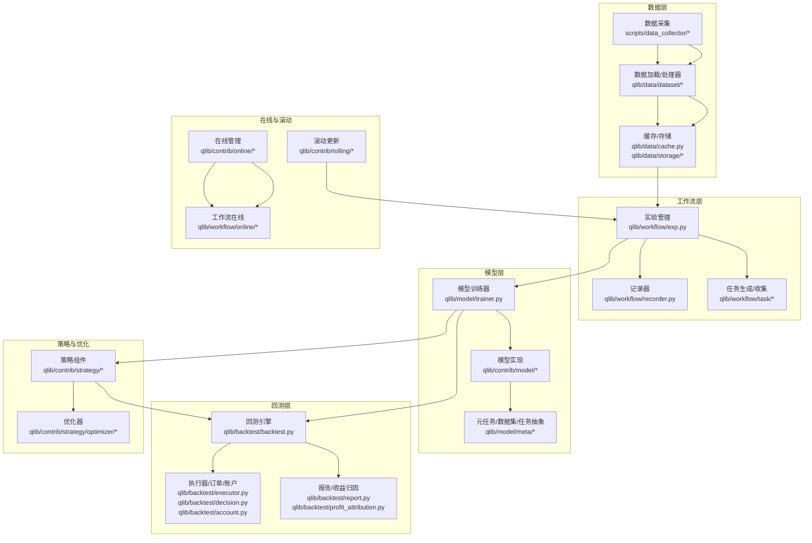
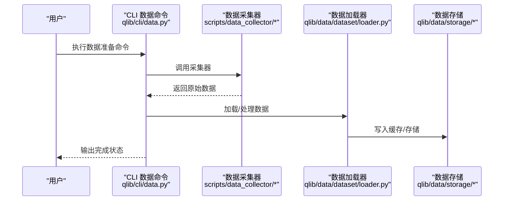
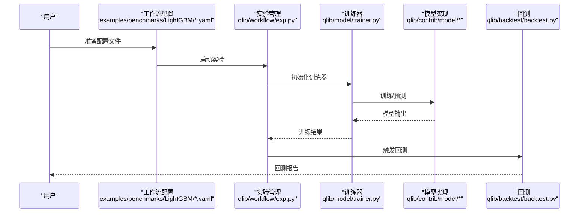
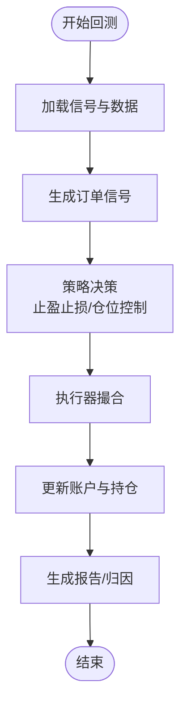
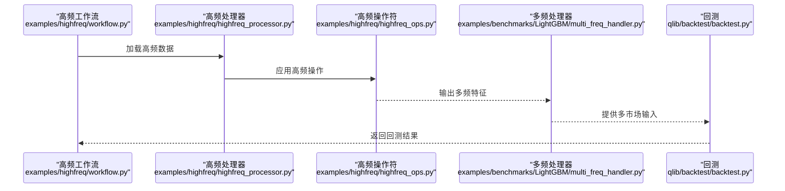
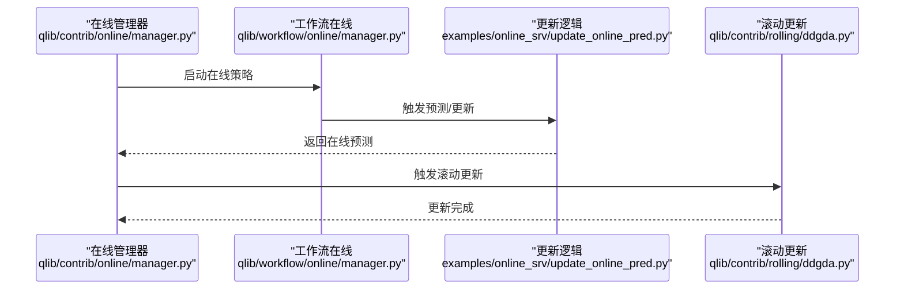
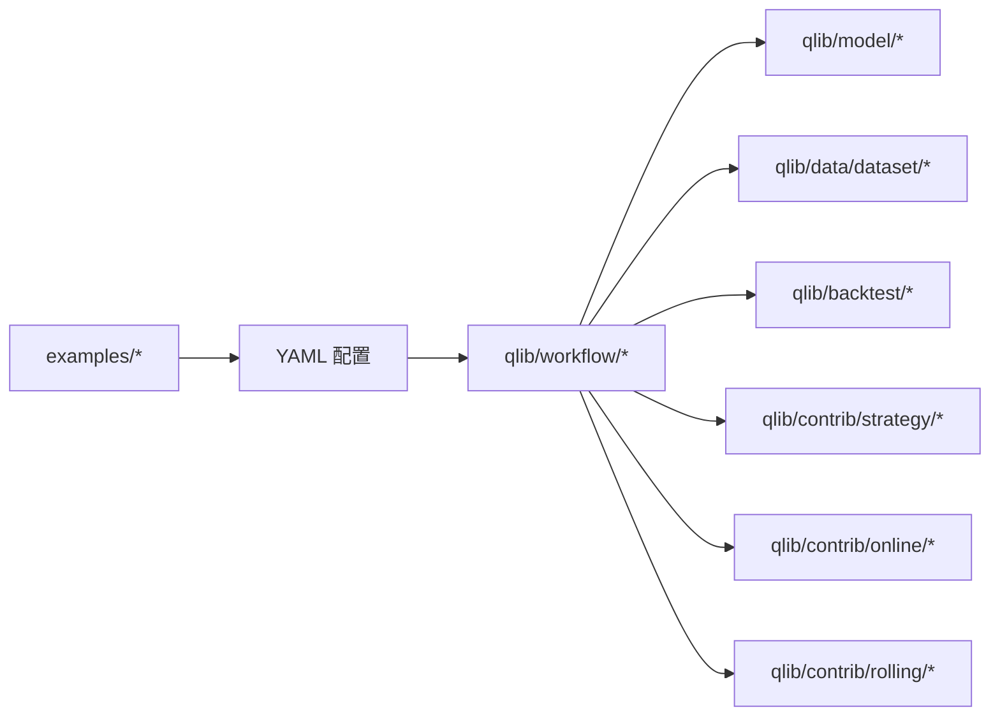

# 示例与教程

<cite>
**本文引用的文件**
- [README.md](file://README.md)
- [examples/README.md](file://examples/README.md)
- [examples/benchmarks/README.md](file://examples/benchmarks/README.md)
- [examples/benchmarks_dynamic/README.md](file://examples/benchmarks_dynamic/README.md)
- [examples/data_demo/README.md](file://examples/data_demo/README.md)
- [examples/highfreq/README.md](file://examples/highfreq/README.md)
- [examples/rl_order_execution/README.md](file://examples/rl_order_execution/README.md)
- [examples/portfolio/README.md](file://examples/portfolio/README.md)
- [examples/orderbook_data/README.md](file://examples/orderbook_data/README.md)
- [examples/rolling_process_data/README.md](file://examples/rolling_process_data/README.md)
- [examples/nested_decision_execution/README.md](file://examples/nested_decision_execution/README.md)
- [examples/model_interpreter/feature.py](file://examples/model_interpreter/feature.py)
- [examples/model_rolling/task_manager_rolling.py](file://examples/model_rolling/task_manager_rolling.py)
- [examples/online_srv/online_management_simulate.py](file://examples/online_srv/online_management_simulate.py)
- [examples/online_srv/rolling_online_management.py](file://examples/online_srv/rolling_online_management.py)
- [examples/online_srv/update_online_pred.py](file://examples/online_srv/update_online_pred.py)
- [examples/hyperparameter/LightGBM/Readme.md](file://examples/hyperparameter/LightGBM/Readme.md)
- [examples/hyperparameter/LightGBM/hyperparameter_158.py](file://examples/hyperparameter/LightGBM/hyperparameter_158.py)
- [examples/hyperparameter/LightGBM/hyperparameter_360.py](file://examples/hyperparameter/LightGBM/hyperparameter_360.py)
- [examples/hyperparameter/LightGBM/requirements.txt](file://examples/hyperparameter/LightGBM/requirements.txt)
- [examples/benchmarks/LightGBM/requirements.txt](file://examples/benchmarks/LightGBM/requirements.txt)
- [examples/benchmarks/LightGBM/workflow_config_lightgbm_Alpha158.yaml](file://examples/benchmarks/LightGBM/workflow_config_lightgbm_Alpha158.yaml)
- [examples/benchmarks/LightGBM/workflow_config_lightgbm_Alpha360.yaml](file://examples/benchmarks/LightGBM/workflow_config_lightgbm_Alpha360.yaml)
- [examples/benchmarks/LightGBM/workflow_config_lightgbm_multi_freq.yaml](file://examples/benchmarks/LightGBM/workflow_config_lightgbm_multi_freq.yaml)
- [examples/benchmarks/LightGBM/workflow_config_lightgbm_Alpha158_multi_pass_bt.yaml](file://examples/benchmarks/LightGBM/workflow_config_lightgbm_Alpha158_multi_pass_bt.yaml)
- [examples/benchmarks/LightGBM/workflow_config_lightgbm_configurable_dataset.yaml](file://examples/benchmarks/LightGBM/workflow_config_lightgbm_configurable_dataset.yaml)
- [examples/benchmarks/LightGBM/features_sample.py](file://examples/benchmarks/LightGBM/features_sample.py)
- [examples/benchmarks/LightGBM/multi_freq_handler.py](file://examples/benchmarks/LightGBM/multi_freq_handler.py)
- [examples/benchmarks/LightGBM/features_resample_N.py](file://examples/benchmarks/LightGBM/features_resample_N.py)
- [examples/benchmarks_dynamic/baseline/rolling_benchmark.py](file://examples/benchmarks_dynamic/baseline/rolling_benchmark.py)
- [examples/benchmarks_dynamic/baseline/workflow_config_lightgbm_Alpha158.yaml](file://examples/benchmarks_dynamic/baseline/workflow_config_lightgbm_Alpha158.yaml)
- [examples/benchmarks_dynamic/baseline/workflow_config_linear_Alpha158.yaml](file://examples/benchmarks_dynamic/baseline/workflow_config_linear_Alpha158.yaml)
- [examples/benchmarks_dynamic/DDG-DA/requirements.txt](file://examples/benchmarks_dynamic/DDG-DA/requirements.txt)
- [examples/benchmarks_dynamic/DDG-DA/workflow.py](file://examples/benchmarks_dynamic/DDG-DA/workflow.py)
- [examples/benchmarks_dynamic/DDG-DA/Makefile](file://examples/benchmarks_dynamic/DDG-DA/Makefile)
- [examples/benchmarks_dynamic/DDG-DA/vis_data.py](file://examples/benchmarks_dynamic/DDG-DA/vis_data.py)
- [examples/data_demo/data_cache_demo.py](file://examples/data_demo/data_cache_demo.py)
- [examples/data_demo/data_mem_resuse_demo.py](file://examples/data_demo/data_mem_resuse_demo.py)
- [examples/highfreq/workflow.py](file://examples/highfreq/workflow.py)
- [examples/highfreq/highfreq_handler.py](file://examples/highfreq/highfreq_handler.py)
- [examples/highfreq/highfreq_ops.py](file://examples/highfreq/highfreq_ops.py)
- [examples/highfreq/highfreq_processor.py](file://examples/highfreq/highfreq_processor.py)
- [examples/rl_order_execution/scripts/gen_pickle_data.py](file://examples/rl_order_execution/scripts/gen_pickle_data.py)
- [examples/rl_order_execution/scripts/gen_training_orders.py](file://examples/rl_order_execution/scripts/gen_training_orders.py)
- [examples/rl_order_execution/scripts/merge_orders.py](file://examples/rl_order_execution/scripts/merge_orders.py)
- [examples/rl_order_execution/exp_configs/backtest_opds.yml](file://examples/rl_order_execution/exp_configs/backtest_opds.yml)
- [examples/rl_order_execution/exp_configs/backtest_ppo.yml](file://examples/rl_order_execution/exp_configs/backtest_ppo.yml)
- [examples/rl_order_execution/exp_configs/backtest_twap.yml](file://examples/rl_order_execution/exp_configs/backtest_twap.yml)
- [examples/rl_order_execution/exp_configs/train_opds.yml](file://examples/rl_order_execution/exp_configs/train_opds.yml)
- [examples/rl_order_execution/exp_configs/train_ppo.yml](file://examples/rl_order_execution/exp_configs/train_ppo.yml)
- [examples/portfolio/config_enhanced_indexing.yaml](file://examples/portfolio/config_enhanced_indexing.yaml)
- [examples/portfolio/prepare_riskdata.py](file://examples/portfolio/prepare_riskdata.py)
- [examples/orderbook_data/create_dataset.py](file://examples/orderbook_data/create_dataset.py)
- [examples/orderbook_data/example.py](file://examples/orderbook_data/example.py)
- [examples/rolling_process_data/rolling_handler.py](file://examples/rolling_process_data/rolling_handler.py)
- [examples/nested_decision_execution/workflow.py](file://examples/nested_decision_execution/workflow.py)
- [qlib/backtest/backtest.py](file://qlib/backtest/backtest.py)
- [qlib/backtest/report.py](file://qlib/backtest/report.py)
- [qlib/backtest/executor.py](file://qlib/backtest/executor.py)
- [qlib/backtest/position.py](file://qlib/backtest/position.py)
- [qlib/backtest/decision.py](file://qlib/backtest/decision.py)
- [qlib/backtest/exchange.py](file://qlib/backtest/exchange.py)
- [qlib/backtest/account.py](file://qlib/backtest/account.py)
- [qlib/backtest/signal.py](file://qlib/backtest/signal.py)
- [qlib/backtest/utils.py](file://qlib/backtest/utils.py)
- [qlib/backtest/profit_attribution.py](file://qlib/backtest/profit_attribution.py)
- [qlib/data/dataset/loader.py](file://qlib/data/dataset/loader.py)
- [qlib/data/dataset/handler.py](file://qlib/data/dataset/handler.py)
- [qlib/data/dataset/processor.py](file://qlib/data/dataset/processor.py)
- [qlib/data/dataset/storage.py](file://qlib/data/dataset/storage.py)
- [qlib/data/dataset/utils.py](file://qlib/data/dataset/utils.py)
- [qlib/data/base.py](file://qlib/data/base.py)
- [qlib/data/cache.py](file://qlib/data/cache.py)
- [qlib/data/client.py](file://qlib/data/client.py)
- [qlib/data/data.py](file://qlib/data/data.py)
- [qlib/data/filter.py](file://qlib/data/filter.py)
- [qlib/data/inst_processor.py](file://qlib/data/inst_processor.py)
- [qlib/data/ops.py](file://qlib/data/ops.py)
- [qlib/data/pit.py](file://qlib/data/pit.py)
- [qlib/data/storage/file_storage.py](file://qlib/data/storage/file_storage.py)
- [qlib/data/storage/storage.py](file://qlib/data/storage/storage.py)
- [qlib/model/trainer.py](file://qlib/model/trainer.py)
- [qlib/model/base.py](file://qlib/model/base.py)
- [qlib/model/meta/model.py](file://qlib/model/meta/model.py)
- [qlib/model/meta/dataset.py](file://qlib/model/meta/dataset.py)
- [qlib/model/meta/task.py](file://qlib/model/meta/task.py)
- [qlib/contrib/model/pytorch_general_nn.py](file://qlib/contrib/model/pytorch_general_nn.py)
- [qlib/contrib/model/pytorch_lstm.py](file://qlib/contrib/model/pytorch_lstm.py)
- [qlib/contrib/model/pytorch_gru.py](file://qlib/contrib/model/pytorch_gru.py)
- [qlib/contrib/model/pytorch_transformer.py](file://qlib/contrib/model/pytorch_transformer.py)
- [qlib/contrib/model/pytorch_tabnet.py](file://qlib/contrib/model/pytorch_tabnet.py)
- [qlib/contrib/model/catboost_model.py](file://qlib/contrib/model/catboost_model.py)
- [qlib/contrib/model/xgboost.py](file://qlib/contrib/model/xgboost.py)
- [qlib/contrib/strategy/order_generator.py](file://qlib/contrib/strategy/order_generator.py)
- [qlib/contrib/strategy/cost_control.py](file://qlib/contrib/strategy/cost_control.py)
- [qlib/contrib/strategy/rule_strategy.py](file://qlib/contrib/strategy/rule_strategy.py)
- [qlib/contrib/strategy/signal_strategy.py](file://qlib/contrib/strategy/signal_strategy.py)
- [qlib/contrib/strategy/optimizer/optimizer.py](file://qlib/contrib/strategy/optimizer/optimizer.py)
- [qlib/contrib/strategy/optimizer/enhanced_indexing.py](file://qlib/contrib/strategy/optimizer/enhanced_indexing.py)
- [qlib/contrib/online/manager.py](file://qlib/contrib/online/manager.py)
- [qlib/contrib/online/online_model.py](file://qlib/contrib/online/online_model.py)
- [qlib/contrib/online/operator.py](file://qlib/contrib/online/operator.py)
- [qlib/contrib/online/user.py](file://qlib/contrib/online/user.py)
- [qlib/contrib/online/utils.py](file://qlib/contrib/online/utils.py)
- [qlib/contrib/tuner/tuner.py](file://qlib/contrib/tuner/tuner.py)
- [qlib/contrib/tuner/pipeline.py](file://qlib/contrib/tuner/pipeline.py)
- [qlib/contrib/tuner/launcher.py](file://qlib/contrib/tuner/launcher.py)
- [qlib/contrib/tuner/space.py](file://qlib/contrib/tuner/space.py)
- [qlib/contrib/tuner/config.py](file://qlib/contrib/tuner/config.py)
- [qlib/contrib/report/analysis_position/report.py](file://qlib/contrib/report/analysis_position/report.py)
- [qlib/contrib/report/analysis_position/cumulative_return.py](file://qlib/contrib/report/analysis_position/cumulative_return.py)
- [qlib/contrib/report/analysis_position/rank_label.py](file://qlib/contrib/report/analysis_position/rank_label.py)
- [qlib/contrib/report/analysis_position/score_ic.py](file://qlib/contrib/report/analysis_position/score_ic.py)
- [qlib/contrib/report/analysis_position/risk_analysis.py](file://qlib/contrib/report/analysis_position/risk_analysis.py)
- [qlib/contrib/report/analysis_model/analysis_model_performance.py](file://qlib/contrib/report/analysis_model/analysis_model_performance.py)
- [qlib/contrib/report/graph.py](file://qlib/contrib/report/graph.py)
- [qlib/contrib/report/utils.py](file://qlib/contrib/report/utils.py)
- [qlib/contrib/evaluate.py](file://qlib/contrib/evaluate.py)
- [qlib/contrib/evaluate_portfolio.py](file://qlib/contrib/evaluate_portfolio.py)
- [qlib/contrib/eva/alpha.py](file://qlib/contrib/eva/alpha.py)
- [qlib/contrib/rolling/base.py](file://qlib/contrib/rolling/base.py)
- [qlib/contrib/rolling/ddgda.py](file://qlib/contrib/rolling/ddgda.py)
- [qlib/workflow/recorder.py](file://qlib/workflow/recorder.py)
- [qlib/workflow/exp.py](file://qlib/workflow/exp.py)
- [qlib/workflow/expm.py](file://qlib/workflow/expm.py)
- [qlib/workflow/utils.py](file://qlib/workflow/utils.py)
- [qlib/workflow/task/manage.py](file://qlib/workflow/task/manage.py)
- [qlib/workflow/task/gen.py](file://qlib/workflow/task/gen.py)
- [qlib/workflow/task/collect.py](file://qlib/workflow/task/collect.py)
- [qlib/workflow/online/manager.py](file://qlib/workflow/online/manager.py)
- [qlib/workflow/online/strategy.py](file://qlib/workflow/online/strategy.py)
- [qlib/workflow/online/update.py](file://qlib/workflow/online/update.py)
- [qlib/workflow/online/utils.py](file://qlib/workflow/online/utils.py)
- [qlib/cli/run.py](file://qlib/cli/run.py)
- [qlib/cli/data.py](file://qlib/cli/data.py)
- [scripts/get_data.py](file://scripts/get_data.py)
- [scripts/data_collector/README.md](file://scripts/data_collector/README.md)
- [scripts/data_collector/index.py](file://scripts/data_collector/index.py)
- [scripts/data_collector/base.py](file://scripts/data_collector/base.py)
- [scripts/data_collector/yahoo/collector.py](file://scripts/data_collector/yahoo/collector.py)
- [scripts/data_collector/baostock_5min/collector.py](file://scripts/data_collector/baostock_5min/collector.py)
- [scripts/data_collector/fund/collector.py](file://scripts/data_collector/fund/collector.py)
- [scripts/data_collector/crypto/collector.py](file://scripts/data_collector/crypto/collector.py)
- [scripts/data_collector/us_index/collector.py](file://scripts/data_collector/us_index/collector.py)
- [scripts/data_collector/cn_index/collector.py](file://scripts/data_collector/cn_index/collector.py)
- [scripts/data_collector/br_index/collector.py](file://scripts/data_collector/br_index/collector.py)
- [scripts/data_collector/pit/collector.py](file://scripts/data_collector/pit/collector.py)
- [scripts/data_collector/future_trading_date_collector.py](file://scripts/data_collector/future_trading_date_collector.py)
- [scripts/check_data_health.py](file://scripts/check_data_health.py)
- [scripts/dump_bin.py](file://scripts/dump_bin.py)
- [scripts/dump_pit.py](file://scripts/dump_pit.py)
- [scripts/collect_info.py](file://scripts/collect_info.py)
- [scripts/dump_check_bin.py](file://scripts/dump_check_bin.py)
- [docs/start/installation.rst](file://docs/start/installation.rst)
- [docs/start/getdata.rst](file://docs/start/getdata.rst)
- [docs/start/initialization.rst](file://docs/start/initialization.rst)
- [docs/start/integration.rst](file://docs/start/integration.rst)
- [docs/introduction/introduction.rst](file://docs/introduction/introduction.rst)
- [docs/introduction/quick.rst](file://docs/introduction/quick.rst)
- [docs/component/data.rst](file://docs/component/data.rst)
- [docs/component/model.rst](file://docs/component/model.rst)
- [docs/component/workflow.rst](file://docs/component/workflow.rst)
- [docs/component/strategy.rst](file://docs/component/strategy.rst)
- [docs/component/report.rst](file://docs/component/report.rst)
- [docs/component/online.rst](file://docs/component/online.rst)
- [docs/component/recorder.rst](file://docs/component/recorder.rst)
- [docs/component/highfreq.rst](file://docs/component/highfreq.rst)
- [docs/component/meta.rst](file://docs/component/meta.rst)
- [docs/component/rl/framework.rst](file://docs/component/rl/framework.rst)
- [docs/component/rl/guidance.rst](file://docs/component/rl/guidance.rst)
- [docs/component/rl/overall.rst](file://docs/component/rl/overall.rst)
- [docs/component/rl/quickstart.rst](file://docs/component/rl/quickstart.rst)
- [docs/advanced/PIT.rst](file://docs/advanced/PIT.rst)
- [docs/advanced/serial.rst](file://docs/advanced/serial.rst)
- [docs/advanced/server.rst](file://docs/advanced/server.rst)
- [docs/advanced/task_management.rst](file://docs/advanced/task_management.rst)
- [docs/FAQ/FAQ.rst](file://docs/FAQ/FAQ.rst)
</cite>

## 目录
1. [简介](#简介)
2. [项目结构](#项目结构)
3. [核心组件](#核心组件)
4. [架构总览](#架构总览)
5. [详细组件分析](#详细组件分析)
6. [依赖关系分析](#依赖关系分析)
7. [性能考虑](#性能考虑)
8. [故障排除指南](#故障排除指南)
9. [结论](#结论)
10. [附录](#附录)

## 简介
本文件系统性整理 Qlib 的示例与教程资源，覆盖从入门到进阶的完整学习路径：基础示例（数据获取、模型训练、回测执行）、高级场景（复杂策略、多市场分析、在线服务、滚动更新）、最佳实践（模型选择、参数调优、结果分析）以及端到端工作流与运行方法。目标是帮助用户快速上手并构建完整的量化研究项目。

## 项目结构
Qlib 示例与教程主要分布在 examples 目录中，并辅以文档 docs 中的组件与高级主题说明；数据采集脚本位于 scripts 目录；核心模块在 qlib 包内，提供 backtest、data、model、workflow、contrib 等子系统。

```mermaid
graph TB
A["examples/"] --> A1["benchmarks/"]
A --> A2["benchmarks_dynamic/"]
A --> A3["data_demo/"]
A --> A4["highfreq/"]
A --> A5["rl_order_execution/"]
A --> A6["portfolio/"]
A --> A7["orderbook_data/"]
A --> A8["rolling_process_data/"]
A --> A9["nested_decision_execution/"]
A --> A10["hyperparameter/LightGBM/"]
A --> A11["model_interpreter/"]
A --> A12["model_rolling/"]
A --> A13["online_srv/"]
B["scripts/"] --> B1["data_collector/"]
B --> B2["get_data.py"]
B --> B3["check_data_health.py"]
B --> B4["dump_bin.py"]
B --> B5["dump_pit.py"]
C["qlib/"] --> C1["backtest/"]
C --> C2["data/dataset/"]
C --> C3["model/"]
C --> C4["workflow/"]
C --> C5["contrib/"]
C --> C6["cli/"]
D["docs/"] --> D1["start/"]
D --> D2["introduction/"]
D --> D3["component/"]
D --> D4["advanced/"]
D --> D5["FAQ/"]
```

图示来源
- [examples/README.md](file://examples/README.md)
- [scripts/README.md](file://scripts/README.md)
- [qlib/backtest/backtest.py](file://qlib/backtest/backtest.py)
- [qlib/data/dataset/loader.py](file://qlib/data/dataset/loader.py)
- [qlib/model/trainer.py](file://qlib/model/trainer.py)
- [qlib/workflow/exp.py](file://qlib/workflow/exp.py)
- [qlib/contrib/](file://qlib/contrib/)
- [docs/start/](file://docs/start/)
- [docs/introduction/](file://docs/introduction/)
- [docs/component/](file://docs/component/)
- [docs/advanced/](file://docs/advanced/)
- [docs/FAQ/](file://docs/FAQ/)

章节来源
- [examples/README.md](file://examples/README.md)
- [scripts/README.md](file://scripts/README.md)
- [docs/start/installation.rst](file://docs/start/installation.rst)
- [docs/start/getdata.rst](file://docs/start/getdata.rst)
- [docs/start/initialization.rst](file://docs/start/initialization.rst)
- [docs/start/integration.rst](file://docs/start/integration.rst)

## 核心组件
- 数据层：提供数据加载、处理器、存储与缓存机制，支持高频与多频数据处理。
- 模型层：内置多种机器学习与深度学习模型，支持元任务与训练器抽象。
- 回测层：实现账户、信号、订单、撮合、执行器、报告与收益归因。
- 工作流层：实验管理、记录器、任务生成与收集、在线策略与更新。
- 贡献模块：策略优化器、在线服务、滚动更新、报告分析、评估工具等。
- CLI 与脚本：命令行运行与数据采集工具。

章节来源
- [qlib/data/dataset/loader.py](file://qlib/data/dataset/loader.py)
- [qlib/data/dataset/handler.py](file://qlib/data/dataset/handler.py)
- [qlib/data/dataset/processor.py](file://qlib/data/dataset/processor.py)
- [qlib/data/dataset/storage.py](file://qlib/data/dataset/storage.py)
- [qlib/data/dataset/utils.py](file://qlib/data/dataset/utils.py)
- [qlib/backtest/backtest.py](file://qlib/backtest/backtest.py)
- [qlib/backtest/report.py](file://qlib/backtest/report.py)
- [qlib/backtest/executor.py](file://qlib/backtest/executor.py)
- [qlib/backtest/position.py](file://qlib/backtest/position.py)
- [qlib/backtest/decision.py](file://qlib/backtest/decision.py)
- [qlib/backtest/exchange.py](file://qlib/backtest/exchange.py)
- [qlib/backtest/account.py](file://qlib/backtest/account.py)
- [qlib/backtest/signal.py](file://qlib/backtest/signal.py)
- [qlib/backtest/utils.py](file://qlib/backtest/utils.py)
- [qlib/backtest/profit_attribution.py](file://qlib/backtest/profit_attribution.py)
- [qlib/model/trainer.py](file://qlib/model/trainer.py)
- [qlib/model/base.py](file://qlib/model/base.py)
- [qlib/model/meta/model.py](file://qlib/model/meta/model.py)
- [qlib/model/meta/dataset.py](file://qlib/model/meta/dataset.py)
- [qlib/model/meta/task.py](file://qlib/model/meta/task.py)
- [qlib/workflow/recorder.py](file://qlib/workflow/recorder.py)
- [qlib/workflow/exp.py](file://qlib/workflow/exp.py)
- [qlib/workflow/expm.py](file://qlib/workflow/expm.py)
- [qlib/workflow/utils.py](file://qlib/workflow/utils.py)
- [qlib/workflow/task/manage.py](file://qlib/workflow/task/manage.py)
- [qlib/workflow/task/gen.py](file://qlib/workflow/task/gen.py)
- [qlib/workflow/task/collect.py](file://qlib/workflow/task/collect.py)
- [qlib/contrib/strategy/optimizer/optimizer.py](file://qlib/contrib/strategy/optimizer/optimizer.py)
- [qlib/contrib/strategy/optimizer/enhanced_indexing.py](file://qlib/contrib/strategy/optimizer/enhanced_indexing.py)
- [qlib/contrib/online/manager.py](file://qlib/contrib/online/manager.py)
- [qlib/contrib/online/online_model.py](file://qlib/contrib/online/online_model.py)
- [qlib/contrib/online/operator.py](file://qlib/contrib/online/operator.py)
- [qlib/contrib/online/user.py](file://qlib/contrib/online/user.py)
- [qlib/contrib/online/utils.py](file://qlib/contrib/online/utils.py)
- [qlib/contrib/report/analysis_position/report.py](file://qlib/contrib/report/analysis_position/report.py)
- [qlib/contrib/report/analysis_position/cumulative_return.py](file://qlib/contrib/report/analysis_position/cumulative_return.py)
- [qlib/contrib/report/analysis_position/rank_label.py](file://qlib/contrib/report/analysis_position/rank_label.py)
- [qlib/contrib/report/analysis_position/score_ic.py](file://qlib/contrib/report/analysis_position/score_ic.py)
- [qlib/contrib/report/analysis_position/risk_analysis.py](file://qlib/contrib/report/analysis_position/risk_analysis.py)
- [qlib/contrib/report/analysis_model/analysis_model_performance.py](file://qlib/contrib/report/analysis_model/analysis_model_performance.py)
- [qlib/contrib/report/graph.py](file://qlib/contrib/report/graph.py)
- [qlib/contrib/report/utils.py](file://qlib/contrib/report/utils.py)
- [qlib/contrib/evaluate.py](file://qlib/contrib/evaluate.py)
- [qlib/contrib/evaluate_portfolio.py](file://qlib/contrib/evaluate_portfolio.py)
- [qlib/contrib/eva/alpha.py](file://qlib/contrib/eva/alpha.py)
- [qlib/contrib/rolling/base.py](file://qlib/contrib/rolling/base.py)
- [qlib/contrib/rolling/ddgda.py](file://qlib/contrib/rolling/ddgda.py)

## 架构总览
下图展示从“数据准备”到“模型训练/回测/报告”的典型端到端流程，以及可选的“在线服务/滚动更新”。

图示来源
- [qlib/data/dataset/loader.py](file://qlib/data/dataset/loader.py)
- [qlib/data/cache.py](file://qlib/data/cache.py)
- [qlib/data/storage/storage.py](file://qlib/data/storage/storage.py)
- [qlib/workflow/exp.py](file://qlib/workflow/exp.py)
- [qlib/workflow/recorder.py](file://qlib/workflow/recorder.py)
- [qlib/workflow/task/gen.py](file://qlib/workflow/task/gen.py)
- [qlib/workflow/task/collect.py](file://qlib/workflow/task/collect.py)
- [qlib/model/trainer.py](file://qlib/model/trainer.py)
- [qlib/contrib/model/catboost_model.py](file://qlib/contrib/model/catboost_model.py)
- [qlib/contrib/model/xgboost.py](file://qlib/contrib/model/xgboost.py)
- [qlib/contrib/model/pytorch_general_nn.py](file://qlib/contrib/model/pytorch_general_nn.py)
- [qlib/backtest/backtest.py](file://qlib/backtest/backtest.py)
- [qlib/backtest/executor.py](file://qlib/backtest/executor.py)
- [qlib/backtest/decision.py](file://qlib/backtest/decision.py)
- [qlib/backtest/account.py](file://qlib/backtest/account.py)
- [qlib/backtest/report.py](file://qlib/backtest/report.py)
- [qlib/backtest/profit_attribution.py](file://qlib/backtest/profit_attribution.py)
- [qlib/contrib/strategy/order_generator.py](file://qlib/contrib/strategy/order_generator.py)
- [qlib/contrib/strategy/optimizer/optimizer.py](file://qlib/contrib/strategy/optimizer/optimizer.py)
- [qlib/contrib/online/manager.py](file://qlib/contrib/online/manager.py)
- [qlib/workflow/online/manager.py](file://qlib/workflow/online/manager.py)
- [qlib/contrib/rolling/base.py](file://qlib/contrib/rolling/base.py)

## 详细组件分析

### 基础示例：数据获取与缓存
- 数据采集脚本：支持多来源（如 Yahoo、BaoStock、指数、期货日历、PIT 等），通过统一接口下载并入库。
- 数据加载与处理器：支持按需加载、特征处理、权重计算与存储。
- 缓存与存储：提升重复访问效率，支持文件存储与内存缓存。
- 运行方法：参考安装与初始化文档，使用 CLI 或直接运行脚本。

图示来源
- [qlib/cli/data.py](file://qlib/cli/data.py)
- [scripts/data_collector/README.md](file://scripts/data_collector/README.md)
- [scripts/data_collector/index.py](file://scripts/data_collector/index.py)
- [qlib/data/dataset/loader.py](file://qlib/data/dataset/loader.py)
- [qlib/data/storage/storage.py](file://qlib/data/storage/storage.py)

章节来源
- [docs/start/installation.rst](file://docs/start/installation.rst)
- [docs/start/getdata.rst](file://docs/start/getdata.rst)
- [docs/start/initialization.rst](file://docs/start/initialization.rst)
- [scripts/get_data.py](file://scripts/get_data.py)
- [scripts/data_collector/README.md](file://scripts/data_collector/README.md)
- [scripts/data_collector/yahoo/collector.py](file://scripts/data_collector/yahoo/collector.py)
- [scripts/data_collector/baostock_5min/collector.py](file://scripts/data_collector/baostock_5min/collector.py)
- [scripts/data_collector/fund/collector.py](file://scripts/data_collector/fund/collector.py)
- [scripts/data_collector/crypto/collector.py](file://scripts/data_collector/crypto/collector.py)
- [scripts/data_collector/us_index/collector.py](file://scripts/data_collector/us_index/collector.py)
- [scripts/data_collector/cn_index/collector.py](file://scripts/data_collector/cn_index/collector.py)
- [scripts/data_collector/br_index/collector.py](file://scripts/data_collector/br_index/collector.py)
- [scripts/data_collector/pit/collector.py](file://scripts/data_collector/pit/collector.py)
- [scripts/data_collector/future_trading_date_collector.py](file://scripts/data_collector/future_trading_date_collector.py)
- [qlib/data/dataset/loader.py](file://qlib/data/dataset/loader.py)
- [qlib/data/dataset/handler.py](file://qlib/data/dataset/handler.py)
- [qlib/data/dataset/processor.py](file://qlib/data/dataset/processor.py)
- [qlib/data/dataset/storage.py](file://qlib/data/dataset/storage.py)
- [qlib/data/cache.py](file://qlib/data/cache.py)
- [qlib/data/storage/file_storage.py](file://qlib/data/storage/file_storage.py)

### 基础示例：模型训练与基准对比
- 使用 LightGBM 等基准模型进行 Alpha158/Alpha360 的训练与回测。
- 支持多频数据、可配置数据集、多轮次回测等变体。
- 可通过 YAML 配置文件定义工作流，便于复现实验。

图示来源
- [examples/benchmarks/LightGBM/workflow_config_lightgbm_Alpha158.yaml](file://examples/benchmarks/LightGBM/workflow_config_lightgbm_Alpha158.yaml)
- [examples/benchmarks/LightGBM/workflow_config_lightgbm_Alpha360.yaml](file://examples/benchmarks/LightGBM/workflow_config_lightgbm_Alpha360.yaml)
- [examples/benchmarks/LightGBM/workflow_config_lightgbm_multi_freq.yaml](file://examples/benchmarks/LightGBM/workflow_config_lightgbm_multi_freq.yaml)
- [examples/benchmarks/LightGBM/workflow_config_lightgbm_Alpha158_multi_pass_bt.yaml](file://examples/benchmarks/LightGBM/workflow_config_lightgbm_Alpha158_multi_pass_bt.yaml)
- [examples/benchmarks/LightGBM/workflow_config_lightgbm_configurable_dataset.yaml](file://examples/benchmarks/LightGBM/workflow_config_lightgbm_configurable_dataset.yaml)
- [qlib/workflow/exp.py](file://qlib/workflow/exp.py)
- [qlib/model/trainer.py](file://qlib/model/trainer.py)
- [qlib/contrib/model/catboost_model.py](file://qlib/contrib/model/catboost_model.py)
- [qlib/contrib/model/xgboost.py](file://qlib/contrib/model/xgboost.py)
- [qlib/backtest/backtest.py](file://qlib/backtest/backtest.py)

章节来源
- [examples/benchmarks/README.md](file://examples/benchmarks/README.md)
- [examples/benchmarks/LightGBM/requirements.txt](file://examples/benchmarks/LightGBM/requirements.txt)
- [examples/benchmarks/LightGBM/workflow_config_lightgbm_Alpha158.yaml](file://examples/benchmarks/LightGBM/workflow_config_lightgbm_Alpha158.yaml)
- [examples/benchmarks/LightGBM/workflow_config_lightgbm_Alpha360.yaml](file://examples/benchmarks/LightGBM/workflow_config_lightgbm_Alpha360.yaml)
- [examples/benchmarks/LightGBM/workflow_config_lightgbm_multi_freq.yaml](file://examples/benchmarks/LightGBM/workflow_config_lightgbm_multi_freq.yaml)
- [examples/benchmarks/LightGBM/workflow_config_lightgbm_Alpha158_multi_pass_bt.yaml](file://examples/benchmarks/LightGBM/workflow_config_lightgbm_Alpha158_multi_pass_bt.yaml)
- [examples/benchmarks/LightGBM/workflow_config_lightgbm_configurable_dataset.yaml](file://examples/benchmarks/LightGBM/workflow_config_lightgbm_configurable_dataset.yaml)
- [examples/benchmarks/LightGBM/features_sample.py](file://examples/benchmarks/LightGBM/features_sample.py)
- [examples/benchmarks/LightGBM/multi_freq_handler.py](file://examples/benchmarks/LightGBM/multi_freq_handler.py)
- [examples/benchmarks/LightGBM/features_resample_N.py](file://examples/benchmarks/LightGBM/features_resample_N.py)
- [qlib/model/trainer.py](file://qlib/model/trainer.py)
- [qlib/contrib/model/catboost_model.py](file://qlib/contrib/model/catboost_model.py)
- [qlib/contrib/model/xgboost.py](file://qlib/contrib/model/xgboost.py)

### 基础示例：回测执行与报告
- 回测引擎负责信号生成、订单决策、撮合执行与账户更新。
- 报告模块提供收益曲线、IC 分析、风险分解与归因分析。
- 支持高阶数据结构与高性能数据源以提升吞吐。

图示来源
- [qlib/backtest/backtest.py](file://qlib/backtest/backtest.py)
- [qlib/backtest/executor.py](file://qlib/backtest/executor.py)
- [qlib/backtest/decision.py](file://qlib/backtest/decision.py)
- [qlib/backtest/exchange.py](file://qlib/backtest/exchange.py)
- [qlib/backtest/account.py](file://qlib/backtest/account.py)
- [qlib/backtest/report.py](file://qlib/backtest/report.py)
- [qlib/backtest/profit_attribution.py](file://qlib/backtest/profit_attribution.py)

章节来源
- [qlib/backtest/backtest.py](file://qlib/backtest/backtest.py)
- [qlib/backtest/report.py](file://qlib/backtest/report.py)
- [qlib/backtest/executor.py](file://qlib/backtest/executor.py)
- [qlib/backtest/position.py](file://qlib/backtest/position.py)
- [qlib/backtest/decision.py](file://qlib/backtest/decision.py)
- [qlib/backtest/exchange.py](file://qlib/backtest/exchange.py)
- [qlib/backtest/account.py](file://qlib/backtest/account.py)
- [qlib/backtest/signal.py](file://qlib/backtest/signal.py)
- [qlib/backtest/utils.py](file://qlib/backtest/utils.py)
- [qlib/backtest/profit_attribution.py](file://qlib/backtest/profit_attribution.py)

### 高级示例：高频交易与多市场分析
- 高频工作流包含处理器、操作符与多频数据适配。
- 多市场/多因子场景可通过多频处理器与特征重采样实现。

图示来源
- [examples/highfreq/workflow.py](file://examples/highfreq/workflow.py)
- [examples/highfreq/highfreq_processor.py](file://examples/highfreq/highfreq_processor.py)
- [examples/highfreq/highfreq_ops.py](file://examples/highfreq/highfreq_ops.py)
- [examples/benchmarks/LightGBM/multi_freq_handler.py](file://examples/benchmarks/LightGBM/multi_freq_handler.py)
- [qlib/backtest/backtest.py](file://qlib/backtest/backtest.py)

章节来源
- [examples/highfreq/README.md](file://examples/highfreq/README.md)
- [examples/highfreq/workflow.py](file://examples/highfreq/workflow.py)
- [examples/highfreq/highfreq_handler.py](file://examples/highfreq/highfreq_handler.py)
- [examples/highfreq/highfreq_ops.py](file://examples/highfreq/highfreq_ops.py)
- [examples/highfreq/highfreq_processor.py](file://examples/highfreq/highfreq_processor.py)
- [examples/benchmarks/LightGBM/multi_freq_handler.py](file://examples/benchmarks/LightGBM/multi_freq_handler.py)

### 高级示例：在线服务与滚动更新
- 在线管理器负责模型在线预测、更新与用户交互。
- 滚动更新模块支持动态数据与模型的持续迭代。

图示来源
- [qlib/contrib/online/manager.py](file://qlib/contrib/online/manager.py)
- [qlib/workflow/online/manager.py](file://qlib/workflow/online/manager.py)
- [examples/online_srv/update_online_pred.py](file://examples/online_srv/update_online_pred.py)
- [qlib/contrib/rolling/ddgda.py](file://qlib/contrib/rolling/ddgda.py)

章节来源
- [examples/online_srv/online_management_simulate.py](file://examples/online_srv/online_management_simulate.py)
- [examples/online_srv/rolling_online_management.py](file://examples/online_srv/rolling_online_management.py)
- [examples/online_srv/update_online_pred.py](file://examples/online_srv/update_online_pred.py)
- [qlib/contrib/online/manager.py](file://qlib/contrib/online/manager.py)
- [qlib/workflow/online/manager.py](file://qlib/workflow/online/manager.py)
- [qlib/contrib/rolling/ddgda.py](file://qlib/contrib/rolling/ddgda.py)

### 高级示例：动态基准与滚动基准
- 动态基准（DDG-DA）提供滚动对比与可视化。
- 基线滚动基准用于长期稳定性评估。

章节来源
- [examples/benchmarks_dynamic/README.md](file://examples/benchmarks_dynamic/README.md)
- [examples/benchmarks_dynamic/DDG-DA/requirements.txt](file://examples/benchmarks_dynamic/DDG-DA/requirements.txt)
- [examples/benchmarks_dynamic/DDG-DA/workflow.py](file://examples/benchmarks_dynamic/DDG-DA/workflow.py)
- [examples/benchmarks_dynamic/DDG-DA/Makefile](file://examples/benchmarks_dynamic/DDG-DA/Makefile)
- [examples/benchmarks_dynamic/DDG-DA/vis_data.py](file://examples/benchmarks_dynamic/DDG-DA/vis_data.py)
- [examples/benchmarks_dynamic/baseline/rolling_benchmark.py](file://examples/benchmarks_dynamic/baseline/rolling_benchmark.py)
- [examples/benchmarks_dynamic/baseline/workflow_config_lightgbm_Alpha158.yaml](file://examples/benchmarks_dynamic/baseline/workflow_config_lightgbm_Alpha158.yaml)
- [examples/benchmarks_dynamic/baseline/workflow_config_linear_Alpha158.yaml](file://examples/benchmarks_dynamic/baseline/workflow_config_linear_Alpha158.yaml)

### 高级示例：强化学习订单执行
- 提供 RL 订单执行的训练与回测配置，包含数据生成与合并脚本。

章节来源
- [examples/rl_order_execution/README.md](file://examples/rl_order_execution/README.md)
- [examples/rl_order_execution/scripts/gen_pickle_data.py](file://examples/rl_order_execution/scripts/gen_pickle_data.py)
- [examples/rl_order_execution/scripts/gen_training_orders.py](file://examples/rl_order_execution/scripts/gen_training_orders.py)
- [examples/rl_order_execution/scripts/merge_orders.py](file://examples/rl_order_execution/scripts/merge_orders.py)
- [examples/rl_order_execution/exp_configs/backtest_opds.yml](file://examples/rl_order_execution/exp_configs/backtest_opds.yml)
- [examples/rl_order_execution/exp_configs/backtest_ppo.yml](file://examples/rl_order_execution/exp_configs/backtest_ppo.yml)
- [examples/rl_order_execution/exp_configs/backtest_twap.yml](file://examples/rl_order_execution/exp_configs/backtest_twap.yml)
- [examples/rl_order_execution/exp_configs/train_opds.yml](file://examples/rl_order_execution/exp_configs/train_opds.yml)
- [examples/rl_order_execution/exp_configs/train_ppo.yml](file://examples/rl_order_execution/exp_configs/train_ppo.yml)

### 高级示例：组合与风险管理
- 增强型指数跟踪配置与风险数据准备。
- 组合层面的评估与报告工具。

章节来源
- [examples/portfolio/README.md](file://examples/portfolio/README.md)
- [examples/portfolio/config_enhanced_indexing.yaml](file://examples/portfolio/config_enhanced_indexing.yaml)
- [examples/portfolio/prepare_riskdata.py](file://examples/portfolio/prepare_riskdata.py)
- [qlib/contrib/evaluate_portfolio.py](file://qlib/contrib/evaluate_portfolio.py)

### 高级示例：逐笔簿数据与订单簿建模
- 订单簿数据集构建与示例脚本。

章节来源
- [examples/orderbook_data/README.md](file://examples/orderbook_data/README.md)
- [examples/orderbook_data/create_dataset.py](file://examples/orderbook_data/create_dataset.py)
- [examples/orderbook_data/example.py](file://examples/orderbook_data/example.py)

### 高级示例：滚动数据处理
- 滚动处理器与工作流，支持时间序列滚动窗口的数据处理。

章节来源
- [examples/rolling_process_data/README.md](file://examples/rolling_process_data/README.md)
- [examples/rolling_process_data/rolling_handler.py](file://examples/rolling_process_data/rolling_handler.py)
- [examples/rolling_process_data/workflow.py](file://examples/rolling_process_data/workflow.py)

### 高级示例：嵌套决策执行
- 复杂决策链路的工作流示例。

章节来源
- [examples/nested_decision_execution/README.md](file://examples/nested_decision_execution/README.md)
- [examples/nested_decision_execution/workflow.py](file://examples/nested_decision_execution/workflow.py)

### 高级示例：模型解释与滚动任务
- 特征重要性解释与滚动任务管理。

章节来源
- [examples/model_interpreter/feature.py](file://examples/model_interpreter/feature.py)
- [examples/model_rolling/task_manager_rolling.py](file://examples/model_rolling/task_manager_rolling.py)

### 参数调优与最佳实践
- LightGBM 超参调优示例与依赖要求。
- 模型选择建议：根据数据特性选择线性/树/神经网络/图模型等。
- 结果分析：关注 IC、分位表现、最大回撤、年化收益等指标。

章节来源
- [examples/hyperparameter/LightGBM/Readme.md](file://examples/hyperparameter/LightGBM/Readme.md)
- [examples/hyperparameter/LightGBM/hyperparameter_158.py](file://examples/hyperparameter/LightGBM/hyperparameter_158.py)
- [examples/hyperparameter/LightGBM/hyperparameter_360.py](file://examples/hyperparameter/LightGBM/hyperparameter_360.py)
- [examples/hyperparameter/LightGBM/requirements.txt](file://examples/hyperparameter/LightGBM/requirements.txt)

## 依赖关系分析
- 示例与核心模块的耦合：示例通过 YAML 配置与工作流层解耦，便于替换模型与数据。
- 数据依赖：示例依赖数据采集脚本与数据加载器；高频示例依赖多频处理器。
- 模块内聚：回测、报告、策略、在线、滚动等功能模块边界清晰，职责单一。

图示来源
- [examples/benchmarks/LightGBM/workflow_config_lightgbm_Alpha158.yaml](file://examples/benchmarks/LightGBM/workflow_config_lightgbm_Alpha158.yaml)
- [qlib/workflow/exp.py](file://qlib/workflow/exp.py)
- [qlib/model/trainer.py](file://qlib/model/trainer.py)
- [qlib/data/dataset/loader.py](file://qlib/data/dataset/loader.py)
- [qlib/backtest/backtest.py](file://qlib/backtest/backtest.py)
- [qlib/contrib/strategy/order_generator.py](file://qlib/contrib/strategy/order_generator.py)
- [qlib/contrib/online/manager.py](file://qlib/contrib/online/manager.py)
- [qlib/contrib/rolling/base.py](file://qlib/contrib/rolling/base.py)

章节来源
- [examples/benchmarks/LightGBM/requirements.txt](file://examples/benchmarks/LightGBM/requirements.txt)
- [examples/hyperparameter/LightGBM/requirements.txt](file://examples/hyperparameter/LightGBM/requirements.txt)
- [examples/benchmarks_dynamic/DDG-DA/requirements.txt](file://examples/benchmarks_dynamic/DDG-DA/requirements.txt)

## 性能考虑
- 数据缓存与存储：优先使用缓存与高效存储后端，减少重复 IO。
- 多进程/并行：利用并行任务生成与收集，加速实验迭代。
- 高频数据：采用高性能数据源与批处理策略，降低延迟。
- 模型训练：合理设置超参与早停策略，避免过拟合与资源浪费。
- 报告与可视化：仅在必要时生成图表，避免阻塞主流程。

## 故障排除指南
- 数据健康检查：使用数据健康检查脚本定位缺失或异常数据。
- 回测异常：核对信号生成、订单决策与执行器配置是否一致。
- 在线更新失败：检查在线管理器与滚动更新模块的日志与状态。
- 模型训练报错：确认依赖版本与配置文件中的参数范围。
- 权限与路径问题：确保数据目录与日志目录具有写权限。

章节来源
- [scripts/check_data_health.py](file://scripts/check_data_health.py)
- [qlib/backtest/backtest.py](file://qlib/backtest/backtest.py)
- [qlib/contrib/online/manager.py](file://qlib/contrib/online/manager.py)
- [qlib/contrib/rolling/ddgda.py](file://qlib/contrib/rolling/ddgda.py)

## 结论
Qlib 的示例与教程体系覆盖了从数据准备、模型训练、回测执行到高级策略与在线服务的完整量化研究流程。通过 YAML 配置与工作流抽象，用户可以快速复现实验并扩展到更复杂的场景。建议结合文档与示例逐步深入，先掌握基础工作流，再探索高频、在线与滚动更新等高级能力。

## 附录
- 安装与初始化：参考安装、数据获取、初始化与集成文档。
- 文档索引：组件文档（数据、模型、工作流、策略、报告、在线、元任务、RL）、高级主题（PIT、串行、服务器、任务管理）、FAQ。

章节来源
- [docs/start/installation.rst](file://docs/start/installation.rst)
- [docs/start/getdata.rst](file://docs/start/getdata.rst)
- [docs/start/initialization.rst](file://docs/start/initialization.rst)
- [docs/start/integration.rst](file://docs/start/integration.rst)
- [docs/component/data.rst](file://docs/component/data.rst)
- [docs/component/model.rst](file://docs/component/model.rst)
- [docs/component/workflow.rst](file://docs/component/workflow.rst)
- [docs/component/strategy.rst](file://docs/component/strategy.rst)
- [docs/component/report.rst](file://docs/component/report.rst)
- [docs/component/online.rst](file://docs/component/online.rst)
- [docs/component/recorder.rst](file://docs/component/recorder.rst)
- [docs/component/highfreq.rst](file://docs/component/highfreq.rst)
- [docs/component/meta.rst](file://docs/component/meta.rst)
- [docs/component/rl/framework.rst](file://docs/component/rl/framework.rst)
- [docs/component/rl/guidance.rst](file://docs/component/rl/guidance.rst)
- [docs/component/rl/overall.rst](file://docs/component/rl/overall.rst)
- [docs/component/rl/quickstart.rst](file://docs/component/rl/quickstart.rst)
- [docs/advanced/PIT.rst](file://docs/advanced/PIT.rst)
- [docs/advanced/serial.rst](file://docs/advanced/serial.rst)
- [docs/advanced/server.rst](file://docs/advanced/server.rst)
- [docs/advanced/task_management.rst](file://docs/advanced/task_management.rst)
- [docs/FAQ/FAQ.rst](file://docs/FAQ/FAQ.rst)