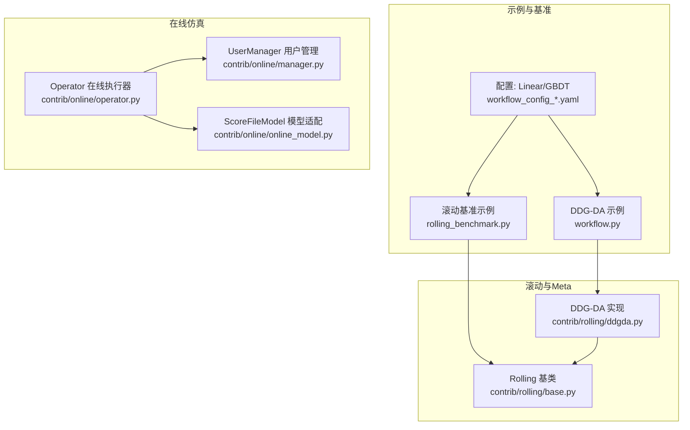
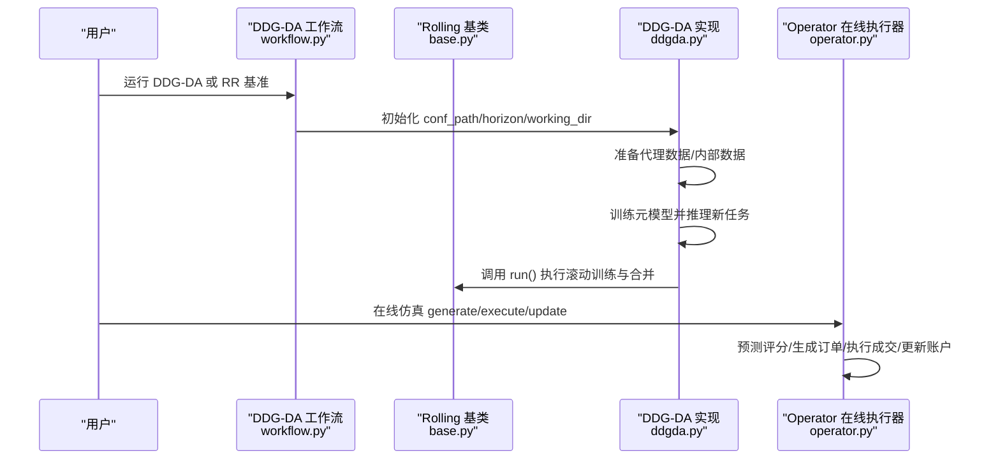
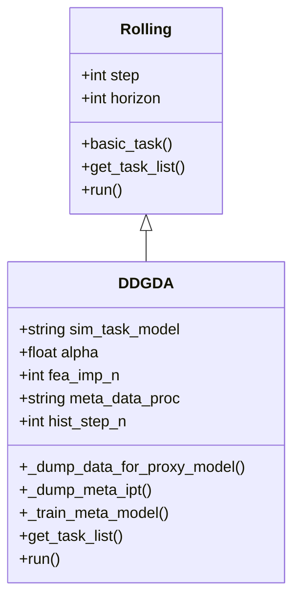
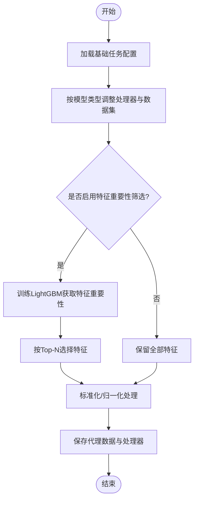
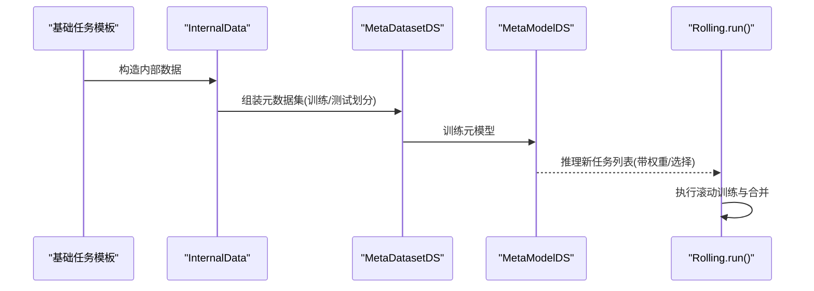
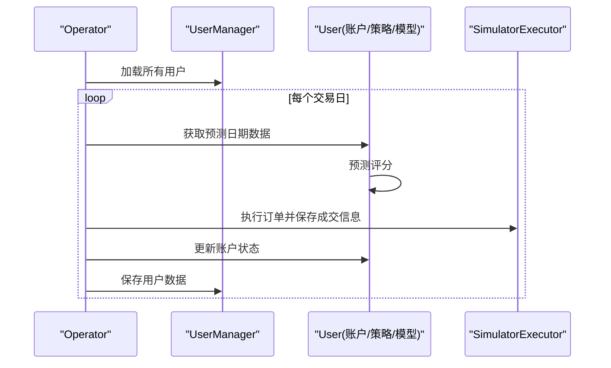
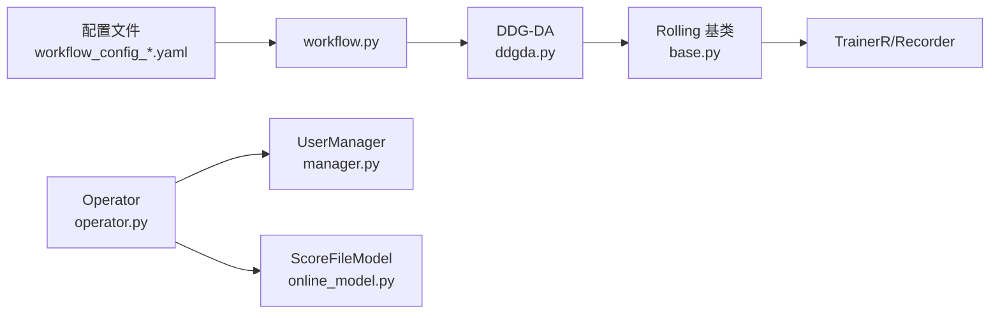

# 动态基准测试

<cite>
**本文引用的文件**
- [examples/benchmarks_dynamic/DDG-DA/README.md](file://examples/benchmarks_dynamic/DDG-DA/README.md)
- [examples/benchmarks_dynamic/DDG-DA/workflow.py](file://examples/benchmarks_dynamic/DDG-DA/workflow.py)
- [examples/benchmarks_dynamic/DDG-DA/requirements.txt](file://examples/benchmarks_dynamic/DDG-DA/requirements.txt)
- [qlib/contrib/rolling/ddgda.py](file://qlib/contrib/rolling/ddgda.py)
- [qlib/contrib/rolling/base.py](file://qlib/contrib/rolling/base.py)
- [examples/benchmarks_dynamic/baseline/README.md](file://examples/benchmarks_dynamic/baseline/README.md)
- [examples/benchmarks_dynamic/baseline/rolling_benchmark.py](file://examples/benchmarks_dynamic/baseline/rolling_benchmark.py)
- [examples/benchmarks_dynamic/baseline/workflow_config_lightgbm_Alpha158.yaml](file://examples/benchmarks_dynamic/baseline/workflow_config_lightgbm_Alpha158.yaml)
- [examples/benchmarks_dynamic/baseline/workflow_config_linear_Alpha158.yaml](file://examples/benchmarks_dynamic/baseline/workflow_config_linear_Alpha158.yaml)
- [examples/benchmarks_dynamic/README.md](file://examples/benchmarks_dynamic/README.md)
- [qlib/contrib/online/manager.py](file://qlib/contrib/online/manager.py)
- [qlib/contrib/online/operator.py](file://qlib/contrib/online/operator.py)
- [qlib/contrib/online/online_model.py](file://qlib/contrib/online/online_model.py)
</cite>

## 目录
1. [引言](#引言)
2. [项目结构](#项目结构)
3. [核心组件](#核心组件)
4. [架构总览](#架构总览)
5. [详细组件分析](#详细组件分析)
6. [依赖关系分析](#依赖关系分析)
7. [性能考量](#性能考量)
8. [故障排查指南](#故障排查指南)
9. [结论](#结论)
10. [附录](#附录)

## 引言
本文件面向量化研究与工程实践，系统化阐述Qlib中基于Meta Controller的DDG-DA（Dynamic Data-driven Approach）动态基准测试体系。DDG-DA通过“预测未来数据分布—生成训练样本—训练模型”的闭环，实现对概念漂移的可预测性建模与适应，从而提升模型在测试阶段的稳定性与收益。本文将从系统架构、滚动窗口分析、动态特征选择、模型更新策略、在线学习机制到完整动态基准测试流程进行深入解析，并给出可复现实验的步骤与评估方法。

## 项目结构
动态基准测试相关代码主要分布在以下位置：
- 示例与工作流：examples/benchmarks_dynamic/DDG-DA、examples/benchmarks_dynamic/baseline
- 核心滚动与Meta控制器：qlib/contrib/rolling/ddgda.py、qlib/contrib/rolling/base.py
- 在线仿真与用户管理：qlib/contrib/online/operator.py、qlib/contrib/online/manager.py、qlib/contrib/online/online_model.py
- 基准配置：workflow_config_lightgbm_Alpha158.yaml、workflow_config_linear_Alpha158.yaml

图表来源
- [examples/benchmarks_dynamic/DDG-DA/workflow.py:17-36](file://examples/benchmarks_dynamic/DDG-DA/workflow.py#L17-L36)
- [qlib/contrib/rolling/ddgda.py:70-127](file://qlib/contrib/rolling/ddgda.py#L70-L127)
- [qlib/contrib/rolling/base.py:24-113](file://qlib/contrib/rolling/base.py#L24-L113)
- [examples/benchmarks_dynamic/baseline/rolling_benchmark.py:16-32](file://examples/benchmarks_dynamic/baseline/rolling_benchmark.py#L16-L32)
- [qlib/contrib/online/operator.py:27-36](file://qlib/contrib/online/operator.py#L27-L36)
- [qlib/contrib/online/manager.py:17-45](file://qlib/contrib/online/manager.py#L17-L45)
- [qlib/contrib/online/online_model.py:13-21](file://qlib/contrib/online/online_model.py#L13-L21)

章节来源
- [examples/benchmarks_dynamic/DDG-DA/README.md:1-36](file://examples/benchmarks_dynamic/DDG-DA/README.md#L1-L36)
- [examples/benchmarks_dynamic/baseline/README.md:1-17](file://examples/benchmarks_dynamic/baseline/README.md#L1-L17)
- [examples/benchmarks_dynamic/README.md:1-27](file://examples/benchmarks_dynamic/README.md#L1-L27)

## 核心组件
- DDG-DA动态基准测试器：基于Rolling框架扩展，引入代理预测模型、内部数据集与元模型推理，完成滚动窗口内的任务重加权与动态选择。
- Rolling基类：负责将单任务拆分为时间序列滚动任务、缓存处理器、训练与合并回测结果。
- 在线执行器Operator：封装生成信号、执行订单、更新账户等在线仿真流程；配合UserManager与ScoreFileModel实现用户级的动态模型切换与在线学习。
- 基准配置：提供Linear与LightGBM两类模型的完整工作流配置，便于对比不同模型在相同滚动窗口下的表现。

章节来源
- [qlib/contrib/rolling/ddgda.py:70-127](file://qlib/contrib/rolling/ddgda.py#L70-L127)
- [qlib/contrib/rolling/base.py:24-113](file://qlib/contrib/rolling/base.py#L24-L113)
- [qlib/contrib/online/operator.py:27-36](file://qlib/contrib/online/operator.py#L27-L36)
- [qlib/contrib/online/manager.py:17-45](file://qlib/contrib/online/manager.py#L17-L45)
- [qlib/contrib/online/online_model.py:13-21](file://qlib/contrib/online/online_model.py#L13-L21)

## 架构总览
DDG-DA将“元学习”思想引入滚动基准测试：先用代理模型学习历史数据分布相似度，再以元模型对最终任务进行重加权或选择，最后在滚动窗口内持续训练与评估。在线仿真则通过Operator串联“预测—下单—成交—账户更新”，支持按日自动执行与报告输出。

图表来源
- [examples/benchmarks_dynamic/DDG-DA/workflow.py:26-36](file://examples/benchmarks_dynamic/DDG-DA/workflow.py#L26-L36)
- [qlib/contrib/rolling/ddgda.py:373-389](file://qlib/contrib/rolling/ddgda.py#L373-L389)
- [qlib/contrib/rolling/base.py:253-260](file://qlib/contrib/rolling/base.py#L253-L260)
- [qlib/contrib/online/operator.py:102-137](file://qlib/contrib/online/operator.py#L102-L137)

## 详细组件分析

### DDG-DA 组件分析
DDG-DA在Rolling基础上扩展了三步走：
1) 为代理预测模型准备数据与处理器；
2) 生成内部数据（InternalData），用于元模型训练；
3) 训练MetaModel并推理最终任务列表，随后交由Rolling.run执行。

图表来源
- [qlib/contrib/rolling/base.py:24-113](file://qlib/contrib/rolling/base.py#L24-L113)
- [qlib/contrib/rolling/ddgda.py:70-127](file://qlib/contrib/rolling/ddgda.py#L70-L127)

章节来源
- [qlib/contrib/rolling/ddgda.py:159-229](file://qlib/contrib/rolling/ddgda.py#L159-L229)
- [qlib/contrib/rolling/ddgda.py:234-320](file://qlib/contrib/rolling/ddgda.py#L234-L320)
- [qlib/contrib/rolling/ddgda.py:325-372](file://qlib/contrib/rolling/ddgda.py#L325-L372)
- [qlib/contrib/rolling/ddgda.py:373-389](file://qlib/contrib/rolling/ddgda.py#L373-L389)

### 滚动窗口分析与动态特征选择
- 滚动窗口：Rolling通过task_generator与RollingGen按固定步长切分时间序列任务，避免信息泄露。
- 特征重要性：使用LightGBM计算特征重要性，按Top-N筛选动态特征子集，提升代理模型与元模型的稳定性与泛化能力。
- 数据预处理：针对线性模型引入稳健归一化、填充缺失值、跨市场排名归一化等处理器，减少噪声影响。

图表来源
- [qlib/contrib/rolling/ddgda.py:128-157](file://qlib/contrib/rolling/ddgda.py#L128-L157)
- [qlib/contrib/rolling/ddgda.py:159-178](file://qlib/contrib/rolling/ddgda.py#L159-L178)
- [qlib/contrib/rolling/ddgda.py:201-220](file://qlib/contrib/rolling/ddgda.py#L201-L220)

章节来源
- [qlib/contrib/rolling/base.py:194-204](file://qlib/contrib/rolling/base.py#L194-L204)
- [qlib/contrib/rolling/ddgda.py:159-178](file://qlib/contrib/rolling/ddgda.py#L159-L178)
- [qlib/contrib/rolling/ddgda.py:201-220](file://qlib/contrib/rolling/ddgda.py#L201-L220)

### 元模型推理与任务重加权
- 内部数据（InternalData）：封装模拟任务的输入，供元模型学习任务间的相似性与可转移知识。
- 元数据集（MetaDatasetDS）：将代理任务与最终任务对齐，构造元学习输入。
- 元模型（MetaModelDS）：在元数据上训练，推理得到最终任务的权重或选择策略，实现动态模型选择与自适应学习。

图表来源
- [qlib/contrib/rolling/ddgda.py:240-253](file://qlib/contrib/rolling/ddgda.py#L240-L253)
- [qlib/contrib/rolling/ddgda.py:304-320](file://qlib/contrib/rolling/ddgda.py#L304-L320)
- [qlib/contrib/rolling/ddgda.py:333-372](file://qlib/contrib/rolling/ddgda.py#L333-L372)
- [qlib/contrib/rolling/base.py:253-260](file://qlib/contrib/rolling/base.py#L253-L260)

章节来源
- [qlib/contrib/rolling/ddgda.py:240-253](file://qlib/contrib/rolling/ddgda.py#L240-L253)
- [qlib/contrib/rolling/ddgda.py:304-320](file://qlib/contrib/rolling/ddgda.py#L304-L320)
- [qlib/contrib/rolling/ddgda.py:333-372](file://qlib/contrib/rolling/ddgda.py#L333-L372)

### 在线仿真与自动模型切换
- Operator封装每日流程：预测评分、策略更新、生成订单、执行成交、更新账户状态，并输出超额收益分析。
- UserManager统一管理用户账户、策略与模型的持久化与加载。
- ScoreFileModel允许直接加载历史评分文件作为“模型”，便于快速替换与A/B对比。

图表来源
- [qlib/contrib/online/operator.py:102-137](file://qlib/contrib/online/operator.py#L102-L137)
- [qlib/contrib/online/operator.py:138-212](file://qlib/contrib/online/operator.py#L138-L212)
- [qlib/contrib/online/manager.py:46-94](file://qlib/contrib/online/manager.py#L46-L94)
- [qlib/contrib/online/online_model.py:18-27](file://qlib/contrib/online/online_model.py#L18-L27)

章节来源
- [qlib/contrib/online/operator.py:102-137](file://qlib/contrib/online/operator.py#L102-L137)
- [qlib/contrib/online/operator.py:138-212](file://qlib/contrib/online/operator.py#L138-L212)
- [qlib/contrib/online/manager.py:46-94](file://qlib/contrib/online/manager.py#L46-L94)
- [qlib/contrib/online/online_model.py:18-27](file://qlib/contrib/online/online_model.py#L18-L27)

### 多任务学习与自适应学习
- 多任务学习体现在元模型对多个代理任务的学习，以及最终任务在滚动窗口内的多期训练。
- 自适应学习通过元模型对任务相似性的建模，动态调整任务权重或选择，使模型在非平稳环境下保持稳健。

章节来源
- [qlib/contrib/rolling/ddgda.py:254-320](file://qlib/contrib/rolling/ddgda.py#L254-L320)
- [qlib/contrib/rolling/ddgda.py:325-372](file://qlib/contrib/rolling/ddgda.py#L325-L372)

## 依赖关系分析
- DDG-DA依赖Rolling基类完成任务生成与训练；同时依赖Meta Controller组件（MetaDatasetDS/MetaModelDS）进行元学习。
- 在线仿真依赖Operator、UserManager与具体模型接口，形成“预测—交易—回测—更新”的闭环。
- 基准配置文件定义了模型、数据集、记录器与回测参数，确保实验可复现。

图表来源
- [examples/benchmarks_dynamic/DDG-DA/workflow.py:26-36](file://examples/benchmarks_dynamic/DDG-DA/workflow.py#L26-L36)
- [qlib/contrib/rolling/ddgda.py:70-127](file://qlib/contrib/rolling/ddgda.py#L70-L127)
- [qlib/contrib/rolling/base.py:253-260](file://qlib/contrib/rolling/base.py#L253-L260)
- [qlib/contrib/online/operator.py:27-36](file://qlib/contrib/online/operator.py#L27-L36)
- [qlib/contrib/online/manager.py:17-45](file://qlib/contrib/online/manager.py#L17-L45)
- [qlib/contrib/online/online_model.py:13-21](file://qlib/contrib/online/online_model.py#L13-L21)

章节来源
- [examples/benchmarks_dynamic/baseline/workflow_config_lightgbm_Alpha158.yaml:32-72](file://examples/benchmarks_dynamic/baseline/workflow_config_lightgbm_Alpha158.yaml#L32-L72)
- [examples/benchmarks_dynamic/baseline/workflow_config_linear_Alpha158.yaml:45-78](file://examples/benchmarks_dynamic/baseline/workflow_config_linear_Alpha158.yaml#L45-L78)

## 性能考量
- 计算开销：DDG-DA在每个滚动步需要训练代理模型与元模型，建议合理设置步长与特征筛选规模，避免过拟合与内存压力。
- 数据质量：特征标准化与缺失值处理对线性模型尤为关键；跨市场排名归一化有助于稳定标签分布。
- 稳健性：通过元模型对任务相似性建模，降低单一窗口波动的影响；结合滚动窗口的IC/ICIR等指标进行多期评估。
- 在线仿真：Operator的每日流程应尽量自动化，减少人工干预；注意交易成本与滑点对收益的影响。

## 故障排查指南
- 实验重复命名冲突：Rolling运行前需清理mlruns目录，避免实验名重复导致无法创建同名实验。
- 数据处理器缓存：若使用处理器缓存，可能无法动态修改标签与滚动步长，需关闭缓存或提供外部处理器路径。
- 在线仿真日期校验：添加用户与执行订单时需校验交易日合法性，避免跨日错误。
- 模型兼容性：DDG-DA默认使用Linear作为代理模型，如需更换需确保配置文件与模型接口一致。

章节来源
- [qlib/contrib/rolling/base.py:46-50](file://qlib/contrib/rolling/base.py#L46-L50)
- [qlib/contrib/rolling/base.py:163-173](file://qlib/contrib/rolling/base.py#L163-L173)
- [qlib/contrib/online/operator.py:84-87](file://qlib/contrib/online/operator.py#L84-L87)
- [qlib/contrib/online/operator.py:154-159](file://qlib/contrib/online/operator.py#L154-L159)

## 结论
DDG-DA通过“预测未来分布—生成样本—元模型推理—滚动训练”的闭环，在量化研究中实现了对概念漂移的可预测性建模与自适应学习。结合Rolling的滚动窗口分析与动态特征选择，以及Online Operator的自动执行与账户更新，形成了完整的动态基准测试体系。该方法在公开数据集上验证了优于传统滚动重训（RR）的收益与稳定性，适合在真实市场环境中持续部署与迭代。

## 附录

### 完整动态基准测试流程
- 准备数据：根据环境变量初始化Provider或下载数据。
- 选择模型：通过配置文件指定Linear或LightGBM等模型。
- 运行DDG-DA：调用workflow.py执行元模型训练与滚动推理。
- 对比RR：同样配置下运行滚动基准，比较IC/ICIR/年化收益等指标。
- 在线仿真：使用Operator进行每日预测—下单—成交—更新的自动化流程。

章节来源
- [examples/benchmarks_dynamic/DDG-DA/README.md:16-25](file://examples/benchmarks_dynamic/DDG-DA/README.md#L16-L25)
- [examples/benchmarks_dynamic/baseline/README.md:5-16](file://examples/benchmarks_dynamic/baseline/README.md#L5-L16)
- [examples/benchmarks_dynamic/README.md:16-27](file://examples/benchmarks_dynamic/README.md#L16-L27)

### 关键配置参考
- Linear模型配置：包含稳健归一化、标签归一化与回测参数。
- LightGBM模型配置：包含树模型超参与回测参数。
- 两者均采用Alpha158数据集与csi300市场，测试区间为2017-2020。

章节来源
- [examples/benchmarks_dynamic/baseline/workflow_config_linear_Alpha158.yaml:1-78](file://examples/benchmarks_dynamic/baseline/workflow_config_linear_Alpha158.yaml#L1-L78)
- [examples/benchmarks_dynamic/baseline/workflow_config_lightgbm_Alpha158.yaml:1-72](file://examples/benchmarks_dynamic/baseline/workflow_config_lightgbm_Alpha158.yaml#L1-L72)