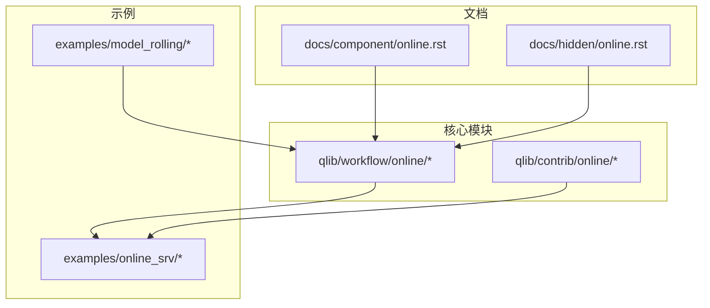
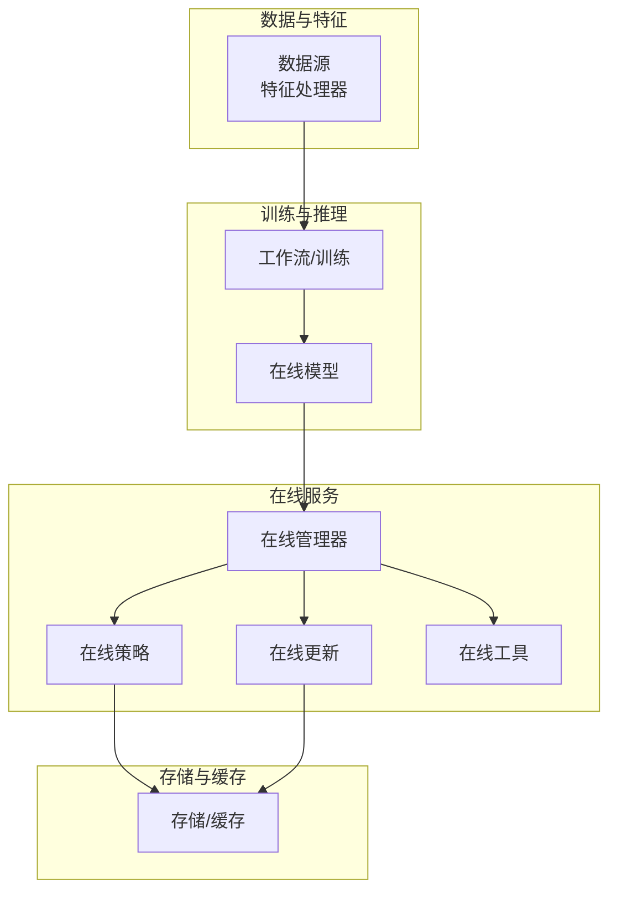
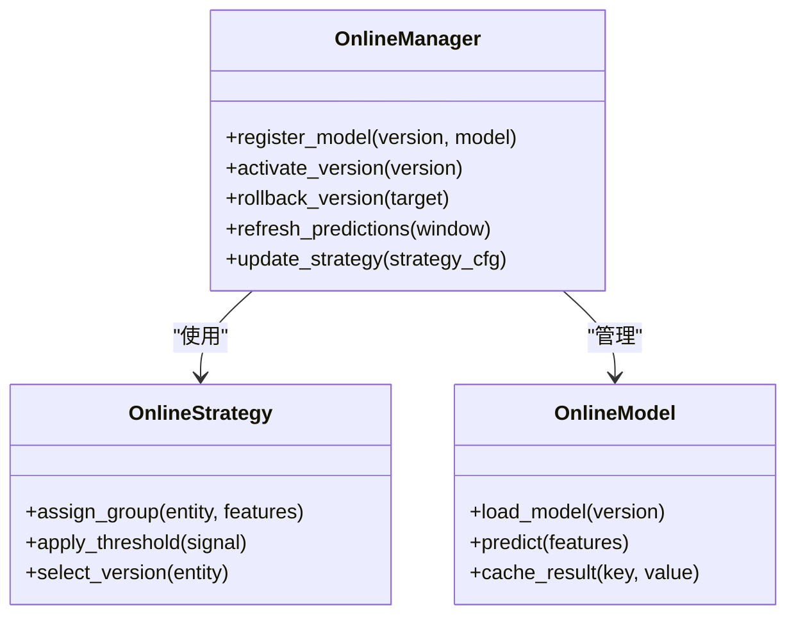
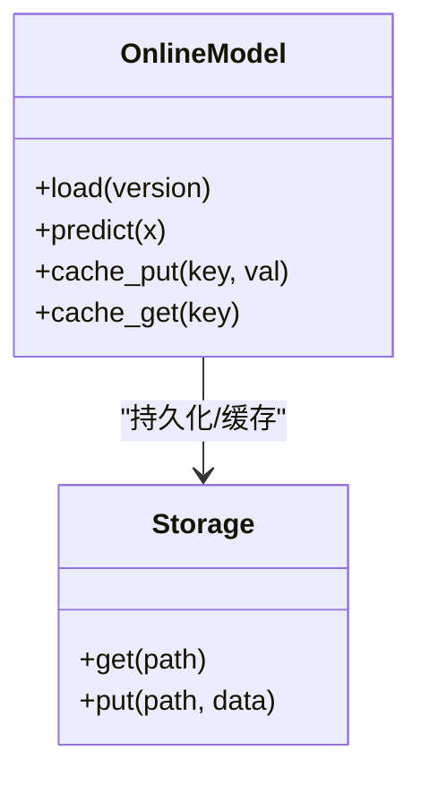
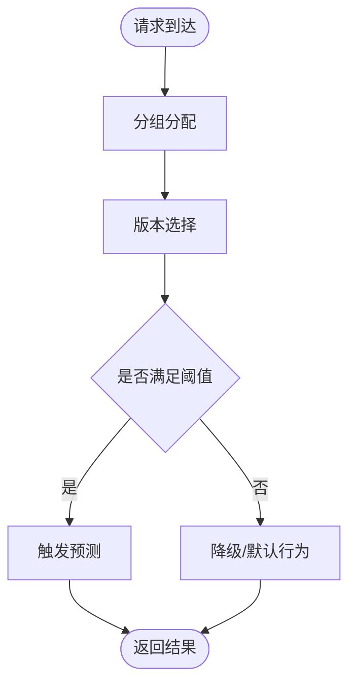
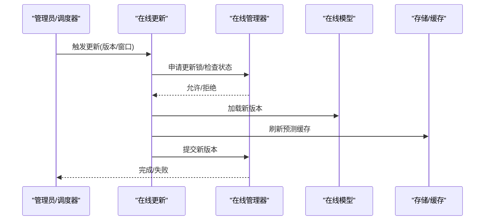
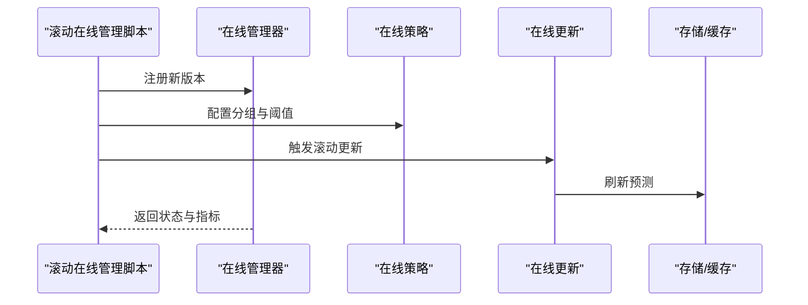
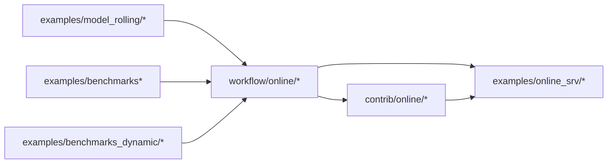

# 在线服务系统

<cite>
**本文引用的文件**
- [online.rst](file://docs/component/online.rst)
- [online.rst](file://docs/hidden/online.rst)
- [manager.py](file://qlib/workflow/online/manager.py)
- [strategy.py](file://qlib/workflow/online/strategy.py)
- [update.py](file://qlib/workflow/online/update.py)
- [utils.py](file://qlib/workflow/online/utils.py)
- [manager.py](file://qlib/contrib/online/manager.py)
- [online_model.py](file://qlib/contrib/online/online_model.py)
- [operator.py](file://qlib/contrib/online/operator.py)
- [user.py](file://qlib/contrib/online/user.py)
- [utils.py](file://qlib/contrib/online/utils.py)
- [rolling_online_management.py](file://examples/online_srv/rolling_online_management.py)
- [update_online_pred.py](file://examples/online_srv/update_online_pred.py)
- [online_management_simulate.py](file://examples/online_srv/online_management_simulate.py)
- [task_manager_rolling.py](file://examples/model_rolling/task_manager_rolling.py)
- [README.md](file://examples/benchmarks_dynamic/DDG-DA/README.md)
- [workflow.py](file://examples/benchmarks_dynamic/DDG-DA/workflow.py)
- [README.md](file://examples/benchmarks/README.md)
- [workflow_config_lightgbm_Alpha158.yaml](file://examples/benchmarks/LightGBM/workflow_config_lightgbm_Alpha158.yaml)
- [workflow_config_lightgbm_Alpha360.yaml](file://examples/benchmarks/LightGBM/workflow_config_lightgbm_Alpha360.yaml)
- [workflow_config_lightgbm_multi_freq.yaml](file://examples/benchmarks/LightGBM/workflow_config_lightgbm_multi_freq.yaml)
- [workflow_config_lightgbm_configurable_dataset.yaml](file://examples/benchmarks/LightGBM/workflow_config_lightgbm_configurable_dataset.yaml)
- [workflow_config_lightgbm_Alpha158_csi500.yaml](file://examples/benchmarks/LightGBM/workflow_config_lightgbm_Alpha158_csi500.yaml)
- [workflow_config_lightgbm_Alpha360_csi500.yaml](file://examples/benchmarks/LightGBM/workflow_config_lightgbm_Alpha360_csi500.yaml)
- [workflow.py](file://examples/rolling_process_data/workflow.py)
- [rolling_handler.py](file://examples/rolling_process_data/rolling_handler.py)
- [README.md](file://examples/rolling_process_data/README.md)
- [README.md](file://examples/benchmarks_dynamic/baseline/README.md)
- [rolling_benchmark.py](file://examples/benchmarks_dynamic/baseline/rolling_benchmark.py)
- [workflow_config_lightgbm_Alpha158.yaml](file://examples/benchmarks_dynamic/baseline/workflow_config_lightgbm_Alpha158.yaml)
- [workflow_config_linear_Alpha158.yaml](file://examples/benchmarks_dynamic/baseline/workflow_config_linear_Alpha158.yaml)
- [README.md](file://examples/tutorial/README.md)
- [README.md](file://README.md)
</cite>

## 目录
1. [引言](#引言)
2. [项目结构](#项目结构)
3. [核心组件](#核心组件)
4. [架构总览](#架构总览)
5. [详细组件分析](#详细组件分析)
6. [依赖关系分析](#依赖关系分析)
7. [性能考虑](#性能考虑)
8. [故障排查指南](#故障排查指南)
9. [结论](#结论)
10. [附录](#附录)

## 引言
本文件面向Qlib在线服务系统，围绕在线模型服务、实时预测接口与模型更新机制展开，系统性阐述在线服务架构设计、负载均衡与故障恢复策略，并提供从模型打包、服务发布到性能监控的完整部署流程。同时，结合滚动在线管理、预测更新与A/B测试方法给出可操作的最佳实践与真实案例。

## 项目结构
Qlib在线服务相关能力分布在文档、核心模块与示例三部分：
- 文档：官方文档中关于在线服务的组件说明与隐藏说明，涵盖概念、接口与实践建议。
- 核心模块：workflow/online 与 contrib/online 提供在线管理、策略、更新与工具等实现。
- 示例：examples/online_srv 展示滚动在线管理、预测更新与仿真；examples/model_rolling 提供滚动任务管理参考。

**章节来源**
- [online.rst](file://docs/component/online.rst)
- [online.rst](file://docs/hidden/online.rst)
- [manager.py](file://qlib/workflow/online/manager.py)
- [manager.py](file://qlib/contrib/online/manager.py)
- [rolling_online_management.py](file://examples/online_srv/rolling_online_management.py)
- [task_manager_rolling.py](file://examples/model_rolling/task_manager_rolling.py)

## 核心组件
- 在线管理器（Workflow Online Manager）：负责在线模型生命周期管理、版本控制、灰度与回滚、以及与策略层的交互。
- 在线模型（Online Model）：封装模型加载、推理与缓存逻辑，支持多版本并行与热切换。
- 在线策略（Online Strategy）：定义在线服务的决策规则，如A/B测试分组、流量分配、阈值控制等。
- 在线更新（Online Update）：提供增量更新、全量替换与预测缓存刷新等机制。
- 在线工具（Online Utils）：提供通用工具函数，如时间窗口处理、版本比较、序列化等。
- 示例与脚本：演示滚动在线管理、预测更新与仿真，辅助理解端到端流程。

**章节来源**
- [manager.py](file://qlib/workflow/online/manager.py)
- [online_model.py](file://qlib/contrib/online/online_model.py)
- [strategy.py](file://qlib/workflow/online/strategy.py)
- [update.py](file://qlib/workflow/online/update.py)
- [utils.py](file://qlib/workflow/online/utils.py)
- [rolling_online_management.py](file://examples/online_srv/rolling_online_management.py)
- [update_online_pred.py](file://examples/online_srv/update_online_pred.py)
- [online_management_simulate.py](file://examples/online_srv/online_management_simulate.py)

## 架构总览
下图展示在线服务在Qlib中的整体架构：数据与特征通过处理器进入训练/推理流水线，模型由在线管理器统一管理，策略层决定流量分配与版本选择，预测结果写入存储或缓存，供实时查询与监控。

**图表来源**
- [manager.py](file://qlib/workflow/online/manager.py)
- [strategy.py](file://qlib/workflow/online/strategy.py)
- [update.py](file://qlib/workflow/online/update.py)
- [utils.py](file://qlib/workflow/online/utils.py)
- [online_model.py](file://qlib/contrib/online/online_model.py)

## 详细组件分析

### 在线管理器（Workflow Online Manager）
职责与能力：
- 模型版本管理：注册、激活、冻结、回滚版本，支持多版本并行。
- 流量与策略：对接策略模块进行A/B测试、阈值控制与灰度发布。
- 预测缓存：维护预测结果缓存，支持批量刷新与失效。
- 更新协调：协调更新流程，确保平滑切换与一致性。

**图表来源**
- [manager.py](file://qlib/workflow/online/manager.py)
- [strategy.py](file://qlib/workflow/online/strategy.py)
- [online_model.py](file://qlib/contrib/online/online_model.py)

**章节来源**
- [manager.py](file://qlib/workflow/online/manager.py)
- [strategy.py](file://qlib/workflow/online/strategy.py)

### 在线模型（Online Model）
职责与能力：
- 模型加载：按版本加载模型，支持本地/远程存储。
- 推理执行：对输入特征进行预测，返回信号或分数。
- 缓存策略：基于键值缓存预测结果，降低重复计算成本。
- 多版本隔离：不同版本模型互不干扰，便于灰度与对比实验。

**图表来源**
- [online_model.py](file://qlib/contrib/online/online_model.py)

**章节来源**
- [online_model.py](file://qlib/contrib/online/online_model.py)

### 在线策略（Online Strategy）
职责与能力：
- 分组与分流：根据实体标识、时间窗口或业务规则进行分组。
- 版本选择：在多个可用版本间选择目标版本。
- 阈值与开关：设置信号阈值、开关与熔断条件。
- A/B测试：支持对照组与实验组的流量分配与指标对比。

**图表来源**
- [strategy.py](file://qlib/workflow/online/strategy.py)

**章节来源**
- [strategy.py](file://qlib/workflow/online/strategy.py)

### 在线更新（Online Update）
职责与能力：
- 增量更新：仅更新受影响的实体或时间窗口，减少全量重算。
- 全量替换：在验证通过后进行版本替换与缓存刷新。
- 预测刷新：对新旧版本的预测结果进行比对与一致性校验。
- 回滚机制：失败时快速回滚至上一个稳定版本。

**图表来源**
- [update.py](file://qlib/workflow/online/update.py)
- [manager.py](file://qlib/workflow/online/manager.py)

**章节来源**
- [update.py](file://qlib/workflow/online/update.py)
- [manager.py](file://qlib/workflow/online/manager.py)

### 在线工具（Online Utils）
职责与能力：
- 时间窗口工具：生成滚动窗口、对齐时间边界。
- 版本比较：比较版本号与兼容性。
- 序列化与反序列化：支撑模型与配置的持久化。
- 日志与监控：输出关键事件与指标，便于审计与告警。

**章节来源**
- [utils.py](file://qlib/workflow/online/utils.py)

### 示例：滚动在线管理
该示例展示了如何在滚动场景下进行在线模型管理，包括版本注册、策略应用与预测更新。

**图表来源**
- [rolling_online_management.py](file://examples/online_srv/rolling_online_management.py)
- [manager.py](file://qlib/workflow/online/manager.py)
- [strategy.py](file://qlib/workflow/online/strategy.py)
- [update.py](file://qlib/workflow/online/update.py)

**章节来源**
- [rolling_online_management.py](file://examples/online_srv/rolling_online_management.py)

### 示例：预测更新与仿真
该示例演示了预测更新流程与仿真，帮助验证更新策略与回滚方案。

**章节来源**
- [update_online_pred.py](file://examples/online_srv/update_online_pred.py)
- [online_management_simulate.py](file://examples/online_srv/online_management_simulate.py)

## 依赖关系分析
- Workflow Online 与 Contrib Online：两者均提供在线能力，但侧重点不同。Workflow Online 更偏向工作流集成与策略/更新编排；Contrib Online 更偏向模型封装与用户/操作接口。
- 示例与核心模块：examples/online_srv 与 examples/model_rolling 为核心模块的实际应用与扩展参考。
- 配置与基准：examples/benchmarks 与 examples/benchmarks_dynamic 提供模型配置与滚动基准，便于在线服务的对比与回归。

**图表来源**
- [manager.py](file://qlib/workflow/online/manager.py)
- [manager.py](file://qlib/contrib/online/manager.py)
- [rolling_online_management.py](file://examples/online_srv/rolling_online_management.py)
- [task_manager_rolling.py](file://examples/model_rolling/task_manager_rolling.py)

**章节来源**
- [manager.py](file://qlib/workflow/online/manager.py)
- [manager.py](file://qlib/contrib/online/manager.py)
- [rolling_online_management.py](file://examples/online_srv/rolling_online_management.py)
- [task_manager_rolling.py](file://examples/model_rolling/task_manager_rolling.py)

## 性能考虑
- 模型加载与缓存：优先复用已加载模型实例，避免重复I/O；合理设置缓存键与过期策略。
- 批量更新：在滚动场景下采用增量更新与窗口对齐，减少全量重算。
- 并行与并发：在线预测应支持并发请求，注意锁竞争与资源池管理。
- 存储与网络：模型与预测结果尽量本地化缓存，远端访问需考虑延迟与重试。
- 监控与告警：记录关键指标（延迟、错误率、命中率），建立自动告警与自愈机制。

## 故障排查指南
- 版本冲突与回滚：若新版本导致异常，立即回滚至上一稳定版本，并冻结问题版本。
- 预测不一致：核对新旧版本的特征预处理与模型权重，必要时进行小规模A/B对比。
- 缓存污染：发现缓存异常时，清理对应键或重建缓存，确认一致性。
- 策略误判：检查分组规则与阈值配置，必要时临时关闭灰度或调整流量比例。
- 日志与追踪：启用详细日志与链路追踪，定位问题根因。

**章节来源**
- [manager.py](file://qlib/workflow/online/manager.py)
- [update.py](file://qlib/workflow/online/update.py)

## 结论
Qlib在线服务系统通过清晰的模块划分与策略化管理，实现了从模型版本控制、实时预测到更新与回滚的全链路闭环。配合滚动管理与A/B测试，可在生产环境中安全、高效地交付与演进模型能力。建议在生产部署中强化监控、自动化与演练，持续提升稳定性与可维护性。

## 附录

### 在线服务部署流程（概要）
- 模型打包：将训练产出的模型与特征预处理逻辑打包为可加载格式。
- 服务发布：通过在线管理器注册新版本，配置策略与阈值，启动灰度发布。
- 预测更新：在滚动窗口内进行增量更新，刷新预测缓存并观测指标。
- 性能监控：采集延迟、错误率与命中率，建立告警与自愈机制。
- 回滚预案：准备回滚脚本与演练计划，确保快速恢复。

### 滚动在线管理与A/B测试方法
- 滚动在线管理：以时间窗口为单位进行增量更新，降低风险并提升吞吐。
- A/B测试：按实体或时间维度随机分组，对比不同版本的收益指标，逐步扩大流量。

### 实际案例与参考
- 滚动在线管理示例：演示版本注册、策略配置与预测更新的完整流程。
- 滚动任务管理：提供滚动场景下的任务编排与执行参考。
- 基准与配置：提供多种模型配置与滚动基准，便于对比与回归测试。

**章节来源**
- [rolling_online_management.py](file://examples/online_srv/rolling_online_management.py)
- [update_online_pred.py](file://examples/online_srv/update_online_pred.py)
- [online_management_simulate.py](file://examples/online_srv/online_management_simulate.py)
- [task_manager_rolling.py](file://examples/model_rolling/task_manager_rolling.py)
- [README.md](file://examples/benchmarks_dynamic/DDG-DA/README.md)
- [workflow.py](file://examples/benchmarks_dynamic/DDG-DA/workflow.py)
- [README.md](file://examples/benchmarks/README.md)
- [workflow_config_lightgbm_Alpha158.yaml](file://examples/benchmarks/LightGBM/workflow_config_lightgbm_Alpha158.yaml)
- [workflow_config_lightgbm_Alpha360.yaml](file://examples/benchmarks/LightGBM/workflow_config_lightgbm_Alpha360.yaml)
- [workflow_config_lightgbm_multi_freq.yaml](file://examples/benchmarks/LightGBM/workflow_config_lightgbm_multi_freq.yaml)
- [workflow_config_lightgbm_configurable_dataset.yaml](file://examples/benchmarks/LightGBM/workflow_config_lightgbm_configurable_dataset.yaml)
- [workflow_config_lightgbm_Alpha158_csi500.yaml](file://examples/benchmarks/LightGBM/workflow_config_lightgbm_Alpha158_csi500.yaml)
- [workflow_config_lightgbm_Alpha360_csi500.yaml](file://examples/benchmarks/LightGBM/workflow_config_lightgbm_Alpha360_csi500.yaml)
- [workflow.py](file://examples/rolling_process_data/workflow.py)
- [rolling_handler.py](file://examples/rolling_process_data/rolling_handler.py)
- [README.md](file://examples/rolling_process_data/README.md)
- [README.md](file://examples/benchmarks_dynamic/baseline/README.md)
- [rolling_benchmark.py](file://examples/benchmarks_dynamic/baseline/rolling_benchmark.py)
- [workflow_config_lightgbm_Alpha158.yaml](file://examples/benchmarks_dynamic/baseline/workflow_config_lightgbm_Alpha158.yaml)
- [workflow_config_linear_Alpha158.yaml](file://examples/benchmarks_dynamic/baseline/workflow_config_linear_Alpha158.yaml)
- [README.md](file://examples/tutorial/README.md)
- [README.md](file://README.md)