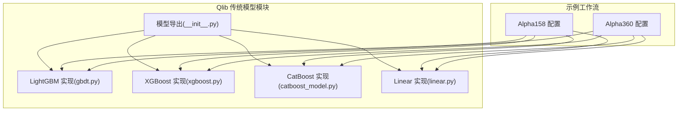
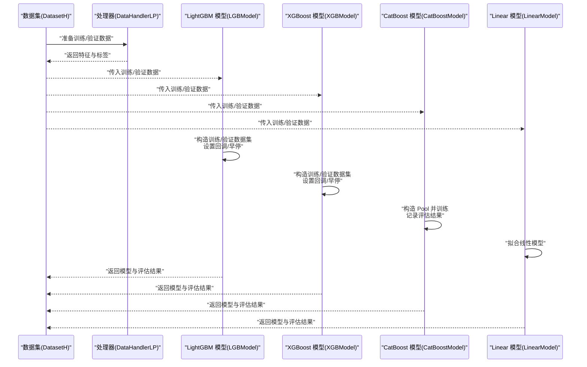
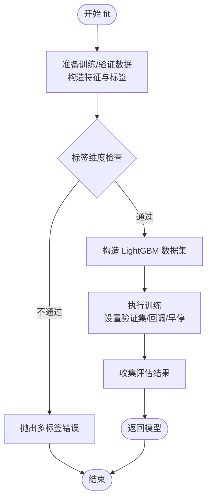
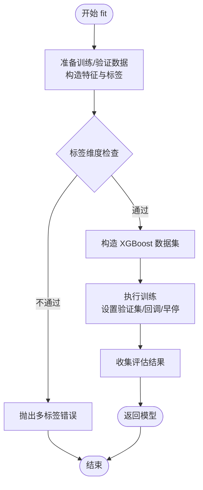
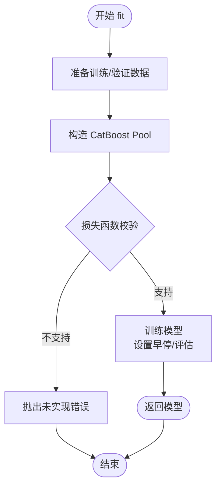
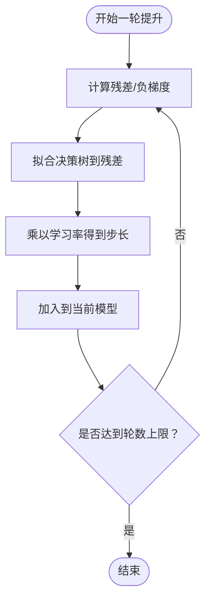
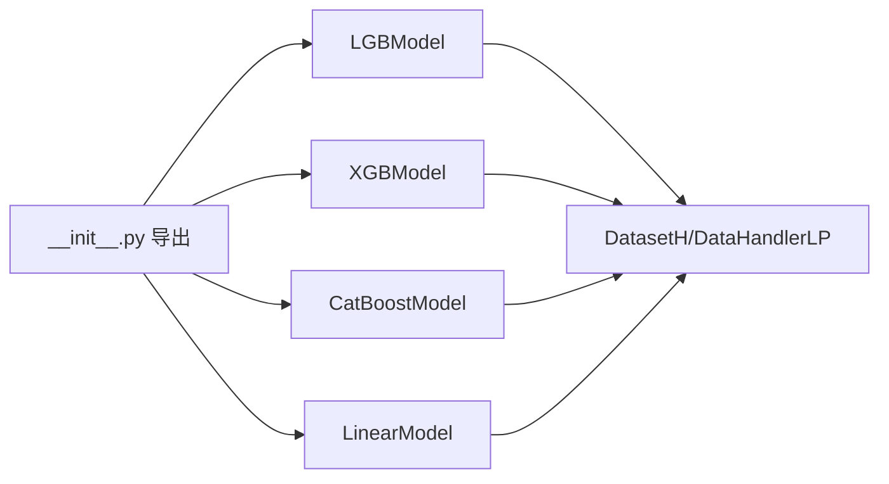

# 传统机器学习模型

<cite>
**本文引用的文件**
- [__init__.py](file://qlib/contrib/model/__init__.py)
- [catboost_model.py](file://qlib/contrib/model/catboost_model.py)
- [xgboost.py](file://qlib/contrib/model/xgboost.py)
- [gbdt.py](file://qlib/contrib/model/gbdt.py)
- [linear.py](file://qlib/contrib/model/linear.py)
- [workflow_config_lightgbm_Alpha158.yaml](file://examples/benchmarks/LightGBM/workflow_config_lightgbm_Alpha158.yaml)
- [workflow_config_lightgbm_Alpha360.yaml](file://examples/benchmarks/LightGBM/workflow_config_lightgbm_Alpha360.yaml)
- [workflow_config_xgboost_Alpha158.yaml](file://examples/benchmarks/XGBoost/workflow_config_xgboost_Alpha158.yaml)
- [workflow_config_catboost_Alpha158.yaml](file://examples/benchmarks/CatBoost/workflow_config_catboost_Alpha158.yaml)
- [workflow_config_catboost_Alpha360.yaml](file://examples/benchmarks/CatBoost/workflow_config_catboost_Alpha360.yaml)
- [workflow_config_linear_Alpha158.yaml](file://examples/benchmarks/Linear/workflow_config_linear_Alpha158.yaml)
</cite>

## 目录
1. [引言](#引言)
2. [项目结构](#项目结构)
3. [核心组件](#核心组件)
4. [架构总览](#架构总览)
5. [详细组件分析](#详细组件分析)
6. [依赖关系分析](#依赖关系分析)
7. [性能考量](#性能考量)
8. [故障排查指南](#故障排查指南)
9. [结论](#结论)
10. [附录](#附录)

## 引言
本文件系统梳理 Qlib 中传统机器学习模型的实现与应用，重点覆盖 LightGBM、XGBoost、CatBoost、Linear 等经典算法。内容涵盖：
- 梯度提升树（GBDT）工作原理：决策树构建、特征选择、正则化与集成策略
- 各算法在 Qlib 的封装方式、训练流程与参数配置
- 针对 Alpha158 与 Alpha360 的完整配置示例
- 模型评估指标、交叉验证策略与超参数调优方法
- 高维稀疏特征场景下的优势与局限性

## 项目结构
Qlib 将传统机器学习模型以“contrib/model”为入口统一管理，并通过“examples/benchmarks”提供针对不同因子集（Alpha158/Alpha360）的完整工作流配置。

图表来源
- [__init__.py:1-43](file://qlib/contrib/model/__init__.py#L1-L43)
- [gbdt.py](file://qlib/contrib/model/gbdt.py)
- [xgboost.py:1-45](file://qlib/contrib/model/xgboost.py#L1-L45)
- [catboost_model.py:1-46](file://qlib/contrib/model/catboost_model.py#L1-L46)
- [linear.py](file://qlib/contrib/model/linear.py)

章节来源
- [__init__.py:1-43](file://qlib/contrib/model/__init__.py#L1-L43)

## 核心组件
- LightGBM 模型封装：基于 LightGBM 训练接口，支持训练集/验证集构造、早停回调、评估结果收集。
- XGBoost 模型封装：基于 XGBoost 训练接口，支持训练集/验证集构造、早停与评估。
- CatBoost 模型封装：基于 CatBoost 训练接口，支持 RMSE/Logloss 等损失函数与 GPU 设备检测。
- Linear 模型封装：基于线性回归/分类框架，支持样本权重与特征重加权。

章节来源
- [gbdt.py](file://qlib/contrib/model/gbdt.py)
- [xgboost.py:1-45](file://qlib/contrib/model/xgboost.py#L1-L45)
- [catboost_model.py:1-46](file://qlib/contrib/model/catboost_model.py#L1-L46)
- [linear.py](file://qlib/contrib/model/linear.py)

## 架构总览
下图展示了 Qlib 传统模型在训练阶段的数据准备、模型训练与评估的整体交互：

图表来源
- [gbdt.py](file://qlib/contrib/model/gbdt.py)
- [xgboost.py:1-45](file://qlib/contrib/model/xgboost.py#L1-L45)
- [catboost_model.py:1-46](file://qlib/contrib/model/catboost_model.py#L1-L46)
- [linear.py](file://qlib/contrib/model/linear.py)

## 详细组件分析

### LightGBM 组件分析
- 数据准备：从数据集提取特征与标签，确保标签为一维数组；构造训练/验证数据集对象。
- 训练流程：设置训练轮数、验证集合与名称、回调函数（如早停），返回训练后的模型与评估结果。
- 参数与配置：通过构造函数接收参数字典，训练接口支持早停、验证频率与评估结果收集。

图表来源
- [gbdt.py](file://qlib/contrib/model/gbdt.py)

章节来源
- [gbdt.py](file://qlib/contrib/model/gbdt.py)

### XGBoost 组件分析
- 数据准备：从数据集提取特征与标签，确保标签为一维数组；构造训练/验证数据集对象。
- 训练流程：设置训练轮数、验证集合与名称、回调函数（如早停），返回训练后的模型与评估结果。
- 参数与配置：通过构造函数接收参数字典，训练接口支持早停、验证频率与评估结果收集。

图表来源
- [xgboost.py:1-45](file://qlib/contrib/model/xgboost.py#L1-L45)

章节来源
- [xgboost.py:1-45](file://qlib/contrib/model/xgboost.py#L1-L45)

### CatBoost 组件分析
- 数据准备：从数据集提取特征与标签，构造 CatBoost Pool 对象。
- 训练流程：设置损失函数（如 RMSE/Logloss）、GPU 设备检测、早停与评估结果收集。
- 参数与配置：通过构造函数接收参数字典，训练接口支持早停、验证频率与评估结果收集。

图表来源
- [catboost_model.py:1-46](file://qlib/contrib/model/catboost_model.py#L1-L46)

章节来源
- [catboost_model.py:1-46](file://qlib/contrib/model/catboost_model.py#L1-L46)

### Linear 组件分析
- 数据准备：从数据集提取特征与标签，支持样本权重与重加权器。
- 训练流程：拟合线性模型，支持样本权重与特征重加权。
- 参数与配置：通过构造函数接收参数字典，训练接口支持早停、验证频率与评估结果收集。

章节来源
- [linear.py](file://qlib/contrib/model/linear.py)

### 梯度提升树（GBDT）工作机制
- 决策树构建：逐轮添加决策树，每棵树拟合前一轮的残差或负梯度。
- 特征选择：在每个节点上基于分裂增益（如信息增益、平方损失）选择最优分割特征与阈值。
- 正则化技术：通过学习率、最大深度、叶子节点最小样本数、L1/L2 正则等控制过拟合。
- 集成策略：加法模型累加各棵树的预测，最终输出为加权求和。

图表来源
- [gbdt.py](file://qlib/contrib/model/gbdt.py)
- [xgboost.py:1-45](file://qlib/contrib/model/xgboost.py#L1-L45)
- [catboost_model.py:1-46](file://qlib/contrib/model/catboost_model.py#L1-L46)

## 依赖关系分析
- 模块导出：通过“contrib/model/__init__.py”集中导出各模型类，缺失依赖时会打印提示信息。
- 数据接口：各模型均依赖 DatasetH 与 DataHandlerLP 提供的特征/标签数据。
- 外部库：LightGBM、XGBoost、CatBoost、线性模型分别依赖对应第三方库。

图表来源
- [__init__.py:1-43](file://qlib/contrib/model/__init__.py#L1-L43)

章节来源
- [__init__.py:1-43](file://qlib/contrib/model/__init__.py#L1-L43)

## 性能考量
- 训练效率
  - LightGBM：采用直方图分裂、GOSS/EFB 技术，在大规模数据上具备较高吞吐。
  - XGBoost：精确贪心分裂与正则化控制，适合中小规模数据与高精度需求。
  - CatBoost：有序提升、类别特征处理与随机森林连接，鲁棒性强。
  - Linear：线性复杂度，适合超大规模与在线推理。
- 内存占用
  - LightGBM/XGBoost：树模型内存与树深度、叶子数相关；可通过限制深度与叶子数降低内存。
  - CatBoost：Pool 结构与类别编码增加内存开销；GPU 可加速但需显存。
  - Linear：内存主要来自特征矩阵与系数向量，稀疏特征可显著节省内存。
- 高维稀疏特征
  - LightGBM/XGBoost：天然支持稀疏输入，适合因子维度高且稀疏的 Alpha 场景。
  - CatBoost：支持类别特征与排序数据，类别特征需注意编码与内存。
  - Linear：对高维稀疏特征友好，结合正则化可有效防止过拟合。

## 故障排查指南
- 多标签错误
  - 现象：LightGBM/XGBoost 在标签维度不为一维时抛错。
  - 处理：确保标签为一维数组，必要时压缩维度。
- 缺失依赖
  - 现象：导入模型类时报模块未找到。
  - 处理：安装对应第三方库（LightGBM、XGBoost、CatBoost、scipy/sklearn）。
- 空数据集
  - 现象：数据集为空导致训练失败。
  - 处理：检查数据配置与时间窗口，确保训练/验证集非空。
- GPU 设备不可用
  - 现象：CatBoost 无法使用 GPU。
  - 处理：确认 GPU 驱动与 CUDA 环境，或切换 CPU 训练。

章节来源
- [gbdt.py](file://qlib/contrib/model/gbdt.py)
- [xgboost.py:1-45](file://qlib/contrib/model/xgboost.py#L1-L45)
- [catboost_model.py:1-46](file://qlib/contrib/model/catboost_model.py#L1-L46)
- [__init__.py:1-43](file://qlib/contrib/model/__init__.py#L1-L43)

## 结论
Qlib 对传统机器学习模型提供了统一的封装与易用的训练接口，结合工作流配置即可快速适配 Alpha158/Alpha360 等因子场景。在高维稀疏特征与大规模数据场景下，LightGBM/XGBoost 具备良好性能；CatBoost 在类别特征与鲁棒性方面表现突出；Linear 则适合超大规模与在线推理。建议根据任务规模、特征特性与资源约束选择合适算法，并配合早停、正则化与交叉验证进行稳定训练。

## 附录

### 配置文件示例与使用说明
以下为针对 Alpha158 与 Alpha360 的完整工作流配置示例路径（仅列出路径，不展示具体配置内容）：
- LightGBM
  - [workflow_config_lightgbm_Alpha158.yaml](file://examples/benchmarks/LightGBM/workflow_config_lightgbm_Alpha158.yaml)
  - [workflow_config_lightgbm_Alpha360.yaml](file://examples/benchmarks/LightGBM/workflow_config_lightgbm_Alpha360.yaml)
- XGBoost
  - [workflow_config_xgboost_Alpha158.yaml](file://examples/benchmarks/XGBoost/workflow_config_xgboost_Alpha158.yaml)
- CatBoost
  - [workflow_config_catboost_Alpha158.yaml](file://examples/benchmarks/CatBoost/workflow_config_catboost_Alpha158.yaml)
  - [workflow_config_catboost_Alpha360.yaml](file://examples/benchmarks/CatBoost/workflow_config_catboost_Alpha360.yaml)
- Linear
  - [workflow_config_linear_Alpha158.yaml](file://examples/benchmarks/Linear/workflow_config_linear_Alpha158.yaml)

章节来源
- [workflow_config_lightgbm_Alpha158.yaml](file://examples/benchmarks/LightGBM/workflow_config_lightgbm_Alpha158.yaml)
- [workflow_config_lightgbm_Alpha360.yaml](file://examples/benchmarks/LightGBM/workflow_config_lightgbm_Alpha360.yaml)
- [workflow_config_xgboost_Alpha158.yaml](file://examples/benchmarks/XGBoost/workflow_config_xgboost_Alpha158.yaml)
- [workflow_config_catboost_Alpha158.yaml](file://examples/benchmarks/CatBoost/workflow_config_catboost_Alpha158.yaml)
- [workflow_config_catboost_Alpha360.yaml](file://examples/benchmarks/CatBoost/workflow_config_catboost_Alpha360.yaml)
- [workflow_config_linear_Alpha158.yaml](file://examples/benchmarks/Linear/workflow_config_linear_Alpha158.yaml)