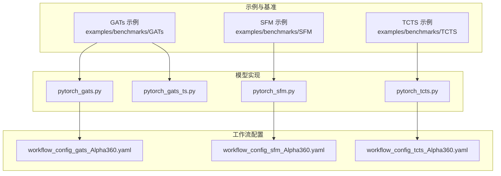
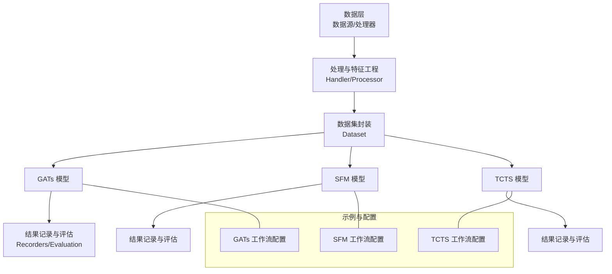
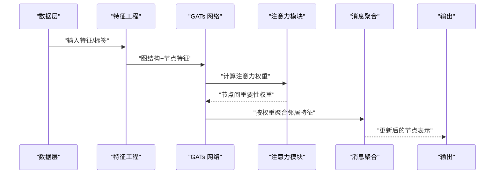
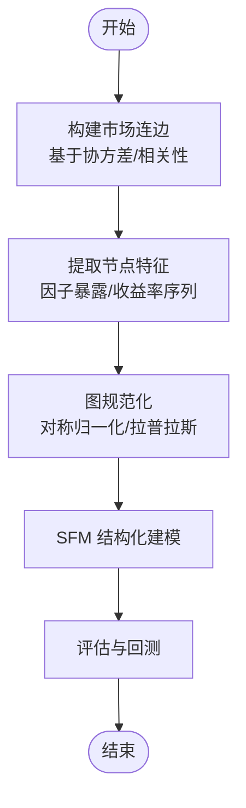
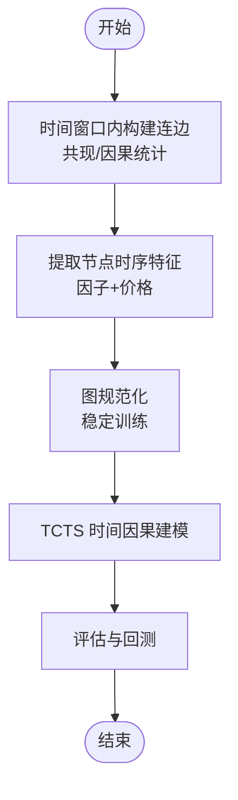
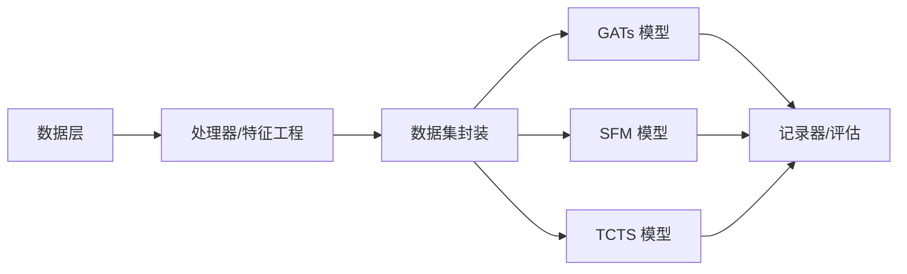

# 图神经网络模型

<cite>
**本文引用的文件**
- [pytorch_gats.py](file://qlib/contrib/model/pytorch_gats.py)
- [pytorch_gats_ts.py](file://qlib/contrib/model/pytorch_gats_ts.py)
- [pytorch_sfm.py](file://qlib/contrib/model/pytorch_sfm.py)
- [pytorch_tcts.py](file://qlib/contrib/model/pytorch_tcts.py)
- [README.md](file://examples/benchmarks/GATs/README.md)
- [workflow_config_gats_Alpha360.yaml](file://examples/benchmarks/GATs/workflow_config_gats_Alpha360.yaml)
- [workflow_config_sfm_Alpha360.yaml](file://examples/benchmarks/SFM/workflow_config_sfm_Alpha360.yaml)
- [workflow_config_tcts_Alpha360.yaml](file://examples/benchmarks/TCTS/workflow_config_tcts_Alpha360.yaml)
</cite>

## 目录
1. [引言](#引言)
2. [项目结构](#项目结构)
3. [核心组件](#核心组件)
4. [架构总览](#架构总览)
5. [详细组件分析](#详细组件分析)
6. [依赖分析](#依赖分析)
7. [性能考虑](#性能考虑)
8. [故障排查指南](#故障排查指南)
9. [结论](#结论)
10. [附录](#附录)

## 引言
本文件围绕QLib中图神经网络模型在量化投资中的应用展开，重点覆盖以下内容：
- 图卷积网络（GCN）与注意力机制在图结构数据中的基本原理：邻接矩阵构建、节点特征传播与消息聚合。
- 注意力机制在图结构数据中的作用：自动学习节点间重要性权重，避免显式矩阵运算或预先依赖图结构。
- 模型在量化场景中的落地：GATs（Graph Attention Networks）、SFM（Structured Factor Model，结构化因子模型）、TCTS（Temporal Causal Temporal Graph，时间因果图）。
- 图数据预处理方法：市场连边构建、节点特征提取、图规范化技术，并展示如何将股票市场关系转化为图结构进行建模。

## 项目结构
QLib在contrib/model目录下提供了图神经网络模型的PyTorch实现，分别对应GATs、SFM与TCTS。同时，examples/benchmarks中提供了这些模型的基准示例与工作流配置，便于快速上手与复现实验。

**图表来源**
- [pytorch_gats.py](file://qlib/contrib/model/pytorch_gats.py)
- [pytorch_gats_ts.py](file://qlib/contrib/model/pytorch_gats_ts.py)
- [pytorch_sfm.py](file://qlib/contrib/model/pytorch_sfm.py)
- [pytorch_tcts.py](file://qlib/contrib/model/pytorch_tcts.py)
- [workflow_config_gats_Alpha360.yaml](file://examples/benchmarks/GATs/workflow_config_gats_Alpha360.yaml)
- [workflow_config_sfm_Alpha360.yaml](file://examples/benchmarks/SFM/workflow_config_sfm_Alpha360.yaml)
- [workflow_config_tcts_Alpha360.yaml](file://examples/benchmarks/TCTS/workflow_config_tcts_Alpha360.yaml)

**章节来源**
- [README.md:1-5](file://examples/benchmarks/GATs/README.md#L1-L5)

## 核心组件
本节概述三个图神经网络模型在QLib中的职责与定位：
- GATs：基于注意力机制的图卷积，通过自注意力在邻居之间传播特征，无需显式矩阵求逆或先验图结构。
- SFM：结构化因子模型，强调对多变量时间序列的结构化建模与特征工程，适合刻画跨资产的系统性风险与因子关系。
- TCTS：时间因果图结构，结合时间维度与因果关系，用于建模时序上的动态依赖与潜在因果方向。

上述模型均以PyTorch实现，并通过examples中的工作流配置文件接入QLib的标准训练与评估流程。

**章节来源**
- [README.md:1-5](file://examples/benchmarks/GATs/README.md#L1-L5)
- [pytorch_gats.py](file://qlib/contrib/model/pytorch_gats.py)
- [pytorch_sfm.py](file://qlib/contrib/model/pytorch_sfm.py)
- [pytorch_tcts.py](file://qlib/contrib/model/pytorch_tcts.py)

## 架构总览
下图展示了从数据到模型再到评估的整体流程，以及各模型在QLib中的位置关系。

**图表来源**
- [pytorch_gats.py](file://qlib/contrib/model/pytorch_gats.py)
- [pytorch_sfm.py](file://qlib/contrib/model/pytorch_sfm.py)
- [pytorch_tcts.py](file://qlib/contrib/model/pytorch_tcts.py)
- [workflow_config_gats_Alpha360.yaml](file://examples/benchmarks/GATs/workflow_config_gats_Alpha360.yaml)
- [workflow_config_sfm_Alpha360.yaml](file://examples/benchmarks/SFM/workflow_config_sfm_Alpha360.yaml)
- [workflow_config_tcts_Alpha360.yaml](file://examples/benchmarks/TCTS/workflow_config_tcts_Alpha360.yaml)

## 详细组件分析

### GATs 组件分析
- 基本原理与优势
  - 使用掩码自注意力在图结构数据上进行特征传播，避免昂贵的矩阵运算（如求逆），且不依赖事先已知的图结构。
  - 在堆叠层中，节点对邻居的注意力权重不同，能够自适应地关注邻居特征。
- 实现要点
  - 通过注意力机制计算节点间的重要性权重，实现消息聚合；随后进行多头注意力拼接与线性变换，得到输出特征。
  - 支持时序版本的GATs，便于在时间维度上建模动态关系。
- 预处理与图构建
  - 邻接矩阵可由市场连边（如基于相似度、距离或共现关系）构造；节点特征通常来自因子与价格序列；图规范化（如对称归一化）有助于稳定训练。
- 应用场景
  - 股票市场中的行业/风格/宏观关系建模；跨期动态网络下的资产排序与预测。

**图表来源**
- [pytorch_gats.py](file://qlib/contrib/model/pytorch_gats.py)
- [pytorch_gats_ts.py](file://qlib/contrib/model/pytorch_gats_ts.py)

**章节来源**
- [README.md:1-5](file://examples/benchmarks/GATs/README.md#L1-L5)
- [pytorch_gats.py](file://qlib/contrib/model/pytorch_gats.py)
- [pytorch_gats_ts.py](file://qlib/contrib/model/pytorch_gats_ts.py)

### SFM 组件分析
- 结构化特征建模
  - SFM强调对多变量时间序列的结构化建模，适合刻画跨资产的系统性风险与因子关系，常用于因子分解与风险建模。
- 预处理与图构建
  - 可将资产间的协方差/相关性作为“连边”，节点特征为资产的因子暴露或收益率序列；通过图规范化提升数值稳定性。
- 训练与评估
  - 通过工作流配置文件指定数据集、损失函数、优化器与评估指标，确保与QLib生态一致。

**图表来源**
- [pytorch_sfm.py](file://qlib/contrib/model/pytorch_sfm.py)

**章节来源**
- [pytorch_sfm.py](file://qlib/contrib/model/pytorch_sfm.py)
- [workflow_config_sfm_Alpha360.yaml](file://examples/benchmarks/SFM/workflow_config_sfm_Alpha360.yaml)

### TCTS 组件分析
- 时间因果图结构
  - TCTS结合时间维度与因果关系，用于建模时序上的动态依赖与潜在因果方向，适合捕捉市场中的时变结构。
- 预处理与图构建
  - 连边可基于历史窗口内的共现/格兰杰因果等统计量；节点特征包含时序因子与价格信息；图规范化保证训练稳定。
- 训练与评估
  - 通过工作流配置文件集成到QLib标准流程，支持快速实验与对比。

**图表来源**
- [pytorch_tcts.py](file://qlib/contrib/model/pytorch_tcts.py)

**章节来源**
- [pytorch_tcts.py](file://qlib/contrib/model/pytorch_tcts.py)
- [workflow_config_tcts_Alpha360.yaml](file://examples/benchmarks/TCTS/workflow_config_tcts_Alpha360.yaml)

## 依赖分析
- 模块耦合与职责
  - GATs/SFM/TCTS均为独立模型实现，通过统一的Handler/Processor与Dataset接口接入QLib数据管线。
  - 工作流配置文件定义了数据加载、模型初始化、训练循环与评估流程，确保各模型的一致性与可复现性。
- 外部依赖与集成点
  - 模型实现依赖PyTorch；数据层依赖QLib的数据与处理器；评估层依赖QLib的记录器与报告工具。
- 潜在环依赖
  - 当前实现采用清晰的单向数据流，未见明显环依赖迹象。

**图表来源**
- [pytorch_gats.py](file://qlib/contrib/model/pytorch_gats.py)
- [pytorch_sfm.py](file://qlib/contrib/model/pytorch_sfm.py)
- [pytorch_tcts.py](file://qlib/contrib/model/pytorch_tcts.py)

**章节来源**
- [pytorch_gats.py](file://qlib/contrib/model/pytorch_gats.py)
- [pytorch_sfm.py](file://qlib/contrib/model/pytorch_sfm.py)
- [pytorch_tcts.py](file://qlib/contrib/model/pytorch_tcts.py)

## 性能考虑
- 计算复杂度
  - GATs的注意力计算与邻接矩阵稀疏性密切相关；在大规模图上建议采用稀疏注意力或邻居采样策略。
  - SFM与TCTS的计算开销主要受时间窗口长度与资产数量影响，可通过滑动窗口与降维技术控制成本。
- 训练稳定性
  - 图规范化（如对称归一化）有助于缓解梯度不稳定问题；合理设置学习率与正则项可提升收敛性。
- 数据效率
  - 特征工程阶段尽量保留高判别性的因子，减少冗余特征；在数据层面进行缺失值填充与异常值处理。

## 故障排查指南
- 常见问题
  - 图稀疏度过低导致内存与计算压力增大：优先采用稀疏注意力或邻居采样。
  - 学习率过大引发震荡：尝试较小的学习率或使用学习率调度。
  - 数据缺失/异常：在特征工程阶段完善填充与清洗逻辑。
- 定位手段
  - 对比不同工作流配置文件中的超参数设置，逐步缩小问题范围。
  - 利用QLib的记录器输出中间结果，检查特征分布与损失曲线。

**章节来源**
- [workflow_config_gats_Alpha360.yaml](file://examples/benchmarks/GATs/workflow_config_gats_Alpha360.yaml)
- [workflow_config_sfm_Alpha360.yaml](file://examples/benchmarks/SFM/workflow_config_sfm_Alpha360.yaml)
- [workflow_config_tcts_Alpha360.yaml](file://examples/benchmarks/TCTS/workflow_config_tcts_Alpha360.yaml)

## 结论
QLib中的GATs、SFM与TCTS为量化投资提供了从静态图注意力、结构化因子建模到时间因果图的完整能力谱系。通过标准化的数据处理与工作流配置，用户可以高效地将股票市场关系转化为图结构，并在此基础上进行建模与回测。建议在实际部署中结合任务特性选择合适的模型，并重视图规范化与特征工程的质量。

## 附录
- 图数据预处理步骤（通用）
  - 市场连边构建：基于相似度（如皮尔逊相关）、距离（如偏相关）或共现统计。
  - 节点特征提取：因子暴露、收益率序列、波动率等。
  - 图规范化：对称归一化、拉普拉斯平滑等。
- 将股票市场关系转化为图结构
  - 节点：个股或行业/风格组合。
  - 边：基于市场连边规则构建的有向/无向关系。
  - 特征：个股/组的时序与横截面特征。