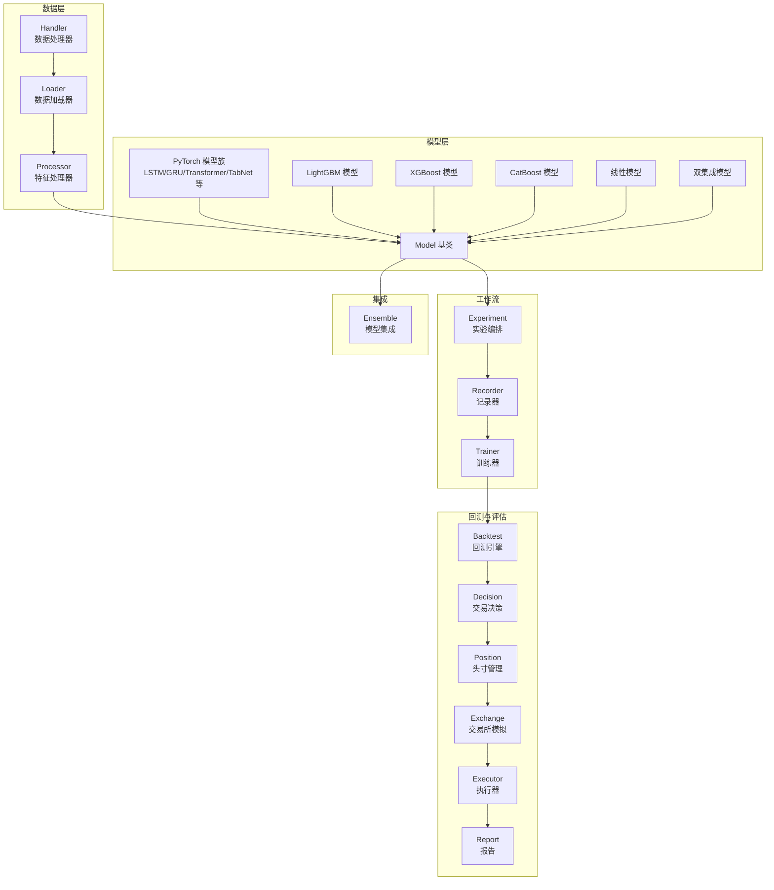
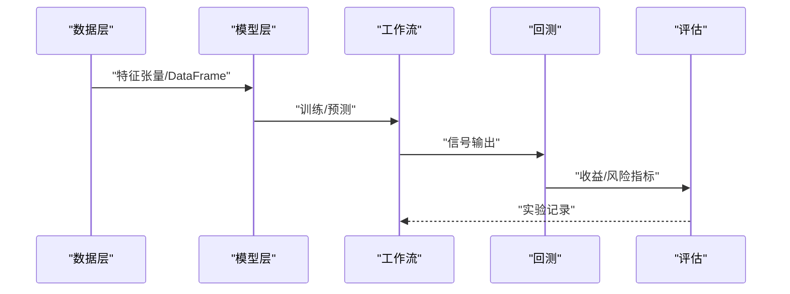
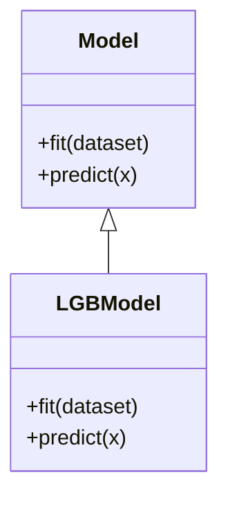
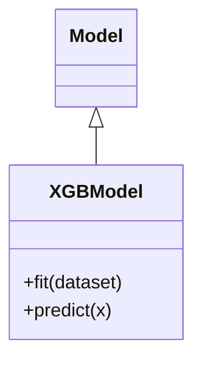
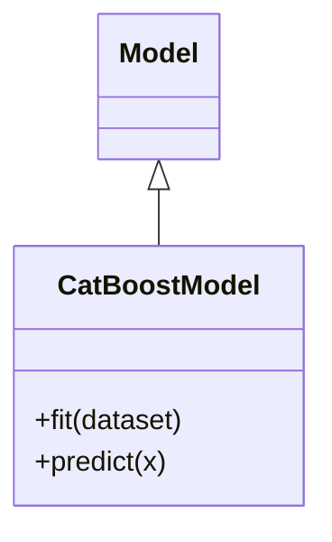
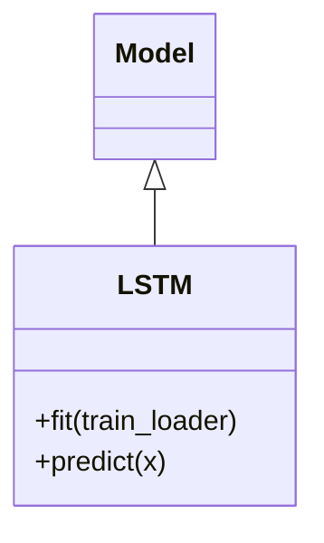
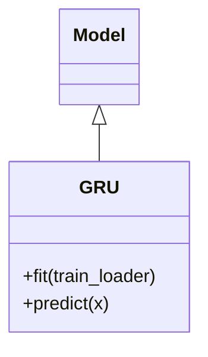
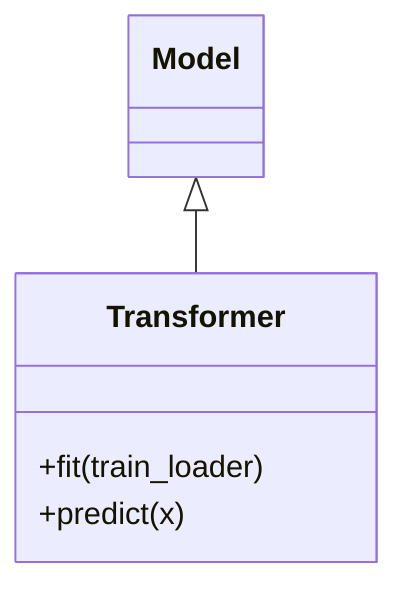
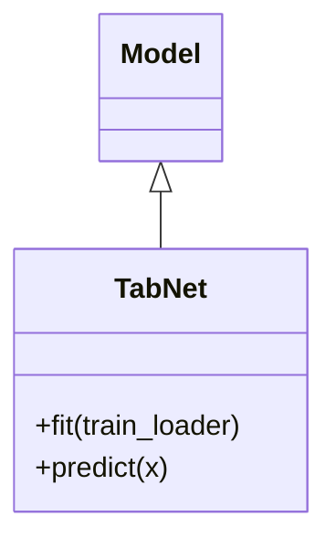
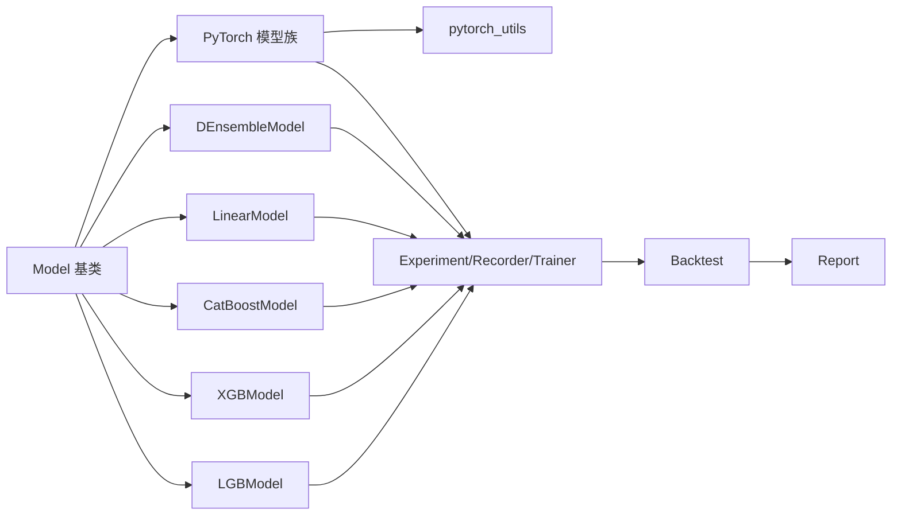

# 基准模型系统

<cite>
**本文引用的文件**
- [README.md](file://README.md)
- [examples/benchmarks/README.md](file://examples/benchmarks/README.md)
- [examples/benchmarks/LightGBM/README.md](file://examples/benchmarks/LightGBM/README.md)
- [examples/benchmarks/XGBoost/README.md](file://examples/benchmarks/XGBoost/README.md)
- [examples/benchmarks/CatBoost/README.md](file://examples/benchmarks/CatBoost/README.md)
- [examples/benchmarks/LSTM/README.md](file://examples/benchmarks/LSTM/README.md)
- [examples/benchmarks/GRU/README.md](file://examples/benchmarks/GRU/README.md)
- [examples/benchmarks/Transformer/README.md](file://examples/benchmarks/Transformer/README.md)
- [examples/benchmarks/TabNet/README.md](file://examples/benchmarks/TabNet/README.md)
- [qlib/contrib/model/__init__.py](file://qlib/contrib/model/__init__.py)
- [qlib/contrib/model/gbdt.py](file://qlib/contrib/model/gbdt.py)
- [qlib/contrib/model/xgboost.py](file://qlib/contrib/model/xgboost.py)
- [qlib/contrib/model/catboost_model.py](file://qlib/contrib/model/catboost_model.py)
- [qlib/contrib/model/linear.py](file://qlib/contrib/model/linear.py)
- [qlib/contrib/model/double_ensemble.py](file://qlib/contrib/model/double_ensemble.py)
- [qlib/contrib/model/pytorch_lstm.py](file://qlib/contrib/model/pytorch_lstm.py)
- [qlib/contrib/model/pytorch_gru.py](file://qlib/contrib/model/pytorch_gru.py)
- [qlib/contrib/model/pytorch_transformer.py](file://qlib/contrib/model/pytorch_transformer.py)
- [qlib/contrib/model/pytorch_tabnet.py](file://qlib/contrib/model/pytorch_tabnet.py)
- [qlib/contrib/model/pytorch_general_nn.py](file://qlib/contrib/model/pytorch_general_nn.py)
- [qlib/contrib/model/pytorch_utils.py](file://qlib/contrib/model/pytorch_utils.py)
- [qlib/model/base.py](file://qlib/model/base.py)
- [qlib/model/trainer.py](file://qlib/model/trainer.py)
- [qlib/workflow/exp.py](file://qlib/workflow/exp.py)
- [qlib/workflow/recorder.py](file://qlib/workflow/recorder.py)
- [qlib/data/dataset/handler.py](file://qlib/data/dataset/handler.py)
- [qlib/data/dataset/loader.py](file://qlib/data/dataset/loader.py)
- [qlib/data/dataset/processor.py](file://qlib/data/dataset/processor.py)
- [qlib/backtest/backtest.py](file://qlib/backtest/backtest.py)
- [qlib/backtest/report.py](file://qlib/backtest/report.py)
- [qlib/backtest/decision.py](file://qlib/backtest/decision.py)
- [qlib/backtest/position.py](file://qlib/backtest/position.py)
- [qlib/backtest/exchange.py](file://qlib/backtest/exchange.py)
- [qlib/backtest/executor.py](file://qlib/backtest/executor.py)
- [qlib/backtest/signal.py](file://qlib/backtest/signal.py)
- [qlib/backtest/utils.py](file://qlib/backtest/utils.py)
- [qlib/evaluate.py](file://qlib/evaluate.py)
- [qlib/evaluate_portfolio.py](file://qlib/evaluate_portfolio.py)
- [qlib/model/ens/ensemble.py](file://qlib/model/ens/ensemble.py)
- [qlib/model/ens/group.py](file://qlib/model/ens/group.py)
- [alpha158_factor_guide.md](file://alpha158_factor_guide.md)
</cite>

## 目录
1. [简介](#简介)
2. [项目结构](#项目结构)
3. [核心组件](#核心组件)
4. [架构总览](#架构总览)
5. [详细组件分析](#详细组件分析)
6. [依赖关系分析](#依赖关系分析)
7. [性能考量](#性能考量)
8. [故障排查指南](#故障排查指南)
9. [结论](#结论)
10. [附录](#附录)

## 简介
本文件面向Qlib基准模型系统，系统性梳理并解读仓库中涵盖的主流机器学习与深度学习模型（LightGBM、XGBoost、CatBoost、LSTM、GRU、Transformer、TabNet等）在Alpha158与Alpha360因子集上的实现与使用方式。文档从系统架构、组件关系、数据流与处理逻辑、训练流程、超参数调优、模型评估、模型集成策略与最佳实践等方面进行深入说明，并通过图示帮助读者快速建立对代码结构与运行机制的理解。

## 项目结构
Qlib基准模型系统主要由以下部分组成：
- 模型层：传统模型（LightGBM、XGBoost、CatBoost、线性模型、双集成）与深度学习模型（LSTM、GRU、Transformer、TabNet等），均以统一的Model接口进行封装，便于在工作流中统一调度。
- 数据层：Handler、Loader、Processor构成数据管线，负责因子加载、特征工程、时间序列切片与批处理。
- 工作流层：Experiment、Recorder、Trainer等模块串联起数据准备、模型训练、回测与报告生成。
- 回测与评估：Backtest、Report、Decision、Position、Exchange、Executor等模块完成信号执行、收益归因与风险分析。
- 集成与组合：Ensemble模块支持模型级组合策略。

图表来源
- [qlib/contrib/model/__init__.py:37-42](file://qlib/contrib/model/__init__.py#L37-L42)
- [qlib/model/base.py](file://qlib/model/base.py)
- [qlib/workflow/exp.py](file://qlib/workflow/exp.py)
- [qlib/workflow/recorder.py](file://qlib/workflow/recorder.py)
- [qlib/model/trainer.py](file://qlib/model/trainer.py)
- [qlib/backtest/backtest.py](file://qlib/backtest/backtest.py)
- [qlib/backtest/report.py](file://qlib/backtest/report.py)
- [qlib/backtest/decision.py](file://qlib/backtest/decision.py)
- [qlib/backtest/position.py](file://qlib/backtest/position.py)
- [qlib/backtest/exchange.py](file://qlib/backtest/exchange.py)
- [qlib/backtest/executor.py](file://qlib/backtest/executor.py)
- [qlib/model/ens/ensemble.py](file://qlib/model/ens/ensemble.py)

章节来源
- [README.md](file://README.md)
- [examples/benchmarks/README.md](file://examples/benchmarks/README.md)

## 核心组件
- 模型基类与注册
  - 所有模型均继承自统一的Model基类，具备fit/predict等标准接口，便于在工作流中统一调度。
  - 模型注册集中于contrib/model/__init__.py，包含传统模型与PyTorch模型族的聚合，形成可枚举的模型集合。
- 数据管线
  - Handler负责按时间窗口与样本过滤规则组织数据；Loader负责从缓存或磁盘加载；Processor负责特征变换与缺失值处理。
- 工作流
  - Experiment负责编排一次实验，Recorder记录实验结果，Trainer封装训练过程（含早停、验证集监控等）。
- 回测与评估
  - Backtest驱动信号到交易的全流程；Report汇总IC、Rank IC、年化收益、最大回撤等指标；Decision/Position/Exchange/Executor实现下单、成交与头寸管理。
- 集成策略
  - Ensemble模块提供模型级组合策略，支持分组聚合与权重分配。

章节来源
- [qlib/contrib/model/__init__.py:37-42](file://qlib/contrib/model/__init__.py#L37-L42)
- [qlib/model/base.py](file://qlib/model/base.py)
- [qlib/data/dataset/handler.py](file://qlib/data/dataset/handler.py)
- [qlib/data/dataset/loader.py](file://qlib/data/dataset/loader.py)
- [qlib/data/dataset/processor.py](file://qlib/data/dataset/processor.py)
- [qlib/workflow/exp.py](file://qlib/workflow/exp.py)
- [qlib/workflow/recorder.py](file://qlib/workflow/recorder.py)
- [qlib/model/trainer.py](file://qlib/model/trainer.py)
- [qlib/backtest/backtest.py](file://qlib/backtest/backtest.py)
- [qlib/backtest/report.py](file://qlib/backtest/report.py)
- [qlib/backtest/decision.py](file://qlib/backtest/decision.py)
- [qlib/backtest/position.py](file://qlib/backtest/position.py)
- [qlib/backtest/exchange.py](file://qlib/backtest/exchange.py)
- [qlib/backtest/executor.py](file://qlib/backtest/executor.py)
- [qlib/model/ens/ensemble.py](file://qlib/model/ens/ensemble.py)

## 架构总览
下图展示了从数据到模型再到回测评估的整体流程，以及模型层内部的继承与组合关系。

图表来源
- [qlib/data/dataset/handler.py](file://qlib/data/dataset/handler.py)
- [qlib/contrib/model/__init__.py:37-42](file://qlib/contrib/model/__init__.py#L37-L42)
- [qlib/workflow/exp.py](file://qlib/workflow/exp.py)
- [qlib/backtest/backtest.py](file://qlib/backtest/backtest.py)
- [qlib/evaluate.py](file://qlib/evaluate.py)

## 详细组件分析

### LightGBM 模型
- 技术特点
  - 基于梯度提升框架，支持类别特征高效编码、并行与分布式训练、早停与验证集监控。
  - 在金融因子场景中通常具有良好的正则化能力与特征重要性解释性。
- 适用场景
  - Alpha158/Alpha360多因子回归/分类任务；高维稀疏特征；需要快速迭代与可解释性。
- 关键实现要点
  - 模型封装位于contrib/model/gbdt.py，继承统一Model基类，提供fit/predict接口。
  - 支持特征重要性与验证曲线可视化（通过工作流与记录器）。
- 训练流程要点
  - 数据预处理：Handler+Processor；目标变量通常为未来收益率或排序标签。
  - 超参数：学习率、树数量、叶子节点大小、正则化系数等；可通过工作流配置文件或网格搜索调优。
  - 评估：IC、Rank IC、信息系数衰减等指标。
- Alpha158 vs Alpha360差异
  - Alpha360包含更多时变与跨周期因子，可能需要更强的正则化与更长的训练周期；Alpha158相对稳定，收敛更快。

图表来源
- [qlib/contrib/model/gbdt.py:15-56](file://qlib/contrib/model/gbdt.py#L15-L56)
- [qlib/model/base.py](file://qlib/model/base.py)

章节来源
- [examples/benchmarks/LightGBM/README.md](file://examples/benchmarks/LightGBM/README.md)
- [qlib/contrib/model/gbdt.py:15-56](file://qlib/contrib/model/gbdt.py#L15-L56)

### XGBoost 模型
- 技术特点
  - 以正则化为目标的梯度提升树，强调泛化能力与鲁棒性；支持缺失值与二阶泰勒展开。
- 适用场景
  - 对过拟合敏感的任务；需要稳定的特征选择与评分。
- 实现与流程
  - 模型封装位于contrib/model/xgboost.py；训练与评估流程与LightGBM一致。
- Alpha158 vs Alpha360差异
  - 两者差异与LightGBM类似，但XGBoost在某些噪声因子上可能表现更稳健。

图表来源
- [qlib/contrib/model/xgboost.py](file://qlib/contrib/model/xgboost.py)
- [qlib/model/base.py](file://qlib/model/base.py)

章节来源
- [examples/benchmarks/XGBoost/README.md](file://examples/benchmarks/XGBoost/README.md)
- [qlib/contrib/model/xgboost.py](file://qlib/contrib/model/xgboost.py)

### CatBoost 模型
- 技术特点
  - 对类别特征天然友好，内置类别特征编码与随机化策略，减少过拟合。
- 适用场景
  - 含大量类别因子的Alpha空间；需要更好的类别特征处理。
- 实现与流程
  - 模型封装位于contrib/model/catboost_model.py；支持类别特征索引配置。
- Alpha158 vs Alpha360差异
  - Alpha360中类别因子比例更高，CatBoost优势更明显。

图表来源
- [qlib/contrib/model/catboost_model.py:16-27](file://qlib/contrib/model/catboost_model.py#L16-L27)
- [qlib/model/base.py](file://qlib/model/base.py)

章节来源
- [examples/benchmarks/CatBoost/README.md](file://examples/benchmarks/CatBoost/README.md)
- [qlib/contrib/model/catboost_model.py:16-27](file://qlib/contrib/model/catboost_model.py#L16-L27)

### LSTM 模型
- 技术特点
  - 序列建模能力强，适合时间序列特征；可加入注意力或残差结构。
- 适用场景
  - 时间维度显著的因子序列；多步预测或序列标注任务。
- 实现与流程
  - 模型封装位于contrib/model/pytorch_lstm.py；基于PyTorch实现，支持GPU加速与批量训练。
- Alpha158 vs Alpha360差异
  - Alpha360序列长度与时间跨度更大，可能需要更深的网络与更长的上下文窗口。

图表来源
- [qlib/contrib/model/pytorch_lstm.py](file://qlib/contrib/model/pytorch_lstm.py)
- [qlib/model/base.py](file://qlib/model/base.py)

章节来源
- [examples/benchmarks/LSTM/README.md](file://examples/benchmarks/LSTM/README.md)
- [qlib/contrib/model/pytorch_lstm.py](file://qlib/contrib/model/pytorch_lstm.py)

### GRU 模型
- 技术特点
  - 相比LSTM计算更轻量，适合长序列建模；常用于大规模时间序列任务。
- 适用场景
  - 计算资源受限的序列建模；高频因子序列。
- 实现与流程
  - 模型封装位于contrib/model/pytorch_gru.py；与LSTM类似的训练与评估流程。

图表来源
- [qlib/contrib/model/pytorch_gru.py](file://qlib/contrib/model/pytorch_gru.py)
- [qlib/model/base.py](file://qlib/model/base.py)

章节来源
- [examples/benchmarks/GRU/README.md](file://examples/benchmarks/GRU/README.md)
- [qlib/contrib/model/pytorch_gru.py](file://qlib/contrib/model/pytorch_gru.py)

### Transformer 模型
- 技术特点
  - 自注意力机制擅长捕捉长程依赖与跨时间相关性；可扩展至多变量时序建模。
- 适用场景
  - 多因子间交互复杂的时间序列预测；需要全局上下文感知的任务。
- 实现与流程
  - 模型封装位于contrib/model/pytorch_transformer.py；支持序列到序列与序列到标量两种输出形式。

图表来源
- [qlib/contrib/model/pytorch_transformer.py](file://qlib/contrib/model/pytorch_transformer.py)
- [qlib/model/base.py](file://qlib/model/base.py)

章节来源
- [examples/benchmarks/Transformer/README.md](file://examples/benchmarks/Transformer/README.md)
- [qlib/contrib/model/pytorch_transformer.py](file://qlib/contrib/model/pytorch_transformer.py)

### TabNet 模型
- 技术特点
  - 可解释性强的神经网络架构，结合注意力与路由机制，适合高维稀疏因子空间。
- 适用场景
  - Alpha158/Alpha360中因子维数高、稀疏性强的任务；需要可解释的特征选择。
- 实现与流程
  - 模型封装位于contrib/model/pytorch_tabnet.py；支持特征选择与路由注意力可视化。

图表来源
- [qlib/contrib/model/pytorch_tabnet.py](file://qlib/contrib/model/pytorch_tabnet.py)
- [qlib/model/base.py](file://qlib/model/base.py)

章节来源
- [examples/benchmarks/TabNet/README.md](file://examples/benchmarks/TabNet/README.md)
- [qlib/contrib/model/pytorch_tabnet.py](file://qlib/contrib/model/pytorch_tabnet.py)

### 线性模型与双集成模型
- 线性模型
  - 作为基线模型，提供简单、可解释且高效的回归/分类能力。
- 双集成模型
  - 通过两阶段子模型集成提升稳定性与泛化性能，适合对抗噪声因子。

章节来源
- [qlib/contrib/model/linear.py:16-57](file://qlib/contrib/model/linear.py#L16-L57)
- [qlib/contrib/model/double_ensemble.py:14-104](file://qlib/contrib/model/double_ensemble.py#L14-L104)

## 依赖关系分析
- 继承与聚合
  - 所有模型统一继承Model基类，确保fit/predict接口一致性。
  - PyTorch模型族共享通用工具模块（如pytorch_utils），降低重复实现。
- 工作流耦合
  - Experiment/Recorder/Trainer与Model强耦合，通过配置文件驱动训练与评估。
- 数据依赖
  - Handler/Loader/Processor为模型提供标准化输入，保证不同模型的一致性。
- 回测链路
  - Backtest依赖Model输出信号，再经由Decision/Position/Exchange/Executor完成闭环。

图表来源
- [qlib/contrib/model/__init__.py:37-42](file://qlib/contrib/model/__init__.py#L37-L42)
- [qlib/contrib/model/pytorch_utils.py](file://qlib/contrib/model/pytorch_utils.py)
- [qlib/workflow/exp.py](file://qlib/workflow/exp.py)
- [qlib/workflow/recorder.py](file://qlib/workflow/recorder.py)
- [qlib/model/trainer.py](file://qlib/model/trainer.py)
- [qlib/backtest/backtest.py](file://qlib/backtest/backtest.py)
- [qlib/backtest/report.py](file://qlib/backtest/report.py)

章节来源
- [qlib/contrib/model/__init__.py:37-42](file://qlib/contrib/model/__init__.py#L37-L42)
- [qlib/contrib/model/pytorch_utils.py](file://qlib/contrib/model/pytorch_utils.py)
- [qlib/workflow/exp.py](file://qlib/workflow/exp.py)
- [qlib/workflow/recorder.py](file://qlib/workflow/recorder.py)
- [qlib/model/trainer.py](file://qlib/model/trainer.py)
- [qlib/backtest/backtest.py](file://qlib/backtest/backtest.py)
- [qlib/backtest/report.py](file://qlib/backtest/report.py)

## 性能考量
- 计算效率
  - LightGBM/XGBoost/CatBoost等传统树模型在中等规模因子数据上通常更快；深度学习模型需合理设置batch size与序列长度。
- 内存占用
  - Transformer/TabNet等深度模型对显存要求较高，建议在配置文件中调整隐藏维度与层数。
- 正则化与早停
  - 使用验证集监控与早停策略避免过拟合；对噪声因子（Alpha360）应加强正则化。
- 特征工程
  - 标准化、缺失填充、异常值处理与因子分箱/分位等操作对模型性能影响显著。
- 并行与分布式
  - LightGBM/XGBoost支持并行与分布式训练；PyTorch模型可利用多GPU与分布式策略。

## 故障排查指南
- 训练不收敛或震荡
  - 检查学习率、批次大小与正则化参数；确认数据预处理是否一致。
- 过拟合
  - 引入早停、增加正则项、减少模型容量；对Alpha360可考虑更强的特征选择。
- 回测收益为负
  - 检查信号阈值、滑点与手续费设置；核对目标变量定义与方向。
- 显存不足（深度模型）
  - 减小batch size、缩短序列长度、关闭不必要的日志与可视化。
- 评估指标异常
  - 确认IC/Rank IC计算逻辑与目标标签构造；检查样本权重与时间窗口划分。

章节来源
- [qlib/backtest/backtest.py](file://qlib/backtest/backtest.py)
- [qlib/backtest/report.py](file://qlib/backtest/report.py)
- [qlib/evaluate.py](file://qlib/evaluate.py)
- [qlib/evaluate_portfolio.py](file://qlib/evaluate_portfolio.py)

## 结论
Qlib基准模型系统通过统一的Model接口与完善的工作流，将传统与深度学习模型无缝整合到因子投资场景中。针对Alpha158与Alpha360两类因子集，应根据其稀疏性、类别特征比例与时间序列特性选择合适模型，并结合特征工程、正则化与早停策略获得稳健性能。模型集成策略可进一步提升稳定性与泛化能力。

## 附录
- Alpha158与Alpha360因子差异参考
  - Alpha158为经典静态因子集，强调横截面稳定性；Alpha360包含更多动态与跨期因子，更适合序列建模与长序列任务。
- 最佳实践清单
  - 数据层面：统一时间窗口、标准化与缺失处理；因子分箱/去极值。
  - 模型层面：先用线性/树模型做基线，再尝试深度模型；对类别特征优先考虑CatBoost。
  - 训练层面：早停+验证集；网格搜索/贝叶斯优化超参数；交叉验证与滚动窗口。
  - 回测层面：严格区分训练/验证/测试区间；考虑滑点与交易成本；多指标评估。

章节来源
- [alpha158_factor_guide.md](file://alpha158_factor_guide.md)