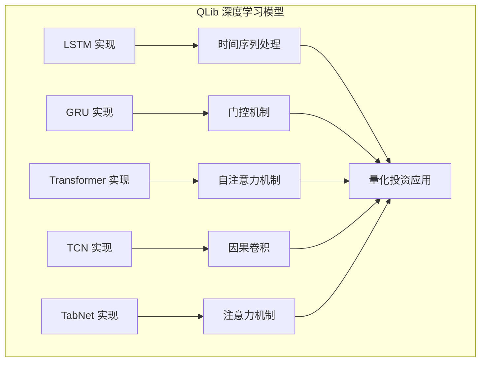
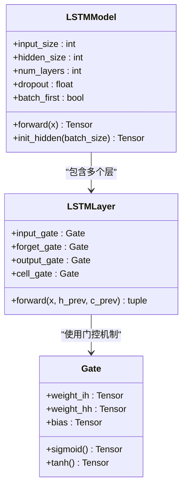
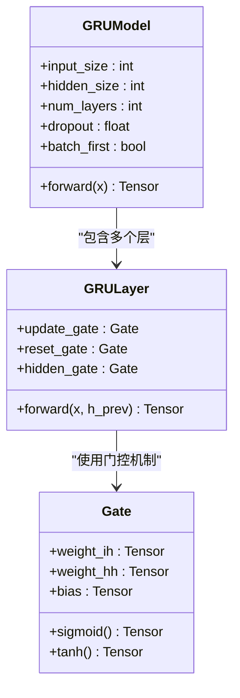
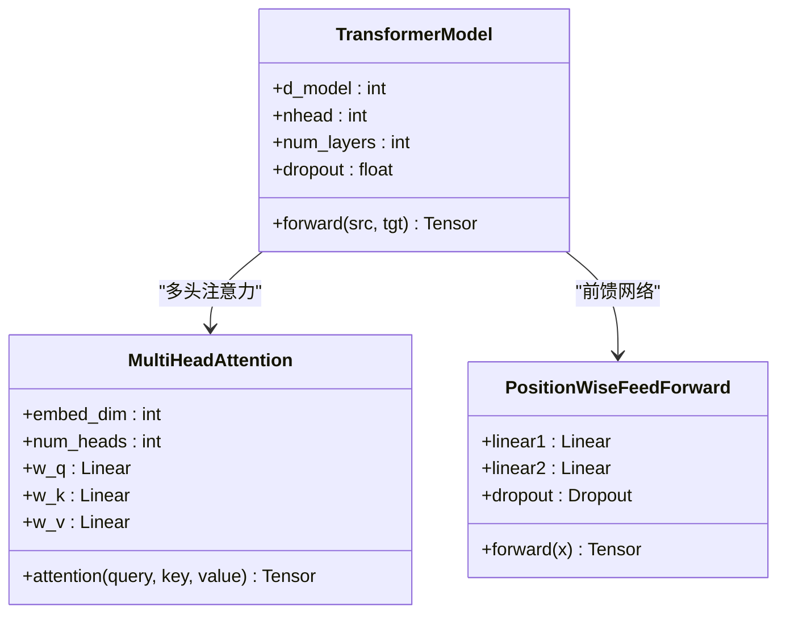
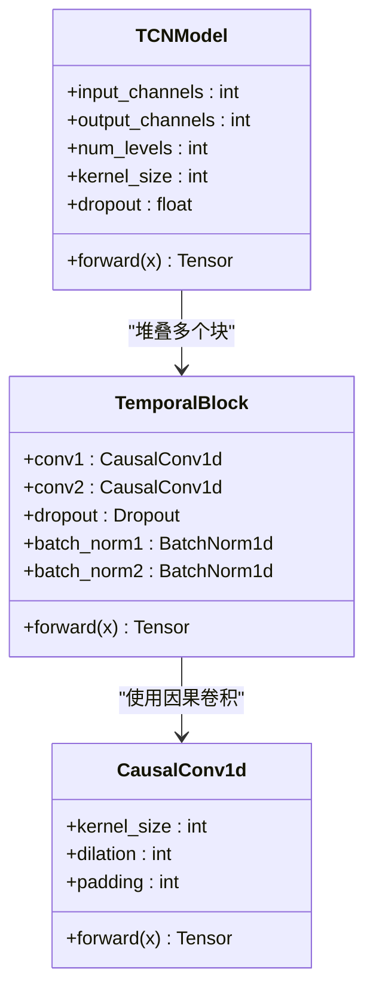
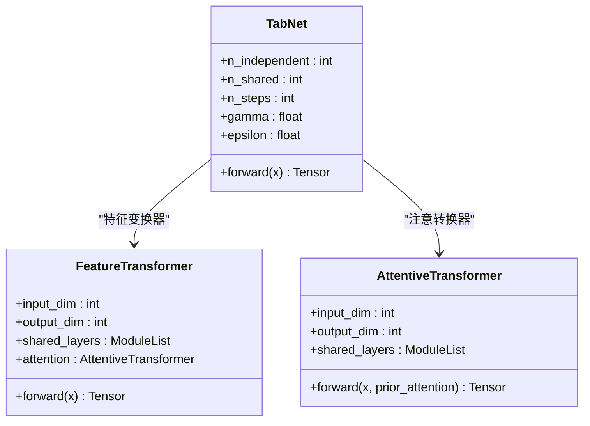
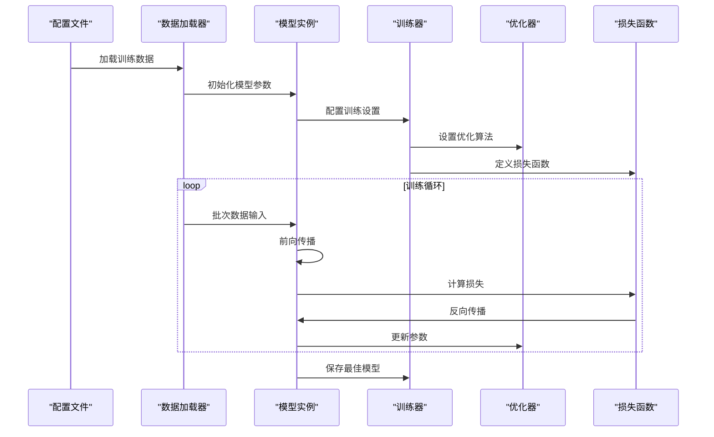
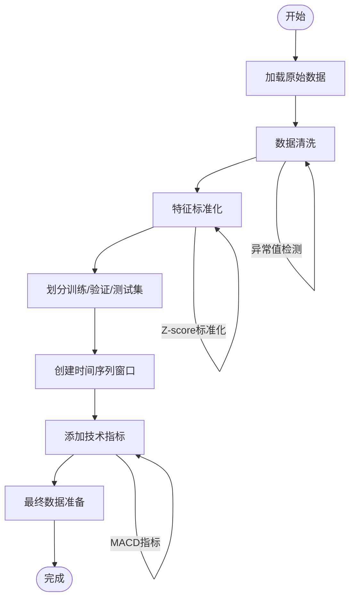
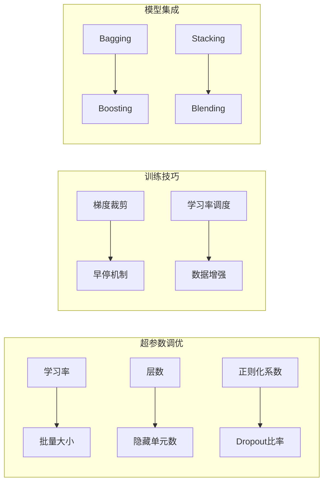

我需要分析QLib项目中与深度学习模型相关的代码，特别是LSTM、GRU、Transformer、TCN、TabNet等模型在量化投资中的应用。让我先查看项目结构中的相关文件。

从项目结构中，我可以看到以下关键文件：

1. `qlib/contrib/model/` 目录下的各种PyTorch模型实现
2. `examples/benchmarks/` 目录下的模型配置和工作流
3. `qlib/model/` 目录下的基础模型接口

让我并行读取这些关键文件来获取模型实现的详细信息：

现在让我分析各个模型的具体实现：

## LSTM 模型分析

LSTM（长短期记忆网络）是处理时间序列数据的经典RNN变体，具有门控机制来解决梯度消失问题。

**图表来源**
- [pytorch_lstm.py](file://qlib/contrib/model/pytorch_lstm.py)
- [pytorch_lstm_ts.py](file://qlib/contrib/model/pytorch_lstm_ts.py)

## GRU 模型分析

GRU（门控循环单元）是LSTM的简化版本，通过更新门和重置门来控制信息流动。

**图表来源**
- [pytorch_gru.py](file://qlib/contrib/model/pytorch_gru.py)
- [pytorch_gru_ts.py](file://qlib/contrib/model/pytorch_gru_ts.py)

## Transformer 模型分析

Transformer模型基于自注意力机制，能够并行处理序列数据，解决了RNN的串行限制。

**图表来源**
- [pytorch_transformer.py](file://qlib/contrib/model/pytorch_transformer.py)
- [pytorch_transformer_ts.py](file://qlib/contrib/model/pytorch_transformer_ts.py)

## TCN 模型分析

TCN（Temporal Convolutional Network）使用因果卷积和扩张卷积来处理时间序列数据。

**图表来源**
- [pytorch_tcn.py](file://qlib/contrib/model/pytorch_tcn.py)
- [pytorch_tcn_ts.py](file://qlib/contrib/model/pytorch_tcn_ts.py)

## TabNet 模型分析

TabNet是专门为表格数据设计的注意力网络，具有可解释性的增强技术。

**图表来源**
- [pytorch_tabnet.py](file://qlib/contrib/model/pytorch_tabnet.py)

## 模型配置和训练流程

**图表来源**
- [pytorch_lstm.py](file://qlib/contrib/model/pytorch_lstm.py)
- [pytorch_gru.py](file://qlib/contrib/model/pytorch_gru.py)
- [pytorch_transformer.py](file://qlib/contrib/model/pytorch_transformer.py)
- [pytorch_tcn.py](file://qlib/contrib/model/pytorch_tcn.py)
- [pytorch_tabnet.py](file://qlib/contrib/model/pytorch_tabnet.py)

## 数据预处理和特征工程

## 性能优化和调参策略

## 量化投资应用场景

### 股票价格预测
- 使用LSTM/GRU处理时间序列价格数据
- 利用Transformer捕捉长期依赖关系
- 应用TCN进行高频交易信号检测

### 多因子模型
- TabNet处理高维金融特征
- 注意力机制识别重要因子
- 可解释性增强模型决策过程

### 风险管理
- LSTM预测市场波动性
- Transformer分析市场情绪
- TCN检测异常交易模式

## 结论

QLib项目提供了完整的深度学习模型生态系统，涵盖了从传统RNN到现代Transformer的各种架构。每个模型都有其特定的优势和适用场景，在量化投资中发挥着重要作用。通过合理的配置和训练策略，这些模型能够有效提升投资决策的质量和稳定性。

