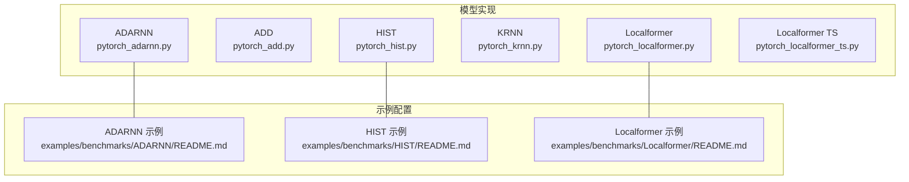
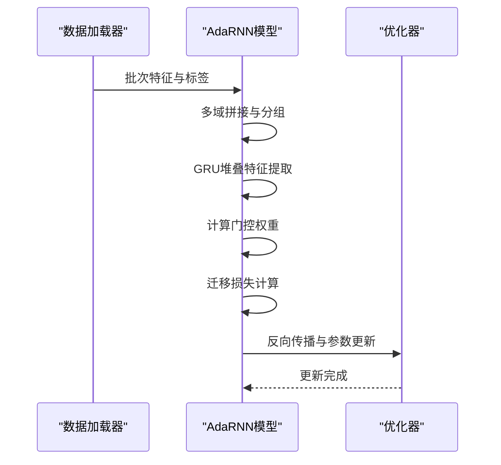
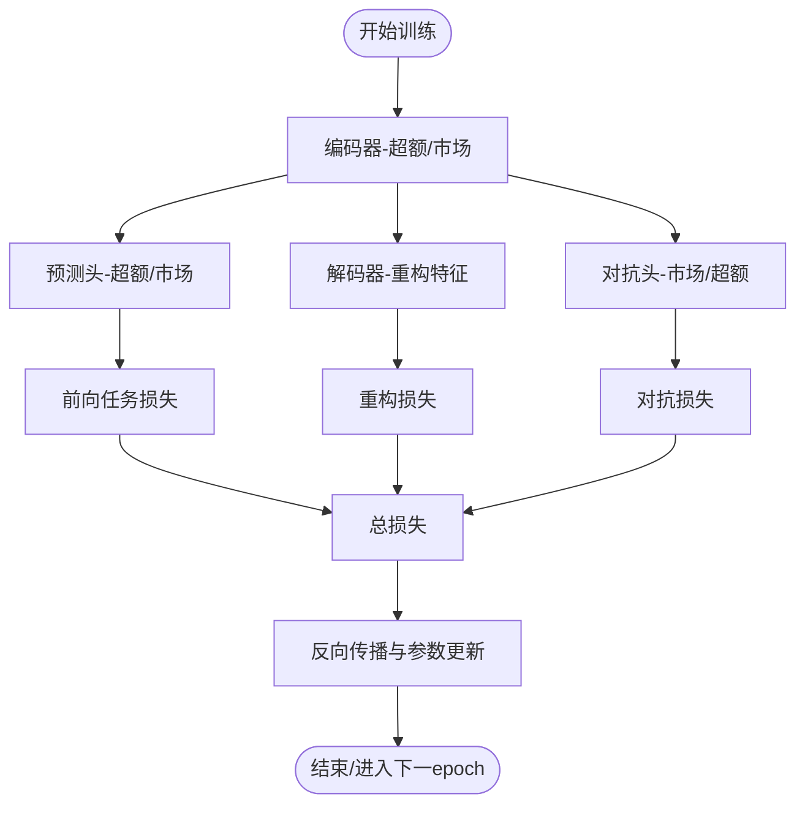
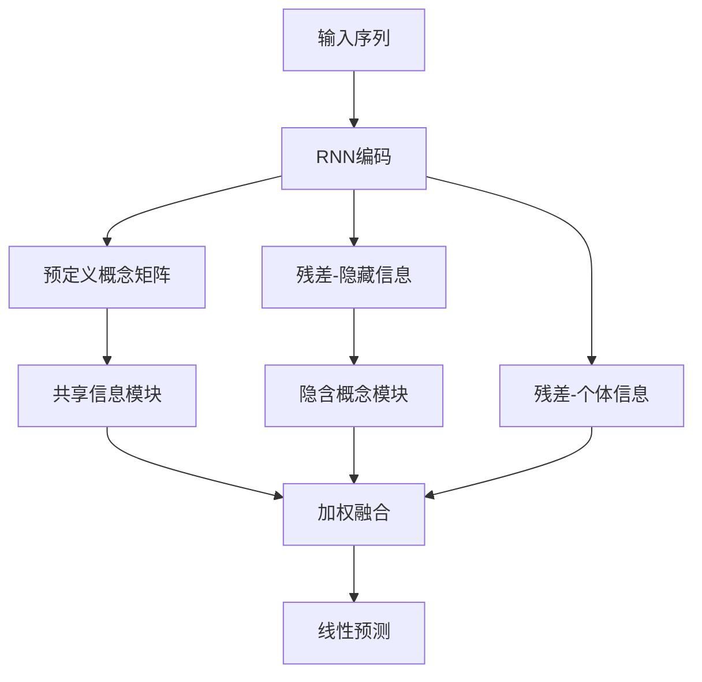
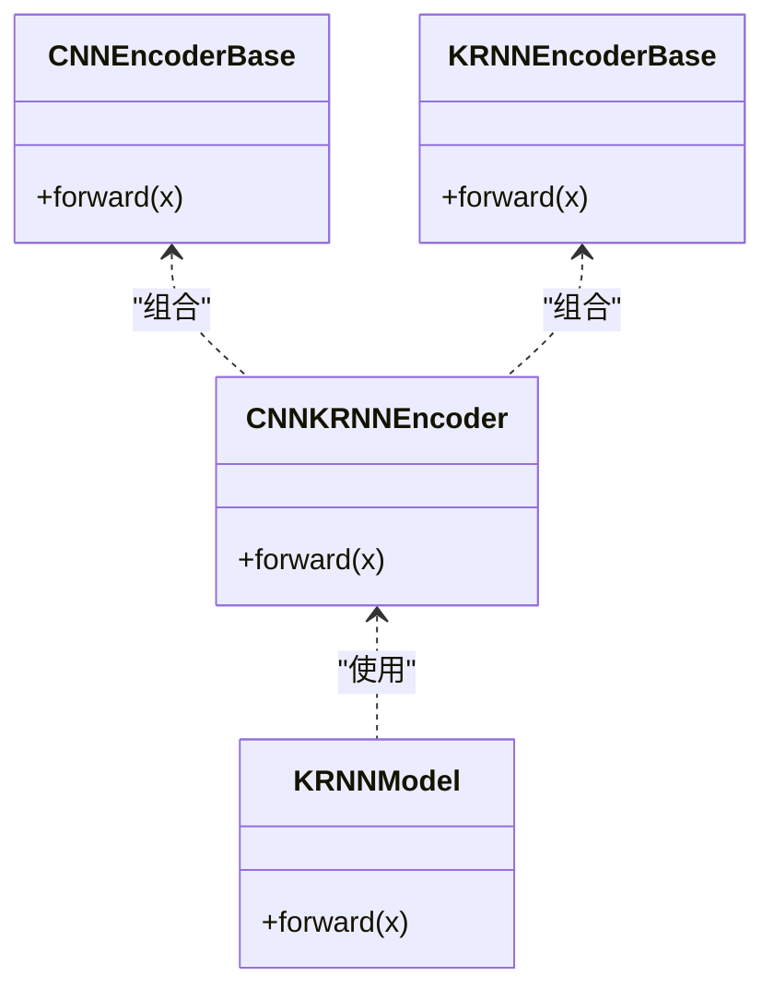
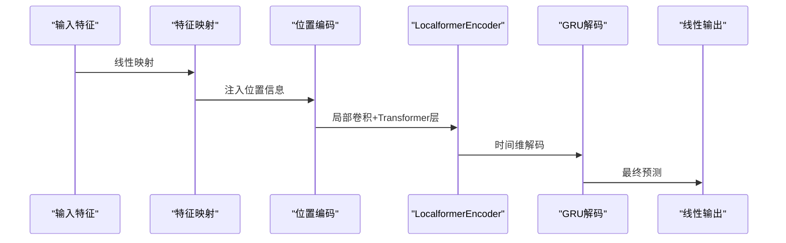
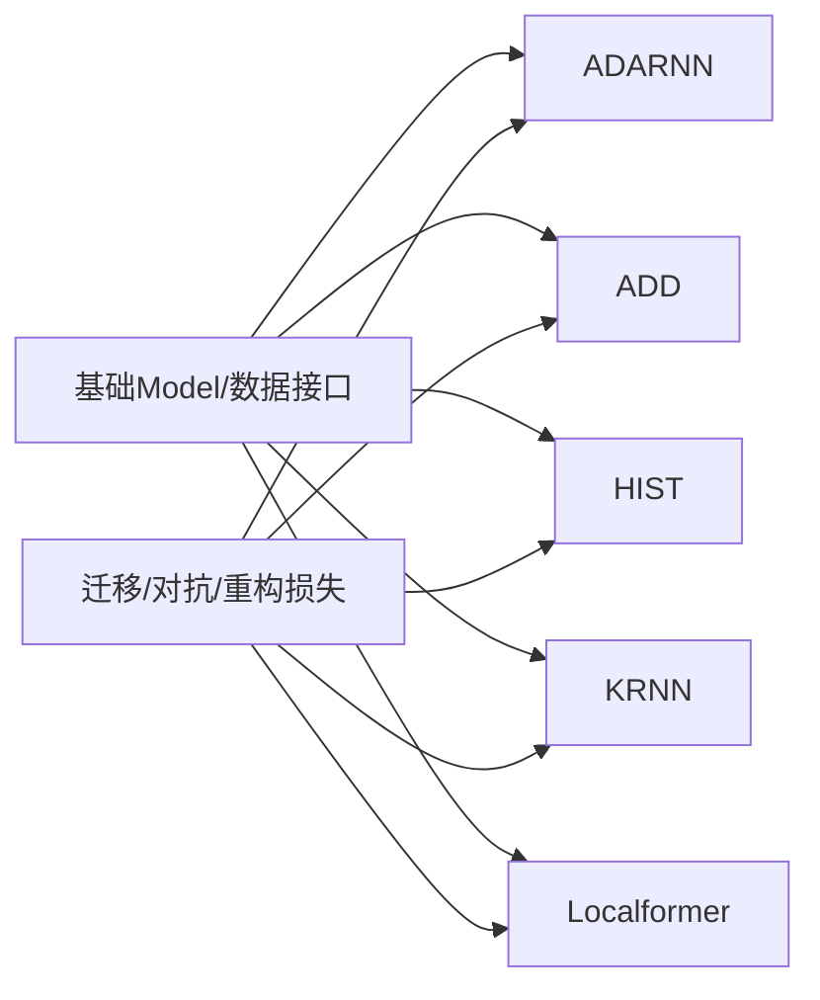

# 自定义模型

<cite>
**本文引用的文件**
- [pytorch_adarnn.py](file://qlib/contrib/model/pytorch_adarnn.py)
- [pytorch_add.py](file://qlib/contrib/model/pytorch_add.py)
- [pytorch_hist.py](file://qlib/contrib/model/pytorch_hist.py)
- [pytorch_krnn.py](file://qlib/contrib/model/pytorch_krnn.py)
- [pytorch_localformer.py](file://qlib/contrib/model/pytorch_localformer.py)
- [pytorch_localformer_ts.py](file://qlib/contrib/model/pytorch_localformer_ts.py)
- [README.md（ADARNN 示例）](file://examples/benchmarks/ADARNN/README.md)
- [README.md（HIST 示例）](file://examples/benchmarks/HIST/README.md)
- [README.md（Localformer 示例）](file://examples/benchmarks/Localformer/README.md)
</cite>

## 目录
1. [引言](#引言)
2. [项目结构](#项目结构)
3. [核心组件](#核心组件)
4. [架构总览](#架构总览)
5. [详细组件分析](#详细组件分析)
6. [依赖分析](#依赖分析)
7. [性能考虑](#性能考虑)
8. [故障排查指南](#故障排查指南)
9. [结论](#结论)
10. [附录：扩展与定制化开发指南](#附录扩展与定制化开发指南)

## 引言
本文件系统性梳理 QLib 中的五类自定义模型：ADARNN、ADD、HIST、KRNN、Localformer。围绕其架构设计、数据流、训练策略与关键创新点进行深入解析，并提供可操作的扩展与定制化建议，帮助读者在金融时序预测任务中高效应用与迭代这些模型。

## 项目结构
以下为与本文相关的核心文件与示例说明：
- ADARNN：基于 PyTorch 的自适应递归神经网络，支持预训练与提升式迁移学习。
- ADD：自适应深度学习框架，分离“超额收益”与“市场状态”的多任务建模，并引入对抗蒸馏与重构一致性损失。
- HIST：基于图概念信息融合的股票趋势预测，包含共享概念模块、隐藏概念模块与个体信息模块。
- KRNN：关键递归网络，采用并行重复 RNN（K duplicates）与卷积编码器的混合架构，强调关键路径建模。
- Localformer：结合局部卷积与 Transformer 编码器的局部注意力机制，用于长程依赖建模。

**图表来源**
- [pytorch_adarnn.py:23-151](file://qlib/contrib/model/pytorch_adarnn.py#L23-L151)
- [pytorch_add.py:29-165](file://qlib/contrib/model/pytorch_add.py#L29-L165)
- [pytorch_hist.py:27-148](file://qlib/contrib/model/pytorch_hist.py#L27-L148)
- [pytorch_krnn.py:225-347](file://qlib/contrib/model/pytorch_krnn.py#L225-L347)
- [pytorch_localformer.py:28-83](file://qlib/contrib/model/pytorch_localformer.py#L28-L83)
- [pytorch_localformer_ts.py:267-322](file://qlib/contrib/model/pytorch_localformer_ts.py#L267-L322)
- [README.md（ADARNN 示例）:1-5](file://examples/benchmarks/ADARNN/README.md#L1-L5)
- [README.md（HIST 示例）:1-3](file://examples/benchmarks/HIST/README.md#L1-L3)
- [README.md（Localformer 示例）:1-2](file://examples/benchmarks/Localformer/README.md#L1-L2)

**章节来源**
- [pytorch_adarnn.py:23-151](file://qlib/contrib/model/pytorch_adarnn.py#L23-L151)
- [pytorch_add.py:29-165](file://qlib/contrib/model/pytorch_add.py#L29-L165)
- [pytorch_hist.py:27-148](file://qlib/contrib/model/pytorch_hist.py#L27-L148)
- [pytorch_krnn.py:225-347](file://qlib/contrib/model/pytorch_krnn.py#L225-L347)
- [pytorch_localformer.py:28-83](file://qlib/contrib/model/pytorch_localformer.py#L28-L83)
- [pytorch_localformer_ts.py:267-322](file://qlib/contrib/model/pytorch_localformer_ts.py#L267-L322)
- [README.md（ADARNN 示例）:1-5](file://examples/benchmarks/ADARNN/README.md#L1-L5)
- [README.md（HIST 示例）:1-3](file://examples/benchmarks/HIST/README.md#L1-L3)
- [README.md（Localformer 示例）:1-2](file://examples/benchmarks/Localformer/README.md#L1-L2)

## 核心组件
- ADARNN：以 GRU 层堆叠的特征提取器，结合领域适配损失（如 MMD/COSINE）与动态权重更新，实现跨域样本的自适应加权与提升式训练。
- ADD：双分支编码器（超额收益/市场状态），解码器重构输入特征；通过对抗梯度反转与一致性重构损失，提升泛化能力。
- HIST：基于预定义与隐含概念矩阵的三模块融合（共享/隐藏/个体），利用余弦相似度构建概念到股票映射，实现概念导向的信息聚合。
- KRNN：CNN+并行重复 RNN（K duplicates）编码器，对序列进行局部卷积平滑后用多个 GRU 并行编码，最后平均聚合，强调关键路径与多视角特征。
- Localformer：特征线性映射至 d_model 后经位置编码，随后由 LocalformerEncoder（局部卷积+Transformer 层）与 GRU 解码器组成，兼顾局部与全局依赖。

**章节来源**
- [pytorch_adarnn.py:372-551](file://qlib/contrib/model/pytorch_adarnn.py#L372-L551)
- [pytorch_add.py:442-524](file://qlib/contrib/model/pytorch_add.py#L442-L524)
- [pytorch_hist.py:365-500](file://qlib/contrib/model/pytorch_hist.py#L365-L500)
- [pytorch_krnn.py:136-222](file://qlib/contrib/model/pytorch_krnn.py#L136-L222)
- [pytorch_localformer.py:286-322](file://qlib/contrib/model/pytorch_localformer.py#L286-L322)

## 架构总览
下图展示各模型的端到端流程与关键模块交互：

```mermaid
graph TB
subgraph "ADARNN"
ADA_IN["输入序列"]
ADA_FEAT["GRU堆叠特征提取"]
ADA_GATE["门控权重计算"]
ADA_LOSS["迁移损失+回归损失"]
ADA_OUT["预测输出"]
ADA_IN --> ADA_FEAT --> ADA_GATE --> ADA_LOSS --> ADA_OUT
end
subgraph "ADD"
ADD_IN["输入序列"]
ADD_ENC1["编码器-超额收益"]
ADD_ENC2["编码器-市场状态"]
ADD_DEC["解码器-重构特征"]
ADD_PRED["预测头-超额/市场"]
ADD_ADV["对抗头-市场/超额"]
ADD_LOSS["前向+对抗+重构损失"]
ADD_IN --> ADD_ENC1 --> ADD_PRED
ADD_IN --> ADD_ENC2 --> ADD_PRED
ADD_ENC1 --> ADD_DEC
ADD_ENC2 --> ADD_DEC
ADD_ENC1 --> ADD_ADV
ADD_ENC2 --> ADD_ADV
ADD_LOSS --> ADD_PRED
ADD_LOSS --> ADD_ADV
end
subgraph "HIST"
HIST_IN["输入序列"]
HIST_RNN["RNN编码"]
HIST_PREDEF["预定义概念矩阵"]
HIST_HIDDEN["隐含概念矩阵"]
HIST_SHARE["共享信息模块"]
HIST_HIDDEN_INFO["隐藏信息模块"]
HIST_INDIV["个体信息模块"]
HIST_OUT["预测输出"]
HIST_IN --> HIST_RNN --> HIST_PREDEF --> HIST_SHARE
HIST_IN --> HIST_RNN --> HIST_HIDDEN --> HIST_HIDDEN_INFO
HIST_SHARE --> HIST_OUT
HIST_HIDDEN_INFO --> HIST_OUT
HIST_INDIV --> HIST_OUT
end
subgraph "KRNN"
KRNN_IN["输入张量<br/>[B,N,T,F]"]
KRNN_CNN["CNN局部平滑"]
KRNN_GRU["K并行GRU编码"]
KRNN_MEAN["均值聚合"]
KRNN_FC["全连接输出"]
KRNN_IN --> KRNN_CNN --> KRNN_GRU --> KRNN_MEAN --> KRNN_FC
end
subgraph "Localformer"
LF_IN["输入向量"]
LF_FEAT["线性映射d_feat->d_model"]
LF_POS["位置编码"]
LF_ENC["LocalformerEncoder<br/>局部卷积+Transformer层"]
LF_GRU["GRU解码"]
LF_DEC["线性输出"]
LF_IN --> LF_FEAT --> LF_POS --> LF_ENC --> LF_GRU --> LF_DEC
end
```

**图表来源**
- [pytorch_adarnn.py:445-551](file://qlib/contrib/model/pytorch_adarnn.py#L445-L551)
- [pytorch_add.py:442-524](file://qlib/contrib/model/pytorch_add.py#L442-L524)
- [pytorch_hist.py:431-500](file://qlib/contrib/model/pytorch_hist.py#L431-L500)
- [pytorch_krnn.py:136-222](file://qlib/contrib/model/pytorch_krnn.py#L136-L222)
- [pytorch_localformer.py:286-322](file://qlib/contrib/model/pytorch_localformer.py#L286-L322)

## 详细组件分析

### ADARNN 组件分析
- 设计理念与创新点
  - 多域样本预训练阶段与提升式迁移阶段分离，通过门控机制动态分配不同时间步与层级的权重。
  - 使用多种迁移损失（MMD、COSINE、CORAL 等）衡量源/目标域分布差异，引导特征对齐。
- 关键实现要点
  - 特征提取：GRU 堆叠，逐层输出用于门控与迁移损失计算。
  - 门控：将源/目标域对应时间步拼接后经线性层与 softmax 得到时间维权重。
  - 提升式权重更新：根据历史与当前距离矩阵按指数规则更新权重并归一化。
- 训练流程（概要）
  - 预训练阶段：仅最小化源/目标域各自损失与迁移损失。
  - 提升阶段：引入动态权重，逐步增大困难样本与时间步的权重，提升鲁棒性。

**图表来源**
- [pytorch_adarnn.py:153-211](file://qlib/contrib/model/pytorch_adarnn.py#L153-L211)
- [pytorch_adarnn.py:445-551](file://qlib/contrib/model/pytorch_adarnn.py#L445-L551)

**章节来源**
- [pytorch_adarnn.py:23-151](file://qlib/contrib/model/pytorch_adarnn.py#L23-L151)
- [pytorch_adarnn.py:372-551](file://qlib/contrib/model/pytorch_adarnn.py#L372-L551)
- [README.md（ADARNN 示例）:1-5](file://examples/benchmarks/ADARNN/README.md#L1-L5)

### ADD 组件分析
- 设计理念与创新点
  - 分离“超额收益”与“市场状态”两个任务，分别编码并共享上下文表示，提升多任务一致性。
  - 对抗蒸馏：通过梯度反转层使编码器学习与任务无关的判别特征，减少过拟合。
  - 重构一致性：解码器从上下文重建输入特征，约束表征稳定性。
- 关键实现要点
  - 双编码器：分别对超额收益与市场状态进行编码，得到上下文向量。
  - 解码器：按时间步逐步解码，输出与输入同维度特征，计算重构损失。
  - 对抗头：对另一任务的编码特征施加对抗损失，促进特征多样性。
  - 损失函数：前向任务损失 + 对抗损失 + 重构损失，权重由超参控制。
- 训练流程（概要）
  - 预训练基座模型（GRU/LSTM）参数初始化编码器。
  - 在每个 epoch 内随机打乱批次，计算损失并反传更新。

**图表来源**
- [pytorch_add.py:180-217](file://qlib/contrib/model/pytorch_add.py#L180-L217)
- [pytorch_add.py:442-524](file://qlib/contrib/model/pytorch_add.py#L442-L524)

**章节来源**
- [pytorch_add.py:29-165](file://qlib/contrib/model/pytorch_add.py#L29-L165)
- [pytorch_add.py:442-524](file://qlib/contrib/model/pytorch_add.py#L442-L524)

### HIST 组件分析
- 设计理念与创新点
  - 将股票视为节点，概念（行业/主题）作为图节点，利用预定义与隐含概念矩阵进行双向映射。
  - 三模块融合：共享信息（跨股票共现）、隐藏信息（去除共享后的主成分）、个体信息（残差）。
- 关键实现要点
  - 预定义概念模块：将股票嵌入经预定义股票-概念矩阵归一化后聚合到概念空间，再映射回股票空间。
  - 隐含概念模块：计算残差，构造稀疏邻接矩阵，仅保留最强关联，避免噪声干扰。
  - 个体信息模块：直接使用残差作为个体特征。
  - 输出：三路信息加权求和后经线性层预测。
- 训练流程（概要）
  - 加载预训练基座模型（GRU/LSTM）参数，冻结或部分更新。
  - 每日打乱批次，计算损失并更新。

**图表来源**
- [pytorch_hist.py:431-500](file://qlib/contrib/model/pytorch_hist.py#L431-L500)

**章节来源**
- [pytorch_hist.py:27-148](file://qlib/contrib/model/pytorch_hist.py#L27-L148)
- [pytorch_hist.py:365-500](file://qlib/contrib/model/pytorch_hist.py#L365-L500)
- [README.md（HIST 示例）:1-3](file://examples/benchmarks/HIST/README.md#L1-L3)

### KRNN 组件分析
- 设计理念与创新点
  - 通过并行重复 RNN（K duplicates）对同一序列进行多视角编码，降低单一路径的偏差。
  - 卷积层用于局部平滑与特征变换，提升对局部模式的敏感性。
- 关键实现要点
  - CNN 编码器：1D 卷积保持序列长度不变，进行局部特征提取。
  - K 并行 GRU 编码器：将卷积输出送入多个 GRU，最后沿副本维取均值得到最终表示。
  - 全连接输出：对最后一个时间步进行线性映射得到标量预测。
- 训练流程（概要）
  - 随机打乱样本索引，按批次前向传播与反向传播，裁剪梯度防止爆炸。

**图表来源**
- [pytorch_krnn.py:28-134](file://qlib/contrib/model/pytorch_krnn.py#L28-L134)
- [pytorch_krnn.py:136-222](file://qlib/contrib/model/pytorch_krnn.py#L136-L222)

**章节来源**
- [pytorch_krnn.py:225-347](file://qlib/contrib/model/pytorch_krnn.py#L225-L347)
- [pytorch_krnn.py:136-222](file://qlib/contrib/model/pytorch_krnn.py#L136-L222)

### Localformer 组件分析
- 设计理念与创新点
  - LocalformerEncoder 将局部卷积与 Transformer 编码器结合：先对通道维做 1D 卷积，再与原序列相加，然后进入标准 Transformer 层，形成“局部平滑+全局注意”的混合结构。
  - 末端 GRU 解码器进一步整合时间维依赖，线性层输出标量。
- 关键实现要点
  - 位置编码：正余弦编码，注入序列顺序信息。
  - 局部卷积：对每个 Transformer 层独立应用 1D 卷积，增强局部平滑。
  - 特征映射：将 d_feat 映射到 d_model，便于与 Transformer/GRU 协同。
- 训练流程（概要）
  - 随机打乱批次，计算损失并更新；支持早停与权重衰减。

**图表来源**
- [pytorch_localformer.py:286-322](file://qlib/contrib/model/pytorch_localformer.py#L286-L322)
- [pytorch_localformer_ts.py:244-284](file://qlib/contrib/model/pytorch_localformer_ts.py#L244-L284)

**章节来源**
- [pytorch_localformer.py:28-83](file://qlib/contrib/model/pytorch_localformer.py#L28-L83)
- [pytorch_localformer.py:286-322](file://qlib/contrib/model/pytorch_localformer.py#L286-L322)
- [pytorch_localformer_ts.py:227-302](file://qlib/contrib/model/pytorch_localformer_ts.py#L227-L302)
- [README.md（Localformer 示例）:1-2](file://examples/benchmarks/Localformer/README.md#L1-L2)

## 依赖分析
- 模型间耦合
  - 五个模型均为独立实现，彼此无直接 import 依赖。
  - 共同依赖：基础 Model 抽象、DatasetH 数据接口、DataHandlerLP 数据处理器、torch.nn/torch.optim 等。
- 外部依赖
  - ADARNN：支持多种迁移损失（MMD、COSINE、CORAL、KL、JS、MINE、ADV 等）。
  - ADD：使用梯度反转层（RevGrad）实现对抗训练。
  - HIST：依赖外部提供的股票-概念矩阵与市场状态二值化阈值。
  - KRNN：并行重复 RNN（K duplicates）与 1D 卷积。
  - Localformer：位置编码、TransformerEncoderLayer、GRU。

**图表来源**
- [pytorch_adarnn.py:554-791](file://qlib/contrib/model/pytorch_adarnn.py#L554-L791)
- [pytorch_add.py:576-598](file://qlib/contrib/model/pytorch_add.py#L576-L598)
- [pytorch_hist.py:365-500](file://qlib/contrib/model/pytorch_hist.py#L365-L500)
- [pytorch_krnn.py:136-222](file://qlib/contrib/model/pytorch_krnn.py#L136-L222)
- [pytorch_localformer.py:286-322](file://qlib/contrib/model/pytorch_localformer.py#L286-L322)

**章节来源**
- [pytorch_adarnn.py:554-791](file://qlib/contrib/model/pytorch_adarnn.py#L554-L791)
- [pytorch_add.py:576-598](file://qlib/contrib/model/pytorch_add.py#L576-L598)
- [pytorch_hist.py:365-500](file://qlib/contrib/model/pytorch_hist.py#L365-L500)
- [pytorch_krnn.py:136-222](file://qlib/contrib/model/pytorch_krnn.py#L136-L222)
- [pytorch_localformer.py:286-322](file://qlib/contrib/model/pytorch_localformer.py#L286-L322)

## 性能考虑
- 计算复杂度
  - ADARNN：GRU 堆叠层数与时间步数呈线性关系，门控与迁移损失增加额外计算。
  - ADD：双编码器与解码器带来额外参数与前向开销，对抗头与重构损失稳定训练但增加计算。
  - HIST：概念矩阵乘法与余弦相似度计算，受样本数与概念数影响。
  - KRNN：K duplicates 增加并行计算量，需平衡 K 与显存。
  - Localformer：Transformer 层与 GRU 的组合，注意 d_model 与层数对显存的影响。
- 训练稳定性
  - 梯度裁剪（clip_grad_value_）在多个模型中被使用，有助于缓解梯度爆炸。
  - 早停策略与学习率调度（如 ADD 的 alpha 调整）提升泛化。
- 推理效率
  - 模型均支持批量推理与 GPU 加速；建议在部署时固定输入形状以提升吞吐。

[本节为通用性能讨论，不直接分析具体代码文件]

## 故障排查指南
- 常见问题与定位
  - 空数据集：HIST 在训练前检查数据是否为空，若为空会抛出异常，需检查数据配置。
  - 不支持的优化器/损失/指标：当传入未实现的字符串时会抛出异常，需核对配置。
  - GPU 不可用：设备选择逻辑会自动回退 CPU，需确认 CUDA 环境与 GPU ID。
  - 损失 NaN：检查标签与输入是否包含 NaN，必要时在损失函数中掩蔽 NaN。
- 定位方法
  - 查看日志输出（logger.info）定位训练/评估阶段。
  - 在损失函数中记录中间项（如前向/对抗/重构损失）以便诊断。
  - 使用小批量快速验证前向通路与梯度更新。

**章节来源**
- [pytorch_hist.py:250-257](file://qlib/contrib/model/pytorch_hist.py#L250-L257)
- [pytorch_add.py:180-217](file://qlib/contrib/model/pytorch_add.py#L180-L217)
- [pytorch_krnn.py:353-359](file://qlib/contrib/model/pytorch_krnn.py#L353-L359)

## 结论
上述五类模型在 QLib 中分别体现了“自适应递归”、“多任务对抗”、“概念图融合”、“关键路径建模”与“局部注意力+长程依赖”的多样化思路。通过模块化设计与统一的训练框架，用户可在金融时序预测任务中灵活选择与扩展这些模型。

[本节为总结性内容，不直接分析具体代码文件]

## 附录：扩展与定制化开发指南
- 网络架构设计建议
  - 若关注跨域/跨市场泛化：参考 ADARNN 的门控与迁移损失，设计多域数据对齐与动态权重。
  - 若关注多任务一致性与对抗鲁棒性：参考 ADD 的双编码器+对抗头+重构一致性，适用于同时预测超额收益与市场状态。
  - 若关注概念驱动的信息聚合：参考 HIST 的预定义与隐含概念模块，结合外部知识图谱或主题词典。
  - 若关注关键路径与多视角一致性：参考 KRNN 的并行重复 RNN 与卷积平滑，适合强局部结构的数据。
  - 若关注局部平滑与全局注意：参考 Localformer 的 LocalformerEncoder，适合长序列且需要兼顾局部与全局依赖的任务。
- 训练策略优化
  - 损失函数：在 ADD 的基础上，可引入更稳定的对抗损失（如 MINE/ADV）或正则化项。
  - 学习率与早停：结合验证集指标动态调整，避免过拟合。
  - 梯度裁剪与权重衰减：在高维非线性模型中尤为关键。
  - 数据组织：HIST 的每日批处理与 KRNN 的批量打乱策略可提升收敛稳定性。
- 部署与推理
  - 固定输入形状与批大小，减少动态图开销。
  - 使用半精度（若硬件支持）与 AMP 减少显存占用。
  - 将模型保存为 TorchScript 或导出为 ONNX，便于服务侧部署。

[本节为通用指导，不直接分析具体代码文件]