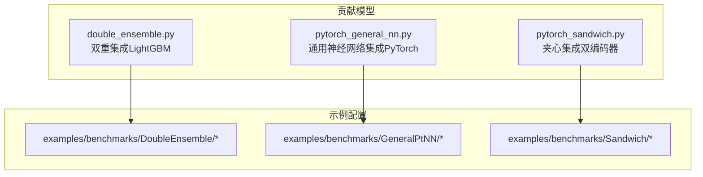
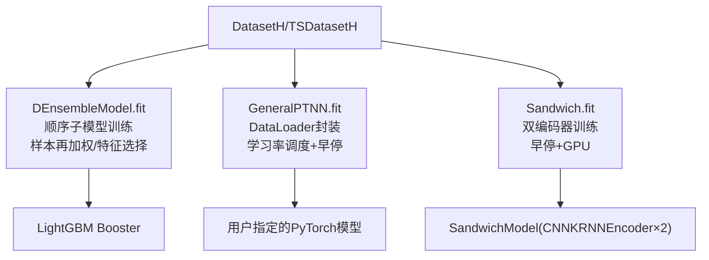
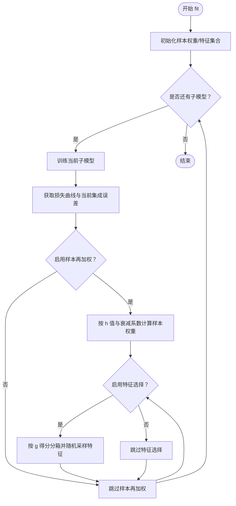
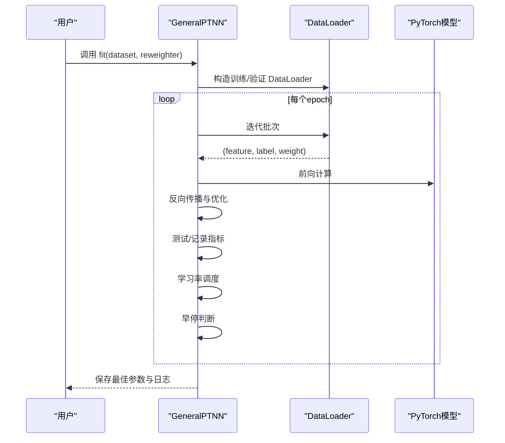
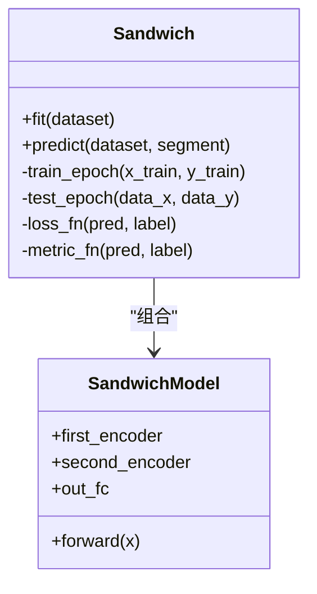
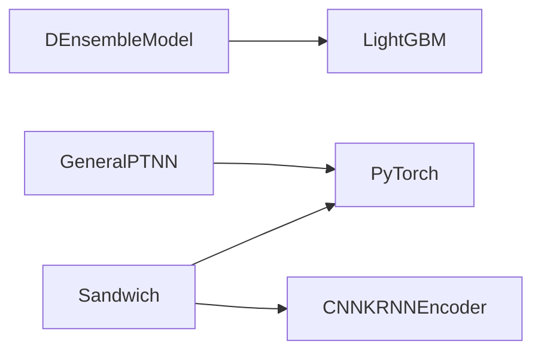

# 集成学习方法

<cite>
**本文引用的文件**
- [double_ensemble.py](file://qlib/contrib/model/double_ensemble.py)
- [pytorch_general_nn.py](file://qlib/contrib/model/pytorch_general_nn.py)
- [pytorch_sandwich.py](file://qlib/contrib/model/pytorch_sandwich.py)
- [README.md（DoubleEnsemble 示例）](file://examples/benchmarks/DoubleEnsemble/README.md)
- [README.md（GeneralPtNN 示例）](file://examples/benchmarks/GeneralPtNN/README.md)
- [README.md（Sandwich 示例）](file://examples/benchmarks/Sandwich/README.md)
</cite>

## 目录
1. [引言](#引言)
2. [项目结构](#项目结构)
3. [核心组件](#核心组件)
4. [架构总览](#架构总览)
5. [详细组件分析](#详细组件分析)
6. [依赖分析](#依赖分析)
7. [性能考量](#性能考量)
8. [故障排查指南](#故障排查指南)
9. [结论](#结论)
10. [附录](#附录)

## 引言
本文件系统性梳理 QLearner 中的三种集成学习策略：DoubleEnsemble、GeneralPtNN 与 Sandwich，并结合仓库中的示例配置与实现代码，给出其原理、数据流、训练流程、早停机制、调试与优化建议。目标是帮助读者在不深入源码的前提下理解这些方法如何提升模型稳定性与预测精度，并掌握在实际任务中进行参数调优与问题定位的方法。

## 项目结构
围绕集成学习的三个模块，主要涉及以下文件与目录：
- 双重集成（DoubleEnsemble）：基于 LightGBM 的两阶段子模型训练与特征/样本再加权，位于贡献模型目录下。
- 通用神经网络集成（GeneralPtNN）：统一的 PyTorch 模型适配器，支持时间序列与表格数据，位于贡献模型目录下。
- 夹心集成（Sandwich）：双编码器结构的时序建模集成，位于贡献模型目录下。

图表来源
- [double_ensemble.py:15-124](file://qlib/contrib/model/double_ensemble.py#L15-L124)
- [pytorch_general_nn.py:33-145](file://qlib/contrib/model/pytorch_general_nn.py#L33-L145)
- [pytorch_sandwich.py:97-225](file://qlib/contrib/model/pytorch_sandwich.py#L97-L225)

章节来源
- [double_ensemble.py:15-124](file://qlib/contrib/model/double_ensemble.py#L15-L124)
- [pytorch_general_nn.py:33-145](file://qlib/contrib/model/pytorch_general_nn.py#L33-L145)
- [pytorch_sandwich.py:97-225](file://qlib/contrib/model/pytorch_sandwich.py#L97-L225)

## 核心组件
- 双重集成（DEnsembleModel）
  - 基于 LightGBM 的多子模型顺序训练，每轮迭代后根据损失曲线与当前集成误差进行样本再加权与特征选择，形成自适应的样本与特征分布。
  - 支持早停回调，避免过拟合。
- 通用神经网络集成（GeneralPTNN）
  - 统一的 PyTorch 训练/评估框架，自动处理时间序列与表格数据的输入切分；内置学习率调度与早停；可注入任意 PyTorch 模型类。
- 夹心集成（Sandwich）
  - 两级编码器（CNN+KRNN）堆叠的时序模型，采用“夹心”结构提取多层次时序特征，支持早停与 GPU 加速。

章节来源
- [double_ensemble.py:15-124](file://qlib/contrib/model/double_ensemble.py#L15-L124)
- [pytorch_general_nn.py:33-145](file://qlib/contrib/model/pytorch_general_nn.py#L33-L145)
- [pytorch_sandwich.py:97-225](file://qlib/contrib/model/pytorch_sandwich.py#L97-L225)

## 架构总览
三者均遵循 QLearner 的 Model 抽象接口，统一的训练/验证/测试流程与日志记录。差异在于：
- DEnsembleModel：两阶段子模型训练 + 样本再加权 + 特征选择 + LightGBM 早停。
- GeneralPTNN：统一的 PyTorch 适配器，支持任意 PyTorch 模型与数据形态。
- Sandwich：双编码器时序模型，两层 KRNN 编码器叠加，线性输出头。

图表来源
- [double_ensemble.py:65-124](file://qlib/contrib/model/double_ensemble.py#L65-L124)
- [pytorch_general_nn.py:235-333](file://qlib/contrib/model/pytorch_general_nn.py#L235-L333)
- [pytorch_sandwich.py:302-358](file://qlib/contrib/model/pytorch_sandwich.py#L302-L358)

## 详细组件分析

### 双重集成（DoubleEnsemble）
- 双重集成架构
  - 子模型顺序训练：按序训练 num_models 个子模型，每个子模型在当前样本权重与特征集上训练。
  - 两阶段改进：
    - 样本再加权（SR）：利用损失曲线与当前集成误差计算样本权重，强调困难样本。
    - 特征选择（FS）：对每个特征做置换评估，基于损失变化的标准化得分进行分箱采样，动态筛选特征。
- 早停机制
  - 使用 LightGBM 的 early_stopping 回调，结合外部早停轮数参数，防止过拟合。
- 预测与权重
  - 对各子模型预测按 sub_weights 加权平均，归一化后输出。

图表来源
- [double_ensemble.py:65-104](file://qlib/contrib/model/double_ensemble.py#L65-L104)
- [double_ensemble.py:140-173](file://qlib/contrib/model/double_ensemble.py#L140-L173)
- [double_ensemble.py:175-219](file://qlib/contrib/model/double_ensemble.py#L175-L219)

章节来源
- [double_ensemble.py:15-124](file://qlib/contrib/model/double_ensemble.py#L15-L124)
- [double_ensemble.py:140-173](file://qlib/contrib/model/double_ensemble.py#L140-L173)
- [double_ensemble.py:175-219](file://qlib/contrib/model/double_ensemble.py#L175-L219)
- [double_ensemble.py:227-245](file://qlib/contrib/model/double_ensemble.py#L227-L245)
- [double_ensemble.py:247-259](file://qlib/contrib/model/double_ensemble.py#L247-L259)

### 通用神经网络集成（GeneralPtNN）
- 通用框架
  - 通过配置注入任意 PyTorch 模型类与参数，统一训练/验证/预测流程。
  - 自动区分时间序列与表格数据的特征/标签切分。
- 训练流程
  - 使用 DataLoader 封装数据，支持重采样权重；训练/验证循环中使用早停与学习率调度。
  - 保存最佳参数与日志。
- 预测
  - 统一返回 Series，索引来自数据集索引。

图表来源
- [pytorch_general_nn.py:235-333](file://qlib/contrib/model/pytorch_general_nn.py#L235-L333)
- [pytorch_general_nn.py:202-233](file://qlib/contrib/model/pytorch_general_nn.py#L202-L233)
- [pytorch_general_nn.py:334-371](file://qlib/contrib/model/pytorch_general_nn.py#L334-L371)

章节来源
- [pytorch_general_nn.py:33-145](file://qlib/contrib/model/pytorch_general_nn.py#L33-L145)
- [pytorch_general_nn.py:174-201](file://qlib/contrib/model/pytorch_general_nn.py#L174-L201)
- [pytorch_general_nn.py:235-333](file://qlib/contrib/model/pytorch_general_nn.py#L235-L333)
- [pytorch_general_nn.py:334-371](file://qlib/contrib/model/pytorch_general_nn.py#L334-L371)

### 夹心集成（Sandwich）
- 结构设计
  - SandwichModel：两级 CNN+KRNN 编码器堆叠，最后一时刻线性映射到标量输出。
- 训练流程
  - 支持早停与 GPU；训练/验证时按批前向、反向与裁剪梯度。
- 预测
  - 分批推理并拼接结果，返回带索引的 Series。

图表来源
- [pytorch_sandwich.py:97-225](file://qlib/contrib/model/pytorch_sandwich.py#L97-L225)
- [pytorch_sandwich.py:25-94](file://qlib/contrib/model/pytorch_sandwich.py#L25-L94)

章节来源
- [pytorch_sandwich.py:97-225](file://qlib/contrib/model/pytorch_sandwich.py#L97-L225)
- [pytorch_sandwich.py:25-94](file://qlib/contrib/model/pytorch_sandwich.py#L25-L94)
- [pytorch_sandwich.py:302-358](file://qlib/contrib/model/pytorch_sandwich.py#L302-L358)
- [pytorch_sandwich.py:360-381](file://qlib/contrib/model/pytorch_sandwich.py#L360-L381)

## 依赖分析
- DEnsembleModel
  - 依赖 LightGBM 训练与早停；依赖特征重要性接口以聚合子模型权重。
- GeneralPTNN
  - 依赖 PyTorch 优化器与学习率调度；依赖数据封装接口以兼容时间序列与表格数据。
- Sandwich
  - 依赖自定义编码器模块构建双编码器结构；依赖 PyTorch 优化器与设备管理。

图表来源
- [double_ensemble.py:105-124](file://qlib/contrib/model/double_ensemble.py#L105-L124)
- [pytorch_general_nn.py:133-143](file://qlib/contrib/model/pytorch_general_nn.py#L133-L143)
- [pytorch_sandwich.py:205-225](file://qlib/contrib/model/pytorch_sandwich.py#L205-L225)

章节来源
- [double_ensemble.py:105-124](file://qlib/contrib/model/double_ensemble.py#L105-L124)
- [pytorch_general_nn.py:133-143](file://qlib/contrib/model/pytorch_general_nn.py#L133-L143)
- [pytorch_sandwich.py:205-225](file://qlib/contrib/model/pytorch_sandwich.py#L205-L225)

## 性能考量
- 训练效率
  - DEnsemble：LightGBM 训练快速，但顺序子模型训练会增加总体时间；可通过减少子模型数量或并行化数据准备降低开销。
  - GeneralPtNN：DataLoader 并行加载与 GPU 训练可显著提速；注意批大小与工作进程数的平衡。
  - Sandwich：双编码器结构参数量较大，建议合理设置层数与隐藏维度，控制显存占用。
- 泛化能力
  - DEnsemble 的样本再加权与特征选择有助于提升对困难样本与噪声特征的鲁棒性。
  - GeneralPtNN 的早停与学习率调度可有效避免过拟合。
  - Sandwich 的双编码器结构适合复杂时序模式，但需谨慎正则化与早停阈值。
- 内存与显存
  - 优先使用 GPU（若可用），并合理设置 batch_size 与 early_stop，避免无效迭代。

## 故障排查指南
- 空数据报错
  - 当数据集为空时会抛出异常，检查数据准备与列集合配置。
- 不支持的数据形状
  - GeneralPtNN 对数据维度有明确要求，确保输入为二维（表格）或三维（时序）。
- 未知损失/指标类型
  - 仅支持特定损失与指标类型，若传入未实现类型会报错。
- 早停未生效
  - 确认早停阈值与验证指标方向一致；对于 Sandwich，验证指标为负损失时需注意比较方向。
- GPU 不可用
  - 若 GPU 设备不可用，代码会回退至 CPU；可在日志中确认设备状态。

章节来源
- [double_ensemble.py:69-70](file://qlib/contrib/model/double_ensemble.py#L69-L70)
- [pytorch_general_nn.py:198-199](file://qlib/contrib/model/pytorch_general_nn.py#L198-L199)
- [pytorch_general_nn.py:161-164](file://qlib/contrib/model/pytorch_general_nn.py#L161-L164)
- [pytorch_general_nn.py:312-325](file://qlib/contrib/model/pytorch_general_nn.py#L312-L325)
- [pytorch_sandwich.py:342-351](file://qlib/contrib/model/pytorch_sandwich.py#L342-L351)

## 结论
- DoubleEnsemble 通过样本再加权与特征选择实现自适应的双重集成，适合对样本难度与特征重要性敏感的任务。
- GeneralPtNN 提供统一的 PyTorch 适配器，便于快速替换与扩展不同神经网络结构，同时保留稳定的训练/评估流程。
- Sandwich 采用双编码器的夹心结构，适合复杂的时序建模任务，需关注参数规模与早停策略。
- 在实践中，应结合任务特性选择合适的基学习器与集成策略，并通过早停、学习率调度与特征/样本再加权等手段提升稳定性与精度。

## 附录
- 示例与配置参考
  - DoubleEnsemble 示例与配置文件位于 examples/benchmarks/DoubleEnsemble 下，包含 Alpha158/Alpha360 等工作流配置。
  - GeneralPtNN 示例展示了 GRU、MLP 等配置切换，体现其通用性与对时间序列/表格数据的适配。
  - Sandwich 示例位于 examples/benchmarks/Sandwich，提供工作流配置以快速复现实验。

章节来源
- [README.md（DoubleEnsemble 示例）:1-20](file://examples/benchmarks/DoubleEnsemble/README.md#L1-L20)
- [README.md（GeneralPtNN 示例）:1-20](file://examples/benchmarks/GeneralPtNN/README.md#L1-L20)
- [README.md（Sandwich 示例）:1-20](file://examples/benchmarks/Sandwich/README.md#L1-L20)