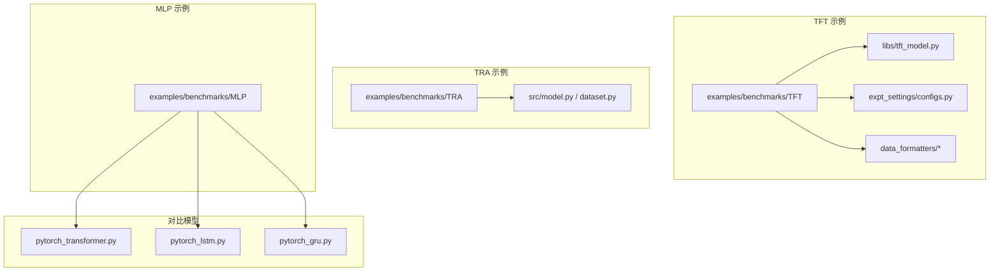
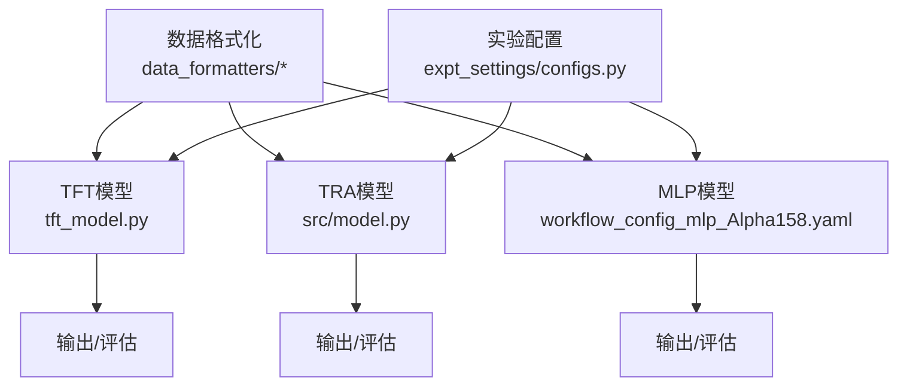
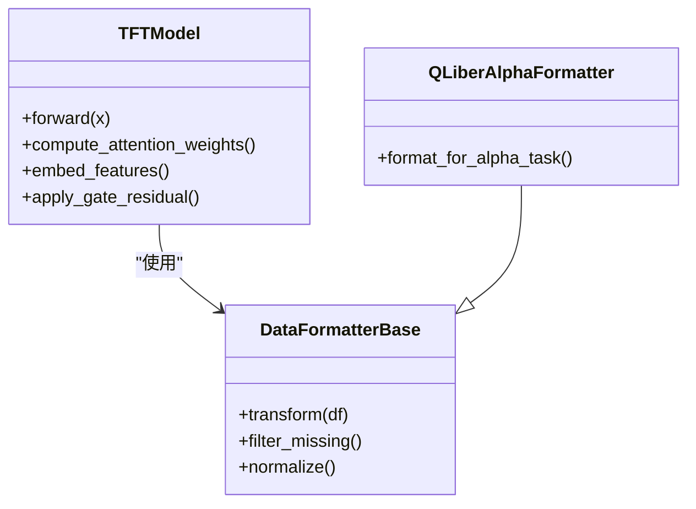
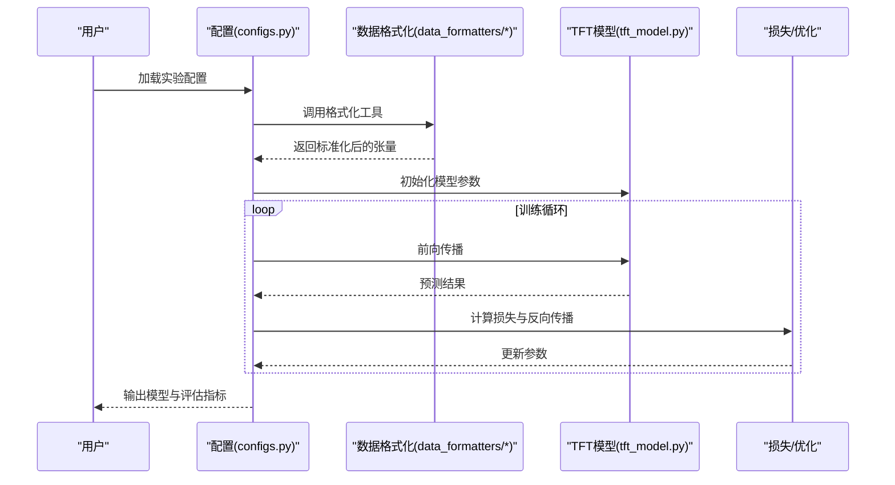
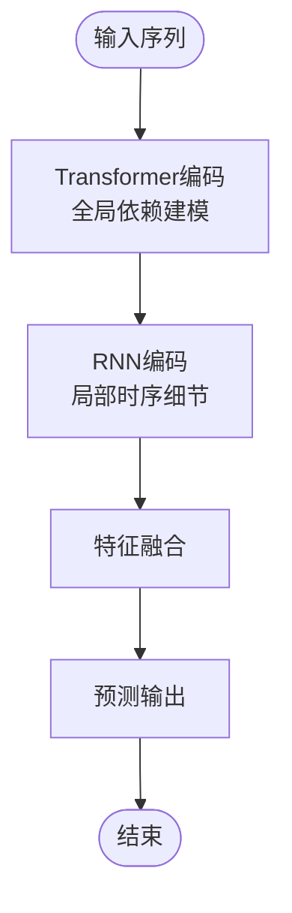
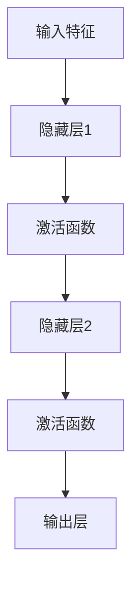
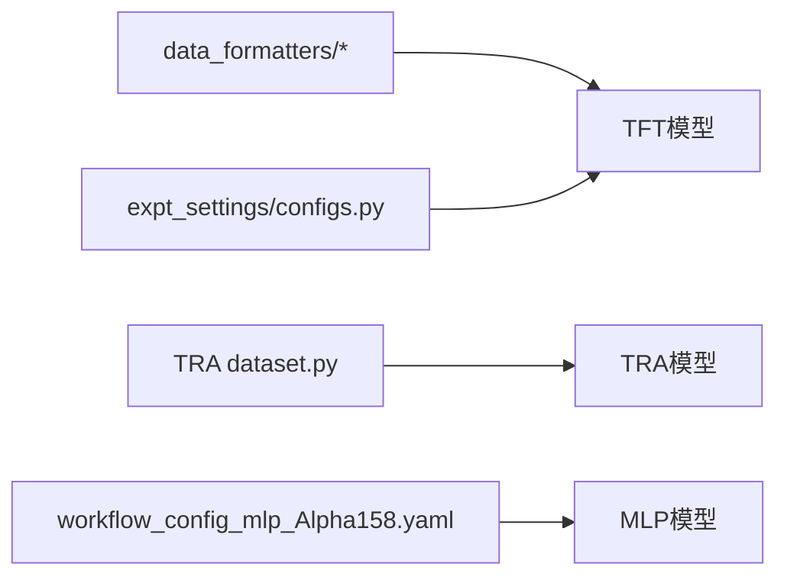

# 高级模型

<cite>
**本文引用的文件**
- [examples/benchmarks/TFT/tft.py](file://examples/benchmarks/TFT/tft.py)
- [examples/benchmarks/TFT/libs/tft_model.py](file://examples/benchmarks/TFT/libs/tft_model.py)
- [examples/benchmarks/TFT/libs/utils.py](file://examples/benchmarks/TFT/libs/utils.py)
- [examples/benchmarks/TFT/expt_settings/configs.py](file://examples/benchmarks/TFT/expt_settings/configs.py)
- [examples/benchmarks/TFT/data_formatters/base.py](file://examples/benchmarks/TFT/data_formatters/base.py)
- [examples/benchmarks/TFT/data_formatters/qlib_Alpha158.py](file://examples/benchmarks/TFT/data_formatters/qlib_Alpha158.py)
- [examples/benchmarks/TRA/src/model.py](file://examples/benchmarks/TRA/src/model.py)
- [examples/benchmarks/TRA/src/dataset.py](file://examples/benchmarks/TRA/src/dataset.py)
- [examples/benchmarks/TRA/example.py](file://examples/benchmarks/TRA/example.py)
- [examples/benchmarks/MLP/workflow_config_mlp_Alpha158.yaml](file://examples/benchmarks/MLP/workflow_config_mlp_Alpha158.yaml)
- [examples/benchmarks/MLP/workflow_config_mlp_Alpha360.yaml](file://examples/benchmarks/MLP/workflow_config_mlp_Alpha360.yaml)
- [examples/benchmarks/Transformer/workflow_config_transformer_Alpha158.yaml](file://examples/benchmarks/Transformer/workflow_config_transformer_Alpha158.yaml)
- [examples/benchmarks/Transformer/workflow_config_transformer_Alpha360.yaml](file://examples/benchmarks/Transformer/workflow_config_transformer_Alpha360.yaml)
- [examples/benchmarks/LSTM/workflow_config_lstm_Alpha158.yaml](file://examples/benchmarks/LSTM/workflow_config_lstm_Alpha158.yaml)
- [examples/benchmarks/LSTM/workflow_config_lstm_Alpha360.yaml](file://examples/benchmarks/LSTM/workflow_config_lstm_Alpha360.yaml)
- [examples/benchmarks/GRU/workflow_config_gru_Alpha158.yaml](file://examples/benchmarks/GRU/workflow_config_gru_Alpha158.yaml)
- [examples/benchmarks/GRU/workflow_config_gru_Alpha360.yaml](file://examples/benchmarks/GRU/workflow_config_gru_Alpha360.yaml)
- [qlib/contrib/model/pytorch_tra.py](file://qlib/contrib/model/pytorch_tra.py)
- [qlib/contrib/model/pytorch_transformer.py](file://qlib/contrib/model/pytorch_transformer.py)
- [qlib/contrib/model/pytorch_lstm.py](file://qlib/contrib/model/pytorch_lstm.py)
- [qlib/contrib/model/pytorch_gru.py](file://qlib/contrib/model/pytorch_gru.py)
- [qlib/contrib/model/pytorch_general_nn.py](file://qlib/contrib/model/pytorch_general_nn.py)
</cite>

## 目录
1. [引言](#引言)
2. [项目结构](#项目结构)
3. [核心组件](#核心组件)
4. [架构总览](#架构总览)
5. [详细组件分析](#详细组件分析)
6. [依赖分析](#依赖分析)
7. [性能考虑](#性能考虑)
8. [故障排查指南](#故障排查指南)
9. [结论](#结论)
10. [附录](#附录)

## 引言
本文件聚焦于QLib生态中“高级模型”的实现与应用，重点覆盖以下内容：
- TFT（Temporal Fusion Transformer）：时序融合变换器的特征嵌入、门控机制与可解释性设计
- TRA（Transformer-RNN混合）：Transformer与RNN的混合架构与注意力机制
- MLP（多层感知机）：多层感知机实现与非线性特征映射
同时给出配置示例、训练策略（序列长度、注意力头数、学习率调度）、多变量时间序列与异构特征融合方法，并提供性能对比与适用场景建议。

## 项目结构
围绕高级模型的相关代码主要分布在以下位置：
- TFT基准示例：examples/benchmarks/TFT
- TRA基准示例：examples/benchmarks/TRA
- MLP基准示例：examples/benchmarks/MLP
- 其他对比模型（Transformer/LSTM/GRU）：examples/benchmarks/Transformer、LSTM、GRU
- Qlib贡献模型实现：qlib/contrib/model 下的对应PyTorch实现

图示来源
- [examples/benchmarks/TFT/tft.py](file://examples/benchmarks/TFT/tft.py)
- [examples/benchmarks/TFT/libs/tft_model.py](file://examples/benchmarks/TFT/libs/tft_model.py)
- [examples/benchmarks/TFT/expt_settings/configs.py](file://examples/benchmarks/TFT/expt_settings/configs.py)
- [examples/benchmarks/TFT/data_formatters/base.py](file://examples/benchmarks/TFT/data_formatters/base.py)
- [examples/benchmarks/TRA/src/model.py](file://examples/benchmarks/TRA/src/model.py)
- [examples/benchmarks/TRA/src/dataset.py](file://examples/benchmarks/TRA/src/dataset.py)
- [examples/benchmarks/MLP/workflow_config_mlp_Alpha158.yaml](file://examples/benchmarks/MLP/workflow_config_mlp_Alpha158.yaml)
- [qlib/contrib/model/pytorch_transformer.py](file://qlib/contrib/model/pytorch_transformer.py)
- [qlib/contrib/model/pytorch_lstm.py](file://qlib/contrib/model/pytorch_lstm.py)
- [qlib/contrib/model/pytorch_gru.py](file://qlib/contrib/model/pytorch_gru.py)

章节来源
- [examples/benchmarks/TFT/tft.py](file://examples/benchmarks/TFT/tft.py)
- [examples/benchmarks/TRA/example.py](file://examples/benchmarks/TRA/example.py)
- [examples/benchmarks/MLP/workflow_config_mlp_Alpha158.yaml](file://examples/benchmarks/MLP/workflow_config_mlp_Alpha158.yaml)

## 核心组件
- TFT（Temporal Fusion Transformer）
  - 特征嵌入：对分类与数值特征进行嵌入，支持静态/动态特征分离
  - 门控机制：在编码器/解码器侧采用门控残差连接，提升长期依赖建模能力
  - 可解释性设计：注意力权重与加权聚合，便于分析时间维度与变量维度的重要性
  - 数据格式化：提供针对Alpha任务的数据格式化工具
- TRA（Transformer-RNN混合）
  - 混合架构：Transformer提取全局依赖，RNN捕捉局部时序细节
  - 注意力机制：自注意力与门控循环单元结合，增强序列建模能力
- MLP（多层感知机）
  - 多层感知机实现：通过堆叠非线性层实现复杂非线性映射
  - 配置灵活：可通过工作流配置调整层数、激活函数与正则化

章节来源
- [examples/benchmarks/TFT/libs/tft_model.py](file://examples/benchmarks/TFT/libs/tft_model.py)
- [examples/benchmarks/TFT/data_formatters/base.py](file://examples/benchmarks/TFT/data_formatters/base.py)
- [examples/benchmarks/TRA/src/model.py](file://examples/benchmarks/TRA/src/model.py)
- [examples/benchmarks/MLP/workflow_config_mlp_Alpha158.yaml](file://examples/benchmarks/MLP/workflow_config_mlp_Alpha158.yaml)

## 架构总览
下图展示了TFT、TRA与MLP在QLib中的典型数据流与模块关系：

图示来源
- [examples/benchmarks/TFT/libs/tft_model.py](file://examples/benchmarks/TFT/libs/tft_model.py)
- [examples/benchmarks/TFT/expt_settings/configs.py](file://examples/benchmarks/TFT/expt_settings/configs.py)
- [examples/benchmarks/TFT/data_formatters/base.py](file://examples/benchmarks/TFT/data_formatters/base.py)
- [examples/benchmarks/TRA/src/model.py](file://examples/benchmarks/TRA/src/model.py)
- [examples/benchmarks/MLP/workflow_config_mlp_Alpha158.yaml](file://examples/benchmarks/MLP/workflow_config_mlp_Alpha158.yaml)

## 详细组件分析

### TFT 组件分析
TFT是面向时间序列预测的Transformer扩展，强调可解释性与时序融合。其关键点包括：
- 特征嵌入
  - 对类别与连续特征分别进行嵌入，支持静态/动态特征分离，便于建模跨时间不变与变化特征
- 门控机制
  - 在编码器与解码器中引入门控残差连接，缓解梯度消失并提升长期依赖建模
- 可解释性设计
  - 通过注意力权重与加权聚合，提供时间步与变量维度的可解释性分析
- 数据格式化
  - 提供针对Alpha任务的数据格式化工具，统一输入输出结构

图示来源
- [examples/benchmarks/TFT/libs/tft_model.py](file://examples/benchmarks/TFT/libs/tft_model.py)
- [examples/benchmarks/TFT/data_formatters/base.py](file://examples/benchmarks/TFT/data_formatters/base.py)
- [examples/benchmarks/TFT/data_formatters/qlib_Alpha158.py](file://examples/benchmarks/TFT/data_formatters/qlib_Alpha158.py)

训练流程（TFT）

图示来源
- [examples/benchmarks/TFT/expt_settings/configs.py](file://examples/benchmarks/TFT/expt_settings/configs.py)
- [examples/benchmarks/TFT/data_formatters/base.py](file://examples/benchmarks/TFT/data_formatters/base.py)
- [examples/benchmarks/TFT/libs/tft_model.py](file://examples/benchmarks/TFT/libs/tft_model.py)

章节来源
- [examples/benchmarks/TFT/libs/tft_model.py](file://examples/benchmarks/TFT/libs/tft_model.py)
- [examples/benchmarks/TFT/data_formatters/base.py](file://examples/benchmarks/TFT/data_formatters/base.py)
- [examples/benchmarks/TFT/data_formatters/qlib_Alpha158.py](file://examples/benchmarks/TFT/data_formatters/qlib_Alpha158.py)
- [examples/benchmarks/TFT/expt_settings/configs.py](file://examples/benchmarks/TFT/expt_settings/configs.py)

### TRA 组件分析
TRA将Transformer与RNN混合，以捕捉全局依赖与局部时序细节：
- 混合架构
  - Transformer部分负责长程依赖与跨变量交互；RNN部分保留对时序局部模式的记忆能力
- 注意力机制
  - 自注意力与门控循环单元协同，提升序列建模稳定性与表达力
- 数据集与示例
  - 提供数据集封装与示例脚本，便于快速上手

图示来源
- [examples/benchmarks/TRA/src/model.py](file://examples/benchmarks/TRA/src/model.py)
- [examples/benchmarks/TRA/src/dataset.py](file://examples/benchmarks/TRA/src/dataset.py)
- [examples/benchmarks/TRA/example.py](file://examples/benchmarks/TRA/example.py)

章节来源
- [examples/benchmarks/TRA/src/model.py](file://examples/benchmarks/TRA/src/model.py)
- [examples/benchmarks/TRA/src/dataset.py](file://examples/benchmarks/TRA/src/dataset.py)
- [examples/benchmarks/TRA/example.py](file://examples/benchmarks/TRA/example.py)

### MLP 组件分析
MLP作为非线性映射的基础模型，在多变量时间序列预测中常用于特征变换与回归：
- 多层感知机实现
  - 通过堆叠非线性层实现复杂非线性映射，适合处理异构特征融合
- 工作流配置
  - 通过YAML配置文件定义网络结构、激活函数、正则化与优化策略

图示来源
- [examples/benchmarks/MLP/workflow_config_mlp_Alpha158.yaml](file://examples/benchmarks/MLP/workflow_config_mlp_Alpha158.yaml)
- [examples/benchmarks/MLP/workflow_config_mlp_Alpha360.yaml](file://examples/benchmarks/MLP/workflow_config_mlp_Alpha360.yaml)

章节来源
- [examples/benchmarks/MLP/workflow_config_mlp_Alpha158.yaml](file://examples/benchmarks/MLP/workflow_config_mlp_Alpha158.yaml)
- [examples/benchmarks/MLP/workflow_config_mlp_Alpha360.yaml](file://examples/benchmarks/MLP/workflow_config_mlp_Alpha360.yaml)

## 依赖分析
- TFT
  - 依赖数据格式化模块进行输入预处理
  - 通过实验配置文件组织超参数与训练流程
- TRA
  - 依赖数据集封装与模型实现
  - 示例脚本演示运行方式
- MLP
  - 依赖工作流配置文件定义模型结构与训练策略

图示来源
- [examples/benchmarks/TFT/data_formatters/base.py](file://examples/benchmarks/TFT/data_formatters/base.py)
- [examples/benchmarks/TFT/expt_settings/configs.py](file://examples/benchmarks/TFT/expt_settings/configs.py)
- [examples/benchmarks/TRA/src/dataset.py](file://examples/benchmarks/TRA/src/dataset.py)
- [examples/benchmarks/MLP/workflow_config_mlp_Alpha158.yaml](file://examples/benchmarks/MLP/workflow_config_mlp_Alpha158.yaml)

章节来源
- [examples/benchmarks/TFT/data_formatters/base.py](file://examples/benchmarks/TFT/data_formatters/base.py)
- [examples/benchmarks/TFT/expt_settings/configs.py](file://examples/benchmarks/TFT/expt_settings/configs.py)
- [examples/benchmarks/TRA/src/dataset.py](file://examples/benchmarks/TRA/src/dataset.py)
- [examples/benchmarks/MLP/workflow_config_mlp_Alpha158.yaml](file://examples/benchmarks/MLP/workflow_config_mlp_Alpha158.yaml)

## 性能考虑
- 序列长度设置
  - TFT：较长序列有利于捕捉长期依赖，但需注意计算与显存开销；可结合滑动窗口策略
  - TRA：Transformer部分对长序列更敏感，建议先试验较短序列验证稳定性
  - MLP：对序列长度相对不敏感，但需关注特征维度与层数
- 注意力头数配置
  - TFT/TRA：头数增加可提升并行建模能力，但会显著增加计算与内存消耗；建议从较小头数开始网格搜索
- 学习率调度
  - 建议使用Warmup+余弦退火或分段阶梯衰减，结合早停防止过拟合
- 异构特征融合
  - 使用嵌入层统一类别特征表示，连续特征归一化；在融合前进行特征选择与降维
- 批大小与设备
  - 根据显存上限调整批大小；分布式训练可加速收敛

## 故障排查指南
- 数据格式问题
  - 确认数据格式化步骤是否正确执行，缺失值与异常值是否被过滤或填充
- 模型收敛问题
  - 检查学习率是否过大或过小；核对损失函数与优化器配置
- 内存溢出
  - 减小序列长度或批大小；降低注意力头数；使用梯度累积
- 可解释性分析
  - 检查注意力权重计算与保存逻辑，确保输出路径与可视化工具可用

章节来源
- [examples/benchmarks/TFT/libs/utils.py](file://examples/benchmarks/TFT/libs/utils.py)
- [examples/benchmarks/TFT/data_formatters/base.py](file://examples/benchmarks/TFT/data_formatters/base.py)

## 结论
- TFT在可解释性与时序融合方面具有优势，适合需要分析时间与变量重要性的场景
- TRA通过混合架构兼顾全局与局部建模，适用于复杂时序依赖
- MLP作为基线模型，适合探索非线性映射与异构特征融合
- 实践中应结合任务特性与资源约束，合理设置序列长度、注意力头数与学习率调度，并通过工作流配置快速迭代

## 附录
- 配置示例与训练策略
  - TFT：参考实验配置文件与数据格式化工具
  - TRA：参考模型与数据集封装及示例脚本
  - MLP：参考工作流配置文件
- 对比模型
  - Transformer/LSTM/GRU：可作为基线模型进行性能对比

章节来源
- [examples/benchmarks/TFT/expt_settings/configs.py](file://examples/benchmarks/TFT/expt_settings/configs.py)
- [examples/benchmarks/TRA/example.py](file://examples/benchmarks/TRA/example.py)
- [examples/benchmarks/MLP/workflow_config_mlp_Alpha158.yaml](file://examples/benchmarks/MLP/workflow_config_mlp_Alpha158.yaml)
- [examples/benchmarks/Transformer/workflow_config_transformer_Alpha158.yaml](file://examples/benchmarks/Transformer/workflow_config_transformer_Alpha158.yaml)
- [examples/benchmarks/LSTM/workflow_config_lstm_Alpha158.yaml](file://examples/benchmarks/LSTM/workflow_config_lstm_Alpha158.yaml)
- [examples/benchmarks/GRU/workflow_config_gru_Alpha158.yaml](file://examples/benchmarks/GRU/workflow_config_gru_Alpha158.yaml)