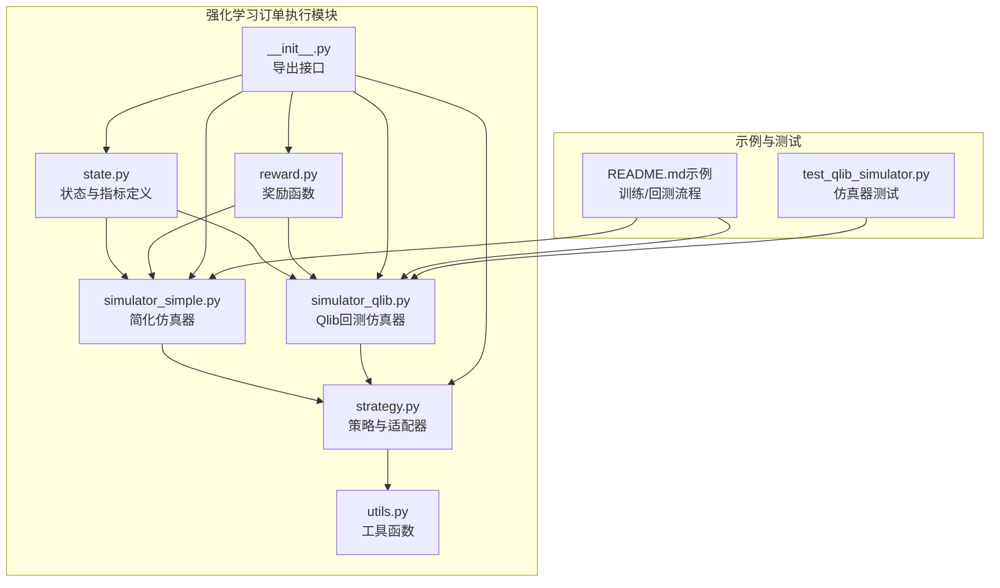
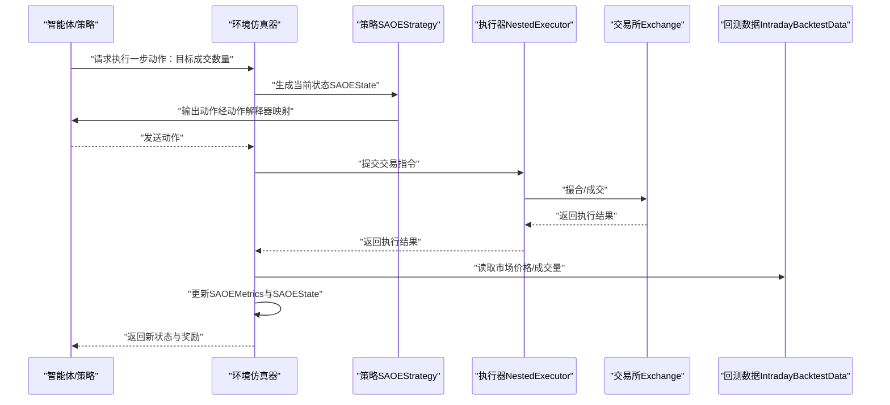
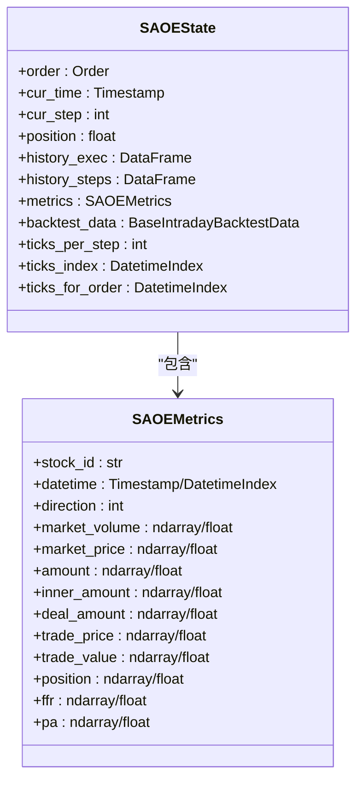
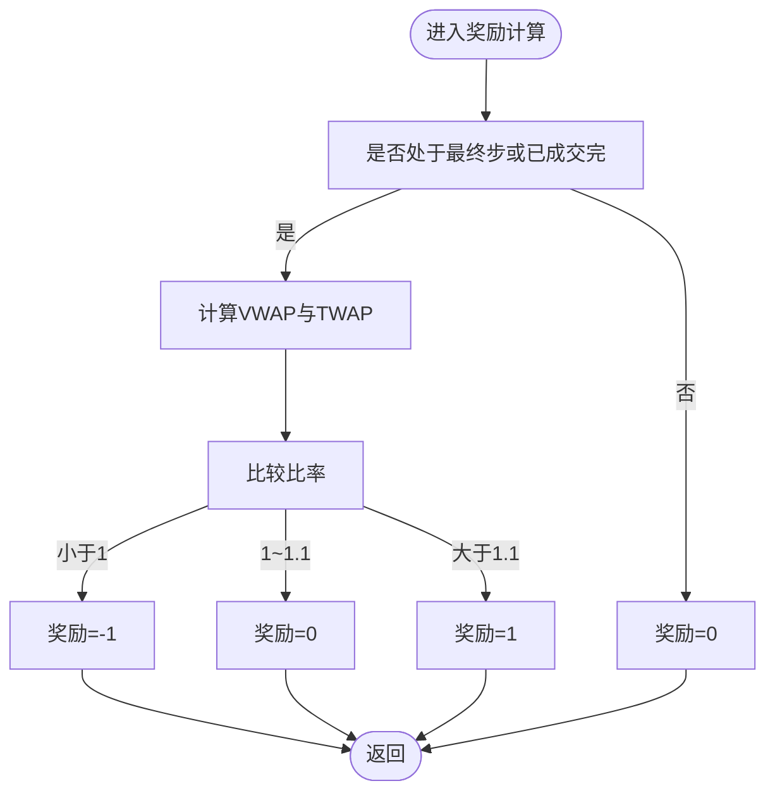
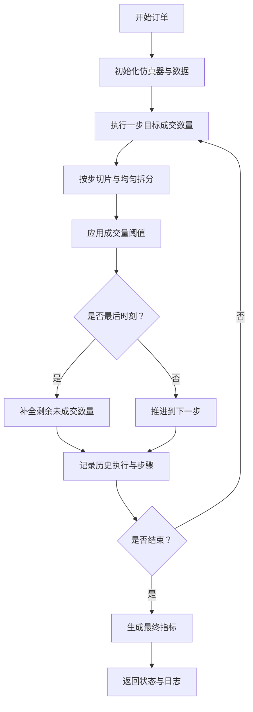
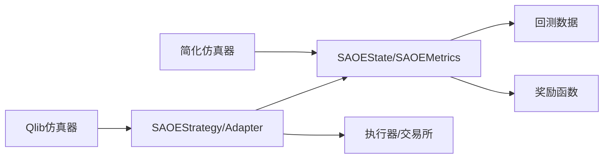

# 交易环境建模

<cite>
**本文引用的文件**
- [state.py](file://qlib/rl/order_execution/state.py)
- [reward.py](file://qlib/rl/order_execution/reward.py)
- [simulator_qlib.py](file://qlib/rl/order_execution/simulator_qlib.py)
- [simulator_simple.py](file://qlib/rl/order_execution/simulator_simple.py)
- [strategy.py](file://qlib/rl/order_execution/strategy.py)
- [utils.py](file://qlib/rl/order_execution/utils.py)
- [__init__.py](file://qlib/rl/order_execution/__init__.py)
- [README.md（示例）](file://examples/rl_order_execution/README.md)
- [test_qlib_simulator.py](file://tests/rl/test_qlib_simulator.py)
</cite>

## 目录
1. [引言](#引言)
2. [项目结构](#项目结构)
3. [核心组件](#核心组件)
4. [架构总览](#架构总览)
5. [详细组件分析](#详细组件分析)
6. [依赖分析](#依赖分析)
7. [性能考虑](#性能考虑)
8. [故障排查指南](#故障排查指南)
9. [结论](#结论)
10. [附录](#附录)

## 引言
本文件系统化梳理 Qlib 中面向强化学习的订单执行环境建模，围绕状态空间设计、动作空间定义与奖励函数构建展开；同时深入解释市场微观结构建模（价格动态、流动性变化、市场冲击成本）、状态特征提取方法（价格序列、成交量、订单簿信息等），并给出环境仿真器的实现细节（交易模拟、滑点建模、执行质量评估）。最后提供环境参数调优与性能测试方法，帮助读者在实际训练与回测中高效落地。

## 项目结构
本专题涉及的代码主要位于 qlib/rl/order_execution 子模块，并配套 examples/rl_order_execution 的训练与回测配置示例。核心文件包括状态定义、奖励函数、两类仿真器（简化版与基于 Qlib 回测工具链的实现）、策略适配器与工具函数。

图表来源
- [state.py:70-102](file://qlib/rl/order_execution/state.py#L70-L102)
- [reward.py:17-100](file://qlib/rl/order_execution/reward.py#L17-L100)
- [simulator_simple.py:24-363](file://qlib/rl/order_execution/simulator_simple.py#L24-L363)
- [simulator_qlib.py:19-142](file://qlib/rl/order_execution/simulator_qlib.py#L19-L142)
- [strategy.py:71-552](file://qlib/rl/order_execution/strategy.py#L71-L552)
- [utils.py:16-53](file://qlib/rl/order_execution/utils.py#L16-L53)
- [__init__.py:9-39](file://qlib/rl/order_execution/__init__.py#L9-L39)
- [README.md（示例）:1-101](file://examples/rl_order_execution/README.md#L1-L101)
- [test_qlib_simulator.py](file://tests/rl/test_qlib_simulator.py)

章节来源
- [state.py:1-102](file://qlib/rl/order_execution/state.py#L1-L102)
- [reward.py:1-100](file://qlib/rl/order_execution/reward.py#L1-L100)
- [simulator_simple.py:1-363](file://qlib/rl/order_execution/simulator_simple.py#L1-L363)
- [simulator_qlib.py:1-142](file://qlib/rl/order_execution/simulator_qlib.py#L1-L142)
- [strategy.py:1-552](file://qlib/rl/order_execution/strategy.py#L1-L552)
- [utils.py:1-53](file://qlib/rl/order_execution/utils.py#L1-L53)
- [__init__.py:1-39](file://qlib/rl/order_execution/__init__.py#L1-L39)
- [README.md（示例）:1-101](file://examples/rl_order_execution/README.md#L1-L101)
- [test_qlib_simulator.py](file://tests/rl/test_qlib_simulator.py)

## 核心组件
- 状态与指标：SAOEState 与 SAOEMetrics 定义了单资产订单执行的时序状态与累计指标，覆盖时间索引、剩余未成交数量、历史执行与步骤记录、基准价格（TWAP）以及价格优势（PA）等。
- 奖励函数：提供基于价格优势惩罚（PAPenaltyReward）与论文奖励（PPOReward）两种形式，用于引导策略在执行质量与时间分布之间取得平衡。
- 仿真器：
  - 简化仿真器（SingleAssetOrderExecutionSimple）：以“tick”为粒度的离散交易模拟，支持按步拆分交易量、最大成交量阈值限制、最后时刻补全等机制。
  - Qlib 回测仿真器（SingleAssetOrderExecution）：基于 Qlib 回测工具链，通过策略-执行器-交易所流水线生成状态与决策。
- 策略与适配器：SAOEStateAdapter 负责从执行结果与市场数据中更新状态与指标；SAOEStrategy/SAOEIntStrategy 将策略与状态解释器/动作解释器结合，生成交易决策。
- 工具函数：提供 DataFrame 追加、价格优势计算、执行器类型解析等通用能力。

章节来源
- [state.py:18-102](file://qlib/rl/order_execution/state.py#L18-L102)
- [reward.py:17-100](file://qlib/rl/order_execution/reward.py#L17-L100)
- [simulator_simple.py:24-363](file://qlib/rl/order_execution/simulator_simple.py#L24-L363)
- [simulator_qlib.py:19-142](file://qlib/rl/order_execution/simulator_qlib.py#L19-L142)
- [strategy.py:71-552](file://qlib/rl/order_execution/strategy.py#L71-L552)
- [utils.py:16-53](file://qlib/rl/order_execution/utils.py#L16-L53)

## 架构总览
下图展示从订单到状态、再到策略决策与执行的整体流程，以及两类仿真器的差异：

图表来源
- [simulator_qlib.py:107-142](file://qlib/rl/order_execution/simulator_qlib.py#L107-L142)
- [strategy.py:301-552](file://qlib/rl/order_execution/strategy.py#L301-L552)
- [state.py:70-102](file://qlib/rl/order_execution/state.py#L70-L102)

## 详细组件分析

### 状态空间设计（SAOEState 与 SAOEMetrics）
- 关键字段
  - 订单与时间：当前时间、步数、剩余未成交数量、可用交易时间索引。
  - 历史记录：每刻执行明细（history_exec）与每步聚合（history_steps）。
  - 指标：基准价格（TWAP）、价格优势（PA，单位 BP）、完成比例（FFR）、成交均价、成交额等。
  - 数据源：回测数据对象，包含当日时间索引与订单可用时段索引。
- 设计要点
  - 向量化指标：部分指标支持向量化，便于批处理与高效计算。
  - 避免未来信息泄露：注释明确提醒使用回测数据时需谨慎避免泄漏未来数据。
  - 可扩展性：状态可包含任意解释器所需的上下文特征。

图表来源
- [state.py:18-102](file://qlib/rl/order_execution/state.py#L18-L102)

章节来源
- [state.py:18-102](file://qlib/rl/order_execution/state.py#L18-L102)

### 动作空间定义与解释器
- 动作含义：在每步中，动作表示希望成交的数量（或比例）。简化仿真器直接接受该数值；Qlib 仿真器通过策略与动作解释器将其转换为具体订单。
- 解释器角色：将策略输出的动作映射为实际可执行的交易量，支持分类动作、相对 TWAP 的动作等不同解释器。
- 示例接口导出：模块导出多种解释器与策略，便于在配置中灵活组合。

章节来源
- [__init__.py:9-39](file://qlib/rl/order_execution/__init__.py#L9-L39)
- [strategy.py:445-552](file://qlib/rl/order_execution/strategy.py#L445-L552)

### 奖励函数构建（PAPenaltyReward 与 PPOReward）
- PAPenaltyReward
  - 目标：鼓励更高的价格优势（PA），同时惩罚在极短时间内集中执行导致的不利影响。
  - 形式：每步奖励由“当期 PA 加权收益”减去“按步内各时刻成交量平方和的惩罚项”组成，支持缩放系数。
  - 数学表达：参见源码注释中的公式描述。
- PPOReward
  - 来源于论文的奖励设计：在最终步或已全部成交时，比较 VWAP 与 TWAP 的比率，按区间给定奖励或惩罚，否则为零。
  - 参数：最大步数、允许交易起止时间索引，用于控制时间窗口与终止条件。

图表来源
- [reward.py:53-100](file://qlib/rl/order_execution/reward.py#L53-L100)

章节来源
- [reward.py:17-100](file://qlib/rl/order_execution/reward.py#L17-L100)

### 市场微观结构建模
- 价格动态：通过回测数据读取逐时刻成交价（deal_price），用于计算 VWAP/TWAP 与价格优势。
- 流动性变化：通过逐时刻成交量（volume）反映市场流动性，简化仿真器支持按市场成交量比例设置最大执行量阈值。
- 市场冲击成本：通过“最后时刻补全”与“阈值约束”近似模拟冲击成本与流动性摩擦；在 Qlib 仿真器中，真实成交由交易所与执行器决定，更贴近现实。

章节来源
- [simulator_simple.py:269-294](file://qlib/rl/order_execution/simulator_simple.py#L269-L294)
- [strategy.py:149-169](file://qlib/rl/order_execution/strategy.py#L149-L169)

### 状态特征提取方法
- 时间序列特征：价格序列（开盘/最高/最低/收盘）、成交量序列、时间索引切片。
- 订单簿信息：通过回测数据与交易所接口读取买卖盘口数据（若数据可用），用于进一步扩展状态维度。
- 指标特征：TWAP、PA、FFR、成交均价、成交额等，作为强化学习的观测输入。
- 特征工程建议：对缺失值进行填充（如中位数），对向量化的指标进行归一化或标准化，确保与网络输入空间匹配。

章节来源
- [strategy.py:51-69](file://qlib/rl/order_execution/strategy.py#L51-L69)
- [utils.py:25-46](file://qlib/rl/order_execution/utils.py#L25-L46)

### 环境仿真器实现细节
- 简化仿真器（SingleAssetOrderExecutionSimple）
  - 步进逻辑：按步长切片时间窗口，将目标成交数量均匀分配至每个 tick，再受市场成交量阈值限制；在最后时刻确保全部成交。
  - 指标收集：逐 tick 记录市场价/成交量，计算成交均价、PA、FFR 等；每步聚合生成历史步骤记录。
  - 输出状态：封装为 SAOEState，供策略解释器使用。
- Qlib 回测仿真器（SingleAssetOrderExecution）
  - 初始化：基于配置初始化策略与执行器，启动数据采集循环。
  - 执行流程：通过生成器推进到下一个 SAOEStrategy，读取执行结果并更新状态。
  - 终止条件：执行器标记完成或剩余未成交数量为零。

图表来源
- [simulator_simple.py:147-247](file://qlib/rl/order_execution/simulator_simple.py#L147-L247)
- [simulator_simple.py:269-327](file://qlib/rl/order_execution/simulator_simple.py#L269-L327)

章节来源
- [simulator_simple.py:24-363](file://qlib/rl/order_execution/simulator_simple.py#L24-L363)
- [simulator_qlib.py:19-142](file://qlib/rl/order_execution/simulator_qlib.py#L19-L142)

### 交易模拟、滑点建模与执行质量评估
- 交易模拟：简化仿真器以固定步长与均匀拆分模拟交易；Qlib 仿真器通过执行器与交易所真实撮合，更贴近现实。
- 滑点建模：通过“最后时刻补全”与“阈值约束”近似滑点与流动性摩擦；也可引入随机噪声或非线性冲击模型扩展。
- 执行质量评估：以 PA（价格优势，BP）为主要指标，辅以 VWAP/TWAP 比率、完成比例（FFR）、最大集中执行惩罚等。

章节来源
- [simulator_simple.py:269-294](file://qlib/rl/order_execution/simulator_simple.py#L269-L294)
- [reward.py:17-51](file://qlib/rl/order_execution/reward.py#L17-L51)

### 环境参数调优与性能测试方法
- 参数清单
  - 步长（ticks_per_step）：控制每步的时间跨度，影响策略的决策频率与平滑程度。
  - 成交量阈值（vol_threshold）：按市场成交量比例限制每步最大成交，模拟流动性约束。
  - 奖励缩放（scale）与惩罚系数（penalty）：调节奖励强度与时间集中的惩罚力度。
  - 最大步数（max_step）与交易时间窗：控制回测终止条件与有效交易时段。
- 调优流程
  - 先用简化仿真器快速迭代（训练效率高），再用 Qlib 仿真器进行真实约束下的回测验证。
  - 使用示例 README 中的配置文件组织训练与回测任务，对比不同策略（PPO、OPDS、TWAP）的 PA 均值与方差。
- 性能测试
  - 多轮次平均：在示例 README 中建议选择验证集上表现最优的若干检查点进行测试，统计 PA 的均值与标准差。
  - 对比基线：TWAP 作为弱基线，理想 PA 接近 0，实际可能因离散化与截断略有偏差。

章节来源
- [README.md（示例）:34-101](file://examples/rl_order_execution/README.md#L34-L101)
- [simulator_simple.py:78-98](file://qlib/rl/order_execution/simulator_simple.py#L78-L98)
- [reward.py:29-31](file://qlib/rl/order_execution/reward.py#L29-L31)

## 依赖分析
- 组件耦合
  - 仿真器与策略：简化仿真器直接维护状态与指标；Qlib 仿真器通过策略适配器与执行器流水线更新状态。
  - 状态与数据：SAOEState 依赖回测数据对象，提供时间索引与价格/成交量序列。
  - 奖励与状态：奖励函数依赖 SAOEState 的历史步骤与历史执行记录，计算 PA 与惩罚项。
- 外部依赖
  - Qlib 回测工具链：策略、执行器、交易所接口。
  - 第三方 RL 库：策略与解释器依赖 tianshou 等框架的接口。

图表来源
- [simulator_simple.py:24-363](file://qlib/rl/order_execution/simulator_simple.py#L24-L363)
- [simulator_qlib.py:19-142](file://qlib/rl/order_execution/simulator_qlib.py#L19-L142)
- [strategy.py:71-552](file://qlib/rl/order_execution/strategy.py#L71-L552)
- [state.py:70-102](file://qlib/rl/order_execution/state.py#L70-L102)
- [reward.py:17-100](file://qlib/rl/order_execution/reward.py#L17-L100)

章节来源
- [simulator_simple.py:24-363](file://qlib/rl/order_execution/simulator_simple.py#L24-L363)
- [simulator_qlib.py:19-142](file://qlib/rl/order_execution/simulator_qlib.py#L19-L142)
- [strategy.py:71-552](file://qlib/rl/order_execution/strategy.py#L71-L552)
- [state.py:70-102](file://qlib/rl/order_execution/state.py#L70-L102)
- [reward.py:17-100](file://qlib/rl/order_execution/reward.py#L17-L100)

## 性能考虑
- 计算复杂度
  - 状态更新：每步涉及向量化平均、权重计算与指标拼接，整体复杂度与步长成线性关系。
  - 指标向量化：SAOEMetrics 支持向量化，可显著提升批处理效率。
- 内存占用
  - 历史记录 DataFrame：随步数增长而增大，注意及时清理或分段存储。
- 实时性
  - 简化仿真器更适合在线训练；Qlib 仿真器更适用于离线回测与真实约束验证。

## 故障排查指南
- 奖励异常
  - 现象：NaN 或无穷大奖励。
  - 排查：确认 PA 计算与惩罚项的输入范围，检查成交量与价格序列是否存在异常。
- 执行量越界
  - 现象：执行量超过剩余未成交数量或出现负值。
  - 排查：检查“最后时刻补全”与阈值约束逻辑，确保累积执行量不超过 position。
- 数据不一致
  - 现象：时间索引切片或市场数据缺失导致形状不匹配。
  - 排查：使用工具函数对缺失值进行填充，确保价格/成交量与执行量长度一致。
- 回测与训练差异
  - 现象：训练与回测结果不一致。
  - 排查：确认是否使用相同仿真器；必要时仅运行回测阶段以消除仿真器差异。

章节来源
- [reward.py:45-50](file://qlib/rl/order_execution/reward.py#L45-L50)
- [simulator_simple.py:168-169](file://qlib/rl/order_execution/simulator_simple.py#L168-L169)
- [utils.py:52-53](file://qlib/rl/order_execution/utils.py#L52-L53)
- [README.md（示例）:62-77](file://examples/rl_order_execution/README.md#L62-L77)

## 结论
本文系统梳理了 Qlib 强化学习订单执行环境的建模方法，明确了状态空间、动作空间与奖励函数的设计思路，并结合两类仿真器展示了市场微观结构的建模路径。通过合理的参数调优与严格的性能测试，可在保证训练效率的同时，获得贴近现实的回测结果，为后续策略优化奠定基础。

## 附录
- 示例工作流
  - 获取数据与生成 pickle 数据后，分别运行训练与回测配置，查看输出目录中的指标与日志。
- 测试参考
  - 使用仿真器测试脚本验证 Qlib 仿真器的正确性与稳定性。

章节来源
- [README.md（示例）:1-101](file://examples/rl_order_execution/README.md#L1-L101)
- [test_qlib_simulator.py](file://tests/rl/test_qlib_simulator.py)