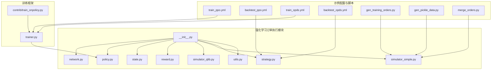
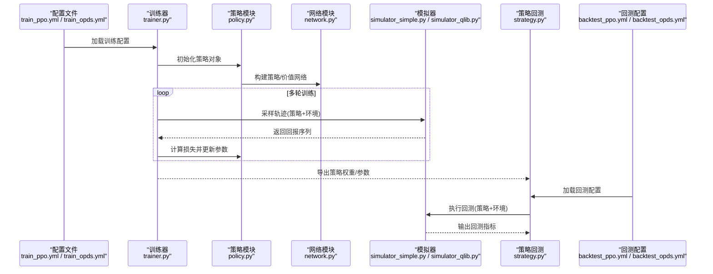
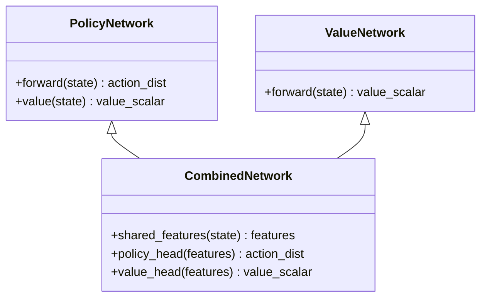
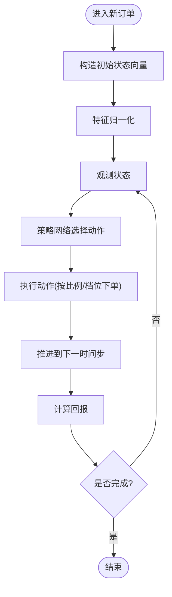
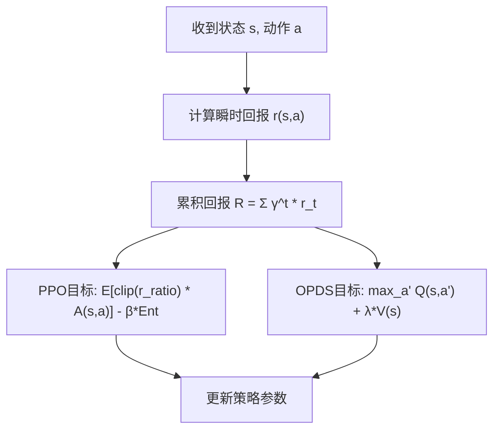
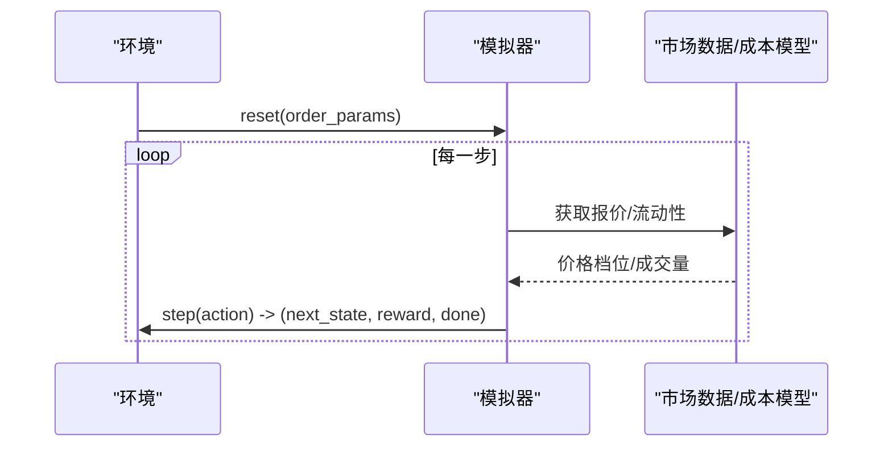
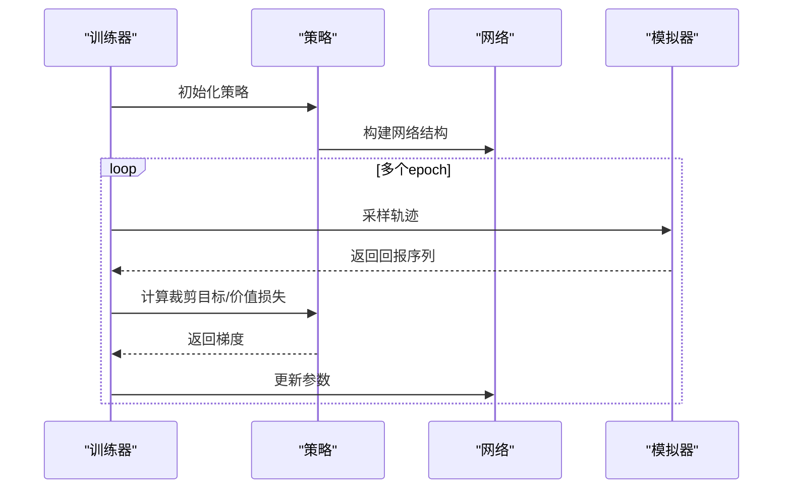
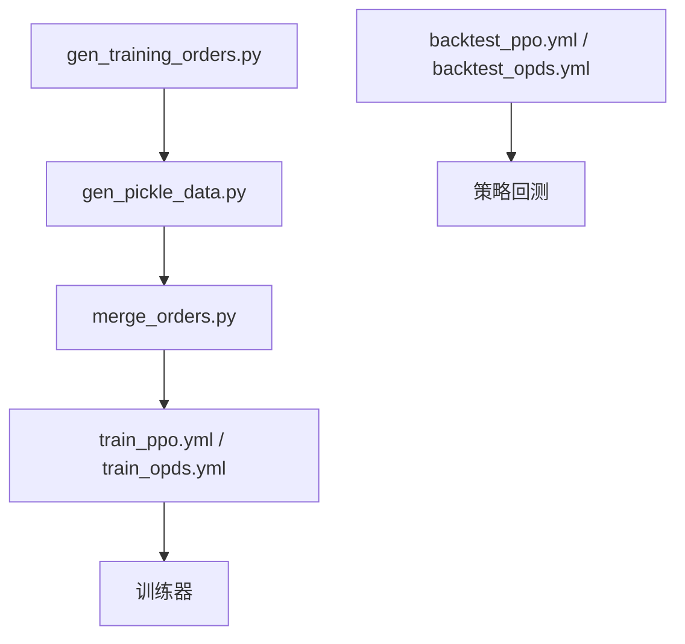
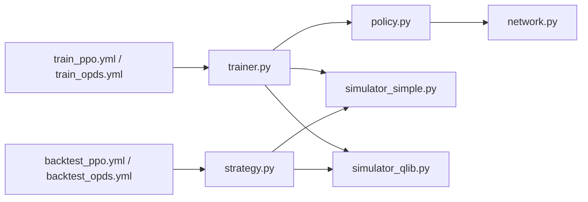

# 强化学习算法实现

<cite>
**本文引用的文件**
- [order_execution/__init__.py](file://qlib/rl/order_execution/__init__.py)
- [order_execution/network.py](file://qlib/rl/order_execution/network.py)
- [order_execution/policy.py](file://qlib/rl/order_execution/policy.py)
- [order_execution/state.py](file://qlib/rl/order_execution/state.py)
- [order_execution/reward.py](file://qlib/rl/order_execution/reward.py)
- [order_execution/simulator_qlib.py](file://qlib/rl/order_execution/simulator_qlib.py)
- [order_execution/simulator_simple.py](file://qlib/rl/order_execution/simulator_simple.py)
- [order_execution/strategy.py](file://qlib/rl/order_execution/strategy.py)
- [order_execution/utils.py](file://qlib/rl/order_execution/utils.py)
- [rl/trainer/trainer.py](file://qlib/rl/trainer/trainer.py)
- [rl/contrib/train_onpolicy.py](file://qlib/rl/contrib/train_onpolicy.py)
- [examples/rl_order_execution/exp_configs/train_ppo.yml](file://examples/rl_order_execution/exp_configs/train_ppo.yml)
- [examples/rl_order_execution/exp_configs/backtest_ppo.yml](file://examples/rl_order_execution/exp_configs/backtest_ppo.yml)
- [examples/rl_order_execution/exp_configs/train_opds.yml](file://examples/rl_order_execution/exp_configs/train_opds.yml)
- [examples/rl_order_execution/exp_configs/backtest_opds.yml](file://examples/rl_order_execution/exp_configs/backtest_opds.yml)
- [examples/rl_order_execution/scripts/gen_training_orders.py](file://examples/rl_order_execution/scripts/gen_training_orders.py)
- [examples/rl_order_execution/scripts/gen_pickle_data.py](file://examples/rl_order_execution/scripts/gen_pickle_data.py)
- [examples/rl_order_execution/scripts/merge_orders.py](file://examples/rl_order_execution/scripts/merge_orders.py)
</cite>

## 目录
1. [引言](#引言)
2. [项目结构](#项目结构)
3. [核心组件](#核心组件)
4. [架构总览](#架构总览)
5. [详细组件分析](#详细组件分析)
6. [依赖关系分析](#依赖关系分析)
7. [性能考量](#性能考量)
8. [故障排查指南](#故障排查指南)
9. [结论](#结论)
10. [附录](#附录)

## 引言
本文件面向强化学习在订单执行中的应用，系统梳理 Qlib 中基于策略梯度的 PPO（Proximal Policy Optimization）与 OPDS（Optimal Partial Decision State）两类算法的实现与使用方法。内容覆盖：算法原理、状态空间与动作空间设计、策略网络与价值网络结构、损失函数与训练流程、参数配置建议、性能对比与适用场景，并通过图示展示关键数据流与调用序列。

## 项目结构
强化学习订单执行相关代码集中在 qlib/rl/order_execution 目录，配套训练器与示例配置位于 qlib/rl/trainer 与 examples/rl_order_execution。下图给出与本文相关的模块关系概览。

图表来源
- [order_execution/__init__.py](file://qlib/rl/order_execution/__init__.py)
- [order_execution/network.py](file://qlib/rl/order_execution/network.py)
- [order_execution/policy.py](file://qlib/rl/order_execution/policy.py)
- [order_execution/state.py](file://qlib/rl/order_execution/state.py)
- [order_execution/reward.py](file://qlib/rl/order_execution/reward.py)
- [order_execution/simulator_qlib.py](file://qlib/rl/order_execution/simulator_qlib.py)
- [order_execution/simulator_simple.py](file://qlib/rl/order_execution/simulator_simple.py)
- [order_execution/strategy.py](file://qlib/rl/order_execution/strategy.py)
- [order_execution/utils.py](file://qlib/rl/order_execution/utils.py)
- [rl/trainer/trainer.py](file://qlib/rl/trainer/trainer.py)
- [rl/contrib/train_onpolicy.py](file://qlib/rl/contrib/train_onpolicy.py)
- [examples/rl_order_execution/exp_configs/train_ppo.yml](file://examples/rl_order_execution/exp_configs/train_ppo.yml)
- [examples/rl_order_execution/exp_configs/backtest_ppo.yml](file://examples/rl_order_execution/exp_configs/backtest_ppo.yml)
- [examples/rl_order_execution/exp_configs/train_opds.yml](file://examples/rl_order_execution/exp_configs/train_opds.yml)
- [examples/rl_order_execution/exp_configs/backtest_opds.yml](file://examples/rl_order_execution/exp_configs/backtest_opds.yml)
- [examples/rl_order_execution/scripts/gen_training_orders.py](file://examples/rl_order_execution/scripts/gen_training_orders.py)
- [examples/rl_order_execution/scripts/gen_pickle_data.py](file://examples/rl_order_execution/scripts/gen_pickle_data.py)
- [examples/rl_order_execution/scripts/merge_orders.py](file://examples/rl_order_execution/scripts/merge_orders.py)

章节来源
- [order_execution/__init__.py](file://qlib/rl/order_execution/__init__.py)
- [rl/trainer/trainer.py](file://qlib/rl/trainer/trainer.py)
- [examples/rl_order_execution/exp_configs/train_ppo.yml](file://examples/rl_order_execution/exp_configs/train_ppo.yml)

## 核心组件
- 策略网络与价值网络：定义在策略梯度框架下的神经网络结构，用于输出动作分布与状态价值估计。
- 状态空间与动作空间：封装订单执行环境的状态表示与可执行动作集合。
- 奖励函数：根据市场微观结构与交易成本设计的回报计算规则。
- 订单执行模拟器：提供与市场交互的仿真接口，支持简单模拟器与基于 Qlib 的真实市场模拟。
- 训练器与策略：封装 PPO 等策略梯度算法的训练循环、损失计算与参数更新逻辑。
- 示例配置与数据脚本：提供训练与回测的 YAML 配置以及生成训练数据的脚本。

章节来源
- [order_execution/network.py](file://qlib/rl/order_execution/network.py)
- [order_execution/state.py](file://qlib/rl/order_execution/state.py)
- [order_execution/reward.py](file://qlib/rl/order_execution/reward.py)
- [order_execution/simulator_simple.py](file://qlib/rl/order_execution/simulator_simple.py)
- [order_execution/simulator_qlib.py](file://qlib/rl/order_execution/simulator_qlib.py)
- [order_execution/policy.py](file://qlib/rl/order_execution/policy.py)
- [rl/trainer/trainer.py](file://qlib/rl/trainer/trainer.py)
- [examples/rl_order_execution/exp_configs/train_ppo.yml](file://examples/rl_order_execution/exp_configs/train_ppo.yml)
- [examples/rl_order_execution/exp_configs/train_opds.yml](file://examples/rl_order_execution/exp_configs/train_opds.yml)

## 架构总览
下图展示从配置到训练再到策略回测的整体流程，强调 PPO 与 OPDS 在训练阶段的差异以及统一的回测入口。

图表来源
- [rl/trainer/trainer.py](file://qlib/rl/trainer/trainer.py)
- [order_execution/policy.py](file://qlib/rl/order_execution/policy.py)
- [order_execution/network.py](file://qlib/rl/order_execution/network.py)
- [order_execution/simulator_simple.py](file://qlib/rl/order_execution/simulator_simple.py)
- [order_execution/simulator_qlib.py](file://qlib/rl/order_execution/simulator_qlib.py)
- [order_execution/strategy.py](file://qlib/rl/order_execution/strategy.py)
- [examples/rl_order_execution/exp_configs/train_ppo.yml](file://examples/rl_order_execution/exp_configs/train_ppo.yml)
- [examples/rl_order_execution/exp_configs/train_opds.yml](file://examples/rl_order_execution/exp_configs/train_opds.yml)
- [examples/rl_order_execution/exp_configs/backtest_ppo.yml](file://examples/rl_order_execution/exp_configs/backtest_ppo.yml)
- [examples/rl_order_execution/exp_configs/backtest_opds.yml](file://examples/rl_order_execution/exp_configs/backtest_opds.yml)

## 详细组件分析

### 策略网络与价值网络
- 网络结构：策略网络通常由多层感知机组成，输出动作分布（如高斯或分类分布），价值网络输出标量价值。两者共享部分特征提取层以提升效率。
- 输入维度：由状态向量维度决定，状态包含时间步、剩余未成交数量、价格档位、成交量、滑点与冲击成本等。
- 输出维度：策略网络输出动作参数（均值/方差或类别概率），价值网络输出当前状态价值。
- 损失函数：PPO 使用近端策略优化的有界优势目标；OPDS 采用部分决策状态下的最优动作选择策略，结合价值引导进行动作选择。

图表来源
- [order_execution/network.py](file://qlib/rl/order_execution/network.py)

章节来源
- [order_execution/network.py](file://qlib/rl/order_execution/network.py)

### 状态空间与动作空间
- 状态向量：包含时间进度、剩余未成交股数、买卖价差、成交量、滑点、冲击成本、市场流动性指标等。
- 动作空间：连续动作（下单比例或下单量）或离散动作（分档下单）。动作经归一化后映射至合法范围。
- 状态归一化：对价格、成交量、时间等进行归一化处理，提升模型稳定性与泛化能力。

图表来源
- [order_execution/state.py](file://qlib/rl/order_execution/state.py)
- [order_execution/reward.py](file://qlib/rl/order_execution/reward.py)

章节来源
- [order_execution/state.py](file://qlib/rl/order_execution/state.py)
- [order_execution/reward.py](file://qlib/rl/order_execution/reward.py)

### 奖励函数设计
- 回报构成：包含时间价值折现、交易成本（买卖价差、市场冲击）、执行质量（与 VWAP/TWAP 的偏离度）等。
- 折扣因子：用于平衡即时回报与未来回报，避免过度短视。
- 成本惩罚：对大额冲击与高频微调施加惩罚，鼓励稳健执行。

图表来源
- [order_execution/reward.py](file://qlib/rl/order_execution/reward.py)
- [order_execution/policy.py](file://qlib/rl/order_execution/policy.py)

章节来源
- [order_execution/reward.py](file://qlib/rl/order_execution/reward.py)
- [order_execution/policy.py](file://qlib/rl/order_execution/policy.py)

### 订单执行模拟器
- 简单模拟器：基于固定滑点与市场冲击模型，快速验证算法可行性。
- Qlib 模拟器：对接真实市场数据与交易成本模型，提供更贴近实战的回测环境。

图表来源
- [order_execution/simulator_simple.py](file://qlib/rl/order_execution/simulator_simple.py)
- [order_execution/simulator_qlib.py](file://qlib/rl/order_execution/simulator_qlib.py)

章节来源
- [order_execution/simulator_simple.py](file://qlib/rl/order_execution/simulator_simple.py)
- [order_execution/simulator_qlib.py](file://qlib/rl/order_execution/simulator_qlib.py)

### 训练器与策略
- 训练器：封装 on-policy 训练循环，支持 PPO 等策略梯度算法，负责轨迹采集、优势估计、损失计算与参数更新。
- 策略模块：实现 PPO 的裁剪目标与 KL 正则项，以及 OPDS 的部分决策状态最优动作选择。

图表来源
- [rl/trainer/trainer.py](file://qlib/rl/trainer/trainer.py)
- [order_execution/policy.py](file://qlib/rl/order_execution/policy.py)
- [order_execution/network.py](file://qlib/rl/order_execution/network.py)
- [order_execution/simulator_simple.py](file://qlib/rl/order_execution/simulator_simple.py)

章节来源
- [rl/trainer/trainer.py](file://qlib/rl/trainer/trainer.py)
- [order_execution/policy.py](file://qlib/rl/order_execution/policy.py)

### 示例配置与数据准备
- 训练配置：包含网络结构、优化器、学习率、裁剪参数、折扣因子、批量大小等。
- 回测配置：指定策略加载路径、市场数据范围、交易成本参数等。
- 数据脚本：生成训练订单、pickle 数据与合并多源订单数据集。

图表来源
- [examples/rl_order_execution/scripts/gen_training_orders.py](file://examples/rl_order_execution/scripts/gen_training_orders.py)
- [examples/rl_order_execution/scripts/gen_pickle_data.py](file://examples/rl_order_execution/scripts/gen_pickle_data.py)
- [examples/rl_order_execution/scripts/merge_orders.py](file://examples/rl_order_execution/scripts/merge_orders.py)
- [examples/rl_order_execution/exp_configs/train_ppo.yml](file://examples/rl_order_execution/exp_configs/train_ppo.yml)
- [examples/rl_order_execution/exp_configs/train_opds.yml](file://examples/rl_order_execution/exp_configs/train_opds.yml)
- [examples/rl_order_execution/exp_configs/backtest_ppo.yml](file://examples/rl_order_execution/exp_configs/backtest_ppo.yml)
- [examples/rl_order_execution/exp_configs/backtest_opds.yml](file://examples/rl_order_execution/exp_configs/backtest_opds.yml)

章节来源
- [examples/rl_order_execution/exp_configs/train_ppo.yml](file://examples/rl_order_execution/exp_configs/train_ppo.yml)
- [examples/rl_order_execution/exp_configs/backtest_ppo.yml](file://examples/rl_order_execution/exp_configs/backtest_ppo.yml)
- [examples/rl_order_execution/exp_configs/train_opds.yml](file://examples/rl_order_execution/exp_configs/train_opds.yml)
- [examples/rl_order_execution/exp_configs/backtest_opds.yml](file://examples/rl_order_execution/exp_configs/backtest_opds.yml)
- [examples/rl_order_execution/scripts/gen_training_orders.py](file://examples/rl_order_execution/scripts/gen_training_orders.py)
- [examples/rl_order_execution/scripts/gen_pickle_data.py](file://examples/rl_order_execution/scripts/gen_pickle_data.py)
- [examples/rl_order_execution/scripts/merge_orders.py](file://examples/rl_order_execution/scripts/merge_orders.py)

## 依赖关系分析
- 组件耦合：策略模块依赖网络模块；训练器依赖策略模块与模拟器；回测策略依赖模拟器与配置。
- 外部依赖：训练器与贡献模块共同支撑 on-policy 策略梯度训练；示例脚本为数据准备提供工具链。
- 可能的循环依赖：模块间通过清晰的接口传递数据，未见直接循环导入。

图表来源
- [order_execution/policy.py](file://qlib/rl/order_execution/policy.py)
- [order_execution/network.py](file://qlib/rl/order_execution/network.py)
- [rl/trainer/trainer.py](file://qlib/rl/trainer/trainer.py)
- [order_execution/simulator_simple.py](file://qlib/rl/order_execution/simulator_simple.py)
- [order_execution/simulator_qlib.py](file://qlib/rl/order_execution/simulator_qlib.py)
- [order_execution/strategy.py](file://qlib/rl/order_execution/strategy.py)
- [examples/rl_order_execution/exp_configs/train_ppo.yml](file://examples/rl_order_execution/exp_configs/train_ppo.yml)
- [examples/rl_order_execution/exp_configs/train_opds.yml](file://examples/rl_order_execution/exp_configs/train_opds.yml)
- [examples/rl_order_execution/exp_configs/backtest_ppo.yml](file://examples/rl_order_execution/exp_configs/backtest_ppo.yml)
- [examples/rl_order_execution/exp_configs/backtest_opds.yml](file://examples/rl_order_execution/exp_configs/backtest_opds.yml)

章节来源
- [order_execution/policy.py](file://qlib/rl/order_execution/policy.py)
- [order_execution/network.py](file://qlib/rl/order_execution/network.py)
- [rl/trainer/trainer.py](file://qlib/rl/trainer/trainer.py)
- [order_execution/strategy.py](file://qlib/rl/order_execution/strategy.py)

## 性能考量
- 训练稳定性：PPO 的裁剪参数与熵正则有助于稳定训练；OPDS 的部分决策状态选择可降低动作空间复杂度。
- 收敛速度：合理的学习率、批量大小与折扣因子影响收敛；过高的学习率易导致震荡，过低则收敛缓慢。
- 计算开销：网络深度与特征维度直接影响前向/反向计算时间；可通过批量化与 GPU 加速提升吞吐。
- 泛化能力：状态归一化与数据增强（如随机滑点/冲击）可提升模型鲁棒性。

## 故障排查指南
- 训练不收敛：检查学习率、裁剪参数与折扣因子设置；确认奖励函数是否合理；核对状态归一化是否一致。
- 回测偏差：确认回测配置与训练配置的一致性；检查模拟器参数（滑点、冲击、手续费）是否匹配实际市场。
- 内存溢出：减小批量大小或降低网络深度；确保轨迹长度适中；及时清理中间变量。
- 数据问题：核对订单数据生成脚本输出格式；检查 pickle 数据完整性与合并逻辑。

章节来源
- [order_execution/reward.py](file://qlib/rl/order_execution/reward.py)
- [order_execution/simulator_simple.py](file://qlib/rl/order_execution/simulator_simple.py)
- [order_execution/simulator_qlib.py](file://qlib/rl/order_execution/simulator_qlib.py)
- [examples/rl_order_execution/scripts/gen_training_orders.py](file://examples/rl_order_execution/scripts/gen_training_orders.py)
- [examples/rl_order_execution/scripts/gen_pickle_data.py](file://examples/rl_order_execution/scripts/gen_pickle_data.py)
- [examples/rl_order_execution/scripts/merge_orders.py](file://examples/rl_order_execution/scripts/merge_orders.py)

## 结论
Qlib 的强化学习订单执行框架以策略梯度为核心，提供了可扩展的策略网络、灵活的模拟器与完善的训练/回测流水线。PPO 适合需要稳定策略更新的场景，OPDS 则在部分决策状态下追求更优的动作选择。通过合理的参数配置与数据准备，可在仿真与实盘环境中取得良好效果。

## 附录
- 参数配置要点（示例）
  - 学习率：建议从 1e-4 开始，结合批量大小调整；若不稳定可降至 3e-5。
  - 折扣因子：0.95~0.99，越接近 1 越重视长期回报。
  - 裁剪参数：0.1~0.3，过大易过拟合，过小收敛慢。
  - 网络结构：输入层维度等于状态向量长度；隐藏层 64~256；输出层对应动作分布与价值。
  - 训练超参：每轮采样步数 1000~4000；批量大小 32~256；更新轮数若干 epoch。
- 适用场景
  - PPO：对策略稳定性要求较高、需要平滑更新的执行任务。
  - OPDS：在部分决策状态上追求最优动作、对计算效率有更高要求的任务。