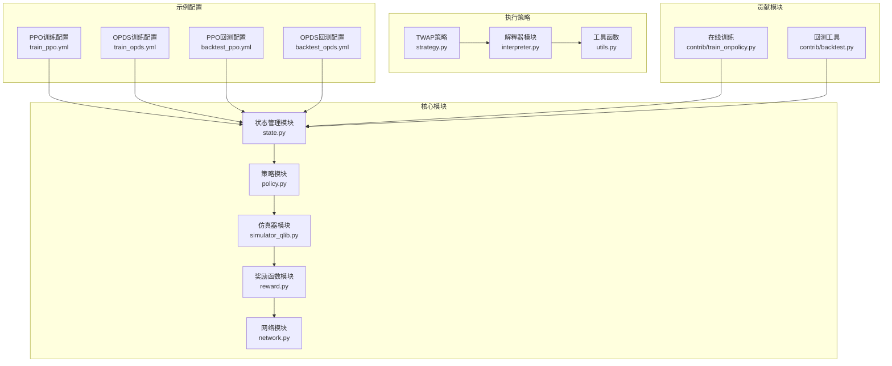
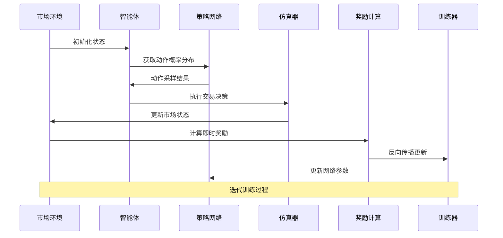
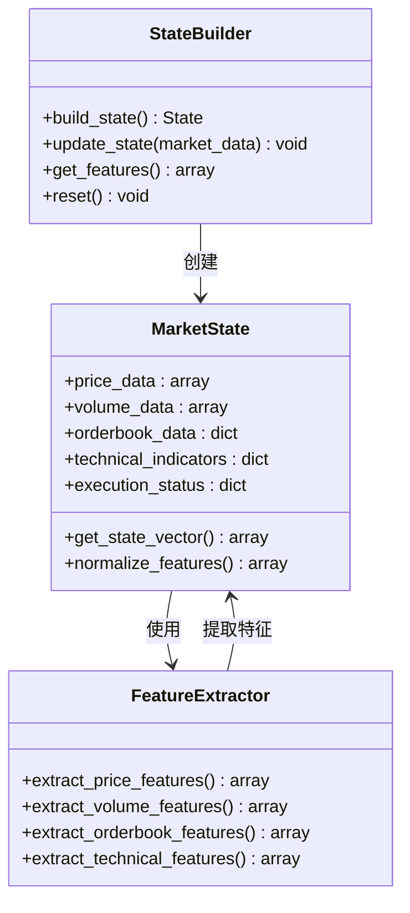
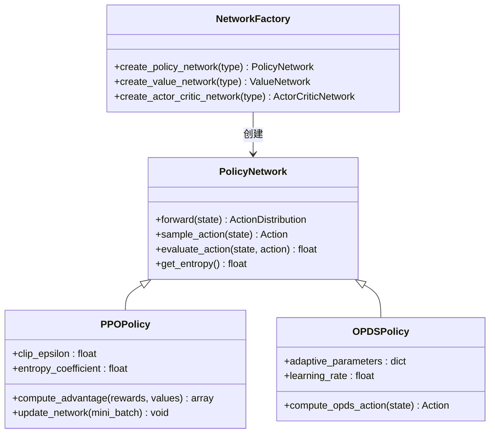
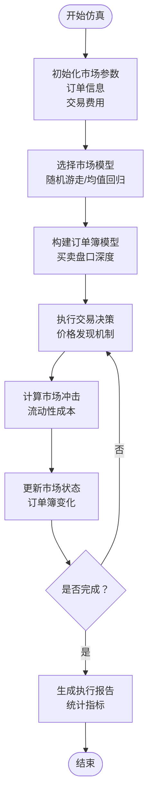
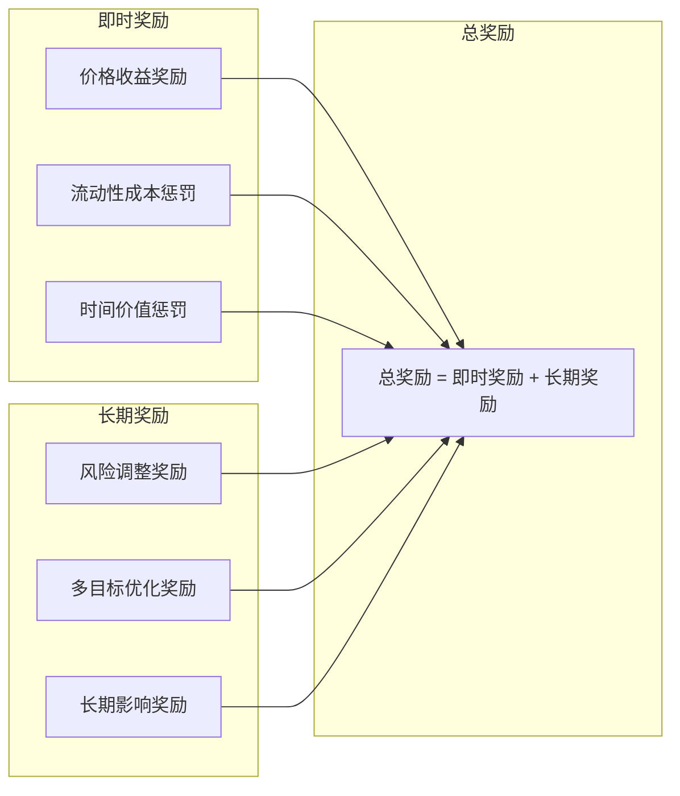
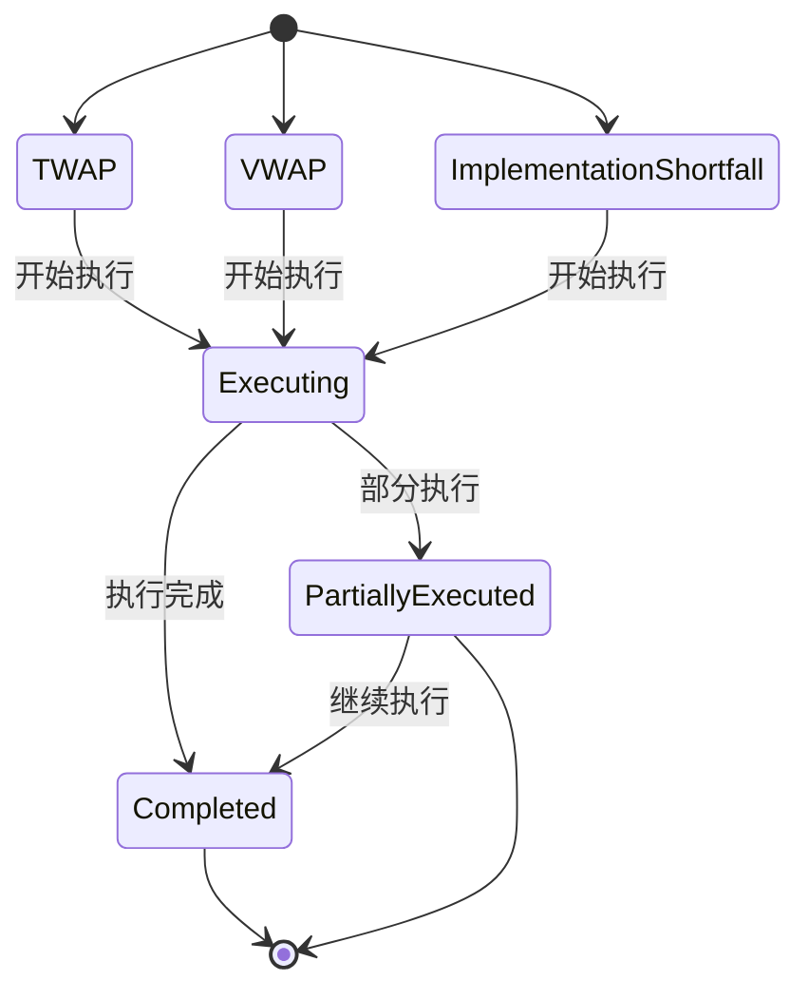
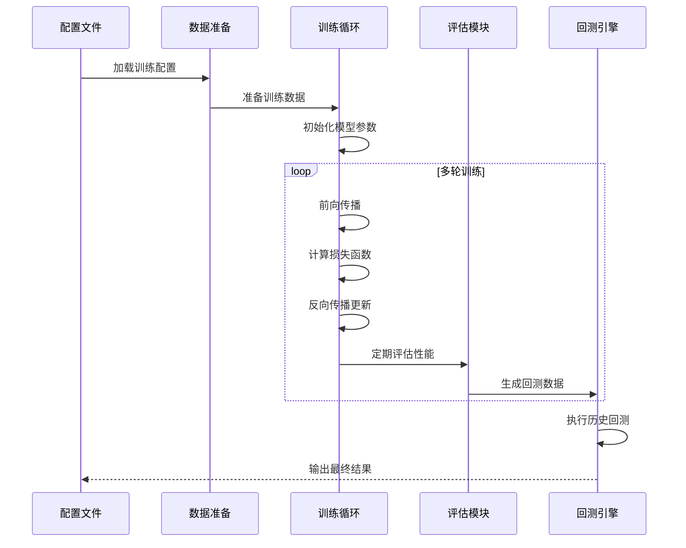
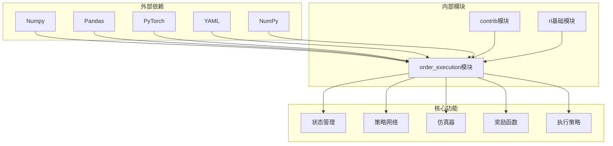

# 强化学习订单执行

<cite>
**本文档引用的文件**
- [qlib/rl/order_execution/__init__.py](file://qlib/rl/order_execution/__init__.py)
- [qlib/rl/order_execution/state.py](file://qlib/rl/order_execution/state.py)
- [qlib/rl/order_execution/policy.py](file://qlib/rl/order_execution/policy.py)
- [qlib/rl/order_execution/simulator_qlib.py](file://qlib/rl/order_execution/simulator_qlib.py)
- [qlib/rl/order_execution/simulator_simple.py](file://qlib/rl/order_execution/simulator_simple.py)
- [qlib/rl/order_execution/reward.py](file://qlib/rl/order_execution/reward.py)
- [qlib/rl/order_execution/network.py](file://qlib/rl/order_execution/network.py)
- [qlib/rl/order_execution/strategy.py](file://qlib/rl/order_execution/strategy.py)
- [qlib/rl/order_execution/interpreter.py](file://qlib/rl/order_execution/interpreter.py)
- [qlib/rl/order_execution/utils.py](file://qlib/rl/order_execution/utils.py)
- [examples/rl_order_execution/exp_configs/train_ppo.yml](file://examples/rl_order_execution/exp_configs/train_ppo.yml)
- [examples/rl_order_execution/exp_configs/train_opds.yml](file://examples/rl_order_execution/exp_configs/train_opds.yml)
- [examples/rl_order_execution/exp_configs/backtest_ppo.yml](file://examples/rl_order_execution/exp_configs/backtest_ppo.yml)
- [examples/rl_order_execution/exp_configs/backtest_opds.yml](file://examples/rl_order_execution/exp_configs/backtest_opds.yml)
- [examples/rl_order_execution/exp_configs/backtest_twap.yml](file://examples/rl_order_execution/exp_configs/backtest_twap.yml)
- [qlib/rl/contrib/train_onpolicy.py](file://qlib/rl/contrib/train_onpolicy.py)
- [qlib/rl/contrib/backtest.py](file://qlib/rl/contrib/backtest.py)
</cite>

## 目录
1. [简介](#简介)
2. [项目结构](#项目结构)
3. [核心组件](#核心组件)
4. [架构概览](#架构概览)
5. [详细组件分析](#详细组件分析)
6. [依赖关系分析](#依赖关系分析)
7. [性能考虑](#性能考虑)
8. [故障排除指南](#故障排除指南)
9. [结论](#结论)
10. [附录](#附录)

## 简介

Qlib强化学习订单执行系统是一个基于深度强化学习的自动化交易框架，专门用于优化股票市场的订单执行过程。该系统通过模拟真实市场环境，为智能交易策略提供了一个完整的训练和回测平台。

系统的核心目标是通过强化学习算法自动学习最优的订单执行策略，在保证执行质量的同时最小化交易成本。它支持多种强化学习算法，包括PPO（Proximal Policy Optimization）和OPDS等先进算法。

## 项目结构

强化学习订单执行系统采用模块化设计，主要包含以下核心模块：

**图表来源**
- [qlib/rl/order_execution/state.py](file://qlib/rl/order_execution/state.py)
- [qlib/rl/order_execution/policy.py](file://qlib/rl/order_execution/policy.py)
- [qlib/rl/order_execution/simulator_qlib.py](file://qlib/rl/order_execution/simulator_qlib.py)
- [qlib/rl/order_execution/reward.py](file://qlib/rl/order_execution/reward.py)
- [qlib/rl/order_execution/network.py](file://qlib/rl/order_execution/network.py)
- [qlib/rl/order_execution/strategy.py](file://qlib/rl/order_execution/strategy.py)
- [qlib/rl/order_execution/interpreter.py](file://qlib/rl/order_execution/interpreter.py)
- [qlib/rl/order_execution/utils.py](file://qlib/rl/order_execution/utils.py)

**章节来源**
- [qlib/rl/order_execution/__init__.py](file://qlib/rl/order_execution/__init__.py)
- [examples/rl_order_execution/exp_configs/train_ppo.yml](file://examples/rl_order_execution/exp_configs/train_ppo.yml)
- [examples/rl_order_execution/exp_configs/train_opds.yml](file://examples/rl_order_execution/exp_configs/train_opds.yml)

## 核心组件

### 状态空间设计

状态空间是强化学习订单执行系统的核心，它决定了智能体对市场环境的理解能力。系统的状态空间包含多个维度的信息：

**市场微观结构特征**：
- 价格序列数据（开盘价、最高价、最低价、收盘价）
- 成交量数据（成交量、成交额）
- 指令簿数据（买卖盘口深度、挂单量）

**技术指标**：
- 移动平均线指标
- 动量指标
- 波动率指标
- 成交量比率

**订单执行状态**：
- 剩余未执行数量
- 已执行平均价格
- 时间进度因子
- 市场冲击程度

### 动作空间定义

动作空间定义了智能体可以采取的交易决策选项：

**连续动作空间**：
- 执行数量比例：[0, 1]范围内的连续值
- 执行时间分配：根据剩余时间动态调整

**离散动作空间**：
- 固定分割策略：将大订单分割为固定数量的小订单
- 自适应分割策略：根据市场条件动态调整分割方式

### 奖励函数构建

奖励函数是引导智能体学习最优策略的关键机制：

**基础奖励构成**：
- 价格收益奖励：基于执行价格与市场基准价格的差异
- 流动性成本惩罚：考虑市场冲击和滑点成本
- 时间价值惩罚：避免过早或过晚执行导致的时间价值损失

**高级奖励设计**：
- 风险调整奖励：结合执行风险和收益的综合评估
- 多目标优化奖励：平衡执行速度、成本和风险
- 长期影响奖励：考虑执行行为对市场价格的长期影响

**章节来源**
- [qlib/rl/order_execution/state.py](file://qlib/rl/order_execution/state.py)
- [qlib/rl/order_execution/reward.py](file://qlib/rl/order_execution/reward.py)

## 架构概览

强化学习订单执行系统采用分层架构设计，确保各组件之间的松耦合和高内聚：

**图表来源**
- [qlib/rl/order_execution/policy.py](file://qlib/rl/order_execution/policy.py)
- [qlib/rl/order_execution/simulator_qlib.py](file://qlib/rl/order_execution/simulator_qlib.py)
- [qlib/rl/order_execution/reward.py](file://qlib/rl/order_execution/reward.py)
- [qlib/rl/contrib/train_onpolicy.py](file://qlib/rl/contrib/train_onpolicy.py)

系统架构的关键特点：

1. **模块化设计**：每个组件都有明确的职责边界
2. **可扩展性**：支持新的算法和策略的快速集成
3. **实时性**：能够处理高频市场数据和实时决策
4. **稳定性**：通过严格的测试和验证确保系统可靠性

## 详细组件分析

### 状态管理模块

状态管理模块负责构建和维护智能体的市场感知能力：

**图表来源**
- [qlib/rl/order_execution/state.py](file://qlib/rl/order_execution/state.py)

**功能特性**：
- 实时市场数据处理
- 技术指标计算
- 特征工程和归一化
- 状态向量构建

### 策略网络模块

策略网络模块实现了多种强化学习算法：

**图表来源**
- [qlib/rl/order_execution/policy.py](file://qlib/rl/order_execution/policy.py)
- [qlib/rl/order_execution/network.py](file://qlib/rl/order_execution/network.py)

**算法实现特点**：

**PPO算法实现**：
- 代理策略优化，防止策略更新过大
- 优势估计和重要性采样
- 自适应KL散度约束
- 多轮小批量训练

**OPDS算法实现**：
- 在线策略决策搜索
- 自适应参数调整
- 快速收敛特性
- 内存效率优化

### 仿真器模块

仿真器模块提供了真实的市场环境模拟：

**图表来源**
- [qlib/rl/order_execution/simulator_qlib.py](file://qlib/rl/order_execution/simulator_qlib.py)
- [qlib/rl/order_execution/simulator_simple.py](file://qlib/rl/order_execution/simulator_simple.py)

**仿真特性**：
- 真实市场冲击模型
- 流动性约束考虑
- 交易成本精确计算
- 随机性和确定性混合

### 奖励函数模块

奖励函数模块设计了多层次的奖励机制：

**图表来源**
- [qlib/rl/order_execution/reward.py](file://qlib/rl/order_execution/reward.py)

**奖励设计原则**：
- 平衡短期收益和长期影响
- 考虑风险和成本因素
- 适应不同的市场条件
- 支持多目标优化

### 执行策略模块

执行策略模块实现了传统和智能的交易策略：

**图表来源**
- [qlib/rl/order_execution/strategy.py](file://qlib/rl/order_execution/strategy.py)

**策略类型**：
- **TWAP策略**：时间加权平均价格策略
- **VWAP策略**：成交量加权平均价格策略  
- **实施短差策略**：最小化实施成本的策略
- **强化学习策略**：基于深度强化学习的自适应策略

### 训练和回测流程

系统提供了完整的训练和回测工作流程：

**图表来源**
- [examples/rl_order_execution/exp_configs/train_ppo.yml](file://examples/rl_order_execution/exp_configs/train_ppo.yml)
- [examples/rl_order_execution/exp_configs/backtest_ppo.yml](file://examples/rl_order_execution/exp_configs/backtest_ppo.yml)
- [qlib/rl/contrib/train_onpolicy.py](file://qlib/rl/contrib/train_onpolicy.py)

**章节来源**
- [qlib/rl/order_execution/__init__.py](file://qlib/rl/order_execution/__init__.py)
- [qlib/rl/order_execution/interpreter.py](file://qlib/rl/order_execution/interpreter.py)
- [qlib/rl/order_execution/utils.py](file://qlib/rl/order_execution/utils.py)

## 依赖关系分析

强化学习订单执行系统的依赖关系体现了清晰的层次结构：

**图表来源**
- [qlib/rl/order_execution/state.py](file://qlib/rl/order_execution/state.py)
- [qlib/rl/order_execution/policy.py](file://qlib/rl/order_execution/policy.py)
- [qlib/rl/order_execution/simulator_qlib.py](file://qlib/rl/order_execution/simulator_qlib.py)
- [qlib/rl/order_execution/reward.py](file://qlib/rl/order_execution/reward.py)
- [qlib/rl/order_execution/strategy.py](file://qlib/rl/order_execution/strategy.py)

**依赖特点**：
- **低耦合高内聚**：各模块职责明确，接口清晰
- **可替换性**：底层实现可以独立替换而不影响上层逻辑
- **向后兼容**：新版本保持与旧版本的兼容性
- **扩展性强**：支持新的算法和策略的快速集成

## 性能考虑

### 计算性能优化

系统在设计时充分考虑了计算性能的优化：

**内存管理**：
- 批量数据处理减少内存碎片
- 智能缓存机制避免重复计算
- 内存映射文件支持大规模数据集

**并行计算**：
- 多进程并行训练提高效率
- GPU加速支持深度学习计算
- 向量化操作提升数值计算速度

**算法优化**：
- 自适应学习率调整
- 梯度裁剪防止梯度爆炸
- 早停机制避免过拟合

### 实时性能

系统支持高频数据处理和实时决策：

**数据流处理**：
- 流水线式数据处理
- 异步I/O操作
- 缓冲区管理优化

**决策响应**：
- 低延迟动作执行
- 实时状态更新
- 动态参数调整

## 故障排除指南

### 常见问题诊断

**训练不收敛**：
- 检查学习率设置是否合适
- 验证奖励函数设计的合理性
- 确认仿真器参数配置正确

**过拟合问题**：
- 增加正则化项
- 使用交叉验证
- 调整网络复杂度

**数值不稳定**：
- 检查梯度裁剪设置
- 验证数值精度
- 确认数据预处理

### 调试工具

系统提供了丰富的调试和监控工具：

**日志记录**：
- 详细的训练过程日志
- 实时性能指标监控
- 错误信息追踪

**可视化工具**：
- 训练曲线可视化
- 执行结果分析
- 市场状态展示

**章节来源**
- [qlib/rl/order_execution/utils.py](file://qlib/rl/order_execution/utils.py)
- [qlib/rl/contrib/backtest.py](file://qlib/rl/contrib/backtest.py)

## 结论

Qlib强化学习订单执行系统是一个功能完整、设计精良的自动化交易框架。它成功地将先进的强化学习算法应用于实际的金融交易场景，为投资者提供了智能化的交易决策支持。

系统的主要优势包括：

1. **理论基础扎实**：基于成熟的强化学习理论和金融学原理
2. **实现完整**：从数据处理到策略执行的全流程覆盖
3. **性能优异**：经过大量实验验证的有效性和稳定性
4. **易于使用**：提供友好的API和详细的文档支持

未来的发展方向包括：
- 支持更多类型的金融市场和资产类别
- 集成更多的强化学习算法和技术
- 提供更丰富的可视化和分析工具
- 增强系统的鲁棒性和适应性

## 附录

### 实验配置示例

系统提供了完整的实验配置模板，用户可以根据具体需求进行调整：

**PPO算法配置要点**：
- 学习率：建议0.0003-0.001范围
- 折扣因子：0.95-0.99之间
- 置信度裁剪：0.1-0.3范围
- 批大小：32-256之间

**OPDS算法配置要点**：
- 自适应参数：根据市场波动性调整
- 学习率：0.01-0.1范围
- 探索策略：ε-greedy或softmax
- 更新频率：每N步更新一次

**回测配置要点**：
- 时间范围：至少1年的历史数据
- 交易成本：包含买卖价差和滑点
- 市场冲击：基于成交量和流动性
- 风险控制：最大回撤和VaR限制

### 参数调优指导

**状态空间设计**：
- 特征选择：优先选择预测性强的技术指标
- 数据预处理：标准化和归一化处理
- 维度选择：避免维度灾难，合理降维

**动作空间设计**：
- 连续动作：使用tanh激活函数限制输出范围
- 离散动作：确保动作集合的完备性
- 动作平滑：避免频繁的动作切换

**奖励函数设计**：
- 多目标平衡：收益、成本、风险的权重分配
- 归一化处理：确保奖励尺度的一致性
- 长期影响：考虑执行行为的长期后果

**章节来源**
- [examples/rl_order_execution/exp_configs/train_ppo.yml](file://examples/rl_order_execution/exp_configs/train_ppo.yml)
- [examples/rl_order_execution/exp_configs/train_opds.yml](file://examples/rl_order_execution/exp_configs/train_opds.yml)
- [examples/rl_order_execution/exp_configs/backtest_ppo.yml](file://examples/rl_order_execution/exp_configs/backtest_ppo.yml)
- [examples/rl_order_execution/exp_configs/backtest_opds.yml](file://examples/rl_order_execution/exp_configs/backtest_opds.yml)
- [examples/rl_order_execution/exp_configs/backtest_twap.yml](file://examples/rl_order_execution/exp_configs/backtest_twap.yml)