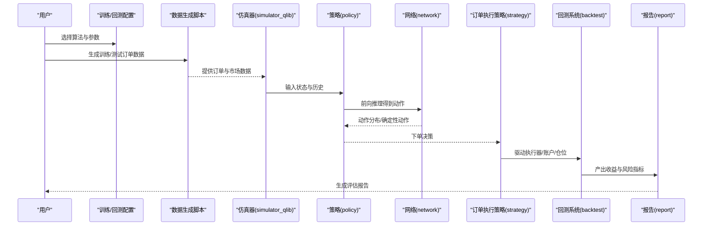
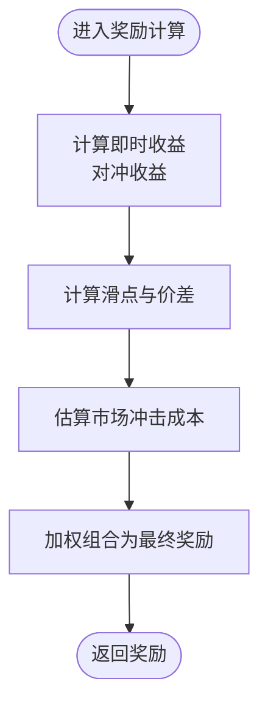
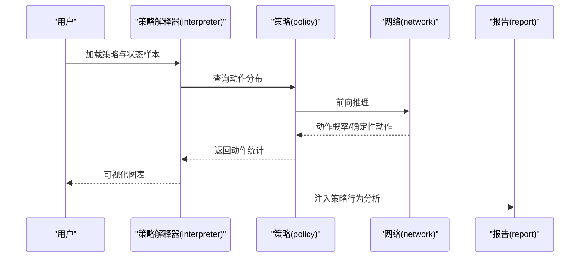
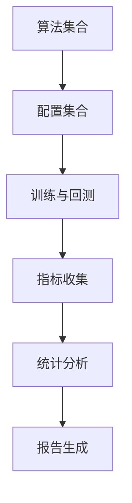
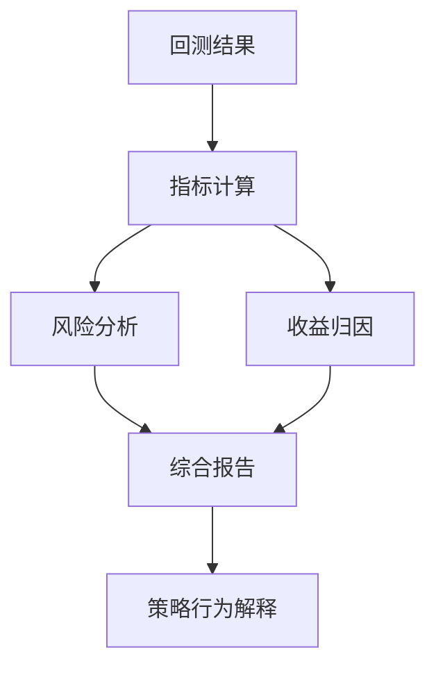
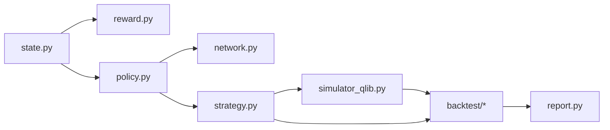

# 性能评估与分析

<cite>
**本文引用的文件**
- [examples/rl_order_execution/README.md](file://examples/rl_order_execution/README.md)
- [examples/rl_order_execution/exp_configs/train_opds.yml](file://examples/rl_order_execution/exp_configs/train_opds.yml)
- [examples/rl_order_execution/exp_configs/backtest_opds.yml](file://examples/rl_order_execution/exp_configs/backtest_opds.yml)
- [examples/rl_order_execution/exp_configs/train_ppo.yml](file://examples/rl_order_execution/exp_configs/train_ppo.yml)
- [examples/rl_order_execution/exp_configs/backtest_ppo.yml](file://examples/rl_order_execution/exp_configs/backtest_ppo.yml)
- [examples/rl_order_execution/exp_configs/backtest_twap.yml](file://examples/rl_order_execution/exp_configs/backtest_twap.yml)
- [examples/rl_order_execution/scripts/gen_training_orders.py](file://examples/rl_order_execution/scripts/gen_training_orders.py)
- [examples/rl_order_execution/scripts/gen_pickle_data.py](file://examples/rl_order_execution/scripts/gen_pickle_data.py)
- [examples/rl_order_execution/scripts/merge_orders.py](file://examples/rl_order_execution/scripts/merge_orders.py)
- [qlib/rl/order_execution/reward.py](file://qlib/rl/order_execution/reward.py)
- [qlib/rl/order_execution/interpreter.py](file://qlib/rl/order_execution/interpreter.py)
- [qlib/rl/order_execution/simulator_qlib.py](file://qlib/rl/order_execution/simulator_qlib.py)
- [qlib/rl/order_execution/state.py](file://qlib/rl/order_execution/state.py)
- [qlib/rl/order_execution/policy.py](file://qlib/rl/order_execution/policy.py)
- [qlib/rl/order_execution/network.py](file://qlib/rl/order_execution/network.py)
- [qlib/rl/order_execution/utils.py](file://qlib/rl/order_execution/utils.py)
- [qlib/rl/order_execution/strategy.py](file://qlib/rl/order_execution/strategy.py)
- [qlib/backtest/report.py](file://qlib/backtest/report.py)
- [qlib/backtest/profit_attribution.py](file://qlib/backtest/profit_attribution.py)
- [qlib/backtest/account.py](file://qlib/backtest/account.py)
- [qlib/backtest/position.py](file://qlib/backtest/position.py)
- [qlib/backtest/exchange.py](file://qlib/backtest/exchange.py)
- [qlib/backtest/executor.py](file://qlib/backtest/executor.py)
- [qlib/backtest/decision.py](file://qlib/backtest/decision.py)
- [qlib/backtest/signal.py](file://qlib/backtest/signal.py)
- [qlib/backtest/utils.py](file://qlib/backtest/utils.py)
- [qlib/contrib/report/analysis_position/risk_analysis.py](file://qlib/contrib/report/analysis_position/risk_analysis.py)
- [qlib/contrib/report/analysis_position/cumulative_return.py](file://qlib/contrib/report/analysis_position/cumulative_return.py)
- [qlib/contrib/report/analysis_position/score_ic.py](file://qlib/contrib/report/analysis_position/score_ic.py)
- [qlib/contrib/report/analysis_position/report.py](file://qlib/contrib/report/analysis_position/report.py)
</cite>

## 目录
1. [引言](#引言)
2. [项目结构](#项目结构)
3. [核心组件](#核心组件)
4. [架构总览](#架构总览)
5. [详细组件分析](#详细组件分析)
6. [依赖关系分析](#依赖关系分析)
7. [性能考量](#性能考量)
8. [故障排查指南](#故障排查指南)
9. [结论](#结论)
10. [附录](#附录)

## 引言
本文件聚焦于强化学习在“订单执行”场景下的性能评估与分析，围绕以下目标展开：  
- 执行质量评估指标：执行效率、市场影响成本、交易收益  
- 奖励函数设计原理与指标计算方法  
- 策略解释器功能与使用：策略可视化与行为分析  
- 性能对比分析框架：支持不同算法与参数配置的效果评估  
- 评估报告生成与结果解读指导  

为保证可追溯性，本文所有技术细节均基于仓库中实际实现文件进行阐述。

## 项目结构
本专题涉及的代码主要分布在两个层面：  
- 示例与配置层（examples/rl_order_execution）：提供训练与回测的配置样例、数据生成脚本  
- 核心实现层（qlib/rl/order_execution 及 qlib/backtest）：提供订单执行相关的奖励、状态、策略、仿真器、解释器以及回测报告等模块

```mermaid
graph TB
subgraph "示例与配置"
EX_README["examples/rl_order_execution/README.md"]
CFG_TRAIN_OPDS["exp_configs/train_opds.yml"]
CFG_BACKTEST_OPDS["exp_configs/backtest_opds.yml"]
CFG_TRAIN_PPO["exp_configs/train_ppo.yml"]
CFG_BACKTEST_PPO["exp_configs/backtest_ppo.yml"]
CFG_BACKTEST_TWAP["exp_configs/backtest_twap.yml"]
GEN_ORDERS["scripts/gen_training_orders.py"]
GEN_PICKLE["scripts/gen_pickle_data.py"]
MERGE_ORDERS["scripts/merge_orders.py"]
end
subgraph "强化学习订单执行核心"
REWARD["qlib/rl/order_execution/reward.py"]
INTERP["qlib/rl/order_execution/interpreter.py"]
SIM_QLIB["qlib/rl/order_execution/simulator_qlib.py"]
STATE["qlib/rl/order_execution/state.py"]
POLICY["qlib/rl/order_execution/policy.py"]
NETWORK["qlib/rl/order_execution/network.py"]
UTILS["qlib/rl/order_execution/utils.py"]
STRATEGY["qlib/rl/order_execution/strategy.py"]
end
subgraph "回测与报告"
BT_REPORT["qlib/backtest/report.py"]
BT_PROFIT["qlib/backtest/profit_attribution.py"]
BT_ACCOUNT["qlib/backtest/account.py"]
BT_POSITION["qlib/backtest/position.py"]
BT_EXCHANGE["qlib/backtest/exchange.py"]
BT_EXECUTOR["qlib/backtest/executor.py"]
BT_DECISION["qlib/backtest/decision.py"]
BT_SIGNAL["qlib/backtest/signal.py"]
BT_UTILS["qlib/backtest/utils.py"]
RISK_ANALYSIS["qlib/contrib/report/analysis_position/risk_analysis.py"]
CUM_RETURN["qlib/contrib/report/analysis_position/cumulative_return.py"]
SCORE_IC["qlib/contrib/report/analysis_position/score_ic.py"]
POS_REPORT["qlib/contrib/report/analysis_position/report.py"]
end
EX_README --> CFG_TRAIN_OPDS
EX_README --> CFG_BACKTEST_OPDS
EX_README --> CFG_TRAIN_PPO
EX_README --> CFG_BACKTEST_PPO
EX_README --> CFG_BACKTEST_TWAP
GEN_ORDERS --> SIM_QLIB
GEN_PICKLE --> SIM_QLIB
MERGE_ORDERS --> SIM_QLIB
SIM_QLIB --> REWARD
SIM_QLIB --> STATE
SIM_QLIB --> POLICY
SIM_QLIB --> STRATEGY
POLICY --> NETWORK
POLICY --> UTILS
STRATEGY --> BT_EXCHANGE
STRATEGY --> BT_EXECUTOR
STRATEGY --> BT_DECISION
STRATEGY --> BT_SIGNAL
STRATEGY --> BT_ACCOUNT
STRATEGY --> BT_POSITION
BT_EXCHANGE --> BT_REPORT
BT_EXECUTOR --> BT_REPORT
BT_DECISION --> BT_REPORT
BT_ACCOUNT --> BT_REPORT
BT_POSITION --> BT_REPORT
BT_REPORT --> RISK_ANALYSIS
BT_REPORT --> CUM_RETURN
BT_REPORT --> SCORE_IC
BT_REPORT --> POS_REPORT
```

**图表来源**
- [examples/rl_order_execution/README.md](file://examples/rl_order_execution/README.md)
- [examples/rl_order_execution/exp_configs/train_opds.yml](file://examples/rl_order_execution/exp_configs/train_opds.yml)
- [examples/rl_order_execution/exp_configs/backtest_opds.yml](file://examples/rl_order_execution/exp_configs/backtest_opds.yml)
- [examples/rl_order_execution/exp_configs/train_ppo.yml](file://examples/rl_order_execution/exp_configs/train_ppo.yml)
- [examples/rl_order_execution/exp_configs/backtest_ppo.yml](file://examples/rl_order_execution/exp_configs/backtest_ppo.yml)
- [examples/rl_order_execution/exp_configs/backtest_twap.yml](file://examples/rl_order_execution/exp_configs/backtest_twap.yml)
- [examples/rl_order_execution/scripts/gen_training_orders.py](file://examples/rl_order_execution/scripts/gen_training_orders.py)
- [examples/rl_order_execution/scripts/gen_pickle_data.py](file://examples/rl_order_execution/scripts/gen_pickle_data.py)
- [examples/rl_order_execution/scripts/merge_orders.py](file://examples/rl_order_execution/scripts/merge_orders.py)
- [qlib/rl/order_execution/reward.py](file://qlib/rl/order_execution/reward.py)
- [qlib/rl/order_execution/interpreter.py](file://qlib/rl/order_execution/interpreter.py)
- [qlib/rl/order_execution/simulator_qlib.py](file://qlib/rl/order_execution/simulator_qlib.py)
- [qlib/rl/order_execution/state.py](file://qlib/rl/order_execution/state.py)
- [qlib/rl/order_execution/policy.py](file://qlib/rl/order_execution/policy.py)
- [qlib/rl/order_execution/network.py](file://qlib/rl/order_execution/network.py)
- [qlib/rl/order_execution/utils.py](file://qlib/rl/order_execution/utils.py)
- [qlib/rl/order_execution/strategy.py](file://qlib/rl/order_execution/strategy.py)
- [qlib/backtest/report.py](file://qlib/backtest/report.py)
- [qlib/backtest/profit_attribution.py](file://qlib/backtest/profit_attribution.py)
- [qlib/backtest/account.py](file://qlib/backtest/account.py)
- [qlib/backtest/position.py](file://qlib/backtest/position.py)
- [qlib/backtest/exchange.py](file://qlib/backtest/exchange.py)
- [qlib/backtest/executor.py](file://qlib/backtest/executor.py)
- [qlib/backtest/decision.py](file://qlib/backtest/decision.py)
- [qlib/backtest/signal.py](file://qlib/backtest/signal.py)
- [qlib/backtest/utils.py](file://qlib/backtest/utils.py)
- [qlib/contrib/report/analysis_position/risk_analysis.py](file://qlib/contrib/report/analysis_position/risk_analysis.py)
- [qlib/contrib/report/analysis_position/cumulative_return.py](file://qlib/contrib/report/analysis_position/cumulative_return.py)
- [qlib/contrib/report/analysis_position/score_ic.py](file://qlib/contrib/report/analysis_position/score_ic.py)
- [qlib/contrib/report/analysis_position/report.py](file://qlib/contrib/report/analysis_position/report.py)

**章节来源**
- [examples/rl_order_execution/README.md](file://examples/rl_order_execution/README.md)
- [examples/rl_order_execution/exp_configs/train_opds.yml](file://examples/rl_order_execution/exp_configs/train_opds.yml)
- [examples/rl_order_execution/exp_configs/backtest_opds.yml](file://examples/rl_order_execution/exp_configs/backtest_opds.yml)
- [examples/rl_order_execution/exp_configs/train_ppo.yml](file://examples/rl_order_execution/exp_configs/train_ppo.yml)
- [examples/rl_order_execution/exp_configs/backtest_ppo.yml](file://examples/rl_order_execution/exp_configs/backtest_ppo.yml)
- [examples/rl_order_execution/exp_configs/backtest_twap.yml](file://examples/rl_order_execution/exp_configs/backtest_twap.yml)
- [examples/rl_order_execution/scripts/gen_training_orders.py](file://examples/rl_order_execution/scripts/gen_training_orders.py)
- [examples/rl_order_execution/scripts/gen_pickle_data.py](file://examples/rl_order_execution/scripts/gen_pickle_data.py)
- [examples/rl_order_execution/scripts/merge_orders.py](file://examples/rl_order_execution/scripts/merge_orders.py)

## 核心组件
本节从“订单执行”的角度梳理强化学习相关的核心模块及其职责：

- 奖励模块（reward.py）
  - 定义执行过程中的奖励信号，用于引导策略优化。典型包括对冲收益、滑点惩罚、市场冲击成本等项的建模与组合。
  - 与状态空间（state.py）和策略（policy.py）紧密耦合，作为策略学习的反馈信号。

- 状态模块（state.py）
  - 描述当前时刻的市场与订单状态，如剩余未成交数量、时间进度、价格动量、流动性指标等。
  - 为策略网络（network.py）提供输入特征，决定策略的决策依据。

- 策略与网络（policy.py、network.py）
  - policy 负责将状态映射到动作（如下单量或下单方向），network 提供具体的神经网络实现。
  - 支持不同算法（如 OPDS、PPO 等）通过统一接口接入。

- 解释器（interpreter.py）
  - 对策略进行可视化与行为分析，帮助理解策略在不同状态下的动作分布与决策逻辑。
  - 输出可用于策略调试与报告生成。

- 仿真器（simulator_qlib.py）
  - 在 Qlib 数据与回测框架之上模拟订单执行过程，对接真实市场环境（价格、流动性、滑点等）。
  - 为训练与回测提供一致的执行环境。

- 订单执行策略（strategy.py）
  - 将策略与回测系统集成，驱动执行器（executor）、交易所（exchange）、账户（account）、仓位（position）等模块完成完整回测流程。

- 回测报告（backtest/report.py 及其子模块）
  - 汇总执行结果，输出收益曲线、最大回撤、夏普比率、IC 等指标；并提供风险分析、归因分解等深度报告能力。

**章节来源**
- [qlib/rl/order_execution/reward.py](file://qlib/rl/order_execution/reward.py)
- [qlib/rl/order_execution/state.py](file://qlib/rl/order_execution/state.py)
- [qlib/rl/order_execution/policy.py](file://qlib/rl/order_execution/policy.py)
- [qlib/rl/order_execution/network.py](file://qlib/rl/order_execution/network.py)
- [qlib/rl/order_execution/interpreter.py](file://qlib/rl/order_execution/interpreter.py)
- [qlib/rl/order_execution/simulator_qlib.py](file://qlib/rl/order_execution/simulator_qlib.py)
- [qlib/rl/order_execution/strategy.py](file://qlib/rl/order_execution/strategy.py)
- [qlib/backtest/report.py](file://qlib/backtest/report.py)

## 架构总览
下图展示了从“配置—数据—策略—仿真—回测—报告”的端到端流程：

**图表来源**
- [examples/rl_order_execution/exp_configs/train_opds.yml](file://examples/rl_order_execution/exp_configs/train_opds.yml)
- [examples/rl_order_execution/exp_configs/backtest_opds.yml](file://examples/rl_order_execution/exp_configs/backtest_opds.yml)
- [examples/rl_order_execution/exp_configs/train_ppo.yml](file://examples/rl_order_execution/exp_configs/train_ppo.yml)
- [examples/rl_order_execution/exp_configs/backtest_ppo.yml](file://examples/rl_order_execution/exp_configs/backtest_ppo.yml)
- [examples/rl_order_execution/scripts/gen_training_orders.py](file://examples/rl_order_execution/scripts/gen_training_orders.py)
- [qlib/rl/order_execution/simulator_qlib.py](file://qlib/rl/order_execution/simulator_qlib.py)
- [qlib/rl/order_execution/policy.py](file://qlib/rl/order_execution/policy.py)
- [qlib/rl/order_execution/network.py](file://qlib/rl/order_execution/network.py)
- [qlib/rl/order_execution/strategy.py](file://qlib/rl/order_execution/strategy.py)
- [qlib/backtest/report.py](file://qlib/backtest/report.py)

## 详细组件分析

### 奖励函数设计与指标计算
- 设计原则
  - 平衡“执行效率”与“市场影响”。执行效率体现在尽快完成订单、降低时间加权平均价格偏离；市场影响通过滑点与冲击成本抑制过度暴露。
  - 奖励通常由三部分构成：即时收益（对冲收益）、滑点惩罚、市场冲击成本；三者按权重组合形成最终奖励信号。
- 指标计算
  - 执行效率：可用“完成比例”“时间利用率”等衡量；结合价格动量与流动性指标构造状态特征。
  - 市场影响成本：通过“买卖价差”“成交量占比”“价格滑点”等估计；可采用简单移动平均或更复杂的流动性模型。
  - 交易收益：以“累计收益”“单位时间收益”“最大回撤”等作为回测阶段的评估指标。
- 实现要点
  - 奖励需与状态空间解耦，避免过拟合；同时应考虑时变市场条件（如波动率、流动性）进行归一化或自适应调整。

**图表来源**
- [qlib/rl/order_execution/reward.py](file://qlib/rl/order_execution/reward.py)

**章节来源**
- [qlib/rl/order_execution/reward.py](file://qlib/rl/order_execution/reward.py)

### 策略解释器：可视化与行为分析
- 功能概述
  - 对策略在不同状态下的动作分布进行可视化，辅助理解策略在高流动性与低流动性、不同时间窗口下的行为差异。
  - 支持“状态切片”分析，定位策略在哪些状态上容易产生极端动作，从而指导调参与规则增强。
- 使用方法
  - 加载已训练策略与解释器实例，传入代表性状态集合，输出动作分布直方图、热力图或决策边界图。
  - 结合回测报告中的收益曲线与风险指标，定位策略优劣势区间。
- 报告集成
  - 将解释器输出整合进评估报告，形成“策略行为—收益表现”的关联分析。

**图表来源**
- [qlib/rl/order_execution/interpreter.py](file://qlib/rl/order_execution/interpreter.py)
- [qlib/rl/order_execution/policy.py](file://qlib/rl/order_execution/policy.py)
- [qlib/rl/order_execution/network.py](file://qlib/rl/order_execution/network.py)
- [qlib/backtest/report.py](file://qlib/backtest/report.py)

**章节来源**
- [qlib/rl/order_execution/interpreter.py](file://qlib/rl/order_execution/interpreter.py)
- [qlib/rl/order_execution/policy.py](file://qlib/rl/order_execution/policy.py)
- [qlib/rl/order_execution/network.py](file://qlib/rl/order_execution/network.py)
- [qlib/backtest/report.py](file://qlib/backtest/report.py)

### 性能对比分析框架
- 多算法对比
  - OPDS 与 PPO 等算法在同一套配置与数据集上进行训练与回测，比较其在相同评估指标上的差异。
- 多参数配置对比
  - 在奖励权重、网络结构、学习率、批量大小等维度上进行正交实验，筛选最优配置。
- 统计显著性
  - 对多组回测结果进行统计检验（如配对 t 检验），确保差异具有统计意义。
- 报告模板
  - 输出标准化报告，包含“算法/配置名称、指标矩阵、可视化图表、结论建议”。

**图表来源**
- [examples/rl_order_execution/exp_configs/train_opds.yml](file://examples/rl_order_execution/exp_configs/train_opds.yml)
- [examples/rl_order_execution/exp_configs/backtest_opds.yml](file://examples/rl_order_execution/exp_configs/backtest_opds.yml)
- [examples/rl_order_execution/exp_configs/train_ppo.yml](file://examples/rl_order_execution/exp_configs/train_ppo.yml)
- [examples/rl_order_execution/exp_configs/backtest_ppo.yml](file://examples/rl_order_execution/exp_configs/backtest_ppo.yml)
- [qlib/backtest/report.py](file://qlib/backtest/report.py)

**章节来源**
- [examples/rl_order_execution/exp_configs/train_opds.yml](file://examples/rl_order_execution/exp_configs/train_opds.yml)
- [examples/rl_order_execution/exp_configs/backtest_opds.yml](file://examples/rl_order_execution/exp_configs/backtest_opds.yml)
- [examples/rl_order_execution/exp_configs/train_ppo.yml](file://examples/rl_order_execution/exp_configs/train_ppo.yml)
- [examples/rl_order_execution/exp_configs/backtest_ppo.yml](file://examples/rl_order_execution/exp_configs/backtest_ppo.yml)
- [qlib/backtest/report.py](file://qlib/backtest/report.py)

### 评估报告生成与结果解读
- 报告内容
  - 收益类：累计收益、年化收益、最大回撤、夏普比率、胜率
  - 风险类：波动率、VaR、压力测试指标
  - 时间类：成交时间、时间加权平均价格偏离、订单完成率
  - 市场影响：滑点、冲击成本、换手率
- 深度分析
  - 利用风险分析与归因模块，拆解收益来源与风险贡献，识别策略在不同市场状态下的表现差异。
- 结果解读
  - 将指标与基准（如 TWAP）对比，判断策略是否具备超额收益且风险可控；若收益下降但回撤上升，则需审视奖励函数与状态空间设计。

**图表来源**
- [qlib/backtest/report.py](file://qlib/backtest/report.py)
- [qlib/backtest/profit_attribution.py](file://qlib/backtest/profit_attribution.py)
- [qlib/contrib/report/analysis_position/risk_analysis.py](file://qlib/contrib/report/analysis_position/risk_analysis.py)
- [qlib/contrib/report/analysis_position/cumulative_return.py](file://qlib/contrib/report/analysis_position/cumulative_return.py)
- [qlib/contrib/report/analysis_position/score_ic.py](file://qlib/contrib/report/analysis_position/score_ic.py)
- [qlib/contrib/report/analysis_position/report.py](file://qlib/contrib/report/analysis_position/report.py)

**章节来源**
- [qlib/backtest/report.py](file://qlib/backtest/report.py)
- [qlib/backtest/profit_attribution.py](file://qlib/backtest/profit_attribution.py)
- [qlib/contrib/report/analysis_position/risk_analysis.py](file://qlib/contrib/report/analysis_position/risk_analysis.py)
- [qlib/contrib/report/analysis_position/cumulative_return.py](file://qlib/contrib/report/analysis_position/cumulative_return.py)
- [qlib/contrib/report/analysis_position/score_ic.py](file://qlib/contrib/report/analysis_position/score_ic.py)
- [qlib/contrib/report/analysis_position/report.py](file://qlib/contrib/report/analysis_position/report.py)

## 依赖关系分析
- 组件内聚与耦合
  - 策略与网络高度内聚，通过统一接口与状态/奖励解耦；解释器独立于训练流程，便于后验分析。
  - 仿真器与回测系统通过订单执行策略连接，形成闭环。
- 外部依赖
  - 依赖 Qlib 的数据加载与回测基础设施；与具体算法实现（OPDS/PPO）通过配置文件解耦。
- 潜在循环依赖
  - 当前模块间无明显循环导入；状态、奖励、策略、仿真器与回测报告形成清晰的单向依赖链。

**图表来源**
- [qlib/rl/order_execution/state.py](file://qlib/rl/order_execution/state.py)
- [qlib/rl/order_execution/reward.py](file://qlib/rl/order_execution/reward.py)
- [qlib/rl/order_execution/policy.py](file://qlib/rl/order_execution/policy.py)
- [qlib/rl/order_execution/network.py](file://qlib/rl/order_execution/network.py)
- [qlib/rl/order_execution/strategy.py](file://qlib/rl/order_execution/strategy.py)
- [qlib/rl/order_execution/simulator_qlib.py](file://qlib/rl/order_execution/simulator_qlib.py)
- [qlib/backtest/report.py](file://qlib/backtest/report.py)

**章节来源**
- [qlib/rl/order_execution/state.py](file://qlib/rl/order_execution/state.py)
- [qlib/rl/order_execution/reward.py](file://qlib/rl/order_execution/reward.py)
- [qlib/rl/order_execution/policy.py](file://qlib/rl/order_execution/policy.py)
- [qlib/rl/order_execution/network.py](file://qlib/rl/order_execution/network.py)
- [qlib/rl/order_execution/strategy.py](file://qlib/rl/order_execution/strategy.py)
- [qlib/rl/order_execution/simulator_qlib.py](file://qlib/rl/order_execution/simulator_qlib.py)
- [qlib/backtest/report.py](file://qlib/backtest/report.py)

## 性能考量
- 计算复杂度
  - 策略前向推理与仿真器运行时间与订单规模、时间步长线性相关；可通过批量化与缓存机制优化。
- 内存占用
  - 训练阶段的梯度存储与回放缓冲区是主要内存消耗；回测阶段的收益曲线与中间变量需及时释放。
- 稳定性
  - 奖励尺度与数值范围需归一化，避免梯度爆炸；网络学习率与正则化参数需针对任务调优。
- 可扩展性
  - 通过配置文件与脚本化数据生成，支持大规模多算法、多参数组合的对比实验。

## 故障排查指南
- 奖励异常
  - 症状：策略不收敛或回报为负。排查要点：检查奖励权重是否合理、滑点与冲击成本是否过大、状态归一化是否到位。
- 回测指标异常
  - 症状：最大回撤异常升高或收益为负。排查要点：核对订单数据质量、检查交易成本设置、确认时间窗口与滑点模型。
- 解释器可视化问题
  - 症状：动作分布为空或异常集中。排查要点：确认状态采样覆盖充分、网络输出概率合法、可视化阈值设置合理。
- 配置与数据问题
  - 症状：训练/回测无法启动。排查要点：核对配置文件路径与键名、检查数据生成脚本输出格式、确认订单与市场数据对齐。

**章节来源**
- [qlib/rl/order_execution/reward.py](file://qlib/rl/order_execution/reward.py)
- [qlib/backtest/report.py](file://qlib/backtest/report.py)
- [qlib/rl/order_execution/interpreter.py](file://qlib/rl/order_execution/interpreter.py)
- [examples/rl_order_execution/scripts/gen_training_orders.py](file://examples/rl_order_execution/scripts/gen_training_orders.py)

## 结论
本专题围绕强化学习订单执行的“评估—分析—报告”闭环，给出了可操作的设计与实践路径：  
- 奖励函数需平衡执行效率与市场影响，指标体系涵盖收益、风险与时间维度  
- 策略解释器提供行为洞察，辅助策略迭代与报告生成  
- 对比分析框架支持多算法、多参数的系统性评估  
- 回测报告与风险归因模块为结果解读提供坚实基础  

## 附录
- 快速开始建议
  - 使用示例配置文件启动训练与回测，逐步替换算法与参数，记录关键指标  
  - 通过解释器对代表性状态进行可视化，定位策略弱点  
  - 将回测报告与风险分析纳入定期评估流程，持续优化奖励函数与状态空间