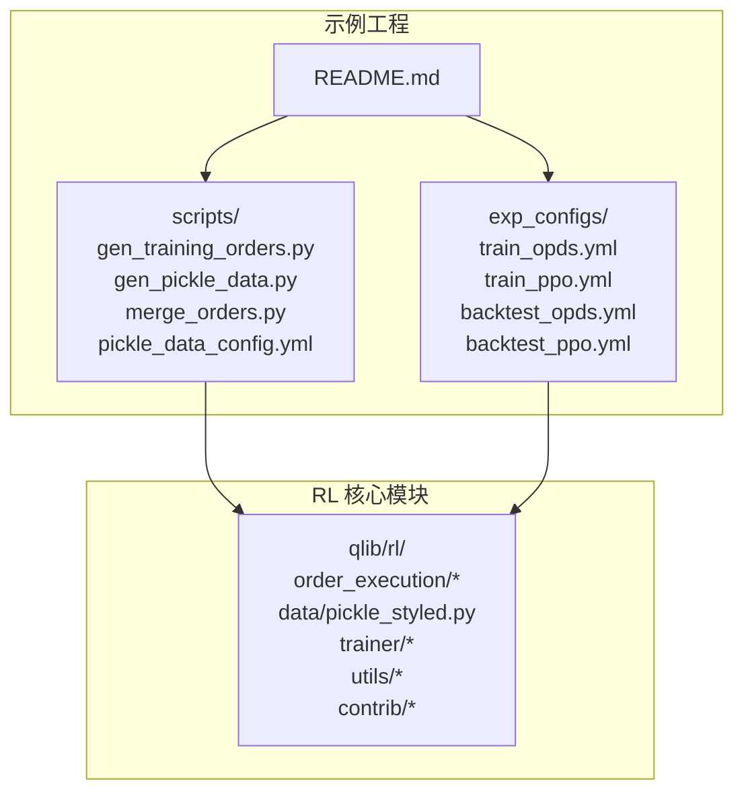
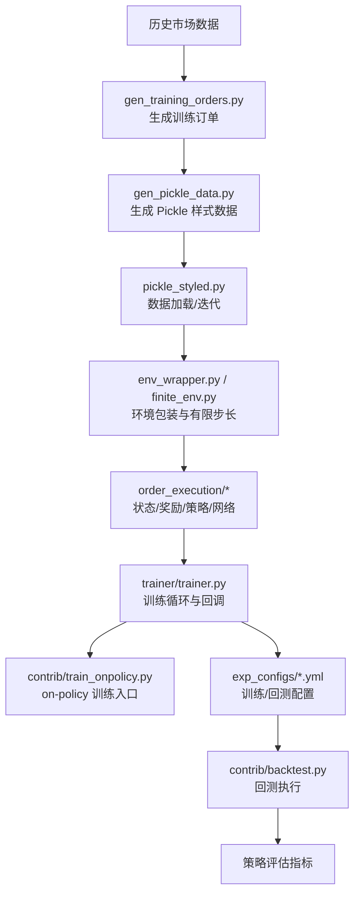
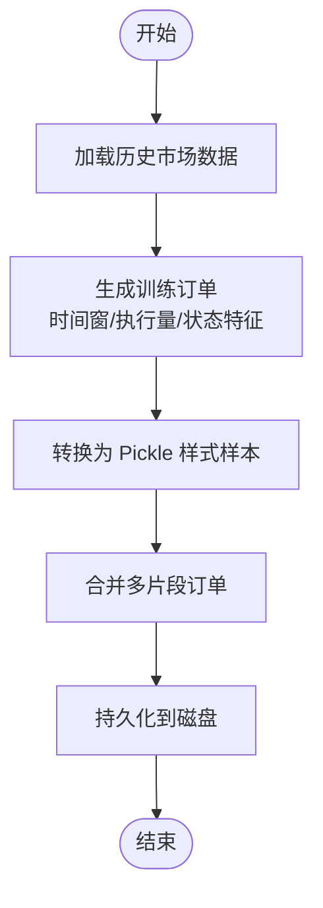
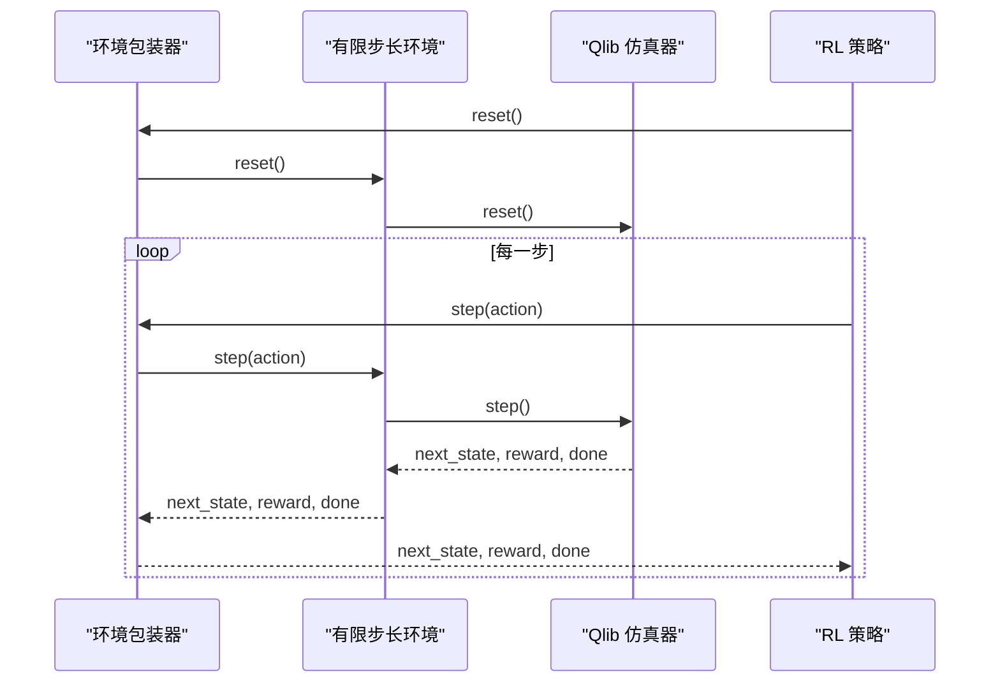
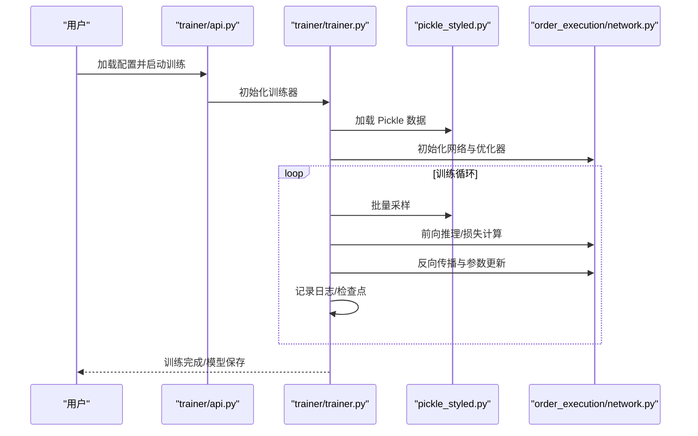
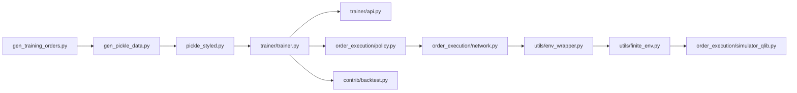

# 训练策略与流程

<cite>
**本文引用的文件**
- [examples/rl_order_execution/README.md](file://examples/rl_order_execution/README.md)
- [examples/rl_order_execution/scripts/gen_training_orders.py](file://examples/rl_order_execution/scripts/gen_training_orders.py)
- [examples/rl_order_execution/scripts/gen_pickle_data.py](file://examples/rl_order_execution/scripts/gen_pickle_data.py)
- [examples/rl_order_execution/scripts/merge_orders.py](file://examples/rl_order_execution/scripts/merge_orders.py)
- [examples/rl_order_execution/scripts/pickle_data_config.yml](file://examples/rl_order_execution/scripts/pickle_data_config.yml)
- [examples/rl_order_execution/exp_configs/train_opds.yml](file://examples/rl_order_execution/exp_configs/train_opds.yml)
- [examples/rl_order_execution/exp_configs/train_ppo.yml](file://examples/rl_order_execution/exp_configs/train_ppo.yml)
- [examples/rl_order_execution/exp_configs/backtest_opds.yml](file://examples/rl_order_execution/exp_configs/backtest_opds.yml)
- [examples/rl_order_execution/exp_configs/backtest_ppo.yml](file://examples/rl_order_execution/exp_configs/backtest_ppo.yml)
- [qlib/rl/order_execution/simulator_qlib.py](file://qlib/rl/order_execution/simulator_qlib.py)
- [qlib/rl/order_execution/state.py](file://qlib/rl/order_execution/state.py)
- [qlib/rl/order_execution/reward.py](file://qlib/rl/order_execution/reward.py)
- [qlib/rl/order_execution/policy.py](file://qlib/rl/order_execution/policy.py)
- [qlib/rl/order_execution/network.py](file://qlib/rl/order_execution/network.py)
- [qlib/rl/data/pickle_styled.py](file://qlib/rl/data/pickle_styled.py)
- [qlib/rl/trainer/trainer.py](file://qlib/rl/trainer/trainer.py)
- [qlib/rl/trainer/api.py](file://qlib/rl/trainer/api.py)
- [qlib/rl/contrib/train_onpolicy.py](file://qlib/rl/contrib/train_onpolicy.py)
- [qlib/rl/utils/env_wrapper.py](file://qlib/rl/utils/env_wrapper.py)
- [qlib/rl/utils/finite_env.py](file://qlib/rl/utils/finite_env.py)
- [qlib/rl/contrib/utils.py](file://qlib/rl/contrib/utils.py)
- [qlib/rl/contrib/backtest.py](file://qlib/rl/contrib/backtest.py)
</cite>

## 目录
1. [引言](#引言)
2. [项目结构](#项目结构)
3. [核心组件](#核心组件)
4. [架构总览](#架构总览)
5. [详细组件分析](#详细组件分析)
6. [依赖关系分析](#依赖关系分析)
7. [性能考虑](#性能考虑)
8. [故障排查指南](#故障排查指南)
9. [结论](#结论)
10. [附录](#附录)

## 引言
本文件面向强化学习（RL）在“订单执行”场景下的训练策略与流程，聚焦于训练数据准备、环境配置、训练流程设计、订单生成策略、Pickle 数据格式与合并方法、超参数调优、模型保存与加载、完整训练脚本使用指南（含数据预处理、模型训练与结果评估）、训练效率优化技巧以及常见问题解决方案。内容基于 Qlib 仓库中强化学习模块与示例工程，确保可操作性与可复现性。

## 项目结构
强化学习订单执行示例位于 examples/rl_order_execution 目录，包含以下关键部分：
- 脚本目录 scripts：用于生成训练订单、生成 Pickle 样式数据、合并订单与配置文件
- 配置目录 exp_configs：训练与回测的 YAML 配置
- 示例工程 README：总体说明与使用指引

图示来源
- [examples/rl_order_execution/README.md](file://examples/rl_order_execution/README.md)
- [examples/rl_order_execution/scripts/gen_training_orders.py](file://examples/rl_order_execution/scripts/gen_training_orders.py)
- [examples/rl_order_execution/scripts/gen_pickle_data.py](file://examples/rl_order_execution/scripts/gen_pickle_data.py)
- [examples/rl_order_execution/scripts/merge_orders.py](file://examples/rl_order_execution/scripts/merge_orders.py)
- [examples/rl_order_execution/scripts/pickle_data_config.yml](file://examples/rl_order_execution/scripts/pickle_data_config.yml)
- [examples/rl_order_execution/exp_configs/train_opds.yml](file://examples/rl_order_execution/exp_configs/train_opds.yml)
- [examples/rl_order_execution/exp_configs/train_ppo.yml](file://examples/rl_order_execution/exp_configs/train_ppo.yml)
- [examples/rl_order_execution/exp_configs/backtest_opds.yml](file://examples/rl_order_execution/exp_configs/backtest_opds.yml)
- [examples/rl_order_execution/exp_configs/backtest_ppo.yml](file://examples/rl_order_execution/exp_configs/backtest_ppo.yml)

章节来源
- [examples/rl_order_execution/README.md](file://examples/rl_order_execution/README.md)

## 核心组件
- 数据与环境
  - 订单生成器：从历史市场数据生成训练用的执行订单序列
  - Pickle 样式数据：以 Pickle 序列化存储的状态/动作/回报等样本
  - 环境包装器与有限步长环境：为 RL 提供稳定、可控的交互接口
- 训练框架
  - 训练器与 API：封装训练循环、回调、日志与检查点
  - on-policy 训练贡献模块：提供策略梯度类算法的实现入口
- 订单执行仿真与建模
  - 状态空间、奖励函数、策略网络与神经网络骨架
  - 基于 Qlib 的仿真器：对接真实市场数据进行订单执行仿真

章节来源
- [qlib/rl/order_execution/state.py](file://qlib/rl/order_execution/state.py)
- [qlib/rl/order_execution/reward.py](file://qlib/rl/order_execution/reward.py)
- [qlib/rl/order_execution/policy.py](file://qlib/rl/order_execution/policy.py)
- [qlib/rl/order_execution/network.py](file://qlib/rl/order_execution/network.py)
- [qlib/rl/order_execution/simulator_qlib.py](file://qlib/rl/order_execution/simulator_qlib.py)
- [qlib/rl/data/pickle_styled.py](file://qlib/rl/data/pickle_styled.py)
- [qlib/rl/trainer/trainer.py](file://qlib/rl/trainer/trainer.py)
- [qlib/rl/trainer/api.py](file://qlib/rl/trainer/api.py)
- [qlib/rl/contrib/train_onpolicy.py](file://qlib/rl/contrib/train_onpolicy.py)
- [qlib/rl/utils/env_wrapper.py](file://qlib/rl/utils/env_wrapper.py)
- [qlib/rl/utils/finite_env.py](file://qlib/rl/utils/finite_env.py)

## 架构总览
下图展示从数据到训练再到回测的整体流程，涵盖订单生成、Pickle 数据准备、训练与回测配置的关键节点。

图示来源
- [examples/rl_order_execution/scripts/gen_training_orders.py](file://examples/rl_order_execution/scripts/gen_training_orders.py)
- [examples/rl_order_execution/scripts/gen_pickle_data.py](file://examples/rl_order_execution/scripts/gen_pickle_data.py)
- [qlib/rl/data/pickle_styled.py](file://qlib/rl/data/pickle_styled.py)
- [qlib/rl/utils/env_wrapper.py](file://qlib/rl/utils/env_wrapper.py)
- [qlib/rl/utils/finite_env.py](file://qlib/rl/utils/finite_env.py)
- [qlib/rl/order_execution/state.py](file://qlib/rl/order_execution/state.py)
- [qlib/rl/order_execution/reward.py](file://qlib/rl/order_execution/reward.py)
- [qlib/rl/order_execution/policy.py](file://qlib/rl/order_execution/policy.py)
- [qlib/rl/order_execution/network.py](file://qlib/rl/order_execution/network.py)
- [qlib/rl/trainer/trainer.py](file://qlib/rl/trainer/trainer.py)
- [qlib/rl/contrib/train_onpolicy.py](file://qlib/rl/contrib/train_onpolicy.py)
- [examples/rl_order_execution/exp_configs/train_opds.yml](file://examples/rl_order_execution/exp_configs/train_opds.yml)
- [examples/rl_order_execution/exp_configs/train_ppo.yml](file://examples/rl_order_execution/exp_configs/train_ppo.yml)
- [examples/rl_order_execution/exp_configs/backtest_opds.yml](file://examples/rl_order_execution/exp_configs/backtest_opds.yml)
- [examples/rl_order_execution/exp_configs/backtest_ppo.yml](file://examples/rl_order_execution/exp_configs/backtest_ppo.yml)
- [qlib/rl/contrib/backtest.py](file://qlib/rl/contrib/backtest.py)

## 详细组件分析

### 数据准备与订单生成策略
- 生成训练订单
  - 输入：历史市场数据（如 OHLCV、买卖盘口等）
  - 输出：执行订单序列（包含标的、方向、总量、剩余量、时间窗等）
  - 关键逻辑：按时间窗口切分、计算每步执行量、构造状态特征
- Pickle 样式数据
  - 将每个时间步的状态、动作、回报、终止标志等打包为 Pickle 对象
  - 支持高效序列化与批量加载，便于 RL 训练
- 合并订单
  - 将多个订单或片段合并为统一格式，便于跨时间段/跨市场的数据整合

图示来源
- [examples/rl_order_execution/scripts/gen_training_orders.py](file://examples/rl_order_execution/scripts/gen_training_orders.py)
- [examples/rl_order_execution/scripts/gen_pickle_data.py](file://examples/rl_order_execution/scripts/gen_pickle_data.py)
- [examples/rl_order_execution/scripts/merge_orders.py](file://examples/rl_order_execution/scripts/merge_orders.py)
- [examples/rl_order_execution/scripts/pickle_data_config.yml](file://examples/rl_order_execution/scripts/pickle_data_config.yml)
- [qlib/rl/data/pickle_styled.py](file://qlib/rl/data/pickle_styled.py)

章节来源
- [examples/rl_order_execution/scripts/gen_training_orders.py](file://examples/rl_order_execution/scripts/gen_training_orders.py)
- [examples/rl_order_execution/scripts/gen_pickle_data.py](file://examples/rl_order_execution/scripts/gen_pickle_data.py)
- [examples/rl_order_execution/scripts/merge_orders.py](file://examples/rl_order_execution/scripts/merge_orders.py)
- [examples/rl_order_execution/scripts/pickle_data_config.yml](file://examples/rl_order_execution/scripts/pickle_data_config.yml)
- [qlib/rl/data/pickle_styled.py](file://qlib/rl/data/pickle_styled.py)

### 环境配置与仿真器
- 环境包装器
  - 将原始市场仿真器包装为 RL 友好的接口，提供 reset、step、render 等标准方法
  - 处理状态空间维度、动作空间离散化/连续化、边界与截断条件
- 有限步长环境
  - 控制单次交易的总步数，避免无限运行，提升稳定性与收敛性
- 基于 Qlib 的仿真器
  - 使用真实市场数据驱动的订单执行仿真，支持滑点、流动性成本、冲击成本等现实因素

图示来源
- [qlib/rl/utils/env_wrapper.py](file://qlib/rl/utils/env_wrapper.py)
- [qlib/rl/utils/finite_env.py](file://qlib/rl/utils/finite_env.py)
- [qlib/rl/order_execution/simulator_qlib.py](file://qlib/rl/order_execution/simulator_qlib.py)

章节来源
- [qlib/rl/utils/env_wrapper.py](file://qlib/rl/utils/env_wrapper.py)
- [qlib/rl/utils/finite_env.py](file://qlib/rl/utils/finite_env.py)
- [qlib/rl/order_execution/simulator_qlib.py](file://qlib/rl/order_execution/simulator_qlib.py)

### 训练流程设计与超参数调优
- 训练配置
  - 训练与回测配置通过 YAML 文件定义，包括算法类型（如 OPDS、PPO）、网络结构、优化器、学习率、batch size、训练步数等
- 训练器与 API
  - 训练器封装了数据加载、前向/反向传播、日志记录、检查点保存与恢复
  - API 提供高层接口，简化训练启动与参数注入
- on-policy 训练
  - 提供策略梯度类算法的通用实现入口，便于扩展不同算法（如 PPO、OPDS）

图示来源
- [examples/rl_order_execution/exp_configs/train_opds.yml](file://examples/rl_order_execution/exp_configs/train_opds.yml)
- [examples/rl_order_execution/exp_configs/train_ppo.yml](file://examples/rl_order_execution/exp_configs/train_ppo.yml)
- [qlib/rl/trainer/api.py](file://qlib/rl/trainer/api.py)
- [qlib/rl/trainer/trainer.py](file://qlib/rl/trainer/trainer.py)
- [qlib/rl/data/pickle_styled.py](file://qlib/rl/data/pickle_styled.py)
- [qlib/rl/order_execution/network.py](file://qlib/rl/order_execution/network.py)
- [qlib/rl/contrib/train_onpolicy.py](file://qlib/rl/contrib/train_onpolicy.py)

章节来源
- [examples/rl_order_execution/exp_configs/train_opds.yml](file://examples/rl_order_execution/exp_configs/train_opds.yml)
- [examples/rl_order_execution/exp_configs/train_ppo.yml](file://examples/rl_order_execution/exp_configs/train_ppo.yml)
- [qlib/rl/trainer/api.py](file://qlib/rl/trainer/api.py)
- [qlib/rl/trainer/trainer.py](file://qlib/rl/trainer/trainer.py)
- [qlib/rl/data/pickle_styled.py](file://qlib/rl/data/pickle_styled.py)
- [qlib/rl/order_execution/network.py](file://qlib/rl/order_execution/network.py)
- [qlib/rl/contrib/train_onpolicy.py](file://qlib/rl/contrib/train_onpolicy.py)

### 模型保存与加载机制
- 检查点管理
  - 训练器在指定间隔保存模型权重与优化器状态，支持断点续训
- 权重格式
  - 使用 Pickle 或框架原生格式保存网络权重，便于后续加载与部署
- 回测加载
  - 回测阶段通过配置文件加载已保存的模型权重，进行策略评估

章节来源
- [qlib/rl/trainer/trainer.py](file://qlib/rl/trainer/trainer.py)
- [examples/rl_order_execution/exp_configs/backtest_opds.yml](file://examples/rl_order_execution/exp_configs/backtest_opds.yml)
- [examples/rl_order_execution/exp_configs/backtest_ppo.yml](file://examples/rl_order_execution/exp_configs/backtest_ppo.yml)

### 完整训练脚本使用指南
- 数据预处理
  - 使用订单生成脚本与 Pickle 数据生成脚本，产出可用于 RL 的样本集
  - 使用合并脚本整合多源或多时段数据
- 训练
  - 通过训练配置文件选择算法与超参数，启动训练流程
  - 训练器自动管理数据加载、前向/反向传播与日志输出
- 结果评估
  - 使用回测配置文件加载训练得到的模型，执行回测并输出评估指标

章节来源
- [examples/rl_order_execution/scripts/gen_training_orders.py](file://examples/rl_order_execution/scripts/gen_training_orders.py)
- [examples/rl_order_execution/scripts/gen_pickle_data.py](file://examples/rl_order_execution/scripts/gen_pickle_data.py)
- [examples/rl_order_execution/scripts/merge_orders.py](file://examples/rl_order_execution/scripts/merge_orders.py)
- [examples/rl_order_execution/exp_configs/train_opds.yml](file://examples/rl_order_execution/exp_configs/train_opds.yml)
- [examples/rl_order_execution/exp_configs/train_ppo.yml](file://examples/rl_order_execution/exp_configs/train_ppo.yml)
- [examples/rl_order_execution/exp_configs/backtest_opds.yml](file://examples/rl_order_execution/exp_configs/backtest_opds.yml)
- [examples/rl_order_execution/exp_configs/backtest_ppo.yml](file://examples/rl_order_execution/exp_configs/backtest_ppo.yml)

## 依赖关系分析
- 组件耦合
  - 数据层（pickle_styled）与训练层（trainer）松耦合，通过配置文件与接口解耦
  - 策略/网络层与环境层通过接口抽象连接，便于替换不同算法与仿真器
- 外部依赖
  - 训练与回测依赖 YAML 配置文件；仿真器依赖 Qlib 数据与市场模型
- 潜在环路
  - 当前结构未见明显循环依赖；若自定义扩展需避免直接循环导入

图示来源
- [examples/rl_order_execution/scripts/gen_training_orders.py](file://examples/rl_order_execution/scripts/gen_training_orders.py)
- [examples/rl_order_execution/scripts/gen_pickle_data.py](file://examples/rl_order_execution/scripts/gen_pickle_data.py)
- [qlib/rl/data/pickle_styled.py](file://qlib/rl/data/pickle_styled.py)
- [qlib/rl/trainer/trainer.py](file://qlib/rl/trainer/trainer.py)
- [qlib/rl/trainer/api.py](file://qlib/rl/trainer/api.py)
- [qlib/rl/order_execution/policy.py](file://qlib/rl/order_execution/policy.py)
- [qlib/rl/order_execution/network.py](file://qlib/rl/order_execution/network.py)
- [qlib/rl/utils/env_wrapper.py](file://qlib/rl/utils/env_wrapper.py)
- [qlib/rl/utils/finite_env.py](file://qlib/rl/utils/finite_env.py)
- [qlib/rl/order_execution/simulator_qlib.py](file://qlib/rl/order_execution/simulator_qlib.py)
- [qlib/rl/contrib/backtest.py](file://qlib/rl/contrib/backtest.py)

## 性能考虑
- 数据批量化与缓存
  - 使用 Pickle 样式数据时，建议采用分块加载与内存映射，减少 IO 压力
- 训练稳定性
  - 合理设置 batch size、学习率与裁剪阈值，避免梯度爆炸
  - 在有限步长环境中控制最大步数，防止长时间无进展
- 并行化
  - 利用多进程/多线程并行生成订单与数据，加速预处理
- 内存管理
  - 及时释放不再使用的中间变量，避免 OOM

## 故障排查指南
- 训练不收敛或发散
  - 检查学习率与 batch size 设置是否合理
  - 确认状态归一化与奖励缩放是否一致
- 数据加载异常
  - 核对 Pickle 文件路径与配置项是否匹配
  - 确保订单生成与 Pickle 生成步骤顺序正确
- 回测结果异常
  - 检查回测配置中的模型路径与版本
  - 确认仿真器参数与实际市场数据一致

章节来源
- [qlib/rl/trainer/trainer.py](file://qlib/rl/trainer/trainer.py)
- [qlib/rl/data/pickle_styled.py](file://qlib/rl/data/pickle_styled.py)
- [examples/rl_order_execution/exp_configs/backtest_opds.yml](file://examples/rl_order_execution/exp_configs/backtest_opds.yml)
- [examples/rl_order_execution/exp_configs/backtest_ppo.yml](file://examples/rl_order_execution/exp_configs/backtest_ppo.yml)

## 结论
本文件系统梳理了强化学习订单执行的训练策略与流程，覆盖从数据准备、环境配置、训练设计到回测评估的全链路实践。通过 Pickle 样式数据与 on-policy 训练框架，结合 Qlib 仿真器，可在真实市场数据上高效训练并验证策略。建议在实际部署中持续优化超参数、监控训练稳定性，并建立完善的模型版本与回测体系。

## 附录
- 快速参考
  - 数据生成：订单生成 → Pickle 数据 → 合并
  - 训练：加载配置 → 启动训练器 → 保存检查点
  - 回测：加载模型 → 运行回测 → 评估指标