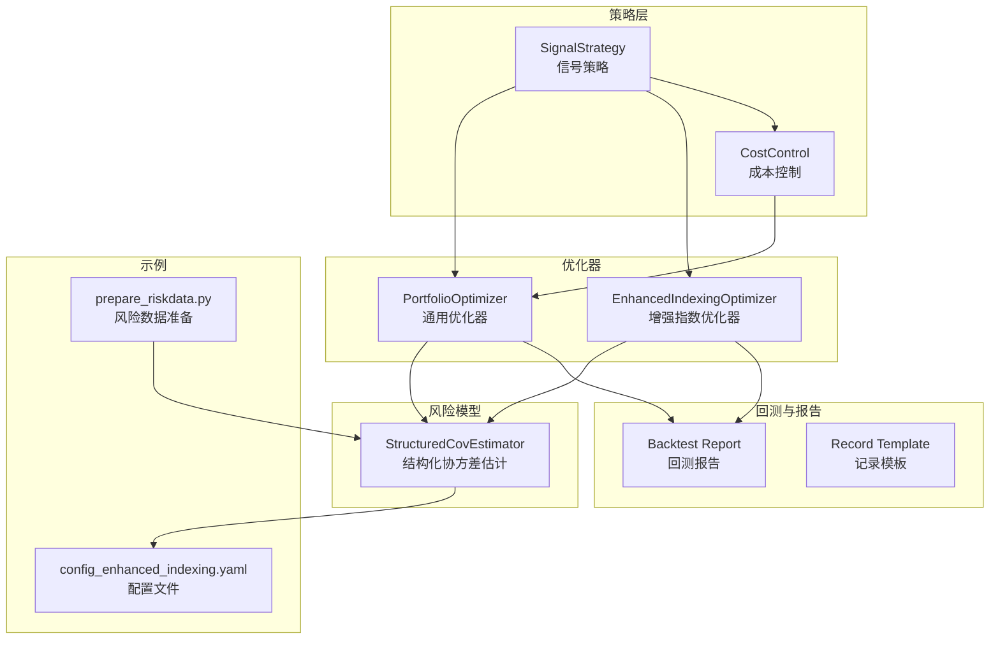
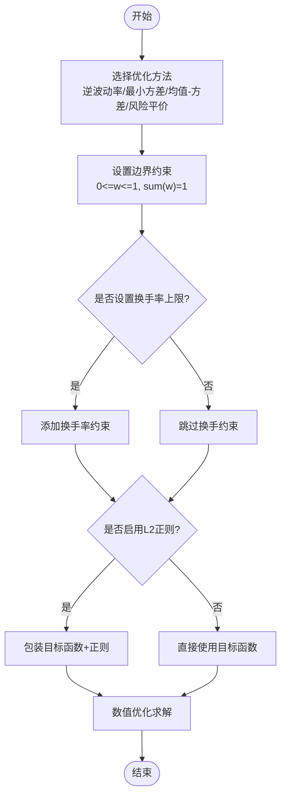
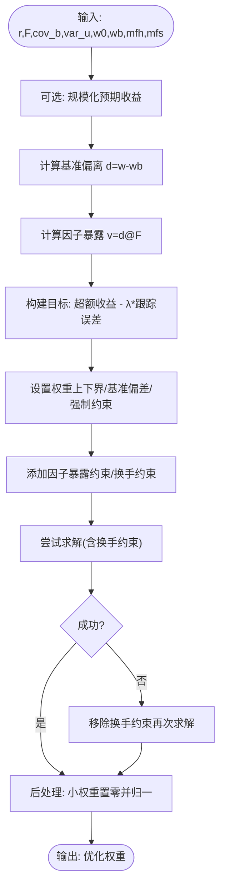
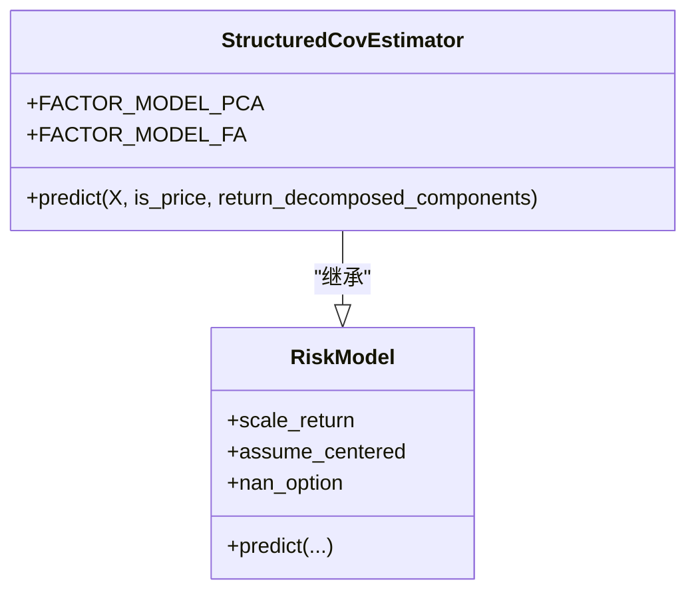
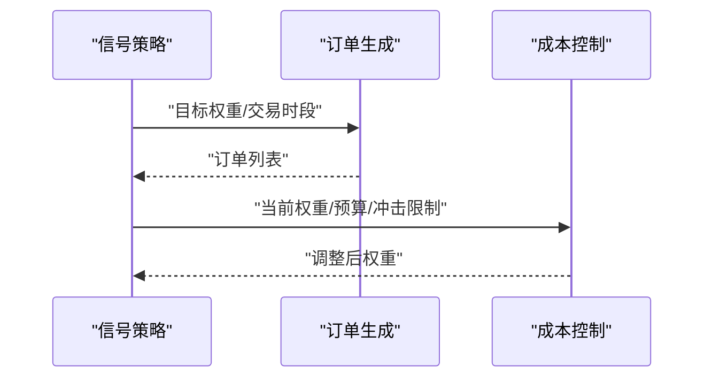
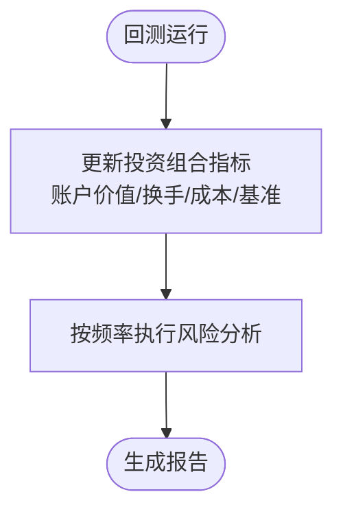
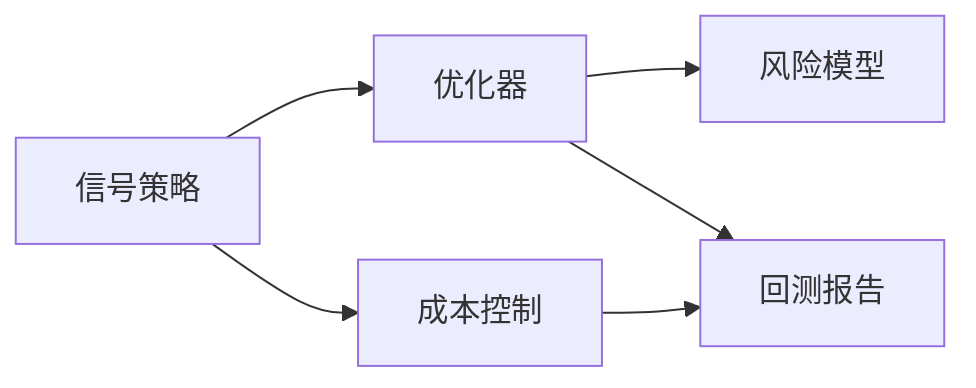

# 投资组合优化

<cite>
**本文引用的文件**
- [optimizer.py](file://qlib/contrib/strategy/optimizer/optimizer.py)
- [enhanced_indexing.py](file://qlib/contrib/strategy/optimizer/enhanced_indexing.py)
- [signal_strategy.py](file://qlib/contrib/strategy/signal_strategy.py)
- [cost_control.py](file://qlib/contrib/strategy/cost_control.py)
- [base.py](file://qlib/contrib/strategy/optimizer/base.py)
- [structured.py](file://qlib/model/riskmodel/structured.py)
- [base.py](file://qlib/model/riskmodel/base.py)
- [report.py](file://qlib/backtest/report.py)
- [record_temp.py](file://qlib/workflow/record_temp.py)
- [strategy.rst](file://docs/component/strategy.rst)
- [config_enhanced_indexing.yaml](file://examples/portfolio/config_enhanced_indexing.yaml)
- [prepare_riskdata.py](file://examples/portfolio/prepare_riskdata.py)
</cite>

## 目录
1. [引言](#引言)
2. [项目结构](#项目结构)
3. [核心组件](#核心组件)
4. [架构总览](#架构总览)
5. [详细组件分析](#详细组件分析)
6. [依赖关系分析](#依赖关系分析)
7. [性能考量](#性能考量)
8. [故障排查指南](#故障排查指南)
9. [结论](#结论)
10. [附录](#附录)

## 引言
本文件面向希望在Qlib中实现现代投资组合理论与实践应用的读者，系统梳理均值-方差优化、风险平价、Black-Litterman风格的增强指数跟踪策略，并结合风险因子模型与资产配置优化，给出从数据准备到回测报告的完整流程。文档同时覆盖约束条件（含换手率）设置、动态再平衡策略、风险度量、压力测试与情景分析的方法建议，并提供可操作的参数配置指导与案例参考。

## 项目结构
围绕投资组合优化的关键模块主要分布在以下位置：
- 策略层：信号策略与订单生成、成本控制与再平衡
- 优化器：通用均值-方差、全局最小方差、风险平价与增强指数跟踪
- 风险模型：结构化协方差估计（主成分/因子分析）
- 回测与报告：交易指标记录、风险分析与报告输出
- 示例：增强指数跟踪的配置与风险数据准备脚本



图表来源
- [signal_strategy.py:375-434](file://qlib/contrib/strategy/signal_strategy.py#L375-L434)
- [optimizer.py:105-230](file://qlib/contrib/strategy/optimizer/optimizer.py#L105-L230)
- [enhanced_indexing.py:87-201](file://qlib/contrib/strategy/optimizer/enhanced_indexing.py#L87-L201)
- [structured.py:11-65](file://qlib/model/riskmodel/structured.py#L11-L65)
- [report.py:150-187](file://qlib/backtest/report.py#L150-L187)
- [record_temp.py:495-512](file://qlib/workflow/record_temp.py#L495-L512)
- [config_enhanced_indexing.yaml](file://examples/portfolio/config_enhanced_indexing.yaml)
- [prepare_riskdata.py](file://examples/portfolio/prepare_riskdata.py)

章节来源
- [signal_strategy.py:375-434](file://qlib/contrib/strategy/signal_strategy.py#L375-L434)
- [optimizer.py:105-230](file://qlib/contrib/strategy/optimizer/optimizer.py#L105-L230)
- [enhanced_indexing.py:87-201](file://qlib/contrib/strategy/optimizer/enhanced_indexing.py#L87-L201)
- [structured.py:11-65](file://qlib/model/riskmodel/structured.py#L11-L65)
- [report.py:150-187](file://qlib/backtest/report.py#L150-L187)
- [record_temp.py:495-512](file://qlib/workflow/record_temp.py#L495-L512)
- [strategy.rst:71-95](file://docs/component/strategy.rst#L71-L95)
- [config_enhanced_indexing.yaml](file://examples/portfolio/config_enhanced_indexing.yaml)
- [prepare_riskdata.py](file://examples/portfolio/prepare_riskdata.py)

## 核心组件
- 通用投资组合优化器：支持逆波动率、全局最小方差、均值-方差、风险平价等方法；内置非负权重、全投资、换手率上限等约束；支持L2正则与求解器参数。
- 增强指数优化器：基于风险因子模型，最大化超额收益并控制跟踪误差；支持基准偏差、因子暴露偏差、强制持有/卖出掩码、换手率约束与数值稳定处理。
- 风险因子模型：结构化协方差估计器，支持PCA/因子分析两类潜因子模型，输出因子载荷、因子协方差与特异方差，便于构建因子模型。
- 信号策略与成本控制：根据预测得分生成目标权重与订单列表，结合滑点与冲击成本限制进行预算分配与再平衡。
- 回测与报告：记录账户价值、换手、成本等指标，支持按频率进行风险分析与超额收益分解。

章节来源
- [optimizer.py:105-230](file://qlib/contrib/strategy/optimizer/optimizer.py#L105-L230)
- [enhanced_indexing.py:87-201](file://qlib/contrib/strategy/optimizer/enhanced_indexing.py#L87-L201)
- [structured.py:11-65](file://qlib/model/riskmodel/structured.py#L11-L65)
- [signal_strategy.py:375-434](file://qlib/contrib/strategy/signal_strategy.py#L375-L434)
- [cost_control.py:81-117](file://qlib/contrib/strategy/cost_control.py#L81-L117)
- [report.py:150-187](file://qlib/backtest/report.py#L150-L187)
- [record_temp.py:495-512](file://qlib/workflow/record_temp.py#L495-L512)

## 架构总览
下图展示从信号到订单、再到优化与回测的整体流程：

```mermaid
sequenceDiagram
participant Pred as "预测信号"
participant Strat as "信号策略"
participant Opt as "优化器"
participant Cost as "成本控制"
participant RM as "风险模型"
participant BT as "回测报告"
Pred->>Strat : "预测分数"
Strat->>Opt : "目标权重/约束参数"
Opt->>RM : "协方差/因子模型"
RM-->>Opt : "协方差/因子载荷/因子协方差/特异方差"
Opt-->>Strat : "优化后的权重"
Strat->>Cost : "权重与市场冲击参数"
Cost-->>Strat : "调整后权重"
Strat->>BT : "订单与交易指标"
BT-->>Strat : "回测结果与风险分析"
```

图表来源
- [signal_strategy.py:375-434](file://qlib/contrib/strategy/signal_strategy.py#L375-L434)
- [optimizer.py:105-230](file://qlib/contrib/strategy/optimizer/optimizer.py#L105-L230)
- [enhanced_indexing.py:87-201](file://qlib/contrib/strategy/optimizer/enhanced_indexing.py#L87-L201)
- [cost_control.py:81-117](file://qlib/contrib/strategy/cost_control.py#L81-L117)
- [report.py:150-187](file://qlib/backtest/report.py#L150-L187)

## 详细组件分析

### 通用投资组合优化器
- 方法族
  - 逆波动率：按波动率倒数配权，再归一化。
  - 全局最小方差：最小化权重的二次型，仅含方差项。
  - 均值-方差：最大化期望收益与二次风险的折中，受风险厌恶系数控制。
  - 风险平价：使各资产对整体风险的边际贡献相等，目标函数为各资产贡献与平均贡献的偏差平方和。
- 约束
  - 非负权重与全投资约束。
  - 换手率上限（基于前一期权重）。
  - 可选L2正则以提升稳定性。
- 求解
  - 使用数值优化器求解，支持传入求解器参数与初始化。



图表来源
- [optimizer.py:105-230](file://qlib/contrib/strategy/optimizer/optimizer.py#L105-L230)
- [optimizer.py:241-265](file://qlib/contrib/strategy/optimizer/optimizer.py#L241-L265)

章节来源
- [optimizer.py:105-230](file://qlib/contrib/strategy/optimizer/optimizer.py#L105-L230)
- [optimizer.py:241-265](file://qlib/contrib/strategy/optimizer/optimizer.py#L241-L265)

### 增强指数优化器（Black-Litterman风格的增强跟踪）
- 输入
  - 预期收益向量、因子载荷矩阵、因子协方差、特异方差、当前权重、基准权重、强制持有/卖出掩码、各类偏差与换手约束。
- 目标
  - 最大化超额收益与跟踪误差风险的折中，跟踪误差由因子暴露与特异方差共同构成。
- 约束
  - 基准偏差、因子暴露偏差、强制持有/卖出、换手率上限、全投资与非负权重。
- 数值稳健性
  - 多轮尝试求解，失败时移除换手约束或返回当前权重；小权重置零并重归一。



图表来源
- [enhanced_indexing.py:87-201](file://qlib/contrib/strategy/optimizer/enhanced_indexing.py#L87-L201)

章节来源
- [enhanced_indexing.py:87-201](file://qlib/contrib/strategy/optimizer/enhanced_indexing.py#L87-L201)

### 风险因子模型与结构化协方差估计
- 结构化协方差形式：协方差 = 因子载荷×因子协方差×载荷转置 + 对角(特异方差)。
- 支持两种潜因子模型：PCA与因子分析，自动估计因子载荷与特异方差。
- 输出可用于增强指数优化器的因子暴露与协方差输入。



图表来源
- [structured.py:11-65](file://qlib/model/riskmodel/structured.py#L11-L65)
- [base.py:62-98](file://qlib/model/riskmodel/base.py#L62-L98)

章节来源
- [structured.py:11-65](file://qlib/model/riskmodel/structured.py#L11-L65)
- [base.py:62-98](file://qlib/model/riskmodel/base.py#L62-L98)

### 信号策略与成本控制
- 信号策略：根据预测得分生成目标权重与订单列表，结合风险程度与交易时段生成交易决策。
- 成本控制：按冲击限制与预算约束进行买卖分配，先回收资金再按缺口比例分配购买额度，避免超支。



图表来源
- [signal_strategy.py:359-373](file://qlib/contrib/strategy/signal_strategy.py#L359-L373)
- [cost_control.py:81-117](file://qlib/contrib/strategy/cost_control.py#L81-L117)

章节来源
- [signal_strategy.py:359-373](file://qlib/contrib/strategy/signal_strategy.py#L359-L373)
- [cost_control.py:81-117](file://qlib/contrib/strategy/cost_control.py#L81-L117)

### 回测与报告
- 记录账户价值、换手、成本、基准收益等指标，支持不同频率的风险分析。
- 提供超额收益（无成本/有成本）与最大回撤等统计指标。



图表来源
- [report.py:150-187](file://qlib/backtest/report.py#L150-L187)
- [record_temp.py:495-512](file://qlib/workflow/record_temp.py#L495-L512)

章节来源
- [report.py:150-187](file://qlib/backtest/report.py#L150-L187)
- [record_temp.py:495-512](file://qlib/workflow/record_temp.py#L495-L512)

## 依赖关系分析
- 优化器依赖于风险模型提供的协方差或因子分解；信号策略与成本控制共同决定最终下单权重。
- 回测报告依赖于交易记录与基准采样，用于生成风险分析与收益指标。



图表来源
- [optimizer.py:105-230](file://qlib/contrib/strategy/optimizer/optimizer.py#L105-L230)
- [enhanced_indexing.py:87-201](file://qlib/contrib/strategy/optimizer/enhanced_indexing.py#L87-L201)
- [signal_strategy.py:375-434](file://qlib/contrib/strategy/signal_strategy.py#L375-L434)
- [cost_control.py:81-117](file://qlib/contrib/strategy/cost_control.py#L81-L117)
- [report.py:150-187](file://qlib/backtest/report.py#L150-L187)

章节来源
- [optimizer.py:105-230](file://qlib/contrib/strategy/optimizer/optimizer.py#L105-L230)
- [enhanced_indexing.py:87-201](file://qlib/contrib/strategy/optimizer/enhanced_indexing.py#L87-L201)
- [signal_strategy.py:375-434](file://qlib/contrib/strategy/signal_strategy.py#L375-L434)
- [cost_control.py:81-117](file://qlib/contrib/strategy/cost_control.py#L81-L117)
- [report.py:150-187](file://qlib/backtest/report.py#L150-L187)

## 性能考量
- 优化器
  - 均值-方差与风险平价问题规模较大时，建议启用L2正则与合适的求解器参数，以提高数值稳定性。
  - 换手率约束可能增加求解难度，必要时可分步放宽或采用启发式近似。
- 风险模型
  - PCA/因子分析的降维效果与样本长度密切相关，建议确保足够的观测数量与合理的因子数量。
- 回测
  - 高频场景下，注意订单生成与执行的开销；批量处理与缓存有助于提升效率。

## 故障排查指南
- 优化失败
  - 现象：优化状态非最优或不准确。
  - 排查：检查约束是否过于严格（如换手率上限），尝试移除换手约束或放宽边界；确认协方差矩阵正定性。
- 权重异常
  - 现象：出现极小非零权重或负权重。
  - 排查：开启权重阈值清理并重归一；检查输入收益与协方差是否合理。
- 回测指标缺失
  - 现象：某些频率报告未生成。
  - 排查：确认工作流配置中已启用相应频率的指标生成；检查基准采样是否可用。

章节来源
- [enhanced_indexing.py:166-195](file://qlib/contrib/strategy/optimizer/enhanced_indexing.py#L166-L195)
- [optimizer.py:260-265](file://qlib/contrib/strategy/optimizer/optimizer.py#L260-L265)
- [record_temp.py:495-512](file://qlib/workflow/record_temp.py#L495-L512)

## 结论
Qlib在投资组合优化方面提供了从信号到订单、从因子模型到回测报告的完整链路。通过通用优化器与增强指数优化器，用户可以灵活地实现均值-方差、风险平价与增强跟踪等策略；配合风险模型与成本控制机制，能够有效管理换手与交易成本；回测与报告模块则为策略评估与风险分析提供了坚实基础。建议在实践中结合业务目标与数据质量，合理设置约束与参数，并持续迭代优化流程。

## 附录

### 实际案例与参数配置指导
- 增强指数跟踪配置
  - 参考文件：[config_enhanced_indexing.yaml](file://examples/portfolio/config_enhanced_indexing.yaml)
  - 关键要点：指定风险模型路径、市场范围、换手限制、优化器参数（如风险厌恶、偏差约束、换手上限等）。
- 风险数据准备
  - 参考文件：[prepare_riskdata.py](file://examples/portfolio/prepare_riskdata.py)
  - 关键要点：准备因子载荷、因子协方差、特异方差与黑名单等数据，确保命名与路径一致。
- 策略文档参考
  - 参考文件：[strategy.rst:71-95](file://docs/component/strategy.rst#L71-L95)
  - 关键要点：了解Top-K/Drop等再平衡规则与交易行为。

章节来源
- [config_enhanced_indexing.yaml](file://examples/portfolio/config_enhanced_indexing.yaml)
- [prepare_riskdata.py](file://examples/portfolio/prepare_riskdata.py)
- [strategy.rst:71-95](file://docs/component/strategy.rst#L71-L95)