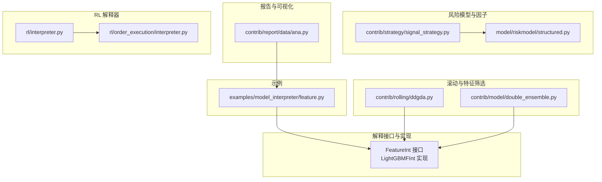
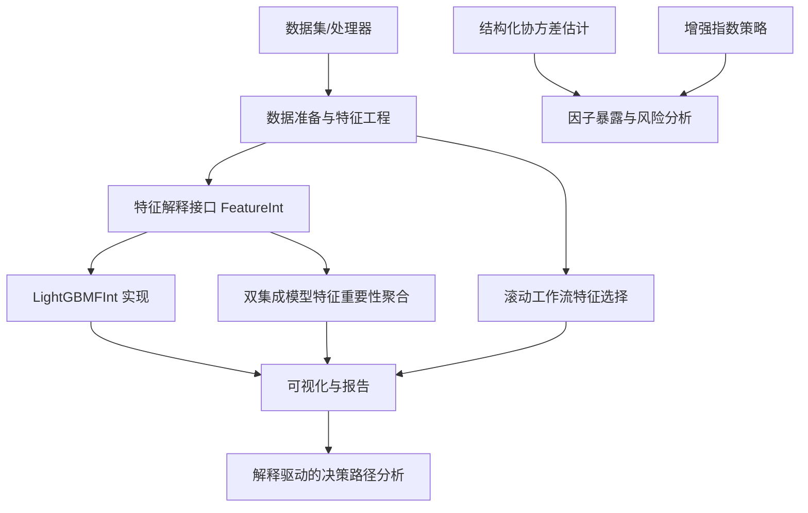
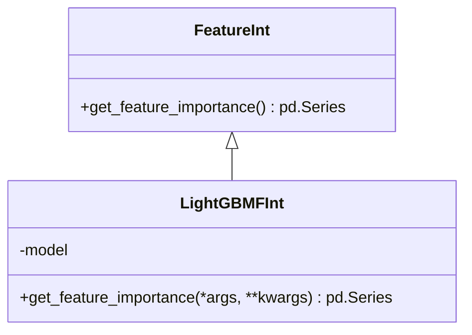
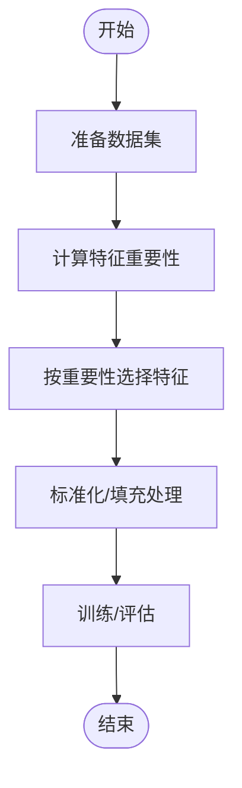
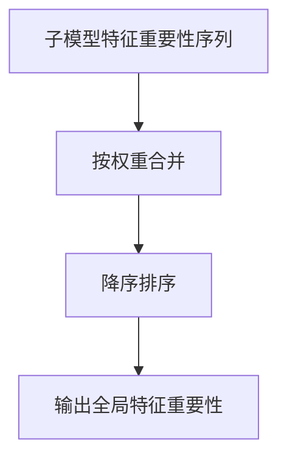
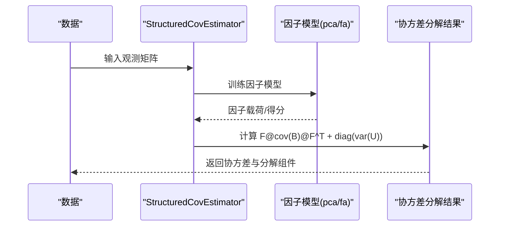
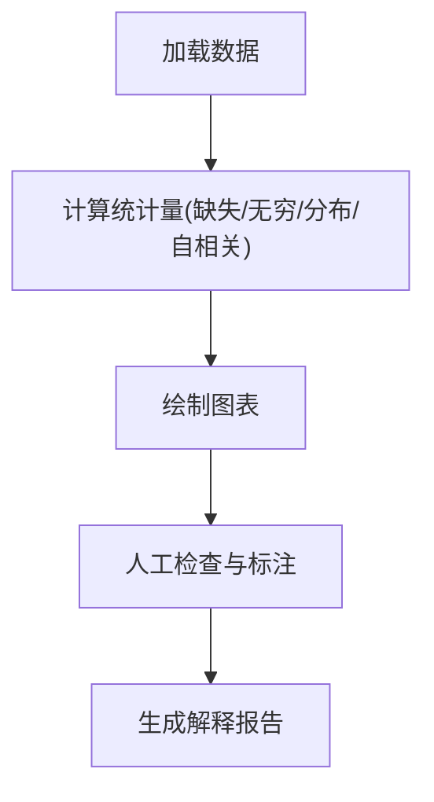
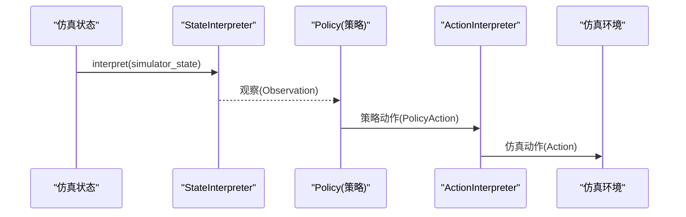
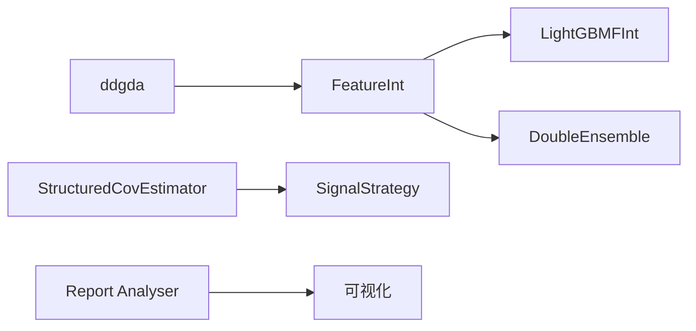

# 模型解释器

<cite>
**本文引用的文件**
- [qlib/model/interpret/base.py](file://qlib/model/interpret/base.py)
- [examples/model_interpreter/feature.py](file://examples/model_interpreter/feature.py)
- [qlib/contrib/rolling/ddgda.py](file://qlib/contrib/rolling/ddgda.py)
- [qlib/contrib/model/double_ensemble.py](file://qlib/contrib/model/double_ensemble.py)
- [qlib/contrib/report/data/ana.py](file://qlib/contrib/report/data/ana.py)
- [qlib/model/riskmodel/structured.py](file://qlib/model/riskmodel/structured.py)
- [qlib/contrib/strategy/signal_strategy.py](file://qlib/contrib/strategy/signal_strategy.py)
- [qlib/rl/interpreter.py](file://qlib/rl/interpreter.py)
- [qlib/rl/order_execution/interpreter.py](file://qlib/rl/order_execution/interpreter.py)
</cite>

## 目录
1. [引言](#引言)
2. [项目结构](#项目结构)
3. [核心组件](#核心组件)
4. [架构总览](#架构总览)
5. [详细组件分析](#详细组件分析)
6. [依赖关系分析](#依赖关系分析)
7. [性能考量](#性能考量)
8. [故障排查指南](#故障排查指南)
9. [结论](#结论)
10. [附录](#附录)

## 引言
本文件系统化梳理 Qlib 中与“模型解释”相关的能力与实践，聚焦于量化研究场景下的模型可解释性技术，覆盖特征重要性分析、局部解释与全局解释方法，并结合仓库中已有的接口与示例，给出可落地的解释流程（特征贡献度计算、决策路径分析、异常检测），以及在因子分析、风险管理和策略优化中的应用思路。同时，对 SHAP、LIME 等解释算法的实现与使用进行说明与扩展建议。

## 项目结构
围绕模型解释，Qlib 在以下模块提供了基础能力与示例：
- 解释接口与实现：定义通用特征解释接口与 LightGBM 的特征重要性实现
- 示例：提供特征解释的使用示例脚本
- 滚动工作流与特征筛选：在滚动训练中基于特征重要性进行特征选择与数据预处理
- 风险模型与因子暴露：支持因子分析与协方差分解，为解释提供因子维度视角
- 报告与可视化：提供特征分布、缺失值、无穷值、自相关等分析工具，辅助解释
- RL 解释器：状态与动作解释器抽象，便于在强化学习任务中进行决策路径分析

**图示来源**
- [qlib/model/interpret/base.py:12-45](file://qlib/model/interpret/base.py#L12-L45)
- [examples/model_interpreter/feature.py](file://examples/model_interpreter/feature.py)
- [qlib/contrib/rolling/ddgda.py:117-212](file://qlib/contrib/rolling/ddgda.py#L117-L212)
- [qlib/contrib/model/double_ensemble.py:266-277](file://qlib/contrib/model/double_ensemble.py#L266-L277)
- [qlib/model/riskmodel/structured.py:11-94](file://qlib/model/riskmodel/structured.py#L11-L94)
- [qlib/contrib/strategy/signal_strategy.py:406-460](file://qlib/contrib/strategy/signal_strategy.py#L406-L460)
- [qlib/contrib/report/data/ana.py:45-161](file://qlib/contrib/report/data/ana.py#L45-L161)
- [qlib/rl/interpreter.py:18-83](file://qlib/rl/interpreter.py#L18-L83)
- [qlib/rl/order_execution/interpreter.py:55-245](file://qlib/rl/order_execution/interpreter.py#L55-L245)

**章节来源**
- [qlib/model/interpret/base.py:1-45](file://qlib/model/interpret/base.py#L1-L45)
- [examples/model_interpreter/feature.py](file://examples/model_interpreter/feature.py)
- [qlib/contrib/rolling/ddgda.py:117-212](file://qlib/contrib/rolling/ddgda.py#L117-L212)
- [qlib/contrib/model/double_ensemble.py:266-277](file://qlib/contrib/model/double_ensemble.py#L266-L277)
- [qlib/model/riskmodel/structured.py:11-94](file://qlib/model/riskmodel/structured.py#L11-L94)
- [qlib/contrib/strategy/signal_strategy.py:406-460](file://qlib/contrib/strategy/signal_strategy.py#L406-L460)
- [qlib/contrib/report/data/ana.py:45-161](file://qlib/contrib/report/data/ana.py#L45-L161)
- [qlib/rl/interpreter.py:18-83](file://qlib/rl/interpreter.py#L18-L83)
- [qlib/rl/order_execution/interpreter.py:55-245](file://qlib/rl/order_execution/interpreter.py#L55-L245)

## 核心组件
- 特征解释接口与实现
  - FeatureInt：定义统一的特征解释接口，要求实现获取特征重要性的方法
  - LightGBMFInt：基于 LightGBM Booster 的特征重要性实现，返回按重要性排序的特征 Series
- 示例：examples/model_interpreter/feature.py 提供了如何加载模型并调用特征重要性接口的示例脚本
- 滚动工作流中的特征重要性应用：ddgda.py 在准备数据时可基于特征重要性进行特征选择与标准化
- 双集成模型的特征重要性聚合：double_ensemble.py 将子模型的特征重要性按权重聚合，输出全局特征重要性
- 风险模型与因子暴露：structured.py 支持基于主成分或因子分析估计结构化协方差，为解释提供因子维度
- 报告与可视化：ana.py 提供缺失值、无穷值、分布、自相关等分析工具，辅助解释数据层面的问题
- RL 解释器：rl/interpreter.py 与 rl/order_execution/interpreter.py 定义状态与动作解释器抽象，便于在强化学习场景下进行决策路径分析

**章节来源**
- [qlib/model/interpret/base.py:12-45](file://qlib/model/interpret/base.py#L12-L45)
- [examples/model_interpreter/feature.py](file://examples/model_interpreter/feature.py)
- [qlib/contrib/rolling/ddgda.py:117-212](file://qlib/contrib/rolling/ddgda.py#L117-L212)
- [qlib/contrib/model/double_ensemble.py:266-277](file://qlib/contrib/model/double_ensemble.py#L266-L277)
- [qlib/model/riskmodel/structured.py:11-94](file://qlib/model/riskmodel/structured.py#L11-L94)
- [qlib/contrib/report/data/ana.py:45-161](file://qlib/contrib/report/data/ana.py#L45-L161)
- [qlib/rl/interpreter.py:18-83](file://qlib/rl/interpreter.py#L18-L83)
- [qlib/rl/order_execution/interpreter.py:55-245](file://qlib/rl/order_execution/interpreter.py#L55-L245)

## 架构总览
下图展示了模型解释在 Qlib 中的关键交互：从数据准备到特征重要性计算，再到可视化与策略应用。

**图示来源**
- [qlib/model/interpret/base.py:12-45](file://qlib/model/interpret/base.py#L12-L45)
- [qlib/contrib/rolling/ddgda.py:117-212](file://qlib/contrib/rolling/ddgda.py#L117-L212)
- [qlib/contrib/model/double_ensemble.py:266-277](file://qlib/contrib/model/double_ensemble.py#L266-L277)
- [qlib/model/riskmodel/structured.py:11-94](file://qlib/model/riskmodel/structured.py#L11-L94)
- [qlib/contrib/strategy/signal_strategy.py:406-460](file://qlib/contrib/strategy/signal_strategy.py#L406-L460)
- [qlib/contrib/report/data/ana.py:45-161](file://qlib/contrib/report/data/ana.py#L45-L161)

## 详细组件分析

### 组件一：特征解释接口与 LightGBM 实现
- 设计要点
  - FeatureInt 抽象出“特征解释”的统一接口，便于不同模型提供一致的特征重要性输出
  - LightGBMFInt 基于 LightGBM Booster 的 feature_importance 与 feature_name，构造按重要性排序的 Series
- 使用建议
  - 在模型训练完成后，优先通过该接口获取特征重要性，作为后续特征筛选与解释的基础
  - 对于非 LightGBM 模型，可参考该接口设计自定义实现

**图示来源**
- [qlib/model/interpret/base.py:12-45](file://qlib/model/interpret/base.py#L12-L45)

**章节来源**
- [qlib/model/interpret/base.py:12-45](file://qlib/model/interpret/base.py#L12-L45)

### 组件二：示例脚本与使用流程
- 示例脚本位置：examples/model_interpreter/feature.py
- 典型流程
  - 加载训练好的模型
  - 调用 FeatureInt 接口获取特征重要性
  - 结合可视化工具生成报告
- 扩展建议
  - 将该流程封装为标准记录器产物，便于实验复现与对比

**章节来源**
- [examples/model_interpreter/feature.py](file://examples/model_interpreter/feature.py)

### 组件三：滚动工作流中的特征重要性应用
- 关键点
  - 在数据准备阶段，可根据特征重要性选择 top-N 特征，减少噪声并提升稳定性
  - 可对特征进行标准化与填充处理，进一步提升解释质量
- 流程示意

**图示来源**
- [qlib/contrib/rolling/ddgda.py:117-212](file://qlib/contrib/rolling/ddgda.py#L117-L212)

**章节来源**
- [qlib/contrib/rolling/ddgda.py:117-212](file://qlib/contrib/rolling/ddgda.py#L117-L212)

### 组件四：双集成模型的特征重要性聚合
- 关键点
  - 将多个子模型的特征重要性按各自权重聚合，得到全局特征重要性排序
  - 适用于集成模型的全局解释
- 流程示意

**图示来源**
- [qlib/contrib/model/double_ensemble.py:266-277](file://qlib/contrib/model/double_ensemble.py#L266-L277)

**章节来源**
- [qlib/contrib/model/double_ensemble.py:266-277](file://qlib/contrib/model/double_ensemble.py#L266-L277)

### 组件五：风险模型与因子暴露（全局解释）
- 结构化协方差估计
  - 基于主成分或因子分析估计因子暴露矩阵与协方差，支持分解为因子协方差与特异性方差之和
- 因子分析在解释中的作用
  - 将高维特征映射到低维因子空间，便于理解模型的风险来源与驱动因素
- 增强指数策略中的应用
  - 从风险模型数据源加载因子暴露、因子协方差与特异性风险，用于组合优化与风险控制

**图示来源**
- [qlib/model/riskmodel/structured.py:11-94](file://qlib/model/riskmodel/structured.py#L11-L94)
- [qlib/contrib/strategy/signal_strategy.py:406-460](file://qlib/contrib/strategy/signal_strategy.py#L406-L460)

**章节来源**
- [qlib/model/riskmodel/structured.py:11-94](file://qlib/model/riskmodel/structured.py#L11-L94)
- [qlib/contrib/strategy/signal_strategy.py:406-460](file://qlib/contrib/strategy/signal_strategy.py#L406-L460)

### 组件六：报告与可视化（异常检测与解释）
- 分析工具
  - 缺失值统计与比例、无穷值检测、特征分布直方图、自相关分析、偏度/峰度等
- 应用价值
  - 识别异常特征、异常样本，辅助解释模型行为与偏差来源
- 使用建议
  - 在特征重要性之后，结合这些统计图表定位潜在问题特征或样本

**图示来源**
- [qlib/contrib/report/data/ana.py:45-161](file://qlib/contrib/report/data/ana.py#L45-L161)

**章节来源**
- [qlib/contrib/report/data/ana.py:45-161](file://qlib/contrib/report/data/ana.py#L45-L161)

### 组件七：RL 解释器（决策路径分析）
- 抽象
  - StateInterpreter：将仿真状态映射为策略观察（状态解释）
  - ActionInterpreter：将策略动作映射为仿真可接受的动作（动作解释）
- 应用
  - 在强化学习订单执行等任务中，通过解释器明确“输入状态→策略→仿真动作”的映射，便于调试与解释

**图示来源**
- [qlib/rl/interpreter.py:18-83](file://qlib/rl/interpreter.py#L18-L83)
- [qlib/rl/order_execution/interpreter.py:55-245](file://qlib/rl/order_execution/interpreter.py#L55-L245)

**章节来源**
- [qlib/rl/interpreter.py:18-83](file://qlib/rl/interpreter.py#L18-L83)
- [qlib/rl/order_execution/interpreter.py:55-245](file://qlib/rl/order_execution/interpreter.py#L55-L245)

## 依赖关系分析
- 组件耦合
  - FeatureInt 与具体模型实现解耦，便于扩展到其他模型
  - ddgda 与 double_ensemble 依赖特征重要性接口，形成“数据→解释→筛选”的闭环
  - structured 与 signal_strategy 通过因子暴露与协方差为解释提供风险维度
- 外部依赖
  - LightGBM Booster（用于特征重要性）
  - PCA/FA（用于因子建模）
  - 可视化库（用于报告与图表）

**图示来源**
- [qlib/model/interpret/base.py:12-45](file://qlib/model/interpret/base.py#L12-L45)
- [qlib/contrib/rolling/ddgda.py:117-212](file://qlib/contrib/rolling/ddgda.py#L117-L212)
- [qlib/contrib/model/double_ensemble.py:266-277](file://qlib/contrib/model/double_ensemble.py#L266-L277)
- [qlib/model/riskmodel/structured.py:11-94](file://qlib/model/riskmodel/structured.py#L11-L94)
- [qlib/contrib/strategy/signal_strategy.py:406-460](file://qlib/contrib/strategy/signal_strategy.py#L406-L460)
- [qlib/contrib/report/data/ana.py:45-161](file://qlib/contrib/report/data/ana.py#L45-L161)

**章节来源**
- [qlib/model/interpret/base.py:12-45](file://qlib/model/interpret/base.py#L12-L45)
- [qlib/contrib/rolling/ddgda.py:117-212](file://qlib/contrib/rolling/ddgda.py#L117-L212)
- [qlib/contrib/model/double_ensemble.py:266-277](file://qlib/contrib/model/double_ensemble.py#L266-L277)
- [qlib/model/riskmodel/structured.py:11-94](file://qlib/model/riskmodel/structured.py#L11-L94)
- [qlib/contrib/strategy/signal_strategy.py:406-460](file://qlib/contrib/strategy/signal_strategy.py#L406-L460)
- [qlib/contrib/report/data/ana.py:45-161](file://qlib/contrib/report/data/ana.py#L45-L161)

## 性能考量
- 特征重要性计算
  - LightGBM 的 feature_importance 计算复杂度与树数量、特征数线性相关；在大规模特征场景下建议先做特征筛选
- 滚动工作流
  - 特征标准化与填充会增加预处理开销；可在缓存与批处理上优化
- 风险模型
  - PCA/FA 的迭代收敛与随机种子设置会影响结果稳定性；建议固定随机种子并监控收敛指标
- 可视化
  - 大规模数据的直方图与自相关图可能成为瓶颈；可采用分桶、采样或增量计算

## 故障排查指南
- 特征重要性为空或全零
  - 检查模型是否正确初始化与训练
  - 确认特征名称与索引一致性
- 滚动工作流中的特征缺失
  - 使用缺失值与无穷值分析工具定位问题列，必要时进行填充或剔除
- 风险模型数据不一致
  - 确保因子暴露与特异性风险的索引一致；若缺失，按策略进行补齐
- RL 解释器映射错误
  - 校验状态与动作解释器的输入输出类型，确保与策略与仿真器匹配

**章节来源**
- [qlib/contrib/report/data/ana.py:45-161](file://qlib/contrib/report/data/ana.py#L45-L161)
- [qlib/contrib/strategy/signal_strategy.py:436-460](file://qlib/contrib/strategy/signal_strategy.py#L436-L460)
- [qlib/rl/interpreter.py:18-83](file://qlib/rl/interpreter.py#L18-L83)
- [qlib/rl/order_execution/interpreter.py:55-245](file://qlib/rl/order_execution/interpreter.py#L55-L245)

## 结论
Qlib 在模型解释方面提供了从接口抽象、示例脚本、滚动工作流、风险模型到可视化的一体化能力。通过特征重要性、因子暴露与报告工具，可以有效支撑量化研究中的特征贡献度分析、异常检测与解释驱动的策略优化。对于 SHAP、LIME 等更细粒度的局部解释，可在现有 FeatureInt 接口基础上扩展实现，以满足更复杂的解释需求。

## 附录
- SHAP 与 LIME 的集成建议
  - 在 FeatureInt 接口下新增 SHAPFInt 与 LIMEFInt，分别基于 SHAP TreeExplainer 或 LIMETabular 进行局部解释
  - 局部解释输出可用于生成“样本级贡献度热力图”，辅助定位异常样本与关键特征
- 因子分析在解释中的应用
  - 将特征映射到因子空间后，可计算因子层面的“解释贡献度”，并与市场/行业/风格因子关联，提升解释的业务可读性