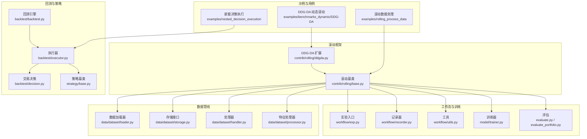
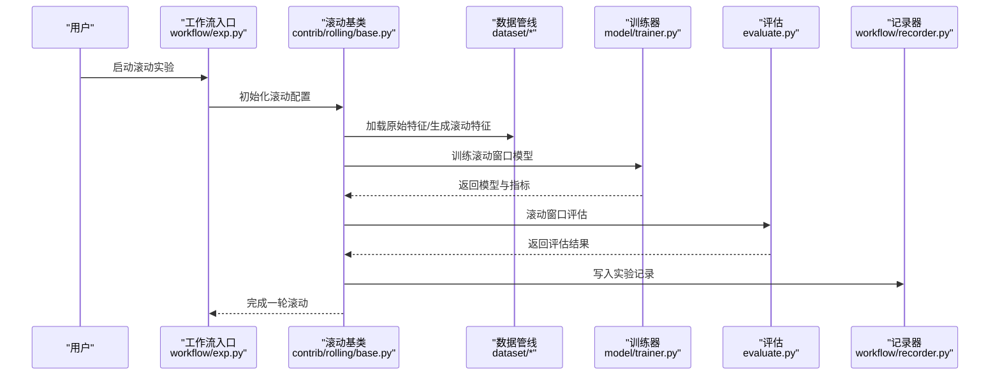
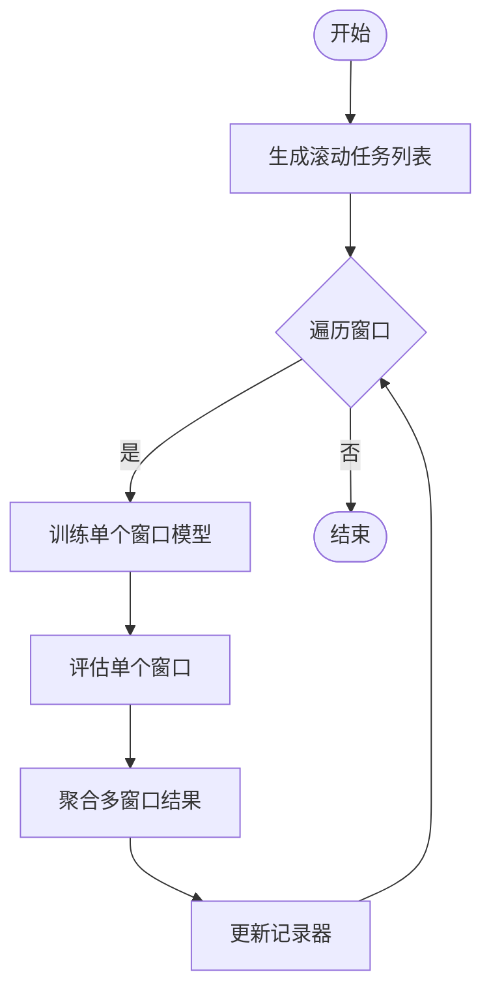
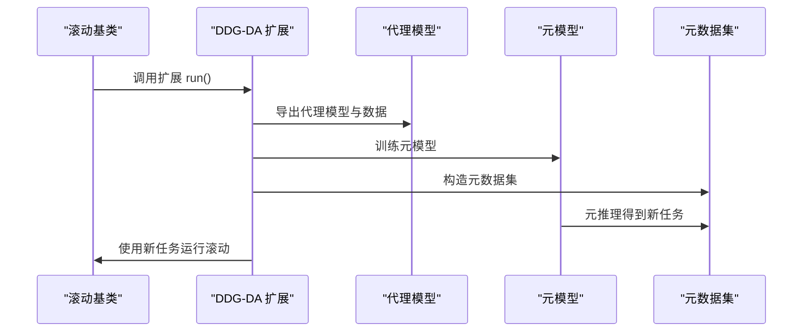
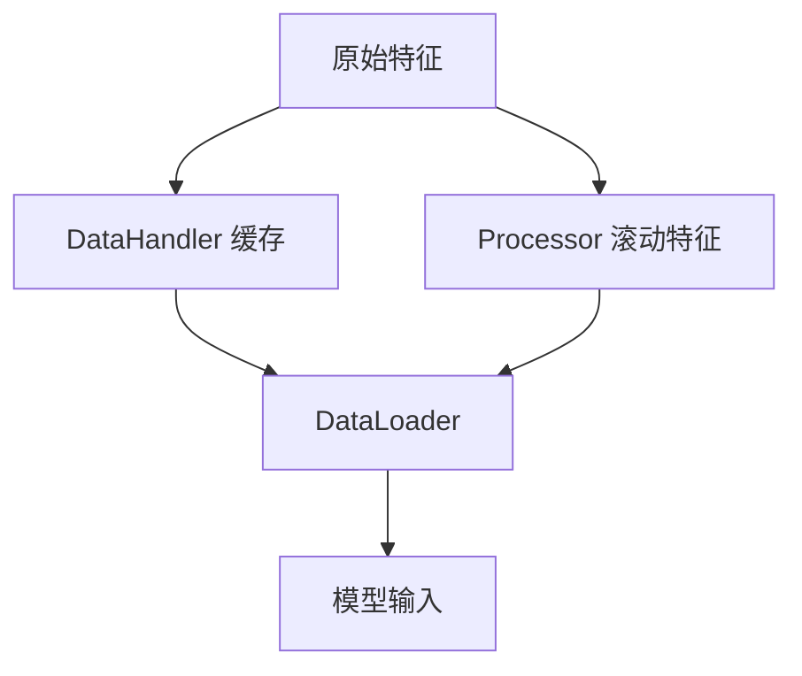
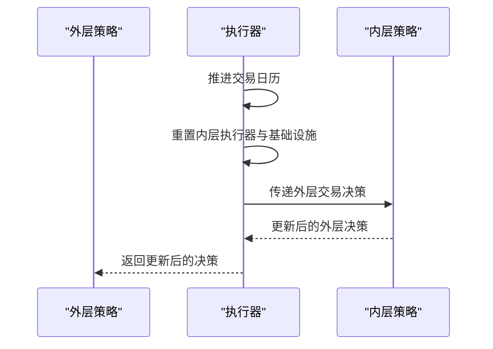
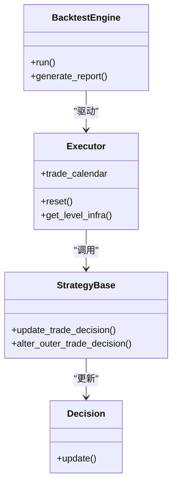
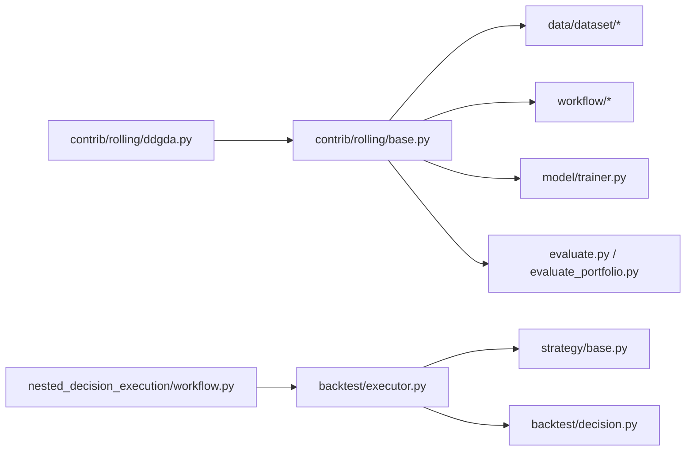

# 滚动处理流程

<cite>
**本文引用的文件**
- [examples/rolling_process_data/README.md](file://examples/rolling_process_data/README.md)
- [examples/rolling_process_data/workflow.py](file://examples/rolling_process_data/workflow.py)
- [examples/rolling_process_data/rolling_handler.py](file://examples/rolling_process_data/rolling_handler.py)
- [examples/nested_decision_execution/workflow.py](file://examples/nested_decision_execution/workflow.py)
- [examples/benchmarks_dynamic/DDG-DA/workflow.py](file://examples/benchmarks_dynamic/DDG-DA/workflow.py)
- [qlib/contrib/rolling/base.py](file://qlib/contrib/rolling/base.py)
- [qlib/contrib/rolling/ddgda.py](file://qlib/contrib/rolling/ddgda.py)
- [qlib/backtest/executor.py](file://qlib/backtest/executor.py)
- [qlib/backtest/decision.py](file://qlib/backtest/decision.py)
- [qlib/backtest/backtest.py](file://qlib/backtest/backtest.py)
- [qlib/strategy/base.py](file://qlib/strategy/base.py)
- [qlib/data/dataset/loader.py](file://qlib/data/dataset/loader.py)
- [qlib/data/dataset/storage.py](file://qlib/data/dataset/storage.py)
- [qlib/data/dataset/handler.py](file://qlib/data/dataset/handler.py)
- [qlib/data/dataset/processor.py](file://qlib/data/dataset/processor.py)
- [qlib/workflow/exp.py](file://qlib/workflow/exp.py)
- [qlib/workflow/recorder.py](file://qlib/workflow/recorder.py)
- [qlib/workflow/utils.py](file://qlib/workflow/utils.py)
- [qlib/model/trainer.py](file://qlib/model/trainer.py)
- [qlib/model/base.py](file://qlib/model/base.py)
- [qlib/evaluate.py](file://qlib/evaluate.py)
- [qlib/evaluate_portfolio.py](file://qlib/evaluate_portfolio.py)
</cite>

## 目录
1. [引言](#引言)
2. [项目结构](#项目结构)
3. [核心组件](#核心组件)
4. [架构总览](#架构总览)
5. [详细组件分析](#详细组件分析)
6. [依赖关系分析](#依赖关系分析)
7. [性能考虑](#性能考虑)
8. [故障排查指南](#故障排查指南)
9. [结论](#结论)
10. [附录](#附录)

## 引言
本文件系统性梳理 Qlib 的滚动处理流程，覆盖滚动窗口分析、动态数据处理与在线学习的实现方式；深入解释滚动模型更新、增量学习与模型迁移策略；给出完整的滚动处理流程（数据窗口管理、模型重训练与性能监控）；详述嵌套决策执行、滚动回测与动态策略调整机制；并提供可操作的滚动处理案例与性能优化建议。

## 项目结构
围绕滚动处理的关键目录与文件如下：
- 示例与工作流：examples/rolling_process_data、examples/nested_decision_execution、examples/benchmarks_dynamic/DDG-DA
- 滚动框架：qlib/contrib/rolling/base.py、qlib/contrib/rolling/ddgda.py
- 回测与策略：qlib/backtest/*、qlib/strategy/base.py
- 数据管线：qlib/data/dataset/*
- 工作流与记录器：qlib/workflow/*
- 训练与评估：qlib/model/trainer.py、qlib/evaluate.py、qlib/evaluate_portfolio.py

图表来源
- [examples/rolling_process_data/workflow.py:1-200](file://examples/rolling_process_data/workflow.py#L1-L200)
- [examples/nested_decision_execution/workflow.py:1-200](file://examples/nested_decision_execution/workflow.py#L1-L200)
- [examples/benchmarks_dynamic/DDG-DA/workflow.py:1-200](file://examples/benchmarks_dynamic/DDG-DA/workflow.py#L1-L200)
- [qlib/contrib/rolling/base.py:1-300](file://qlib/contrib/rolling/base.py#L1-L300)
- [qlib/contrib/rolling/ddgda.py:1-400](file://qlib/contrib/rolling/ddgda.py#L1-L400)
- [qlib/backtest/executor.py:1-420](file://qlib/backtest/executor.py#L1-L420)
- [qlib/backtest/decision.py:1-200](file://qlib/backtest/decision.py#L1-L200)
- [qlib/backtest/backtest.py:1-200](file://qlib/backtest/backtest.py#L1-L200)
- [qlib/strategy/base.py:1-250](file://qlib/strategy/base.py#L1-L250)
- [qlib/data/dataset/loader.py:1-200](file://qlib/data/dataset/loader.py#L1-L200)
- [qlib/data/dataset/storage.py:1-200](file://qlib/data/dataset/storage.py#L1-L200)
- [qlib/data/dataset/handler.py:1-200](file://qlib/data/dataset/handler.py#L1-L200)
- [qlib/data/dataset/processor.py:1-200](file://qlib/data/dataset/processor.py#L1-L200)
- [qlib/workflow/exp.py:1-200](file://qlib/workflow/exp.py#L1-L200)
- [qlib/workflow/recorder.py:1-200](file://qlib/workflow/recorder.py#L1-L200)
- [qlib/workflow/utils.py:1-200](file://qlib/workflow/utils.py#L1-L200)
- [qlib/model/trainer.py:1-200](file://qlib/model/trainer.py#L1-L200)
- [qlib/evaluate.py:1-200](file://qlib/evaluate.py#L1-L200)
- [qlib/evaluate_portfolio.py:1-200](file://qlib/evaluate_portfolio.py#L1-L200)

章节来源
- [examples/rolling_process_data/README.md:1-17](file://examples/rolling_process_data/README.md#L1-L17)
- [examples/rolling_process_data/workflow.py:1-200](file://examples/rolling_process_data/workflow.py#L1-L200)
- [qlib/contrib/rolling/base.py:1-300](file://qlib/contrib/rolling/base.py#L1-L300)

## 核心组件
- 滚动基类与任务编排：负责滚动窗口的任务生成、训练、集成与记录更新，贯穿数据窗口管理、模型重训练与结果汇总。
- DDG-DA 扩展：在滚动基础上引入元模型进行任务重加权与迁移，提升跨窗口泛化能力。
- 数据管线：基于 Handler/Processor 的数据加载与特征生成，支持滚动窗口内统计量的动态更新。
- 回测与策略：提供嵌套执行、交易决策与执行器，支撑滚动回测与动态策略调整。
- 工作流与记录器：统一实验入口、记录器与工具函数，保障滚动过程的可观测性与可追溯性。
- 训练与评估：训练器与评估模块，支撑滚动窗口内的增量训练与性能评估。

章节来源
- [qlib/contrib/rolling/base.py:200-300](file://qlib/contrib/rolling/base.py#L200-L300)
- [qlib/contrib/rolling/ddgda.py:350-388](file://qlib/contrib/rolling/ddgda.py#L350-L388)
- [qlib/data/dataset/handler.py:1-200](file://qlib/data/dataset/handler.py#L1-L200)
- [qlib/data/dataset/processor.py:1-200](file://qlib/data/dataset/processor.py#L1-L200)
- [qlib/backtest/executor.py:389-404](file://qlib/backtest/executor.py#L389-L404)
- [qlib/workflow/exp.py:1-200](file://qlib/workflow/exp.py#L1-L200)
- [qlib/workflow/recorder.py:1-200](file://qlib/workflow/recorder.py#L1-L200)
- [qlib/model/trainer.py:1-200](file://qlib/model/trainer.py#L1-L200)
- [qlib/evaluate.py:1-200](file://qlib/evaluate.py#L1-L200)
- [qlib/evaluate_portfolio.py:1-200](file://qlib/evaluate_portfolio.py#L1-L200)

## 架构总览
滚动处理从“数据窗口管理”出发，通过“滚动任务生成与训练”，结合“模型集成与记录更新”，最终进入“滚动回测与策略调整”。DDG-DA 在此过程中引入元模型进行任务重加权与迁移，增强跨窗口稳定性。

图表来源
- [qlib/workflow/exp.py:1-200](file://qlib/workflow/exp.py#L1-L200)
- [qlib/contrib/rolling/base.py:200-300](file://qlib/contrib/rolling/base.py#L200-L300)
- [qlib/data/dataset/loader.py:1-200](file://qlib/data/dataset/loader.py#L1-L200)
- [qlib/model/trainer.py:1-200](file://qlib/model/trainer.py#L1-L200)
- [qlib/evaluate.py:1-200](file://qlib/evaluate.py#L1-L200)
- [qlib/workflow/recorder.py:1-200](file://qlib/workflow/recorder.py#L1-L200)

## 详细组件分析

### 组件A：滚动基类（contrib/rolling/base.py）
- 职责
  - 生成滚动窗口任务列表
  - 逐窗口训练模型
  - 集成滚动结果并更新记录
- 关键流程
  - 任务生成：根据时间窗口与步长划分训练/验证/测试片段
  - 训练循环：对每个窗口调用训练器，产出模型与预测
  - 结果集成：对多窗口预测进行加权或投票集成
  - 记录更新：将训练与评估结果写入记录器，便于后续分析
- 复杂度与优化
  - 时间复杂度近似为 O(W × T × C)，W 为窗口数，T 为单窗口训练迭代次数，C 为模型复杂度
  - 可通过并行化窗口训练、缓存不随窗口变化的特征、增量评估等手段优化

图表来源
- [qlib/contrib/rolling/base.py:200-300](file://qlib/contrib/rolling/base.py#L200-L300)

章节来源
- [qlib/contrib/rolling/base.py:200-300](file://qlib/contrib/rolling/base.py#L200-L300)

### 组件B：DDG-DA 扩展（contrib/rolling/ddgda.py）
- 职责
  - 基于滚动基类扩展，引入元模型进行任务重加权与迁移
  - 通过内部数据与代理模型计算重要性权重，指导后续滚动任务
- 关键流程
  - 准备元模型：导出代理模型与内部数据
  - 训练元模型：利用历史实验数据训练元模型
  - 元推理：对候选任务进行打分并生成新的任务列表
  - 运行滚动：复用滚动基类完成训练与评估
- 适用场景
  - 窗口间分布漂移较大时，通过元模型提升任务选择与模型迁移效果

图表来源
- [qlib/contrib/rolling/ddgda.py:350-388](file://qlib/contrib/rolling/ddgda.py#L350-L388)
- [qlib/contrib/rolling/base.py:253-264](file://qlib/contrib/rolling/base.py#L253-L264)

章节来源
- [qlib/contrib/rolling/ddgda.py:350-388](file://qlib/contrib/rolling/ddgda.py#L350-L388)

### 组件C：滚动数据处理（examples/rolling_process_data）
- 背景
  - 滚动训练中，数据也需在不同滚动窗口内生成；当窗口移动时，训练数据与处理器的可学习状态（如均值、方差）随之变化
  - 为避免重复生成数据，采用基于 DataHandler 的 DataLoader 加载与滚动窗口相关的特征
- 关键点
  - 使用 Handler/Processor 分离“不随窗口变化的原始特征”与“随窗口变化的滚动特征”
  - 通过 DataHandler 的缓存与 Processor 的滑动窗口统计，减少重复计算
- 实践建议
  - 将稳定特征预处理到缓存层，仅在窗口边界更新滚动统计量
  - 控制窗口大小与步长，平衡时效性与稳定性

图表来源
- [examples/rolling_process_data/README.md:1-17](file://examples/rolling_process_data/README.md#L1-L17)
- [examples/rolling_process_data/workflow.py:1-200](file://examples/rolling_process_data/workflow.py#L1-L200)
- [examples/rolling_process_data/rolling_handler.py:1-200](file://examples/rolling_process_data/rolling_handler.py#L1-L200)

章节来源
- [examples/rolling_process_data/README.md:1-17](file://examples/rolling_process_data/README.md#L1-L17)
- [examples/rolling_process_data/workflow.py:1-200](file://examples/rolling_process_data/workflow.py#L1-L200)
- [examples/rolling_process_data/rolling_handler.py:1-200](file://examples/rolling_process_data/rolling_handler.py#L1-L200)

### 组件D：嵌套决策执行（examples/nested_decision_execution）
- 职责
  - 支持多层级策略的嵌套执行，外层策略与内层策略协同更新交易决策
- 关键流程
  - 执行器在每一步根据日历推进，重置内层执行器与基础设施
  - 内层策略可更新外层交易决策，形成双向影响
- 应用场景
  - 滚动回测中，外层策略决定滚动窗口切换时机，内层策略在窗口内执行交易

图表来源
- [examples/nested_decision_execution/workflow.py:1-200](file://examples/nested_decision_execution/workflow.py#L1-L200)
- [qlib/backtest/executor.py:389-404](file://qlib/backtest/executor.py#L389-L404)
- [qlib/strategy/base.py:178-213](file://qlib/strategy/base.py#L178-L213)

章节来源
- [examples/nested_decision_execution/workflow.py:1-200](file://examples/nested_decision_execution/workflow.py#L1-L200)
- [qlib/backtest/executor.py:389-404](file://qlib/backtest/executor.py#L389-L404)
- [qlib/strategy/base.py:178-213](file://qlib/strategy/base.py#L178-L213)

### 组件E：滚动回测与策略调整（backtest 与 strategy）
- 回测引擎
  - 提供账户、订单、成交、信号与报告模块，支撑滚动窗口内的回测执行
- 策略基类
  - 提供跨层级通信接口，允许内层策略更新外层交易决策
- 执行器
  - 在每次迭代中推进日历、重置子级基础设施与策略，并允许内层策略修改外层决策

图表来源
- [qlib/backtest/backtest.py:1-200](file://qlib/backtest/backtest.py#L1-L200)
- [qlib/backtest/executor.py:389-404](file://qlib/backtest/executor.py#L389-L404)
- [qlib/strategy/base.py:178-213](file://qlib/strategy/base.py#L178-L213)
- [qlib/backtest/decision.py:1-200](file://qlib/backtest/decision.py#L1-L200)

章节来源
- [qlib/backtest/backtest.py:1-200](file://qlib/backtest/backtest.py#L1-L200)
- [qlib/backtest/executor.py:389-404](file://qlib/backtest/executor.py#L389-L404)
- [qlib/strategy/base.py:178-213](file://qlib/strategy/base.py#L178-L213)
- [qlib/backtest/decision.py:1-200](file://qlib/backtest/decision.py#L1-L200)

## 依赖关系分析
- 滚动基类依赖数据管线（Handler/Processor）、工作流（exp/recorder/utils）、训练器与评估模块
- DDG-DA 在滚动基类之上增加元模型与元数据集构建
- 回测与策略通过执行器耦合，形成滚动回测闭环
- 示例工程作为端到端用例，串联上述组件

图表来源
- [qlib/contrib/rolling/base.py:200-300](file://qlib/contrib/rolling/base.py#L200-L300)
- [qlib/contrib/rolling/ddgda.py:350-388](file://qlib/contrib/rolling/ddgda.py#L350-L388)
- [qlib/backtest/executor.py:389-404](file://qlib/backtest/executor.py#L389-L404)
- [qlib/strategy/base.py:178-213](file://qlib/strategy/base.py#L178-L213)
- [qlib/backtest/decision.py:1-200](file://qlib/backtest/decision.py#L1-L200)
- [qlib/data/dataset/handler.py:1-200](file://qlib/data/dataset/handler.py#L1-L200)
- [qlib/data/dataset/processor.py:1-200](file://qlib/data/dataset/processor.py#L1-L200)
- [qlib/workflow/exp.py:1-200](file://qlib/workflow/exp.py#L1-L200)
- [qlib/workflow/recorder.py:1-200](file://qlib/workflow/recorder.py#L1-L200)
- [qlib/model/trainer.py:1-200](file://qlib/model/trainer.py#L1-L200)
- [qlib/evaluate.py:1-200](file://qlib/evaluate.py#L1-L200)
- [qlib/evaluate_portfolio.py:1-200](file://qlib/evaluate_portfolio.py#L1-L200)

章节来源
- [qlib/contrib/rolling/base.py:200-300](file://qlib/contrib/rolling/base.py#L200-L300)
- [qlib/contrib/rolling/ddgda.py:350-388](file://qlib/contrib/rolling/ddgda.py#L350-L388)
- [qlib/backtest/executor.py:389-404](file://qlib/backtest/executor.py#L389-L404)
- [qlib/strategy/base.py:178-213](file://qlib/strategy/base.py#L178-L213)
- [qlib/data/dataset/handler.py:1-200](file://qlib/data/dataset/handler.py#L1-L200)
- [qlib/data/dataset/processor.py:1-200](file://qlib/data/dataset/processor.py#L1-L200)
- [qlib/workflow/exp.py:1-200](file://qlib/workflow/exp.py#L1-L200)
- [qlib/workflow/recorder.py:1-200](file://qlib/workflow/recorder.py#L1-L200)
- [qlib/model/trainer.py:1-200](file://qlib/model/trainer.py#L1-L200)
- [qlib/evaluate.py:1-200](file://qlib/evaluate.py#L1-L200)
- [qlib/evaluate_portfolio.py:1-200](file://qlib/evaluate_portfolio.py#L1-L200)

## 性能考虑
- 并行化滚动窗口训练：利用多进程/多线程并行训练不同窗口模型，缩短整体耗时
- 特征缓存与增量更新：将不随窗口变化的特征预处理至缓存层，仅在窗口边界更新滚动统计量
- 窗口步长与大小权衡：增大步长可提升时效性但降低稳定性，需结合业务目标调优
- 记录器与评估频率：合理设置评估频率与记录粒度，避免过度 IO 影响吞吐
- 元模型重加权：在窗口漂移明显时启用 DDG-DA，以元模型指导任务选择，提高稳定性

## 故障排查指南
- 数据窗口不一致
  - 现象：滚动窗口内统计量异常或模型性能波动大
  - 排查：确认 Handler/Processor 的窗口边界与步长设置是否一致，检查缓存是否命中
- 训练收敛异常
  - 现象：部分窗口模型不收敛或过拟合
  - 排查：检查窗口内样本量、特征缩放与标签分布，适当调整学习率与正则
- 回测与策略不一致
  - 现象：嵌套策略更新未生效或决策冲突
  - 排查：核对执行器的日历推进逻辑与策略的决策更新接口
- 记录器缺失或重复
  - 现象：实验记录缺失或重复写入
  - 排查：检查记录器初始化与唯一标识，确保滚动基类正确调用记录更新

章节来源
- [qlib/contrib/rolling/base.py:200-300](file://qlib/contrib/rolling/base.py#L200-L300)
- [qlib/backtest/executor.py:389-404](file://qlib/backtest/executor.py#L389-L404)
- [qlib/strategy/base.py:178-213](file://qlib/strategy/base.py#L178-L213)
- [qlib/workflow/recorder.py:1-200](file://qlib/workflow/recorder.py#L1-L200)

## 结论
Qlib 的滚动处理以“滚动基类”为核心，结合“数据管线的滚动特征生成”、“工作流与记录器”的可观测性，以及“回测与策略”的动态调整能力，形成了完整的滚动分析闭环。通过 DDG-DA 扩展，可在窗口漂移场景下进一步提升任务选择与模型迁移效果。实践中应重视窗口管理、特征缓存与并行化策略，以获得更高的效率与稳定性。

## 附录
- 实际滚动处理案例
  - 滚动数据处理示例：参考 examples/rolling_process_data，演示如何在滚动窗口内高效生成与缓存特征
  - 嵌套决策执行示例：参考 examples/nested_decision_execution，展示外层与内层策略的协同更新
  - DDG-DA 动态滚动示例：参考 examples/benchmarks_dynamic/DDG-DA，展示元模型在滚动任务重加权中的应用
- 性能优化技巧
  - 并行化：对不同窗口独立训练，充分利用多核资源
  - 缓存：将稳定特征预处理到缓存层，仅在窗口边界更新滚动统计
  - 步长与窗口：根据市场变化速度调整窗口大小与步长，兼顾时效与稳定性
  - 记录与评估：控制评估频率与记录粒度，减少 IO 开销