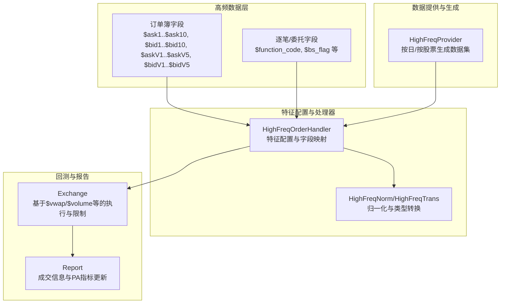
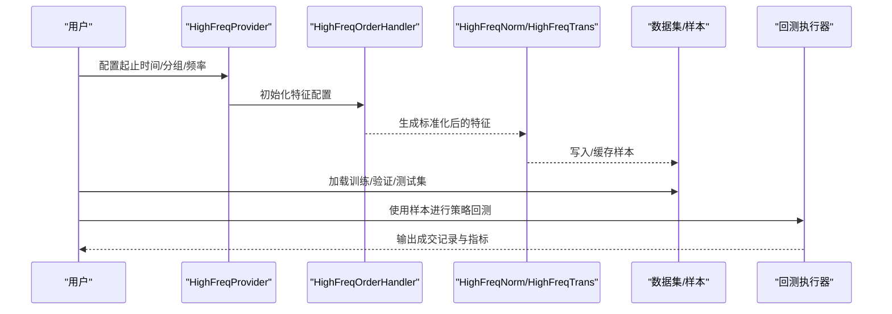
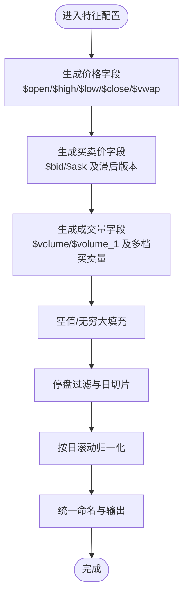
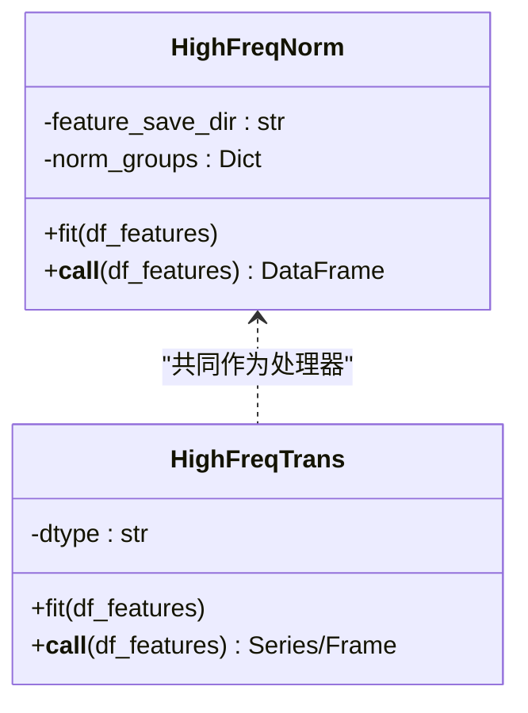
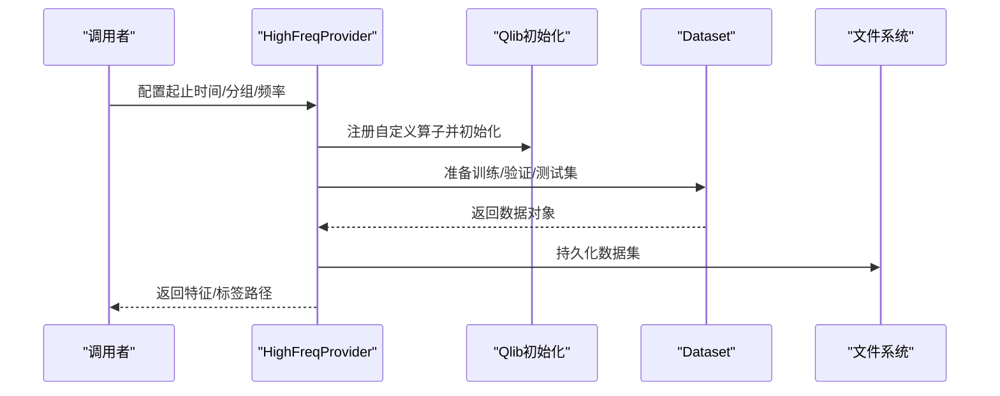
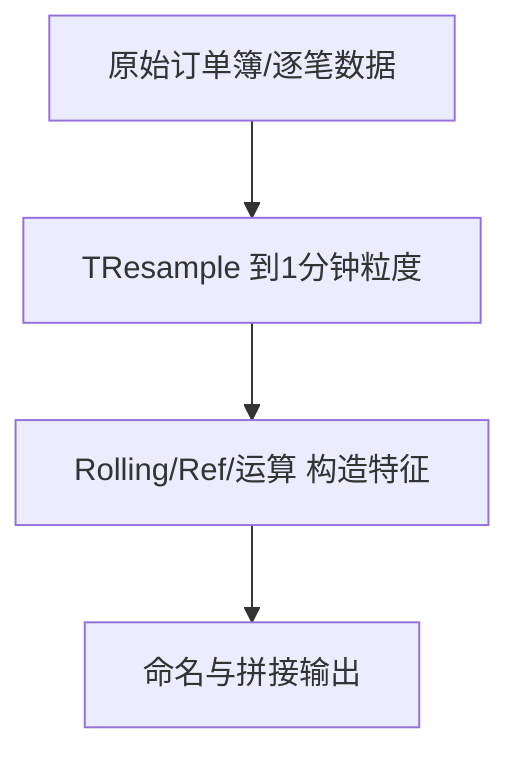
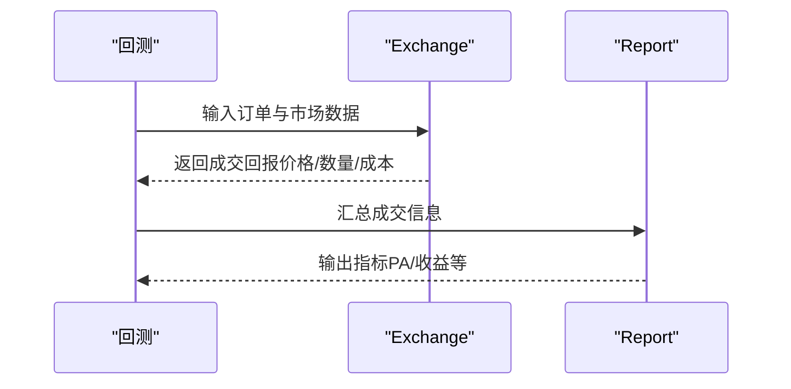
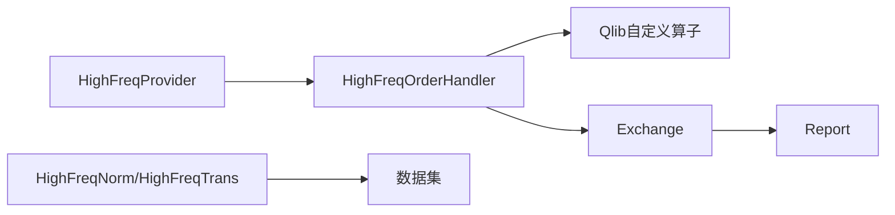

# 订单簿数据处理

<cite>
**本文引用的文件**   
- [qlib/contrib/data/highfreq_handler.py](file://qlib/contrib/data/highfreq_handler.py)
- [qlib/contrib/data/highfreq_processor.py](file://qlib/contrib/data/highfreq_processor.py)
- [qlib/contrib/data/highfreq_provider.py](file://qlib/contrib/data/highfreq_provider.py)
- [examples/orderbook_data/example.py](file://examples/orderbook_data/example.py)
- [qlib/backtest/exchange.py](file://qlib/backtest/exchange.py)
- [qlib/backtest/report.py](file://qlib/backtest/report.py)
- [qlib/data/ops.py](file://qlib/data/ops.py)
</cite>

## 目录
1. [引言](#引言)
2. [项目结构](#项目结构)
3. [核心组件](#核心组件)
4. [架构总览](#架构总览)
5. [详细组件分析](#详细组件分析)
6. [依赖分析](#依赖分析)
7. [性能考虑](#性能考虑)
8. [故障排查指南](#故障排查指南)
9. [结论](#结论)
10. [附录](#附录)

## 引言
本文件系统性梳理 Qlib 在高频订单簿数据上的处理能力与最佳实践，覆盖数据结构与格式、特征工程、样本生成、回测集成以及在流动性建模、价格预测与市场影响分析中的应用路径。通过对高频处理器、特征配置器与数据提供器的深入解析，并结合示例脚本中的表达式用法，帮助读者快速构建从原始订单簿到可训练样本的完整流水线。

## 项目结构
围绕订单簿数据处理的关键模块分布如下：
- 高频处理器与特征配置：提供标准化的字段生成、归一化与填充策略
- 数据提供器：负责按日/按股票切分生成数据集，支持缓存与并行加速
- 示例脚本：展示订单簿字段的表达式用法与聚合统计
- 回测与报告：将订单簿特征接入回测执行器，输出成交与指标

**图示来源**
- [qlib/contrib/data/highfreq_handler.py:307-459](file://qlib/contrib/data/highfreq_handler.py#L307-L459)
- [qlib/contrib/data/highfreq_processor.py:10-81](file://qlib/contrib/data/highfreq_processor.py#L10-L81)
- [qlib/contrib/data/highfreq_provider.py:18-305](file://qlib/contrib/data/highfreq_provider.py#L18-L305)
- [qlib/backtest/exchange.py:95-122](file://qlib/backtest/exchange.py#L95-L122)
- [qlib/backtest/report.py:301-328](file://qlib/backtest/report.py#L301-L328)

**章节来源**
- [qlib/contrib/data/highfreq_handler.py:1-540](file://qlib/contrib/data/highfreq_handler.py#L1-L540)
- [qlib/contrib/data/highfreq_processor.py:1-81](file://qlib/contrib/data/highfreq_processor.py#L1-L81)
- [qlib/contrib/data/highfreq_provider.py:1-305](file://qlib/contrib/data/highfreq_provider.py#L1-L305)
- [examples/orderbook_data/example.py:1-313](file://examples/orderbook_data/example.py#L1-L313)
- [qlib/backtest/exchange.py:95-122](file://qlib/backtest/exchange.py#L95-L122)
- [qlib/backtest/report.py:301-328](file://qlib/backtest/report.py#L301-L328)

## 核心组件
- 高频订单簿处理器（HighFreqOrderHandler）
  - 负责生成订单簿相关特征，包括买卖价、买卖量、成交量、延时填充与停盘过滤
  - 支持多时间步滞后特征与日滚动均值归一化
- 高频通用处理器（HighFreqNorm/HighFreqTrans）
  - 提供按组别保存的均值/方差/绝对偏差范围等统计，实现对数变换与标准化
  - 支持布尔/浮点类型转换
- 高频数据提供器（HighFreqProvider）
  - 按日或按股票切分生成数据集，支持缓存与并行
  - 统一初始化 Qlib 自定义算子，确保表达式可执行
- 示例脚本（orderbook_data/example.py）
  - 展示 TResample/Rolling/Ref 等表达式在订单簿与逐笔数据上的组合用法
  - 包含价差、中价、相对强度、变化率等常用特征构造思路

**章节来源**
- [qlib/contrib/data/highfreq_handler.py:307-459](file://qlib/contrib/data/highfreq_handler.py#L307-L459)
- [qlib/contrib/data/highfreq_processor.py:10-81](file://qlib/contrib/data/highfreq_processor.py#L10-L81)
- [qlib/contrib/data/highfreq_provider.py:18-305](file://qlib/contrib/data/highfreq_provider.py#L18-L305)
- [examples/orderbook_data/example.py:1-313](file://examples/orderbook_data/example.py#L1-L313)

## 架构总览
下图展示了从原始订单簿数据到可训练样本的端到端流程，包括数据加载、特征生成、归一化与样本落盘，以及在回测中的应用。

**图示来源**
- [qlib/contrib/data/highfreq_provider.py:166-194](file://qlib/contrib/data/highfreq_provider.py#L166-L194)
- [qlib/contrib/data/highfreq_handler.py:307-459](file://qlib/contrib/data/highfreq_handler.py#L307-L459)
- [qlib/contrib/data/highfreq_processor.py:37-81](file://qlib/contrib/data/highfreq_processor.py#L37-L81)
- [qlib/backtest/exchange.py:95-122](file://qlib/backtest/exchange.py#L95-L122)

## 详细组件分析

### 高频订单簿处理器（HighFreqOrderHandler）分析
- 字段生成策略
  - 价格类：开盘/最高/最低/收盘/VWAP，支持当日与滞后一日的标准化版本
  - 买卖价：$bid/$ask 及其滞后版本，用于刻画买卖压力
  - 成交量类：$volume、$volume_1 与多档买卖量 $bidV/$askV 的多阶滞后版本
  - 填充与过滤：空值/无穷大填充、停盘过滤、日切片裁剪
- 归一化与滞后
  - 以昨日特定分钟的收盘价为基准做日滚动归一化
  - 支持按 240 分钟（1 日）步长生成滞后特征，便于时序建模
- 特征命名与维度
  - 通过 names 列表统一管理输出列名，便于后续归一化分组

**图示来源**
- [qlib/contrib/data/highfreq_handler.py:342-459](file://qlib/contrib/data/highfreq_handler.py#L342-L459)

**章节来源**
- [qlib/contrib/data/highfreq_handler.py:307-459](file://qlib/contrib/data/highfreq_handler.py#L307-L459)

### 高频处理器（HighFreqNorm/HighFreqTrans）分析
- HighFreqNorm
  - 训练期按组别保存均值、绝对偏差标准差、最大最小值，支持对数变换
  - 推理期按保存的统计量进行标准化与填充
- HighFreqTrans
  - 将特征转换为布尔/浮点类型，便于模型输入

**图示来源**
- [qlib/contrib/data/highfreq_processor.py:10-81](file://qlib/contrib/data/highfreq_processor.py#L10-L81)

**章节来源**
- [qlib/contrib/data/highfreq_processor.py:10-81](file://qlib/contrib/data/highfreq_processor.py#L10-L81)

### 高频数据提供器（HighFreqProvider）分析
- 功能要点
  - 支持按日/按股票两种粒度生成数据集，避免重复计算
  - 缓存中间结果，提升二次运行效率
  - 并行生成不同日期/股票的样本，显著缩短准备时间
- 关键流程
  - 初始化 Qlib 并注册自定义算子
  - 生成训练/验证/测试集并持久化
  - 提供回测专用数据生成入口

**图示来源**
- [qlib/contrib/data/highfreq_provider.py:18-305](file://qlib/contrib/data/highfreq_provider.py#L18-L305)

**章节来源**
- [qlib/contrib/data/highfreq_provider.py:18-305](file://qlib/contrib/data/highfreq_provider.py#L18-L305)

### 示例脚本（orderbook_data/example.py）分析
- 表达式用法
  - TResample：将非固定频率（ticks/transaction/order）重采样到固定频率
  - Rolling：滑动窗口统计（如强度、相对强度）
  - Ref：滞后引用，构造变化率
  - Sub/Div/Last/Mean/Sum：基础运算与聚合
- 典型特征
  - 价差、中价、累计价差/成交量、多档价差差异、强度与相对强度、变化率等

**图示来源**
- [examples/orderbook_data/example.py:88-313](file://examples/orderbook_data/example.py#L88-L313)

**章节来源**
- [examples/orderbook_data/example.py:1-313](file://examples/orderbook_data/example.py#L1-L313)

### 回测与报告（Exchange/Report）集成
- 执行器（Exchange）
  - 支持基于 $vwap/$volume 等字段的成交量限制与买卖价格选择
  - 必要字段集合包括 $vwap/$close/$volume/$factor 等
- 报告（Report）
  - 更新订单成交信息，包括成交数量、成交金额、成交均价、方向与成本
  - 计算 PA（价格影响）等指标

**图示来源**
- [qlib/backtest/exchange.py:95-122](file://qlib/backtest/exchange.py#L95-L122)
- [qlib/backtest/report.py:301-328](file://qlib/backtest/report.py#L301-L328)

**章节来源**
- [qlib/backtest/exchange.py:95-122](file://qlib/backtest/exchange.py#L95-L122)
- [qlib/backtest/report.py:301-328](file://qlib/backtest/report.py#L301-L328)

## 依赖分析
- 处理器与特征配置
  - HighFreqOrderHandler 依赖于 Qlib 表达式引擎与自定义算子（如 DayLast/FFillNan/Cut 等）
  - 特征命名与维度由 names 列表集中管理，便于后续归一化分组
- 数据提供器
  - 通过 init_instance_by_config 动态装配数据集，支持路径缓存与并行生成
- 回测集成
  - Exchange 依赖 $vwap/$volume 等字段；Report 依赖成交回报字段

**图示来源**
- [qlib/contrib/data/highfreq_handler.py:307-459](file://qlib/contrib/data/highfreq_handler.py#L307-L459)
- [qlib/contrib/data/highfreq_processor.py:10-81](file://qlib/contrib/data/highfreq_processor.py#L10-L81)
- [qlib/contrib/data/highfreq_provider.py:18-305](file://qlib/contrib/data/highfreq_provider.py#L18-L305)
- [qlib/backtest/exchange.py:95-122](file://qlib/backtest/exchange.py#L95-L122)
- [qlib/backtest/report.py:301-328](file://qlib/backtest/report.py#L301-L328)

**章节来源**
- [qlib/contrib/data/highfreq_handler.py:1-540](file://qlib/contrib/data/highfreq_handler.py#L1-L540)
- [qlib/contrib/data/highfreq_processor.py:1-81](file://qlib/contrib/data/highfreq_processor.py#L1-L81)
- [qlib/contrib/data/highfreq_provider.py:1-305](file://qlib/contrib/data/highfreq_provider.py#L1-L305)
- [qlib/backtest/exchange.py:95-122](file://qlib/backtest/exchange.py#L95-L122)
- [qlib/backtest/report.py:301-328](file://qlib/backtest/report.py#L301-L328)

## 性能考虑
- 并行与缓存
  - 使用并行生成不同日期/股票的数据集，减少重复计算
  - 通过 pickle 缓存中间数据，避免重复装配数据集
- 表达式优化
  - 合理使用 TResample/Rolling/Ref，避免过长窗口导致内存与计算压力
  - 对成交量采用日滚动均值归一化，降低极端值影响
- 内存与类型
  - 使用 HighFreqTrans 将布尔/整型转为紧凑类型，降低内存占用
  - 对数变换可缓解成交量偏态分布

[本节为通用建议，不直接分析具体文件]

## 故障排查指南
- 表达式报错
  - 确认已注册自定义算子（DayLast/FFillNan/Cut/IsNull/IsInf/Select 等）
  - 检查字段是否存在（如 $bid/$ask/$volume），必要时使用 If/IsNull 进行兜底
- 归一化异常
  - 确保 HighFreqNorm.fit 已在训练期内执行并保存统计量
  - 检查分组维度与 names 切片是否一致
- 回测无成交
  - 检查 Exchange 的 volume_threshold 与价格字段配置
  - 确认 $vwap/$volume 等字段可用且未被停盘过滤

**章节来源**
- [qlib/contrib/data/highfreq_provider.py:104-113](file://qlib/contrib/data/highfreq_provider.py#L104-L113)
- [qlib/contrib/data/highfreq_processor.py:37-81](file://qlib/contrib/data/highfreq_processor.py#L37-L81)
- [qlib/backtest/exchange.py:95-122](file://qlib/backtest/exchange.py#L95-L122)

## 结论
Qlib 在高频订单簿数据处理方面提供了从特征生成、归一化、样本落盘到回测集成的一体化能力。通过 HighFreqOrderHandler 的标准化特征配置、HighFreqNorm 的稳健归一化与 HighFreqProvider 的高效生成机制，可以快速构建高质量的训练样本，并在回测中有效评估策略表现。结合示例脚本中的表达式实践，用户可灵活扩展价差、强度、变化率等特征，支撑流动性建模、价格预测与市场影响分析等任务。

[本节为总结性内容，不直接分析具体文件]

## 附录
- 常用字段与表达式参考
  - 价差与中价：$ask1/$bid1 及其多档价差与中价
  - 成交量占比：各档买卖量占总成交量的比例
  - 强度与相对强度：短时与长时窗口内的订单/交易强度比较
  - 变化率：基于滞后引用的短期变化率
- 实践建议
  - 优先使用 TResample 将非固定频率数据对齐到固定频率
  - 对成交量采用日滚动均值归一化，避免极端值干扰
  - 在回测中设置合理的成交量上限与价格选择策略

**章节来源**
- [examples/orderbook_data/example.py:88-313](file://examples/orderbook_data/example.py#L88-L313)
- [qlib/contrib/data/highfreq_handler.py:342-459](file://qlib/contrib/data/highfreq_handler.py#L342-L459)