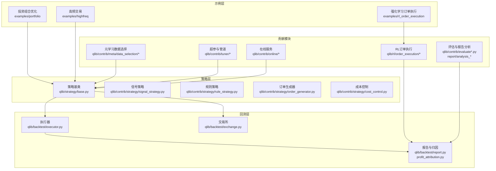
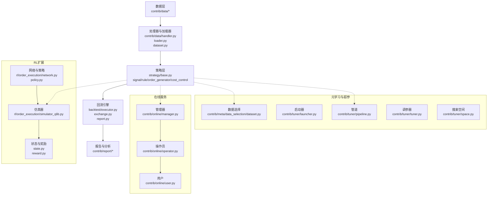
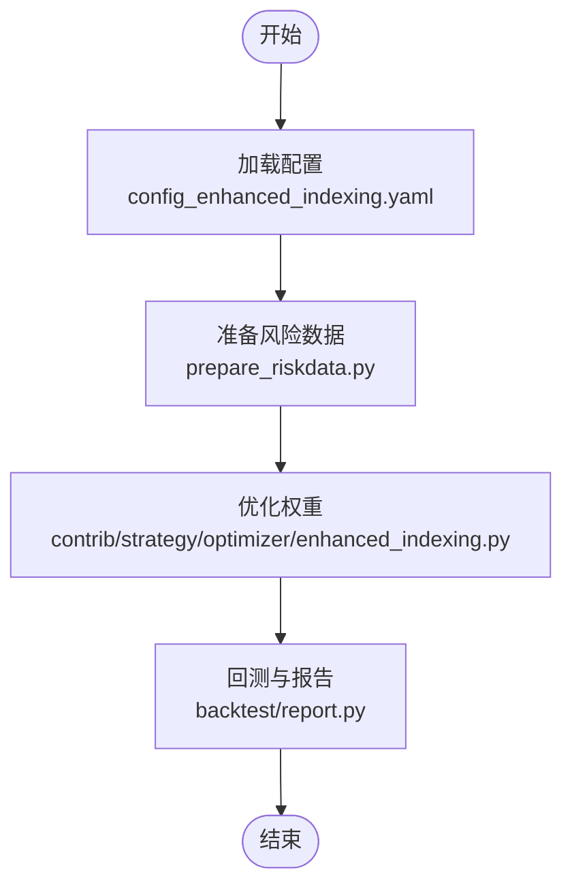
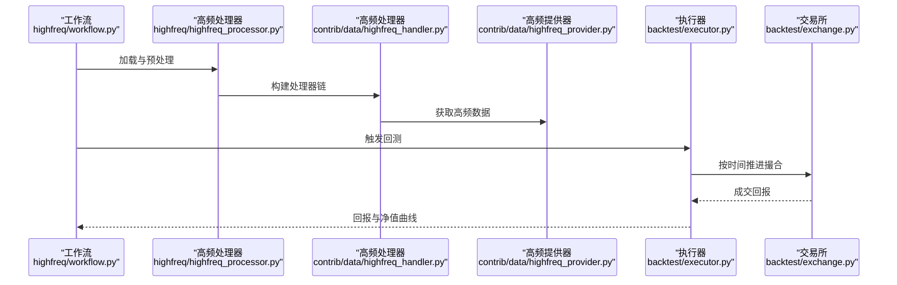
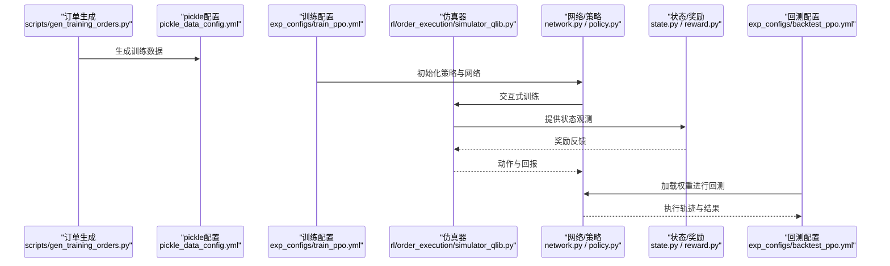
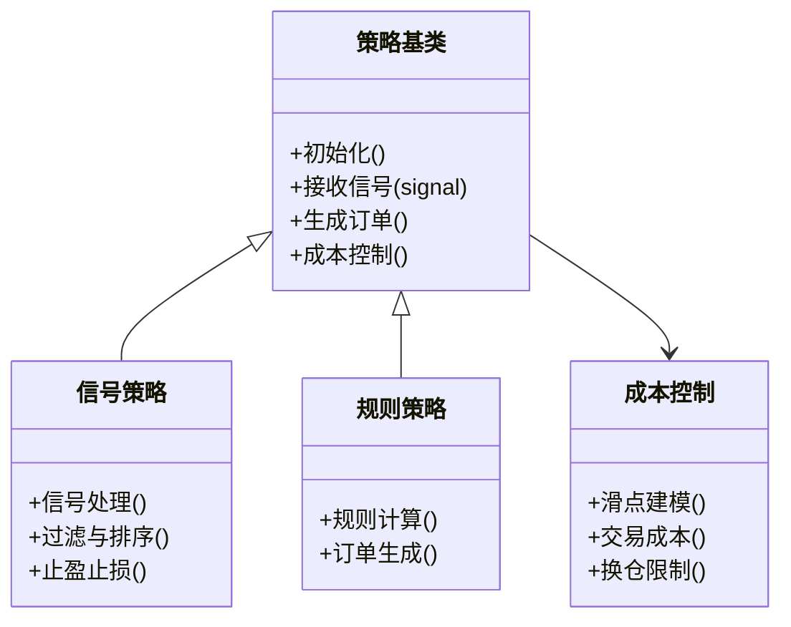
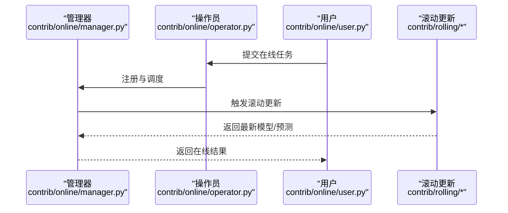
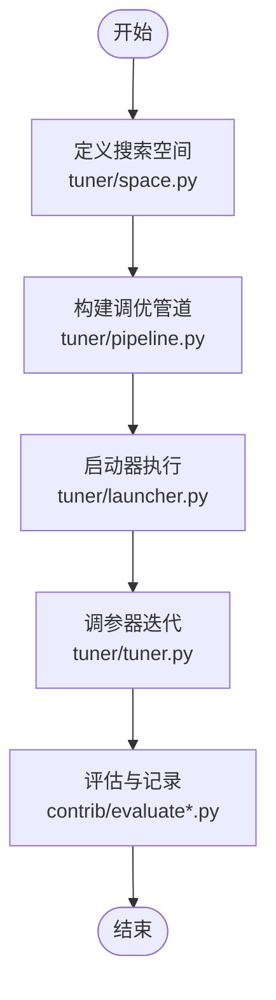
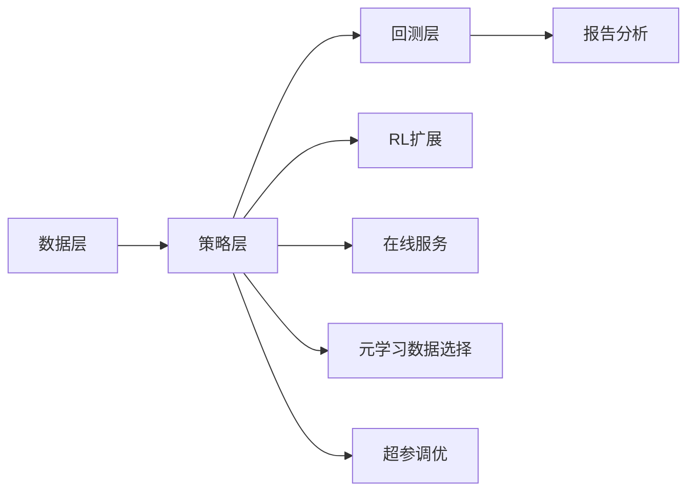

# 高级应用示例

<cite>
**本文引用的文件**
- [examples/portfolio/README.md](file://examples/portfolio/README.md)
- [examples/portfolio/config_enhanced_indexing.yaml](file://examples/portfolio/config_enhanced_indexing.yaml)
- [examples/highfreq/README.md](file://examples/highfreq/README.md)
- [examples/highfreq/workflow.py](file://examples/highfreq/workflow.py)
- [examples/highfreq/workflow_config_High_Freq_Tree_Alpha158.yaml](file://examples/highfreq/workflow_config_High_Freq_Tree_Alpha158.yaml)
- [examples/rl_order_execution/README.md](file://examples/rl_order_execution/README.md)
- [examples/rl_order_execution/exp_configs/train_ppo.yml](file://examples/rl_order_execution/exp_configs/train_ppo.yml)
- [examples/rl_order_execution/exp_configs/backtest_ppo.yml](file://examples/rl_order_execution/exp_configs/backtest_ppo.yml)
- [examples/rl_order_execution/scripts/gen_training_orders.py](file://examples/rl_order_execution/scripts/gen_training_orders.py)
- [examples/rl_order_execution/scripts/pickle_data_config.yml](file://examples/rl_order_execution/scripts/pickle_data_config.yml)
- [qlib/rl/order_execution/simulator_qlib.py](file://qlib/rl/order_execution/simulator_qlib.py)
- [qlib/rl/order_execution/network.py](file://qlib/rl/order_execution/network.py)
- [qlib/rl/order_execution/policy.py](file://qlib/rl/order_execution/policy.py)
- [qlib/rl/order_execution/state.py](file://qlib/rl/order_execution/state.py)
- [qlib/rl/order_execution/reward.py](file://qlib/rl/order_execution/reward.py)
- [qlib/strategy/base.py](file://qlib/strategy/base.py)
- [qlib/backtest/executor.py](file://qlib/backtest/executor.py)
- [qlib/backtest/exchange.py](file://qlib/backtest/exchange.py)
- [qlib/contrib/strategy/order_generator.py](file://qlib/contrib/strategy/order_generator.py)
- [qlib/contrib/strategy/rule_strategy.py](file://qlib/contrib/strategy/rule_strategy.py)
- [qlib/contrib/strategy/signal_strategy.py](file://qlib/contrib/strategy/signal_strategy.py)
- [qlib/contrib/strategy/cost_control.py](file://qlib/contrib/strategy/cost_control.py)
- [qlib/contrib/strategy/optimizer/optimizer.py](file://qlib/contrib/strategy/optimizer/optimizer.py)
- [qlib/contrib/strategy/optimizer/enhanced_indexing.py](file://qlib/contrib/strategy/optimizer/enhanced_indexing.py)
- [qlib/model/riskmodel/shrink.py](file://qlib/model/riskmodel/shrink.py)
- [qlib/model/riskmodel/poet.py](file://qlib/model/riskmodel/poet.py)
- [qlib/backtest/report.py](file://qlib/backtest/report.py)
- [qlib/backtest/profit_attribution.py](file://qlib/backtest/profit_attribution.py)
- [qlib/contrib/online/manager.py](file://qlib/contrib/online/online_manager.py)
- [qlib/contrib/online/operator.py](file://qlib/contrib/online/operator.py)
- [qlib/contrib/online/user.py](file://qlib/contrib/online/user.py)
- [qlib/contrib/online/utils.py](file://qlib/contrib/online/utils.py)
- [qlib/contrib/tuner/launcher.py](file://qlib/contrib/tuner/launcher.py)
- [qlib/contrib/tuner/pipeline.py](file://qlib/contrib/tuner/pipeline.py)
- [qlib/contrib/tuner/tuner.py](file://qlib/contrib/tuner/tuner.py)
- [qlib/contrib/tuner/space.py](file://qlib/contrib/tuner/space.py)
- [qlib/contrib/meta/data_selection/dataset.py](file://qlib/contrib/meta/data_selection/dataset.py)
- [qlib/contrib/meta/data_selection/model.py](file://qlib/contrib/meta/data_selection/model.py)
- [qlib/contrib/meta/data_selection/net.py](file://qlib/contrib/meta/data_selection/net.py)
- [qlib/contrib/meta/data_selection/utils.py](file://qlib/contrib/meta/data_selection/utils.py)
- [qlib/contrib/eva/alpha.py](file://qlib/contrib/eva/alpha.py)
- [qlib/contrib/ops/high_freq.py](file://qlib/contrib/ops/high_freq.py)
- [qlib/contrib/data/highfreq_handler.py](file://qlib/contrib/data/highfreq_handler.py)
- [qlib/contrib/data/highfreq_processor.py](file://qlib/contrib/data/highfreq_processor.py)
- [qlib/contrib/data/highfreq_provider.py](file://qlib/contrib/data/highfreq_provider.py)
- [qlib/contrib/data/loader.py](file://qlib/contrib/data/loader.py)
- [qlib/contrib/data/processor.py](file://qlib/contrib/data/processor.py)
- [qlib/contrib/data/dataset.py](file://qlib/contrib/data/dataset.py)
- [qlib/contrib/data/data.py](file://qlib/contrib/data/data.py)
- [qlib/contrib/data/utils/sepdf.py](file://qlib/contrib/data/utils/sepdf.py)
- [qlib/contrib/evaluate.py](file://qlib/contrib/evaluate.py)
- [qlib/contrib/evaluate_portfolio.py](file://qlib/contrib/evaluate_portfolio.py)
- [qlib/contrib/report/analysis_model/analysis_model_performance.py](file://qlib/contrib/report/analysis_model/analysis_model_performance.py)
- [qlib/contrib/report/analysis_position/rank_label.py](file://qlib/contrib/report/analysis_position/rank_label.py)
- [qlib/contrib/report/analysis_position/score_ic.py](file://qlib/contrib/report/analysis_position/score_ic.py)
- [qlib/contrib/report/analysis_position/risk_analysis.py](file://qlib/contrib/report/analysis_position/risk_analysis.py)
- [qlib/contrib/report/analysis_position/report.py](file://qlib/contrib/report/analysis_position/report.py)
- [qlib/contrib/report/graph.py](file://qlib/contrib/report/graph.py)
- [qlib/contrib/report/utils.py](file://qlib/contrib/report/utils.py)
- [qlib/contrib/rolling/base.py](file://qlib/contrib/rolling/base.py)
- [qlib/contrib/rolling/ddgda.py](file://qlib/contrib/rolling/ddgda.py)
- [qlib/contrib/rolling/__main__.py](file://qlib/contrib/rolling/__main__.py)
- [qlib/contrib/rolling/__main__.py](file://qlib/contrib/rolling/__main__.py)
- [qlib/contrib/rolling/base.py](file://qlib/contrib/rolling/base.py)
- [qlib/contrib/rolling/ddgda.py](file://qlib/contrib/rolling/ddgda.py)
- [qlib/contrib/rolling/__main__.py](file://qlib/contrib/rolling/__main__.py)
- [qlib/contrib/rolling/__main__.py](file://qlib/contrib/rolling/__main__.py)
- [qlib/contrib/rolling/base.py](file://qlib/contrib/rolling/base.py)
- [qlib/contrib/rolling/ddgda.py](file://qlib/contrib/rolling/ddgda.py)
- [qlib/contrib/rolling/__main__.py](file://qlib/contrib/rolling/__main__.py)
- [qlib/contrib/rolling/__main__.py](file://qlib/contrib/rolling/__main__.py)
- [qlib/contrib/rolling/base.py](file://qlib/contrib/rolling/base.py)
- [qlib/contrib/rolling/ddgda.py](file://qlib/contrib/rolling/ddgda.py)
- [qlib/contrib/rolling/__main__.py](file://qlib/contrib/rolling/__main__.py)
- [qlib/contrib/rolling/__main__.py](file://qlib/contrib/rolling/__main__.py)
- [qlib/contrib/rolling/base.py](file://qlib/contrib/rolling/base.py)
- [qlib/contrib/rolling/ddgda.py](file://qlib/contrib/rolling/ddgda.py)
- [qlib/contrib/rolling/__main__.py](file://qlib/contrib/rolling/__main__.py)
- [qlib/contrib/rolling/__main__.py](file://qlib/contrib/rolling/__main__.py)
- [qlib/contrib/rolling/base.py](file://qlib/contrib/rolling/base.py)
- [qlib/contrib/rolling/ddgda.py](file://qlib/contrib/rolling/ddgda.py)
- [qlib/contrib/rolling/__main__.py](file://qlib/contrib/rolling/__main__.py)
- [qlib/contrib/rolling/__main__.py](file://qlib/contrib/rolling/__main__.py......
</cite>

## 目录
1. 引言
2. 项目结构
3. 核心组件
4. 架构总览
5. 详细组件分析
6. 依赖关系分析
7. 性能考量
8. 故障排查指南
9. 结论
10. 附录

## 引言
本文件面向希望在Qlib上开展高级量化研究与工程实践的用户，系统梳理并解析以下高级应用示例：复杂策略开发（含信号策略、规则策略、成本控制）、多市场分析（跨市场数据加载与处理）、高频交易（高频数据处理、高频回测）、强化学习订单执行（基于Qlib仿真器的RL训练与回测）、投资组合优化（增强型指数跟踪）。文档不仅给出技术实现要点、配置参数与性能考量，还提供可直接复用的项目示例与最佳实践，帮助读者构建从数据到策略再到报告的完整量化研究工作流。

## 项目结构
高级应用示例主要分布在examples目录下，并与qlib核心模块形成清晰的分层关系：
- examples/portfolio：投资组合优化示例，包含增强型指数跟踪配置与风险因子准备脚本
- examples/highfreq：高频数据处理与回测示例，包含工作流与配置文件
- examples/rl_order_execution：强化学习订单执行示例，包含训练与回测配置、数据生成脚本
- qlib/strategy：策略基类与多种策略实现（信号策略、规则策略、订单生成、成本控制）
- qlib/backtest：回测引擎（执行器、交易所、报告、归因）
- qlib/contrib：扩展能力（在线服务、评估、报告分析、滚动更新、元学习数据选择、强化学习订单执行等）

图表来源
- [examples/portfolio/README.md](file://examples/portfolio/README.md)
- [examples/highfreq/README.md](file://examples/highfreq/README.md)
- [examples/rl_order_execution/README.md](file://examples/rl_order_execution/README.md)
- [qlib/strategy/base.py](file://qlib/strategy/base.py)
- [qlib/backtest/executor.py](file://qlib/backtest/executor.py)
- [qlib/backtest/exchange.py](file://qlib/backtest/exchange.py)
- [qlib/backtest/report.py](file://qlib/backtest/report.py)
- [qlib/backtest/profit_attribution.py](file://qlib/backtest/profit_attribution.py)
- [qlib/contrib/strategy/signal_strategy.py](file://qlib/contrib/strategy/signal_strategy.py)
- [qlib/contrib/strategy/rule_strategy.py](file://qlib/contrib/strategy/rule_strategy.py)
- [qlib/contrib/strategy/order_generator.py](file://qlib/contrib/strategy/order_generator.py)
- [qlib/contrib/strategy/cost_control.py](file://qlib/contrib/strategy/cost_control.py)
- [qlib/rl/order_execution/simulator_qlib.py](file://qlib/rl/order_execution/simulator_qlib.py)
- [qlib/contrib/evaluate.py](file://qlib/contrib/evaluate.py)
- [qlib/contrib/evaluate_portfolio.py](file://qlib/contrib/evaluate_portfolio.py)
- [qlib/contrib/report/analysis_model/analysis_model_performance.py](file://qlib/contrib/report/analysis_model/analysis_model_performance.py)
- [qlib/contrib/report/analysis_position/risk_analysis.py](file://qlib/contrib/report/analysis_position/risk_analysis.py)
- [qlib/contrib/online/manager.py](file://qlib/contrib/online/manager.py)
- [qlib/contrib/meta/data_selection/dataset.py](file://qlib/contrib/meta/data_selection/dataset.py)
- [qlib/contrib/tuner/launcher.py](file://qlib/contrib/tuner/launcher.py)

章节来源
- [examples/portfolio/README.md](file://examples/portfolio/README.md)
- [examples/highfreq/README.md](file://examples/highfreq/README.md)
- [examples/rl_order_execution/README.md](file://examples/rl_order_execution/README.md)

## 核心组件
- 策略基类与策略族：提供统一的策略接口与扩展点，支持信号驱动、规则驱动、订单生成与成本控制
- 回测引擎：封装执行器、交易所、报告与归因，支撑多市场、多频度回测
- 贡献模块：包括RL订单执行、在线服务、评估与报告分析、滚动更新、元学习数据选择、超参与管道等
- 投资组合优化：通过增强型指数跟踪配置与风险因子准备，实现目标权重与跟踪误差控制

章节来源
- [qlib/strategy/base.py](file://qlib/strategy/base.py)
- [qlib/contrib/strategy/signal_strategy.py](file://qlib/contrib/strategy/signal_strategy.py)
- [qlib/contrib/strategy/rule_strategy.py](file://qlib/contrib/strategy/rule_strategy.py)
- [qlib/contrib/strategy/order_generator.py](file://qlib/contrib/strategy/order_generator.py)
- [qlib/contrib/strategy/cost_control.py](file://qlib/contrib/strategy/cost_control.py)
- [qlib/backtest/executor.py](file://qlib/backtest/executor.py)
- [qlib/backtest/exchange.py](file://qlib/backtest/exchange.py)
- [qlib/backtest/report.py](file://qlib/backtest/report.py)
- [qlib/backtest/profit_attribution.py](file://qlib/backtest/profit_attribution.py)
- [qlib/contrib/evaluate.py](file://qlib/contrib/evaluate.py)
- [qlib/contrib/evaluate_portfolio.py](file://qlib/contrib/evaluate_portfolio.py)
- [qlib/contrib/report/analysis_model/analysis_model_performance.py](file://qlib/contrib/report/analysis_model/analysis_model_performance.py)
- [qlib/contrib/report/analysis_position/risk_analysis.py](file://qlib/contrib/report/analysis_position/risk_analysis.py)

## 架构总览
下图展示了从数据到策略再到回测与报告的整体架构，以及RL订单执行与在线服务的扩展路径。

图表来源
- [qlib/contrib/data/data.py](file://qlib/contrib/data/data.py)
- [qlib/contrib/data/handler.py](file://qlib/contrib/data/handler.py)
- [qlib/contrib/data/loader.py](file://qlib/contrib/data/loader.py)
- [qlib/contrib/data/dataset.py](file://qlib/contrib/data/dataset.py)
- [qlib/strategy/base.py](file://qlib/strategy/base.py)
- [qlib/contrib/strategy/signal_strategy.py](file://qlib/contrib/strategy/signal_strategy.py)
- [qlib/contrib/strategy/rule_strategy.py](file://qlib/contrib/strategy/rule_strategy.py)
- [qlib/contrib/strategy/order_generator.py](file://qlib/contrib/strategy/order_generator.py)
- [qlib/contrib/strategy/cost_control.py](file://qlib/contrib/strategy/cost_control.py)
- [qlib/backtest/executor.py](file://qlib/backtest/executor.py)
- [qlib/backtest/exchange.py](file://qlib/backtest/exchange.py)
- [qlib/backtest/report.py](file://qlib/backtest/report.py)
- [qlib/contrib/report/graph.py](file://qlib/contrib/report/graph.py)
- [qlib/rl/order_execution/simulator_qlib.py](file://qlib/rl/order_execution/simulator_qlib.py)
- [qlib/rl/order_execution/network.py](file://qlib/rl/order_execution/network.py)
- [qlib/rl/order_execution/policy.py](file://qlib/rl/order_execution/policy.py)
- [qlib/rl/order_execution/state.py](file://qlib/rl/order_execution/state.py)
- [qlib/rl/order_execution/reward.py](file://qlib/rl/order_execution/reward.py)
- [qlib/contrib/online/manager.py](file://qlib/contrib/online/manager.py)
- [qlib/contrib/online/operator.py](file://qlib/contrib/online/operator.py)
- [qlib/contrib/online/user.py](file://qlib/contrib/online/user.py)
- [qlib/contrib/meta/data_selection/dataset.py](file://qlib/contrib/meta/data_selection/dataset.py)
- [qlib/contrib/tuner/launcher.py](file://qlib/contrib/tuner/launcher.py)
- [qlib/contrib/tuner/pipeline.py](file://qlib/contrib/tuner/pipeline.py)
- [qlib/contrib/tuner/tuner.py](file://qlib/contrib/tuner/tuner.py)
- [qlib/contrib/tuner/space.py](file://qlib/contrib/tuner/space.py)

## 详细组件分析

### 投资组合优化（增强型指数跟踪）
- 示例说明：通过配置文件定义目标指数、基准权重、风险因子与跟踪误差约束，结合优化器实现增强型指数跟踪
- 关键配置项：目标指数、样本内/外时间窗、优化目标（如最小化跟踪误差）、风险因子矩阵、权重上下限
- 实现要点：优化器负责求解权重，成本控制参与交易成本建模；报告模块输出跟踪误差、IC等指标
- 适用场景：被动增强策略、ETF复制与增强、FOF组合权重优化
- 限制条件：对历史数据质量与因子稳定性要求较高；需合理设置跟踪误差阈值与滑点成本

图表来源
- [examples/portfolio/config_enhanced_indexing.yaml](file://examples/portfolio/config_enhanced_indexing.yaml)
- [examples/portfolio/README.md](file://examples/portfolio/README.md)
- [qlib/contrib/strategy/optimizer/enhanced_indexing.py](file://qlib/contrib/strategy/optimizer/enhanced_indexing.py)
- [qlib/backtest/report.py](file://qlib/backtest/report.py)

章节来源
- [examples/portfolio/README.md](file://examples/portfolio/README.md)
- [examples/portfolio/config_enhanced_indexing.yaml](file://examples/portfolio/config_enhanced_indexing.yaml)
- [qlib/contrib/strategy/optimizer/enhanced_indexing.py](file://qlib/contrib/strategy/optimizer/enhanced_indexing.py)
- [qlib/backtest/report.py](file://qlib/backtest/report.py)

### 多市场分析与高频交易
- 示例说明：高频数据处理与回测，支持分钟级/Tick级数据的加载、清洗、特征工程与回测
- 关键流程：高频处理器与处理器链路、高频数据提供器、工作流编排、回测执行
- 参数要点：采样频率、滑点模型、手续费率、最大换手率、订单簿数据窗口
- 适用场景：T0交易、市场微观结构研究、流动性与冲击建模
- 限制条件：数据完整性与延迟要求高；需关注回测中的时间对齐与撮合精度

图表来源
- [examples/highfreq/workflow.py](file://examples/highfreq/workflow.py)
- [examples/highfreq/README.md](file://examples/highfreq/README.md)
- [qlib/contrib/data/highfreq_processor.py](file://qlib/contrib/data/highfreq_processor.py)
- [qlib/contrib/data/highfreq_handler.py](file://qlib/contrib/data/highfreq_handler.py)
- [qlib/contrib/data/highfreq_provider.py](file://qlib/contrib/data/highfreq_provider.py)
- [qlib/backtest/executor.py](file://qlib/backtest/executor.py)
- [qlib/backtest/exchange.py](file://qlib/backtest/exchange.py)

章节来源
- [examples/highfreq/README.md](file://examples/highfreq/README.md)
- [examples/highfreq/workflow.py](file://examples/highfreq/workflow.py)
- [examples/highfreq/workflow_config_High_Freq_Tree_Alpha158.yaml](file://examples/highfreq/workflow_config_High_Freq_Tree_Alpha158.yaml)
- [qlib/contrib/data/highfreq_processor.py](file://qlib/contrib/data/highfreq_processor.py)
- [qlib/contrib/data/highfreq_handler.py](file://qlib/contrib/data/highfreq_handler.py)
- [qlib/contrib/data/highfreq_provider.py](file://qlib/contrib/data/highfreq_provider.py)
- [qlib/backtest/executor.py](file://qlib/backtest/executor.py)
- [qlib/backtest/exchange.py](file://qlib/backtest/exchange.py)

### 强化学习订单执行
- 示例说明：基于Qlib仿真器的RL订单执行训练与回测，支持PPO等策略在仿真环境中的训练与测试
- 关键组件：状态表示（市场状态、订单状态）、奖励设计（市场影响、滑点、时间价值）、网络与策略模块、仿真器
- 训练与回测配置：训练配置文件、回测配置文件、训练订单生成脚本、pickle数据配置
- 适用场景：算法交易中的订单拆分与执行路径优化、市场冲击最小化
- 限制条件：仿真器与真实市场的差异、状态空间与动作空间设计对性能影响大

图表来源
- [examples/rl_order_execution/scripts/gen_training_orders.py](file://examples/rl_order_execution/scripts/gen_training_orders.py)
- [examples/rl_order_execution/scripts/pickle_data_config.yml](file://examples/rl_order_execution/scripts/pickle_data_config.yml)
- [examples/rl_order_execution/exp_configs/train_ppo.yml](file://examples/rl_order_execution/exp_configs/train_ppo.yml)
- [examples/rl_order_execution/exp_configs/backtest_ppo.yml](file://examples/rl_order_execution/exp_configs/backtest_ppo.yml)
- [qlib/rl/order_execution/simulator_qlib.py](file://qlib/rl/order_execution/simulator_qlib.py)
- [qlib/rl/order_execution/network.py](file://qlib/rl/order_execution/network.py)
- [qlib/rl/order_execution/policy.py](file://qlib/rl/order_execution/policy.py)
- [qlib/rl/order_execution/state.py](file://qlib/rl/order_execution/state.py)
- [qlib/rl/order_execution/reward.py](file://qlib/rl/order_execution/reward.py)

章节来源
- [examples/rl_order_execution/README.md](file://examples/rl_order_execution/README.md)
- [examples/rl_order_execution/exp_configs/train_ppo.yml](file://examples/rl_order_execution/exp_configs/train_ppo.yml)
- [examples/rl_order_execution/exp_configs/backtest_ppo.yml](file://examples/rl_order_execution/exp_configs/backtest_ppo.yml)
- [examples/rl_order_execution/scripts/gen_training_orders.py](file://examples/rl_order_execution/scripts/gen_training_orders.py)
- [examples/rl_order_execution/scripts/pickle_data_config.yml](file://examples/rl_order_execution/scripts/pickle_data_config.yml)
- [qlib/rl/order_execution/simulator_qlib.py](file://qlib/rl/order_execution/simulator_qlib.py)
- [qlib/rl/order_execution/network.py](file://qlib/rl/order_execution/network.py)
- [qlib/rl/order_execution/policy.py](file://qlib/rl/order_execution/policy.py)
- [qlib/rl/order_execution/state.py](file://qlib/rl/order_execution/state.py)
- [qlib/rl/order_execution/reward.py](file://qlib/rl/order_execution/reward.py)

### 复杂策略开发（信号/规则/成本控制）
- 策略基类：提供统一的策略生命周期与接口，便于扩展信号策略、规则策略与混合策略
- 信号策略：以预测信号驱动下单，支持信号平滑、置信度过滤与止盈止损
- 规则策略：基于固定规则（如动量、均值回归）生成订单，适合快速验证思路
- 成本控制：内置滑点、交易成本与换仓限制，避免过度交易与冲击放大
- 组合使用：信号策略+规则策略+成本控制，形成稳健的决策闭环

图表来源
- [qlib/strategy/base.py](file://qlib/strategy/base.py)
- [qlib/contrib/strategy/signal_strategy.py](file://qlib/contrib/strategy/signal_strategy.py)
- [qlib/contrib/strategy/rule_strategy.py](file://qlib/contrib/strategy/rule_strategy.py)
- [qlib/contrib/strategy/cost_control.py](file://qlib/contrib/strategy/cost_control.py)

章节来源
- [qlib/strategy/base.py](file://qlib/strategy/base.py)
- [qlib/contrib/strategy/signal_strategy.py](file://qlib/contrib/strategy/signal_strategy.py)
- [qlib/contrib/strategy/rule_strategy.py](file://qlib/contrib/strategy/rule_strategy.py)
- [qlib/contrib/strategy/cost_control.py](file://qlib/contrib/strategy/cost_control.py)

### 在线服务与滚动更新
- 在线管理器：负责在线模型的注册、更新与预测调度
- 操作员与用户：在线服务的业务接入与监控入口
- 滚动更新：支持滚动窗口内的模型更新与预测替换，保证时效性
- 适用场景：实时预测服务、动态权重调整、A/B测试与灰度发布

图表来源
- [qlib/contrib/online/manager.py](file://qlib/contrib/online/manager.py)
- [qlib/contrib/online/operator.py](file://qlib/contrib/online/operator.py)
- [qlib/contrib/online/user.py](file://qlib/contrib/online/user.py)
- [qlib/contrib/rolling/base.py](file://qlib/contrib/rolling/base.py)
- [qlib/contrib/rolling/ddgda.py](file://qlib/contrib/rolling/ddgda.py)

章节来源
- [qlib/contrib/online/manager.py](file://qlib/contrib/online/manager.py)
- [qlib/contrib/online/operator.py](file://qlib/contrib/online/operator.py)
- [qlib/contrib/online/user.py](file://qlib/contrib/online/user.py)
- [qlib/contrib/rolling/base.py](file://qlib/contrib/rolling/base.py)
- [qlib/contrib/rolling/ddgda.py](file://qlib/contrib/rolling/ddgda.py)

### 元学习数据选择与超参调优
- 数据选择：通过元学习方法自动筛选高质量数据集，提升模型稳定性
- 超参调优：提供启动器、管道与调参器，支持贝叶斯/网格搜索与自定义搜索空间
- 适用场景：特征工程与数据质量评估、模型超参自动化搜索
- 注意事项：搜索空间设计与预算控制，避免过拟合与计算资源浪费

图表来源
- [qlib/contrib/tuner/space.py](file://qlib/contrib/tuner/space.py)
- [qlib/contrib/tuner/pipeline.py](file://qlib/contrib/tuner/pipeline.py)
- [qlib/contrib/tuner/launcher.py](file://qlib/contrib/tuner/launcher.py)
- [qlib/contrib/tuner/tuner.py](file://qlib/contrib/tuner/tuner.py)
- [qlib/contrib/evaluate.py](file://qlib/contrib/evaluate.py)
- [qlib/contrib/evaluate_portfolio.py](file://qlib/contrib/evaluate_portfolio.py)

章节来源
- [qlib/contrib/meta/data_selection/dataset.py](file://qlib/contrib/meta/data_selection/dataset.py)
- [qlib/contrib/meta/data_selection/model.py](file://qlib/contrib/meta/data_selection/model.py)
- [qlib/contrib/meta/data_selection/net.py](file://qlib/contrib/meta/data_selection/net.py)
- [qlib/contrib/meta/data_selection/utils.py](file://qlib/contrib/meta/data_selection/utils.py)
- [qlib/contrib/tuner/space.py](file://qlib/contrib/tuner/space.py)
- [qlib/contrib/tuner/pipeline.py](file://qlib/contrib/tuner/pipeline.py)
- [qlib/contrib/tuner/launcher.py](file://qlib/contrib/tuner/launcher.py)
- [qlib/contrib/tuner/tuner.py](file://qlib/contrib/tuner/tuner.py)
- [qlib/contrib/evaluate.py](file://qlib/contrib/evaluate.py)
- [qlib/contrib/evaluate_portfolio.py](file://qlib/contrib/evaluate_portfolio.py)

## 依赖关系分析
- 组件耦合：策略层与回测层松耦合，通过统一接口交互；RL扩展与在线服务作为插件式模块接入
- 外部依赖：高频示例依赖外部数据源与处理器链；RL示例依赖仿真器与状态/奖励模块
- 潜在环依赖：当前结构以单向依赖为主，建议保持“示例→策略→回测”的方向，避免反向耦合

图表来源
- [qlib/strategy/base.py](file://qlib/strategy/base.py)
- [qlib/backtest/executor.py](file://qlib/backtest/executor.py)
- [qlib/backtest/report.py](file://qlib/backtest/report.py)
- [qlib/contrib/online/manager.py](file://qlib/contrib/online/manager.py)
- [qlib/contrib/meta/data_selection/dataset.py](file://qlib/contrib/meta/data_selection/dataset.py)
- [qlib/contrib/tuner/launcher.py](file://qlib/contrib/tuner/launcher.py)

章节来源
- [qlib/strategy/base.py](file://qlib/strategy/base.py)
- [qlib/backtest/executor.py](file://qlib/backtest/executor.py)
- [qlib/backtest/report.py](file://qlib/backtest/report.py)
- [qlib/contrib/online/manager.py](file://qlib/contrib/online/manager.py)
- [qlib/contrib/meta/data_selection/dataset.py](file://qlib/contrib/meta/data_selection/dataset.py)
- [qlib/contrib/tuner/launcher.py](file://qlib/contrib/tuner/launcher.py)

## 性能考量
- 数据加载与缓存：高频数据量大，建议启用缓存与增量加载；合理设置批大小与并行度
- 回测效率：使用高性能数据结构与向量化操作；减少不必要的对象创建；按需裁剪时间窗
- RL训练：状态空间与动作空间规模直接影响收敛速度；建议先简化状态再逐步扩展
- 在线服务：模型序列化与热加载；滚动更新窗口长度与触发条件需权衡延迟与准确性
- 风险模型：协方差估计与稀疏化在大数据下更稳定；注意计算复杂度与内存占用

## 故障排查指南
- 高频数据缺失或乱序：检查数据采集与清洗流程，确认时间戳对齐与去重
- 回测结果异常：核对滑点、手续费与换仓限制设置；检查订单生成逻辑与成交回报
- RL训练不收敛：检查奖励函数设计与探索策略；降低动作维度或增加正则
- 在线服务延迟高：优化模型推理路径与缓存策略；检查滚动更新频率
- 报告指标异常：确认样本内/外划分与归因逻辑；检查IC、收益分解等计算口径

章节来源
- [qlib/backtest/report.py](file://qlib/backtest/report.py)
- [qlib/backtest/profit_attribution.py](file://qlib/backtest/profit_attribution.py)
- [qlib/contrib/report/analysis_position/risk_analysis.py](file://qlib/contrib/report/analysis_position/risk_analysis.py)
- [qlib/contrib/report/analysis_position/score_ic.py](file://qlib/contrib/report/analysis_position/score_ic.py)

## 结论
通过上述高级应用示例，Qlib为复杂量化研究提供了从数据处理、策略开发、回测评估到在线服务与元学习的全栈能力。建议在实际项目中遵循“先简单后复杂、先离线后在线”的原则，逐步引入RL、高频与在线能力，并结合超参调优与元学习提升模型稳定性与泛化性能。

## 附录
- 快速开始清单
  - 准备数据：参考高频示例的数据加载与处理器配置
  - 定义策略：基于策略基类扩展信号/规则策略，加入成本控制
  - 回测验证：使用回测引擎跑样本内/外，关注IC、收益与波动
  - 在线部署：通过在线管理器与滚动更新实现模型上线
  - RL训练：使用仿真器与状态/奖励模块训练订单执行策略
  - 超参与元学习：利用调优管道与数据选择提升稳定性