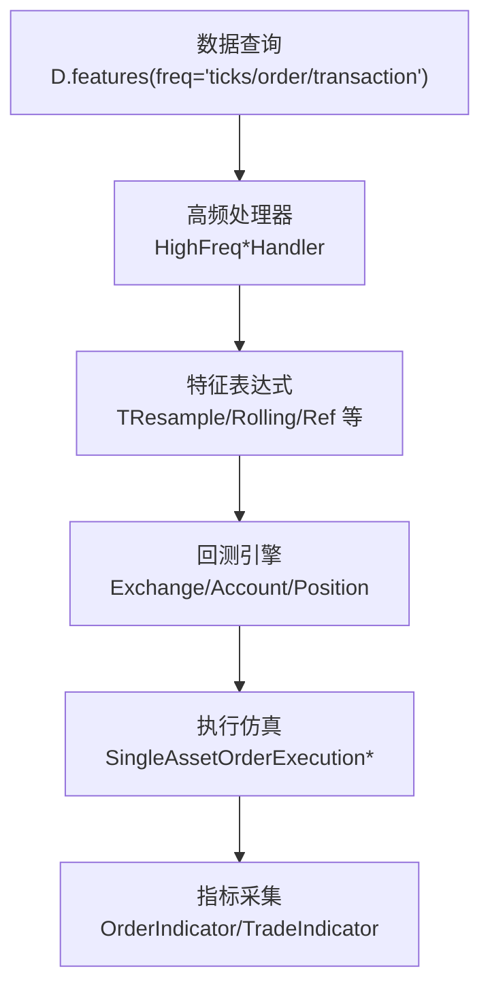
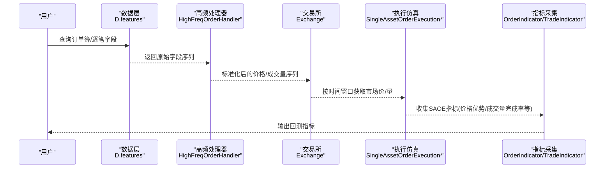
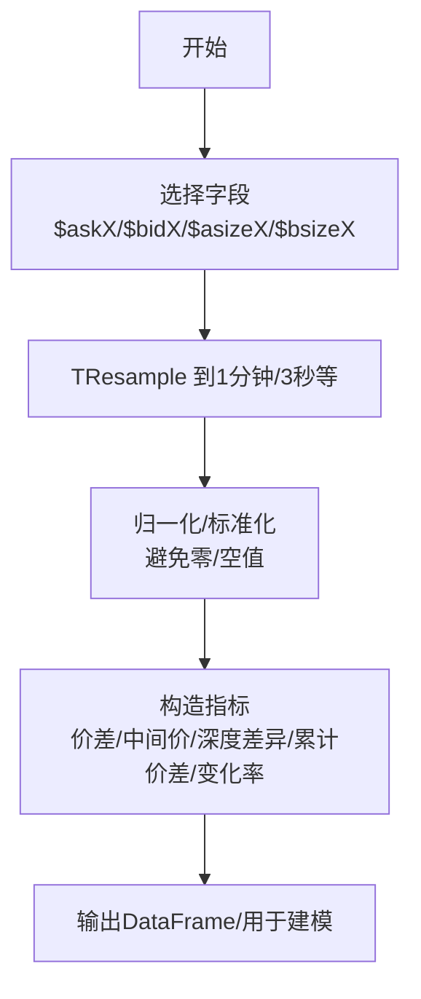
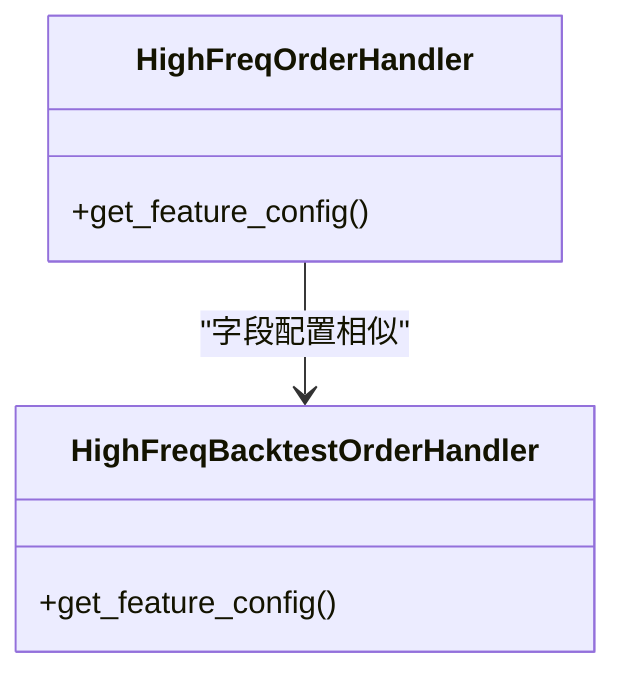
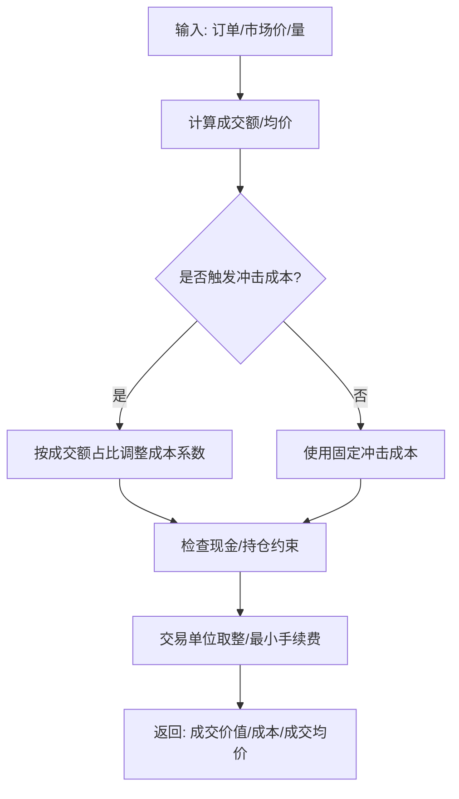
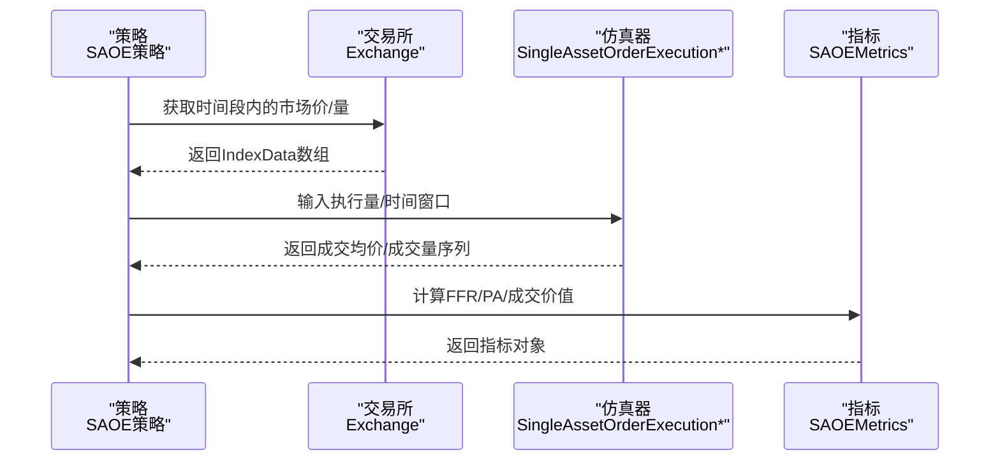
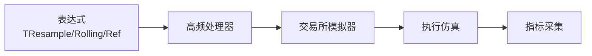

# 市场微观结构分析

<cite>
**本文引用的文件**
- [examples/orderbook_data/example.py](file://examples/orderbook_data/example.py)
- [examples/orderbook_data/create_dataset.py](file://examples/orderbook_data/create_dataset.py)
- [qlib/contrib/data/highfreq_handler.py](file://qlib/contrib/data/highfreq_handler.py)
- [qlib/backtest/exchange.py](file://qlib/backtest/exchange.py)
- [qlib/backtest/report.py](file://qlib/backtest/report.py)
- [qlib/rl/order_execution/strategy.py](file://qlib/rl/order_execution/strategy.py)
- [qlib/rl/order_execution/simulator_simple.py](file://qlib/rl/order_execution/simulator_simple.py)
</cite>

## 目录
1. [引言](#引言)
2. [项目结构](#项目结构)
3. [核心组件](#核心组件)
4. [架构总览](#架构总览)
5. [详细组件分析](#详细组件分析)
6. [依赖关系分析](#依赖关系分析)
7. [性能考量](#性能考量)
8. [故障排查指南](#故障排查指南)
9. [结论](#结论)
10. [附录：指标与实现路径](#附录指标与实现路径)

## 引言
本文件面向希望在Qlib中开展市场微观结构（Market Microstructure）分析的研究者与工程师，系统梳理从订单簿数据到高频特征工程、交易执行仿真与回测报告的完整流程。内容覆盖：
- 微观结构基本概念与理论基础（买卖价差、流动性供给、市场深度、价格发现、市场冲击与交易摩擦）
- 订单簿数据的分析方法与特征表达式
- 价格优势（PA）、成交量分布、价差与深度差异等指标的实现路径
- 实际分析案例与参数设置建议

## 项目结构
围绕微观结构分析，Qlib在以下模块提供了关键能力：
- 数据层：支持tick级订单簿与逐笔成交/委托数据的查询与特征表达式
- 处理层：高频处理器对字段进行标准化、缺失填充与暂停状态剔除
- 回测层：交易所模拟器支持滑点/冲击成本、交易单位与涨跌停限制
- 执行层：单资产订单执行仿真与指标采集（含价格优势、成交量完成率）

图示来源
- [examples/orderbook_data/example.py:43-86](file://examples/orderbook_data/example.py#L43-L86)
- [qlib/contrib/data/highfreq_handler.py:41-100](file://qlib/contrib/data/highfreq_handler.py#L41-L100)
- [qlib/backtest/exchange.py:421-463](file://qlib/backtest/exchange.py#L421-L463)
- [qlib/rl/order_execution/strategy.py:249-282](file://qlib/rl/order_execution/strategy.py#L249-L282)

章节来源
- [examples/orderbook_data/example.py:17-42](file://examples/orderbook_data/example.py#L17-L42)
- [qlib/contrib/data/highfreq_handler.py:8-40](file://qlib/contrib/data/highfreq_handler.py#L8-L40)

## 核心组件
- 订单簿与逐笔数据查询：通过D.features以ticks/order/transaction频率获取$askX/$bidX、$askV/$bidV、$volume等字段
- 高频处理器：对价格/成交量字段进行标准化、填充与暂停过滤，生成可用于建模的稳定序列
- 交易所模拟器：支持滑点/冲击成本、涨跌停限制、交易单位取整、最小手续费约束
- 执行仿真与指标：按时间窗口聚合市场价与成交量，计算价格优势、成交量完成率等

章节来源
- [examples/orderbook_data/example.py:43-86](file://examples/orderbook_data/example.py#L43-L86)
- [qlib/contrib/data/highfreq_handler.py:307-460](file://qlib/contrib/data/highfreq_handler.py#L307-L460)
- [qlib/backtest/exchange.py:421-463](file://qlib/backtest/exchange.py#L421-L463)
- [qlib/rl/order_execution/strategy.py:249-282](file://qlib/rl/order_execution/strategy.py#L249-L282)

## 架构总览
下图展示从数据到指标的关键调用链路。

图示来源
- [examples/orderbook_data/example.py:101-110](file://examples/orderbook_data/example.py#L101-L110)
- [qlib/contrib/data/highfreq_handler.py:307-460](file://qlib/contrib/data/highfreq_handler.py#L307-L460)
- [qlib/backtest/exchange.py:494-514](file://qlib/backtest/exchange.py#L494-L514)
- [qlib/rl/order_execution/strategy.py:140-171](file://qlib/rl/order_execution/strategy.py#L140-L171)
- [qlib/backtest/report.py:278-299](file://qlib/backtest/report.py#L278-L299)

## 详细组件分析

### 组件A：订单簿特征表达式与分析范式
- 目标：基于$askX/$bidX/$asizeX/$bsizeX构建微观结构指标，如价差、中间价权重、深度差异、累计价差等
- 关键思路：
  - 使用TResample在1分钟粒度上重采样，结合Ref/Ref滞后项构造变化率
  - 使用Rolling在更短时间窗口内统计强度与相对强度
  - 对价格/成交量进行归一化与标准化，避免零值与异常值影响
- 典型表达式类别：
  - 价差与中间价权重：2×Δ($askX−$bidX)/Σ($ask1+$bid1)，2×中位数($askX,$bidX)/Σ($ask1+$bid1)
  - 深度差异：2×|Δ$askX|/Σ($ask1..10)，2×|Δ$bidX|/Σ($ask1..10)
  - 成交量分布：Σ($asizeX)/10/Σ($asize..$bsize)，Σ($asize..$bsize)/Σ($asize..$bsize)
  - 累计价差与成交量：2×[Σ$ask_last − Σ$bid_last]/Σ($ask1+$bid1)，[Σ$asize_mean − Σ$bsize_mean]/Σ($asize..$bsize)
  - 变化率：Δ(Δ$askX)/t，Δ(Δ$asizeX)/t，以及对1秒重采样后做滞后差分再均值

图示来源
- [examples/orderbook_data/example.py:88-188](file://examples/orderbook_data/example.py#L88-L188)
- [examples/orderbook_data/example.py:198-308](file://examples/orderbook_data/example.py#L198-L308)

章节来源
- [examples/orderbook_data/example.py:101-188](file://examples/orderbook_data/example.py#L101-L188)
- [examples/orderbook_data/example.py:198-308](file://examples/orderbook_data/example.py#L198-L308)

### 组件B：高频处理器（标准化与暂停过滤）
- 职责：对价格/成交量字段进行日线归一化、前向填充、暂停过滤；对$volume进行日均平滑与滞后构造
- 关键点：
  - 价格字段：按昨日收盘价归一化，支持带滞后shift
  - 成交量字段：按30日日均平滑，支持当前/滞后版本
  - 暂停过滤：通过$paused_num阈值剔除停牌时段

图示来源
- [qlib/contrib/data/highfreq_handler.py:307-460](file://qlib/contrib/data/highfreq_handler.py#L307-L460)
- [qlib/contrib/data/highfreq_handler.py:462-540](file://qlib/contrib/data/highfreq_handler.py#L462-L540)

章节来源
- [qlib/contrib/data/highfreq_handler.py:41-100](file://qlib/contrib/data/highfreq_handler.py#L41-L100)
- [qlib/contrib/data/highfreq_handler.py:144-196](file://qlib/contrib/data/highfreq_handler.py#L144-L196)

### 组件C：交易所模拟器（滑点/冲击与交易约束）
- 职责：根据买卖价字段与成交量序列，计算成交价值、成本与成交均价；支持滑点/冲击成本、涨跌停限制、交易单位取整、最小手续费
- 关键逻辑：
  - 冲击成本随成交额占总成交额比例平方增长，避免过度估计
  - 当可用现金不足或持仓不足时裁剪成交数量
  - 交易单位取整与因子换算

图示来源
- [qlib/backtest/exchange.py:886-917](file://qlib/backtest/exchange.py#L886-L917)

章节来源
- [qlib/backtest/exchange.py:38-200](file://qlib/backtest/exchange.py#L38-L200)
- [qlib/backtest/exchange.py:494-514](file://qlib/backtest/exchange.py#L494-L514)
- [qlib/backtest/exchange.py:886-917](file://qlib/backtest/exchange.py#L886-L917)

### 组件D：执行仿真与指标（价格优势/成交量完成率）
- 职责：按时间窗口聚合市场价与成交量，计算加权平均成交价、成交量完成率、价格优势（PA）
- 关键点：
  - 价格优势定义为(sign·方向)·(成交均价/基准价 − 1)，其中基准价可选TWAP或VWAP
  - 成交量完成率FFR为已成交/计划成交

图示来源
- [qlib/rl/order_execution/strategy.py:140-171](file://qlib/rl/order_execution/strategy.py#L140-L171)
- [qlib/rl/order_execution/strategy.py:249-282](file://qlib/rl/order_execution/strategy.py#L249-L282)
- [qlib/rl/order_execution/simulator_simple.py:156-172](file://qlib/rl/order_execution/simulator_simple.py#L156-L172)

章节来源
- [qlib/rl/order_execution/strategy.py:249-282](file://qlib/rl/order_execution/strategy.py#L249-L282)
- [qlib/backtest/report.py:510-582](file://qlib/backtest/report.py#L510-L582)

## 依赖关系分析
- 数据查询依赖于D.features与字段表达式，表达式中广泛使用TResample/Rolling/Ref等操作符
- 高频处理器依赖于字段配置模板，统一进行标准化与暂停过滤
- 交易所模拟器依赖于价格/成交量/因子等字段，支持多种限制条件
- 执行仿真依赖于交易所提供的市场价/量接口与指标采集模块

图示来源
- [examples/orderbook_data/example.py:88-188](file://examples/orderbook_data/example.py#L88-L188)
- [qlib/contrib/data/highfreq_handler.py:307-460](file://qlib/contrib/data/highfreq_handler.py#L307-L460)
- [qlib/backtest/exchange.py:494-514](file://qlib/backtest/exchange.py#L494-L514)
- [qlib/rl/order_execution/strategy.py:140-171](file://qlib/rl/order_execution/strategy.py#L140-L171)

章节来源
- [examples/orderbook_data/example.py:88-188](file://examples/orderbook_data/example.py#L88-L188)
- [qlib/contrib/data/highfreq_handler.py:307-460](file://qlib/contrib/data/highfreq_handler.py#L307-L460)
- [qlib/backtest/exchange.py:494-514](file://qlib/backtest/exchange.py#L494-L514)
- [qlib/rl/order_execution/strategy.py:140-171](file://qlib/rl/order_execution/strategy.py#L140-L171)

## 性能考量
- 字段表达式尽量使用TResample/Rolling等向量化操作，减少Python循环
- 高频处理器对$volume采用日均平滑，降低噪声对指标稳定性的影响
- 交易所模拟器在计算冲击成本时避免对极小成交额的过度估计，提高数值稳健性
- 执行仿真中对时间窗口切片与成交量序列进行一致性校验，防止越界与负值

## 故障排查指南
- 字段为空或NaN：检查暂停过滤与前向填充逻辑，确认$paused_num阈值与$close/$factor是否存在
- 成交为0或极端值：检查涨跌停限制、交易单位取整与最小手续费约束
- 指标异常（如PA为无穷大）：确保基准价非零且与成交价在同一时间窗口内对齐
- 执行量越界：核对策略输出的执行量与持仓上限，避免超买/超卖

章节来源
- [qlib/contrib/data/highfreq_handler.py:48-62](file://qlib/contrib/data/highfreq_handler.py#L48-L62)
- [qlib/backtest/exchange.py:886-917](file://qlib/backtest/exchange.py#L886-L917)
- [qlib/backtest/report.py:510-582](file://qlib/backtest/report.py#L510-L582)

## 结论
Qlib在订单簿数据、高频特征工程、交易执行仿真与回测指标方面提供了完整的微观结构分析能力。通过规范化的字段表达式与处理器配置，可以稳健地提取价差、深度、流动性供给与价格发现等关键指标；结合滑点/冲击成本与交易约束，能够更真实地评估交易策略在微观结构层面的表现。

## 附录：指标与实现路径
- 价差与中间价权重
  - 表达式路径：[examples/orderbook_data/example.py:113-128](file://examples/orderbook_data/example.py#L113-L128)
- 深度差异与平均成交量分布
  - 表达式路径：[examples/orderbook_data/example.py:130-153](file://examples/orderbook_data/example.py#L130-L153)
- 累计价差与成交量
  - 表达式路径：[examples/orderbook_data/example.py:155-164](file://examples/orderbook_data/example.py#L155-L164)
- 变化率（3秒窗口）
  - 表达式路径：[examples/orderbook_data/example.py:167-188](file://examples/orderbook_data/example.py#L167-L188)
- 逐笔/委托强度与相对强度
  - 表达式路径：[examples/orderbook_data/example.py:204-268](file://examples/orderbook_data/example.py#L204-L268)
- 价格/成交量变化率（滞后差分）
  - 表达式路径：[examples/orderbook_data/example.py:275-296](file://examples/orderbook_data/example.py#L275-L296)
- 日线滞后变化率
  - 表达式路径：[examples/orderbook_data/example.py:298-308](file://examples/orderbook_data/example.py#L298-L308)
- 高频字段标准化（价格/成交量）
  - 处理器路径：[qlib/contrib/data/highfreq_handler.py:307-460](file://qlib/contrib/data/highfreq_handler.py#L307-L460)
- 交易摩擦与滑点（冲击成本）
  - 实现路径：[qlib/backtest/exchange.py:886-917](file://qlib/backtest/exchange.py#L886-L917)
- 价格优势（PA）与成交量完成率（FFR）
  - 指标路径：[qlib/rl/order_execution/strategy.py:249-282](file://qlib/rl/order_execution/strategy.py#L249-L282)
  - 报告聚合路径：[qlib/backtest/report.py:510-582](file://qlib/backtest/report.py#L510-L582)