# 高频交易应用

<cite>
**本文档引用的文件**
- [examples/highfreq/README.md](file://examples/highfreq/README.md)
- [examples/highfreq/workflow.py](file://examples/highfreq/workflow.py)
- [examples/highfreq/workflow_config_High_Freq_Tree_Alpha158.yaml](file://examples/highfreq/workflow_config_High_Freq_Tree_Alpha158.yaml)
- [examples/highfreq/highfreq_handler.py](file://examples/highfreq/highfreq_handler.py)
- [examples/highfreq/highfreq_processor.py](file://examples/highfreq/highfreq_processor.py)
- [examples/highfreq/highfreq_ops.py](file://examples/highfreq/highfreq_ops.py)
- [qlib/contrib/data/highfreq_handler.py](file://qlib/contrib/data/highfreq_handler.py)
- [qlib/contrib/data/highfreq_processor.py](file://qlib/contrib/data/highfreq_processor.py)
- [qlib/contrib/data/highfreq_provider.py](file://qlib/contrib/data/highfreq_provider.py)
- [qlib/contrib/model/highfreq_gdbt_model.py](file://qlib/contrib/model/highfreq_gdbt_model.py)
- [qlib/backtest/backtest.py](file://qlib/backtest/backtest.py)
- [qlib/backtest/account.py](file://qlib/backtest/account.py)
- [qlib/backtest/exchange.py](file://qlib/backtest/exchange.py)
- [qlib/backtest/executor.py](file://qlib/backtest/executor.py)
- [qlib/backtest/position.py](file://qlib/backtest/position.py)
- [qlib/backtest/signal.py](file://qlib/backtest/signal.py)
- [qlib/backtest/report.py](file://qlib/backtest/report.py)
- [qlib/contrib/strategy/order_generator.py](file://qlib/contrib/strategy/order_generator.py)
- [qlib/contrib/strategy/cost_control.py](file://qlib/contrib/strategy/cost_control.py)
- [qlib/contrib/ops/high_freq.py](file://qlib/contrib/ops/high_freq.py)
</cite>

## 目录
1. [简介](#简介)
2. [项目结构](#项目结构)
3. [核心组件](#核心组件)
4. [架构概览](#架构概览)
5. [详细组件分析](#详细组件分析)
6. [高频数据处理](#高频数据处理)
7. [市场微观结构分析](#市场微观结构分析)
8. [订单簿数据处理](#订单簿数据处理)
9. [高频回测框架](#高频回测框架)
10. [交易成本建模](#交易成本建模)
11. [风险管理策略](#风险管理策略)
12. [策略开发流程](#策略开发流程)
13. [性能考虑](#性能考虑)
14. [故障排除指南](#故障排除指南)
15. [结论](#结论)

## 简介

Qlib是一个面向量化投资研究的统一框架，其中高频交易应用模块提供了完整的高频数据分析和交易策略开发解决方案。该应用专注于处理高频金融数据，包括市场微观结构分析、订单簿数据处理、流动性分析和价格发现机制等核心技术。

高频交易应用的核心目标是为量化研究人员和交易员提供一个完整的工具链，从原始高频数据的获取和清洗，到特征工程、建模预测，再到回测验证和实时执行的全流程支持。

## 项目结构

Qlib高频交易应用采用模块化设计，主要分为以下几个层次：

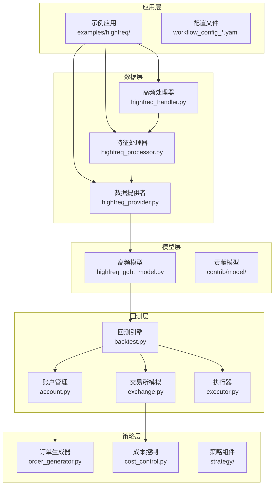

**图表来源**
- [examples/highfreq/README.md](file://examples/highfreq/README.md)
- [examples/highfreq/workflow.py](file://examples/highfreq/workflow.py)
- [qlib/contrib/data/highfreq_handler.py](file://qlib/contrib/data/highfreq_handler.py)
- [qlib/contrib/data/highfreq_processor.py](file://qlib/contrib/data/highfreq_processor.py)
- [qlib/contrib/data/highfreq_provider.py](file://qlib/contrib/data/highfreq_provider.py)
- [qlib/contrib/model/highfreq_gdbt_model.py](file://qlib/contrib/model/highfreq_gdbt_model.py)
- [qlib/backtest/backtest.py](file://qlib/backtest/backtest.py)

**章节来源**
- [examples/highfreq/README.md](file://examples/highfreq/README.md)
- [examples/highfreq/workflow.py](file://examples/highfreq/workflow.py)

## 核心组件

### 高频处理器 (High-Frequency Handler)

高频处理器负责协调整个高频交易流程，包括数据预处理、特征生成和模型集成。它作为系统的入口点，管理从原始数据到最终信号输出的完整管道。

### 特征处理器 (Feature Processor)

特征处理器专门处理高频数据的特征工程任务，包括技术指标计算、统计特征提取和市场微观结构特征构建。它能够处理多时间尺度的数据融合和特征选择。

### 数据提供者 (Data Provider)

数据提供者负责高频数据的存储、检索和访问接口。它支持多种数据格式和存储后端，确保高效的数据访问和缓存机制。

### 回测引擎 (Backtest Engine)

回测引擎是高频交易应用的核心执行组件，模拟真实的市场环境和交易执行过程。它包含精确的时序处理、滑点模拟和交易成本计算功能。

**章节来源**
- [examples/highfreq/highfreq_handler.py](file://examples/highfreq/highfreq_handler.py)
- [examples/highfreq/highfreq_processor.py](file://examples/highfreq/highfreq_processor.py)
- [qlib/contrib/data/highfreq_handler.py](file://qlib/contrib/data/highfreq_handler.py)
- [qlib/contrib/data/highfreq_processor.py](file://qlib/contrib/data/highfreq_processor.py)
- [qlib/contrib/data/highfreq_provider.py](file://qlib/contrib/data/highfreq_provider.py)

## 架构概览

Qlib高频交易应用采用分层架构设计，确保各组件之间的松耦合和高内聚：

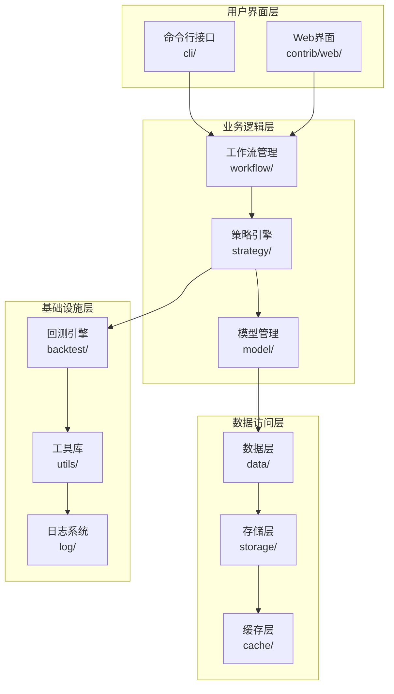

**图表来源**
- [qlib/cli/run.py](file://qlib/cli/run.py)
- [qlib/workflow/exp.py](file://qlib/workflow/exp.py)
- [qlib/backtest/backtest.py](file://qlib/backtest/backtest.py)
- [qlib/data/data.py](file://qlib/data/data.py)

## 详细组件分析

### 高频处理器类图

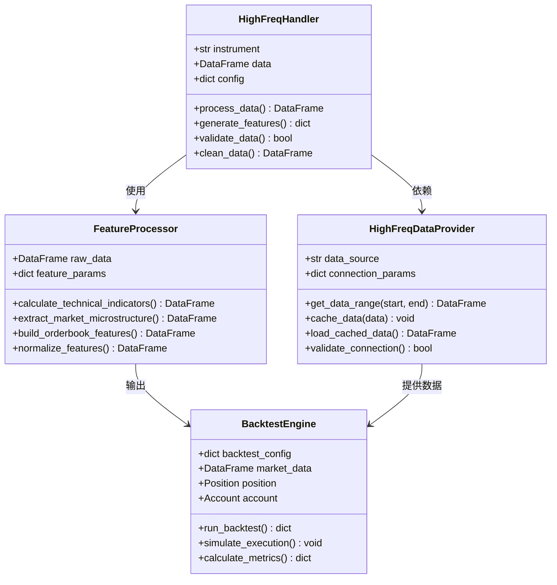

**图表来源**
- [examples/highfreq/highfreq_handler.py](file://examples/highfreq/highfreq_handler.py)
- [examples/highfreq/highfreq_processor.py](file://examples/highfreq/highfreq_processor.py)
- [qlib/contrib/data/highfreq_handler.py](file://qlib/contrib/data/highfreq_handler.py)
- [qlib/contrib/data/highfreq_processor.py](file://qlib/contrib/data/highfreq_processor.py)
- [qlib/contrib/data/highfreq_provider.py](file://qlib/contrib/data/highfreq_provider.py)
- [qlib/backtest/backtest.py](file://qlib/backtest/backtest.py)

### 回测执行序列图

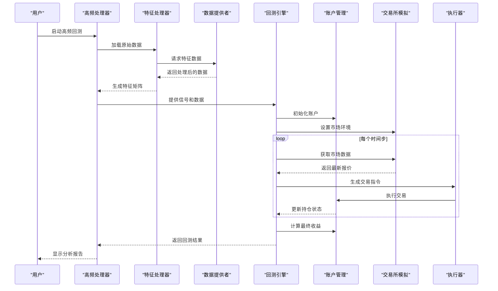

**图表来源**
- [examples/highfreq/workflow.py](file://examples/highfreq/workflow.py)
- [qlib/backtest/backtest.py](file://qlib/backtest/backtest.py)
- [qlib/backtest/account.py](file://qlib/backtest/account.py)
- [qlib/backtest/exchange.py](file://qlib/backtest/exchange.py)
- [qlib/backtest/executor.py](file://qlib/backtest/executor.py)

**章节来源**
- [examples/highfreq/workflow.py](file://examples/highfreq/workflow.py)
- [qlib/backtest/backtest.py](file://qlib/backtest/backtest.py)

## 高频数据处理

### 数据获取与清洗

高频数据处理的第一步是建立可靠的数据获取管道。系统支持多种数据源，包括实时数据流和历史数据文件。数据清洗过程包括异常值检测、缺失值处理和数据一致性验证。

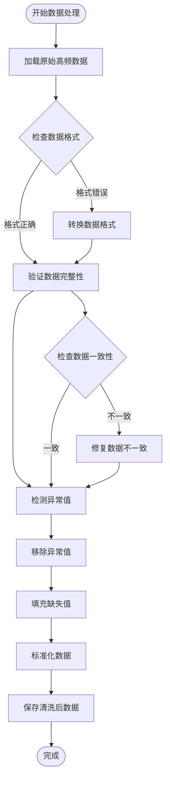

**图表来源**
- [examples/highfreq/highfreq_ops.py](file://examples/highfreq/highfreq_ops.py)
- [qlib/contrib/data/highfreq_processor.py](file://qlib/contrib/data/highfreq_processor.py)

### 特征工程流程

特征工程是高频交易成功的关键环节。系统提供多层次的特征生成能力：

1. **技术指标特征**：移动平均线、RSI、布林带等经典技术指标
2. **市场微观结构特征**：买卖价差、流动性指标、订单簿深度
3. **统计特征**：波动率、自相关性、偏度和峰度
4. **时间序列特征**：滞后特征、差分特征、周期性特征

**章节来源**
- [examples/highfreq/highfreq_processor.py](file://examples/highfreq/highfreq_processor.py)
- [qlib/contrib/data/highfreq_processor.py](file://qlib/contrib/data/highfreq_processor.py)

## 市场微观结构分析

### 价格发现机制

市场微观结构理论解释了价格是如何在买卖双方之间形成的。高频数据为这一理论提供了实证基础，使我们能够观察到价格形成过程中的微观细节。

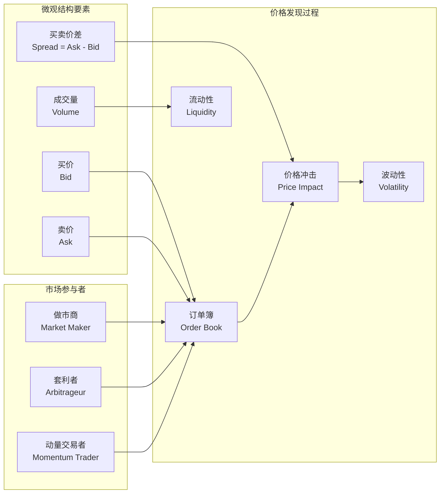

**图表来源**
- [qlib/contrib/ops/high_freq.py](file://qlib/contrib/ops/high_freq.py)
- [qlib/contrib/data/highfreq_processor.py](file://qlib/contrib/data/highfreq_processor.py)

### 流动性分析

流动性是高频交易中的核心概念，系统提供了多种流动性测量指标：

- **买卖价差**：衡量市场流动性的直接指标
- **有效价差**：考虑交易成本后的价差
- **流动性深度**：订单簿中可立即执行的交易量
- **市场冲击**：大额交易对市场价格的影响

**章节来源**
- [qlib/contrib/ops/high_freq.py](file://qlib/contrib/ops/high_freq.py)

## 订单簿数据处理

### 订单簿特征提取

订单簿数据包含了丰富的市场信息，系统能够从订单簿中提取以下关键特征：

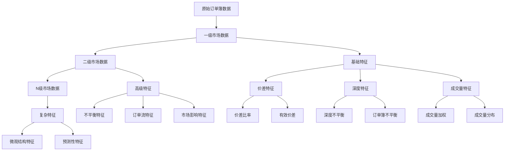

**图表来源**
- [examples/highfreq/highfreq_processor.py](file://examples/highfreq/highfreq_processor.py)
- [qlib/contrib/data/highfreq_processor.py](file://qlib/contrib/data/highfreq_processor.py)

### 订单执行模拟

系统提供了精确的订单执行模拟功能，包括：

- **价格限制**：模拟限价订单的执行
- **市价执行**：模拟市价订单的完全执行
- **部分执行**：处理部分成交的情况
- **滑点建模**：考虑市场冲击和流动性影响

**章节来源**
- [qlib/backtest/executor.py](file://qlib/backtest/executor.py)
- [qlib/backtest/exchange.py](file://qlib/backtest/exchange.py)

## 高频回测框架

### 回测引擎架构

高频回测引擎是整个系统的核心，它模拟真实的市场环境和交易执行过程：

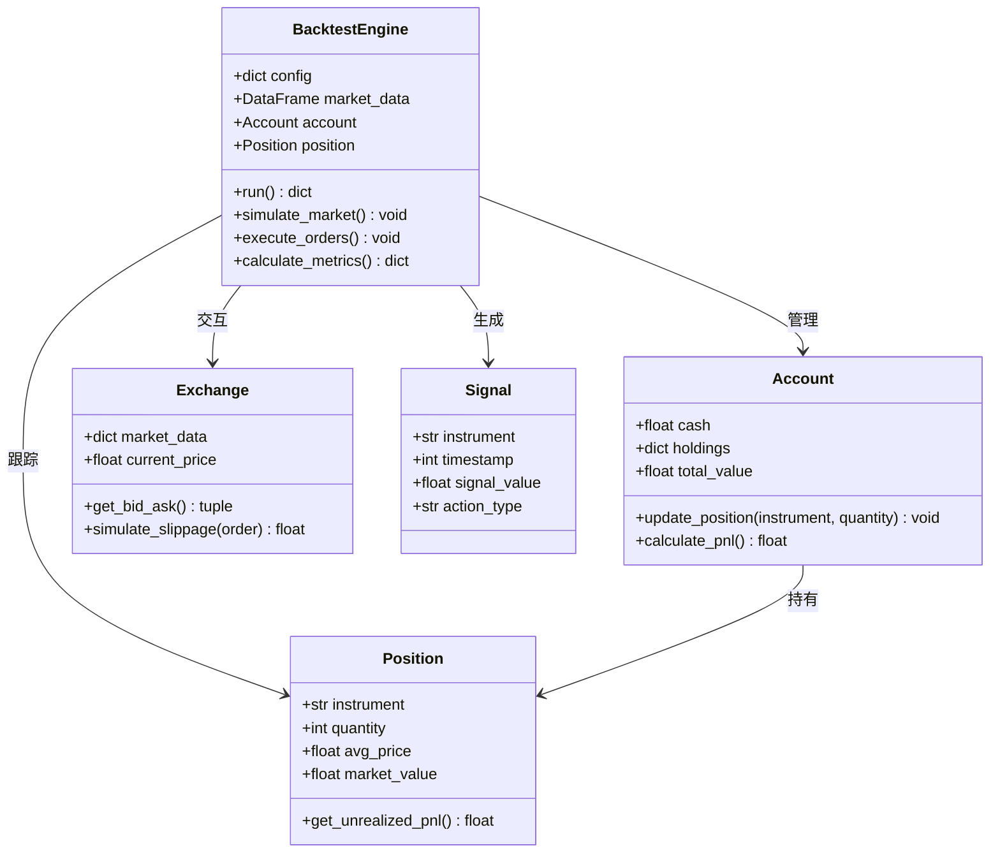

**图表来源**
- [qlib/backtest/backtest.py](file://qlib/backtest/backtest.py)
- [qlib/backtest/account.py](file://qlib/backtest/account.py)
- [qlib/backtest/position.py](file://qlib/backtest/position.py)
- [qlib/backtest/exchange.py](file://qlib/backtest/exchange.py)
- [qlib/backtest/signal.py](file://qlib/backtest/signal.py)

### 回测配置管理

回测配置通过YAML文件进行管理，支持灵活的参数设置和实验配置：

**章节来源**
- [examples/highfreq/workflow_config_High_Freq_Tree_Alpha158.yaml](file://examples/highfreq/workflow_config_High_Freq_Tree_Alpha158.yaml)
- [qlib/backtest/backtest.py](file://qlib/backtest/backtest.py)

## 交易成本建模

### 成本构成分析

高频交易中的成本主要包括：

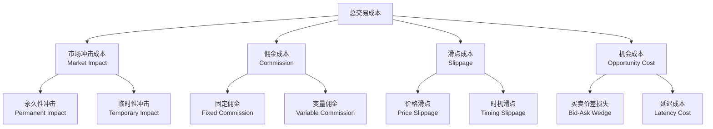

**图表来源**
- [qlib/contrib/strategy/cost_control.py](file://qlib/contrib/strategy/cost_control.py)
- [qlib/backtest/exchange.py](file://qlib/backtest/exchange.py)

### 成本控制策略

系统提供多种成本控制策略：

1. **时间分割**：将大额订单分割成小订单，在不同时间执行
2. **价格限制**：设置合理的订单价格，避免不利执行
3. **流动性利用**：在高流动性时段执行交易
4. **算法交易**：使用智能算法优化执行路径

**章节来源**
- [qlib/contrib/strategy/cost_control.py](file://qlib/contrib/strategy/cost_control.py)

## 风险管理策略

### 风险指标体系

高频交易的风险管理体系包括多个维度的风险监控：

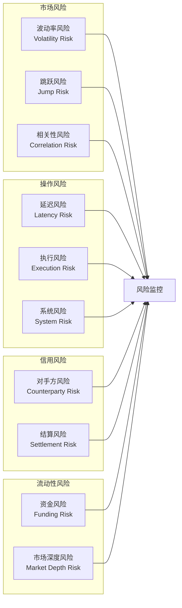

**图表来源**
- [qlib/backtest/report.py](file://qlib/backtest/report.py)
- [qlib/contrib/report/analysis_position/risk_analysis.py](file://qlib/contrib/report/analysis_position/risk_analysis.py)

### 风险控制机制

系统实现了多层次的风险控制机制：

1. **实时监控**：持续监控关键风险指标
2. **阈值控制**：设置风险阈值，超限时自动停止
3. **止损机制**：自动止损和止盈功能
4. **仓位管理**：动态调整仓位大小

**章节来源**
- [qlib/backtest/report.py](file://qlib/backtest/report.py)

## 策略开发流程

### 完整开发流程

高频交易策略的开发遵循以下标准流程：

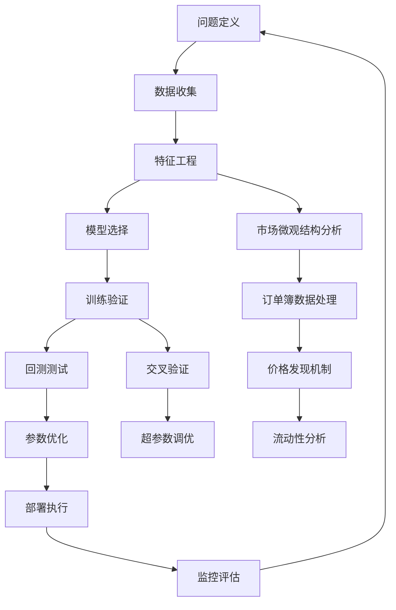

**图表来源**
- [examples/highfreq/workflow.py](file://examples/highfreq/workflow.py)
- [examples/highfreq/README.md](file://examples/highfreq/README.md)

### 实际案例分析

#### 案例一：市场微观结构驱动的高频策略

该策略基于订单簿数据和市场微观结构特征，通过分析买卖盘口的变化来预测短期价格走势。

**策略要点**：
- 使用订单簿不平衡指标识别市场方向
- 结合流动性指标确定入场时机
- 动态调整止损和止盈水平

#### 案例二：价格发现机制策略

该策略专注于研究价格形成过程中的微观结构因素，利用价格冲击和市场影响来制定交易决策。

**策略要点**：
- 分析价格冲击的持续性和幅度
- 利用市场影响预测未来波动
- 结合时间序列特征提高预测准确性

**章节来源**
- [examples/highfreq/README.md](file://examples/highfreq/README.md)
- [examples/highfreq/workflow.py](file://examples/highfreq/workflow.py)

## 性能考虑

### 计算性能优化

高频交易对计算性能有极高要求，系统采用了多项优化措施：

1. **内存管理**：高效的内存池管理和垃圾回收优化
2. **并行计算**：多线程和向量化计算加速
3. **数据压缩**：压缩存储减少内存占用
4. **缓存策略**：智能缓存机制提升数据访问速度

### 存储性能优化

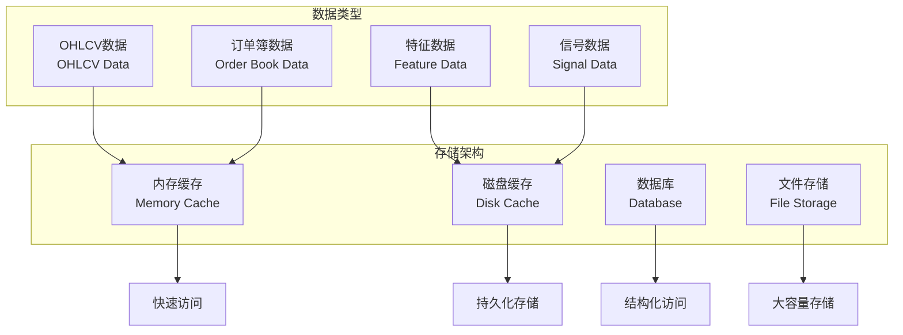

**图表来源**
- [qlib/data/cache.py](file://qlib/data/cache.py)
- [qlib/storage/storage.py](file://qlib/storage/storage.py)

## 故障排除指南

### 常见问题诊断

高频交易系统可能遇到的问题及解决方法：

1. **数据质量问题**
   - 检查数据源连接状态
   - 验证数据完整性
   - 处理缺失值和异常值

2. **性能问题**
   - 监控内存使用情况
   - 检查CPU利用率
   - 优化算法复杂度

3. **回测偏差**
   - 验证数据前复权处理
   - 检查交易成本建模
   - 确认滑点参数设置

### 调试工具和技巧

系统提供了完善的调试和监控工具：

- **日志系统**：详细的运行时日志记录
- **性能分析器**：代码执行时间分析
- **内存监控器**：内存使用情况跟踪
- **可视化工具**：数据和结果的图形化展示

**章节来源**
- [qlib/log.py](file://qlib/log.py)
- [qlib/utils/time.py](file://qlib/utils/time.py)

## 结论

Qlib高频交易应用提供了一个完整的高频数据分析和交易策略开发平台。通过模块化的架构设计和丰富的功能组件，该系统能够满足从数据处理到策略执行的全流程需求。

### 主要优势

1. **完整的工具链**：从数据获取到策略部署的一站式解决方案
2. **高性能架构**：针对高频数据处理的优化设计
3. **灵活的配置**：支持复杂的参数设置和实验配置
4. **强大的回测功能**：精确的市场模拟和风险控制

### 技术特色

1. **市场微观结构分析**：深入挖掘订单簿数据的价值
2. **多时间尺度建模**：支持从秒级到分钟级的多尺度分析
3. **实时执行能力**：接近真实的交易执行模拟
4. **风险管理集成**：内置全面的风险控制机制

### 发展前景

随着高频交易技术的不断发展，Qlib高频交易应用将继续演进，为用户提供更加强大和易用的工具。未来的改进方向包括：

- 更先进的机器学习算法集成
- 更精细的市场微观结构建模
- 更完善的实时数据处理能力
- 更丰富的策略模板和示例

通过持续的技术创新和社区贡献，Qlib高频交易应用将成为量化研究和高频交易领域的重要工具。