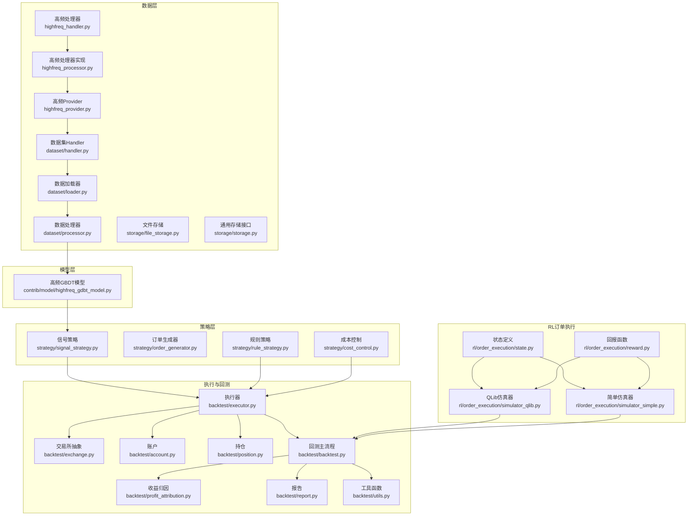
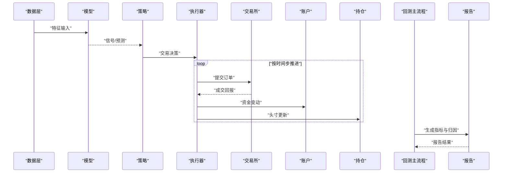
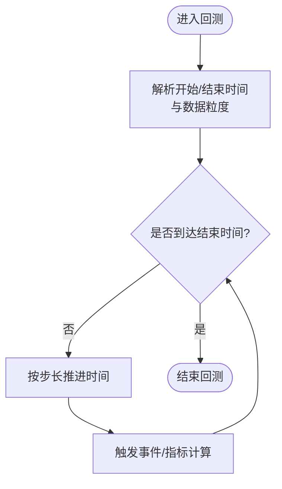
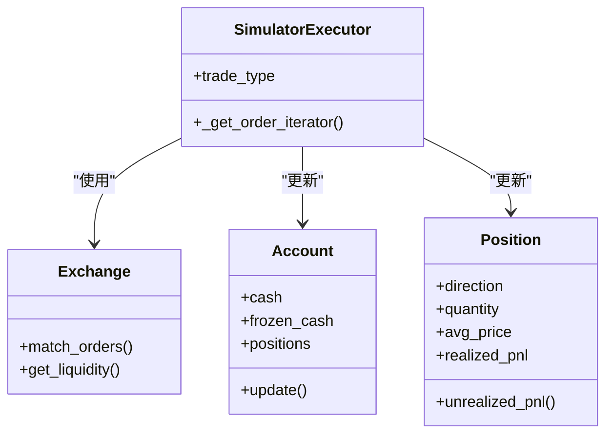
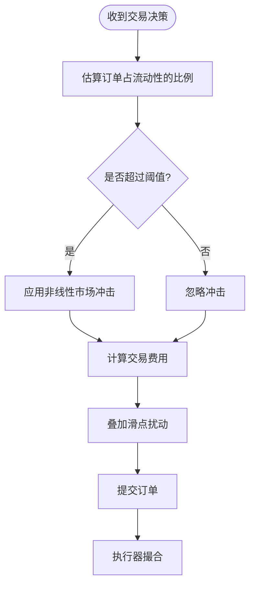
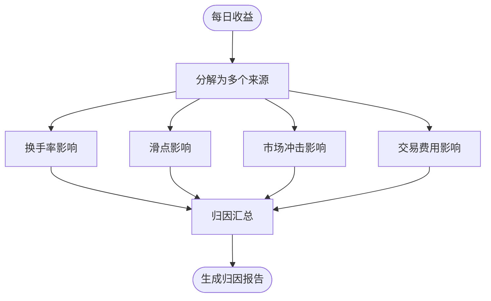
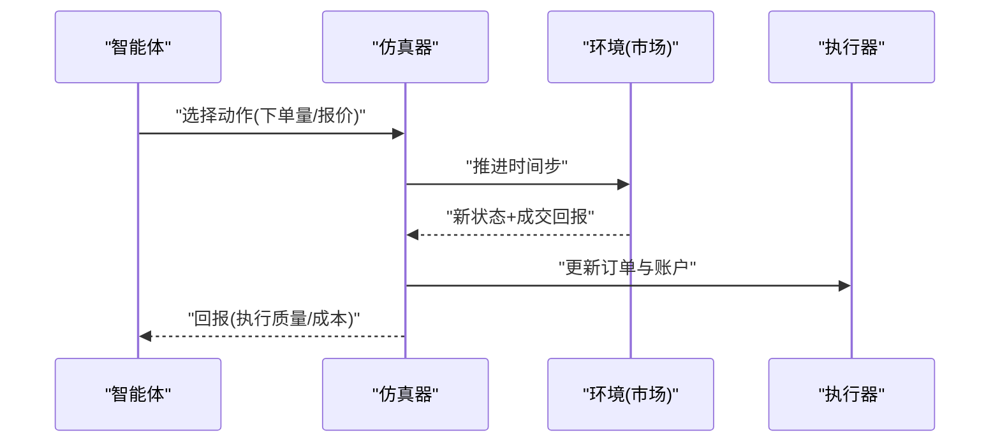
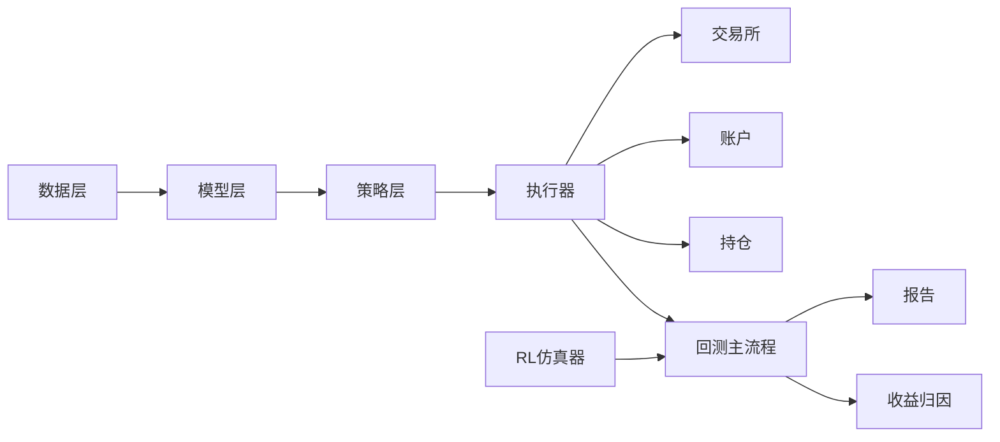

# 高频回测框架

<cite>
**本文引用的文件**
- [examples/highfreq/workflow.py](file://examples/highfreq/workflow.py)
- [examples/highfreq/workflow_config_High_Freq_Tree_Alpha158.yaml](file://examples/highfreq/workflow_config_High_Freq_Tree_Alpha158.yaml)
- [qlib/backtest/backtest.py](file://qlib/backtest/backtest.py)
- [qlib/backtest/executor.py](file://qlib/backtest/executor.py)
- [qlib/backtest/exchange.py](file://qlib/backtest/exchange.py)
- [qlib/backtest/account.py](file://qlib/backtest/account.py)
- [qlib/backtest/position.py](file://qlib/backtest/position.py)
- [qlib/backtest/profit_attribution.py](file://qlib/backtest/profit_attribution.py)
- [qlib/backtest/report.py](file://qlib/backtest/report.py)
- [qlib/backtest/utils.py](file://qlib/backtest/utils.py)
- [qlib/contrib/data/highfreq_handler.py](file://qlib/contrib/data/highfreq_handler.py)
- [qlib/contrib/data/highfreq_processor.py](file://qlib/contrib/data/highfreq_processor.py)
- [qlib/contrib/data/highfreq_provider.py](file://qlib/contrib/data/highfreq_provider.py)
- [qlib/contrib/model/highfreq_gdbt_model.py](file://qlib/contrib/model/highfreq_gdbt_model.py)
- [qlib/rl/order_execution/simulator_qlib.py](file://qlib/rl/order_execution/simulator_qlib.py)
- [qlib/rl/order_execution/simulator_simple.py](file://qlib/rl/order_execution/simulator_simple.py)
- [qlib/rl/order_execution/state.py](file://qlib/rl/order_execution/state.py)
- [qlib/rl/order_execution/reward.py](file://qlib/rl/order_execution/reward.py)
- [qlib/strategy/cost_control.py](file://qlib/strategy/cost_control.py)
- [qlib/strategy/order_generator.py](file://qlib/strategy/order_generator.py)
- [qlib/strategy/rule_strategy.py](file://qlib/strategy/rule_strategy.py)
- [qlib/strategy/signal_strategy.py](file://qlib/strategy/signal_strategy.py)
- [qlib/utils/time.py](file://qlib/utils/time.py)
- [qlib/data/dataset/handler.py](file://qlib/data/dataset/handler.py)
- [qlib/data/dataset/loader.py](file://qlib/data/dataset/loader.py)
- [qlib/data/dataset/processor.py](file://qlib/data/dataset/processor.py)
- [qlib/data/storage/file_storage.py](file://qlib/data/storage/file_storage.py)
- [qlib/data/storage/storage.py](file://qlib/data/storage/storage.py)
- [qlib/contrib/ops/high_freq.py](file://qlib/contrib/ops/high_freq.py)
- [docs/component/highfreq.rst](file://docs/component/highfreq.rst)
</cite>

## 目录
1. [引言](#引言)
2. [项目结构](#项目结构)
3. [核心组件](#核心组件)
4. [架构总览](#架构总览)
5. [详细组件分析](#详细组件分析)
6. [依赖关系分析](#依赖关系分析)
7. [性能考虑](#性能考虑)
8. [故障排查指南](#故障排查指南)
9. [结论](#结论)
10. [附录](#附录)

## 引言
本技术文档聚焦于Qlib的高频回测框架，系统阐述其核心架构与实现原理，涵盖时间处理机制、订单执行模拟、成本建模（滑点、市场冲击、交易费用）、收益归因分析、性能优化与内存管理，并提供可复用的回测配置示例与结果分析指导。文档面向具备一定量化背景但对Qlib内部机制不熟悉的读者，力求以循序渐进的方式呈现从数据到决策再到报告的完整流程。

## 项目结构
高频回测在Qlib中由“数据层-处理器-模型-策略-执行器-报告”多层协同完成。数据层负责高频行情与因子加载；处理器进行特征工程与数据适配；模型输出信号；策略将信号转化为交易决策；执行器模拟订单执行与成交；报告模块汇总指标与归因。

图表来源
- [qlib/contrib/data/highfreq_handler.py](file://qlib/contrib/data/highfreq_handler.py)
- [qlib/contrib/data/highfreq_processor.py](file://qlib/contrib/data/highfreq_processor.py)
- [qlib/contrib/data/highfreq_provider.py](file://qlib/contrib/data/highfreq_provider.py)
- [qlib/data/dataset/handler.py](file://qlib/data/dataset/handler.py)
- [qlib/data/dataset/loader.py](file://qlib/data/dataset/loader.py)
- [qlib/data/dataset/processor.py](file://qlib/data/dataset/processor.py)
- [qlib/contrib/model/highfreq_gdbt_model.py](file://qlib/contrib/model/highfreq_gdbt_model.py)
- [qlib/strategy/signal_strategy.py](file://qlib/strategy/signal_strategy.py)
- [qlib/backtest/executor.py](file://qlib/backtest/executor.py)
- [qlib/backtest/exchange.py](file://qlib/backtest/exchange.py)
- [qlib/backtest/account.py](file://qlib/backtest/account.py)
- [qlib/backtest/position.py](file://qlib/backtest/position.py)
- [qlib/backtest/backtest.py](file://qlib/backtest/backtest.py)
- [qlib/backtest/profit_attribution.py](file://qlib/backtest/profit_attribution.py)
- [qlib/backtest/report.py](file://qlib/backtest/report.py)
- [qlib/rl/order_execution/simulator_qlib.py](file://qlib/rl/order_execution/simulator_qlib.py)
- [qlib/rl/order_execution/simulator_simple.py](file://qlib/rl/order_execution/simulator_simple.py)
- [qlib/rl/order_execution/state.py](file://qlib/rl/order_execution/state.py)
- [qlib/rl/order_execution/reward.py](file://qlib/rl/order_execution/reward.py)

章节来源
- [docs/component/highfreq.rst](file://docs/component/highfreq.rst)
- [examples/highfreq/workflow.py](file://examples/highfreq/workflow.py)

## 核心组件
- 数据层：高频处理器与Provider负责将原始tick或K线转换为训练/回测可用的数据格式；数据集Handler/Loader/Processor提供统一的数据接入与预处理能力；文件存储与通用存储接口支撑数据持久化与缓存。
- 模型层：高频GBDT模型用于从高维特征中学习信号。
- 策略层：信号策略将模型输出映射为买卖方向与目标头寸；规则策略与成本控制策略结合滑点、冲击与交易费用约束，生成可执行的交易决策。
- 执行与回测：执行器负责按时间步推进、撮合成交、更新账户与持仓；回测主流程协调执行器与报告模块；收益归因与报告模块产出多维度指标。
- RL订单执行：仿真器通过状态-动作-回报建模，支持单资产订单执行的强化学习训练与回测。

章节来源
- [qlib/contrib/data/highfreq_handler.py](file://qlib/contrib/data/highfreq_handler.py)
- [qlib/contrib/data/highfreq_processor.py](file://qlib/contrib/data/highfreq_processor.py)
- [qlib/contrib/data/highfreq_provider.py](file://qlib/contrib/data/highfreq_provider.py)
- [qlib/contrib/model/highfreq_gdbt_model.py](file://qlib/contrib/model/highfreq_gdbt_model.py)
- [qlib/strategy/signal_strategy.py](file://qlib/strategy/signal_strategy.py)
- [qlib/backtest/executor.py](file://qlib/backtest/executor.py)
- [qlib/backtest/backtest.py](file://qlib/backtest/backtest.py)
- [qlib/backtest/profit_attribution.py](file://qlib/backtest/profit_attribution.py)
- [qlib/backtest/report.py](file://qlib/backtest/report.py)
- [qlib/rl/order_execution/simulator_qlib.py](file://qlib/rl/order_execution/simulator_qlib.py)
- [qlib/rl/order_execution/simulator_simple.py](file://qlib/rl/order_execution/simulator_simple.py)

## 架构总览
高频回测的端到端流程如下：数据加载与预处理 → 模型预测 → 策略生成决策 → 执行器推进时间步并模拟成交 → 更新账户与持仓 → 计算收益归因与生成报告。

图表来源
- [qlib/backtest/backtest.py](file://qlib/backtest/backtest.py)
- [qlib/backtest/executor.py](file://qlib/backtest/executor.py)
- [qlib/backtest/exchange.py](file://qlib/backtest/exchange.py)
- [qlib/backtest/account.py](file://qlib/backtest/account.py)
- [qlib/backtest/position.py](file://qlib/backtest/position.py)
- [qlib/backtest/report.py](file://qlib/backtest/report.py)

## 详细组件分析

### 时间处理机制
- 时间粒度与步进：执行器以“每步时间”推进，支持分钟级或更细粒度的回测步长；时间边界由开始/结束时间与数据粒度共同决定。
- 时间工具：提供时间解析、偏移、对齐等辅助函数，确保跨日与跨市场的时序一致性。
- 与RL仿真器的集成：仿真器同样遵循统一的时间步概念，支持从任意时刻开始的单资产订单执行仿真。

图表来源
- [qlib/backtest/executor.py](file://qlib/backtest/executor.py)
- [qlib/utils/time.py](file://qlib/utils/time.py)
- [qlib/rl/order_execution/simulator_simple.py](file://qlib/rl/order_execution/simulator_simple.py)

章节来源
- [qlib/utils/time.py](file://qlib/utils/time.py)
- [qlib/backtest/executor.py](file://qlib/backtest/executor.py)
- [qlib/rl/order_execution/simulator_simple.py](file://qlib/rl/order_execution/simulator_simple.py)

### 订单执行模拟
- 执行器职责：根据交易决策生成订单列表，按时间步推进，调用交易所进行撮合，更新账户与持仓。
- 交易所抽象：封装报价簿、流动性、滑点与冲击模型，支持限价/市价等指令类型。
- 账户与持仓：维护现金、冻结资金、可用资金与历史成交明细；记录多空头寸与市值变化。

图表来源
- [qlib/backtest/executor.py](file://qlib/backtest/executor.py)
- [qlib/backtest/exchange.py](file://qlib/backtest/exchange.py)
- [qlib/backtest/account.py](file://qlib/backtest/account.py)
- [qlib/backtest/position.py](file://qlib/backtest/position.py)

章节来源
- [qlib/backtest/executor.py](file://qlib/backtest/executor.py)
- [qlib/backtest/exchange.py](file://qlib/backtest/exchange.py)
- [qlib/backtest/account.py](file://qlib/backtest/account.py)
- [qlib/backtest/position.py](file://qlib/backtest/position.py)

### 成本建模（滑点、市场冲击、交易费用）
- 滑点：在限价订单上引入随机或基于量价的微小偏离，模拟流动性不足导致的价格劣变。
- 市场冲击：按成交量占瞬时成交量比例施加非线性价格影响，体现大额订单对市场的短期影响。
- 交易费用：对成交金额收取固定费率或分档费用，支持双边（买入/卖出）不同费率设置。
- 成本控制策略：在策略层对下单量与方向进行约束，避免过度交易与高摩擦成本。

图表来源
- [qlib/strategy/cost_control.py](file://qlib/strategy/cost_control.py)
- [qlib/contrib/ops/high_freq.py](file://qlib/contrib/ops/high_freq.py)

章节来源
- [qlib/strategy/cost_control.py](file://qlib/strategy/cost_control.py)
- [qlib/contrib/ops/high_freq.py](file://qlib/contrib/ops/high_freq.py)

### 收益归因分析
- 归因维度：换手率、滑点贡献、冲击贡献、交易费用贡献、择时与选股贡献等。
- 指标计算：基于每日净值、收益分解与风险因子暴露，量化各来源对超额收益的贡献。
- 报告输出：生成归因表格与可视化图谱，便于策略诊断与优化。

图表来源
- [qlib/backtest/profit_attribution.py](file://qlib/backtest/profit_attribution.py)
- [qlib/backtest/report.py](file://qlib/backtest/report.py)

章节来源
- [qlib/backtest/profit_attribution.py](file://qlib/backtest/profit_attribution.py)
- [qlib/backtest/report.py](file://qlib/backtest/report.py)

### RL订单执行仿真
- 状态空间：包含当前价格、买卖盘深度、剩余订单量、时间进度、历史成交量等。
- 动作空间：离散化下单量或相对报价调整，保证在可行范围内。
- 回报设计：综合考虑执行效率（完成率、均价误差）、成本（滑点、冲击、费用）与风险（波动暴露）。
- 仿真器：支持简单版与QLib版仿真器，前者适合快速验证，后者与回测框架深度集成。

图表来源
- [qlib/rl/order_execution/simulator_qlib.py](file://qlib/rl/order_execution/simulator_qlib.py)
- [qlib/rl/order_execution/simulator_simple.py](file://qlib/rl/order_execution/simulator_simple.py)
- [qlib/rl/order_execution/state.py](file://qlib/rl/order_execution/state.py)
- [qlib/rl/order_execution/reward.py](file://qlib/rl/order_execution/reward.py)

章节来源
- [qlib/rl/order_execution/simulator_qlib.py](file://qlib/rl/order_execution/simulator_qlib.py)
- [qlib/rl/order_execution/simulator_simple.py](file://qlib/rl/order_execution/simulator_simple.py)
- [qlib/rl/order_execution/state.py](file://qlib/rl/order_execution/state.py)
- [qlib/rl/order_execution/reward.py](file://qlib/rl/order_execution/reward.py)

### 数据与特征工程
- 高频处理器：将原始tick/K线转换为监督学习样本，提取多维特征（价差、成交量、分位数、动量等）。
- Provider：提供数据访问接口，支持本地文件与远程服务。
- Handler/Loader/Processor：统一的数据接入、缓存与批处理接口，提升加载与预处理效率。
- 文件存储：支持高效序列化与压缩，降低I/O开销。

章节来源
- [qlib/contrib/data/highfreq_handler.py](file://qlib/contrib/data/highfreq_handler.py)
- [qlib/contrib/data/highfreq_processor.py](file://qlib/contrib/data/highfreq_processor.py)
- [qlib/contrib/data/highfreq_provider.py](file://qlib/contrib/data/highfreq_provider.py)
- [qlib/data/dataset/handler.py](file://qlib/data/dataset/handler.py)
- [qlib/data/dataset/loader.py](file://qlib/data/dataset/loader.py)
- [qlib/data/dataset/processor.py](file://qlib/data/dataset/processor.py)
- [qlib/data/storage/file_storage.py](file://qlib/data/storage/file_storage.py)
- [qlib/data/storage/storage.py](file://qlib/data/storage/storage.py)

### 示例工作流与配置
- 示例工作流：演示如何组织数据、训练模型、生成信号、构建策略并运行回测。
- YAML配置：定义数据源、频率、特征列、模型参数、策略参数与回测范围等。

章节来源
- [examples/highfreq/workflow.py](file://examples/highfreq/workflow.py)
- [examples/highfreq/workflow_config_High_Freq_Tree_Alpha158.yaml](file://examples/highfreq/workflow_config_High_Freq_Tree_Alpha158.yaml)

## 依赖关系分析
高频回测模块间存在清晰的分层依赖：数据层为上游，模型与策略为中游，执行器与报告为下游。RL仿真器与传统回测共享同一套执行与报告基础设施，便于统一评估。

图表来源
- [qlib/backtest/backtest.py](file://qlib/backtest/backtest.py)
- [qlib/backtest/executor.py](file://qlib/backtest/executor.py)
- [qlib/backtest/exchange.py](file://qlib/backtest/exchange.py)
- [qlib/backtest/account.py](file://qlib/backtest/account.py)
- [qlib/backtest/position.py](file://qlib/backtest/position.py)
- [qlib/backtest/report.py](file://qlib/backtest/report.py)
- [qlib/backtest/profit_attribution.py](file://qlib/backtest/profit_attribution.py)
- [qlib/rl/order_execution/simulator_qlib.py](file://qlib/rl/order_execution/simulator_qlib.py)

章节来源
- [qlib/backtest/executor.py](file://qlib/backtest/executor.py)
- [qlib/backtest/backtest.py](file://qlib/backtest/backtest.py)

## 性能考虑
- 时间步优化：合理设置time_per_step，避免过细导致的调度开销；对批量订单采用并行执行（trade_type并行模式）。
- 内存管理：利用数据分片与惰性加载，减少峰值内存占用；及时释放中间变量与缓存。
- I/O优化：启用压缩与高效序列化，减少磁盘与网络I/O；对热点数据建立索引与缓存。
- 特征工程：在处理器中进行向量化与批处理，降低Python循环开销。
- 并发与流水线：将数据加载、模型推理与执行器推进解耦，形成流水线式处理。

## 故障排查指南
- 时间越界或步长异常：检查开始/结束时间与数据粒度配置，确认时间工具函数正确解析。
- 订单未成交或成交异常：核对滑点与冲击参数、流动性阈值与订单量；查看执行器日志与成交明细。
- 报告缺失或指标异常：确认归因模块输入数据完整性与指标计算逻辑；检查是否存在NaN或无穷大值。
- RL仿真器错误：验证状态空间与动作空间定义，确保回报函数与终止条件合理。

章节来源
- [qlib/backtest/utils.py](file://qlib/backtest/utils.py)
- [qlib/backtest/report.py](file://qlib/backtest/report.py)
- [qlib/rl/order_execution/simulator_simple.py](file://qlib/rl/order_execution/simulator_simple.py)

## 结论
Qlib高频回测框架通过清晰的分层架构与可插拔组件，实现了从数据到策略再到执行与报告的全链路闭环。通过对时间步、订单执行、成本建模与归因分析的精细设计，能够有效支撑高频策略的研发与评估。建议在实际部署中结合业务场景优化时间步与内存策略，并充分利用RL仿真器进行策略探索与回测一致性验证。

## 附录
- 实际回测配置示例与结果分析指导可参考示例工作流与YAML配置文件，按需调整数据源、特征列、模型参数与策略参数后运行回测并解读报告。

章节来源
- [examples/highfreq/workflow.py](file://examples/highfreq/workflow.py)
- [examples/highfreq/workflow_config_High_Freq_Tree_Alpha158.yaml](file://examples/highfreq/workflow_config_High_Freq_Tree_Alpha158.yaml)