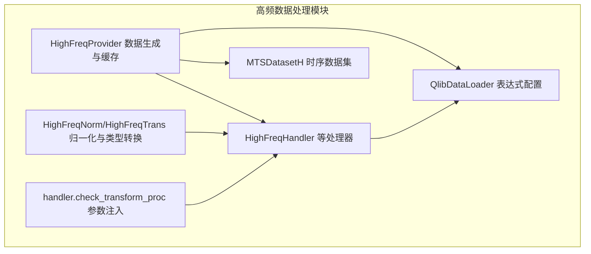
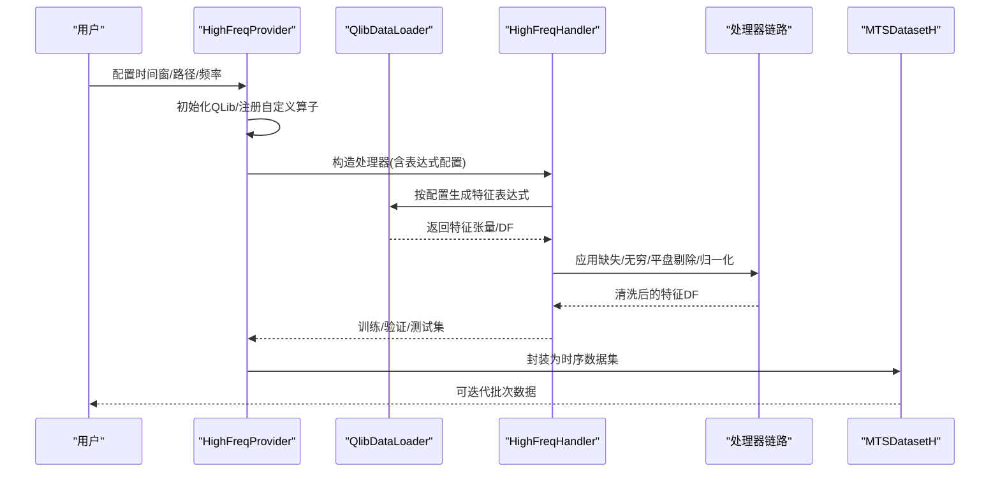
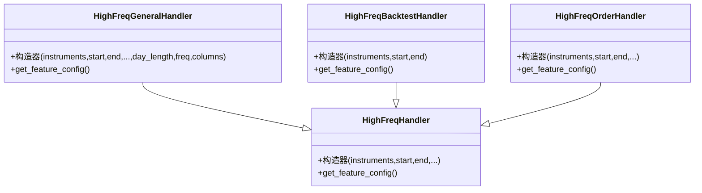
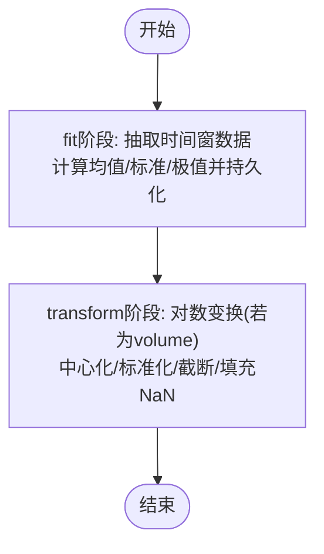
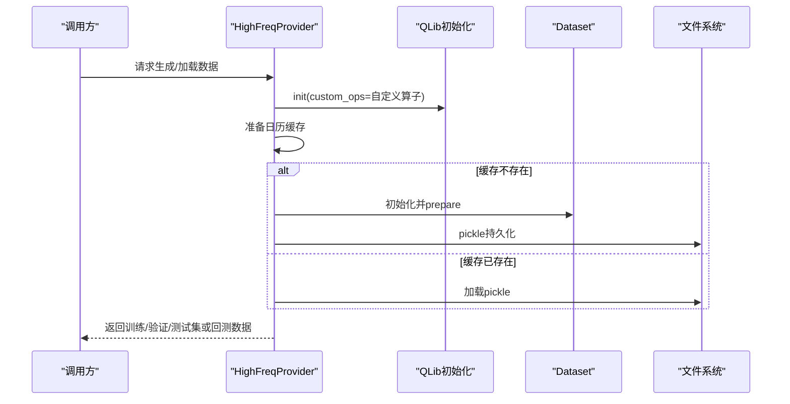
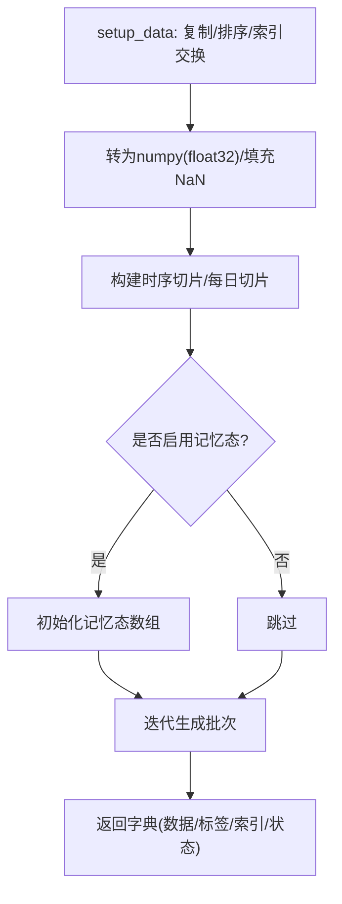
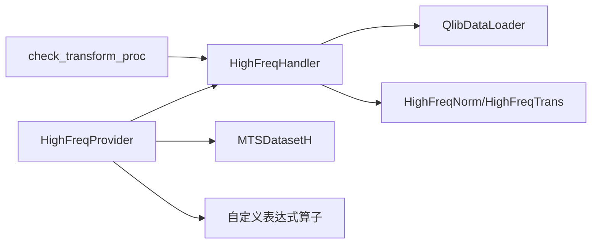

# 高频数据处理

<cite>
**本文引用的文件**
- [highfreq_handler.py](file://qlib/contrib/data/highfreq_handler.py)
- [highfreq_processor.py](file://qlib/contrib/data/highfreq_processor.py)
- [highfreq_provider.py](file://qlib/contrib/data/highfreq_provider.py)
- [loader.py](file://qlib/contrib/data/loader.py)
- [dataset.py](file://qlib/contrib/data/dataset.py)
- [handler.py](file://qlib/contrib/data/handler.py)
- [highfreq_handler.py（示例）](file://examples/highfreq/highfreq_handler.py)
- [highfreq_processor.py（示例）](file://examples/highfreq/highfreq_processor.py)
</cite>

## 目录
1. [引言](#引言)
2. [项目结构](#项目结构)
3. [核心组件](#核心组件)
4. [架构总览](#架构总览)
5. [详细组件分析](#详细组件分析)
6. [依赖分析](#依赖分析)
7. [性能考虑](#性能考虑)
8. [故障排查指南](#故障排查指南)
9. [结论](#结论)
10. [附录](#附录)

## 引言
本技术文档聚焦于Qlib中高频数据的获取、存储、清洗与预处理全流程，系统性阐述高频数据处理器的设计架构，包括数据加载、缓存机制与内存优化策略；同时给出特征工程方法（时间序列特征、价差特征、成交量特征等）、质量控制与异常值检测的实现要点，并提供可直接定位到源码路径的示例与性能优化建议。

## 项目结构
高频数据处理在Qlib中主要由以下模块协同完成：
- 数据加载与表达式配置：通过自定义数据加载器与表达式算子生成特征配置
- 处理器链路：标准化、归一化、缺失值与无穷值处理等
- 数据集封装：时序切片、批量采样、内存增强
- 提供者（Provider）：统一调度生成训练/验证/测试集与回测数据，支持多进程并行与缓存

**图表来源**
- [highfreq_handler.py:8-100](file://qlib/contrib/data/highfreq_handler.py#L8-L100)
- [highfreq_processor.py:10-81](file://qlib/contrib/data/highfreq_processor.py#L10-L81)
- [highfreq_provider.py:18-194](file://qlib/contrib/data/highfreq_provider.py#L18-L194)
- [loader.py:4-58](file://qlib/contrib/data/loader.py#L4-L58)
- [dataset.py:102-363](file://qlib/contrib/data/dataset.py#L102-L363)
- [handler.py:12-34](file://qlib/contrib/data/handler.py#L12-L34)

**章节来源**
- [highfreq_handler.py:8-100](file://qlib/contrib/data/highfreq_handler.py#L8-L100)
- [highfreq_processor.py:10-81](file://qlib/contrib/data/highfreq_processor.py#L10-L81)
- [highfreq_provider.py:18-194](file://qlib/contrib/data/highfreq_provider.py#L18-L194)
- [loader.py:4-58](file://qlib/contrib/data/loader.py#L4-L58)
- [dataset.py:102-363](file://qlib/contrib/data/dataset.py#L102-L363)
- [handler.py:12-34](file://qlib/contrib/data/handler.py#L12-L34)

## 核心组件
- 高频处理器（HighFreqHandler 系列）
  - 负责根据表达式配置生成标准化价格、成交量等特征，支持平盘剔除、前向/反向填充、日级归一化等
  - 支持不同场景（预测/回测/订单簿）的处理器变体
- 高频归一化与类型转换（HighFreqNorm/HighFreqTrans）
  - 归一化：按组保存均值/方差/极值，支持对数变换处理成交量
  - 类型转换：将布尔/浮点特征转为紧凑数值类型以节省内存
- 高频数据提供者（HighFreqProvider）
  - 统一初始化QLib环境、注册自定义表达式算子
  - 生成/缓存训练/验证/测试集与回测数据，支持多进程并行与日粒度/个股粒度拆分
- 数据集与时序切片（MTSDatasetH）
  - 将学习阶段数据转换为numpy数组，构建时序切片与每日切片
  - 支持样本级/日级记忆态扩展，以及批量采样与下采样
- 处理器参数注入（check_transform_proc）
  - 自动识别Processor类并注入fit窗口参数，确保fit_start_time/fit_end_time合法

**章节来源**
- [highfreq_handler.py:8-100](file://qlib/contrib/data/highfreq_handler.py#L8-L100)
- [highfreq_processor.py:10-81](file://qlib/contrib/data/highfreq_processor.py#L10-L81)
- [highfreq_provider.py:18-194](file://qlib/contrib/data/highfreq_provider.py#L18-L194)
- [dataset.py:102-363](file://qlib/contrib/data/dataset.py#L102-L363)
- [handler.py:12-34](file://qlib/contrib/data/handler.py#L12-L34)

## 架构总览
高频数据处理从“表达式配置”出发，经“数据加载器”生成特征，再通过“处理器链路”进行清洗与归一化，最终封装为“时序数据集”，供模型训练/推理使用；Provider负责调度与缓存，支持多进程加速。

**图表来源**
- [highfreq_provider.py:104-194](file://qlib/contrib/data/highfreq_provider.py#L104-L194)
- [highfreq_handler.py:8-100](file://qlib/contrib/data/highfreq_handler.py#L8-L100)
- [highfreq_processor.py:10-81](file://qlib/contrib/data/highfreq_processor.py#L10-L81)
- [dataset.py:163-234](file://qlib/contrib/data/dataset.py#L163-L234)

## 详细组件分析

### 高频处理器（HighFreqHandler 系列）
- 功能要点
  - 通过表达式模板生成标准化价格（以昨日收盘归一）、滞后特征（如240分钟滞后）、成交量比率等
  - 平盘剔除（$paused_num阈值）、前向/反向填充、空值替换
  - 支持不同字段集合（基础/订单簿/通用）与不同交易日长度/day_length
- 设计模式
  - 基于表达式配置的声明式特征生成，便于扩展与复用
  - 通过DataHandlerLP统一生命周期管理（learn/infer）

**图表来源**
- [highfreq_handler.py:8-100](file://qlib/contrib/data/highfreq_handler.py#L8-L100)
- [highfreq_handler.py:103-196](file://qlib/contrib/data/highfreq_handler.py#L103-L196)
- [highfreq_handler.py:199-249](file://qlib/contrib/data/highfreq_handler.py#L199-L249)
- [highfreq_handler.py:307-459](file://qlib/contrib/data/highfreq_handler.py#L307-L459)

**章节来源**
- [highfreq_handler.py:8-100](file://qlib/contrib/data/highfreq_handler.py#L8-L100)
- [highfreq_handler.py:103-196](file://qlib/contrib/data/highfreq_handler.py#L103-L196)
- [highfreq_handler.py:199-249](file://qlib/contrib/data/highfreq_handler.py#L199-L249)
- [highfreq_handler.py:307-459](file://qlib/contrib/data/highfreq_handler.py#L307-L459)

### 高频归一化与类型转换（HighFreqNorm/HighFreqTrans）
- HighFreqNorm
  - fit阶段：按组（如price/volume）抽取指定时间窗数据，计算均值、绝对偏差MAD缩放因子、极值，保存为npy
  - transform阶段：对数变换（成交量）、中心化/标准化，截断至[-3.5, 3.5]区间，填充NaN为0
- HighFreqTrans
  - 将布尔特征转为int8，或将特征转为float32，降低内存占用

**图表来源**
- [highfreq_processor.py:37-81](file://qlib/contrib/data/highfreq_processor.py#L37-L81)

**章节来源**
- [highfreq_processor.py:10-81](file://qlib/contrib/data/highfreq_processor.py#L10-L81)

### 高频数据提供者（HighFreqProvider）
- 职责
  - 初始化QLib并注册自定义表达式算子（如DayLast、FFillNan、IsNull、IsInf、Cut等）
  - 生成/缓存训练/验证/测试集与回测数据，支持pickle序列化与分片
  - 多进程并行：按日/按股票并行生成数据集，利用Linux写时复制特性加速日历缓存
- 关键流程
  - 若缓存存在则直接加载；否则初始化数据集、准备日历缓存、dump并pickle
  - 支持按天/按股票拆分子任务，分别生成独立pkl文件

**图表来源**
- [highfreq_provider.py:104-194](file://qlib/contrib/data/highfreq_provider.py#L104-L194)
- [highfreq_provider.py:222-305](file://qlib/contrib/data/highfreq_provider.py#L222-L305)

**章节来源**
- [highfreq_provider.py:18-194](file://qlib/contrib/data/highfreq_provider.py#L18-L194)
- [highfreq_provider.py:222-305](file://qlib/contrib/data/highfreq_provider.py#L222-L305)

### 数据集与时序切片（MTSDatasetH）
- 功能
  - 将处理器输出的DF转换为numpy数组，构建时序切片（seq_len），支持horizon标签
  - 支持样本级/日级记忆态扩展，用于强化学习等场景
  - 提供每日采样与下采样能力，支持批量迭代
- 内存优化
  - 使用float32与零填充，避免重复拷贝
  - 日级索引与切片预计算，减少运行时开销

**图表来源**
- [dataset.py:163-234](file://qlib/contrib/data/dataset.py#L163-L234)
- [dataset.py:280-363](file://qlib/contrib/data/dataset.py#L280-L363)

**章节来源**
- [dataset.py:102-363](file://qlib/contrib/data/dataset.py#L102-L363)

### 处理器参数注入（check_transform_proc）
- 作用
  - 将传入的处理器配置自动解析为Processor类实例，并注入fit窗口参数
  - 确保fit_start_time/fit_end_time合法，避免运行期错误

**章节来源**
- [handler.py:12-34](file://qlib/contrib/data/handler.py#L12-L34)

### 示例：Yahoo数据适配的高频处理器与归一化
- 示例处理器
  - 针对Yahoo数据缺少$vwap的情况，采用Simpson近似计算$vwap
  - 使用Cut/Select/BFillNan/FFillNan等表达式进行平盘剔除与填充
- 示例归一化
  - 使用中位数与MAD缩放，对异常值进行分段截断，提升鲁棒性

**章节来源**
- [highfreq_handler.py（示例）:5-101](file://examples/highfreq/highfreq_handler.py#L5-L101)
- [highfreq_handler.py（示例）:104-159](file://examples/highfreq/highfreq_handler.py#L104-L159)
- [highfreq_processor.py（示例）:8-77](file://examples/highfreq/highfreq_processor.py#L8-L77)

## 依赖分析
- 组件耦合
  - HighFreqHandler依赖QlibDataLoader与表达式配置；与HighFreqNorm/HighFreqTrans形成处理器链
  - HighFreqProvider串联QLib初始化、数据集生成与缓存；与MTSDatasetH配合完成批处理
  - handler.check_transform_proc贯穿各处理器，保证fit参数一致性
- 外部依赖
  - 自定义表达式算子（DayLast、FFillNan、IsNull、IsInf、Cut等）由Provider注册
  - 多进程并行依赖joblib.Parallel与延迟执行

**图表来源**
- [highfreq_handler.py:8-100](file://qlib/contrib/data/highfreq_handler.py#L8-L100)
- [highfreq_processor.py:10-81](file://qlib/contrib/data/highfreq_processor.py#L10-L81)
- [highfreq_provider.py:104-194](file://qlib/contrib/data/highfreq_provider.py#L104-L194)
- [dataset.py:102-363](file://qlib/contrib/data/dataset.py#L102-L363)
- [handler.py:12-34](file://qlib/contrib/data/handler.py#L12-L34)

**章节来源**
- [highfreq_handler.py:8-100](file://qlib/contrib/data/highfreq_handler.py#L8-L100)
- [highfreq_processor.py:10-81](file://qlib/contrib/data/highfreq_processor.py#L10-L81)
- [highfreq_provider.py:104-194](file://qlib/contrib/data/highfreq_provider.py#L104-L194)
- [dataset.py:102-363](file://qlib/contrib/data/dataset.py#L102-L363)
- [handler.py:12-34](file://qlib/contrib/data/handler.py#L12-L34)

## 性能考虑
- 内存优化
  - 使用float32与int8存储，减少内存占用
  - 归一化后对异常值进行分段截断，避免极端值影响后续计算
  - 数据集使用零填充与就地排序，降低拷贝成本
- 计算加速
  - Provider预热日历缓存，避免子进程中重复计算
  - 多进程并行按日/按股票拆分任务，充分利用CPU核数
- I/O优化
  - pickle缓存训练/验证/测试集，避免重复生成
  - 分片存储（按日/按股票）便于增量更新与并行消费

**章节来源**
- [highfreq_processor.py:10-81](file://qlib/contrib/data/highfreq_processor.py#L10-L81)
- [dataset.py:163-234](file://qlib/contrib/data/dataset.py#L163-L234)
- [highfreq_provider.py:115-194](file://qlib/contrib/data/highfreq_provider.py#L115-L194)

## 故障排查指南
- 表达式/算子报错
  - 确认Provider已注册自定义算子（如IsNull、IsInf、Cut等）
  - 检查表达式模板拼接是否正确（如日级归一化分母字段）
- 归一化不生效
  - 确认fit阶段已执行且npy文件存在；检查feature_save_dir路径权限
  - transform阶段需与fit阶段字段顺序一致
- 多进程并行问题
  - 检查n_jobs设置与系统资源；确认临时文件（tmp_dataset.pkl）清理
- 回测数据缺失
  - 确认回测配置与数据频率匹配；检查cut/填充逻辑是否覆盖完整交易时段

**章节来源**
- [highfreq_provider.py:104-194](file://qlib/contrib/data/highfreq_provider.py#L104-L194)
- [highfreq_handler.py:8-100](file://qlib/contrib/data/highfreq_handler.py#L8-L100)
- [highfreq_processor.py:37-81](file://qlib/contrib/data/highfreq_processor.py#L37-L81)

## 结论
Qlib的高频数据处理以“表达式配置+处理器链路+数据集封装+Provider调度”的架构实现了从原始行情到可训练数据的全链路自动化。通过标准化、归一化与异常值处理，结合多进程并行与缓存策略，既保证了数据质量，也兼顾了性能与可扩展性。建议在实际部署中关注算子注册、归一化窗口选择与I/O路径规划，以获得稳定高效的高频数据流水线。

## 附录
- 实际代码示例定位（仅提供路径，不展示具体代码）
  - 高频处理器（基础/通用/回测/订单簿）：[highfreq_handler.py:8-100](file://qlib/contrib/data/highfreq_handler.py#L8-L100)、[highfreq_handler.py:103-196](file://qlib/contrib/data/highfreq_handler.py#L103-L196)、[highfreq_handler.py:199-249](file://qlib/contrib/data/highfreq_handler.py#L199-L249)、[highfreq_handler.py:307-459](file://qlib/contrib/data/highfreq_handler.py#L307-L459)
  - 归一化与类型转换：[highfreq_processor.py:10-81](file://qlib/contrib/data/highfreq_processor.py#L10-L81)
  - 数据提供者（生成/缓存/并行）：[highfreq_provider.py:18-194](file://qlib/contrib/data/highfreq_provider.py#L18-L194)、[highfreq_provider.py:222-305](file://qlib/contrib/data/highfreq_provider.py#L222-L305)
  - 数据集与时序切片：[dataset.py:102-363](file://qlib/contrib/data/dataset.py#L102-L363)
  - 处理器参数注入：[handler.py:12-34](file://qlib/contrib/data/handler.py#L12-L34)
  - 示例（Yahoo适配）：[highfreq_handler.py（示例）:5-101](file://examples/highfreq/highfreq_handler.py#L5-L101)、[highfreq_processor.py（示例）:8-77](file://examples/highfreq/highfreq_processor.py#L8-L77)