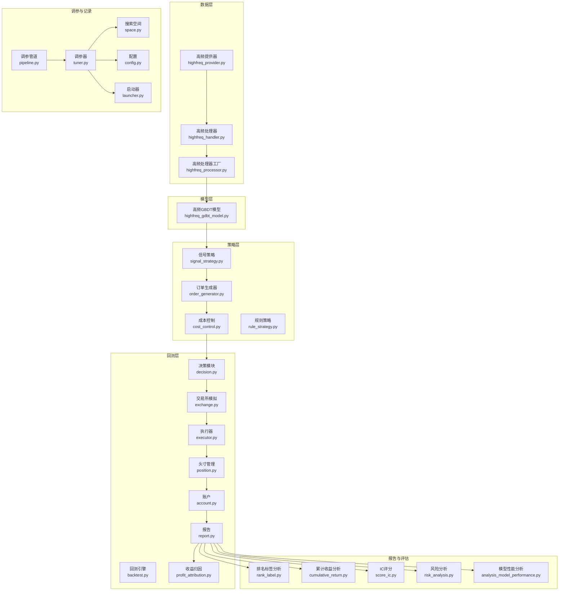
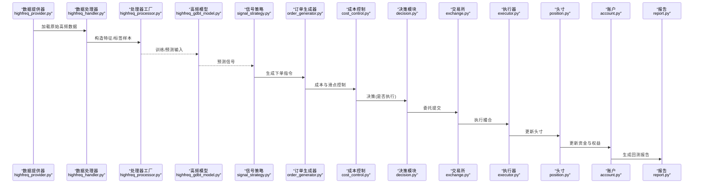
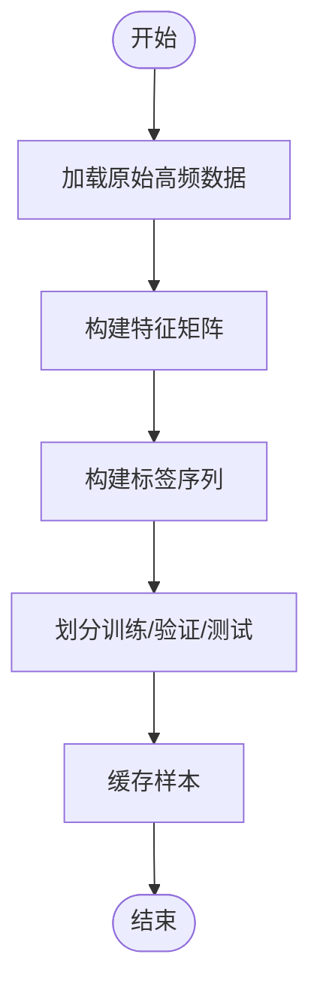
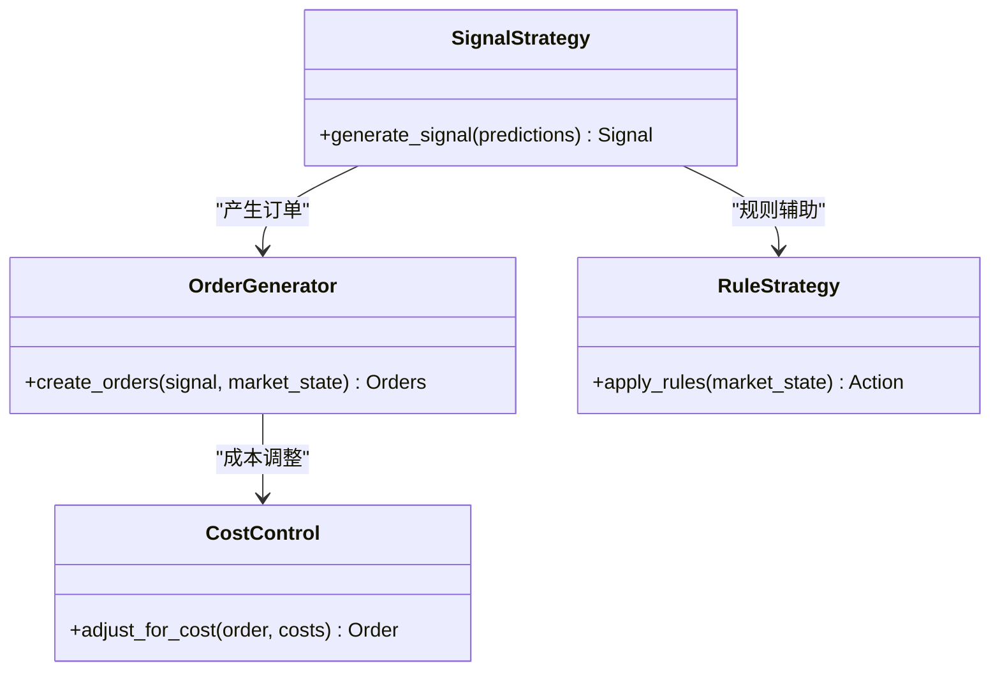
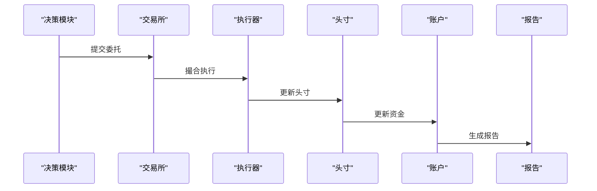
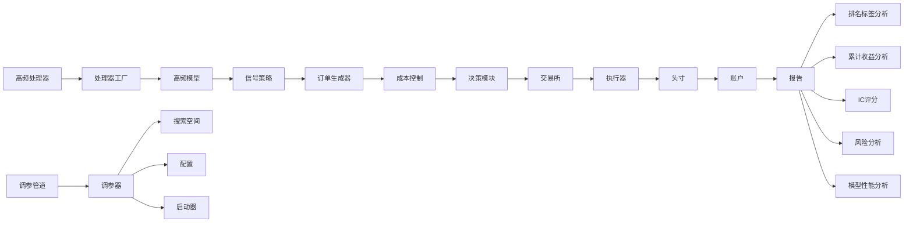

# 高频策略开发

<cite>
**本文引用的文件**
- [examples/highfreq/workflow.py](file://examples/highfreq/workflow.py)
- [examples/highfreq/highfreq_handler.py](file://examples/highfreq/highfreq_handler.py)
- [examples/highfreq/highfreq_processor.py](file://examples/highfreq/highfreq_processor.py)
- [examples/highfreq/highfreq_ops.py](file://examples/highfreq/highfreq_ops.py)
- [qlib/contrib/data/highfreq_handler.py](file://qlib/contrib/data/highfreq_handler.py)
- [qlib/contrib/data/highfreq_processor.py](file://qlib/contrib/data/highfreq_processor.py)
- [qlib/contrib/data/highfreq_provider.py](file://qlib/contrib/data/highfreq_provider.py)
- [qlib/contrib/model/highfreq_gdbt_model.py](file://qlib/contrib/model/highfreq_gdbt_model.py)
- [qlib/backtest/backtest.py](file://qlib/backtest/backtest.py)
- [qlib/backtest/exchange.py](file://qlib/backtest/exchange.py)
- [qlib/backtest/executor.py](file://qlib/backtest/executor.py)
- [qlib/backtest/position.py](file://qlib/backtest/position.py)
- [qlib/backtest/report.py](file://qlib/backtest/report.py)
- [qlib/backtest/profit_attribution.py](file://qlib/backtest/profit_attribution.py)
- [qlib/backtest/account.py](file://qlib/backtest/account.py)
- [qlib/backtest/decision.py](file://qlib/backtest/decision.py)
- [qlib/backtest/signal.py](file://qlib/backtest/signal.py)
- [qlib/contrib/ops/high_freq.py](file://qlib/contrib/ops/high_freq.py)
- [qlib/contrib/report/analysis_position/rank_label.py](file://qlib/contrib/report/analysis_position/rank_label.py)
- [qlib/contrib/report/analysis_position/cumulative_return.py](file://qlib/contrib/report/analysis_position/cumulative_return.py)
- [qlib/contrib/report/analysis_position/score_ic.py](file://qlib/contrib/report/analysis_position/score_ic.py)
- [qlib/contrib/report/analysis_position/risk_analysis.py](file://qlib/contrib/report/analysis_position/risk_analysis.py)
- [qlib/contrib/report/analysis_model/analysis_model_performance.py](file://qlib/contrib/report/analysis_model/analysis_model_performance.py)
- [qlib/contrib/strategy/order_generator.py](file://qlib/contrib/strategy/order_generator.py)
- [qlib/contrib/strategy/cost_control.py](file://qlib/contrib/strategy/cost_control.py)
- [qlib/contrib/strategy/signal_strategy.py](file://qlib/contrib/strategy/signal_strategy.py)
- [qlib/contrib/strategy/rule_strategy.py](file://qlib/contrib/strategy/rule_strategy.py)
- [qlib/contrib/tuner/pipeline.py](file://qlib/contrib/tuner/pipeline.py)
- [qlib/contrib/tuner/tuner.py](file://qlib/contrib/tuner/tuner.py)
- [qlib/contrib/tuner/space.py](file://qlib/contrib/tuner/space.py)
- [qlib/contrib/tuner/config.py](file://qlib/contrib/tuner/config.py)
- [qlib/contrib/tuner/launcher.py](file://qlib/contrib/tuner/launcher.py)
- [qlib/evaluate.py](file://qlib/evaluate.py)
- [qlib/evaluate_portfolio.py](file://qlib/evaluate_portfolio.py)
- [docs/component/highfreq.rst](file://docs/component/highfreq.rst)
- [docs/component/strategy.rst](file://docs/component/strategy.rst)
- [docs/component/recorder.rst](file://docs/component/recorder.rst)
- [docs/reference/api.rst](file://docs/reference/api.rst)
</cite>

## 目录
1. [引言](#引言)
2. [项目结构](#项目结构)
3. [核心组件](#核心组件)
4. [架构总览](#架构总览)
5. [详细组件分析](#详细组件分析)
6. [依赖关系分析](#依赖关系分析)
7. [性能考量](#性能考量)
8. [故障排查指南](#故障排查指南)
9. [结论](#结论)
10. [附录](#附录)

## 引言
本文件面向希望在Qlib中进行高频交易策略开发的研究者与工程师，系统阐述高频策略的设计原理、数据处理链路、模型训练与回测评估、参数优化与风险管理，并给出可直接参考的代码路径与最佳实践。文档以仓库中的高频相关模块为依据，结合回测与报告分析组件，帮助读者从零到一搭建一套可复用的高频策略流水线。

## 项目结构
高频策略在Qlib中的落地主要由以下层次构成：
- 数据层：高频数据加载、处理器与处理器工厂
- 模型层：针对高频场景的GBDT模型
- 策略层：信号生成、订单生成与成本控制
- 回测层：账户、委托、执行、决策、报告与收益归因
- 报告与评估：位置分析、IC评分、风险分析与模型性能分析
- 调参与记录：超参搜索管道与记录器

图表来源
- [examples/highfreq/highfreq_handler.py](file://examples/highfreq/highfreq_handler.py)
- [examples/highfreq/highfreq_processor.py](file://examples/highfreq/highfreq_processor.py)
- [qlib/contrib/data/highfreq_handler.py](file://qlib/contrib/data/highfreq_handler.py)
- [qlib/contrib/data/highfreq_processor.py](file://qlib/contrib/data/highfreq_processor.py)
- [qlib/contrib/data/highfreq_provider.py](file://qlib/contrib/data/highfreq_provider.py)
- [qlib/contrib/model/highfreq_gdbt_model.py](file://qlib/contrib/model/highfreq_gdbt_model.py)
- [qlib/contrib/strategy/signal_strategy.py](file://qlib/contrib/strategy/signal_strategy.py)
- [qlib/contrib/strategy/order_generator.py](file://qlib/contrib/strategy/order_generator.py)
- [qlib/contrib/strategy/cost_control.py](file://qlib/contrib/strategy/cost_control.py)
- [qlib/contrib/strategy/rule_strategy.py](file://qlib/contrib/strategy/rule_strategy.py)
- [qlib/backtest/backtest.py](file://qlib/backtest/backtest.py)
- [qlib/backtest/exchange.py](file://qlib/backtest/exchange.py)
- [qlib/backtest/executor.py](file://qlib/backtest/executor.py)
- [qlib/backtest/decision.py](file://qlib/backtest/decision.py)
- [qlib/backtest/position.py](file://qlib/backtest/position.py)
- [qlib/backtest/account.py](file://qlib/backtest/account.py)
- [qlib/backtest/report.py](file://qlib/backtest/report.py)
- [qlib/backtest/profit_attribution.py](file://qlib/backtest/profit_attribution.py)
- [qlib/contrib/report/analysis_position/rank_label.py](file://qlib/contrib/report/analysis_position/rank_label.py)
- [qlib/contrib/report/analysis_position/cumulative_return.py](file://qlib/contrib/report/analysis_position/cumulative_return.py)
- [qlib/contrib/report/analysis_position/score_ic.py](file://qlib/contrib/report/analysis_position/score_ic.py)
- [qlib/contrib/report/analysis_position/risk_analysis.py](file://qlib/contrib/report/analysis_position/risk_analysis.py)
- [qlib/contrib/report/analysis_model/analysis_model_performance.py](file://qlib/contrib/report/analysis_model/analysis_model_performance.py)
- [qlib/contrib/tuner/pipeline.py](file://qlib/contrib/tuner/pipeline.py)
- [qlib/contrib/tuner/tuner.py](file://qlib/contrib/tuner/tuner.py)
- [qlib/contrib/tuner/space.py](file://qlib/contrib/tuner/space.py)
- [qlib/contrib/tuner/config.py](file://qlib/contrib/tuner/config.py)
- [qlib/contrib/tuner/launcher.py](file://qlib/contrib/tuner/launcher.py)

章节来源
- [examples/highfreq/workflow.py](file://examples/highfreq/workflow.py)
- [examples/highfreq/highfreq_handler.py](file://examples/highfreq/highfreq_handler.py)
- [examples/highfreq/highfreq_processor.py](file://examples/highfreq/highfreq_processor.py)
- [qlib/contrib/data/highfreq_handler.py](file://qlib/contrib/data/highfreq_handler.py)
- [qlib/contrib/data/highfreq_processor.py](file://qlib/contrib/data/highfreq_processor.py)
- [qlib/contrib/data/highfreq_provider.py](file://qlib/contrib/data/highfreq_provider.py)
- [qlib/contrib/model/highfreq_gdbt_model.py](file://qlib/contrib/model/highfreq_gdbt_model.py)
- [qlib/backtest/backtest.py](file://qlib/backtest/backtest.py)
- [qlib/backtest/exchange.py](file://qlib/backtest/exchange.py)
- [qlib/backtest/executor.py](file://qlib/backtest/executor.py)
- [qlib/backtest/position.py](file://qlib/backtest/position.py)
- [qlib/backtest/report.py](file://qlib/backtest/report.py)
- [qlib/backtest/profit_attribution.py](file://qlib/backtest/profit_attribution.py)
- [qlib/backtest/account.py](file://qlib/backtest/account.py)
- [qlib/backtest/decision.py](file://qlib/backtest/decision.py)
- [qlib/contrib/strategy/signal_strategy.py](file://qlib/contrib/strategy/signal_strategy.py)
- [qlib/contrib/strategy/order_generator.py](file://qlib/contrib/strategy/order_generator.py)
- [qlib/contrib/strategy/cost_control.py](file://qlib/contrib/strategy/cost_control.py)
- [qlib/contrib/strategy/rule_strategy.py](file://qlib/contrib/strategy/rule_strategy.py)
- [qlib/contrib/report/analysis_position/rank_label.py](file://qlib/contrib/report/analysis_position/rank_label.py)
- [qlib/contrib/report/analysis_position/cumulative_return.py](file://qlib/contrib/report/analysis_position/cumulative_return.py)
- [qlib/contrib/report/analysis_position/score_ic.py](file://qlib/contrib/report/analysis_position/score_ic.py)
- [qlib/contrib/report/analysis_position/risk_analysis.py](file://qlib/contrib/report/analysis_position/risk_analysis.py)
- [qlib/contrib/report/analysis_model/analysis_model_performance.py](file://qlib/contrib/report/analysis_model/analysis_model_performance.py)
- [qlib/contrib/tuner/pipeline.py](file://qlib/contrib/tuner/pipeline.py)
- [qlib/contrib/tuner/tuner.py](file://qlib/contrib/tuner/tuner.py)
- [qlib/contrib/tuner/space.py](file://qlib/contrib/tuner/space.py)
- [qlib/contrib/tuner/config.py](file://qlib/contrib/tuner/config.py)
- [qlib/contrib/tuner/launcher.py](file://qlib/contrib/tuner/launcher.py)

## 核心组件
- 高频数据处理器与提供器：负责从原始高频数据中提取特征、构造样本与标签，以及按时间粒度进行滑窗采样。
- 高频GBDT模型：面向高频序列的梯度提升模型，用于学习时序模式并输出预测信号。
- 策略模块：将模型输出转换为交易信号，再由订单生成器与成本控制模块转化为可执行的下单指令。
- 回测引擎：模拟真实市场环境，驱动交易所、执行器与账户，产出交易回报与绩效报告。
- 报告与评估：对策略的收益、风险、IC、分位表现等进行多维度分析。
- 超参搜索与记录：提供可扩展的调参管道与配置管理，便于自动化优化。

章节来源
- [examples/highfreq/highfreq_handler.py](file://examples/highfreq/highfreq_handler.py)
- [examples/highfreq/highfreq_processor.py](file://examples/highfreq/highfreq_processor.py)
- [qlib/contrib/data/highfreq_handler.py](file://qlib/contrib/data/highfreq_handler.py)
- [qlib/contrib/data/highfreq_processor.py](file://qlib/contrib/data/highfreq_processor.py)
- [qlib/contrib/data/highfreq_provider.py](file://qlib/contrib/data/highfreq_provider.py)
- [qlib/contrib/model/highfreq_gdbt_model.py](file://qlib/contrib/model/highfreq_gdbt_model.py)
- [qlib/contrib/strategy/signal_strategy.py](file://qlib/contrib/strategy/signal_strategy.py)
- [qlib/contrib/strategy/order_generator.py](file://qlib/contrib/strategy/order_generator.py)
- [qlib/contrib/strategy/cost_control.py](file://qlib/contrib/strategy/cost_control.py)
- [qlib/backtest/backtest.py](file://qlib/backtest/backtest.py)
- [qlib/backtest/report.py](file://qlib/backtest/report.py)
- [qlib/contrib/report/analysis_position/rank_label.py](file://qlib/contrib/report/analysis_position/rank_label.py)
- [qlib/contrib/report/analysis_position/cumulative_return.py](file://qlib/contrib/report/analysis_position/cumulative_return.py)
- [qlib/contrib/report/analysis_position/score_ic.py](file://qlib/contrib/report/analysis_position/score_ic.py)
- [qlib/contrib/report/analysis_position/risk_analysis.py](file://qlib/contrib/report/analysis_position/risk_analysis.py)
- [qlib/contrib/report/analysis_model/analysis_model_performance.py](file://qlib/contrib/report/analysis_model/analysis_model_performance.py)
- [qlib/contrib/tuner/pipeline.py](file://qlib/contrib/tuner/pipeline.py)
- [qlib/contrib/tuner/tuner.py](file://qlib/contrib/tuner/tuner.py)
- [qlib/contrib/tuner/space.py](file://qlib/contrib/tuner/space.py)
- [qlib/contrib/tuner/config.py](file://qlib/contrib/tuner/config.py)
- [qlib/contrib/tuner/launcher.py](file://qlib/contrib/tuner/launcher.py)

## 架构总览
下图展示了从数据到回测再到报告的完整流程，强调高频场景下的关键节点与交互。

图表来源
- [qlib/contrib/data/highfreq_provider.py](file://qlib/contrib/data/highfreq_provider.py)
- [qlib/contrib/data/highfreq_handler.py](file://qlib/contrib/data/highfreq_handler.py)
- [qlib/contrib/data/highfreq_processor.py](file://qlib/contrib/data/highfreq_processor.py)
- [qlib/contrib/model/highfreq_gdbt_model.py](file://qlib/contrib/model/highfreq_gdbt_model.py)
- [qlib/contrib/strategy/signal_strategy.py](file://qlib/contrib/strategy/signal_strategy.py)
- [qlib/contrib/strategy/order_generator.py](file://qlib/contrib/strategy/order_generator.py)
- [qlib/contrib/strategy/cost_control.py](file://qlib/contrib/strategy/cost_control.py)
- [qlib/backtest/decision.py](file://qlib/backtest/decision.py)
- [qlib/backtest/exchange.py](file://qlib/backtest/exchange.py)
- [qlib/backtest/executor.py](file://qlib/backtest/executor.py)
- [qlib/backtest/position.py](file://qlib/backtest/position.py)
- [qlib/backtest/account.py](file://qlib/backtest/account.py)
- [qlib/backtest/report.py](file://qlib/backtest/report.py)

## 详细组件分析

### 高频数据处理链路
- 高频处理器：定义特征列、标签列、时间窗口与滑窗逻辑，支持多频段数据融合。
- 处理器工厂：根据配置生成训练/验证/测试集，封装数据加载与缓存。
- 提供器：对接外部高频数据源，负责数据清洗、对齐与持久化。

图表来源
- [examples/highfreq/highfreq_handler.py](file://examples/highfreq/highfreq_handler.py)
- [examples/highfreq/highfreq_processor.py](file://examples/highfreq/highfreq_processor.py)
- [qlib/contrib/data/highfreq_handler.py](file://qlib/contrib/data/highfreq_handler.py)
- [qlib/contrib/data/highfreq_processor.py](file://qlib/contrib/data/highfreq_processor.py)
- [qlib/contrib/data/highfreq_provider.py](file://qlib/contrib/data/highfreq_provider.py)

章节来源
- [examples/highfreq/highfreq_handler.py](file://examples/highfreq/highfreq_handler.py)
- [examples/highfreq/highfreq_processor.py](file://examples/highfreq/highfreq_processor.py)
- [qlib/contrib/data/highfreq_handler.py](file://qlib/contrib/data/highfreq_handler.py)
- [qlib/contrib/data/highfreq_processor.py](file://qlib/contrib/data/highfreq_processor.py)
- [qlib/contrib/data/highfreq_provider.py](file://qlib/contrib/data/highfreq_provider.py)

### 高频GBDT模型
- 面向高频序列的梯度提升模型，支持时序特征与多步预测，适合捕捉短周期内的价格动量与流动性变化。
- 可与信号策略模块配合，将模型输出映射为买卖信号。

章节来源
- [qlib/contrib/model/highfreq_gdbt_model.py](file://qlib/contrib/model/highfreq_gdbt_model.py)

### 策略模块
- 信号策略：将模型预测转换为标准化信号（如[-1,1]或离散方向）。
- 订单生成器：根据信号与市场状态生成限价/市价委托。
- 成本控制：内置滑点、冲击成本与换仓成本模型，降低交易对收益的侵蚀。
- 规则策略：提供基于阈值、止盈止损等规则的快速实现。

图表来源
- [qlib/contrib/strategy/signal_strategy.py](file://qlib/contrib/strategy/signal_strategy.py)
- [qlib/contrib/strategy/order_generator.py](file://qlib/contrib/strategy/order_generator.py)
- [qlib/contrib/strategy/cost_control.py](file://qlib/contrib/strategy/cost_control.py)
- [qlib/contrib/strategy/rule_strategy.py](file://qlib/contrib/strategy/rule_strategy.py)

章节来源
- [qlib/contrib/strategy/signal_strategy.py](file://qlib/contrib/strategy/signal_strategy.py)
- [qlib/contrib/strategy/order_generator.py](file://qlib/contrib/strategy/order_generator.py)
- [qlib/contrib/strategy/cost_control.py](file://qlib/contrib/strategy/cost_control.py)
- [qlib/contrib/strategy/rule_strategy.py](file://qlib/contrib/strategy/rule_strategy.py)

### 回测引擎
- 决策模块：接收订单与市场状态，决定是否执行。
- 交易所模拟：维护买卖盘口、撮合成交与滑点。
- 执行器：执行委托，更新成交明细。
- 头寸与账户：跟踪持仓、现金与净值。
- 报告：汇总收益曲线、最大回撤、夏普比率等指标；收益归因分解。

图表来源
- [qlib/backtest/decision.py](file://qlib/backtest/decision.py)
- [qlib/backtest/exchange.py](file://qlib/backtest/exchange.py)
- [qlib/backtest/executor.py](file://qlib/backtest/executor.py)
- [qlib/backtest/position.py](file://qlib/backtest/position.py)
- [qlib/backtest/account.py](file://qlib/backtest/account.py)
- [qlib/backtest/report.py](file://qlib/backtest/report.py)
- [qlib/backtest/profit_attribution.py](file://qlib/backtest/profit_attribution.py)

章节来源
- [qlib/backtest/backtest.py](file://qlib/backtest/backtest.py)
- [qlib/backtest/decision.py](file://qlib/backtest/decision.py)
- [qlib/backtest/exchange.py](file://qlib/backtest/exchange.py)
- [qlib/backtest/executor.py](file://qlib/backtest/executor.py)
- [qlib/backtest/position.py](file://qlib/backtest/position.py)
- [qlib/backtest/account.py](file://qlib/backtest/account.py)
- [qlib/backtest/report.py](file://qlib/backtest/report.py)
- [qlib/backtest/profit_attribution.py](file://qlib/backtest/profit_attribution.py)

### 报告与评估
- 排名标签分析：观察不同分位的收益分布，评估信号分层能力。
- 累计收益分析：绘制净值曲线，计算年化收益、波动率、最大回撤等。
- IC评分：衡量信号与未来收益的秩相关性。
- 风险分析：计算VaR、压力测试等风险指标。
- 模型性能分析：对模型预测质量进行诊断。

章节来源
- [qlib/contrib/report/analysis_position/rank_label.py](file://qlib/contrib/report/analysis_position/rank_label.py)
- [qlib/contrib/report/analysis_position/cumulative_return.py](file://qlib/contrib/report/analysis_position/cumulative_return.py)
- [qlib/contrib/report/analysis_position/score_ic.py](file://qlib/contrib/report/analysis_position/score_ic.py)
- [qlib/contrib/report/analysis_position/risk_analysis.py](file://qlib/contrib/report/analysis_position/risk_analysis.py)
- [qlib/contrib/report/analysis_model/analysis_model_performance.py](file://qlib/contrib/report/analysis_model/analysis_model_performance.py)

### 超参搜索与记录
- 调参管道：串联数据准备、模型训练、评估与结果记录。
- 调参器：支持贝叶斯/网格/随机搜索等策略。
- 搜索空间：定义超参范围与采样分布。
- 启动器：统一调度与资源管理。

章节来源
- [qlib/contrib/tuner/pipeline.py](file://qlib/contrib/tuner/pipeline.py)
- [qlib/contrib/tuner/tuner.py](file://qlib/contrib/tuner/tuner.py)
- [qlib/contrib/tuner/space.py](file://qlib/contrib/tuner/space.py)
- [qlib/contrib/tuner/config.py](file://qlib/contrib/tuner/config.py)
- [qlib/contrib/tuner/launcher.py](file://qlib/contrib/tuner/launcher.py)

## 依赖关系分析
高频策略的模块耦合与依赖如下：
- 数据层与模型层：通过处理器工厂解耦，便于替换特征工程与模型。
- 策略层与回测层：策略仅依赖信号接口，回测独立于具体策略实现。
- 报告层：依赖回测产物，形成评估闭环。
- 调参层：贯穿数据、模型与策略，提供自动化优化能力。

图表来源
- [examples/highfreq/highfreq_handler.py](file://examples/highfreq/highfreq_handler.py)
- [examples/highfreq/highfreq_processor.py](file://examples/highfreq/highfreq_processor.py)
- [qlib/contrib/data/highfreq_handler.py](file://qlib/contrib/data/highfreq_handler.py)
- [qlib/contrib/data/highfreq_processor.py](file://qlib/contrib/data/highfreq_processor.py)
- [qlib/contrib/model/highfreq_gdbt_model.py](file://qlib/contrib/model/highfreq_gdbt_model.py)
- [qlib/contrib/strategy/signal_strategy.py](file://qlib/contrib/strategy/signal_strategy.py)
- [qlib/contrib/strategy/order_generator.py](file://qlib/contrib/strategy/order_generator.py)
- [qlib/contrib/strategy/cost_control.py](file://qlib/contrib/strategy/cost_control.py)
- [qlib/backtest/decision.py](file://qlib/backtest/decision.py)
- [qlib/backtest/exchange.py](file://qlib/backtest/exchange.py)
- [qlib/backtest/executor.py](file://qlib/backtest/executor.py)
- [qlib/backtest/position.py](file://qlib/backtest/position.py)
- [qlib/backtest/account.py](file://qlib/backtest/account.py)
- [qlib/backtest/report.py](file://qlib/backtest/report.py)
- [qlib/contrib/report/analysis_position/rank_label.py](file://qlib/contrib/report/analysis_position/rank_label.py)
- [qlib/contrib/report/analysis_position/cumulative_return.py](file://qlib/contrib/report/analysis_position/cumulative_return.py)
- [qlib/contrib/report/analysis_position/score_ic.py](file://qlib/contrib/report/analysis_position/score_ic.py)
- [qlib/contrib/report/analysis_position/risk_analysis.py](file://qlib/contrib/report/analysis_position/risk_analysis.py)
- [qlib/contrib/report/analysis_model/analysis_model_performance.py](file://qlib/contrib/report/analysis_model/analysis_model_performance.py)
- [qlib/contrib/tuner/pipeline.py](file://qlib/contrib/tuner/pipeline.py)
- [qlib/contrib/tuner/tuner.py](file://qlib/contrib/tuner/tuner.py)
- [qlib/contrib/tuner/space.py](file://qlib/contrib/tuner/space.py)
- [qlib/contrib/tuner/config.py](file://qlib/contrib/tuner/config.py)
- [qlib/contrib/tuner/launcher.py](file://qlib/contrib/tuner/launcher.py)

## 性能考量
- 数据加载与缓存：高频数据体量大，建议使用处理器工厂进行样本缓存与增量加载，减少重复IO。
- 特征工程：滑窗大小、滞后项与差分操作需与交易频率匹配，避免信息泄漏与过拟合。
- 模型训练：高频序列具有强时序相关性，应采用时间序列交叉验证与早停策略。
- 回测效率：使用高性能数据结构与向量化操作，尽量避免Python循环；必要时启用并行任务管理。
- 交易成本：滑点与冲击成本对高频策略尤为敏感，应在策略设计阶段就纳入成本模型。

## 故障排查指南
- 数据不一致：检查处理器的时间索引与标签对齐方式，确保无未来信息泄露。
- 回测结果异常：核对订单生成与执行逻辑，确认滑点与手续费设置合理。
- 报告缺失指标：确认报告模块的输入数据完整性与计算依赖。
- 调参失败：检查搜索空间定义与目标函数，确保目标可优化且收敛稳定。

章节来源
- [qlib/backtest/report.py](file://qlib/backtest/report.py)
- [qlib/contrib/report/analysis_position/rank_label.py](file://qlib/contrib/report/analysis_position/rank_label.py)
- [qlib/contrib/report/analysis_position/cumulative_return.py](file://qlib/contrib/report/analysis_position/cumulative_return.py)
- [qlib/contrib/report/analysis_position/score_ic.py](file://qlib/contrib/report/analysis_position/score_ic.py)
- [qlib/contrib/report/analysis_position/risk_analysis.py](file://qlib/contrib/report/analysis_position/risk_analysis.py)
- [qlib/contrib/report/analysis_model/analysis_model_performance.py](file://qlib/contrib/report/analysis_model/analysis_model_performance.py)

## 结论
高频策略开发的关键在于高质量的数据特征、稳健的模型与严谨的回测评估。Qlib提供了从数据处理、模型训练到策略执行与报告分析的完整工具链。通过本文档的组件解析与最佳实践建议，读者可以快速搭建并迭代自己的高频策略方案。

## 附录
- 示例工作流：参考高频示例的工作流脚本，了解端到端的运行流程与配置要点。
- 文档参考：高频组件与策略文档，帮助理解API与配置选项。

章节来源
- [examples/highfreq/workflow.py](file://examples/highfreq/workflow.py)
- [docs/component/highfreq.rst](file://docs/component/highfreq.rst)
- [docs/component/strategy.rst](file://docs/component/strategy.rst)
- [docs/component/recorder.rst](file://docs/component/recorder.rst)
- [docs/reference/api.rst](file://docs/reference/api.rst)