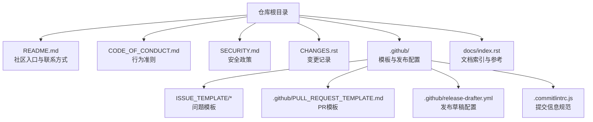
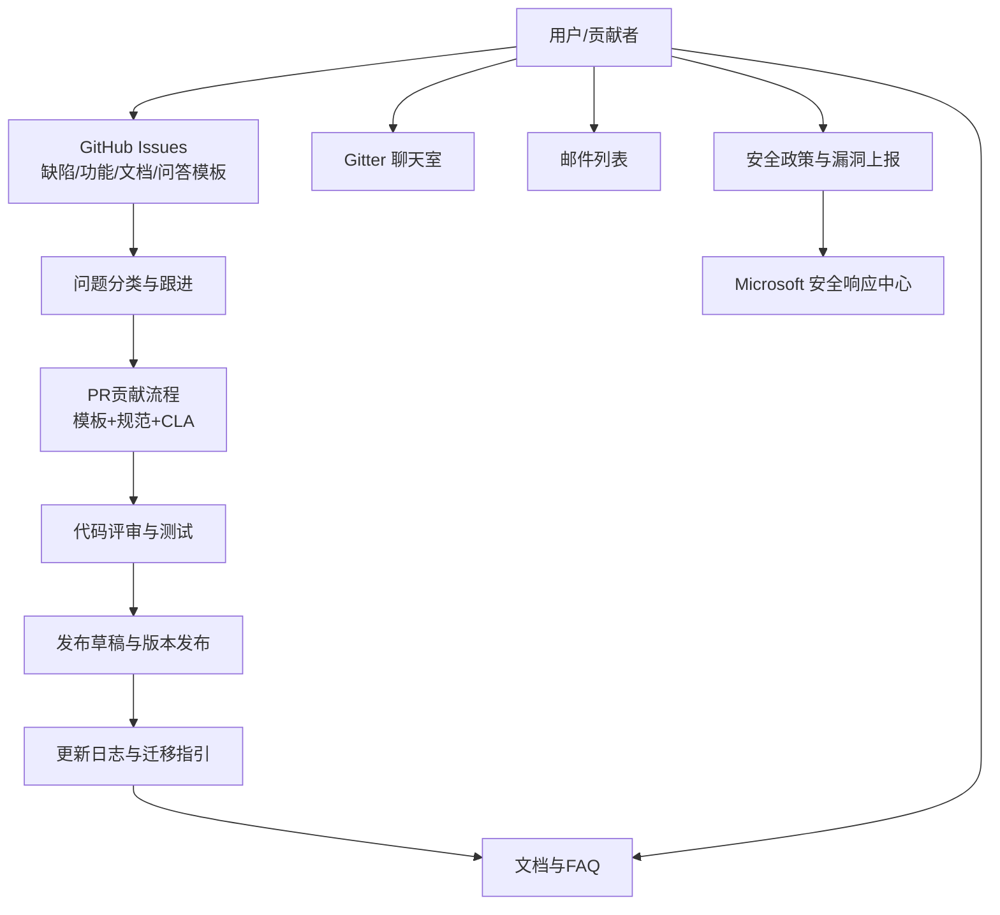
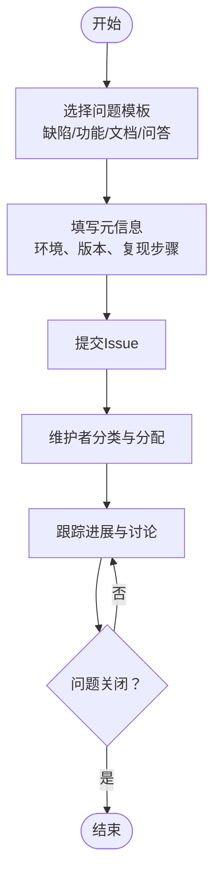
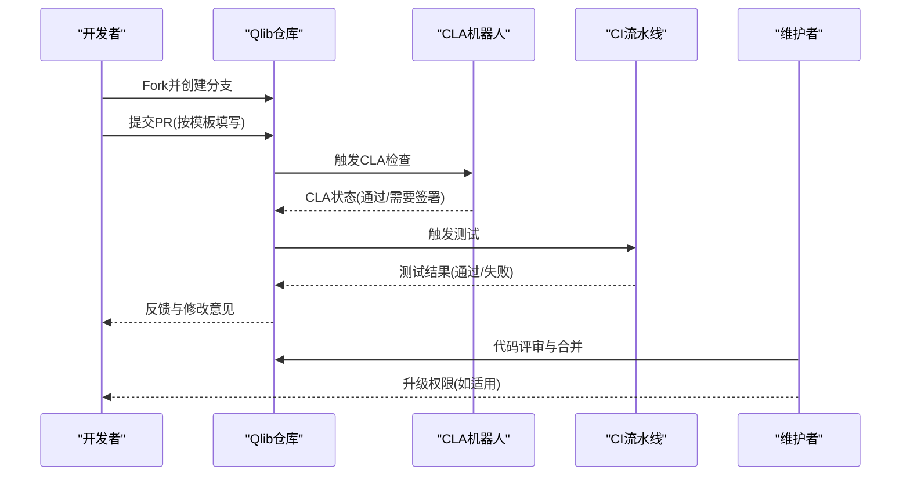
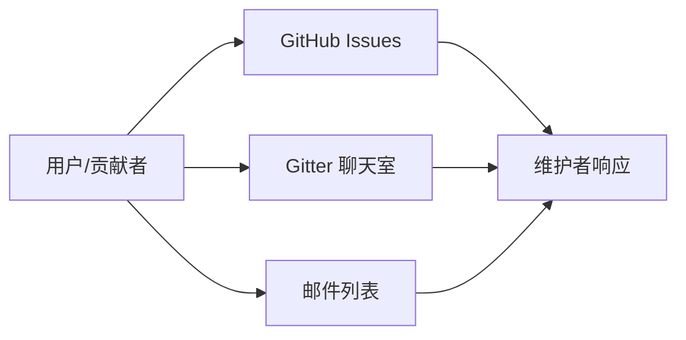
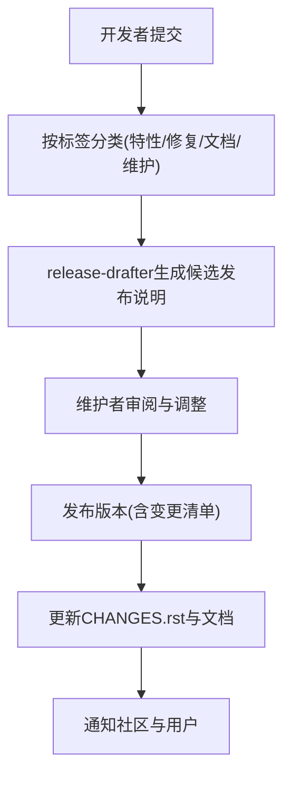
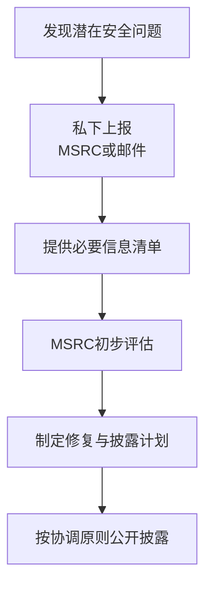
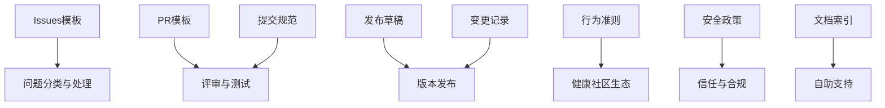

# 社区与支持

<cite>
**本文引用的文件**
- [README.md](file://README.md)
- [CODE_OF_CONDUCT.md](file://CODE_OF_CONDUCT.md)
- [SECURITY.md](file://SECURITY.md)
- [CHANGES.rst](file://CHANGES.rst)
- [.github/ISSUE_TEMPLATE/bug-report.md](file://.github/ISSUE_TEMPLATE/bug-report.md)
- [.github/ISSUE_TEMPLATE/feature-request.md](file://.github/ISSUE_TEMPLATE/feature-request.md)
- [.github/ISSUE_TEMPLATE/question.md](file://.github/ISSUE_TEMPLATE/question.md)
- [.github/ISSUE_TEMPLATE/documentation.md](file://.github/ISSUE_TEMPLATE/documentation.md)
- [.github/PULL_REQUEST_TEMPLATE.md](file://.github/PULL_REQUEST_TEMPLATE.md)
- [.github/release-drafter.yml](file://.github/release-drafter.yml)
- [.commitlintrc.js](file://.commitlintrc.js)
- [docs/index.rst](file://docs/index.rst)
</cite>

## 目录
1. [简介](#简介)
2. [项目结构](#项目结构)
3. [核心组件](#核心组件)
4. [架构总览](#架构总览)
5. [详细组件分析](#详细组件分析)
6. [依赖关系分析](#依赖关系分析)
7. [性能考量](#性能考量)
8. [故障排查指南](#故障排查指南)
9. [结论](#结论)
10. [附录](#附录)

## 简介
本文件面向Qlib社区用户与贡献者，系统化梳理社区参与方式（问题反馈、功能请求、代码贡献）、沟通渠道（GitHub Issues、Gitter聊天室、邮件列表）、版本发布与更新日志（版本号规则、变更记录、迁移指引）、技术支持与帮助资源（文档、教程、专家咨询），以及行为准则与安全政策，并说明如何成为维护者与贡献者（权限申请、责任分工）。内容以仓库现有文件为依据，确保可操作与可追溯。

## 项目结构
围绕“社区与支持”的相关文件主要分布在以下位置：
- 顶层说明与联系方式：README.md
- 行为准则与安全政策：CODE_OF_CONDUCT.md、SECURITY.md
- 版本与变更记录：CHANGES.rst
- GitHub模板与流程：.github/ISSUE_TEMPLATE/*、.github/PULL_REQUEST_TEMPLATE.md、.github/release-drafter.yml、.commitlintrc.js
- 文档索引与参考：docs/index.rst

图示来源
- [README.md:577-581](file://README.md#L577-L581)
- [CODE_OF_CONDUCT.md:1-10](file://CODE_OF_CONDUCT.md#L1-L10)
- [SECURITY.md:1-41](file://SECURITY.md#L1-L41)
- [CHANGES.rst:1-180](file://CHANGES.rst#L1-L180)
- [.github/ISSUE_TEMPLATE/bug-report.md:1-42](file://.github/ISSUE_TEMPLATE/bug-report.md#L1-L42)
- [.github/ISSUE_TEMPLATE/feature-request.md:1-25](file://.github/ISSUE_TEMPLATE/feature-request.md#L1-L25)
- [.github/ISSUE_TEMPLATE/question.md:1-10](file://.github/ISSUE_TEMPLATE/question.md#L1-L10)
- [.github/ISSUE_TEMPLATE/documentation.md:1-10](file://.github/ISSUE_TEMPLATE/documentation.md#L1-L10)
- [.github/PULL_REQUEST_TEMPLATE.md:1-39](file://.github/PULL_REQUEST_TEMPLATE.md#L1-L39)
- [.github/release-drafter.yml:1-37](file://.github/release-drafter.yml#L1-L37)
- [.commitlintrc.js:1-21](file://.commitlintrc.js#L1-L21)
- [docs/index.rst:49-81](file://docs/index.rst#L49-L81)

章节来源
- [README.md:577-581](file://README.md#L577-L581)
- [docs/index.rst:49-81](file://docs/index.rst#L49-L81)

## 核心组件
- 问题反馈与功能请求：通过GitHub Issues模板分类处理，包括缺陷报告、功能请求、文档问题、问答求助等。
- 代码贡献与PR流程：遵循PR模板与提交信息规范，配合CLA签署与自动化检查。
- 沟通渠道：GitHub Issues、Gitter聊天室、邮件列表。
- 版本发布与更新日志：采用发布草稿工具自动汇总变更类别，结合CHANGES.rst与GitHub Releases。
- 技术支持与帮助：官方文档、教程、示例、FAQ与社区资源。
- 行为准则与安全政策：遵循Microsoft开源行为准则与安全披露流程。

章节来源
- [.github/ISSUE_TEMPLATE/bug-report.md:1-42](file://.github/ISSUE_TEMPLATE/bug-report.md#L1-L42)
- [.github/ISSUE_TEMPLATE/feature-request.md:1-25](file://.github/ISSUE_TEMPLATE/feature-request.md#L1-L25)
- [.github/ISSUE_TEMPLATE/question.md:1-10](file://.github/ISSUE_TEMPLATE/question.md#L1-L10)
- [.github/ISSUE_TEMPLATE/documentation.md:1-10](file://.github/ISSUE_TEMPLATE/documentation.md#L1-L10)
- [.github/PULL_REQUEST_TEMPLATE.md:1-39](file://.github/PULL_REQUEST_TEMPLATE.md#L1-L39)
- [.commitlintrc.js:1-21](file://.commitlintrc.js#L1-L21)
- [README.md:577-581](file://README.md#L577-L581)
- [CHANGES.rst:1-180](file://CHANGES.rst#L1-L180)
- [.github/release-drafter.yml:1-37](file://.github/release-drafter.yml#L1-L37)
- [CODE_OF_CONDUCT.md:1-10](file://CODE_OF_CONDUCT.md#L1-L10)
- [SECURITY.md:1-41](file://SECURITY.md#L1-L41)

## 架构总览
下图展示社区支持的关键流程：从问题发现到解决闭环，贯穿沟通渠道、模板与流程、发布与日志、行为与安全策略。

图示来源
- [.github/ISSUE_TEMPLATE/bug-report.md:1-42](file://.github/ISSUE_TEMPLATE/bug-report.md#L1-L42)
- [.github/ISSUE_TEMPLATE/feature-request.md:1-25](file://.github/ISSUE_TEMPLATE/feature-request.md#L1-L25)
- [.github/ISSUE_TEMPLATE/question.md:1-10](file://.github/ISSUE_TEMPLATE/question.md#L1-L10)
- [.github/ISSUE_TEMPLATE/documentation.md:1-10](file://.github/ISSUE_TEMPLATE/documentation.md#L1-L10)
- [.github/PULL_REQUEST_TEMPLATE.md:1-39](file://.github/PULL_REQUEST_TEMPLATE.md#L1-L39)
- [.github/release-drafter.yml:1-37](file://.github/release-drafter.yml#L1-L37)
- [README.md:577-581](file://README.md#L577-L581)
- [SECURITY.md:9-41](file://SECURITY.md#L9-L41)

## 详细组件分析

### 问题反馈与功能请求
- 分类模板
  - 缺陷报告：包含复现步骤、期望行为、截图、环境信息等字段，便于快速定位。
  - 功能请求：描述提案动机、应用场景、相关工作与替代方案。
  - 文档问题：指出教程或API文档的具体部分。
  - 问答求助：建议先阅读文档与论文，再在Issues中清晰描述问题。
- 提交建议
  - 使用清晰标题与标签，便于分类与检索。
  - 提供最小可复现实例与环境信息，加速问题诊断。

图示来源
- [.github/ISSUE_TEMPLATE/bug-report.md:12-39](file://.github/ISSUE_TEMPLATE/bug-report.md#L12-L39)
- [.github/ISSUE_TEMPLATE/feature-request.md:8-25](file://.github/ISSUE_TEMPLATE/feature-request.md#L8-L25)
- [.github/ISSUE_TEMPLATE/question.md:8-10](file://.github/ISSUE_TEMPLATE/question.md#L8-L10)
- [.github/ISSUE_TEMPLATE/documentation.md:7-9](file://.github/ISSUE_TEMPLATE/documentation.md#L7-L9)

章节来源
- [.github/ISSUE_TEMPLATE/bug-report.md:1-42](file://.github/ISSUE_TEMPLATE/bug-report.md#L1-L42)
- [.github/ISSUE_TEMPLATE/feature-request.md:1-25](file://.github/ISSUE_TEMPLATE/feature-request.md#L1-L25)
- [.github/ISSUE_TEMPLATE/question.md:1-10](file://.github/ISSUE_TEMPLATE/question.md#L1-L10)
- [.github/ISSUE_TEMPLATE/documentation.md:1-10](file://.github/ISSUE_TEMPLATE/documentation.md#L1-L10)

### 代码贡献与PR流程
- PR模板要点
  - 描述变更动机与上下文，关联相关Issue。
  - 测试覆盖：提供运行测试的说明；新增功能需自测并通过。
  - 变更类型：修复、特性、文档等分类标记。
- 提交信息规范
  - 遵循约定式提交，限制类型枚举与头部长度，提升可读性与自动化能力。
- CLA与合规
  - 提交PR时会触发CLA机器人，按提示完成签署，确保贡献合法有效。
- 合作与升级
  - 如希望成为维护者，可通过邮件联系，表达贡献意愿与职责范围。

图示来源
- [.github/PULL_REQUEST_TEMPLATE.md:16-39](file://.github/PULL_REQUEST_TEMPLATE.md#L16-L39)
- [.commitlintrc.js:14-20](file://.commitlintrc.js#L14-L20)
- [README.md:620-633](file://README.md#L620-L633)

章节来源
- [.github/PULL_REQUEST_TEMPLATE.md:1-39](file://.github/PULL_REQUEST_TEMPLATE.md#L1-L39)
- [.commitlintrc.js:1-21](file://.commitlintrc.js#L1-L21)
- [README.md:620-633](file://README.md#L620-L633)

### 沟通渠道与联系方式
- GitHub Issues：用于缺陷、功能、文档与问答。
- Gitter聊天室：实时交流与社区互动。
- 邮件列表：通用邮箱用于非公开或深度讨论。

图示来源
- [README.md:577-581](file://README.md#L577-L581)

章节来源
- [README.md:577-581](file://README.md#L577-L581)

### 版本发布与更新日志
- 发布草稿配置
  - 按标签自动归类：特性、缺陷修复、文档、维护等。
  - 自动版本解析：主/次/补丁级别，支持破坏性变更标记。
  - 自动生成变更条目与模板。
- 变更记录
  - CHANGES.rst提供历史版本的详细变更摘要，便于回溯与迁移。
- 迁移指引
  - 结合发布说明与变更记录，识别破坏性改动与兼容性影响，制定迁移计划。

图示来源
- [.github/release-drafter.yml:3-37](file://.github/release-drafter.yml#L3-L37)
- [CHANGES.rst:1-180](file://CHANGES.rst#L1-L180)

章节来源
- [.github/release-drafter.yml:1-37](file://.github/release-drafter.yml#L1-L37)
- [CHANGES.rst:1-180](file://CHANGES.rst#L1-L180)

### 技术支持与帮助资源
- 官方文档与索引
  - docs/index.rst提供开发者指南、API参考、FAQ与变更日志入口。
- 教程与示例
  - README中的快速开始、自动工作流、定制化工作流等示例。
- 常见问题
  - FAQ页面与文档索引便于自助排查。
- 在线模式与数据服务
  - README提供离线/在线模式说明与性能对比，便于理解部署形态。

章节来源
- [docs/index.rst:49-81](file://docs/index.rst#L49-L81)
- [README.md:158-414](file://README.md#L158-L414)

### 行为准则与安全政策
- 行为准则
  - 采用Microsoft开源行为准则，提供FAQ与联系方式。
- 安全政策
  - 明确不通过公开Issues报告漏洞，应使用Microsoft安全响应中心或邮件通道。
  - 提供所需信息清单（类型、路径、位置、复现步骤、影响评估等）。
  - 偏好语言为英语，遵循协调漏洞披露原则。

图示来源
- [CODE_OF_CONDUCT.md:1-10](file://CODE_OF_CONDUCT.md#L1-L10)
- [SECURITY.md:9-41](file://SECURITY.md#L9-L41)

章节来源
- [CODE_OF_CONDUCT.md:1-10](file://CODE_OF_CONDUCT.md#L1-L10)
- [SECURITY.md:1-41](file://SECURITY.md#L1-L41)

### 成为维护者与贡献者
- 贡献路径
  - 从小处入手：修复文档错别字、回答问题、提交小修复等。
  - 关注“good first issue”，逐步熟悉代码与流程。
- 权限升级
  - 若希望承担更多责任（如合并PR、问题分流），可通过邮件联系，表达意愿与能力，由维护团队评估与升级权限。

章节来源
- [README.md:594-621](file://README.md#L594-L621)

## 依赖关系分析
- 模板与流程依赖
  - Issues模板驱动问题分类与信息收集，保障维护者高效处理。
  - PR模板与提交规范提升代码质量与可追踪性。
  - release-drafter与CHANGES.rst共同构成发布与日志体系。
- 政策与合规依赖
  - 行为准则与安全政策为社区协作提供底线与风险控制。
- 文档与支持依赖
  - docs/index.rst作为导航中枢，串联开发者指南、API与FAQ，支撑自助服务能力。

图示来源
- [.github/ISSUE_TEMPLATE/bug-report.md:1-42](file://.github/ISSUE_TEMPLATE/bug-report.md#L1-L42)
- [.github/PULL_REQUEST_TEMPLATE.md:1-39](file://.github/PULL_REQUEST_TEMPLATE.md#L1-L39)
- [.commitlintrc.js:1-21](file://.commitlintrc.js#L1-L21)
- [.github/release-drafter.yml:1-37](file://.github/release-drafter.yml#L1-L37)
- [CHANGES.rst:1-180](file://CHANGES.rst#L1-L180)
- [CODE_OF_CONDUCT.md:1-10](file://CODE_OF_CONDUCT.md#L1-L10)
- [SECURITY.md:1-41](file://SECURITY.md#L1-L41)
- [docs/index.rst:49-81](file://docs/index.rst#L49-L81)

章节来源
- [.github/ISSUE_TEMPLATE/bug-report.md:1-42](file://.github/ISSUE_TEMPLATE/bug-report.md#L1-L42)
- [.github/PULL_REQUEST_TEMPLATE.md:1-39](file://.github/PULL_REQUEST_TEMPLATE.md#L1-L39)
- [.commitlintrc.js:1-21](file://.commitlintrc.js#L1-L21)
- [.github/release-drafter.yml:1-37](file://.github/release-drafter.yml#L1-L37)
- [CHANGES.rst:1-180](file://CHANGES.rst#L1-L180)
- [CODE_OF_CONDUCT.md:1-10](file://CODE_OF_CONDUCT.md#L1-L10)
- [SECURITY.md:1-41](file://SECURITY.md#L1-L41)
- [docs/index.rst:49-81](file://docs/index.rst#L49-L81)

## 性能考量
- 问题处理效率
  - 使用标准化模板与标签，减少来回沟通成本。
  - 维护者按类别分派任务，提高响应速度。
- 发布与日志自动化
  - release-drafter自动聚合变更，降低人工整理成本。
  - CHANGES.rst集中记录历史变更，便于回溯与迁移。
- 文档与自助支持
  - docs/index.rst统一入口，减少用户寻找成本，提升满意度。

## 故障排查指南
- 提交问题前
  - 先查阅FAQ与文档索引，确认是否已有解决方案。
  - 准备最小可复现实例与环境信息，提升问题定位效率。
- 安全问题
  - 切勿通过公开Issues上报，应使用MSRC或邮件通道私下上报。
  - 按要求提供漏洞类型、路径、位置、复现步骤与影响评估。
- 贡献流程异常
  - CLA未通过：按机器人提示完成签署。
  - 测试失败：根据PR模板补充测试用例与说明。
  - 标题/标签不规范：遵循提交规范与模板要求。

章节来源
- [SECURITY.md:9-41](file://SECURITY.md#L9-L41)
- [.github/PULL_REQUEST_TEMPLATE.md:23-39](file://.github/PULL_REQUEST_TEMPLATE.md#L23-L39)
- [.commitlintrc.js:14-20](file://.commitlintrc.js#L14-L20)
- [docs/index.rst:75-81](file://docs/index.rst#L75-L81)

## 结论
Qlib社区以标准化模板与流程为基础，辅以明确的行为准则与安全政策，形成从问题发现到解决闭环的协作体系。通过发布草稿与变更记录实现版本透明化，借助文档索引与FAQ提供自助支持。欢迎各类贡献，从小处着手，逐步成长为维护者，共同建设健康、高效、可信的社区生态。

## 附录
- 快速入口
  - GitHub Issues：缺陷/功能/文档/问答模板
  - Gitter：实时交流
  - 邮件：通用联系方式
  - 文档索引：开发者指南、API、FAQ、变更日志
- 版本与日志
  - release-drafter自动分类与生成发布说明
  - CHANGES.rst集中记录历史变更