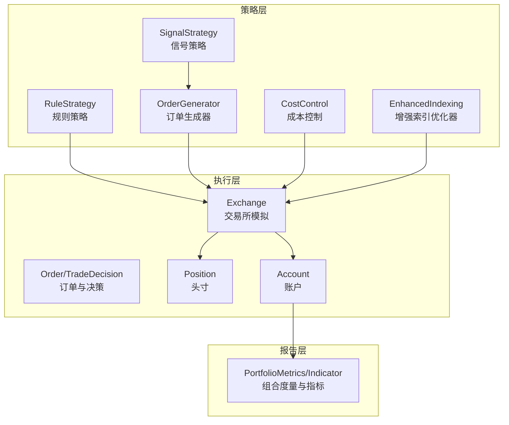
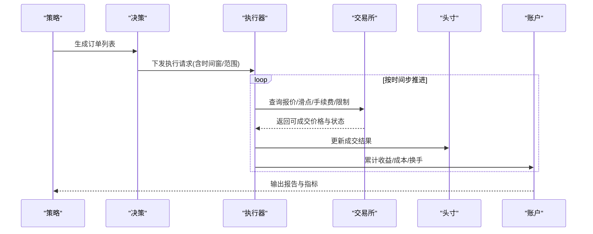
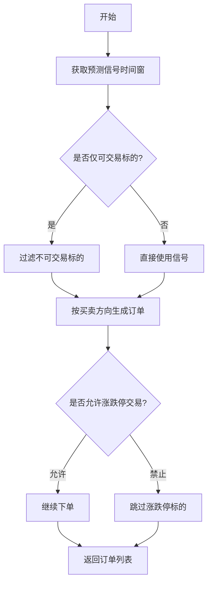
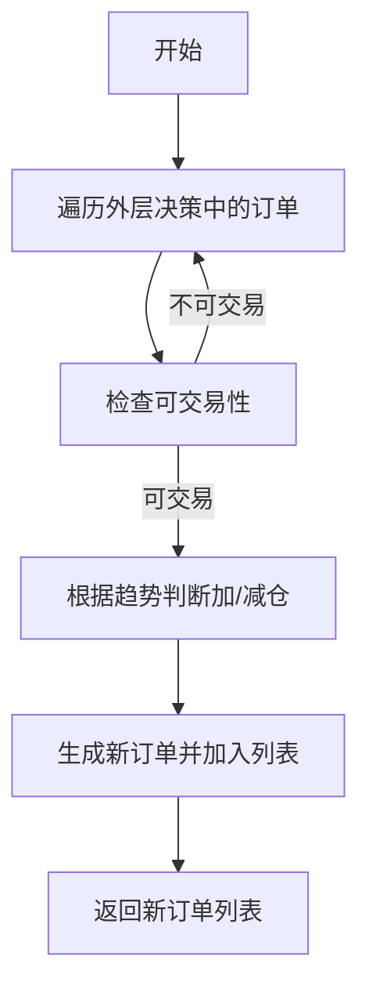
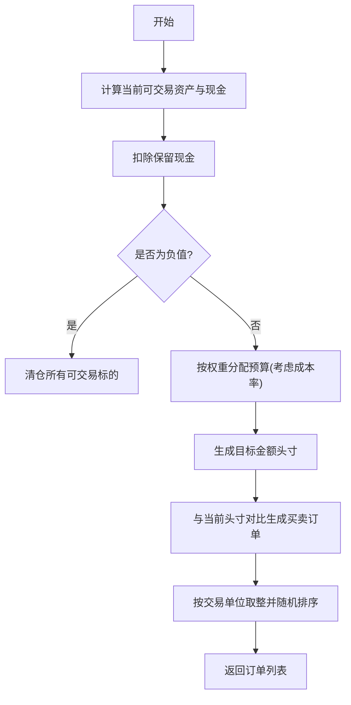
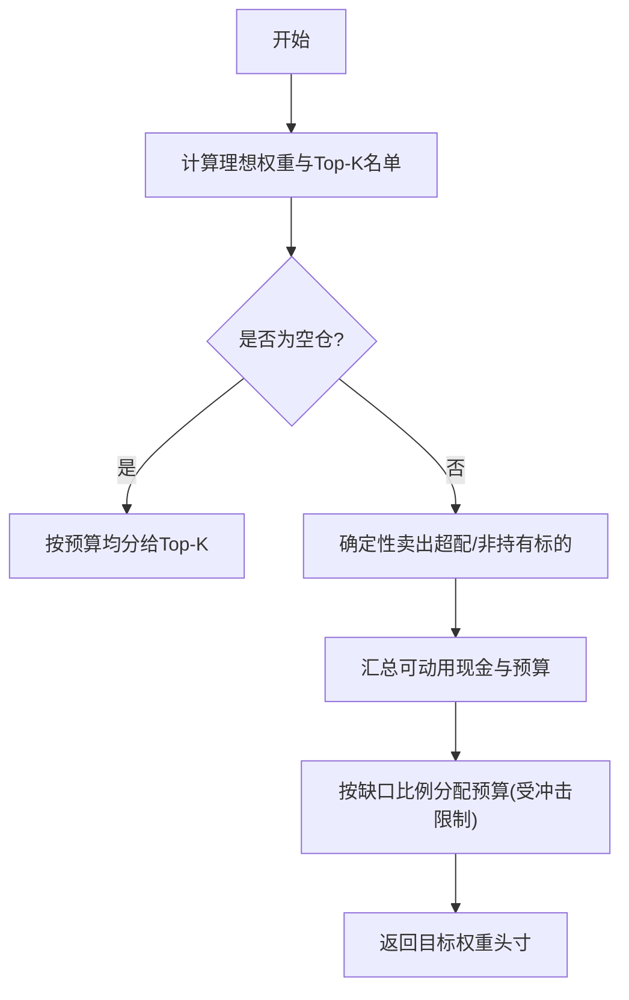
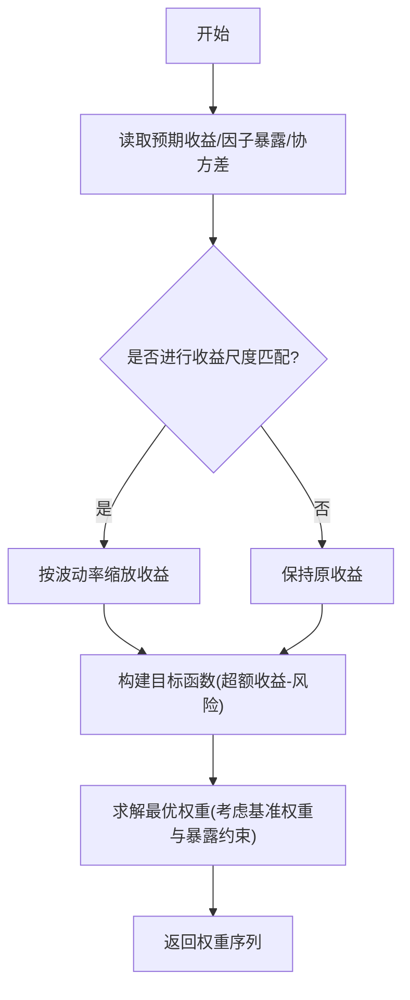
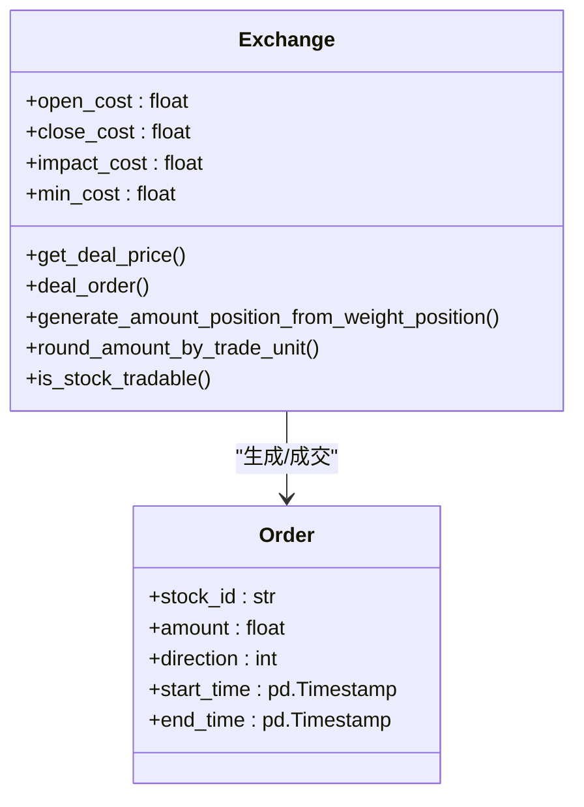
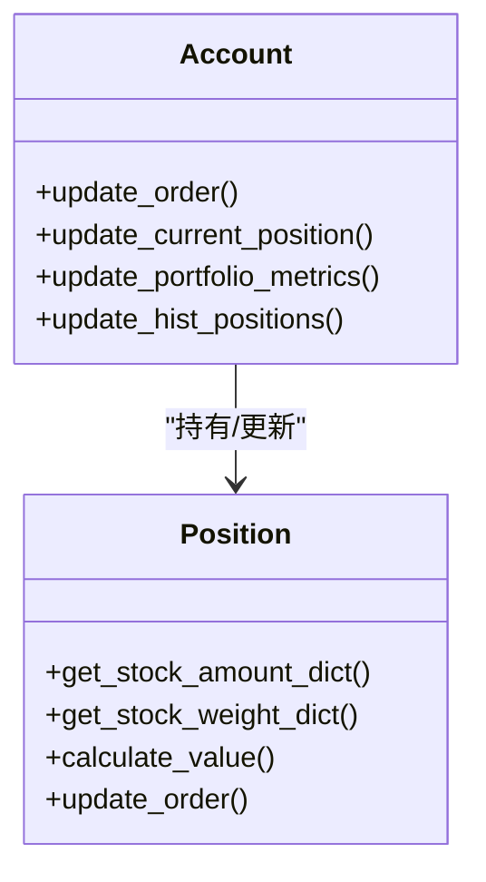
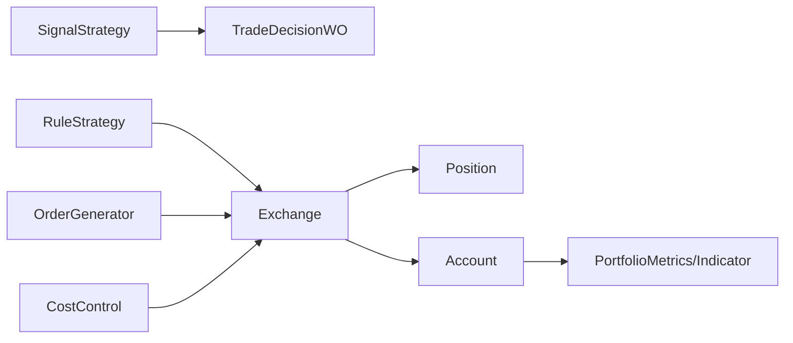

# 交易决策系统

<cite>
**本文引用的文件**
- [decision.py](file://qlib/backtest/decision.py)
- [exchange.py](file://qlib/backtest/exchange.py)
- [position.py](file://qlib/backtest/position.py)
- [account.py](file://qlib/backtest/account.py)
- [signal_strategy.py](file://qlib/contrib/strategy/signal_strategy.py)
- [rule_strategy.py](file://qlib/contrib/strategy/rule_strategy.py)
- [order_generator.py](file://qlib/contrib/strategy/order_generator.py)
- [cost_control.py](file://qlib/contrib/strategy/cost_control.py)
- [enhanced_indexing.py](file://qlib/contrib/strategy/optimizer/enhanced_indexing.py)
</cite>

## 目录
1. [引言](#引言)
2. [项目结构](#项目结构)
3. [核心组件](#核心组件)
4. [架构总览](#架构总览)
5. [详细组件分析](#详细组件分析)
6. [依赖分析](#依赖分析)
7. [性能考虑](#性能考虑)
8. [故障排查指南](#故障排查指南)
9. [结论](#结论)
10. [附录](#附录)

## 引言
本文件面向Qlib交易决策系统，围绕“信号生成—订单生成—执行—结算—报告”闭环，系统化梳理以下关键能力：
- 买入/卖出信号的判定与触发机制
- 仓位管理策略（固定/动态/风险平价）
- 交易成本控制（滑点、手续费、市场冲击）
- 止损止盈策略（固定/移动/跟踪）
- 交易约束（最大持仓、行业暴露等）
- 决策规则的配置与优化

目标是帮助读者快速理解并高效配置与扩展交易策略。

## 项目结构
交易决策系统由“策略层”“执行层”“结算层”“报告层”构成，核心模块如下：
- 策略层：信号策略、规则策略、订单生成器、成本控制、增强索引优化器
- 执行层：订单定义、交易所模拟、位置与账户
- 报告层：指标与组合度量

图表来源
- [signal_strategy.py](file://qlib/contrib/strategy/signal_strategy.py)
- [rule_strategy.py](file://qlib/contrib/strategy/rule_strategy.py)
- [order_generator.py](file://qlib/contrib/strategy/order_generator.py)
- [cost_control.py](file://qlib/contrib/strategy/cost_control.py)
- [enhanced_indexing.py](file://qlib/contrib/strategy/optimizer/enhanced_indexing.py)
- [decision.py](file://qlib/backtest/decision.py)
- [exchange.py](file://qlib/backtest/exchange.py)
- [position.py](file://qlib/backtest/position.py)
- [account.py](file://qlib/backtest/account.py)

章节来源
- [signal_strategy.py](file://qlib/contrib/strategy/signal_strategy.py)
- [rule_strategy.py](file://qlib/contrib/strategy/rule_strategy.py)
- [order_generator.py](file://qlib/contrib/strategy/order_generator.py)
- [cost_control.py](file://qlib/contrib/strategy/cost_control.py)
- [enhanced_indexing.py](file://qlib/contrib/strategy/optimizer/enhanced_indexing.py)
- [decision.py](file://qlib/backtest/decision.py)
- [exchange.py](file://qlib/backtest/exchange.py)
- [position.py](file://qlib/backtest/position.py)
- [account.py](file://qlib/backtest/account.py)

## 核心组件
- 订单与决策
  - 订单对象封装股票代码、数量、方向、时间窗与成交结果字段；支持解析方向、计算金额变化等
  - 决策基类抽象了“上层策略给出决策、下层策略按范围执行”的嵌套执行模型
- 交易所模拟
  - 提供报价、滑点、手续费、涨跌停/停牌限制、交易单位、成交量限制等
  - 支持根据权重目标生成目标金额头寸，并生成买卖订单
- 头寸与账户
  - 头寸记录持有数量、价格、权重、现金等；支持按收盘价更新与价值计算
  - 账户负责累计收益、成本、换手率，以及组合度量与历史头寸记录
- 策略与生成器
  - 信号策略：基于预测信号生成买卖清单，支持仅可交易标的过滤、涨跌停限制
  - 规则策略：基于趋势/信号对已有订单进行放大/缩小
  - 订单生成器：从目标权重头寸生成目标金额头寸与实际订单
  - 成本控制：按预算与冲击限制进行确定性卖出与比例买入分配
  - 增强索引优化：在因子暴露与跟踪误差框架下求解最优权重

章节来源
- [decision.py](file://qlib/backtest/decision.py)
- [exchange.py](file://qlib/backtest/exchange.py)
- [position.py](file://qlib/backtest/position.py)
- [account.py](file://qlib/backtest/account.py)
- [signal_strategy.py](file://qlib/contrib/strategy/signal_strategy.py)
- [rule_strategy.py](file://qlib/contrib/strategy/rule_strategy.py)
- [order_generator.py](file://qlib/contrib/strategy/order_generator.py)
- [cost_control.py](file://qlib/contrib/strategy/cost_control.py)
- [enhanced_indexing.py](file://qlib/contrib/strategy/optimizer/enhanced_indexing.py)

## 架构总览
交易决策系统以“策略—执行—结算—报告”为主线，通过订单与决策抽象连接策略与执行器，通过交易所模拟统一处理价格、滑点、手续费与交易约束，最终由账户与报告模块输出收益、成本与换手等指标。

图表来源
- [decision.py](file://qlib/backtest/decision.py)
- [exchange.py](file://qlib/backtest/exchange.py)
- [position.py](file://qlib/backtest/position.py)
- [account.py](file://qlib/backtest/account.py)

## 详细组件分析

### 信号策略（SignalStrategy）
- 信号到订单的映射
  - 读取预测信号的时间窗，过滤仅可交易标的，按买卖方向生成订单
  - 支持涨跌停限制开关：完全禁止或允许在涨跌停时反向交易
- 固定/动态仓位
  - 可按风险系数切分资金，按当前可用现金与下单价格折算下单数量
  - 支持仅考虑可交易标的，避免停牌/涨跌停导致的无效订单
- 生成目标权重头寸
  - 子类需实现目标权重头寸生成接口，用于与订单生成器配合

图表来源
- [signal_strategy.py](file://qlib/contrib/strategy/signal_strategy.py)

章节来源
- [signal_strategy.py](file://qlib/contrib/strategy/signal_strategy.py)

### 规则策略（RuleStrategy）
- 对已有订单进行幅度调整
  - 基于相邻K线的趋势判断，对同向订单进行加仓，反向订单进行减仓
  - 考虑交易单位与可交易性，确保订单合法
- 与信号策略的协作
  - 作为外层策略，先由信号策略生成初始订单，再由规则策略进行二次加工

图表来源
- [rule_strategy.py](file://qlib/contrib/strategy/rule_strategy.py)

章节来源
- [rule_strategy.py](file://qlib/contrib/strategy/rule_strategy.py)

### 订单生成器（OrderGenerator）
- 目标权重到目标金额头寸
  - 计算当前可交易资产与现金，扣除保留现金后，按权重分配至可交易标的
  - 考虑开/平仓成本率，避免因成本过高导致无法成交
- 实际订单生成
  - 将目标金额头寸与当前头寸对比，按交易单位向下取整生成买卖订单
  - 随机打散交易顺序以减少回测偏差

图表来源
- [order_generator.py](file://qlib/contrib/strategy/order_generator.py)
- [exchange.py](file://qlib/backtest/exchange.py)

章节来源
- [order_generator.py](file://qlib/contrib/strategy/order_generator.py)
- [exchange.py](file://qlib/backtest/exchange.py)

### 成本控制（CostControl）
- 预算与冲击限制下的权重分配
  - 冷启动：按预算均分给Top-K标的
  - 再平衡：先进行确定性卖出释放现金，再按缺口比例在标的间分配预算
  - 冲击限制：每笔买卖不超过冲击上限，避免大额订单造成额外成本
- 与订单生成器的衔接
  - 生成目标权重头寸后，交由订单生成器转换为实际订单

图表来源
- [cost_control.py](file://qlib/contrib/strategy/cost_control.py)
- [order_generator.py](file://qlib/contrib/strategy/order_generator.py)

章节来源
- [cost_control.py](file://qlib/contrib/strategy/cost_control.py)
- [order_generator.py](file://qlib/contrib/strategy/order_generator.py)

### 增强索引优化（EnhancedIndexing）
- 在因子暴露与跟踪误差框架下求解最优权重
  - 可选对收益做波动率尺度匹配
  - 以超额收益最大化为目标，约束因子暴露与跟踪误差
- 与策略的集成
  - 作为外部优化器，输出权重后交由订单生成器/成本控制模块落地

图表来源
- [enhanced_indexing.py](file://qlib/contrib/strategy/optimizer/enhanced_indexing.py)

章节来源
- [enhanced_indexing.py](file://qlib/contrib/strategy/optimizer/enhanced_indexing.py)

### 交易所模拟（Exchange）
- 报价与成交
  - 支持指定成交价字段（开盘/收盘/VWAP等），自动回退到收盘价
  - 滑点与手续费参数化，支持最小费用兜底
- 交易约束
  - 涨跌停/停牌限制、成交量限制（累计/即时）、交易单位取整
- 权重到金额的映射
  - 将目标权重头寸按可交易标的权重归一化后映射为金额头寸

图表来源
- [exchange.py](file://qlib/backtest/exchange.py)
- [decision.py](file://qlib/backtest/decision.py)

章节来源
- [exchange.py](file://qlib/backtest/exchange.py)
- [decision.py](file://qlib/backtest/decision.py)

### 头寸与账户（Position/Account）
- 头寸
  - 维护股票数量、均价、权重、现金等；支持按收盘价更新与价值计算
- 账户
  - 累计收益、成本、换手；按日生成组合度量与历史头寸快照
  - 与执行器联动，在每个bar结束更新价格、持有天数与指标

图表来源
- [position.py](file://qlib/backtest/position.py)
- [account.py](file://qlib/backtest/account.py)

章节来源
- [position.py](file://qlib/backtest/position.py)
- [account.py](file://qlib/backtest/account.py)

## 依赖分析
- 策略层依赖执行层的订单与交易所接口，通过抽象的决策类实现嵌套执行
- 执行层依赖头寸与账户进行状态更新与指标计算
- 报告层依赖账户与历史头寸生成指标与报表

图表来源
- [signal_strategy.py](file://qlib/contrib/strategy/signal_strategy.py)
- [rule_strategy.py](file://qlib/contrib/strategy/rule_strategy.py)
- [order_generator.py](file://qlib/contrib/strategy/order_generator.py)
- [cost_control.py](file://qlib/contrib/strategy/cost_control.py)
- [decision.py](file://qlib/backtest/decision.py)
- [exchange.py](file://qlib/backtest/exchange.py)
- [position.py](file://qlib/backtest/position.py)
- [account.py](file://qlib/backtest/account.py)

章节来源
- [signal_strategy.py](file://qlib/contrib/strategy/signal_strategy.py)
- [rule_strategy.py](file://qlib/contrib/strategy/rule_strategy.py)
- [order_generator.py](file://qlib/contrib/strategy/order_generator.py)
- [cost_control.py](file://qlib/contrib/strategy/cost_control.py)
- [decision.py](file://qlib/backtest/decision.py)
- [exchange.py](file://qlib/backtest/exchange.py)
- [position.py](file://qlib/backtest/position.py)
- [account.py](file://qlib/backtest/account.py)

## 性能考虑
- 订单生成阶段的随机打散与交易单位取整可降低回测偏差与执行成本
- 成本控制中先卖后买与预算归一化可提升执行稳定性
- 报告与指标计算建议按需启用，避免高频更新带来的开销
- 交易所查询与头寸更新在每个bar结束进行，有助于降低中间态复杂度

## 故障排查指南
- 订单无法成交
  - 检查涨跌停/停牌限制与成交量限制
  - 核对交易单位取整是否导致订单为0
- 成交金额异常
  - 核对成交价字段与回退逻辑
  - 检查最小费用与滑点参数
- 头寸与账户不一致
  - 确认结算机制（如T+1）与延迟现金处理
  - 检查每日bar结束的价格更新与权重更新
- 报告缺失
  - 确认组合度量是否启用与历史头寸是否记录

章节来源
- [exchange.py](file://qlib/backtest/exchange.py)
- [position.py](file://qlib/backtest/position.py)
- [account.py](file://qlib/backtest/account.py)

## 结论
Qlib交易决策系统通过清晰的策略—执行—结算—报告分层，提供了从信号到订单、从约束到成本控制的完整闭环。结合规则策略、成本控制与增强索引优化，可在不同市场环境下实现稳健的交易执行与风险控制。

## 附录

### 交易成本控制机制（要点）
- 滑点建模
  - 通过滑点系数参数化市场冲击成本
- 手续费计算
  - 开仓/平仓费率与最低费用兜底
- 市场冲击成本
  - 通过冲击限制与预算分配策略降低大单冲击

章节来源
- [exchange.py](file://qlib/backtest/exchange.py)
- [cost_control.py](file://qlib/contrib/strategy/cost_control.py)
- [order_generator.py](file://qlib/contrib/strategy/order_generator.py)

### 止损止盈策略实现（方法）
- 固定止损/止盈
  - 基于头寸均价设定固定阈值
- 移动止损/跟踪止损
  - 随股价上涨动态上调止损位，降低回撤风险
- 与策略集成
  - 可在信号策略或规则策略中增加条件判断，生成止盈/止损订单

章节来源
- [signal_strategy.py](file://qlib/contrib/strategy/signal_strategy.py)
- [rule_strategy.py](file://qlib/contrib/strategy/rule_strategy.py)

### 交易约束条件设置
- 最大持仓限制
  - 通过头寸权重与预算分配控制单只/组合集中度
- 行业暴露控制
  - 在增强索引优化中引入因子暴露约束，限制行业权重偏离基准
- 涨跌停/停牌限制
  - 交易所层面自动屏蔽不可交易标的

章节来源
- [exchange.py](file://qlib/backtest/exchange.py)
- [enhanced_indexing.py](file://qlib/contrib/strategy/optimizer/enhanced_indexing.py)

### 决策规则配置与优化
- 信号策略
  - 设置Top-K、丢弃数量、仅可交易标的、涨跌停限制等
- 规则策略
  - 设置趋势判断窗口与加仓/减仓幅度
- 订单生成器
  - 设置风险系数、保留现金比例、交易单位与成本率
- 成本控制
  - 设置预算与冲击限制，冷启动与再平衡流程

章节来源
- [signal_strategy.py](file://qlib/contrib/strategy/signal_strategy.py)
- [rule_strategy.py](file://qlib/contrib/strategy/rule_strategy.py)
- [order_generator.py](file://qlib/contrib/strategy/order_generator.py)
- [cost_control.py](file://qlib/contrib/strategy/cost_control.py)