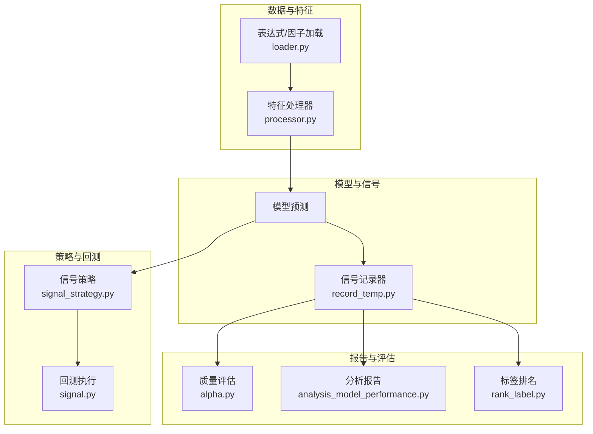
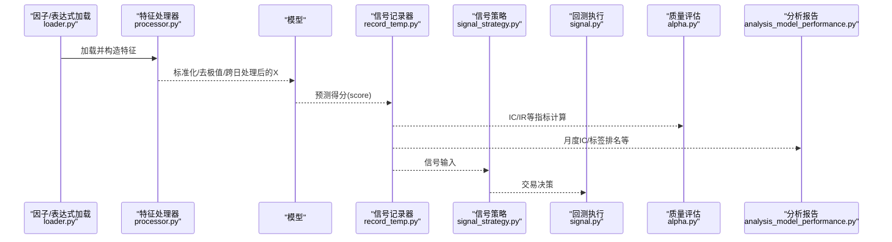
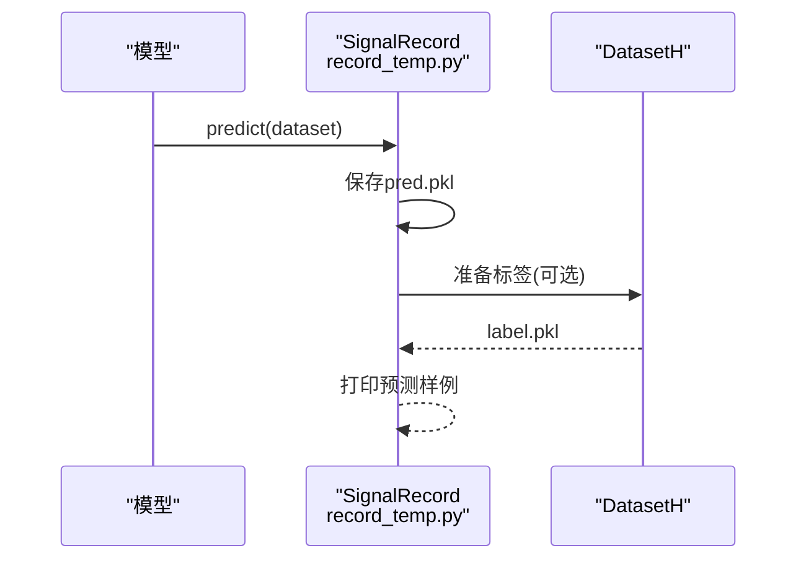
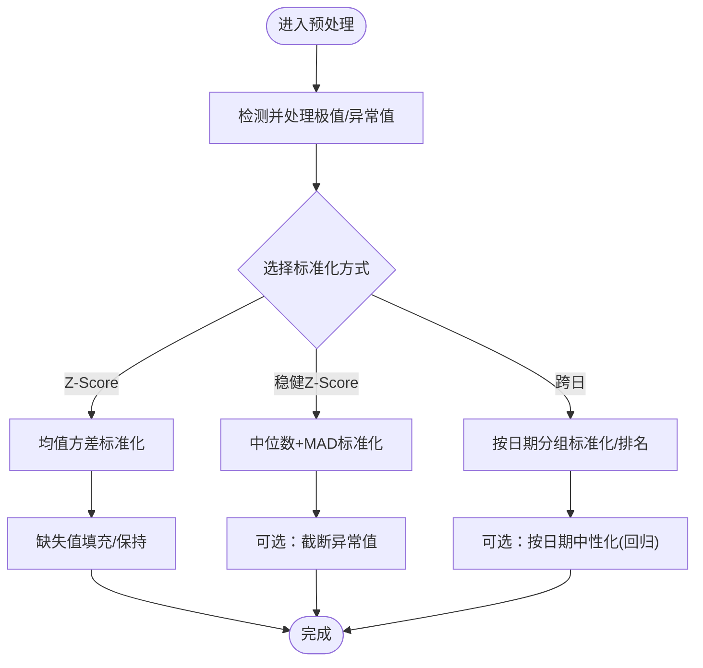
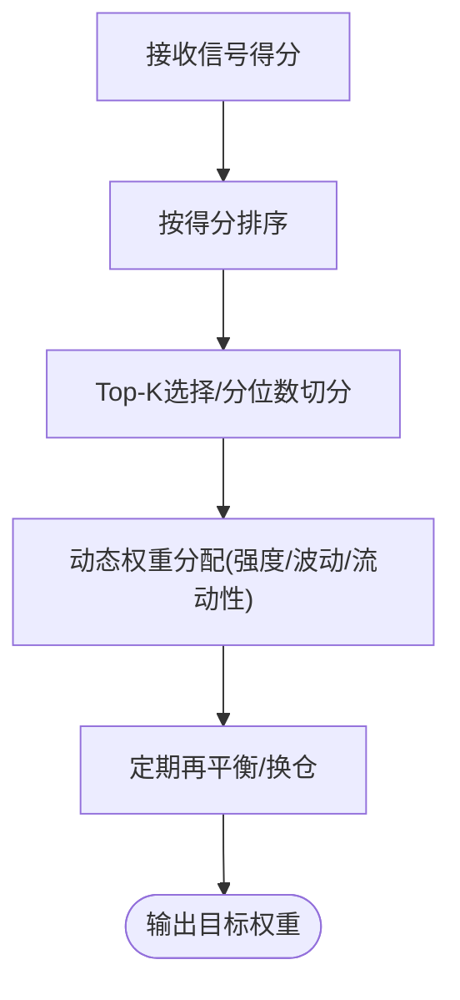
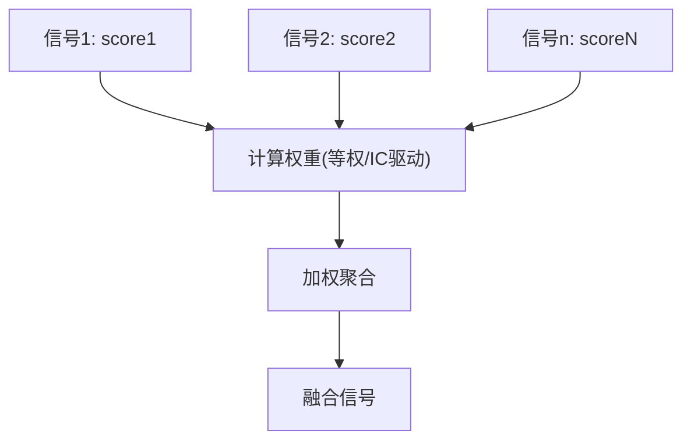
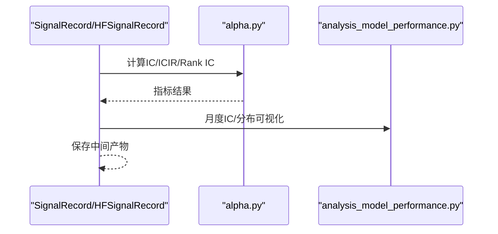
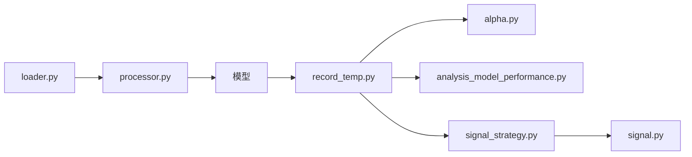

# 信号处理系统

<cite>
**本文引用的文件**   
- [signal.py](file://qlib/backtest/signal.py)
- [signal_strategy.py](file://qlib/contrib/strategy/signal_strategy.py)
- [record_temp.py](file://qlib/workflow/record_temp.py)
- [processor.py](file://qlib/data/dataset/processor.py)
- [loader.py](file://qlib/contrib/data/loader.py)
- [alpha.py](file://qlib/contrib/eva/alpha.py)
- [analysis_model_performance.py](file://qlib/contrib/report/analysis_model/analysis_model_performance.py)
- [rank_label.py](file://qlib/contrib/report/analysis_position/rank_label.py)
- [alpha158_factor_guide.md](file://alpha158_factor_guide.md)
</cite>

## 目录
1. [引言](#引言)
2. [项目结构](#项目结构)
3. [核心组件](#核心组件)
4. [架构总览](#架构总览)
5. [详细组件分析](#详细组件分析)
6. [依赖关系分析](#依赖关系分析)
7. [性能考量](#性能考量)
8. [故障排查指南](#故障排查指南)
9. [结论](#结论)
10. [附录](#附录)

## 引言
本文件面向Qlib信号处理系统，系统性阐述从“因子信号”到“预测信号”的生成与处理流程，覆盖信号去极值、标准化、中性化、排序与分位数处理、信号组合与融合、信号质量评估与回测验证，并提供可直接定位到源码路径的示例，帮助读者快速理解并落地信号处理的完整工作流。

## 项目结构
围绕信号处理的关键模块主要分布在以下子系统：
- 数据与特征工程：处理器（去极值、标准化、跨日归一/排名）、表达式与因子加载
- 模型与信号记录：模型预测输出为信号，记录器保存并产出IC/IR等质量指标
- 策略与回测：基于信号生成交易决策，进行收益与风险评估
- 报告与分析：IC分布、月度IC热力图、标签排名可视化等

图表来源
- [loader.py:184-203](file://qlib/contrib/data/loader.py#L184-L203)
- [processor.py:204-366](file://qlib/data/dataset/processor.py#L204-L366)
- [record_temp.py:161-209](file://qlib/workflow/record_temp.py#L161-L209)
- [signal_strategy.py:25-328](file://qlib/contrib/strategy/signal_strategy.py#L25-L328)
- [signal.py](file://qlib/backtest/signal.py)

章节来源
- [alpha158_factor_guide.md:802-862](file://alpha158_factor_guide.md#L802-L862)

## 核心组件
- 信号记录器：负责保存模型预测结果（score），并在具备标签时同步保存标签，供后续质量评估与回测使用。
- 信号策略：基于信号生成交易决策，支持权重型策略与Top-K等排序策略。
- 特征处理器：提供去极值、标准化、跨日标准化/排名、中性化等能力，支撑信号稳定性与泛化性。
- 质量评估与报告：提供IC/ICIR、Rank IC、多空收益、月度IC热力图、标签排名等指标与可视化。

章节来源
- [record_temp.py:161-209](file://qlib/workflow/record_temp.py#L161-L209)
- [signal_strategy.py:25-328](file://qlib/contrib/strategy/signal_strategy.py#L25-L328)
- [processor.py:204-366](file://qlib/data/dataset/processor.py#L204-L366)
- [alpha.py](file://qlib/contrib/eva/alpha.py)

## 架构总览
下图展示了从因子/特征到信号、再到策略与回测的整体流程，以及质量评估与报告环节：

图表来源
- [loader.py:184-203](file://qlib/contrib/data/loader.py#L184-L203)
- [processor.py:204-366](file://qlib/data/dataset/processor.py#L204-L366)
- [record_temp.py:161-209](file://qlib/workflow/record_temp.py#L161-L209)
- [signal_strategy.py:25-328](file://qlib/contrib/strategy/signal_strategy.py#L25-L328)
- [signal.py](file://qlib/backtest/signal.py)

## 详细组件分析

### 信号生成与记录
- 生成流程：模型对特征进行预测，得到每只股票的预测得分；记录器保存预测结果与标签（若存在），并打印前几条样例。
- 输出产物：pred.pkl、label.pkl；同时可扩展保存IC、Rank IC、多空收益等中间结果，供后续分析。

图表来源
- [record_temp.py:190-207](file://qlib/workflow/record_temp.py#L190-L207)

章节来源
- [record_temp.py:161-209](file://qlib/workflow/record_temp.py#L161-L209)

### 信号过滤与预处理
- 去极值与缩尾：通过最小/最大值归一或稳健统计（如MAD）实现，避免极端值影响。
- 标准化：提供Z-Score、稳健Z-Score、跨日Z-Score等，满足不同场景下的分布特性。
- 跨日标准化/排名：按日期对股票进行标准化或排名，消除横截面异质性。
- 中性化：通过跨日回归等方式去除市场/行业等公共因子影响（常见于更高阶的中性化流程）。

图表来源
- [processor.py:204-366](file://qlib/data/dataset/processor.py#L204-L366)

章节来源
- [processor.py:204-366](file://qlib/data/dataset/processor.py#L204-L366)

### 信号排序与分位数组合
- 分层构建与Top-K：策略根据信号得分进行排序，选取Top-K股票建立多头，同时可设置淘汰数量以降低拥挤度。
- 动态权重分配：基于信号强度、波动率、流动性等因素进行动态配仓，平衡收益与风险。
- 分位数处理：将信号映射到分位数区间，便于跨时间维度比较与统一建模。

图表来源
- [signal_strategy.py:25-328](file://qlib/contrib/strategy/signal_strategy.py#L25-L328)

章节来源
- [signal_strategy.py:25-328](file://qlib/contrib/strategy/signal_strategy.py#L25-L328)

### 信号组合与融合
- 等权组合：对多个信号按相等权重聚合，降低单一信号的噪声影响。
- 基于信息系数的加权组合：以历史IC/ICIR作为权重，优先保留预测能力更强的信号。
- 动态组合：根据市场状态（如IC稳定性、波动环境）自适应调整权重。

图表来源
- [record_temp.py:259-292](file://qlib/workflow/record_temp.py#L259-L292)

章节来源
- [record_temp.py:259-292](file://qlib/workflow/record_temp.py#L259-L292)

### 信号质量评估与回测验证
- 质量指标：IC、ICIR、Rank IC、Rank ICIR、多空精度、多空平均收益与夏普比率等。
- 可视化：月度IC热力图、标签排名比例图、QQ图等，辅助判断信号稳定性与预测能力。
- 回测：基于信号生成交易决策，评估收益曲线、最大回撤、胜率等。

图表来源
- [record_temp.py:259-292](file://qlib/workflow/record_temp.py#L259-L292)
- [alpha.py](file://qlib/contrib/eva/alpha.py)
- [analysis_model_performance.py:156-187](file://qlib/contrib/report/analysis_model/analysis_model_performance.py#L156-L187)

章节来源
- [record_temp.py:259-292](file://qlib/workflow/record_temp.py#L259-L292)
- [alpha.py](file://qlib/contrib/eva/alpha.py)
- [analysis_model_performance.py:156-187](file://qlib/contrib/report/analysis_model/analysis_model_performance.py#L156-L187)
- [rank_label.py:62-91](file://qlib/contrib/report/analysis_position/rank_label.py#L62-L91)

## 依赖关系分析
- 数据侧依赖：loader提供因子/表达式字段，processor提供特征工程能力，二者共同为模型提供高质量输入。
- 模型侧依赖：模型输出score，由SignalRecord保存并用于后续评估与策略。
- 策略与回测：策略依赖信号，回测依赖策略与市场数据，形成闭环验证。
- 报告与评估：质量评估与可视化依赖SignalRecord产出的中间结果。

图表来源
- [loader.py:184-203](file://qlib/contrib/data/loader.py#L184-L203)
- [processor.py:204-366](file://qlib/data/dataset/processor.py#L204-L366)
- [record_temp.py:161-209](file://qlib/workflow/record_temp.py#L161-L209)
- [signal_strategy.py:25-328](file://qlib/contrib/strategy/signal_strategy.py#L25-L328)
- [signal.py](file://qlib/backtest/signal.py)

章节来源
- [alpha158_factor_guide.md:802-862](file://alpha158_factor_guide.md#L802-L862)

## 性能考量
- 计算效率：跨日标准化/排名应尽量利用向量化与分组操作，避免显式循环；稳健统计可采用向量化实现以提升吞吐。
- 内存占用：大规模特征矩阵在标准化/去极值时建议分批处理或使用稀疏存储策略。
- 稳定性：跨日中性化需注意样本外污染，训练期拟合参数不应泄露未来信息。
- 可扩展性：信号组合建议采用可插拔的权重计算模块，便于替换与A/B测试。

## 故障排查指南
- 信号为空或全零：检查模型预测是否正常、记录器保存是否成功、标签准备是否可用。
- IC异常低或不稳定：检查特征是否过拟合、是否进行了正确的跨日标准化/中性化、是否存在样本外信息泄露。
- 排序偏差：确认信号得分是否经过稳健处理（去极值/截断）、是否按日期进行跨日排名。
- 回测收益为负：核对策略参数（Top-K、淘汰数、换仓频率）、滑点与手续费设置、择时有效性。

章节来源
- [record_temp.py:190-207](file://qlib/workflow/record_temp.py#L190-L207)
- [alpha.py](file://qlib/contrib/eva/alpha.py)
- [signal_strategy.py:25-328](file://qlib/contrib/strategy/signal_strategy.py#L25-L328)

## 结论
Qlib的信号处理系统以“特征工程-模型预测-信号记录-策略回测-质量评估”为主线，提供了从因子到信号的完整链路。通过标准化、去极值、跨日处理与中性化等手段提升信号稳定性，结合IC/IR等指标与可视化报告进行质量评估，并以策略驱动回测验证其实际收益能力。建议在实践中遵循样本外原则、逐步迭代特征与策略参数，并持续监控信号质量与回测表现。

## 附录
- 实际代码示例（仅提供路径，不展示具体代码）：
  - 信号生成与保存：[pred与label保存:190-207](file://qlib/workflow/record_temp.py#L190-L207)
  - IC/IR与多空收益计算：[指标计算与保存:259-292](file://qlib/workflow/record_temp.py#L259-L292)
  - 跨日标准化/排名：[CSZScoreNorm/CSRankNorm:300-366](file://qlib/data/dataset/processor.py#L300-L366)
  - 去极值与稳健标准化：[RobustZScoreNorm:262-297](file://qlib/data/dataset/processor.py#L262-L297)
  - 表达式因子加载（示例字段）：[因子/表达式字段构造:184-203](file://qlib/contrib/data/loader.py#L184-L203)
  - 月度IC热力图与分布可视化：[分析报告:156-187](file://qlib/contrib/report/analysis_model/analysis_model_performance.py#L156-L187)
  - 标签排名可视化：[标签排名图:62-91](file://qlib/contrib/report/analysis_position/rank_label.py#L62-L91)
  - Alpha158流水线全景参考：[数据流水线:802-862](file://alpha158_factor_guide.md#L802-L862)